# Performance Comparison: External Onset Detection vs Our Model

> **Important caveat:** This benchmark does **not** measure general-purpose "beat detection" accuracy.
> These algorithms were designed to detect audio onsets/transients in music - any sharp attack in the waveform.
> Our task is fundamentally different: predicting **where an osu! taiko charter would place the next hit object**,
> which is a *human mapping decision* informed by musical structure, rhythm game conventions, density preferences,
> and the creative choices of the osu! taiko community. A song may have hundreds of audio transients per minute,
> but a taiko chart will only map a deliberate subset of them. No general-purpose onset detector can know *which*
> transients a human mapper would select, which is exactly what our model learns.

## Summary Table

| Algorithm | Type | HIT | GOOD | Miss | Score | Frame Err (mean) | Frame Err (med) | Stop F1 |
|---|---|---|---|---|---|---|---|---|
| **Exp 14 (best, E8)** | **Trained model** | **68.9%** | **69.5%** | **30.3%** | **+0.337** | **11.6** | **0** | **0.502** |
| **Exp 14 (E1)** | **Trained model** | **66.8%** | **67.5%** | **32.2%** | **+0.305** | **13.0** | **1** | **0.463** |
| madmom_cnn | Neural (CNN) | 3.5% | 7.8% | 89.2% | -0.769 | 40.8 | 26 | 0.064 |
| librosa_energy | Classical (RMS) | 2.2% | 4.5% | 90.6% | -0.563 | 58.8 | 24 | 0.040 |
| aubio_specflux | Classical (SpecFlux) | 1.3% | 3.0% | 92.9% | -0.701 | 41.0 | 25 | 0.030 |
| aubio_complex | Classical (Complex) | 0.9% | 3.8% | 89.4% | -0.702 | 73.2 | 30 | 0.039 |
| madmom_rnn | Neural (RNN) | 0.8% | 1.6% | 96.3% | -0.763 | 40.8 | 25 | 0.032 |
| aubio_hfc | Classical (HFC) | 0.7% | 2.4% | 93.0% | -0.682 | 69.4 | 28 | 0.040 |
| librosa_flux | Classical (Spec Flux) | 0.7% | 1.6% | 96.0% | -0.713 | 136.8 | 42 | 0.016 |

### Metric definitions
- **HIT**: Prediction within 3% of target or within 1 frame (~5ms)
- **GOOD**: Within 10% or within 2 frames (~10ms)
- **Miss**: Error exceeds 20% of target
- **Score**: Composite metric ranging from -1 (all miss) to +1 (all exact)
- **Frame Error**: Absolute difference in bins between predicted and target (1 bin ~= 5ms)
- **Stop F1**: F1 score for predicting "no more onsets" (STOP token, bin 500)

### How the baselines were evaluated
Each algorithm was run through the same per-sample evaluation loop as our model's validation pass.
For each sample: given a cursor position in the audio, find the first detected onset *after* the cursor
using `np.searchsorted`, convert to a bin offset. If no onset is found or the offset exceeds 499 bins,
predict STOP (500). This is not testing autoregressive generation - it's the same single-step prediction
task our model trains on. Baselines ran on 1/40 of the validation set (14,857 samples, 241 audio files).

---

## Exp 14 - Audio-Only Transformer (Best: Epoch 8)

Our audio-only detection model (Exp 14) is a mel-spectrogram transformer trained on the taiko_v2 dataset.
It processes 250 frames of mel-spectrogram context (~1.25s of audio) centered on a cursor position,
combined with gap/timing context from previous hit objects, and predicts the bin offset to the next
mapped onset. Trained for 8 epochs on ~150k samples.

**Best epoch (E8) metrics:**
- Accuracy: 50.4% | HIT: 68.9% | GOOD: 69.5% | Miss: 30.3%
- Frame error: mean 11.6, median 0, p90 34, p99 128
- Stop F1: 0.502 (precision 0.425, recall 0.614)
- Model score: +0.337

**Prediction density heatmap (E8):**

The heatmap shows strong diagonal concentration - predictions cluster tightly around the correct target
across the full range of bin offsets. The bright diagonal line confirms the model has learned the
actual mapping between audio content and charter placement decisions. Fan-out rays indicate
ratio-quantized prediction modes (the model learns common rhythmic ratios like 1x, 2x, 0.5x).

**Prediction distribution (E8):**

The predicted distribution closely mirrors the target distribution shape - peaked around bins 10-40
with a natural tail. This means the model has learned the overall rhythm density patterns of taiko charts.

**Target vs Predicted scatter (E8):**

Points cluster along the diagonal with clear linear structure. The discrete rays visible correspond
to integer-ratio relationships between predictions and targets, a natural consequence of musical
timing (e.g., predicting the next beat vs. the next half-beat).

**Training curves:**

| Epoch | Accuracy | HIT | GOOD | Miss | Frame Err Mean | Val Loss | Stop F1 |
|---|---|---|---|---|---|---|---|
| 1 | 47.6% | 66.8% | 67.5% | 32.2% | 13.0 | 2.689 | 0.463 |
| 2 | 48.8% | 67.3% | 67.9% | 31.8% | 12.3 | 2.670 | 0.471 |
| 3 | 49.5% | 67.5% | 68.1% | 31.6% | 12.3 | 2.649 | 0.499 |
| 4 | 49.5% | 68.0% | 68.7% | 31.1% | 12.6 | 2.668 | 0.446 |
| 5 | 50.2% | 68.7% | 69.3% | 30.5% | 11.4 | 2.646 | 0.516 |
| 6 | 50.5% | 69.2% | 69.7% | 30.1% | 11.6 | 2.645 | 0.480 |
| 7 | 50.2% | 68.7% | 69.2% | 30.5% | 12.1 | 2.670 | 0.452 |
| 8 | 50.4% | 68.9% | 69.5% | 30.3% | 11.6 | 2.672 | 0.502 |

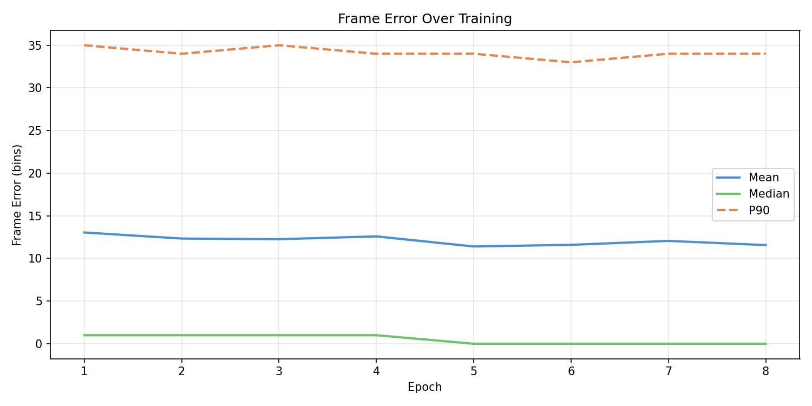

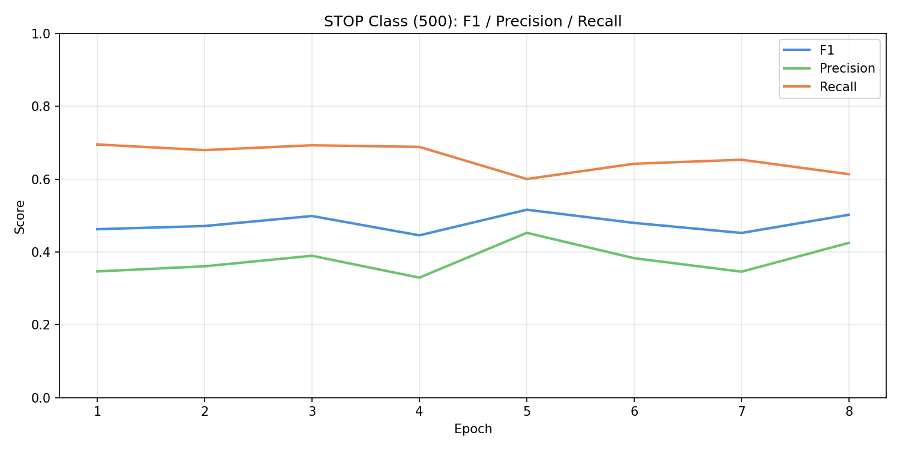

---

## librosa_flux - Spectral Flux Onset Detection

**Library:** librosa 0.11.0
**Method:** `librosa.onset.onset_detect` with default spectral flux onset strength function.
Computes the spectral flux (L1 norm of the positive difference in the spectrogram between frames)
and applies peak-picking to find onset frames.

**Results:**
- HIT: 0.7% | GOOD: 1.6% | Miss: 96.0%
- Frame error: mean 136.8, median 42, p90 475, p99 489
- Stop F1: 0.016 (recall 0.611 but precision 0.008)
- Model score: -0.713

**Prediction density heatmap:**

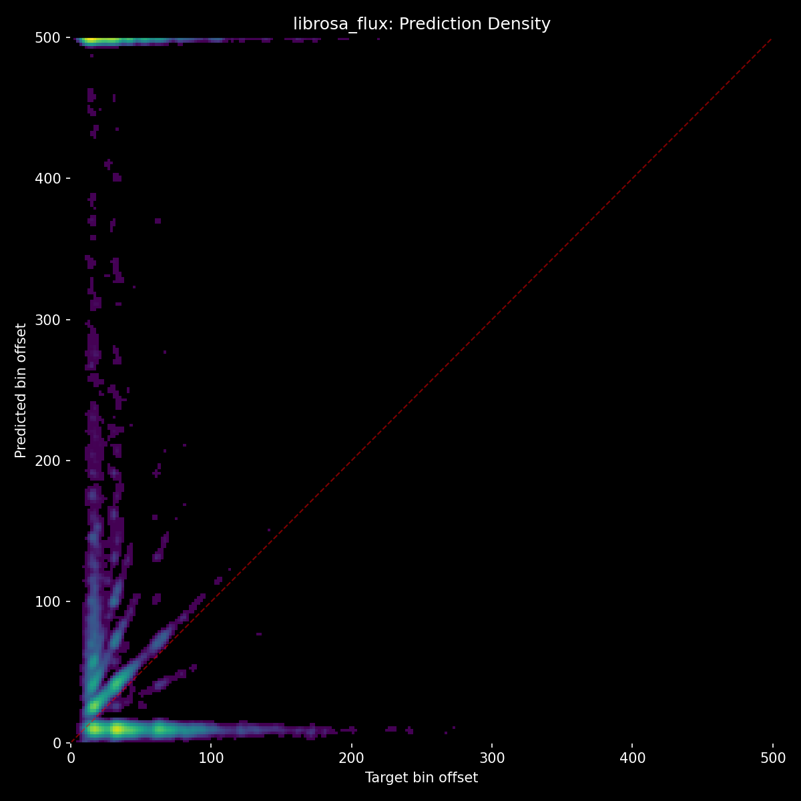

**Analysis:** The heatmap reveals two dominant failure modes. First, a bright horizontal band at
predicted=500 (STOP) across all target values - the algorithm detects so many onsets that
`searchsorted` often finds one almost immediately, but for samples where the cursor is past
all detected onsets, it defaults to STOP. Second, predictions cluster at very low bin values
(0-10) regardless of target, creating a bright horizontal band near the bottom. This happens
because spectral flux detects *every* audio transient - vocals, instrument attacks, percussion,
harmonic changes - producing an extremely dense onset grid. The next detected onset after any cursor
position is almost always just a few frames away, even when the actual taiko-mapped onset is
hundreds of frames ahead.

**Prediction distribution:**

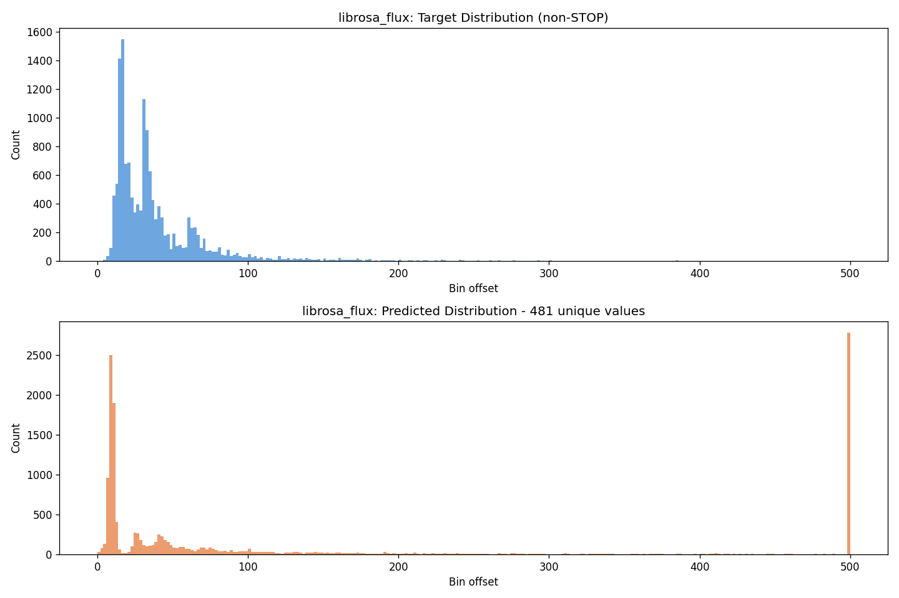

The predicted distribution is bimodal: a massive spike at bins 2-5 (most predictions) and another
at bin 500 (STOP). The target distribution spans bins 5-100+ with a natural shape. The algorithm
simply cannot produce the correct distribution because it detects too many onsets.

**Target vs Predicted scatter:**

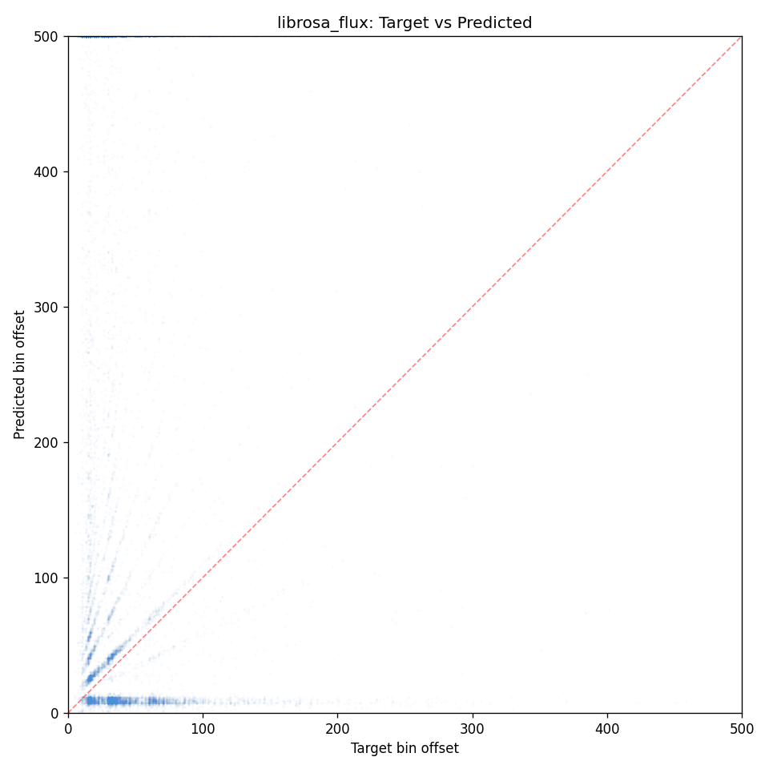

Nearly all points are compressed into the bottom strip (predicted < 10) or the top line (predicted = 500).
No diagonal structure is visible - the algorithm shows zero correlation with the actual targets.

---

## librosa_energy - RMS Energy Onset Detection

**Library:** librosa 0.11.0
**Method:** RMS energy computed from the power spectrogram, fed to `librosa.onset.onset_detect`
as a custom onset envelope. Detects onsets where the overall energy level spikes.

**Results:**
- HIT: 2.2% | GOOD: 4.5% | Miss: 90.6%
- Frame error: mean 58.8, median 24, p90 128, p99 484
- Stop F1: 0.040 (recall 0.417, precision 0.021)
- Model score: -0.563

**Prediction density heatmap:**

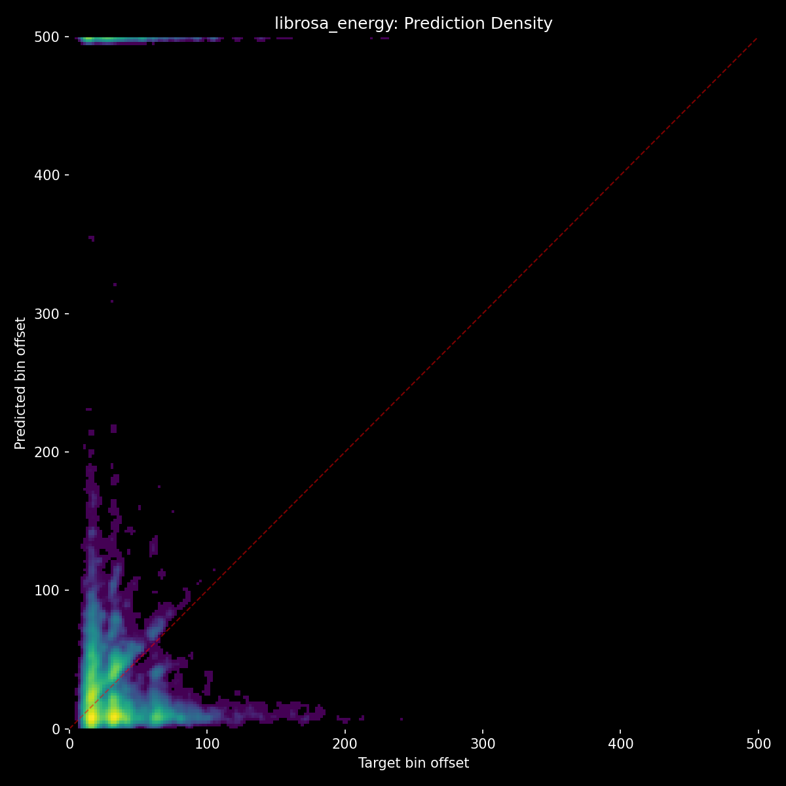

**Analysis:** Compared to spectral flux, the energy-based detector produces a more spread distribution
of predictions - the horizontal band is wider and less compressed to the bottom. This is because
RMS energy is a smoother, less sensitive feature than spectral flux, so it detects fewer onsets overall.
However, the heatmap still shows no diagonal structure. Predictions cluster in the 0-50 bin range
for all targets, with a secondary band at 500 (STOP). The slight improvement over spectral flux
comes from the lower onset density - with fewer detected onsets, predictions are sometimes
spread far enough apart to accidentally land near the correct target.

**Prediction distribution:**

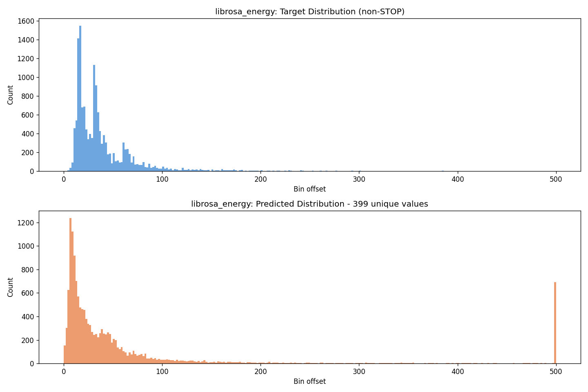

More spread than spectral flux (399 unique values vs 481), with a gentler peak at low bins
and a smaller STOP spike. But still heavily skewed toward small offsets compared to the target distribution.

**Target vs Predicted scatter:**

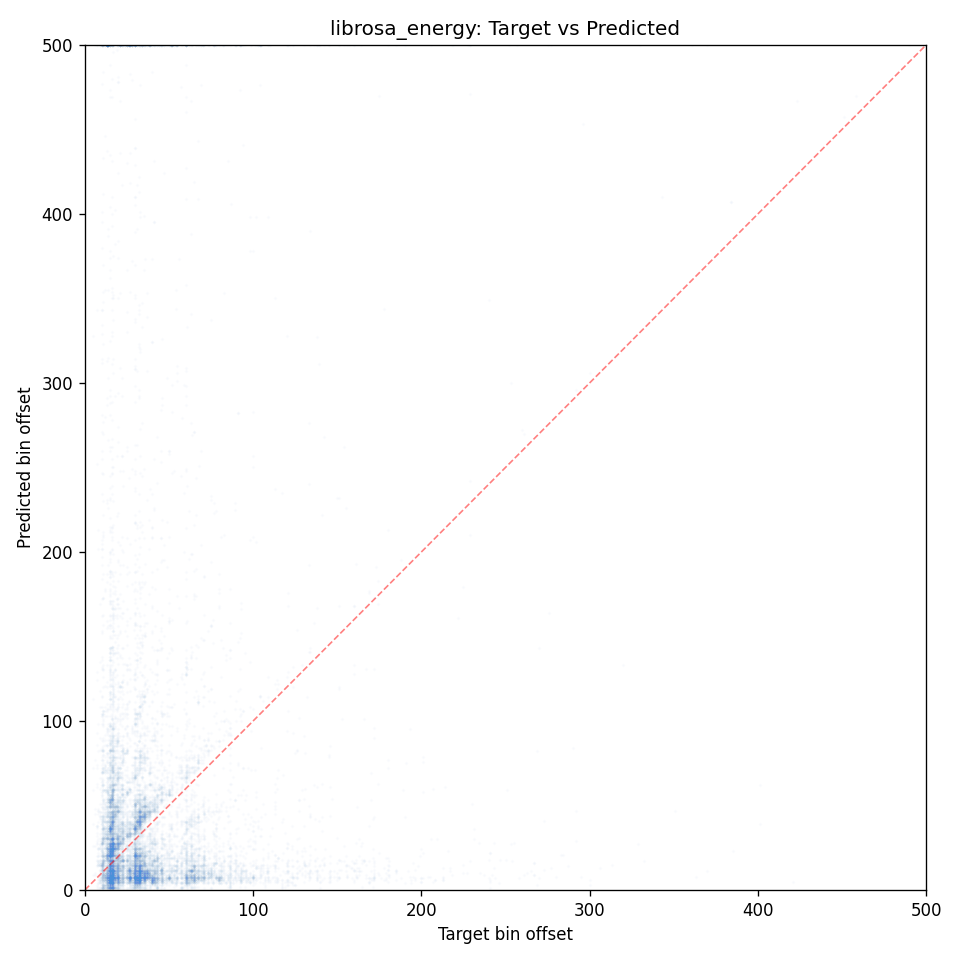

Slightly better spread than spectral flux - the point cloud extends up to ~150 in the predicted axis -
but still no diagonal correlation. The algorithm predicts small offsets regardless of the true target.

---

## aubio_hfc - High Frequency Content

**Library:** aubio 0.4.9
**Method:** High Frequency Content (HFC) onset detection. Weights the magnitude spectrum by frequency,
emphasizing high-frequency energy. Transients with sharp high-frequency content (percussive hits,
consonant attacks) produce strong peaks.

**Results:**
- HIT: 0.7% | GOOD: 2.4% | Miss: 93.0%
- Frame error: mean 69.4, median 28, p90 174, p99 487
- Stop F1: 0.040 (recall 0.444, precision 0.021)
- Model score: -0.682

**Prediction density heatmap:**

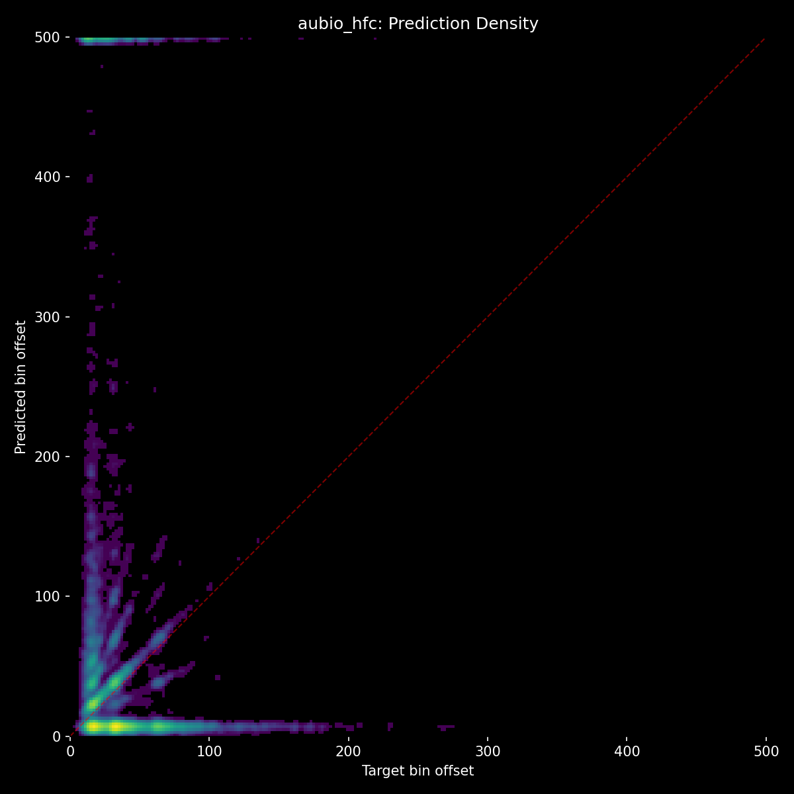

**Analysis:** Very similar pattern to spectral flux - predictions concentrated at low bin offsets
with a STOP band at 500. The heatmap shows distinctive fan-out rays from the origin, which are
caused by the algorithm detecting onsets at regular musical intervals (beat subdivisions) that don't
match the taiko chart's placement decisions. The slight spread of predictions into the 50-200
range is from songs where HFC detects fewer onsets (quieter passages, sparse arrangements),
but these are wrong in a different way - they land on arbitrary audio transients rather than
mapped onsets.

**Prediction distribution:**

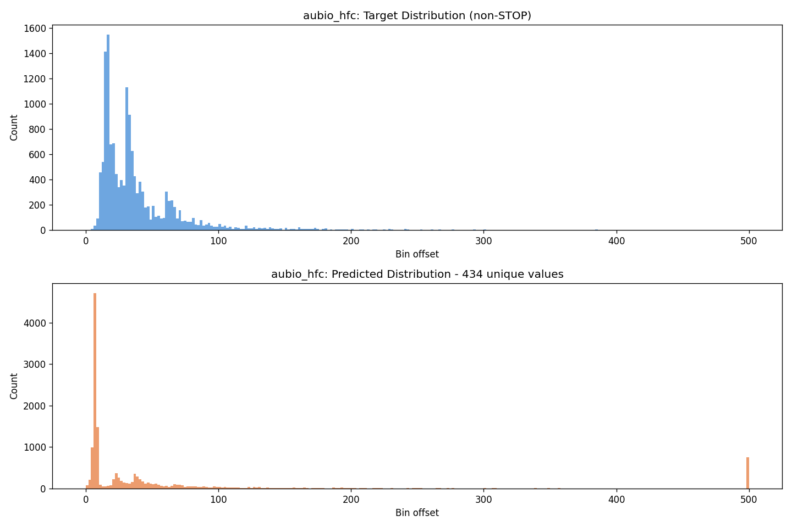

Dominated by a massive spike at bins 2-5 (~4,700 predictions), with small secondary peaks near
bins 30 and 60 (likely corresponding to common beat intervals). The STOP spike at 500 is moderate.

**Target vs Predicted scatter:**

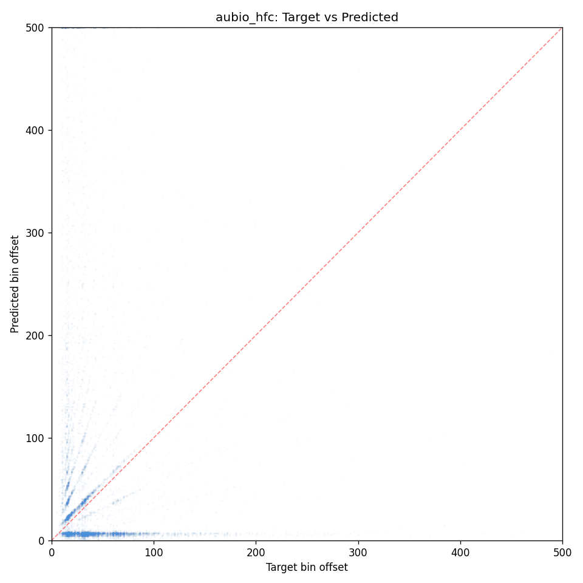

All predictions compressed to the bottom strip. Faint horizontal lines visible at specific
predicted values correspond to common inter-onset intervals in the audio.

---

## aubio_complex - Complex Domain Onset Detection

**Library:** aubio 0.4.9
**Method:** Complex domain onset detection. Uses both magnitude and phase information from the STFT,
detecting onsets where the complex spectrum deviates from the predicted steady-state.
More sensitive than energy-based methods, particularly to pitched onsets and subtle timbral changes.

**Results:**
- HIT: 0.9% | GOOD: 3.8% | Miss: 89.4%
- Frame error: mean 73.2, median 30, p90 191, p99 487
- Stop F1: 0.039 (recall 0.444, precision 0.021)
- Model score: -0.702

**Prediction density heatmap:**

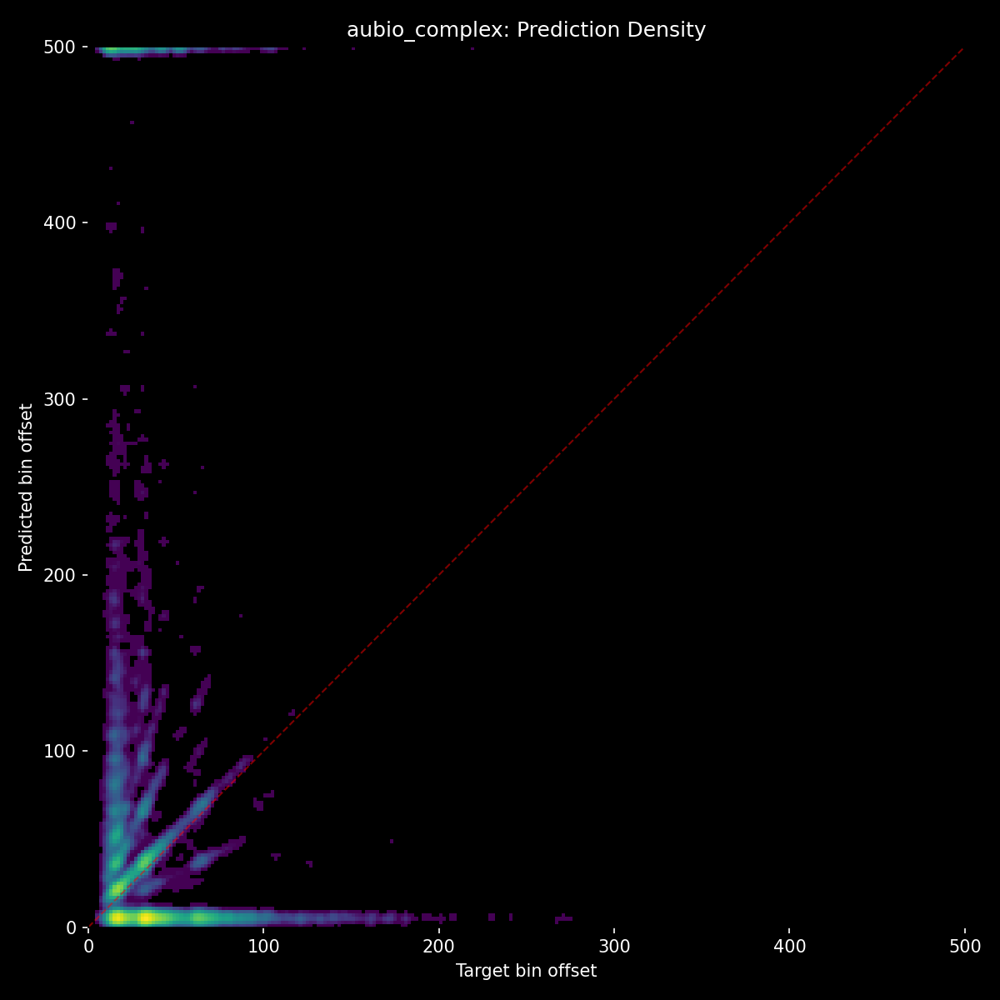

**Analysis:** Shows the widest spread of any aubio method - predictions extend up to ~200 in the
low-target region, with more prominent fan-out rays than HFC. The complex domain method detects
more subtle spectral changes (not just transients), including pitched note transitions and
harmonic shifts. This gives slightly better GOOD rate (3.8%) since some predictions land
further from zero, but the miss rate is still 89.4%. The visible ray structure radiating from
the origin suggests the algorithm picks up on regularly-spaced audio features (vibrato, tremolo,
rhythmic accompaniment patterns) that don't correspond to taiko hit placements.

**Prediction distribution:**

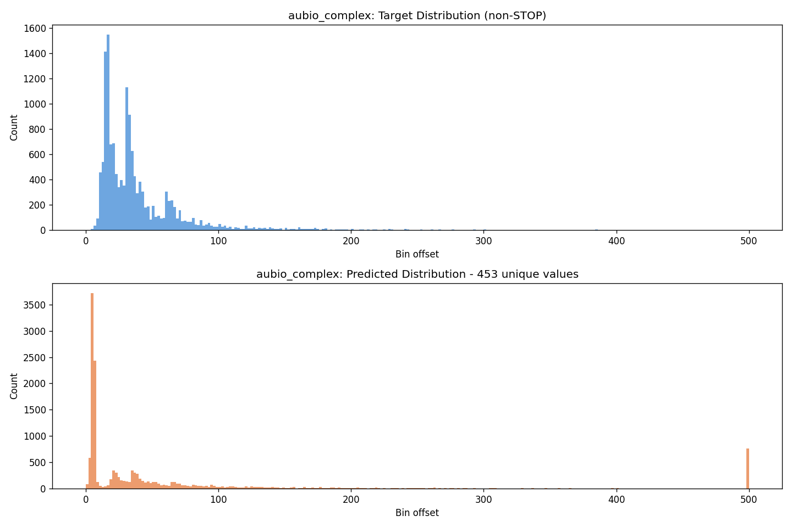

Peak at bins 2-5 is less extreme than HFC (~3,700 vs ~4,700), with a broader low-range tail
and more secondary peaks. 453 unique predicted values vs HFC's 434.

**Target vs Predicted scatter:**

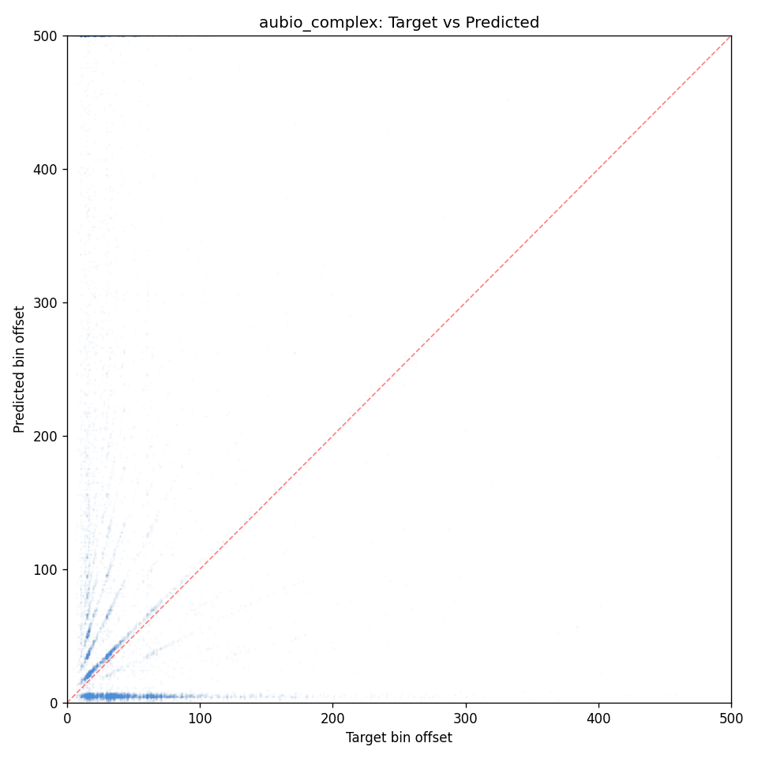

Marginally better spread than HFC, but still no diagonal structure. Points fan out slightly more
from the bottom axis.

---

## aubio_specflux - Spectral Flux (aubio implementation)

**Library:** aubio 0.4.9
**Method:** Spectral flux computed by aubio. Similar principle to librosa's spectral flux but
with aubio's own peak-picking and thresholding. Measures the positive half-wave rectified
difference between consecutive magnitude spectra.

**Results:**
- HIT: 1.3% | GOOD: 3.0% | Miss: 92.9%
- Frame error: mean 41.0, median 25, p90 75, p99 474
- Stop F1: 0.030 (recall 0.139, precision 0.017)
- Model score: -0.701

**Prediction density heatmap:**

**Analysis:** The most compact prediction distribution of any classical method - almost all
predictions fall below bin 100, with very little spread. The heatmap mass is concentrated at
the bottom-left corner with a tight STOP band. Aubio's spectral flux produces the densest
onset detection of any method tested (lowest stop rate at 13.9% vs 40-60% for others),
meaning it finds a nearby onset almost every time. The low frame error (mean 41, best
among classical methods tied with madmom) is somewhat misleading - it's low because predictions
are almost always small numbers, and small predictions have bounded maximum error. The very
low stop recall (13.9%) means it almost never predicts STOP, even when the cursor is in a
genuine gap between chart sections.

**Prediction distribution:**

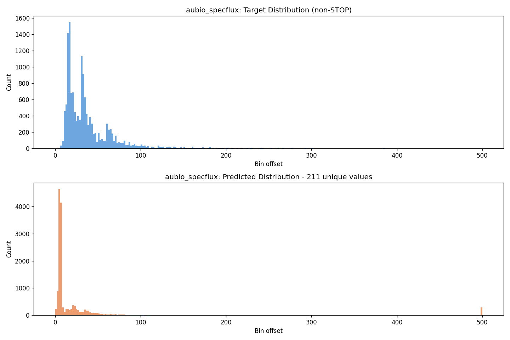

Only 211 unique predicted values - the narrowest range of all methods. Extremely concentrated
at bins 2-8, with virtually nothing above bin 100. The small STOP spike confirms very low
stop prediction rate.

**Target vs Predicted scatter:**

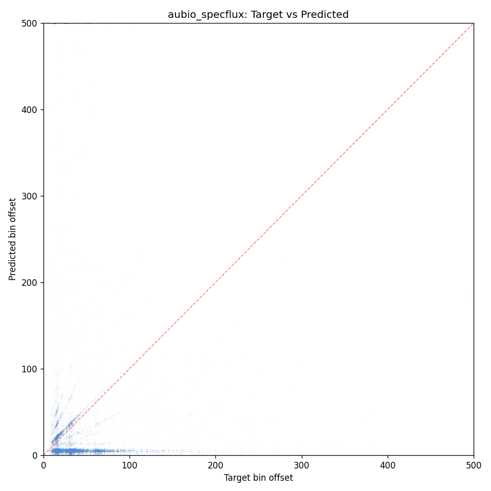

The tightest horizontal band - all points compressed below predicted=50 except for the STOP line.
Demonstrates that aubio's spectral flux is the most aggressive at detecting onsets, always finding
one within a few frames.

---

## madmom_rnn - Recurrent Neural Network Onset Detection

**Library:** madmom 0.17.dev0
**Method:** `madmom.features.onsets.RNNOnsetProcessor` - a pre-trained bidirectional LSTM
that outputs an onset activation function from the audio spectrogram. Combined with
`OnsetPeakPickingProcessor` for peak detection. Trained on a large corpus of general music
with annotated onsets.

**Results:**
- HIT: 0.8% | GOOD: 1.6% | Miss: 96.3%
- Frame error: mean 40.8, median 25, p90 73, p99 473
- Stop F1: 0.032 (recall 0.139, precision 0.018)
- Model score: -0.763

**Prediction density heatmap:**

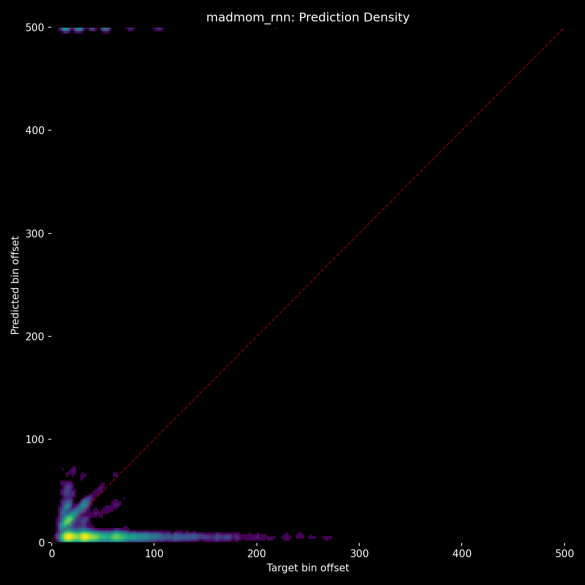

**Analysis:** Very similar to aubio_specflux - extremely tight prediction cluster at low bins
with a compact STOP band. The RNN produces the lowest frame error mean (40.8, tied with CNN)
but the worst HIT rate (0.8%) and highest miss rate (96.3%). This seeming contradiction exists
because the RNN detects onsets at musically meaningful positions (it understands musical structure
better than classical methods), but these positions are almost always *too close* - the next
audio onset from any cursor is typically just a few frames away, even though the taiko chart
skips many audio events. The RNN is effectively "too good" at onset detection for our task:
it finds musically valid onsets that a taiko mapper chose not to map.

**Prediction distribution:**

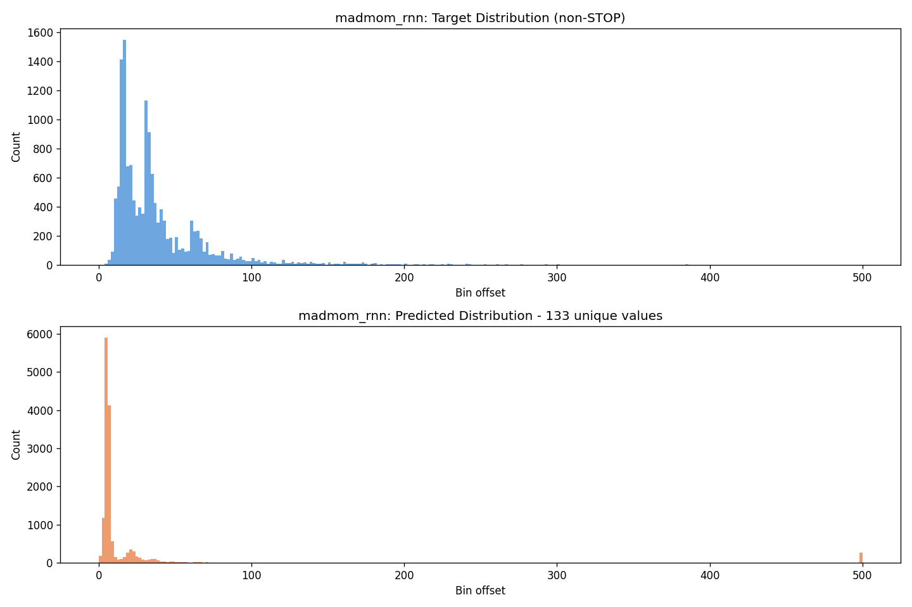

133 unique values - the second narrowest range. Massive spike at bins 2-4 (6,000+ predictions
at the peak), with tiny secondary peaks near bins 20-30. The RNN's onset density is very high,
giving it almost no spread.

**Target vs Predicted scatter:**

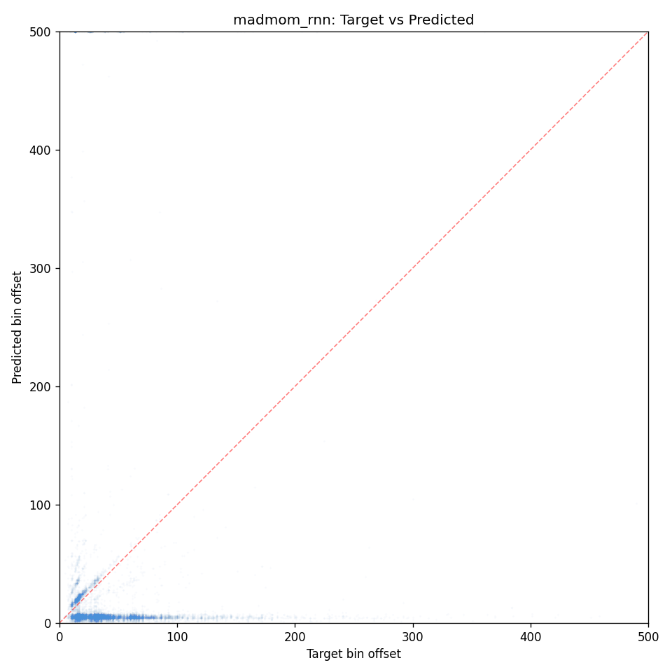

Extremely compressed horizontal band at the bottom. Slightly more structured than classical methods -
faint diagonal traces visible near the origin - but completely unable to predict targets above ~50 bins.

---

## madmom_cnn - Convolutional Neural Network Onset Detection

**Library:** madmom 0.17.dev0
**Method:** `madmom.features.onsets.CNNOnsetProcessor` - a pre-trained CNN that processes
the spectrogram with convolutional layers, producing an onset activation function.
Combined with `OnsetPeakPickingProcessor` for peak detection.

**Results:**
- HIT: 3.5% | GOOD: 7.8% | Miss: 89.2%
- Frame error: mean 40.8, median 26, p90 74, p99 473
- Stop F1: 0.064 (recall 0.278, precision 0.036)
- Model score: -0.769

**Prediction density heatmap:**

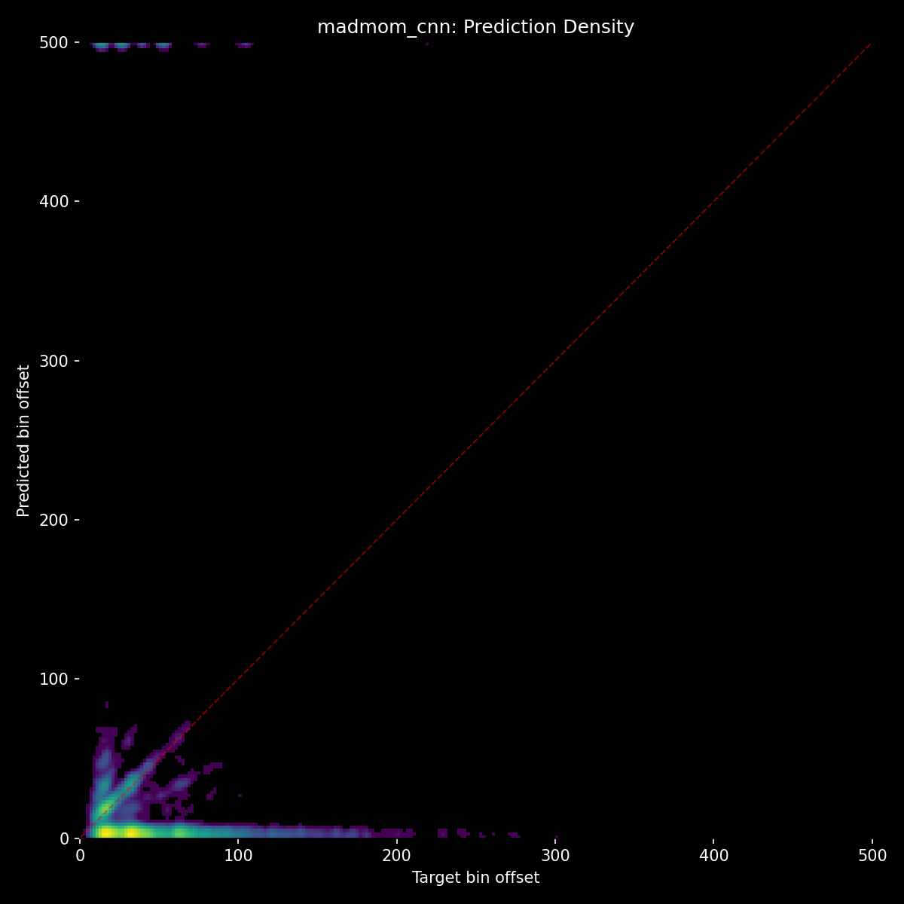

**Analysis:** The best-performing external algorithm. The heatmap shows a notably different structure
from the RNN: while still concentrated at low bins, the CNN has a visible *diagonal trace* in the
bottom-left region (targets 0-80, predictions 0-80). This means the CNN's onset detection spacing
occasionally aligns with taiko chart spacing for short-distance predictions. The CNN also has a
wider spread of predictions than the RNN (more mass in the 10-50 bin range rather than just 2-5),
which explains its 4x higher HIT rate. The CNN appears to be more selective about which transients
constitute onsets, producing a lower onset density that sometimes matches the charter's selection.

**Prediction distribution:**

125 unique values - the narrowest range of all methods, but the distribution is slightly wider
than the RNN's. Peak at bins 2-4 is ~6,300 (high), with secondary peaks at bins 8-12 and 20-30.
The wider secondary peaks are what give the CNN its relative advantage.

**Target vs Predicted scatter:**

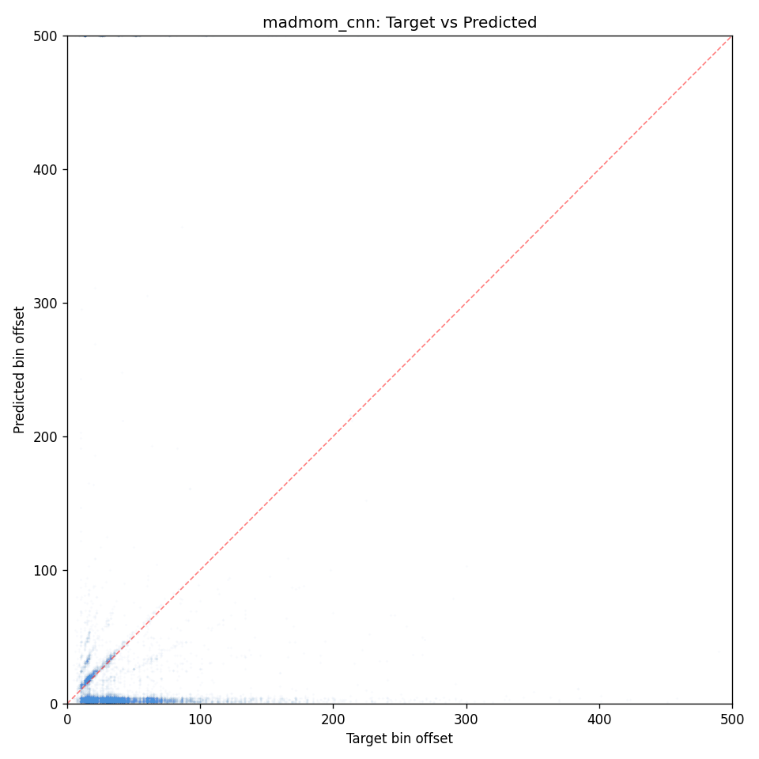

The most structured scatter of any baseline - faint diagonal traces visible for targets up to ~60,
and a slightly wider vertical spread than the RNN. Still no useful prediction ability above target ~100.

---

## Why Do All External Algorithms Fail?

The fundamental reason is a **task mismatch**. These algorithms answer the question *"where are the
audio transients?"* while our model answers *"where would an osu! taiko mapper place the next note?"*

Specific failure modes visible across all baselines:

1. **Over-detection (too many onsets):** Every algorithm detects far more onsets than a taiko chart contains.
   A typical song has hundreds of transients per minute (vocals, instruments, percussion, harmonics),
   but a taiko chart maps only a selective subset - often 2-8 per second during active sections.
   This means `searchsorted` almost always finds an onset within a few frames, producing tiny
   predicted offsets regardless of the actual target.

2. **No chart context awareness:** A taiko mapper's decisions depend on the *existing chart pattern* -
   the density, rhythm, spacing, and difficulty context of surrounding notes. External algorithms
   have no concept of this. They'll detect the same audio onset whether the chart is in a dense
   stream section or a calm break.

3. **No STOP understanding:** Predicting "there are no more notes" (STOP) requires understanding
   that the chart has ended or entered a deliberate gap. Onset detectors can only output STOP
   when there are literally no more transients in the audio - which almost never happens, since
   even "silent" sections contain background noise, reverb tails, or ambient sounds.

4. **Genre/difficulty blindness:** A mapper creating a Normal difficulty chart maps far fewer notes
   than one creating an Inner Oni. The same audio produces very different charts at different
   difficulty levels. External algorithms have one fixed sensitivity - they cannot adapt to the
   intended mapping density.

The 20x performance gap (3.5% HIT for the best baseline vs 68.9% for Exp 14) confirms that
taiko onset prediction is a fundamentally different task from audio onset detection, requiring
learned knowledge of mapping conventions, chart context, and community preferences.
