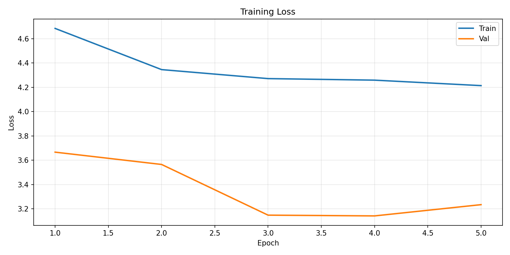
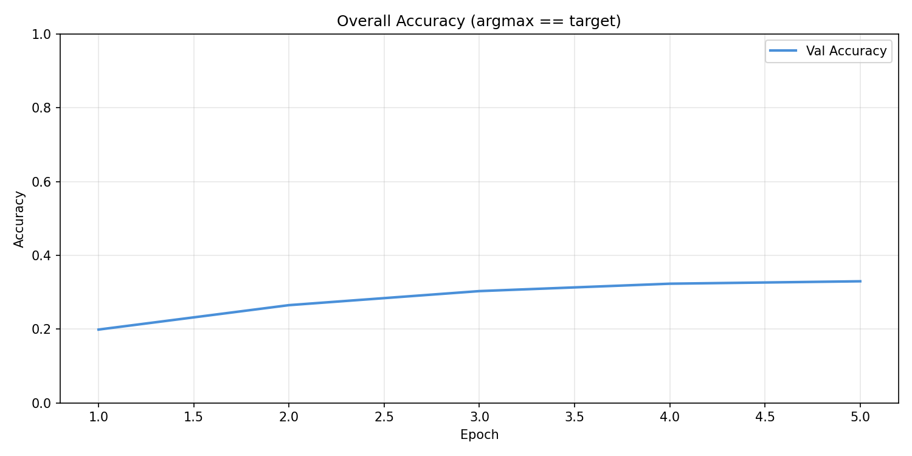
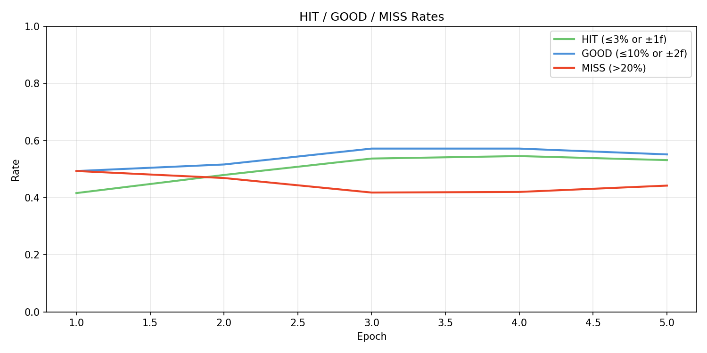
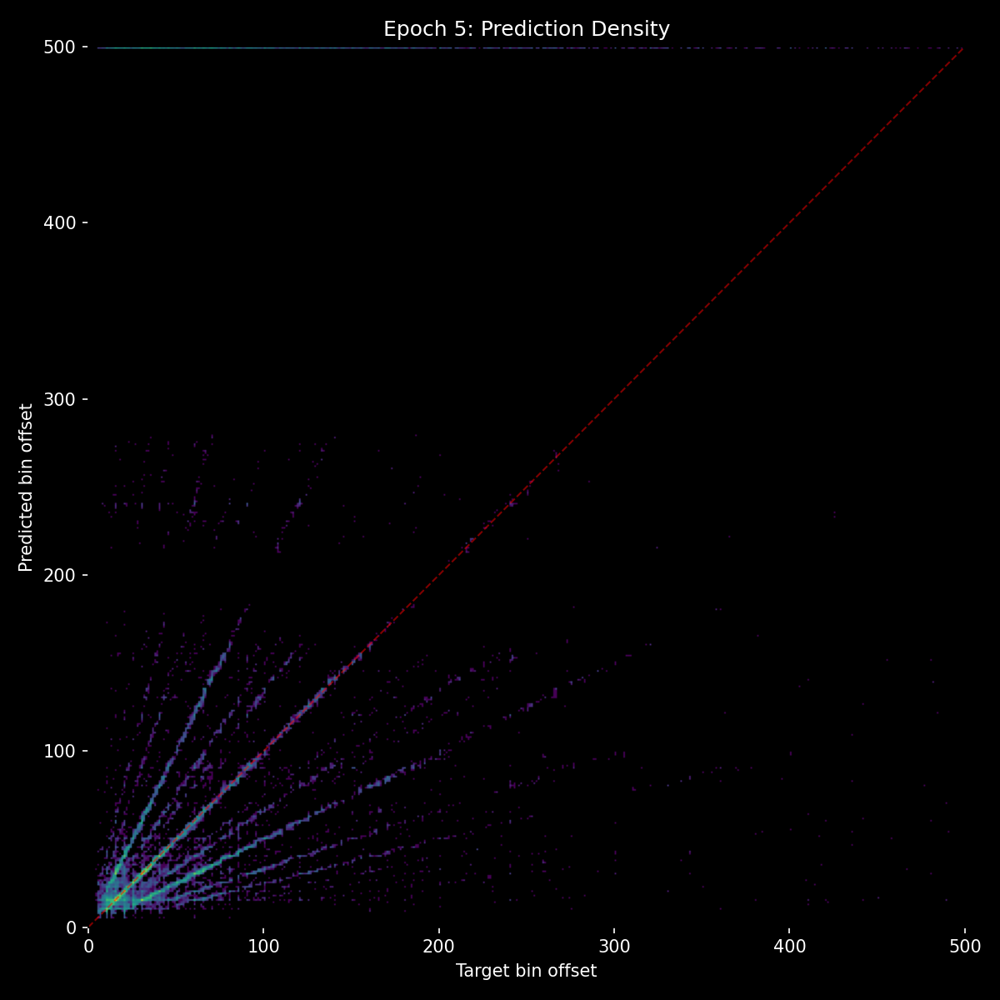
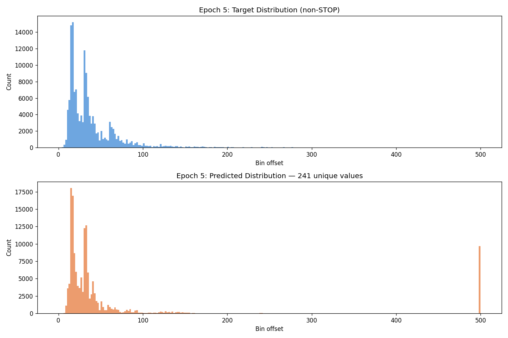

# Experiment 05 - Gaussian Soft Targets

## Hypothesis

The model can't predict larger gap sizes because the loss treats all absolute errors equally - missing by 10 bins on a target of 15 is punished the same as missing by 10 bins on a target of 200, even though the first is a 67% error and the second is a 5% error. By switching to a log-ratio loss with Gaussian soft targets (log_sigma=0.04), the error becomes proportional: guessing frame 4 on target 8 is punished the same as guessing frame 40 on target 80. This should unlock the model's ability to learn across all bin ranges rather than clustering predictions in the low bins.

Additionally, FiLM conditioning and balanced sampling were added to address class imbalance - rare large-gap classes were being drowned out.

## Result

| Metric | E1 | E3 | E5 |
|--------|-----|-----|-----|
| val_loss | 3.666 | 3.387 | 3.234 |
| accuracy | 19.9% | 27.2% | 33.0% |
| hit_rate | 41.6% | 48.4% | 53.2% |
| stop_f1 | 0.087 | 0.081 | 0.075 |
| frame_error_median | 3.0 | 2.0 | 1.0 |
| within_2_frames | 48.0% | 51.2% | 54.9% |

The loss kept dropping with no slowdown through all 5 epochs - the model was still actively learning. But the scatter plots told a different story: they showed clear straight lines at musical ratios (1/2, 2/1, 1/4, 4/1, 1/3, 3/1). The model had learned BPM extremely well - it knew exactly how each note type aligns with the beat. But it wasn't detecting actual onsets from the audio. It was detecting the rough tempo and predicting at that interval.

In other words, it became a very good metronome, but not a beat detector. Inference on real songs confirmed this: predictions followed a steady rhythm regardless of what was actually happening in the music.

Stop prediction was essentially non-functional (F1=0.075 and declining), meaning the model never learned when to NOT predict a beat.

## Lesson

Gaussian soft targets are fundamentally flawed for this task. Their infinite tails give partial credit to harmonic predictions - predicting at 2x or 0.5x the true gap still falls under the Gaussian bell curve. The model exploits this by becoming a metronome: if it predicts at the right tempo, it gets partial credit for nearly every sample, even when individual onsets are completely wrong. The loss decreases, metrics improve, but the model isn't actually learning onset detection.

The fix needs to be a hard cutoff - beyond some error threshold, the prediction is a total failure with zero credit. No more infinite tails rewarding harmonic coincidences.
