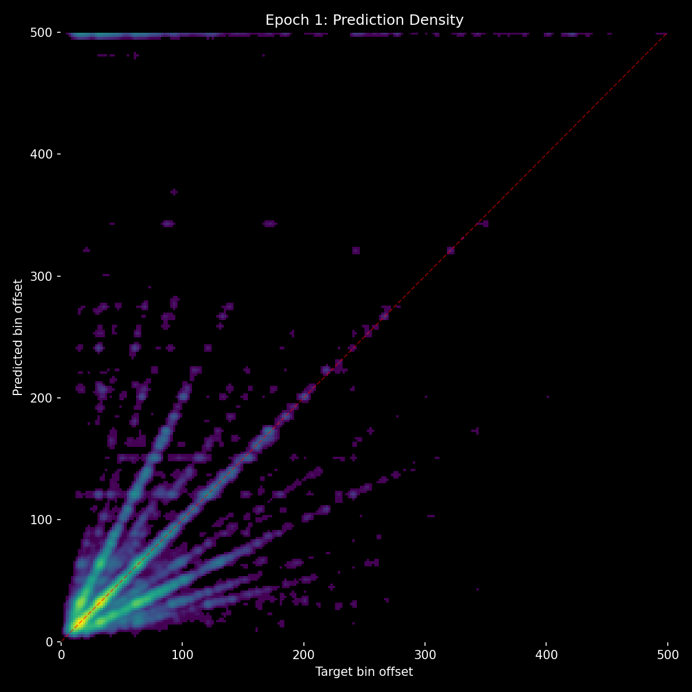
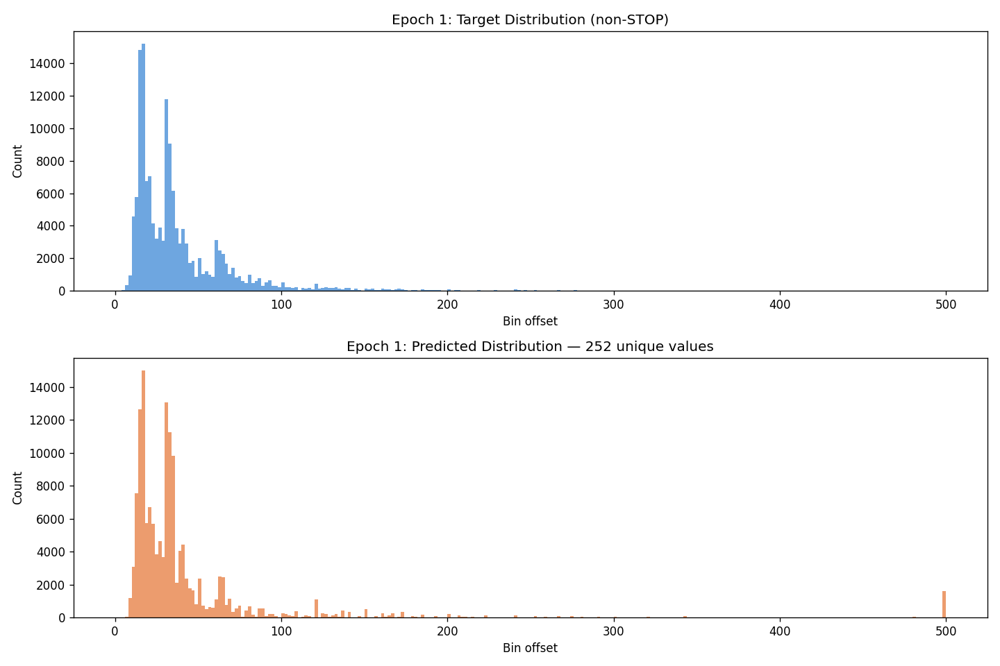
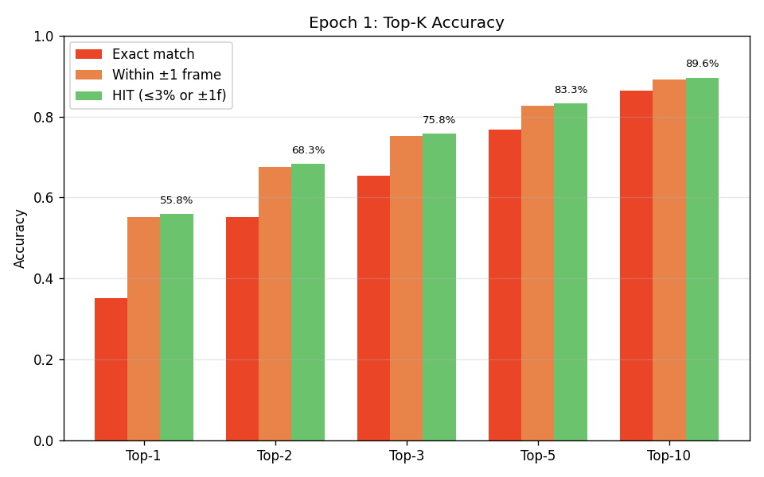
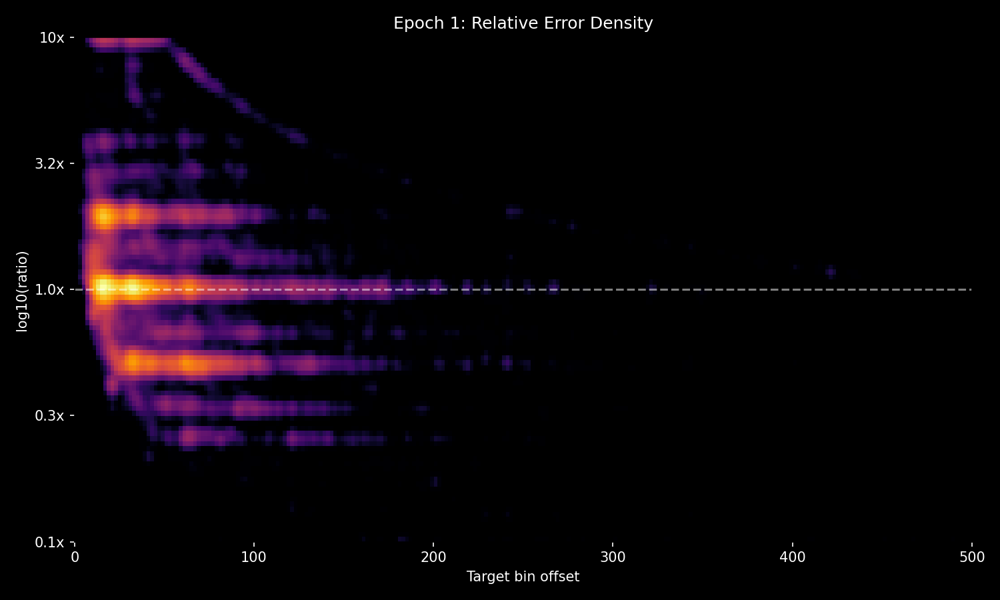
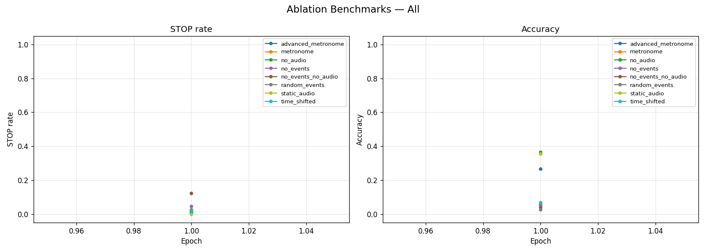

# Experiment 06 — Trapezoid Soft Targets + Ablation Benchmarks

## Hypothesis

The Gaussian loss from exp 05 rewards harmonic predictions through its infinite tails, driving the model to become a metronome instead of a beat detector. The solution is a hard cutoff in the loss: if the model errs by more than 20%, that's a total failure — zero credit, same as a random guess. Within 3% is good — full credit. Between 3% and 20% gets linearly decreasing credit. This creates a trapezoid shape in log-ratio space that preserves the proportionality of the error (small targets and large targets are treated equally) but eliminates the harmonic reward that Gaussian tails create.

Soft targets remain critical — the model still needs partial credit for near-misses to learn from. The change is purely in the shape of the credit function: trapezoid with hard walls instead of Gaussian with infinite tails.

A mix of 50% hard cross-entropy and 50% soft cross-entropy was used, plus a frame-distance floor (±2 frames always get some credit) so that tiny targets like t=2 don't have zero-width plateaus.

Additionally, 8 ablation benchmarks were introduced to systematically probe model behavior — running the model on corrupted inputs to measure how much it relies on audio vs event context.

## Result

| Metric | Exp 05 E5 | Exp 06 E1 |
|--------|-----------|-----------|
| accuracy | 33.0% | **35.3%** |
| hit_rate | 53.2% | **55.8%** |
| stop_f1 | 0.075 | **0.279** |
| frame_error_median | 1.0 | 1.0 |
| within_2_frames | 54.9% | **57.6%** |

At just epoch 1, the trapezoid loss surpassed exp 05's best results from epoch 5. Stop F1 jumped almost 4x, meaning the model finally started learning when to predict STOP. But running inference on real songs still showed metronoming behavior. Top-K analysis revealed why: top-5 jumped from 35% to 64% hit rate, and top-10 reached 77%. The correct answers were in the model's top candidates — it just wasn't ranking them first. It was taking "safe bets," predicting at the dominant tempo because that maximizes expected reward.

The ablation benchmarks exposed a much deeper problem:

| Benchmark | Accuracy | What it means |
|-----------|----------|---------------|
| no_events | 5.3% | Audio alone gives the model almost nothing |
| no_audio | **36.5%** | Events alone are more useful than the full model's top-1 |
| random_events | 2.7% | Random events actively destroy performance |
| static_audio | 35.6% | Replacing audio with noise barely changes anything |
| no_events_no_audio | 3.8% | With nothing, model still doesn't predict STOP much (64% STOP rate) |
| metronome | 6.0% | Model follows fake metronome events to wrong answers |
| time_shifted | 6.8% | Shifting event timing completely breaks the model |
| advanced_metronome | 26.8% | Quantized-to-BPM events partially work |

The model relies massively on events and barely uses audio. no_audio accuracy (36.5%) is higher than no_events (5.3%) — the exact opposite of what a beat detector should do. The metronome benchmark at 6.0% (vs no_events at 5.3%) proves the model IS parroting the fake events — if it used audio to override them, it would score closer to 36%.

## Lesson

The trapezoid loss is a clear improvement — it stopped rewarding harmonic metronoming and gave real STOP learning for the first time. But the benchmarks revealed that the loss function was never the real bottleneck. The model over-relies on event context (no_audio=36.5%) and barely uses audio (no_events=5.3%). Low accuracy on metronome and time_shifted benchmarks means the model follows events to wrong answers even when the audio clearly disagrees. This is an architectural problem: in the single-path decoder, events get to influence predictions through cross-attention, and the model learns that events are an easier signal than audio. No loss function change will fix this — the architecture needs to enforce that audio is the primary signal.
