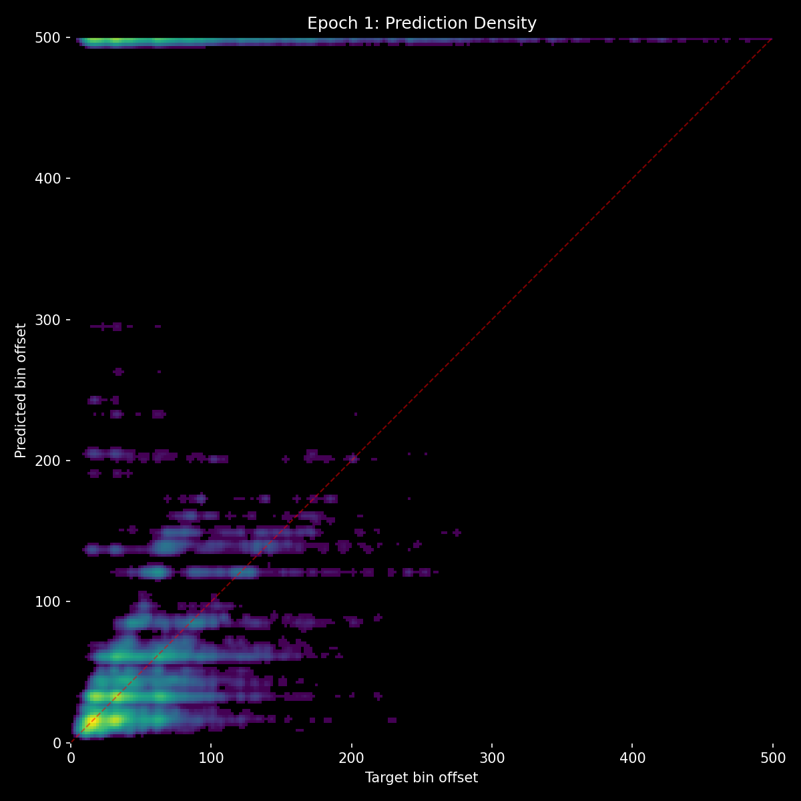
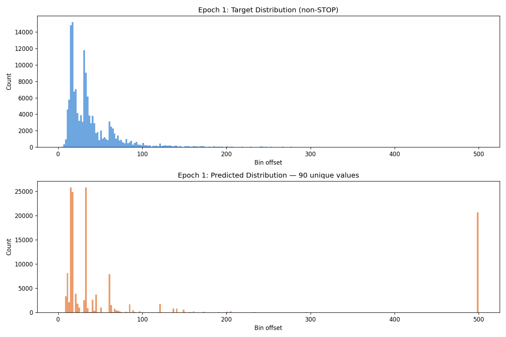
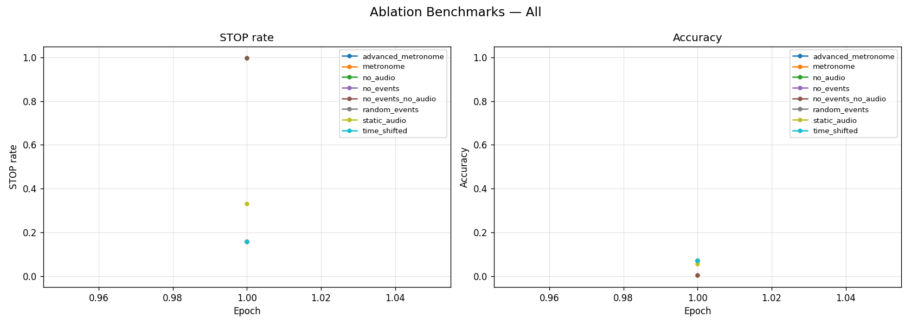

# Experiment 07 — Heavy Context Augmentation (Failed)

## Hypothesis

Benchmarks from exp 06 showed the model relies on events (no_audio=36.5%) far more than audio (no_events=5.3%). If the model learns during training that event context is unreliable, it should be forced to fall back on audio — the signal we actually want it to use. By aggressively corrupting event context during training (25% full dropout, 15% time-warping, 10% gap-shuffling), the model should learn that events can be misleading and develop stronger audio reliance as compensation.

Additionally, stop_weight was increased to 3.0 (3x penalty for missing STOP predictions) to address the model's reluctance to predict STOP.

## Result

| Metric | Exp 06 E1 | Exp 07 E1 |
|--------|-----------|-----------|
| accuracy | 35.3% | **8.1%** |
| hit_rate | 55.8% | **17.5%** |
| stop_f1 | 0.279 | **0.041** |
| frame_error_median | 1.0 | **12.0** |
| miss_rate | 40.6% | **63.1%** |

Complete collapse across every metric. Accuracy dropped by 77%, hit rate by 69%, and median frame error went from 1 to 12. The model essentially stopped producing useful predictions.

The benchmarks told the story: all corrupted conditions gave near-identical ~15.8% accuracy. Whether events were absent, randomized, or fake — the result was the same. Events had zero influence on predictions. The model had learned to completely ignore event context.

## Lesson

There is a critical difference between making context unreliable (the data can be misleading, so the model should cross-reference with audio) and making context absent (the data is just noise, so the model should ignore it). Heavy augmentation teaches the latter. When 25% of training samples have no events and another 25% have warped/shuffled events, the model rationally concludes that events are not worth attending to. It doesn't learn to "use audio as a fallback" — it learns to "never use events."

The goal was for the model to detect when events are misleading and override them with audio. That requires the model to still ATTEND to events, compare them against audio, and make a judgment. You can't teach judgment by removing the thing it needs to judge.

Stop_weight=3.0 was also too aggressive — it made the model default to STOP whenever it was uncertain rather than making a prediction.
