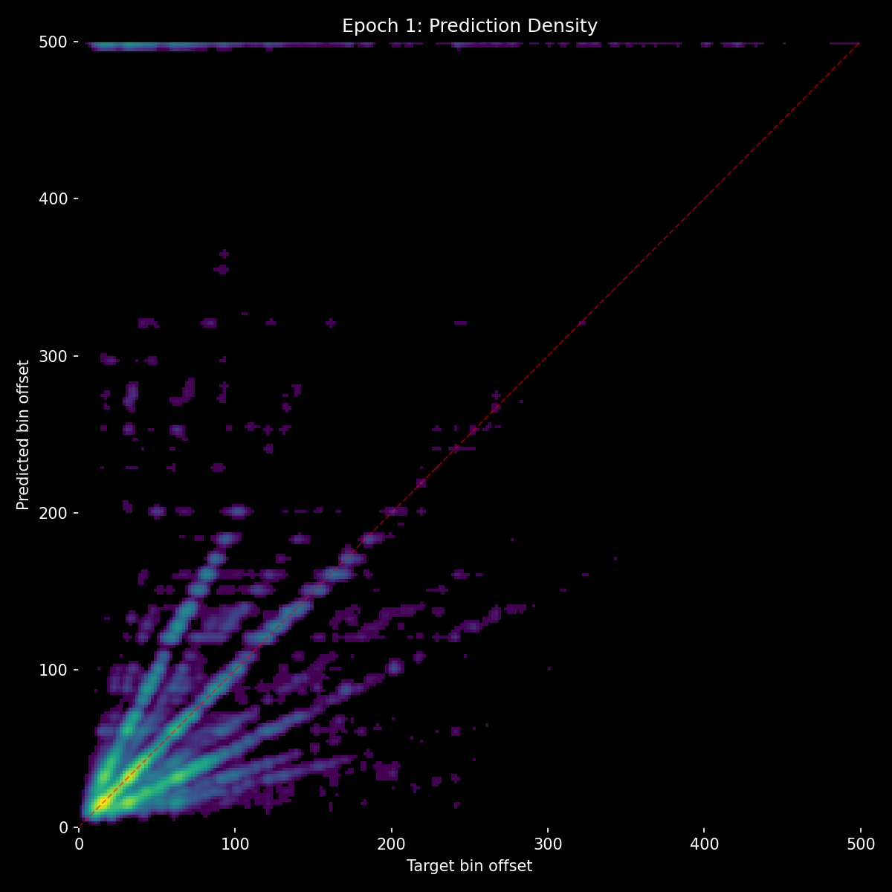
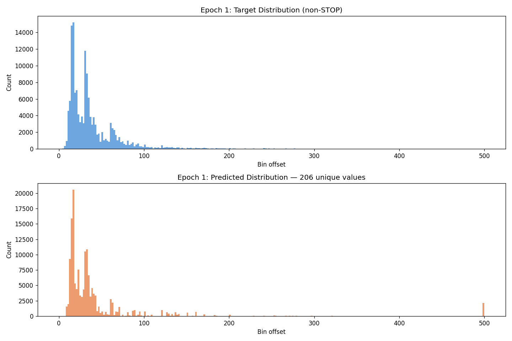
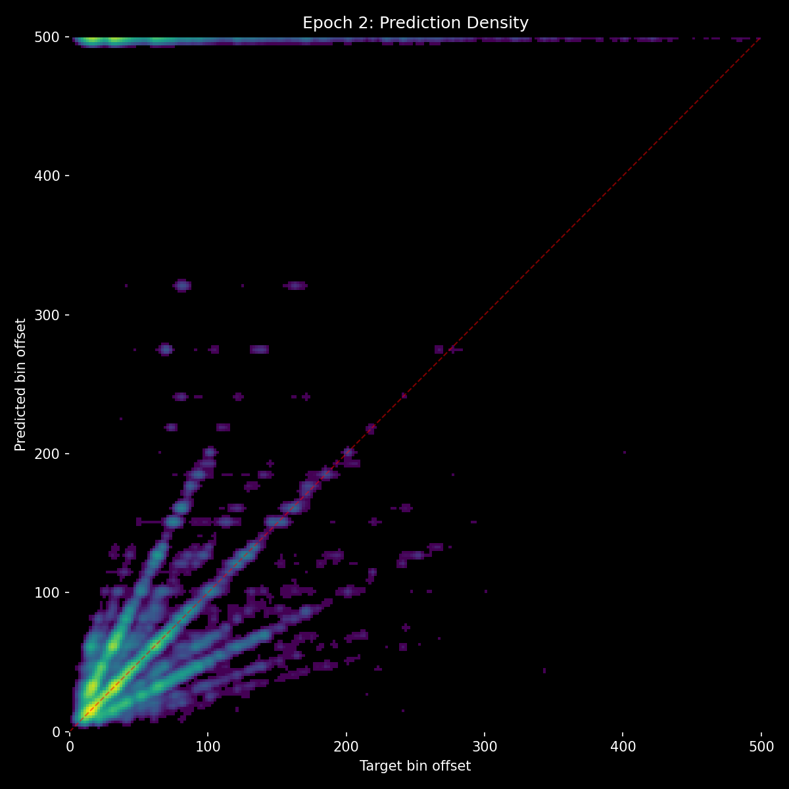
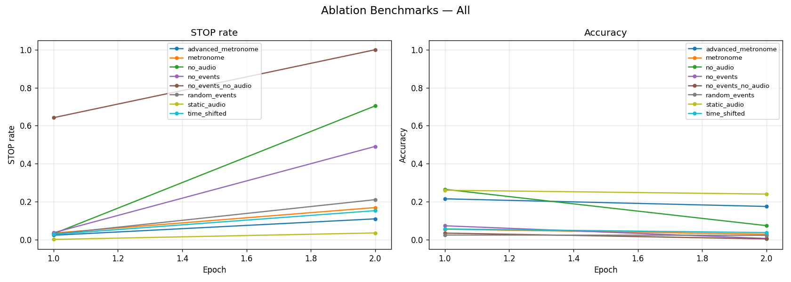

# Experiment 09 - Reverted to Light Augmentation

> **[Full Architecture Specification](ARCHITECTURE.md)** — self-contained reproduction guide with all model, loss, training, and dataset details.

## Hypothesis

Exp [07](../experiment_07/README.md) (heavy augmentation) killed event learning, and exp 08 (lightened augmentation with reduced stop_weight) gave mixed results with dead zones in predictions. The hypothesis for this run is simple: fully revert to the original light augmentation (5% context dropout, 10% truncation) with stop_weight=1.5, and see if the original augmentation strategy at least produces a stable training trajectory. This should establish a clean baseline to compare against before trying any more changes.

## Result

| Metric | E1 | E2 |
|--------|-----|-----|
| val_loss | 3.295 | 3.593 |
| accuracy | 26.4% | 23.4% |
| hit_rate | 49.8% | 44.7% |
| stop_f1 | 0.234 | 0.049 |
| frame_error_median | 2.0 | 4.0 |

Epoch 2 regressed on every metric - accuracy dropped from 26.4% to 23.4%, val_loss increased, and stop_f1 collapsed from 0.234 to 0.049. The training was unstable.

The audio/event imbalance persisted unchanged:

| Benchmark | Accuracy | Notes |
|-----------|----------|-------|
| no_events | 7.3% | Audio alone still nearly useless |
| no_audio | **26.5%** | Events still the dominant signal |
| random_events | 2.4% | Random events destroy accuracy |
| static_audio | 26.0% | Noise audio ≈ no change (audio isn't used) |
| no_events_no_audio | 3.4% | Model doesn't predict STOP (only 64% STOP rate) |
| metronome | **5.5%** | Model parrots fake events to wrong answers |
| time_shifted | **5.6%** | Shifted context breaks the model |
| advanced_metronome | 21.5% | Quantized events partially work |

If the model used audio to override the fake events, it would score around 26% (the no_audio baseline). Scoring 5.5% means the fake events actively drag the model away from audio-based predictions. The model trusts events over audio even when events are completely wrong.

Dead zones were also observed in the prediction distribution - certain bin classes were never predicted, visible as gaps in the scatter plot and heatmap.

## Lesson

Three consecutive experiments of augmentation tuning ([07](../experiment_07/README.md), 08, 09) all show the same fundamental pattern: no_audio >> no_events regardless of how much or how little context corruption is applied. Heavy augmentation makes the model ignore events. Light augmentation lets the model over-rely on events. No augmentation level produces the desired balance where the model uses audio as the primary signal and events as secondary.

The conclusion is unavoidable: the audio/event imbalance is architectural, not a training data problem. In the single-path decoder, event tokens participate in cross-attention alongside audio tokens, and the model learns to rely on whichever signal gives easier gradient flow - which is events, because rhythmic patterns in events are simpler to latch onto than spectral patterns in audio. The architecture needs to be redesigned so that audio and events have structurally separate roles.
