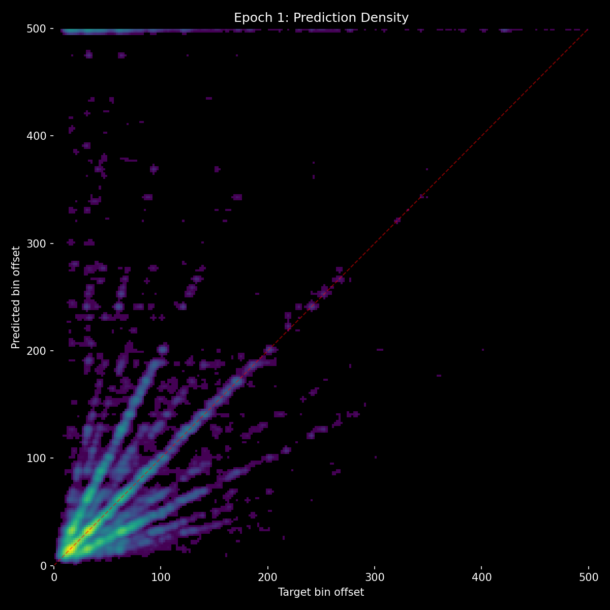
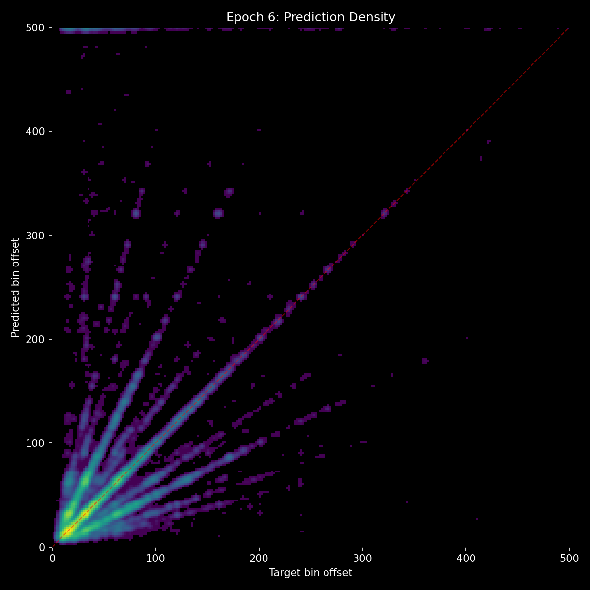
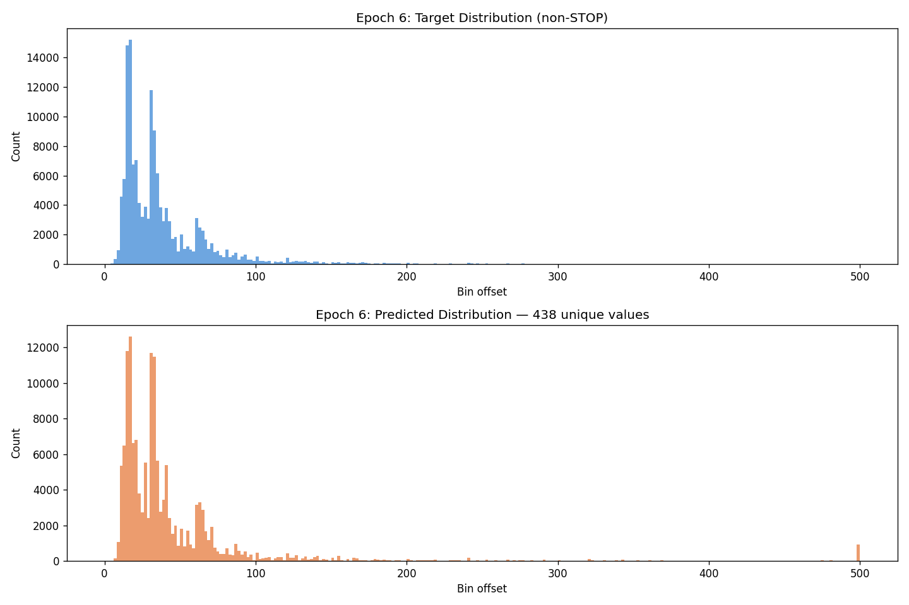
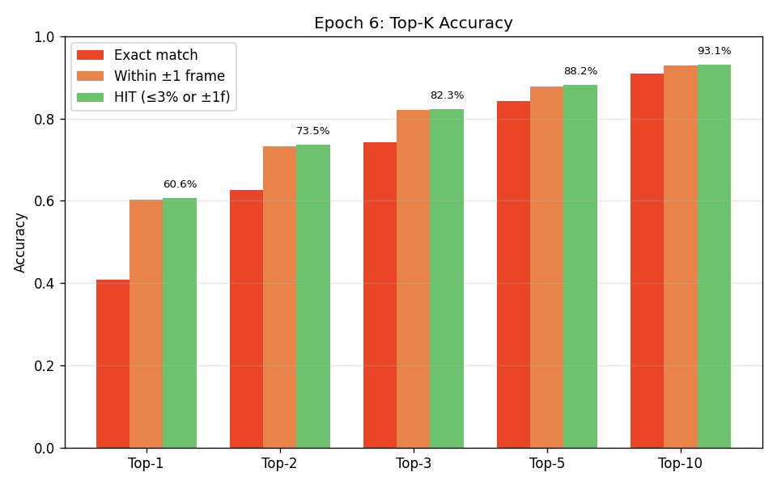
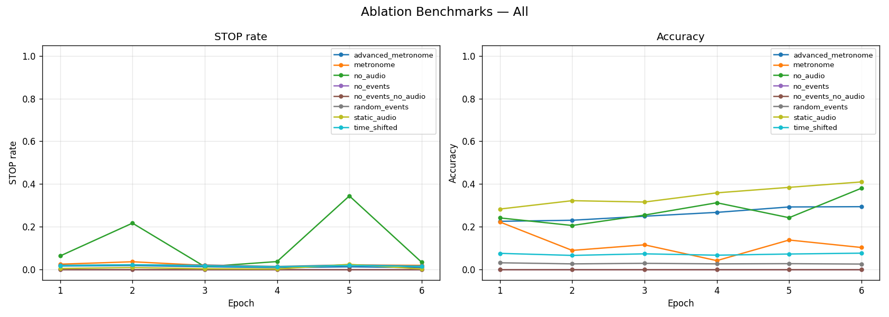

# Experiment 10 - Two-Path Architecture (NaN Bug)

## Hypothesis

Three experiments confirmed the audio/event imbalance is architectural. The single-path decoder lets events dominate because both signals compete in the same cross-attention mechanism, and events are an easier signal to learn from. The solution is to separate the model into two paths with structurally distinct roles:

- **Audio Path** (proposer): Primarily attends to audio, with light cross-attention to events. Its job is to identify where in the spectrogram beats could plausibly occur - producing broad candidate logits over many possible positions.
- **Context Path** (selector): Primarily attends to event history, with light cross-attention to audio. Its job is to select which of the audio path's candidates best fits the rhythmic context - producing selection logits that sharpen the final prediction.
- **Combined**: audio_logits + context_logits. Addition in logit space = multiplication in probability space, meaning if the audio path says "no beat here" (large negative logit), the context path cannot override it. Audio has veto power.

Both paths still cross-attend to each other (audio path sees events, context path sees audio) but with fewer layers, ensuring each path has a primary modality. Density conditioning via FiLM was applied to every transformer layer in every component (12 FiLM layers total) to make density influence pervasive.

The event encoder was bottlenecked at d_event=128 (vs d_model=384) to physically limit how much rhythmic information can flow through events. An auxiliary audio-only loss (0.2x weight) forces the audio path to learn useful representations independently of the context path.

1D conv smoothing heads (residual, kernel=5, 8 channels) were added to the output of both paths to prevent dead zones in predictions - the problem observed in exp 08/09 where certain bin classes were never predicted.

## Result

| Metric | E1 | E3 | E6 |
|--------|-----|-----|-----|
| val_loss | **NaN** | **NaN** | **NaN** |
| accuracy | 26.9% | 33.8% | 40.8% |
| hit_rate | 49.5% | 55.3% | 60.6% |
| stop_f1 | 0.261 | 0.309 | 0.381 |
| frame_error_median | 2.0 | 1.0 | 1.0 |
| top-10 hit | - | - | 93.1% |
| unique preds | - | - | 438 |

The model trained and improved steadily for 6 epochs, reaching 40.8% accuracy and a 93.1% top-10 hit rate - meaning the correct answer was in the model's top 10 candidates 93% of the time. The prediction distribution showed 438 unique values, a massive improvement over the dead-zone patterns from exp 09.

But **val_loss was NaN in every single epoch**. `best.pt` was never saved because NaN < best_val_loss always evaluates to False.

| Benchmark | E1 | E6 | Status |
|-----------|-----|-----|--------|
| no_events | **0.0%** | **0.0%** | Broken |
| no_audio | 24.1% | 38.0% | Rising (bad) |
| no_events_no_audio STOP | **0.0%** | **0.0%** | Broken |
| metronome | 22.2% | 10.3% | Fluctuating |
| time_shifted | - | 7.1% | Still fragile |

no_events and no_events_no_audio were completely broken - always 0% accuracy and 0% STOP rate.

**Root cause:** When all events are masked (a sample with no prior events), PyTorch's `TransformerEncoderLayer` computes softmax over all `-inf` attention scores, producing NaN. This NaN propagated through the EventEncoder into both the AudioPath (via cross-attention to NaN event tokens) and the ContextPath (operating directly on NaN event tokens). Every component produced NaN output for any sample with zero events. Since val_loss accumulated across batches, a single NaN sample made the entire epoch's val_loss NaN.

During training, these NaN-affected samples also produced NaN gradients, meaning the model never learned what to do when events are absent - which is exactly the signal the context path needs to fall back on audio.

no_audio also rose from 24% to 38% over 6 epochs, suggesting that even with the two-path architecture, the event path was becoming increasingly dominant as training progressed.

## Lesson

The two-path architecture works conceptually - 93.1% top-10 hit rate shows the audio path proposes excellent candidates, and 40.8% accuracy at E6 is the best yet. But all-masked attention producing NaN is a silent, devastating bug. It doesn't throw errors during training, doesn't show up in train_loss, and isn't obvious unless you specifically check val_loss and the no_events benchmarks. It corrupts training gradually (NaN gradients on affected samples), prevents saving the best checkpoint, and makes certain benchmarks meaningless.

The fix is simple: when all events are masked, unmask a dummy position whose content is just positional encoding of offset 0. The transformer can then compute valid attention without changing the semantic meaning (there are still no real events). This needs to be applied in both the EventEncoder (self-attention) and the AudioPath (cross-attention to events).

The no_audio rise to 38% also shows that the architecture alone doesn't guarantee the right balance - the context path may need its own dedicated training signal and more capacity to properly fulfill its selector role.
