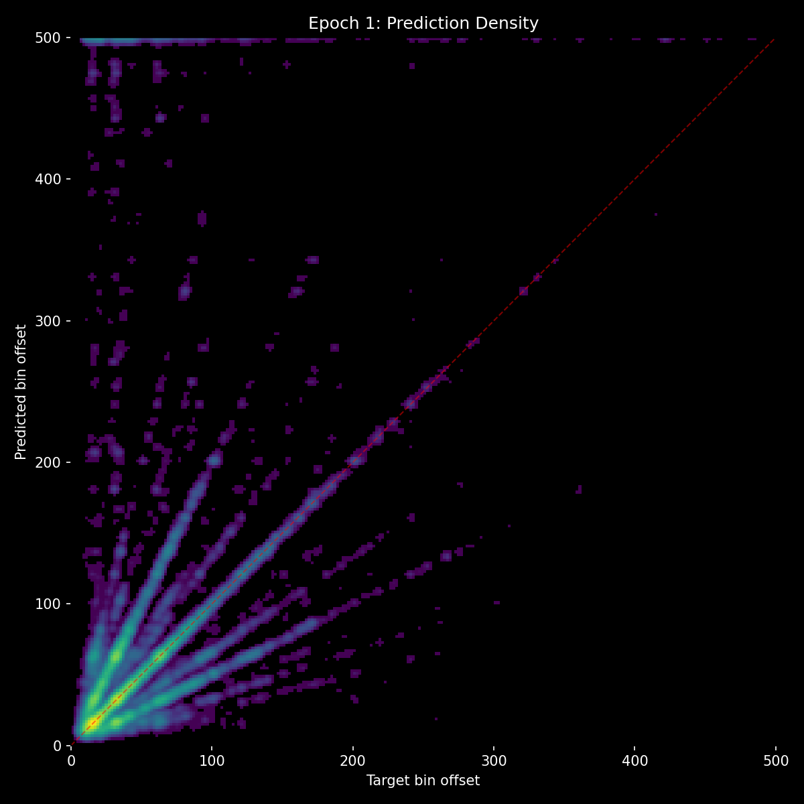
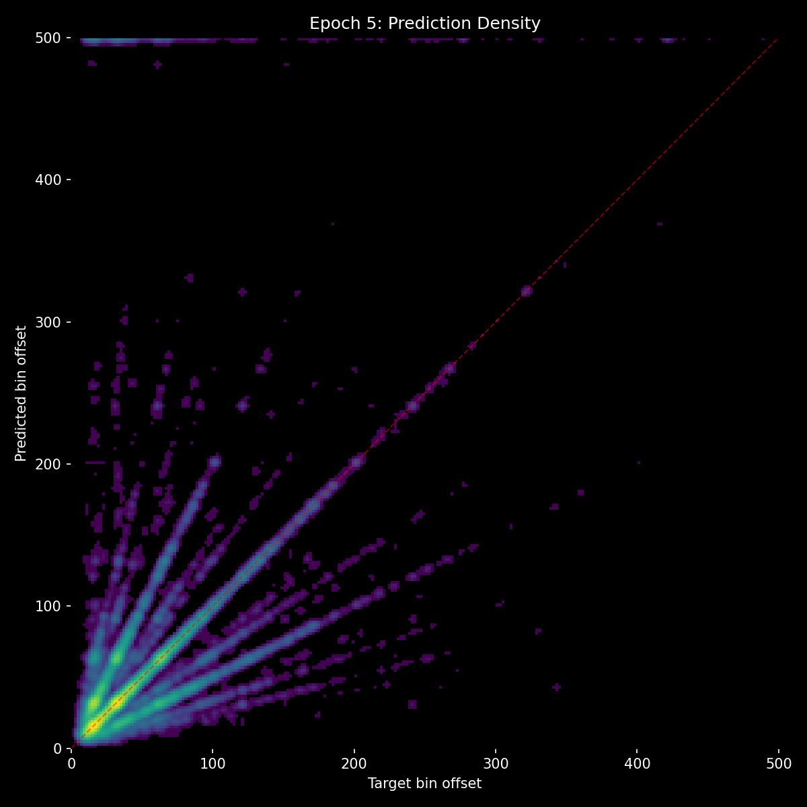
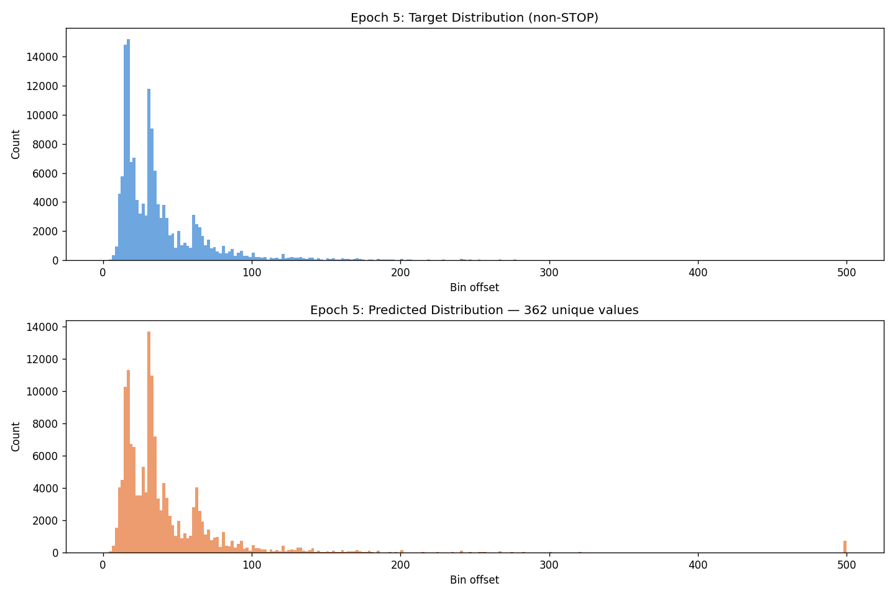
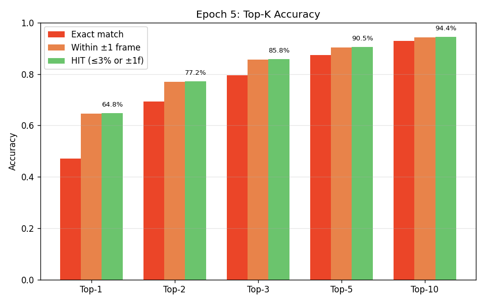
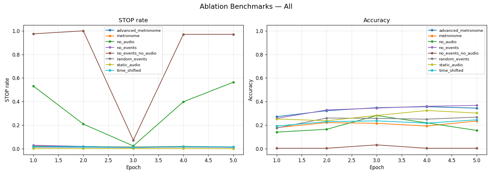

# Experiment 11 - Two-Path Architecture, NaN Fixed

> **[Full Architecture Specification](ARCHITECTURE.md)** — self-contained reproduction guide with all model, loss, training, and dataset details.

## Hypothesis

Experiment 10 showed the two-path architecture works but was crippled by a NaN bug: all-masked event attention produced NaN that propagated through the entire model for any sample with no prior events. The fix is simple - unmask a dummy position when all events are masked - but the 6 epochs of exp 10 trained with corrupted gradients on every no-event sample. The context path in particular never learned what to do when events are absent, which is exactly the signal it needs for falling back on audio.

The hypothesis is that starting fresh with valid gradients from epoch 1 will produce significantly better results than exp 10, especially on the benchmarks that were previously broken (no_events, no_events_no_audio). The architecture is identical - the only change is the NaN guard.

## Result

| Metric | E1 | E2 | E3 | E4 | E5 |
|--------|-----|-----|-----|-----|-----|
| val_loss | 3.082 | 2.858 | 2.798 | 2.776 | **2.747** |
| accuracy | 36.7% | 43.3% | 44.8% | 45.7% | **47.1%** |
| hit_rate | 56.3% | 61.9% | 63.2% | 63.8% | **64.8%** |
| stop_f1 | 0.315 | 0.370 | 0.386 | 0.376 | **0.398** |
| frame_error_median | 1.0 | 1.0 | 1.0 | 1.0 | **1.0** |
| frame_error_p99 | 366 | 212 | 180 | 210 | **180** |
| exact_match | 36.6% | 43.2% | 44.8% | 45.6% | **47.0%** |

Massive improvement. At E1, this run already surpassed exp 10 E6 on accuracy (36.7% vs 40.8% is close, and by E2 it passed it). val_loss is real, smooth, and decreasing - `best.pt` saves correctly.

**Top-K accuracy at E2** revealed how close the model is to much higher performance:

| Top-K | Hit Rate |
|-------|----------|
| Top-1 | 61.9% |
| Top-2 | 73% |
| Top-3 | **84.1%** |
| Top-5 | 90% |
| Top-10 | **95%** |

The correct answer is in the top 3 candidates 84% of the time, and in the top 10 candidates 95% of the time. The audio path is doing an excellent job of proposing candidates.

**Benchmarks - audio/event balance fixed for the first time:**

| Benchmark | E1 | E2 | E3 | E4 | E5 |
|-----------|-----|-----|-----|-----|-----|
| no_events | 25.7% | 32.9% | 34.5% | 36.0% | **36.8%** |
| no_audio | 14.1% | 16.5% | 28.2% | 21.9% | **15.5%** |
| ne_na STOP | 97.5% | **100%** | 7.3% | 97.1% | 97.1% |
| metronome | 17.9% | 22.1% | 21.6% | 19.3% | 23.5% |
| time_shifted | 19.3% | 23.0% | 23.6% | 21.7% | 24.5% |
| random_events | 17.6% | 26.0% | 25.8% | 25.1% | 26.8% |
| advanced_metronome | 27.2% | 32.3% | 31.4% | 30.2% | 34.4% |

For the first time in the entire experiment series: **no_events (36.8%) >> no_audio (15.5%)**. The model relies more on audio than on events. In every previous experiment, this was reversed. The two-path architecture with valid gradients achieves the balance that three experiments of augmentation tuning could not.

no_events_no_audio correctly predicts STOP 97-100% of the time - it was 0% in exp 10 and only 64% in earlier experiments.

**Inference on real songs** showed great per-prediction accuracy but compounding autoregressive drift. The model trains on ground truth event history but during inference it sees its own (noisy) predictions. Each small error shifts subsequent predictions, accumulating over the duration of a song.

**Top-K analysis over epochs** showed that all bars (top-1 through top-10) improved at the same rate. This means the audio path's candidate quality is improving, but the context path isn't getting any better at selecting from those candidates. The gap between top-1 (65%) and top-3 (86%) at E5 remained similar to the gap at E2. The context path is the bottleneck.

### Comparison vs Exp 10 at Same Epoch Count

| Metric | Exp 10 E5 | Exp 11 E5 |
|--------|-----------|-----------|
| val_loss | NaN | **2.747** |
| accuracy | 39.1% | **47.1%** |
| hit_rate | 59.1% | **64.8%** |
| no_events | 0.0% | **36.8%** |
| no_audio | 24.2% | **15.5%** |

Every single metric improved, most dramatically the previously-broken benchmarks.

## Lesson

The NaN fix had a far larger impact than expected - not just fixing reporting, but fundamentally improving training. Every no-event sample was producing NaN gradients in exp 10, meaning the model never learned how to behave when events are absent. With valid gradients, the model learns that "no events" means "rely entirely on audio" - which is exactly right, and teaches the audio path to be self-sufficient.

Two problems remain and motivate the next experiment:

1. **Autoregressive drift**: The model trains on perfect ground truth events but infers on its own noisy predictions. Small errors compound over a song's duration. The fix is augmenting training data to simulate the kinds of errors the model makes - recency-scaled jitter (recent events are noisier, like real AR predictions), random insertions (false positives), and random deletions (missed beats).

2. **Context path is the selection bottleneck**: The audio path proposes excellent candidates (top-3 = 84%) but the context path doesn't disambiguate well enough (top-1 = 65%). All top-K bars improve at the same rate, meaning audio improves but context doesn't close the gap. The context path needs more capacity (more layers, wider event embeddings) and its own dedicated training signal (auxiliary context loss) to strengthen its role as selector.
