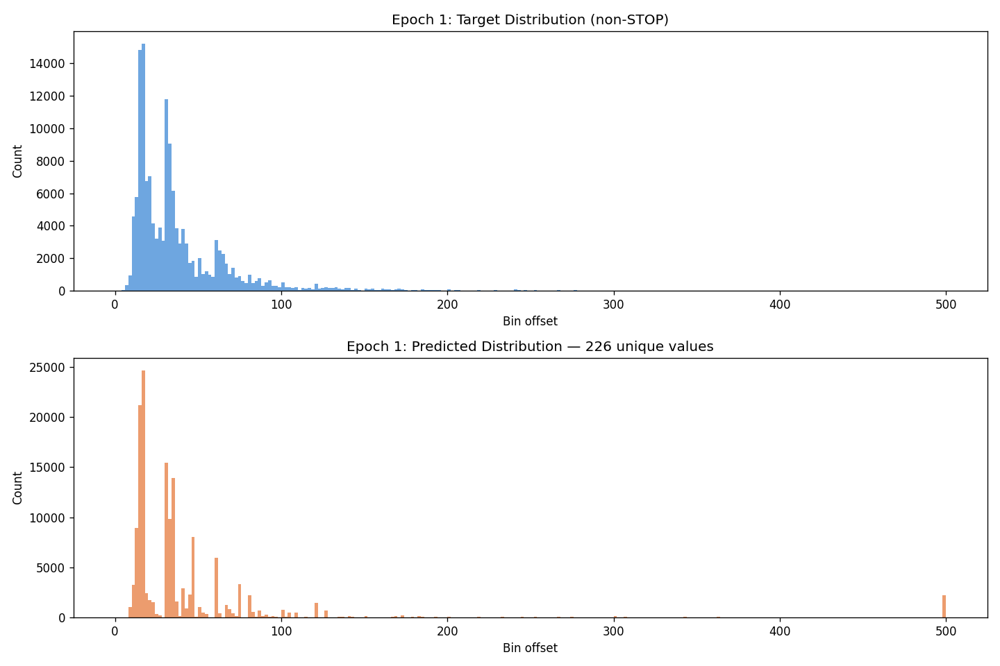
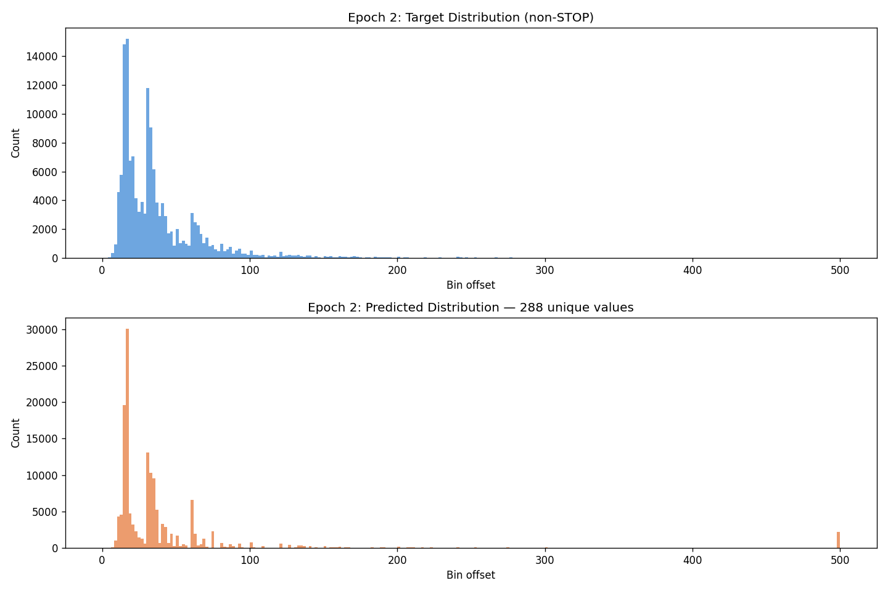
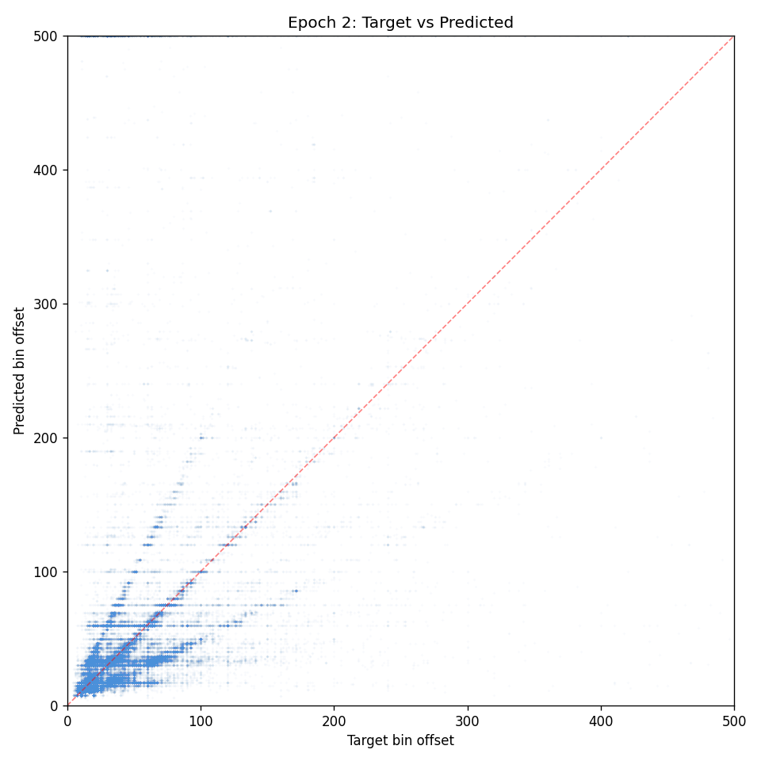
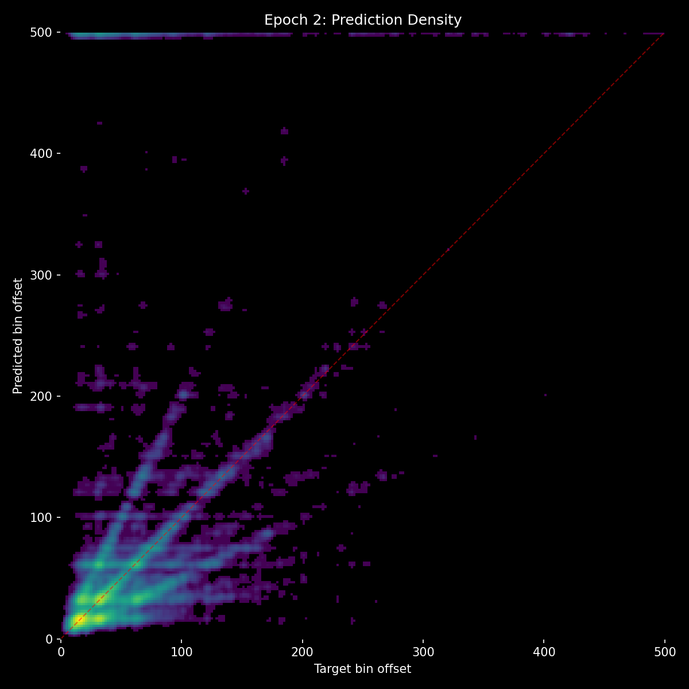
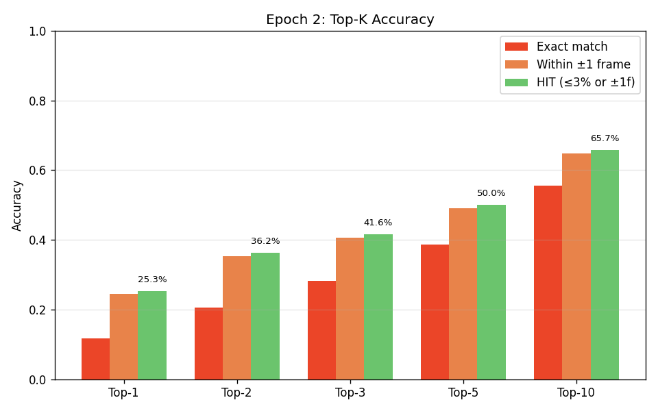
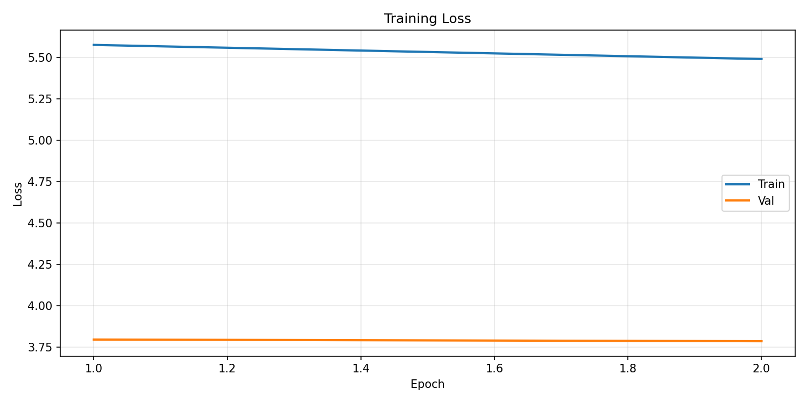
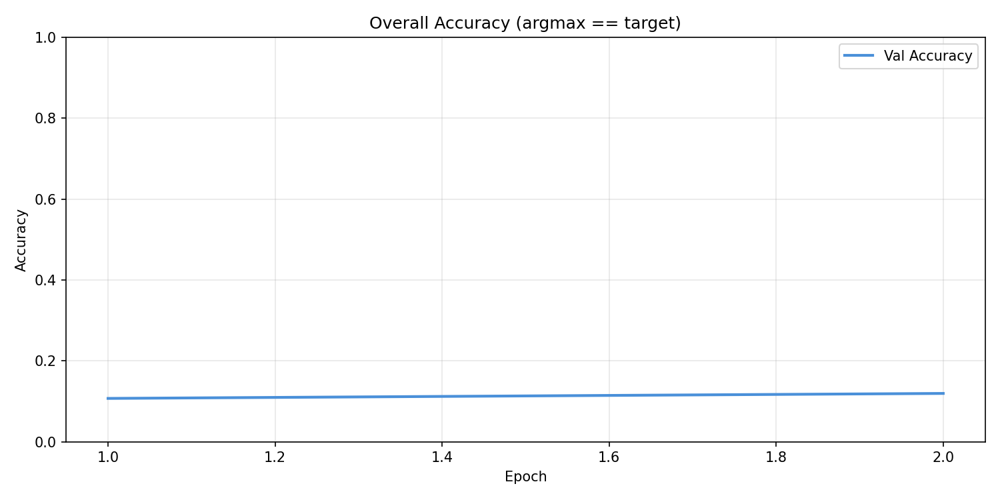

# Experiment 12 - Stronger Context Path + AR Augmentation

## Hypothesis

Experiment 11 showed the two-path architecture working well - audio is now the primary signal (no_events=36.8% >> no_audio=15.5%) and the audio path proposes excellent candidates (top-3 = 84%, top-10 = 95%). But two problems remain:

**1. The context path is the selection bottleneck.**

Top-K accuracy analysis showed all bars (top-1 through top-10) improving at the same linear rate across epochs. This means the audio path is getting better at proposing candidates, but the context path isn't getting any better at selecting from them. The gap between top-1 (65%) and top-3 (86%) stayed roughly constant - roughly 20% of samples have the correct answer ranked 2nd or 3rd, and the context path can't disambiguate.

To address this, three changes were made:
- **Event encoder widened**: d_event increased from 128 to 192 (with 6 attention heads instead of 4), giving the context path richer event representations to work with. Event encoder depth increased from 2 to 3 layers.
- **Context path deepened**: context_path_layers increased from 3 to 4, giving it more capacity for the selection task.
- **Dedicated context auxiliary loss**: The model now returns all three logit tensors (combined, audio, context). Loss changed from `main + 0.2 * audio_aux` to `main + 0.1 * audio_aux + 0.1 * context_aux`. Both paths now receive equal direct training signal. Previously, the audio path got 1.2x the gradient (main + aux) while the context path only got 1x (main only), which may have contributed to the context path underperforming.

Total parameter increase: ~21M → ~24.5M (+17%), all invested in the selector side (event_encoder 0.5M→1.5M, context_path 7.5M→9.9M).

**2. Autoregressive drift during inference.**

The model trains on ground truth event history but infers on its own predictions. Each prediction error shifts the event context for subsequent predictions, and these errors compound over the duration of a song. Inference results showed good local accuracy but increasing drift from ground truth over time.

To address this, event augmentation was redesigned to simulate the kinds of errors the model produces during autoregressive inference:
- **Recency-scaled jitter**: Instead of uniform ±4 bin jitter, noise scales from 1x (oldest events) to 3x (most recent events). This mimics real AR behavior where recent predictions are less reliable because they've had less opportunity to be corrected by subsequent context.
- **Global shift**: A uniform ±3 bin shift applied to ALL events simultaneously, simulating systematic timing drift where the model is consistently a bit early or late.
- **Random deletion (8%)**: Drop 1 to N/6 individual events, simulating missed beats during inference.
- **Random insertion (8%)**: Add 1 to N/6 spurious events at random positions within the existing event range, simulating false positive predictions.
- Existing augmentations (5% full dropout, 10% truncation) remain unchanged.

The augmentation rates are deliberately light - the goal is to expose the model to slightly messy event histories that resemble real inference output, not to corrupt the data so heavily that events become useless (the lesson from experiment 07).

## Result

**Failed experiment.** The model stalled almost immediately.

| Metric | E1 | E2 |
|--------|-----|-----|
| val_loss | 3.797 | 3.787 |
| accuracy | 10.7% | 11.9% |
| hit_rate | 24.7% | 25.3% |
| top-3 HIT | ~42% | 41.6% |
| top-10 HIT | ~65% | 65.7% |
| unique preds | 226 | 288 |

Compare to exp 11 E1: 36.7% accuracy, 56.3% HIT, 430 unique preds, top-10 95%.

**Prediction distribution** showed severe mode collapse — spiky, concentrated on a handful of "safe" bins (~15, ~25, ~50, ~65) with massive peaks. The scatter plot showed horizontal banding: the model predicted the same few y-values regardless of target.

**Benchmarks:**

| Benchmark | E1 | E2 |
|-----------|-----|-----|
| no_events | 7.7% | 11.8% |
| no_audio | 1.8% | 5.4% |
| ne_na STOP | 99.8% | 90.4% |
| metronome | 5.6% | 1.6% |

The audio proposer was crippled — it couldn't spread across the output space. Top-10 only reached 65.7% (exp 11 E2 was 95%). With bad candidates, the bigger context path had nothing useful to select from.

## Lesson

**Don't starve the proposer to feed the selector.** Cutting audio aux from 0.2 to 0.1 halved the direct gradient to the audio path. Combined with splitting the remaining budget to the context path, the audio path couldn't learn to propose diverse candidates. The bigger context path was useless because the candidates were garbage.

The context path improvement needs to come from better architecture or training strategy, not by redistributing gradient away from audio. The audio aux loss (0.2) is load-bearing — it's what forces the audio path to be independently capable.

Key takeaway: the AR augmentations (recency-scaled jitter, insertions, deletions) are good and should be kept, but the architecture/loss changes were harmful and should be reverted.

