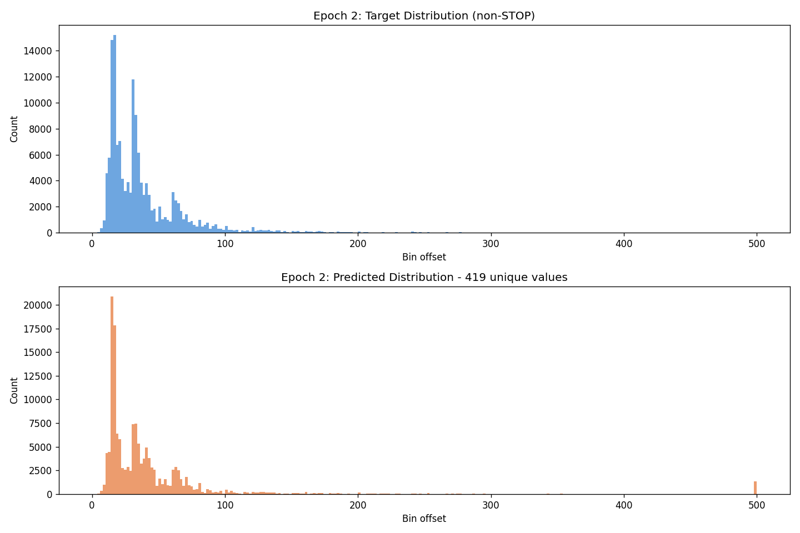
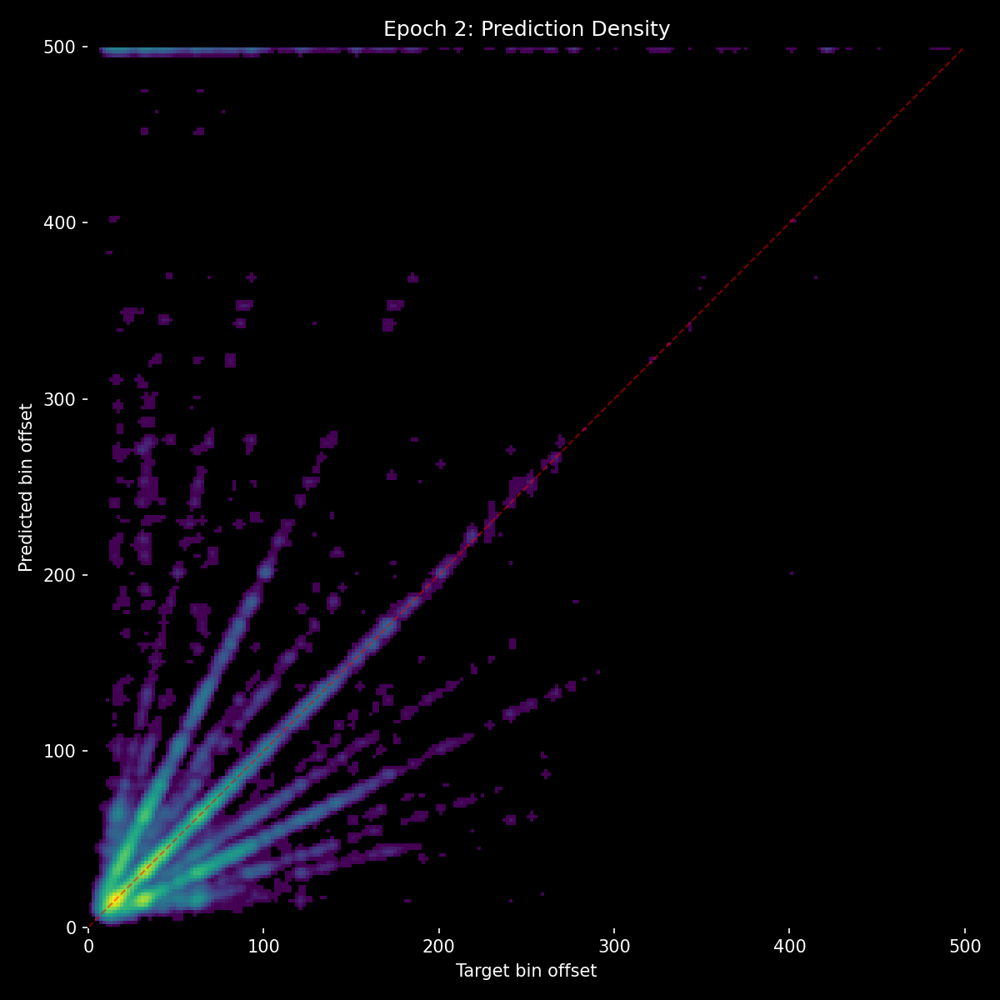
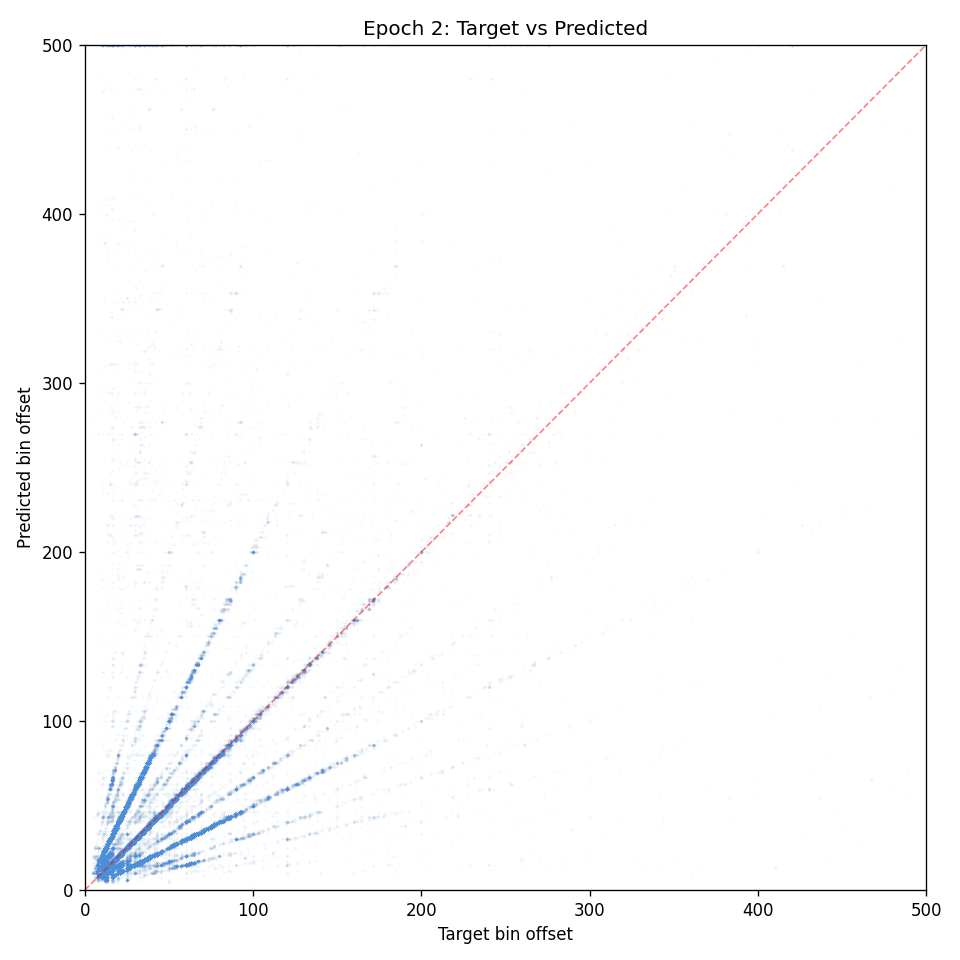
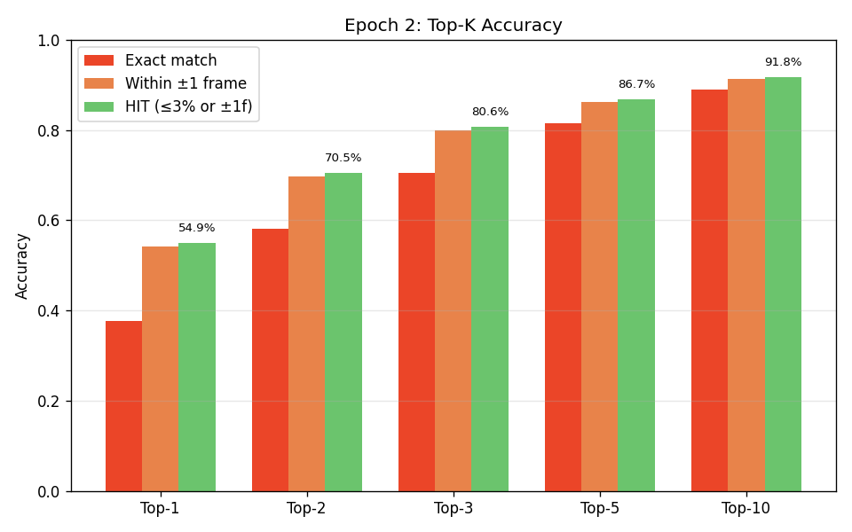
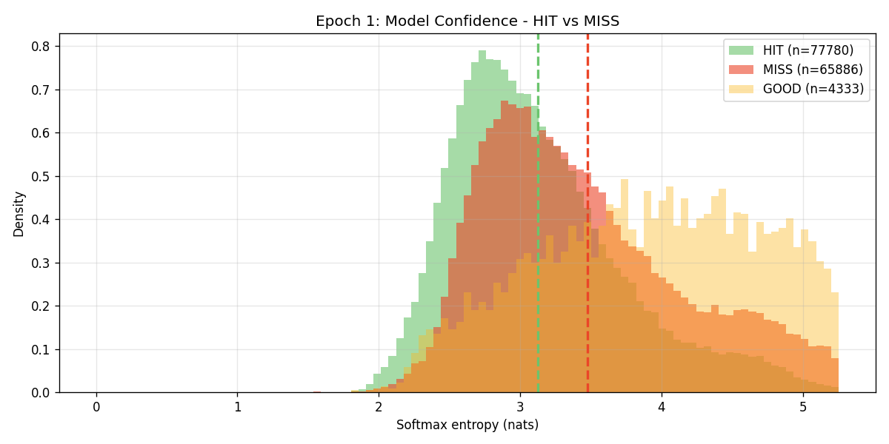

# Experiment 13 - AR Augmentation Only (Exp 11 Architecture)

## Hypothesis

Experiment 12 showed that increasing the context path capacity while reducing the audio aux loss was catastrophic - the audio proposer collapsed into mode collapse (226 unique preds, horizontal banding in scatter, top-10 only 65%). The lesson: the audio aux loss at 0.2 is load-bearing and the audio path must be strong before the context path can be useful.

Experiment 11 had excellent results (E5: 47.1% acc, 64.8% HIT, top-3 ~86%, top-10 ~95%) but suffered from autoregressive drift during inference - the model trains on ground truth event history but infers on its own noisy predictions, and errors compound over a song's duration.

This experiment keeps exp 11's architecture and loss exactly as-is, and adds only the AR-simulating augmentations from exp 12:

**Architecture (unchanged from exp 11):**
- d_model=384, d_event=128, enc_layers=4, enc_event_layers=2
- audio_path_layers=2, context_path_layers=3, n_heads=8
- Loss: `main + 0.2 * audio_aux` (no context aux)
- ~21M params

**New augmentations (kept from exp 12):**
- **Recency-scaled jitter**: Per-event noise scales from 1x (oldest) to 3x (most recent), simulating how AR errors are larger for recent predictions. Plus a global ±3 bin shift for systematic drift.
- **Random deletion (8%)**: Drop 1 to N/6 individual events to simulate missed beats.
- **Random insertion (8%)**: Add 1 to N/6 spurious events to simulate false positives.
- All existing augmentations unchanged (5% full dropout, 10% truncation, mel augmentations).

The hypothesis is that the AR augmentations will:
1. Reduce autoregressive drift during inference by making the model robust to noisy event histories
2. Maintain or improve the strong per-sample accuracy from exp 11
3. Show up as better metronome/time_shifted/random_events benchmark scores (model more robust to bad context)

This is a controlled test: the only variable vs exp 11 is the event augmentation.

## Result

Ran for 2 epochs before being stopped early due to discovery of a fundamental data alignment bug.

| Metric | E1 | E2 | Exp 11 E2 |
|--------|-----|-----|-----------|
| val_loss | 3.168 | **3.009** | 2.858 |
| accuracy | 33.9% | **37.8%** | 43.3% |
| hit_rate | 52.6% | **54.9%** | 61.9% |
| stop_f1 | 0.347 | 0.325 | 0.370 |
| p99 error | 274 | 316 | 212 |

Raw accuracy slightly behind exp 11 (expected - harder augmentations), but the benchmarks showed exactly the desired effect:

| Benchmark | Exp 13 E1 | Exp 13 E2 | Exp 11 E2 |
|-----------|-----------|-----------|-----------|
| no_events | 30.7% | **34.0%** | 32.9% |
| no_audio | 1.2% | **0.4%** | 16.5% |
| metronome | 29.9% | **30.6%** | 22.1% |
| time_shifted | 30.4% | **33.2%** | 23.0% |
| random_events | 28.8% | **32.5%** | 26.0% |

The AR augmentations worked as intended:
- **no_audio dropped to 0.4%** - strongest audio dominance ever. The model almost completely ignores events without audio.
- **Corruption resilience up ~8-10% across the board** vs exp 11 - metronome, time_shifted, random_events all ~30-33% vs exp 11's ~22-26%.
- The model learned that event context can be noisy and shouldn't be blindly trusted.

**Entropy analysis** revealed three distinct confidence populations:
- **HIT** predictions: low entropy (confident and correct), sharp peak at ~2.7 nats
- **MISS** predictions: moderate entropy (less confident, wrong), peak at ~3.2 nats
- **GOOD** predictions (close but not exact): extremely high entropy (~4.5 nats), flat distribution - the model spreads probability across nearby bins and the argmax lands close by chance

**Inference on real songs** still showed autoregressive drift despite the augmentations. The model's per-prediction accuracy was good, but errors still compounded over song duration.

### Data Alignment Bug Discovery

While investigating inference quality, a fundamental timing misalignment was discovered in the dataset:

- **Mel frame duration**: `HOP_LENGTH / SAMPLE_RATE = 110 / 22050 = 4.98866ms`
- **BIN_MS constant**: `5.0ms` (used for all event-to-bin conversions)

This means `event_bin = int(time_ms / 5.0)` but `mel_frame[event_bin]` represents audio from `event_bin * 4.98866ms`. The 0.01134ms-per-frame error compounds:

| Song position | Audio-event drift |
|--------------|-------------------|
| 30s | 68ms (13.6 frames) |
| 1 min | 136ms (27.3 frames) |
| 2 min | 272ms (54.5 frames) |
| 3 min | **408ms (81.8 frames)** |
| 5 min | **680ms (136.4 frames)** |

By 3 minutes into a song, the model is seeing audio from **408ms before the actual event**. This likely explains:
1. The ~46% accuracy ceiling across all experiments - the model literally cannot learn precise timing because the labels are wrong relative to the audio
2. The "blurry" heatmap diagonal - predictions scatter because the audio doesn't match the expected event position
3. Why inference seems worse than validation - the model learned to compensate for drift at specific offsets in the training distribution, but inference starts from different positions
4. Why autoregressive errors compound - each prediction is slightly off due to the underlying misalignment, and subsequent predictions inherit that systematic error

## Lesson

**The AR augmentations work.** Recency-scaled jitter + global shift + random insertions/deletions significantly improved corruption resilience without harming core accuracy. These should be kept for future experiments.

**But the accuracy ceiling is a data problem, not a model problem.** The 5.0ms vs 4.9887ms rounding error in BIN_MS causes progressive misalignment between mel frames and event labels. The dataset must be regenerated with the exact frame duration (`HOP_LENGTH / SAMPLE_RATE * 1000`) before further training can meaningfully improve beyond the ~46% plateau.

Fix applied to `create_dataset.py` and `detection_inference.py`: `BIN_MS = HOP_LENGTH / SAMPLE_RATE * 1000` instead of the hardcoded `5.0`.
