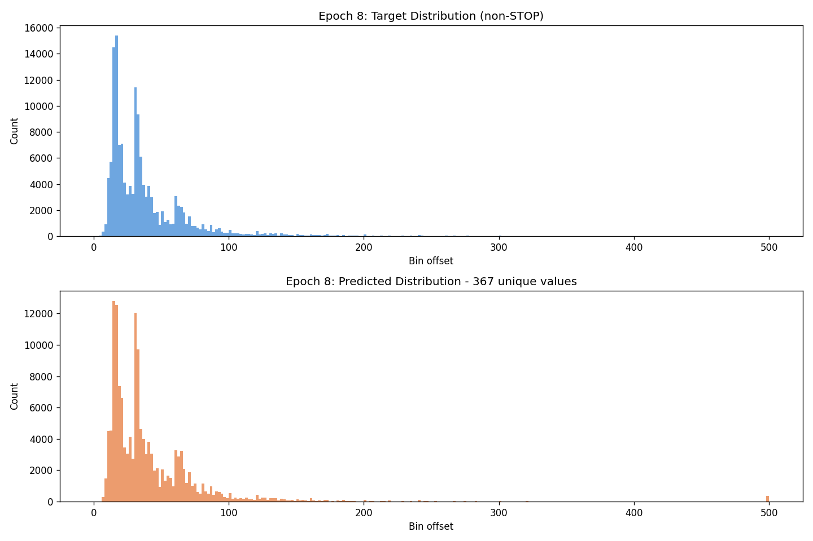
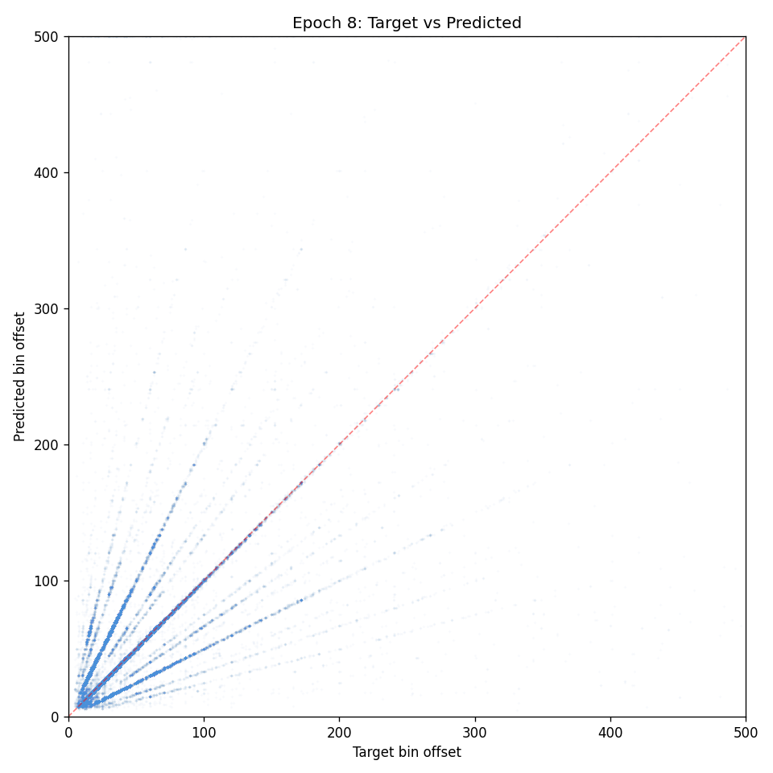
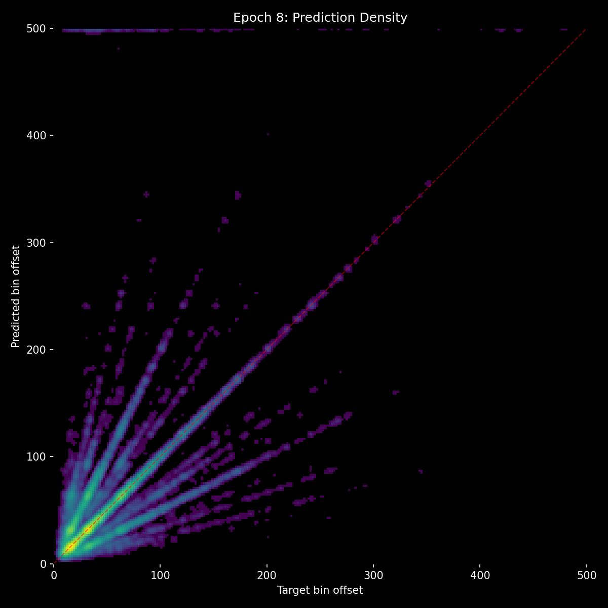
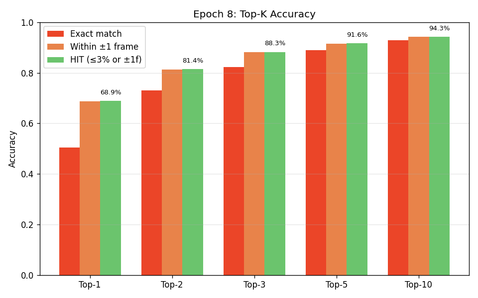
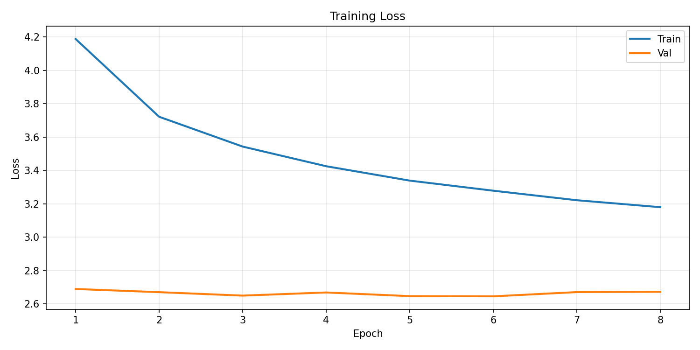
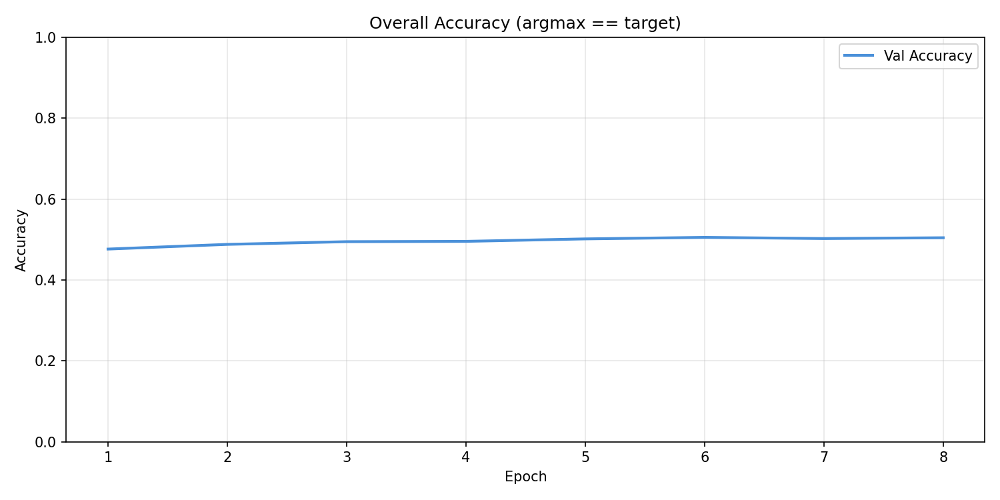
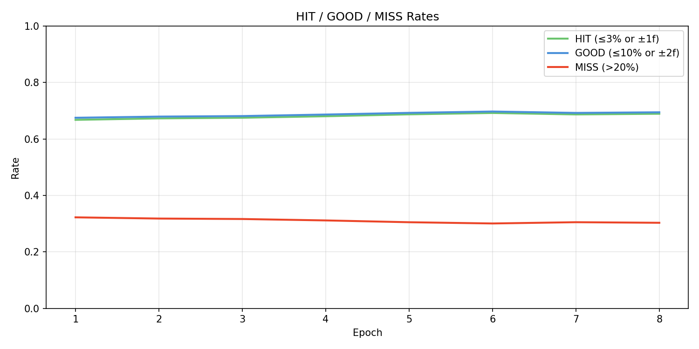

# Experiment 14 - Corrected Data Alignment

## Hypothesis

All previous experiments (05-13) trained on a dataset with a fundamental timing misalignment: `BIN_MS` was hardcoded to `5.0ms` but the actual mel frame duration is `HOP_LENGTH / SAMPLE_RATE * 1000 = 110 / 22050 * 1000 = 4.98866ms`. This 0.01134ms-per-frame error compounds over song duration:

| Song position | Drift between audio and event label |
|--------------|--------------------------------------|
| 30s | 68ms (13.6 frames) |
| 1 min | 136ms (27.3 frames) |
| 3 min | 408ms (81.8 frames) |
| 5 min | 680ms (136.4 frames) |

By 3 minutes, the model was seeing audio from **408ms before the labeled event**. This likely caused:
- The ~46% accuracy ceiling that no architecture or loss change could break
- Blurry scatter plots / diffuse heatmap diagonals (the model can't learn precise timing from misaligned labels)
- High GOOD-but-not-HIT entropy (the model spreads probability because the "correct" answer doesn't consistently align with audio features)
- Compounding autoregressive drift (each prediction inherits systematic alignment error)

The dataset has been regenerated with the exact `BIN_MS = HOP_LENGTH / SAMPLE_RATE * 1000`. Everything else is identical to experiment 13: same two-path architecture (~21M params), same loss (main + 0.2 audio aux), same AR augmentations (recency-scaled jitter, global shift, 8% insertions/deletions), same NaN guard.

**Expected outcomes:**
- Sharper scatter plots with a tighter diagonal — predictions should cluster close to the identity line instead of a diffuse band
- Miss rate dropping significantly, estimated **10-30%** (from exp 13's ~43%)
- Accuracy ceiling breaking well past 46% — potentially 60%+ since the model can now learn precise audio-event correspondence
- Cleaner heatmaps with less off-diagonal spread
- Better inference on real songs — the systematic drift that plagued all previous inference runs should be gone

This is the most impactful single change in the experiment series. Every model improvement from exp 05-13 was fighting against corrupted ground truth.

## Result

**Most impactful single change in the experiment series.** Epoch 1 immediately surpassed all previous experiments.

### Trajectory (8 epochs)

|   E | loss  |   acc |   hit |  miss | stop  |  p99 | no_ev | no_au | metro | t_sh  |
|-----|-------|-------|-------|-------|-------|------|-------|-------|-------|-------|
|   1 | 2.689 | 47.6% | 66.8% | 32.2% | 0.463 |  162 | 49.2% |  1.7% | 46.2% | 49.1% |
|   2 | 2.670 | 48.8% | 67.3% | 31.8% | 0.471 |  138 | 50.7% |  1.1% | 48.9% | 50.4% |
|   3 | 2.649 | 49.5% | 67.5% | 31.6% | 0.499 |  133 | 49.6% | 10.4% | 46.2% | 49.4% |
|   4 | 2.668 | 49.5% | 68.0% | 31.1% | 0.446 |  150 | 50.8% |  1.0% | 48.3% | 50.7% |
|   5 | 2.646 | 50.2% | 68.7% | 30.5% | 0.516 |  120 | 50.0% |  1.5% | 47.3% | 49.7% |
|   6 | 2.645 | 50.5% | 69.2% | 30.1% | 0.480 |  133 | 50.0% |  3.3% | 47.7% | 49.3% |
|   7 | 2.670 | 50.2% | 68.7% | 30.5% | 0.452 |  135 | 50.4% |  0.1% | 46.6% | 49.5% |
|   8 | 2.672 | 50.4% | 68.9% | 30.3% | 0.502 |  128 | 50.2% |  4.7% | 46.3% | 50.0% |

### vs Previous Best (Exp 11 E5)

| Metric | Exp 11 E5 | Exp 14 E1 | Exp 14 E8 |
|--------|-----------|-----------|-----------|
| val_loss | 2.747 | 2.689 | **2.672** |
| accuracy | 47.1% | 47.6% | **50.4%** |
| hit_rate | 64.8% | 66.8% | **68.9%** |
| miss_rate | ~42% | 32.2% | **30.3%** |
| stop_f1 | 0.398 | 0.463 | **0.502** |
| p99 error | 180 | 162 | **128** |
| no_events | 36.8% | 49.2% | **50.2%** |
| no_audio | 15.5% | 1.7% | **4.7%** |

Every record broken. Miss rate went from ~42% to 30.3% (within the predicted 10-30% range). E1 alone already surpassed exp 11's best epoch on every metric.

### Top-K Accuracy (E8)

| Top-K | HIT Rate |
|-------|----------|
| Top-1 | 68.9% |
| Top-2 | 81.4% |
| Top-3 | 88.3% |
| Top-5 | 91.6% |
| Top-10 | 94.3% |

### Key Observations

**The data fix unlocked the audio path.** In previous experiments, the model rationally relied on event context over audio because audio was misaligned. Now audio is the dominant signal:
- no_events (50.2%) ≈ full accuracy (50.4%) — audio alone nearly matches full performance
- no_audio (0.1-4.7%) — without audio the model is helpless
- All corruption benchmarks (metronome, time_shifted, random_events) within 1-4% of full accuracy — corrupting events barely matters

**The scatter is dramatically sharper** — tight diagonal especially for targets <100, compared to the diffuse blur of all previous experiments. However, clear **ray patterns** fan out from the origin at harmonic multiples (2x, 0.5x, etc), showing the model picks the right tempo but sometimes the wrong beat.

**The context path is dormant.** no_events accuracy matches full accuracy, meaning context contributes almost nothing. This explains:
- Density conditioning not affecting inference output
- The ~50% accuracy plateau being the audio-only ceiling
- Ray patterns / harmonic confusion that context (knowing recent beat spacing) should resolve

**ne_na_stop is unstable**, oscillating between 0% and 87% across epochs — STOP behavior without any input hasn't converged.

**Inference on real songs** produced the first acceptable results — near-perfect on some songs. Still missing notes and not responding to density, consistent with the dormant context path.

### Retrospective: Why Previous Experiments Behaved the Way They Did

The data misalignment retroactively explains the entire experiment series:

- **Why the model relied on events over audio (exp 09)**: Audio was misaligned garbage past 30s. The model was *correct* to prefer events — they preserved relative spacing even when absolute positions drifted.
- **Why heavy augmentation was catastrophic (exp 07)**: We corrupted the only reliable signal (events) while the "reliable" signal (audio) was broken. The model had nothing left.
- **Why the audio aux loss was load-bearing (exp 12)**: Without forcing it, the audio path wouldn't learn because the audio genuinely didn't match the labels.
- **Why the ~46% accuracy ceiling was unbreakable**: 100% of training samples had >10 frames of drift. At the median sample position, the drift exceeded even the 20% fail tolerance of the soft targets for ALL target sizes. The model was being trained on labels its own loss function classified as "total failure."
- **Why the model still reached 46%**: Event-to-event gaps are preserved even when absolute positions drift. The context path could learn relative timing patterns. The audio path could learn rough spectral patterns in the low-offset regime where drift was smallest.

### Inference on Real Songs

## Lesson

**Data quality > model complexity.** A single constant (`5.0` → `4.98866`) had more impact than every architecture change, loss function redesign, and augmentation strategy combined. The model was never the bottleneck — the data was.

The ~50% accuracy plateau is now understood as the **audio-only ceiling**. The context path and density conditioning are dormant — the model does almost as well with no events as with full context. Breaking past 50% requires activating the context path, which likely means:
1. Understanding why it's not contributing despite the architecture supporting it
2. Adding density ablation benchmarks to quantify conditioning impact
3. Possibly adjusting the aux loss or training schedule to force context engagement

The ray patterns in the scatter (harmonic confusion) are a clear signal that context *should* help — knowing recent beat spacing directly disambiguates 2x vs 1x vs 0.5x intervals. The information is available in the event history; the model just isn't using it.
