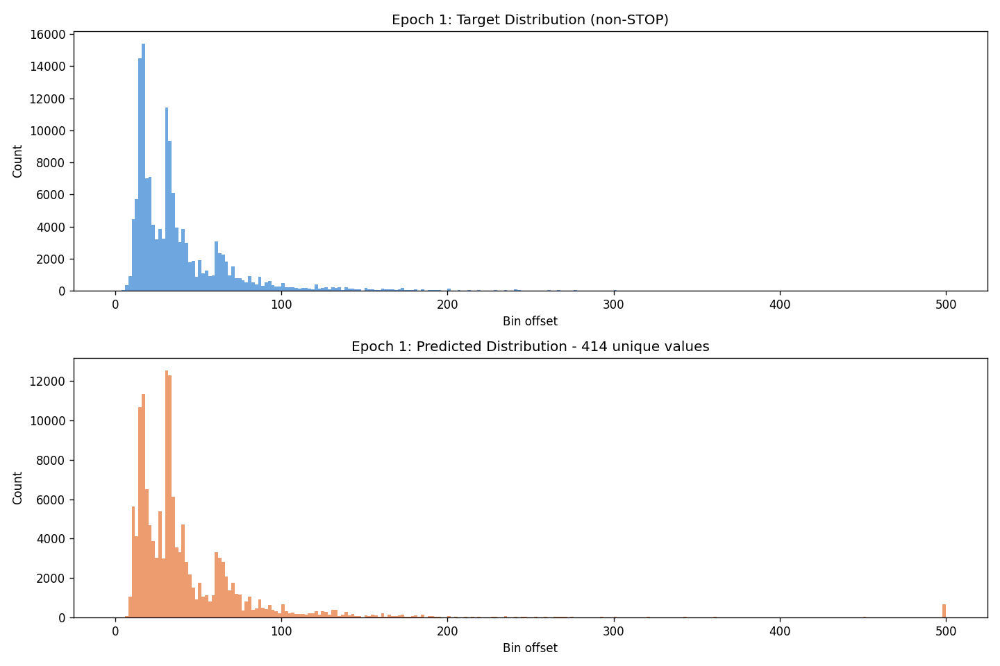
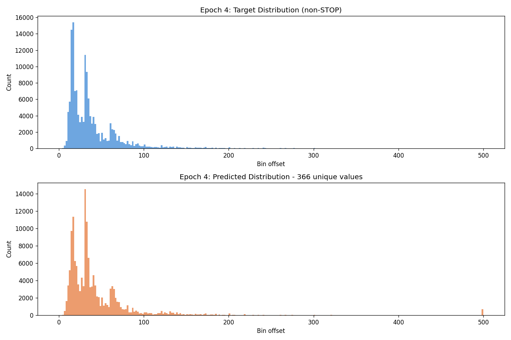
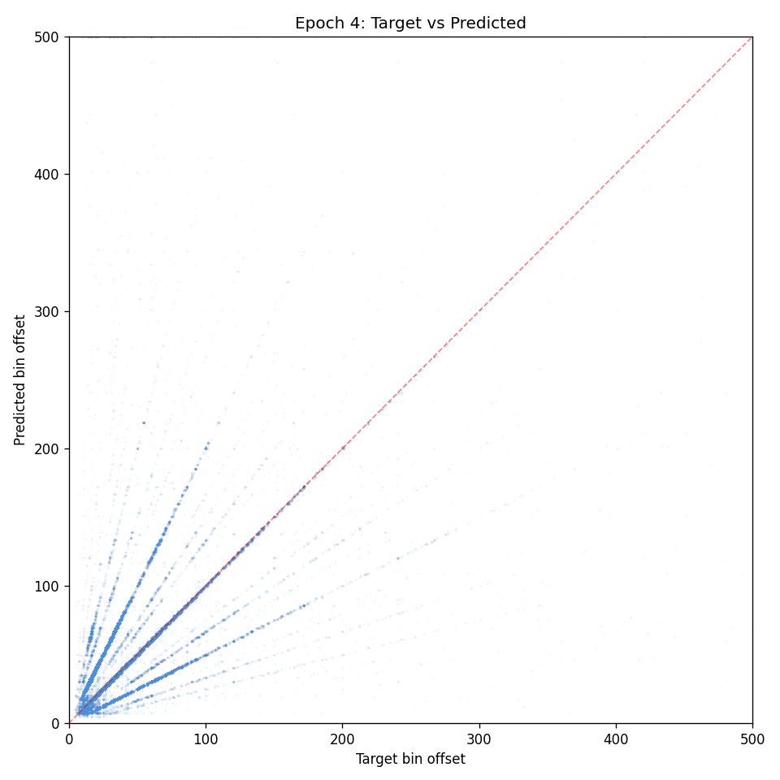
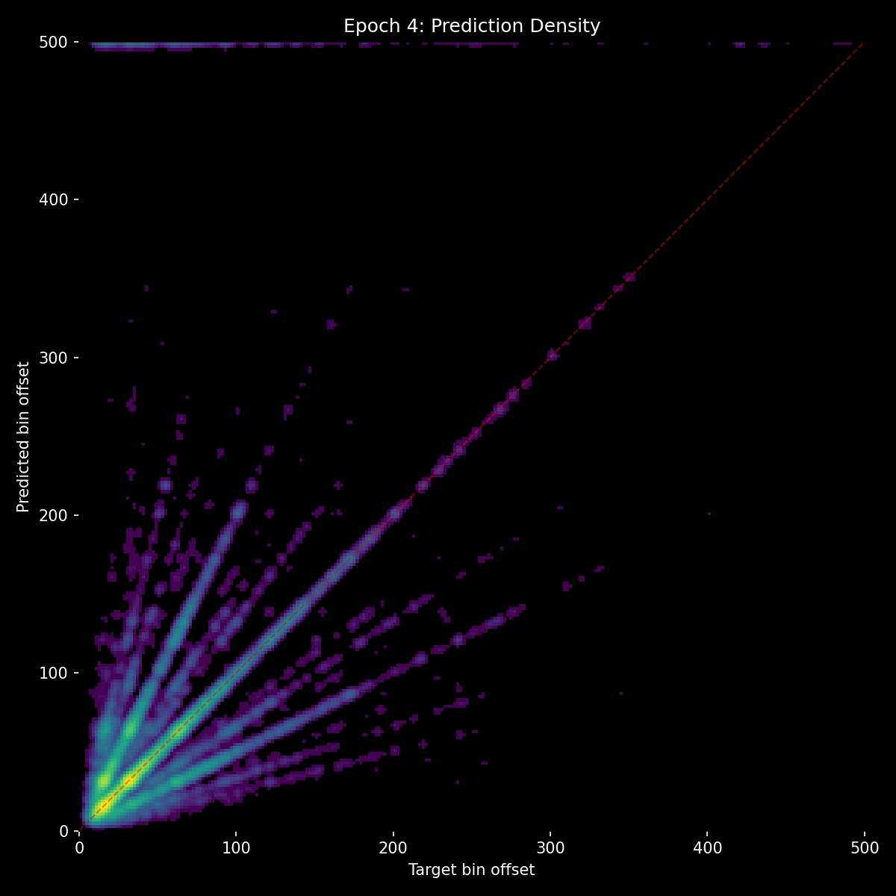
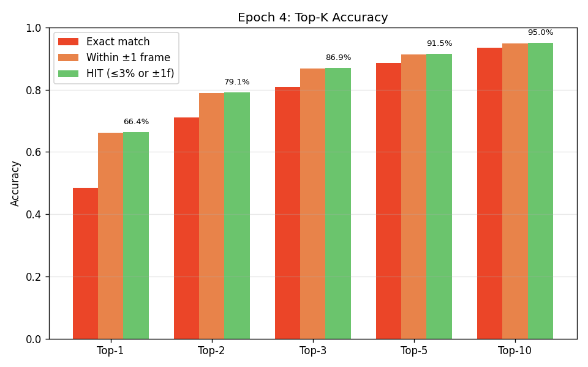
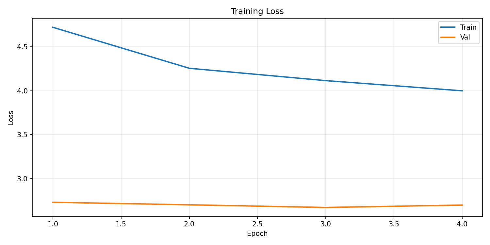
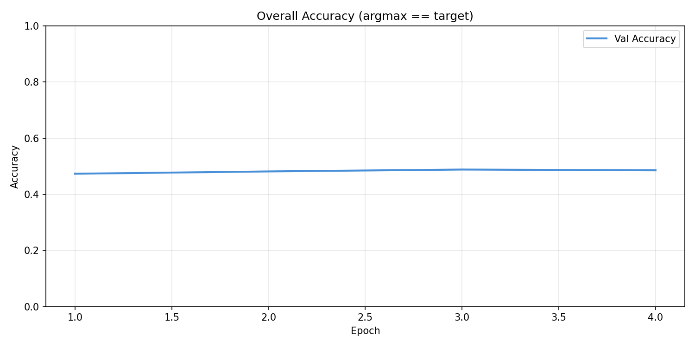
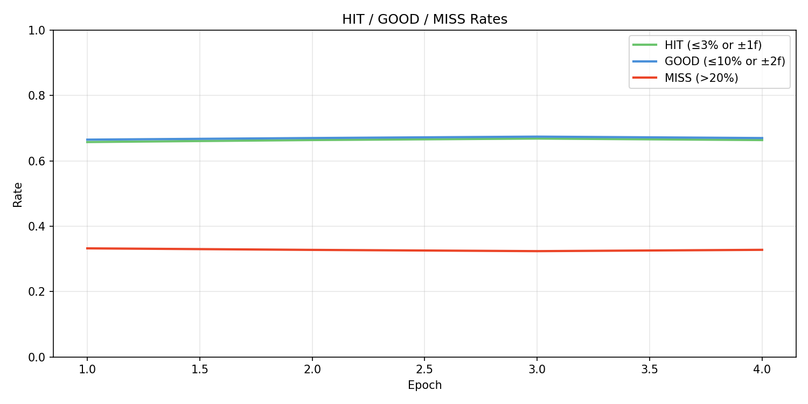

# Experiment 15 - Context Aux Loss + Density Benchmarks

## Hypothesis

Experiment 14 proved the data alignment fix was transformative (50.5% acc, 69% HIT, 30% miss at E8), but revealed a new bottleneck: the context path is dormant. no_events accuracy (50.2%) matches full accuracy (50.4%), meaning the context path contributes almost nothing to the final prediction. The model's ~50% accuracy ceiling is the audio-only ceiling.

**Why the context path is dormant:** The context path found a local minimum - just amplify whatever audio already ranks highest. Since audio is right ~69% of the time, agreeing with audio is a safe strategy. The context path has no incentive to develop independent opinions or override audio's ranking. This manifests as:
- no_events ≈ full accuracy (context adds nothing)
- Top-1 to top-3 gap of ~20% (correct answer often ranked 2nd/3rd by audio, context never overrides)
- Ray patterns in scatter (harmonic confusion that event spacing would directly resolve, but context doesn't intervene)
- Inference ignoring density conditioning

**Why this approach failed in exp 12 but should work now:** Experiment 12 tried `main + 0.1 audio_aux + 0.1 context_aux` and the audio path collapsed into mode collapse. But that was on misaligned data where audio couldn't learn effectively - stealing gradient from it was fatal. Now on clean data, audio is strong and self-sufficient (49-50% accuracy with no events at all). Adding context aux gradient on top rather than redistributing from audio should be safe.

### Changes

**Loss:** `main + 0.2 * audio_aux + 0.1 * context_aux` (was `main + 0.2 * audio_aux`)
- Audio aux stays at 0.2 (unchanged, not starved)
- Context aux added at 0.1 (new direct training signal)
- Total aux weight 0.3 (was 0.2)
- The context path now gets its own gradient pushing it to independently predict the correct answer, not just rubber-stamp audio

**New ablation benchmarks:**
- **Zero density**: conditioning vector set to [0, 0, 0] - tests if density affects predictions at all
- **Random density**: conditioning randomized - tests if the model uses density information or ignores it

Everything else identical to exp 14: same architecture (~21M params), same dataset (taiko_v2 with correct BIN_MS), same AR augmentations.

### Expected outcomes

- Context path begins contributing: no_events accuracy should drop below full accuracy (gap of 5-10% would indicate meaningful context contribution)
- Top-1 to top-3 gap narrows as context learns to select from audio's candidates
- Accuracy breaks past 50% audio-only ceiling
- Ray patterns (harmonic confusion) reduce as context disambiguates 2x/0.5x intervals
- Density benchmarks establish baseline for whether FiLM conditioning is working

### Risk

Adding 0.1 context aux increases total gradient. If the model destabilizes, the context aux may need to be reduced to 0.05. Watch for:
- val_loss increasing or oscillating compared to exp 14
- no_events accuracy *increasing* (would mean audio is degrading)
- Pred distribution collapsing (spikiness, fewer unique values)

## Result

**Context aux loss did not activate the context path.** Stopped at E4 - no_events never dropped below full accuracy. The context path continued rubber-stamping audio despite direct gradient pressure.

### Trajectory (4 epochs)

|   E | loss  |   acc |   hit |  miss | stop  |  p99 | no_ev | no_au | metro | t_sh  |
|-----|-------|-------|-------|-------|-------|------|-------|-------|-------|-------|
|   1 | 2.732 | 47.3% | 65.8% | 33.2% | 0.427 |  182 | 48.9% |  1.7% | 48.3% | 49.5% |
|   2 | 2.704 | 48.2% | 66.4% | 32.8% | 0.443 |  201 | 48.8% |  0.3% | 47.7% | 49.8% |
|   3 | 2.674 | 48.8% | 66.8% | 32.4% | 0.476 |  157 | 49.8% |  0.3% | 48.2% | 49.0% |
|   4 | 2.701 | 48.6% | 66.4% | 32.8% | 0.440 |  151 | 48.5% |  0.2% | 45.0% | 49.3% |

### vs Exp 14 (same epochs)

| Metric | Exp 14 E4 | Exp 15 E4 |
|--------|-----------|-----------|
| accuracy | 49.5% | 48.6% |
| hit_rate | 68.0% | 66.4% |
| miss_rate | 31.1% | 32.8% |
| p99 | 150 | 151 |
| no_events | 50.8% | 48.5% |

Consistently ~1% behind exp 14 on accuracy/hit. The context aux added gradient noise without benefit - the context path's rubber-stamping is a deeper problem than insufficient gradient.

### Density Benchmarks (key discovery)

| Benchmark | E1 | E2 | E3 | E4 |
|-----------|-----|-----|-----|-----|
| full accuracy | 47.3% | 48.2% | 48.8% | 48.6% |
| zero_density | 24.2% | 31.3% | 26.9% | 21.8% |
| random_density | 43.0% | 43.4% | 42.8% | 40.0% |
| full − zero gap | 23.1pp | 16.9pp | 21.9pp | **26.8pp** |

**Density conditioning is load-bearing.** Zeroing the density vector halves accuracy, and the gap is *increasing* over training. The model deeply relies on FiLM conditioning - this was invisible without benchmarks.

Random density drops ~8pp, confirming the model uses specific density values, not just "density exists."

### Context Path Analysis

no_events accuracy across all 4 epochs: 48.9%, 48.8%, 49.8%, 48.5%. Full accuracy: 47.3%, 48.2%, 48.8%, 48.6%. The gap is noise - context contributes nothing measurable.

The 0.1 context aux CE loss pushes the context path to independently predict the correct answer, but the path's optimal strategy remains "copy audio's top choice." Standard CE has no mechanism to reward *overriding* audio when audio's #2 or #3 is correct - every wrong answer is equally wrong regardless of whether the right answer was available in audio's top candidates.

## Lesson

**You can't aux-loss your way out of a rubber-stamping local minimum.** The context path's strategy of "agree with audio" is a stable equilibrium that standard CE gradient can't escape - agreeing with audio's #1 choice is correct ~67% of the time, while independently overriding is risky. The context path needs a loss that specifically rewards selecting the correct answer *from audio's ranked candidates*, not just predicting the correct answer independently.

**Density conditioning works and is load-bearing.** The new zero_density and random_density benchmarks revealed that FiLM conditioning contributes ~25pp of accuracy. This was completely invisible before - we assumed density might not be working, but it was the second most important signal after audio itself.

**Next direction:** Rank-weighted context loss - weight the context CE by the audio rank of the true target. If audio ranked the correct answer at #2 and context didn't select it, that should be punished far more heavily than if audio ranked it at #50. This directly incentivizes "learn to pick from audio's candidates" rather than "learn to predict independently."
