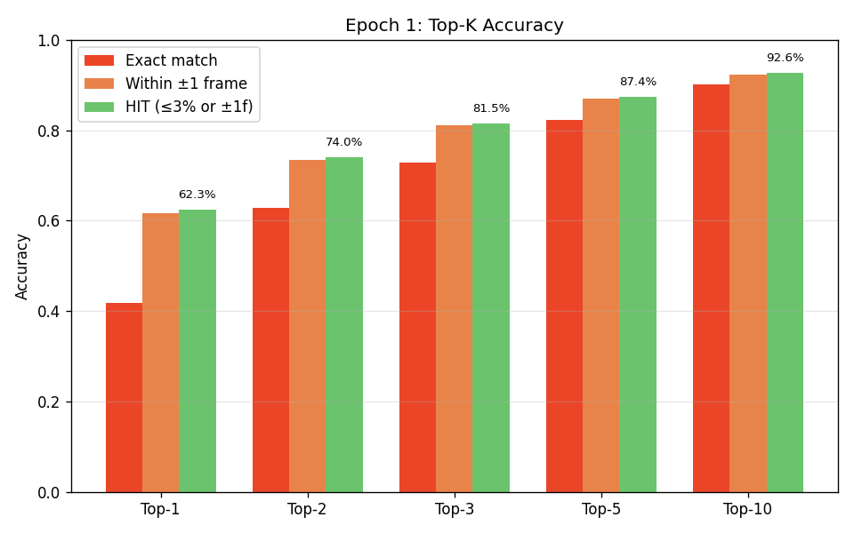
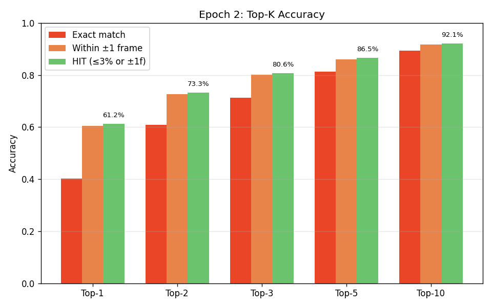
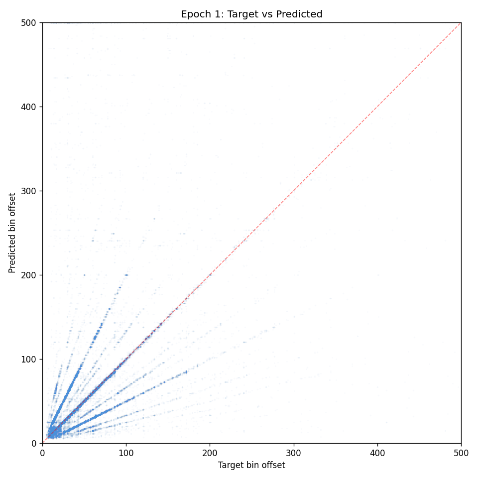
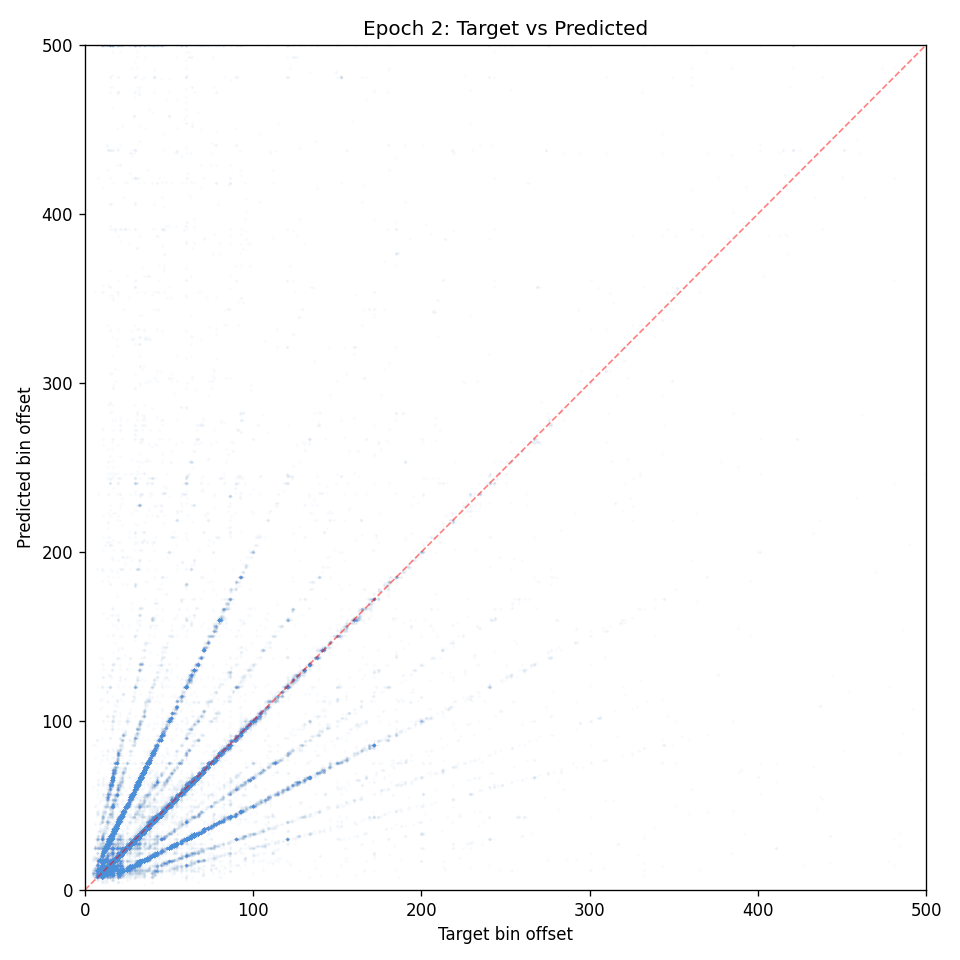
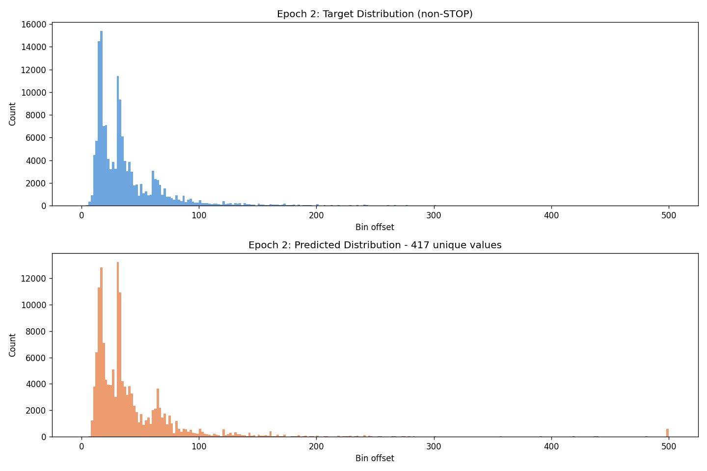
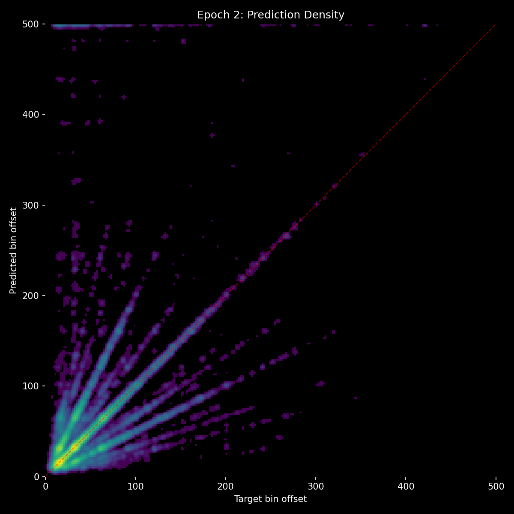
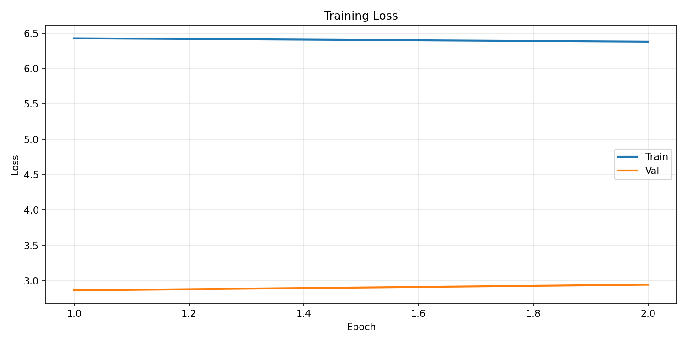
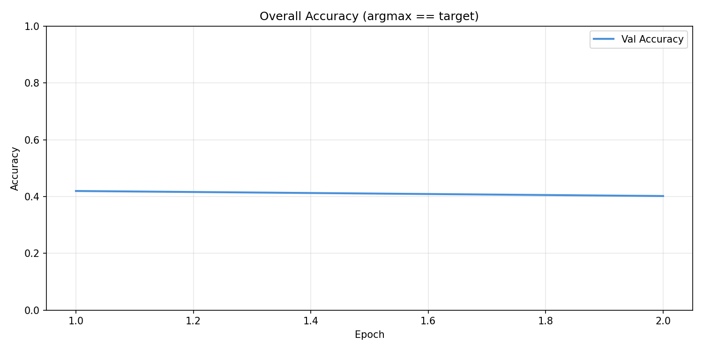
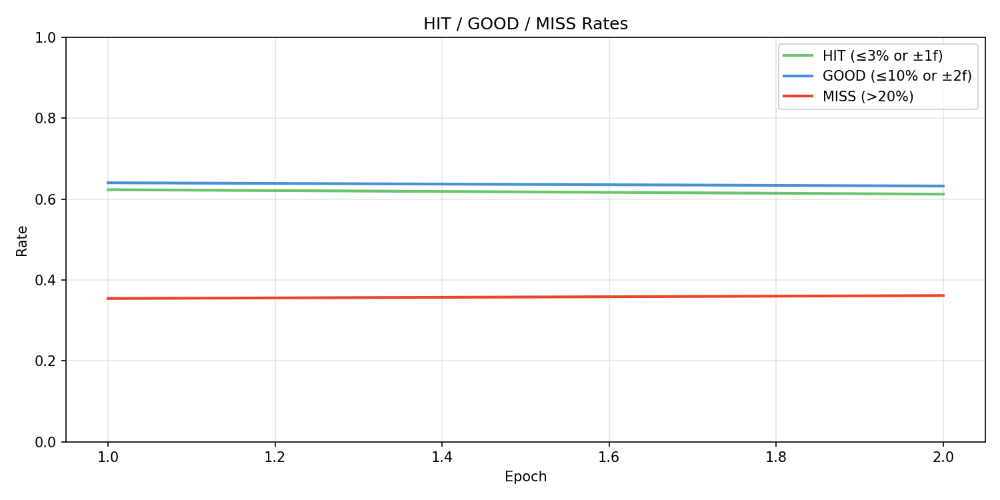

# Experiment 16 - Rank-Weighted Context Loss

> **[Full Architecture Specification](ARCHITECTURE.md)** — self-contained reproduction guide with all model, loss, training, and dataset details.


## Hypothesis

Experiment [15](../experiment_15/README.md) confirmed that standard CE aux loss (0.1) cannot break the context path's rubber-stamping local minimum. After 4 epochs, no_events accuracy never dropped below full accuracy - the context path contributes nothing despite direct gradient pressure.

**Why standard CE fails here:** The context path's optimal lazy strategy is "agree with audio's #1 choice." This is correct ~67% of the time (audio's hit rate). Standard CE treats all wrong answers equally - predicting bin 50 when the target is bin 48 (audio's #2) gets the same gradient as predicting bin 50 when the target is bin 300 (audio's #200). There's no signal saying "audio literally handed you the answer at rank 2 and you ignored it."

**The fix - rank-weighted context loss:** Weight each sample's context CE by how highly audio ranked the true target:

```
weight = clamp(5 / (rank + 4), min=0.1, max=1.0)
```

| Audio rank of target | Weight | Meaning |
|---------------------|--------|---------|
| 1 | 1.0 | Audio nailed it - context must agree |
| 2 | 0.83 | Very available, strong push |
| 3 | 0.71 | |
| 5 | 0.56 | |
| 10 | 0.36 | Still meaningful |
| 20 | 0.21 | Weak signal |
| 50+ | 0.10 | Not context's job, floor gradient |

This directly incentivizes "learn to select from audio's candidates" rather than "learn to predict independently." When audio has the right answer at #2 but context picks #1 (wrong), context gets 8.3x more gradient than when audio has it at #50.

### Why this avoids instability

- **Detached**: weights computed from `audio_logits` under `no_grad()` - no feedback loop through context
- **Bounded**: 10x max/min ratio (1.0 vs 0.1), not 500x
- **Smooth**: `1/(rank+4)` has no cliffs or discontinuities
- **Floor**: every sample gets at least 0.1x gradient - context still learns on hard samples
- **Safe for shared encoders**: mean weight across a batch ~0.3-0.5, same order as the old 0.1 flat weight

### Changes

**Loss:** `main + 0.2 * audio_aux + rank_weighted_context`
- Main loss: unchanged (OnsetLoss on combined logits)
- Audio aux: 0.2 * OnsetLoss (unchanged, not touched)
- Context: per-sample `weight * OnsetLoss(context_logits, target)` where weight = `clamp(5/(rank+4), 0.1, 1.0)`
- No outer multiplier on context - the weighting itself controls magnitude
- Reuses OnsetLoss internals (soft targets, hard_alpha mix, STOP weight) for consistency

Everything else identical to exp [14](../experiment_14/README.md)/[15](../experiment_15/README.md): same architecture (~21M params), same dataset (taiko_v2), same AR augmentations, same 10 ablation benchmarks.

### Expected outcomes

- **Context path activates**: no_events accuracy should drop below full accuracy (5-10pp gap)
- **Top-1 to top-3 gap narrows**: context learns to override audio's #1 when #2/#3 is correct
- **Accuracy breaks past 50%**: context contributes on top of audio's ~50% ceiling
- **Ray patterns reduce**: context uses event spacing to disambiguate harmonic multiples
- **Audio path unaffected**: audio aux still 0.2, no changes to audio gradient

### Risk

- Rank weighting could make context a *better* rubber-stamper (always agreeing with audio more confidently) rather than an independent selector. Watch for: no_events staying equal to full accuracy but with higher confidence.
- If mean context gradient is too high (batch mean weight > 0.5), training could destabilize. Watch for: val_loss oscillating or increasing vs exp [14](../experiment_14/README.md)/[15](../experiment_15/README.md).

## Result

**Failed - context actively degraded combined output.** Stopped at E2. Val loss *increased* E1→E2, accuracy dropped to 40%, and top-K curves fell uniformly. The rank-weighted loss forced context to have strong opinions before it had learned anything useful, and those wrong opinions corrupted the combined logits.

### Trajectory (2 epochs)

|   E | loss  |   acc |   hit |  miss | stop  |  p99 | no_ev | no_au | metro | t_sh  |
|-----|-------|-------|-------|-------|-------|------|-------|-------|-------|-------|
|   1 | 2.865 | 42.0% | 62.3% | 35.4% | 0.342 |  246 | 42.9% |  0.3% | 43.1% | 41.5% |
|   2 | 2.946 | 40.2% | 61.2% | 36.1% | 0.386 |  204 | 41.4% |  0.3% | 41.5% | 41.8% |

### vs [Exp 14](../experiment_14/README.md) E2

| Metric | [Exp 14](../experiment_14/README.md) E2 | Exp 16 E2 |
|--------|-----------|-----------|
| val_loss | 2.670 | **2.946** (+0.276) |
| accuracy | 48.8% | **40.2%** (-8.6%) |
| hit_rate | 67.3% | **61.2%** (-6.1%) |
| top-10 HIT | ~95% | **92.1%** |
| no_events | 50.7% | **41.4%** |

### Top-K (E2)

| Top-K | [Exp 14](../experiment_14/README.md) E1 | Exp 16 E1 | Exp 16 E2 |
|-------|-----------|-----------|-----------|
| Top-1 | 66.8% | 62.3% | **61.2%** |
| Top-3 | 86.0% | 81.5% | **80.6%** |
| Top-10 | 95.2% | 92.6% | **92.1%** |

The entire top-K curve dropped 3-5pp uniformly and continued falling. Since audio path is unchanged, this confirms context is pulling correct answers *out* of the top-K - wrong opinions are worse than no opinions.

### Density Benchmarks

| Benchmark | E1 | E2 |
|-----------|-----|-----|
| zero_density | 8.9% | **6.0%** |
| random_density | 34.6% | **33.9%** |
| full − zero gap | 33.1pp | **34.2pp** |

Context leaned heavily into density as a crutch - zero_density crashed to 6% (vs 24% in exp [15](../experiment_15/README.md)). The rank weighting pushed context to find *any* shortcut to differentiate audio's top candidates, and density was the easiest one.











## Lesson

**You can't loss-function your way out of a structural problem.** Both exp [15](../experiment_15/README.md) (flat context aux) and exp 16 (rank-weighted context aux) failed to activate the context path. The root cause is architectural: with additive logits (`audio + context`), context's optimal strategy is always to be a no-op or amplify audio. The path of least resistance will always win regardless of loss weighting.

**Wrong opinions are worse than no opinions.** Exp [15](../experiment_15/README.md)'s rubber-stamping was at least neutral (matched exp [14](../experiment_14/README.md)). Exp 16's forced opinions were actively harmful - context corrupted audio's correct rankings, dropping top-K by 3-5pp.

**Next direction: architectural change.** The context path needs to be structurally forced into a selector role. Top-K reranking - where audio proposes K candidates and context must pick among them - makes rubber-stamping and no-op architecturally impossible.
