# Experiment 18 - Gradient-Isolated Context with Two-Stage Event Focus

> **[Full Architecture Specification](ARCHITECTURE.md)** — self-contained reproduction guide with all model, loss, training, and dataset details.

## Hypothesis

The context path has failed to learn across 3 experiments ([15](../experiment_15/README.md)-[17](../experiment_17/README.md)). The failures share a common pattern: context either rubber-stamps audio's answer or produces random noise. Three root causes identified:

1. **Gradient interference** (exp [17](../experiment_17/README.md)): Selection loss corrupted shared encoder representations, dropping audio HIT by 7.5pp.
2. **Trivial shortcuts**: Without gradient isolation, context can reproduce audio's ranking through shared encoder gradients rather than understanding events.
3. **Weak event processing**: Context's transformer decoder interleaved event self-attention with cross-attention to audio/candidates from layer 1. Events never got dedicated processing to build temporal pattern understanding before evaluating proposals.

This experiment addresses all three with a clean redesign:

### Core changes

**1. Stop-gradient**

Audio loss trains: `audio_path` + `audio_encoder` + `event_encoder` + `cond_mlp`
Selection loss trains: `context_path` ONLY (all encoder outputs detached)

This prevents selection loss from corrupting shared encoder representations (the exp [17](../experiment_17/README.md) failure mode).

**2. Two-stage context architecture (new)**

Previous context paths used a single bank of decoder layers where event self-attention and candidate cross-attention were interleaved from the start. Events never reasoned about temporal patterns in isolation.

New architecture separates processing into two explicit stages:

- **Stage 1 — Event understanding** (2 TransformerEncoderLayers): Pure self-attention over events with FiLM conditioning. No candidates visible. This is where context learns rhythm, spacing, interval patterns. Non-causal — every event sees every other event to build global pattern representations.

- **Stage 2 — Candidate selection** (2 TransformerDecoderLayers): Events (now pattern-aware) cross-attend to 20 candidate embeddings. No causal mask — events already have global context from stage 1, causal masking would undo that for early events. Query token collects consensus → dot-product scoring → K-way logits.

**3. Hard CE loss (replaces soft trapezoid K-way CE)**

Previous experiments used soft targets with trapezoid weighting over the K candidates. This made the optimization landscape ambiguous — multiple candidates got partial credit.

New: simple hard CE. Find which candidate is closest to the true target → that's the correct class. `F.cross_entropy(sel_logits, sel_target)`. Crystal clear signal.

**4. Context IS told about audio's confidence and order**

Candidate embeddings include audio score + normalized rank. #0 is always audio's highest confidence pick. This is intentional — context should know what audio thinks and learn *when* to agree vs override.

### Context path flow

1. Get top-K=20 from `audio_logits.detach().topk(20)`, force-include STOP
2. Build candidate embeddings: `bin_pos_emb + score_proj(score, rank) + audio_feat → combine(d*3 → d)`
3. **Stage 1**: Events + positional embeddings → 2 encoder layers (self-attn + FiLM). Pure pattern learning.
4. **Stage 2**: Append query token → 2 decoder layers (self-attn + cross-attn to candidates + FiLM). No causal mask.
5. Query output → dot-product with each candidate (d_score=64) → K-way logits
6. Scattered to 501-way for metrics compatibility

### Architecture summary

| Component | Layers | Params | Notes |
|-----------|--------|--------|-------|
| AudioEncoder | 4 enc | ~5.7M | Conv + transformer, FiLM, unchanged |
| EventEncoder | 2 enc | ~0.5M | d_event=128 bottleneck, unchanged |
| AudioPath | 2 dec | ~4.8M | Audio self-attn + event cross-attn, unchanged |
| ContextPath Stage 1 | 2 enc | ~3.5M | Event self-attention only, FiLM |
| ContextPath Stage 2 | 2 dec | ~4.7M | Cross-attend to candidates, dot-product scoring |
| **Total** | | **~22.5M** | Context: 9.0M (40%) |

### New metrics

- **`audio_metrics`**: full metric suite from `audio_logits.argmax` alone. Key: `audio_metrics.hit_rate`.
- **`selection_stats`**: override_rate, override_accuracy, audio_hit_rate, final_hit_rate, context_delta, rescued_rate, damaged_rate.
- Console shows `audio_HIT=X%` alongside `HIT=X%`.

### Expected outcomes

1. **Audio HIT ~69%** — gradient isolation protects audio quality.
2. **Context should NOT rubber-stamp** — two-stage architecture forces event understanding before candidate evaluation. Hard CE gives clear signal.
3. **Override rate > 0%** — context evaluates candidates through event-informed representations, not just audio's ranking.
4. **Context delta positive** — even 1-2pp proves context adds value.
5. **Rescued > damaged** — overrides should be net-positive.

### Risk

- Context's 2+2 layers at d_model=384 with detached inputs may still not have enough capacity/signal to learn useful selection patterns.
- Without causal masking in stage 2, the query token may attend too uniformly across events, failing to extract a focused decision signal.
- Hard CE with 20-way classification where the correct answer is often class 0 (audio's #1) creates an imbalanced classification problem. Context may still learn "always pick 0" as the path of least resistance — but this time it would be via the classification head rather than via the candidate embeddings.
- If the shared event encoder's representations are too audio-specific (optimized for audio's cross-attention), context's stage 1 may not be able to extract useful temporal patterns from them even with 2 dedicated layers.

## Result

**Failed.** Killed after E2. Context actively harmful and worsening.

| Metric | E1 | E2 | Trend |
|--------|----|----|-------|
| Audio HIT | 67.5% | 67.4% | Stable (stop-grad works) |
| Final HIT | 67.1% | 66.4% | Declining |
| Context delta | -0.45pp | -0.94pp | Worsening |
| Override rate | 4.9% | 6.0% | Rising |
| Override accuracy | 37.9% | 35.2% | Falling |
| Rescued rate | 29.9% | 29.2% | Flat |
| Damaged rate | 39.2% | 44.8% | Rising |
| Rank 0 selection | 95.1% | 93.9% | Slowly diversifying |

**What worked:**
- Stop-gradient: Audio HIT 67.5% at E1, healthy and protected. Proven technique.
- Audio metrics collection: clean separation of audio-only vs context-reranked performance.

**What failed:**
- Context overrides were net-harmful from E1, getting worse at E2 (damaged 45% > rescued 29%).
- Two-stage architecture did not prevent rubber-stamping — 94% rank-0 selection.
- Hard CE did not provide a stronger learning signal than soft trapezoid.
- Override accuracy 35% — worse than coin flip, worse than exp [17](../experiment_17/README.md)'s 52%.

**Risk #3 from hypothesis confirmed:** Hard CE with imbalanced 20-way classification where class 0 is correct ~95% of the time led to "mostly pick 0, occasionally pick wrong."

## Graphs

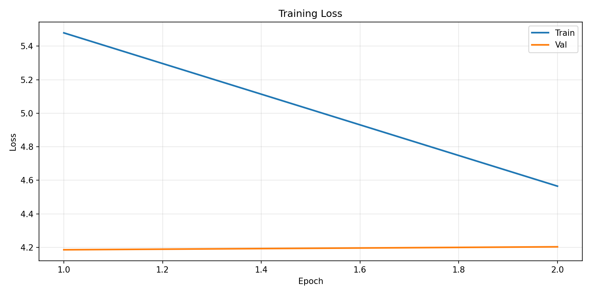
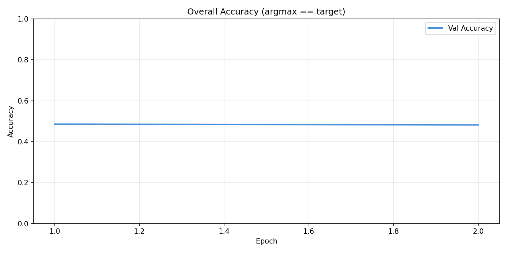
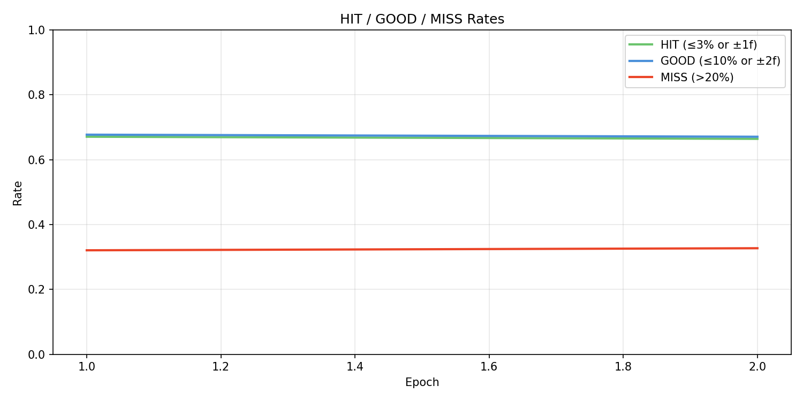
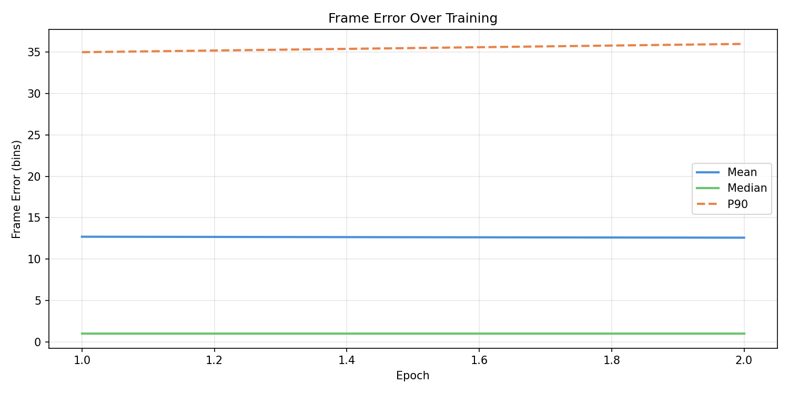
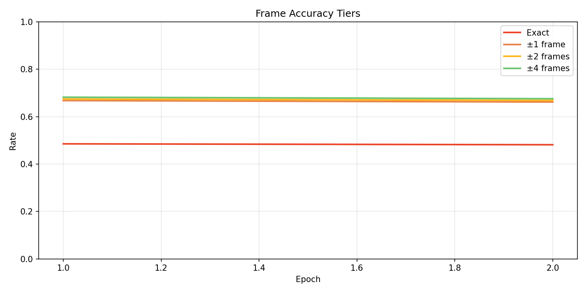
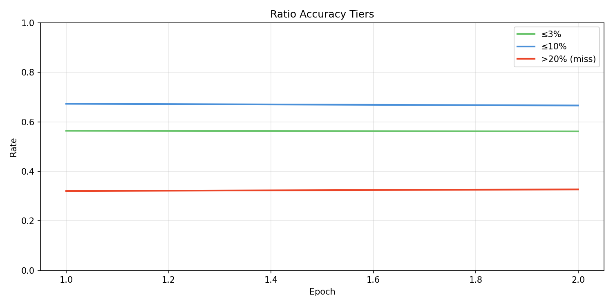
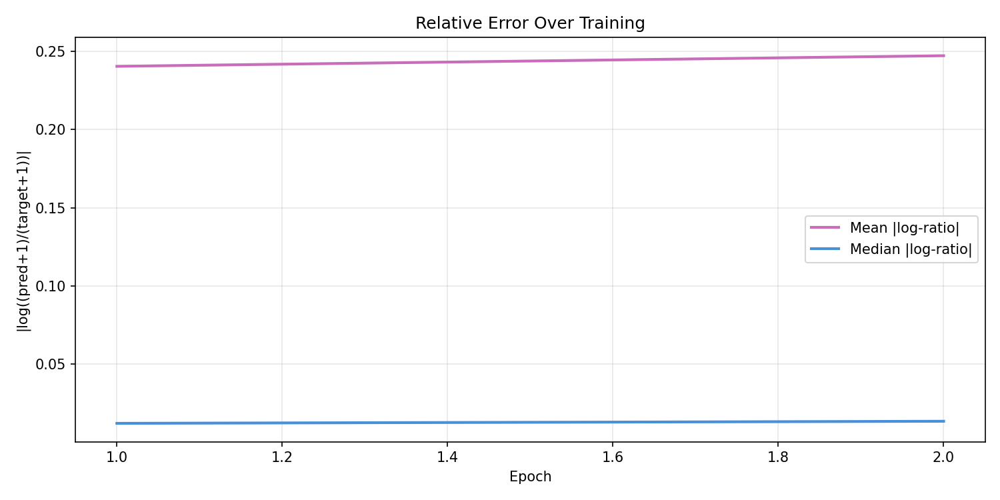
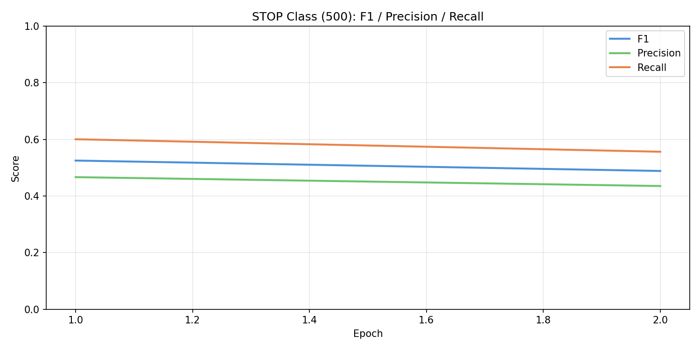
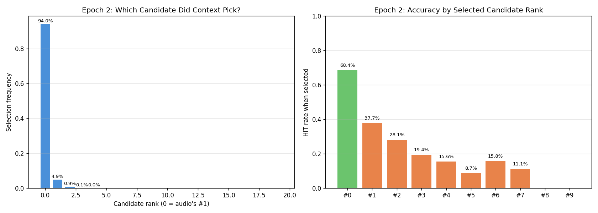
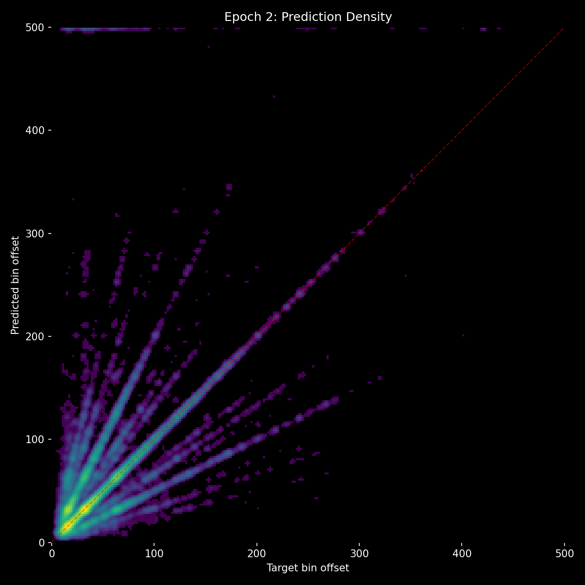
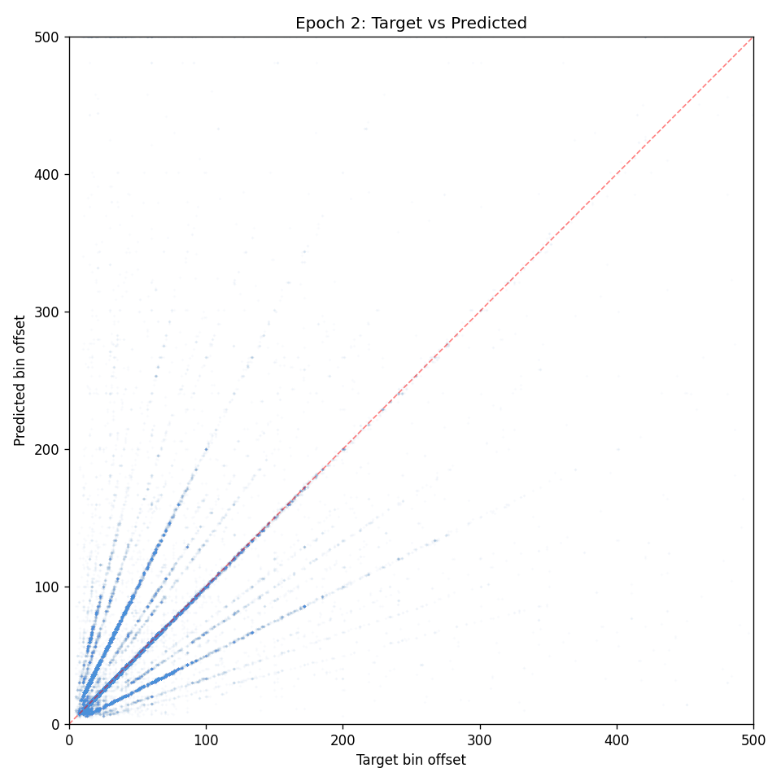

## Lesson

**The reranking paradigm itself may be fundamentally flawed for this problem.** Across 4 experiments ([15](../experiment_15/README.md)-18), no architecture, loss function, or gradient strategy has produced a context path that adds value. The core issue: context needs to determine "is audio wrong here?" — but the signal for that is weak (audio is right ~70% of the time) and the event patterns that would indicate errors are subtle.

- Stop-gradient works and should be kept for any future multi-path architecture.
- Two-stage event processing (self-attn before cross-attn) is architecturally sound but didn't help because the underlying task — reranking audio's candidates using event patterns — may not be learnable at this scale.
- 5 experiments of context failure ([15](../experiment_15/README.md)-18) suggest the problem isn't architecture or loss — it's that event history doesn't contain enough information to second-guess audio's timing predictions. Context may be more useful for *type* prediction (don vs ka) or *density* modulation rather than timing correction.
