# Experiment 19 - Gap-Based Context with Own Encoders

## Hypothesis

Across experiments 15-18, every context path failed to add value for timing prediction. A common thread: context operated on representations it didn't control (shared encoder features, detached) and in a feature space (absolute bin positions) that made rhythm patterns implicit rather than explicit.

Two key insights drive this redesign:

1. **Rhythm is about gaps, not positions.** A sequence of events at bins [-500, -350, -200, -100, -50] is hard to reason about. The gaps [150, 150, 100, 50] immediately reveal a regular rhythm that's accelerating. Candidates should be expressed the same way - "this candidate proposes a 65-bin gap after the last event" instead of "this candidate is at bin 15."

2. **Context needs its own audio understanding.** Previous context paths either had no audio (exp 15-16), grabbed audio tokens from the shared encoder (exp 17-18), or relied entirely on event positions. But context needs to know *what events sounded like* - "past events were on drum transients, this candidate also has a drum transient" is exactly the signal needed to distinguish good from bad candidates.

### Core changes

**1. Gap representation (replaces absolute bin offsets)**

Events are converted from positions to inter-onset intervals:
- `gaps[i] = offset[i+1] - offset[i]` for consecutive events
- `cursor_gap = -offset[-1]` (time since last event, appended)
- Candidates expressed as `proposed_gap = candidate_bin - last_event_offset`

Events and candidates now live in the same "gap space." The task becomes: "given rhythm pattern [150, 150, 100, 50], which proposed next gap [53, 65, 78, 145] best continues it?"

**2. Local audio snippets (~50ms mel windows)**

Each event and each candidate gets a ~50ms mel spectrogram snippet extracted at its position. A small snippet encoder (shared between events and candidates) processes these into features. This gives context:
- "What did past events sound like?" (drum transients, vocals, silence)
- "What does the audio look like at each candidate position?"
- STOP candidates get a learned embedding instead of a snippet.

Events outside the mel window (>2.5s ago) get zero snippets - they still have gap info, just no audio detail. Natural falloff.

**3. Own encoders (no shared encoder dependency)**

Context has its own gap encoder and snippet encoder, both trained directly by selection loss. No detach needed - context doesn't use shared encoder outputs at all. Gradient isolation is structural, not via stop-gradient.

- Gap encoder: sinusoidal gap encoding + snippet features → self-attention + FiLM
- Snippet encoder: Linear(800 → d_ctx → d_ctx), shared across events and candidates

**4. Smaller, focused architecture (d_ctx=192)**

Context operates at d_ctx=192 instead of d_model=384. The task (gap pattern matching + local audio comparison) is simpler than full audio encoding. Fewer parameters = less overfitting risk.

### Architecture

| Component | Layers | Params | Notes |
|-----------|--------|--------|-------|
| AudioEncoder | 4 enc | 8.0M | Unchanged |
| EventEncoder | 2 enc | 0.5M | Used by audio path only |
| AudioPath | 2 dec | 5.0M | Unchanged |
| Context snippet encoder | 2 linear | 0.2M | 80*10=800 → 192, shared for events+candidates |
| Context gap encoder | 2 enc | 0.9M | Self-attention over gap+snippet features, FiLM |
| Context selection head | 2 dec | 1.2M | Cross-attend to candidates, dot-product scoring |
| **Total** | | **16.0M** | Context: 2.5M (16%), down from 9.0M/22.5M |

### Context path flow

1. Compute gaps from event offsets: `diff(offsets)` + `time_since_last`
2. Extract ~50ms mel snippets at each event position and cursor
3. Gap encoder: `gap_emb(gaps) + snippet_feat + seq_pos_emb` → 2 encoder layers + FiLM → rhythm representation
4. For each of K=20 candidates: `gap_emb(proposed_gap) + snippet_feat + score_proj(score, rank)` → combine → candidate embedding
5. Selection: rhythm repr + query token → 2 decoder layers cross-attending to candidates + FiLM
6. Query output → dot-product with candidates → K-way logits → scattered to 501-way

### Loss

Same as exp 18: hard CE on selection (closest candidate to true target) + standard onset loss on audio logits. Audio loss trains encoders + audio path. Selection loss trains context path only.

### Metrics

Same as exp 18:
- `audio_metrics`: full suite from `audio_logits.argmax` alone
- `selection_stats`: override_rate, override_accuracy, audio_hit_rate, final_hit_rate, context_delta, rescued_rate, damaged_rate

### Expected outcomes

1. **Audio HIT ~69%** - context is fully isolated, can't affect audio.
2. **Context override accuracy > 50%** - gap patterns give explicit rhythm signal that was missing in exp 15-18. When context disagrees, it should have a reason (rhythm mismatch).
3. **Context delta ≥ 0** - even break-even would be a first. A positive delta proves rhythm patterns are learnable.
4. **Rescued > damaged** - overrides should be net-positive.

### Risk

- Gap patterns may be too simple to distinguish "audio is wrong" from "audio is right" - both present similar gap histories, the difference is subtle.
- Snippet encoder at 191K params may not learn useful audio features. The 800→192 linear is aggressive compression.
- d_ctx=192 with 6 heads (32 per head) may have insufficient capacity for cross-attention between 128 gap elements and 20 candidates.
- Class imbalance: audio's #1 pick is correct ~70% of the time, so "always pick 0" remains a strong baseline even with gap features.

## Result

**Most promising context results yet, but still net-negative.** Killed after E3.

| Metric | E1 | E2 | E3 |
|--------|----|----|-----|
| Audio HIT | 66.8% | 68.1% | 67.3% |
| Final HIT | 65.9% | 67.9% | 66.9% |
| Context delta | -0.89pp | **-0.18pp** | -0.44pp |
| Override rate | 8.1% | 6.1% | 6.1% |
| Override accuracy | 36.5% | **40.4%** | 38.2% |
| Override F1 | 14.6% | 13.3% | 12.2% |
| Rescued | 31.1% | 36.7% | 32.5% |
| Damaged | 42.1% | 39.6% | 39.7% |
| True Top1 | 63.0% | 65.4% | 64.5% |
| False Top1 | 29.0% | 28.5% | 29.4% |
| True TopK | 2.9% | 2.5% | 2.3% |
| False TopK | 3.8% | 2.7% | 2.8% |
| Inaccurate TopK | 1.7% | 1.2% | 1.3% |

**What worked:**
- Gap-based representation is the right framing. During training, context consistently beat audio (54.2% vs 52.5% HIT at 58% through E1). First time context ever outperformed audio on any metric.
- Own encoders with direct gradient signal - context path trained without detach, gradient isolation is structural (no shared encoder outputs used).
- Override accuracy (36-40%) is better than exp 18's declining 35%, and E2 hit 40.4%.
- Delta reached -0.18pp at E2 - closest to break-even any context experiment has achieved.
- New metrics (override F1, decision categories) give clear diagnostic signal.

**What didn't work:**
- Training advantage didn't fully transfer to validation - context memorized training patterns but didn't generalize.
- Delta bounced between -0.18pp and -0.89pp rather than converging toward zero.
- Override F1 slowly declined (14.6% → 12.2%) - context didn't improve at overriding over epochs.
- ~29% false_top1 (kept #1 when it was wrong) shows massive untapped opportunity.

**Key issue: audio instability during training.**
Context learns to rerank proposals from an audio model that is itself still learning. Early batches have ~15% HIT audio proposals - mostly garbage. Context wastes capacity learning patterns about bad proposals that become irrelevant as audio improves. By E3, audio has stabilized near 67-69% but context has already baked in noisy patterns.

## Graphs

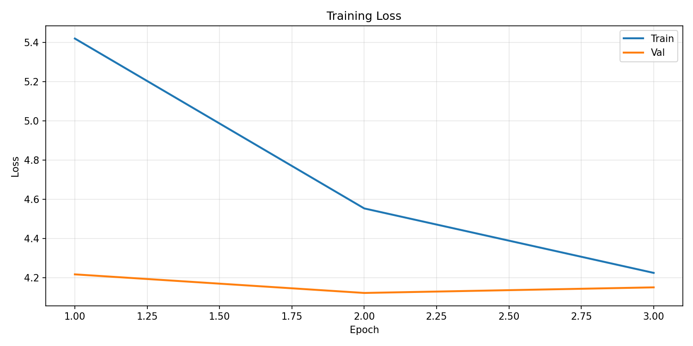
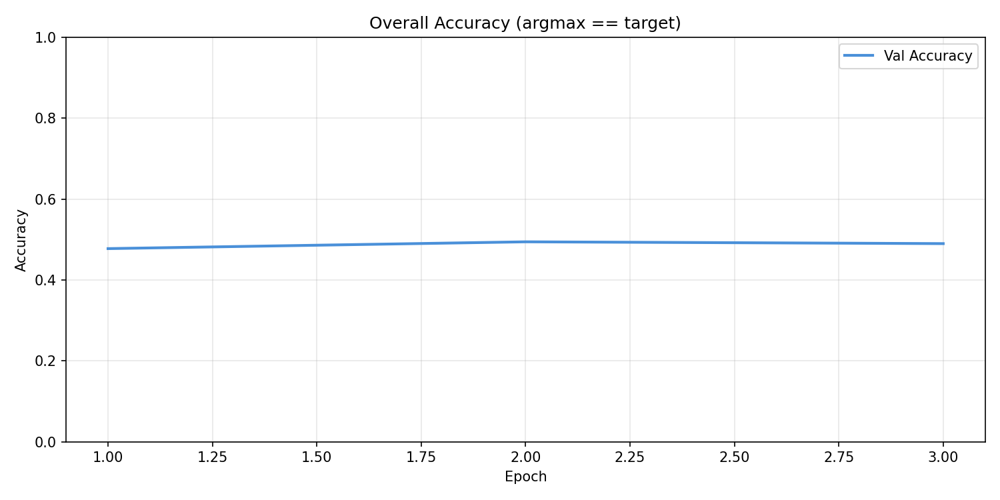
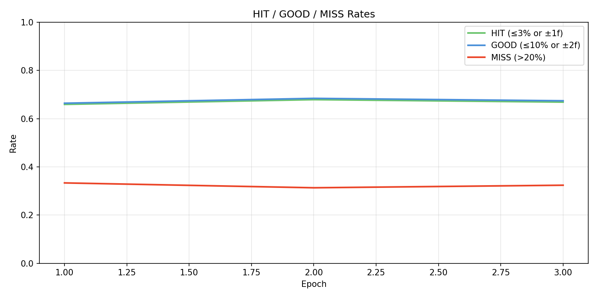
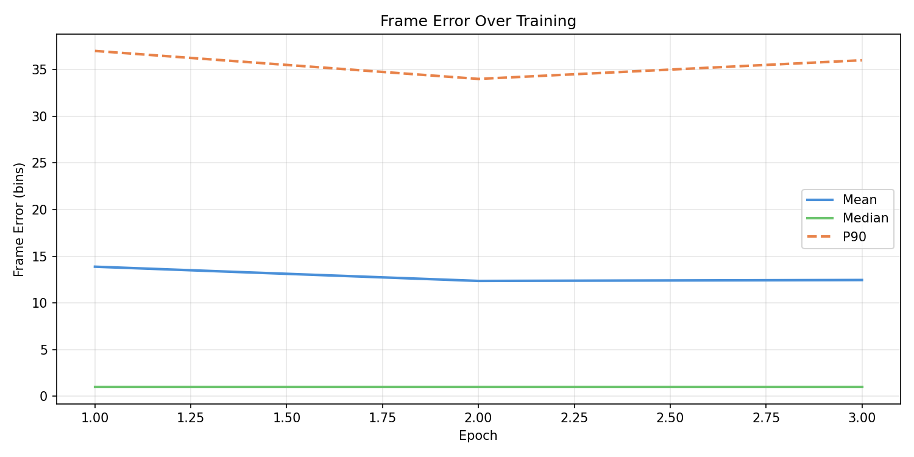
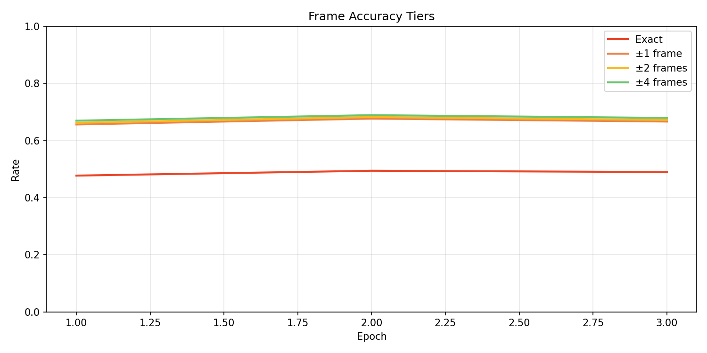
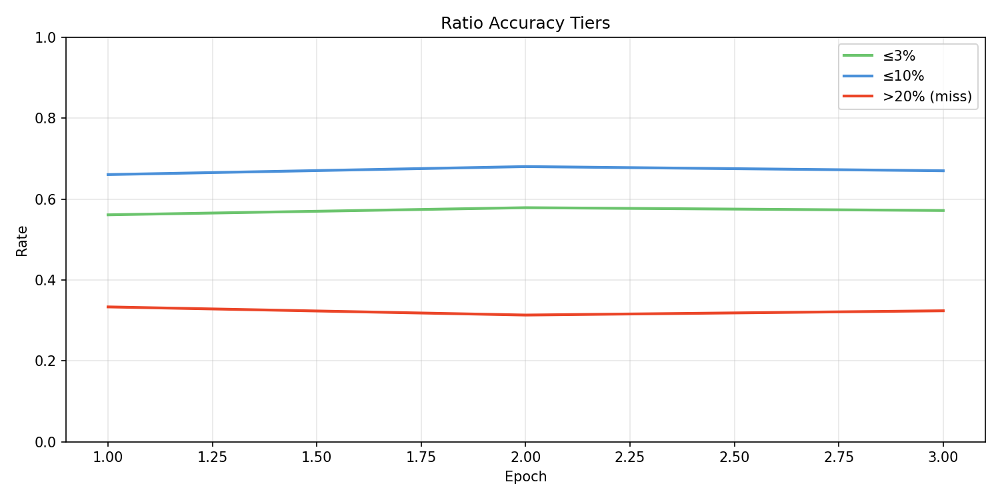
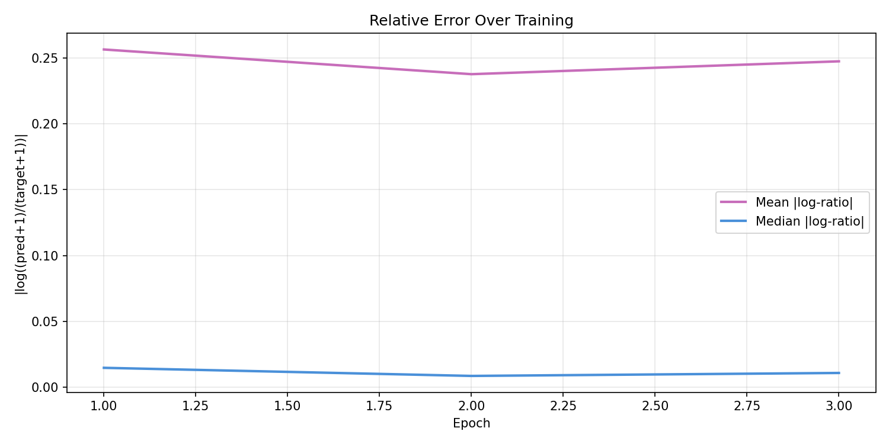
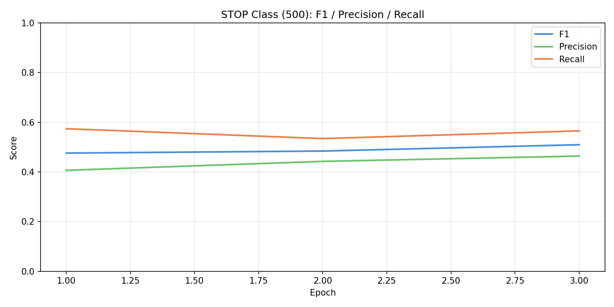
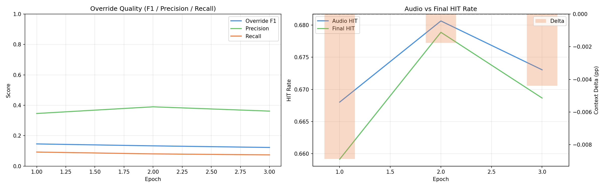
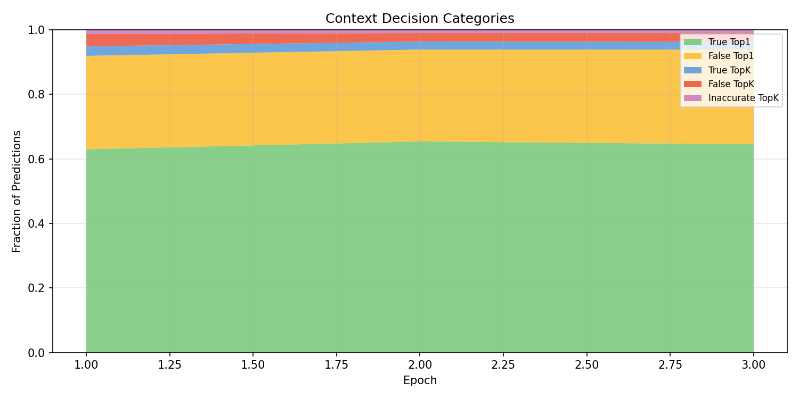
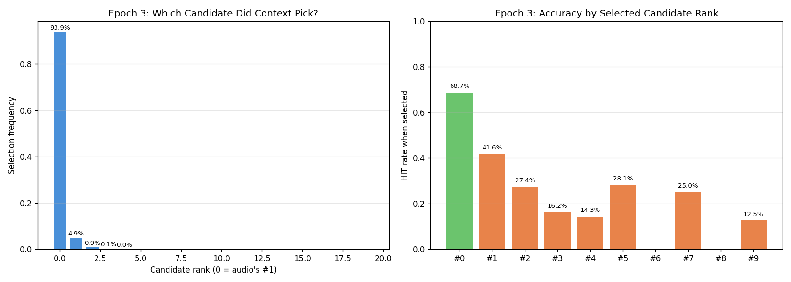
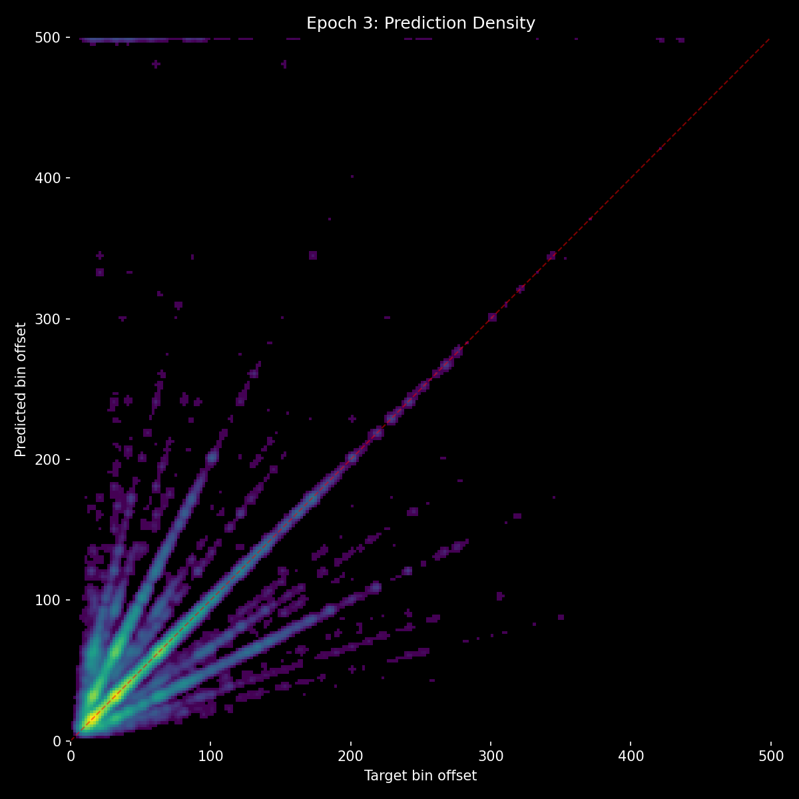
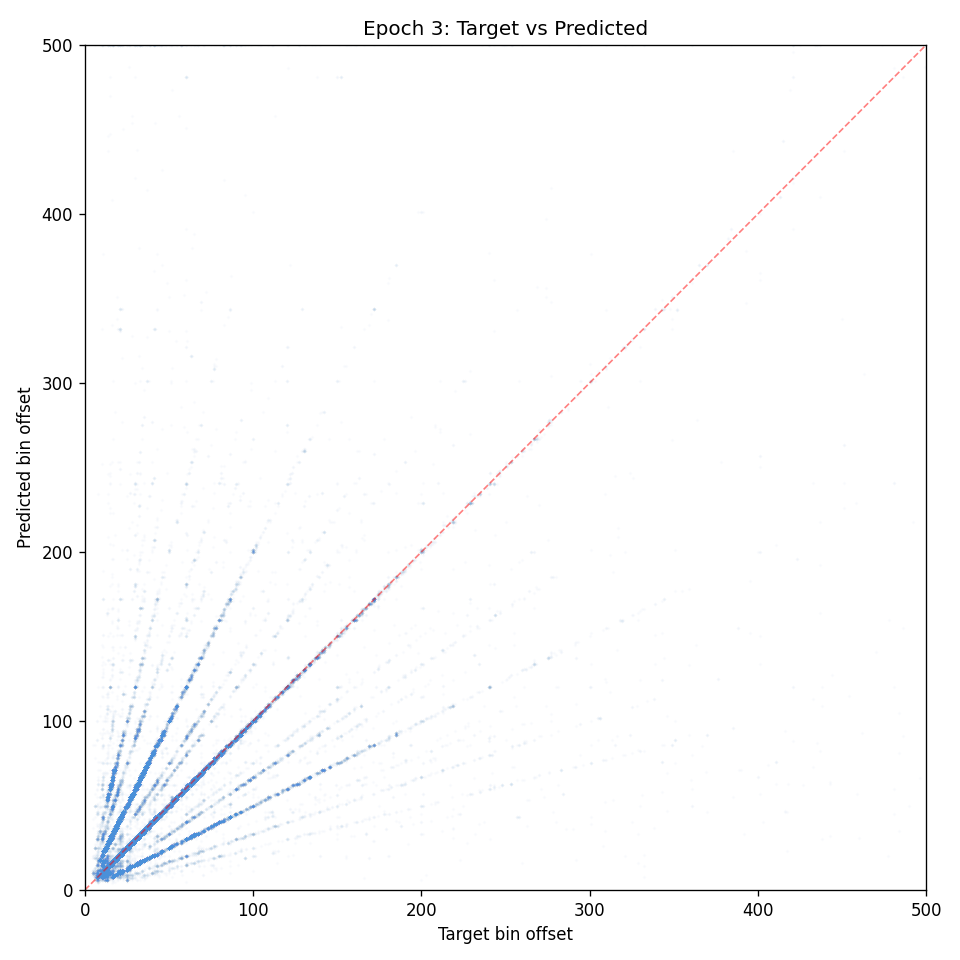

## Lesson

- **Gap representation works** - inter-onset intervals + local audio snippets + own encoders is the right architecture for context. First experiment where context showed positive signal during training.
- **Unstable proposer poisons the selector** - context can't learn to rerank well when the proposals themselves are changing. The ~29% false_top1 rate (missed overrides) suggests context is too conservative, possibly because early noisy overrides were punished.
- **Next step: warm-start audio from exp 14** - load trained audio weights, freeze them, only train the 2.5M context path against stable high-quality proposals. Also mask selection loss when target isn't in top-K to remove impossible training signal.
