# Experiment 20 - Warm-Start + Frozen Audio, Context-Only Training

## Hypothesis

Exp 19 showed the gap-based context architecture is correct - first experiment where context beat audio during training, and delta reached -0.18pp (best ever). But context plateaued around "slightly harmful" because it spent early epochs learning to rerank garbage proposals from an untrained audio model.

Two problems identified:

1. **Unstable proposer**: Audio goes from ~15% HIT to ~68% HIT during training. Context's early learning about bad proposals becomes noise as audio improves. The selector can't learn a stable reranking strategy when the proposals keep changing.

2. **Impossible training signal**: When audio doesn't have the correct answer in its top-20 (~2.5% at convergence, much more early on), selection loss trains context toward the "least wrong" pick with full confidence. Pure noise.

### Changes from exp 19

**1. Warm-start audio from exp 14 best checkpoint**

Load `audio_encoder`, `event_encoder`, `audio_path`, `cond_mlp` from exp 14's best.pt (epoch 6, 69.2% HIT, 50.5% accuracy). Context gets competent proposals from batch 1 - no garbage phase.

**2. Freeze audio components**

All audio components frozen (`requires_grad=False`). Only the 2.5M context path trains. Benefits:
- Audio is already at its best (69.2% HIT) - no risk of degradation
- Stable proposals throughout training - context learns a consistent reranking strategy
- Faster training - no audio backward pass, only 2.5M params vs 16M
- Clean gradient signal - all optimization budget goes to context

**3. Mask selection loss when target not in top-K**

If no candidate is within ±1 frame of the true target (and it's not STOP), that sample's selection loss is zeroed. Removes impossible training signal. At exp 14's quality (~97.5% target in top-K), this filters ~2.5% of samples.

### Architecture

Identical to exp 19 - gap-based context with own encoders.

| Component | Params | Training |
|-----------|--------|----------|
| AudioEncoder | 8.0M | **Frozen** (from exp 14) |
| EventEncoder | 0.5M | **Frozen** (from exp 14) |
| AudioPath | 5.0M | **Frozen** (from exp 14) |
| cond_mlp | ~8K | **Frozen** (from exp 14) |
| Context gap encoder | 0.9M | Training |
| Context snippet encoder | 0.2M | Training |
| Context selection head | 1.2M | Training |
| Context scoring | 0.025M | Training |
| **Total trainable** | **2.5M** | |

### Expected outcomes

1. **Audio HIT = 69.2%** - frozen, should be exactly exp 14's performance.
2. **Context delta > 0** - with stable proposals and clean loss signal, context should find net-positive overrides. Even +0.5pp would be a breakthrough.
3. **Override accuracy > 50%** - gap patterns against stable proposals should produce better-than-coin-flip overrides.
4. **Override F1 improving over epochs** - unlike exp 19 where it declined, stable proposals mean context can accumulate learning.
5. **Faster convergence** - 2.5M params, no audio backward pass.

### Risk

- Audio frozen at exp 14 means the combined model can never exceed what exp 14's audio + context can achieve together. If the audio model's top-K doesn't contain good candidates for a segment, context can't help.
- Exp 14 was trained with the legacy architecture (no top-K reranking). Its audio weights were optimized without a context path. The shared encoders may produce representations that work well for the audio path but aren't ideal for context's snippet extraction.
- If the gap-based context architecture fundamentally can't produce positive delta regardless of training stability, freezing audio won't help - it just removes one variable.

## Result

**Warm-start and freeze work as infrastructure, but didn't solve the core problem.** Killed after E1.

| Metric | Exp 19 E1 | Exp 20 E1 |
|--------|-----------|-----------|
| Audio HIT | 66.8% | **69.5%** (warm-start) |
| Final HIT | 65.9% | **68.3%** |
| Delta | -0.89pp | -1.18pp |
| Override rate | 8.1% | **11.1%** |
| Override accuracy | 36.5% | **41.6%** |
| Override F1 | 14.6% | **22.1%** |
| True TopK | 2.9% | **4.6%** |
| False TopK | 3.8% | 5.8% |
| Inaccurate TopK | 1.7% | 1.7% |
| Rescued | 31.1% | 32.4% |
| Damaged | 42.1% | 43.0% |

**What worked:**
- Warm-start: Audio HIT at 69.5% from step 1 (matching exp 14). No garbage phase.
- Freeze: 2x training speed (12.3 it/s vs ~5.8), audio quality perfectly preserved.
- Selection loss masking: clean signal, no impossible targets.
- Context is bolder - 11.1% override rate (highest yet), 4.6% true_topK (highest yet), override F1 22.1% (highest yet).

**What didn't work:**
- Delta actually worse (-1.18pp vs exp 19's -0.89pp). More overrides, but extra overrides are more wrong than right (false_topK 5.8% > true_topK 4.6%).
- Stable proposals didn't fix the fundamental issue: context can't distinguish "override for a big win" from "override for a big loss."

**The real problem is the loss function, not the training dynamics.** Hard CE rewards only exact correctness. Context is never rewarded for "closer than #1 but not perfect" and never punished for "kept #1 when it was very wrong." This makes "always pick #1" the safe choice under hard CE, since #1 is correct ~70% of the time.

## Graphs

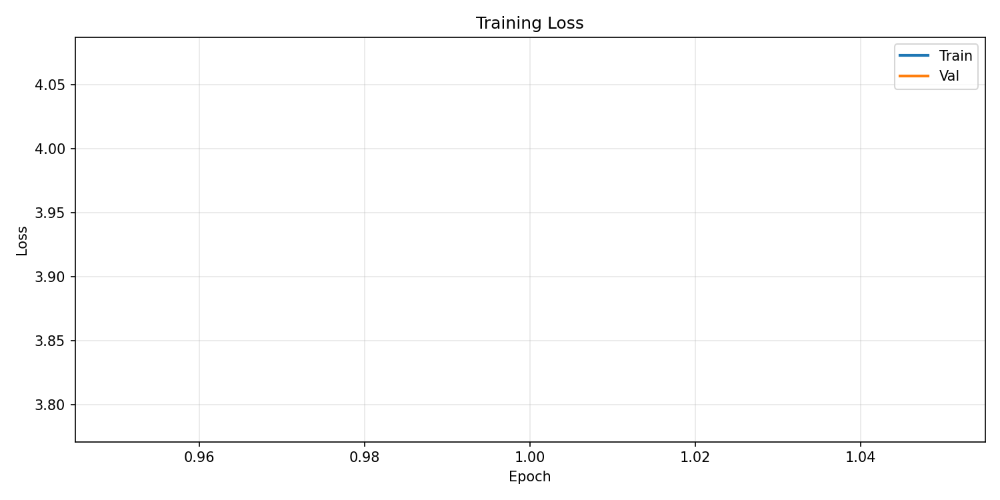
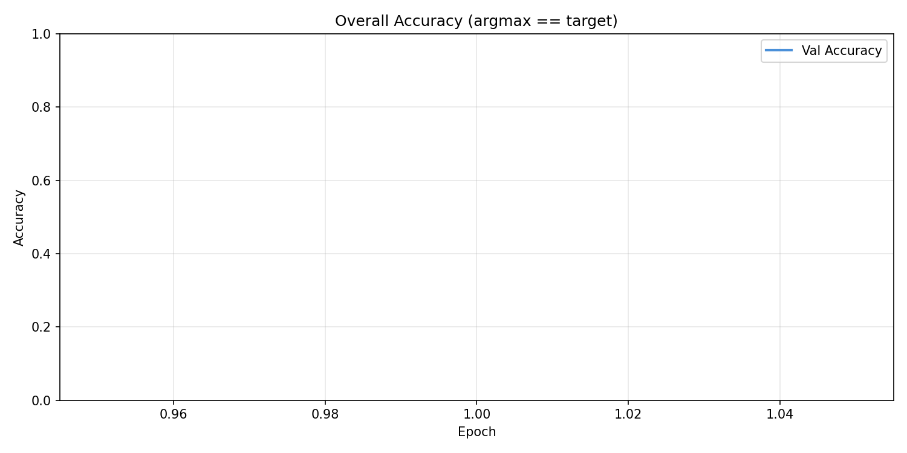
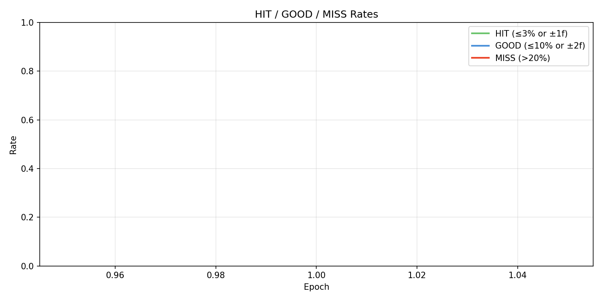
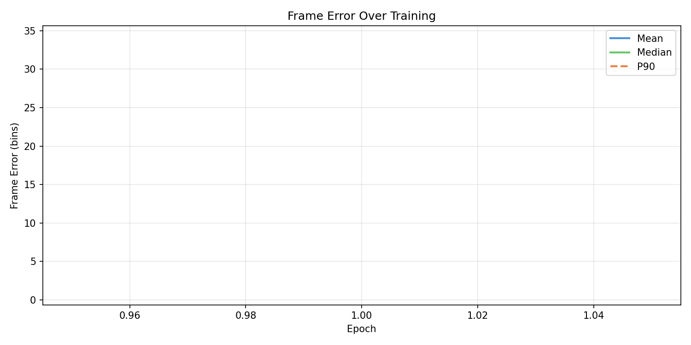
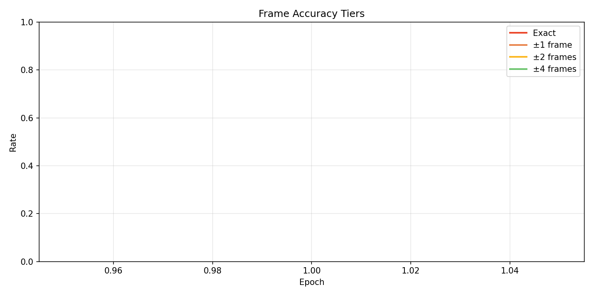
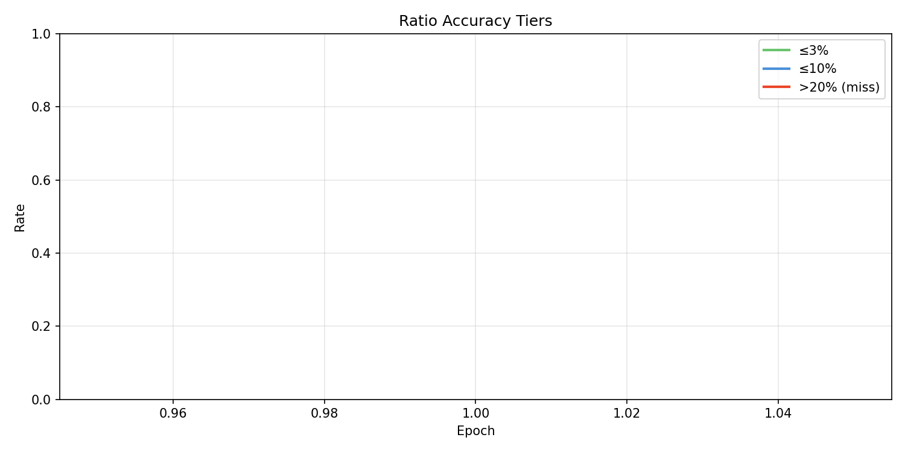
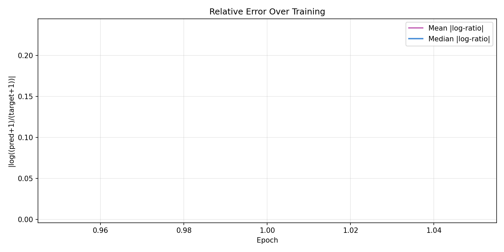
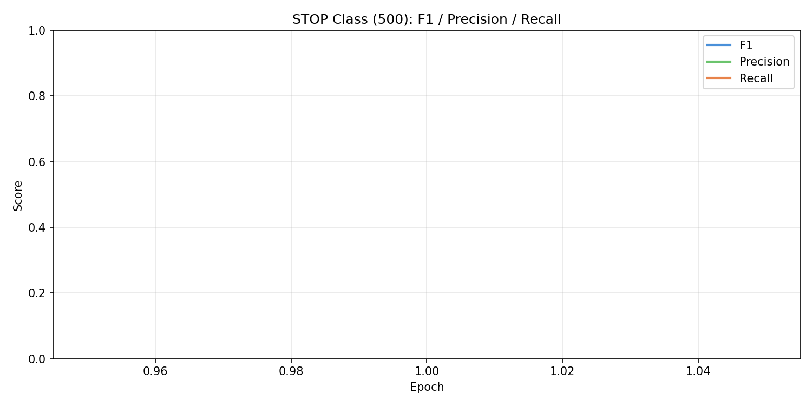
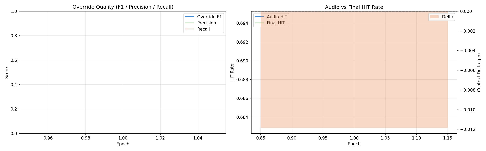
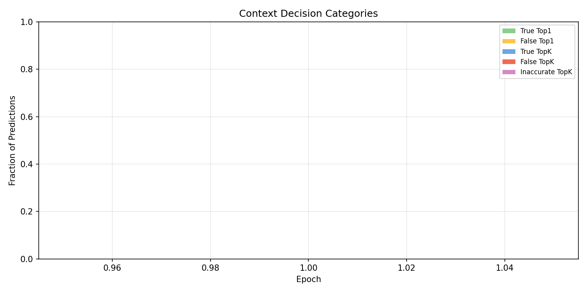
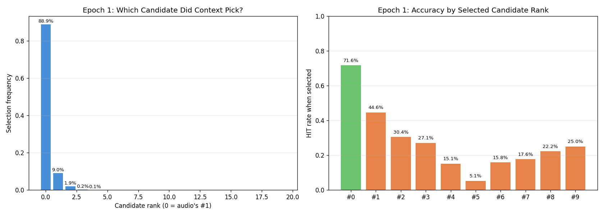
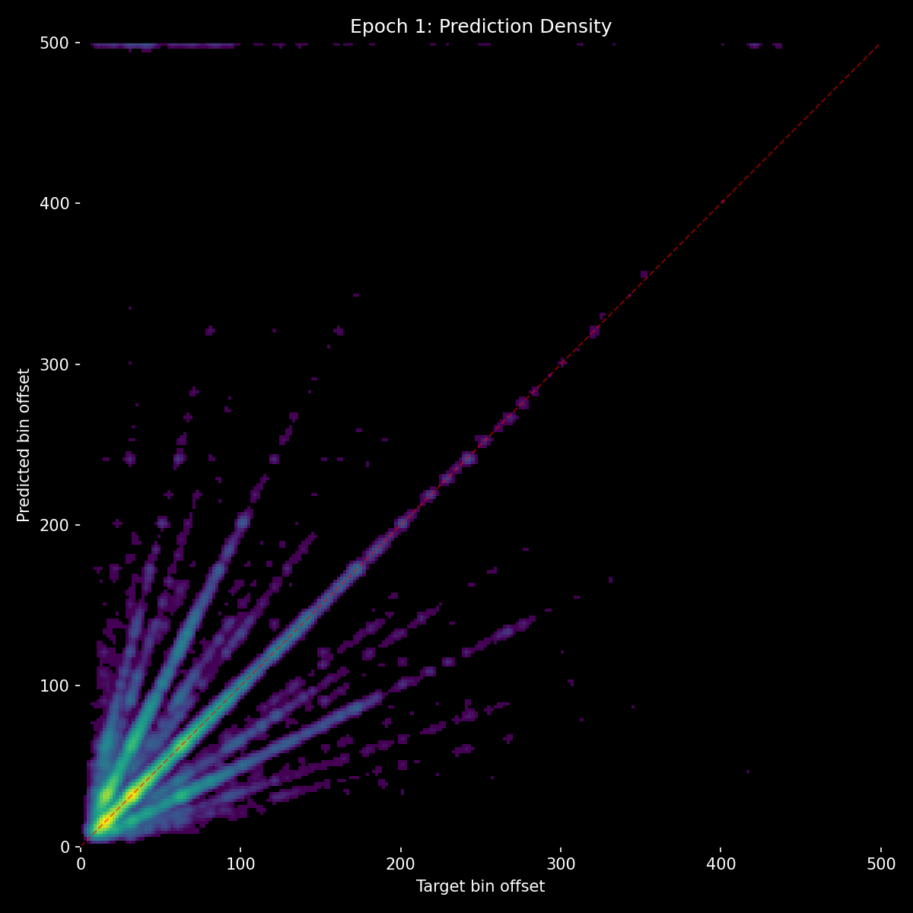
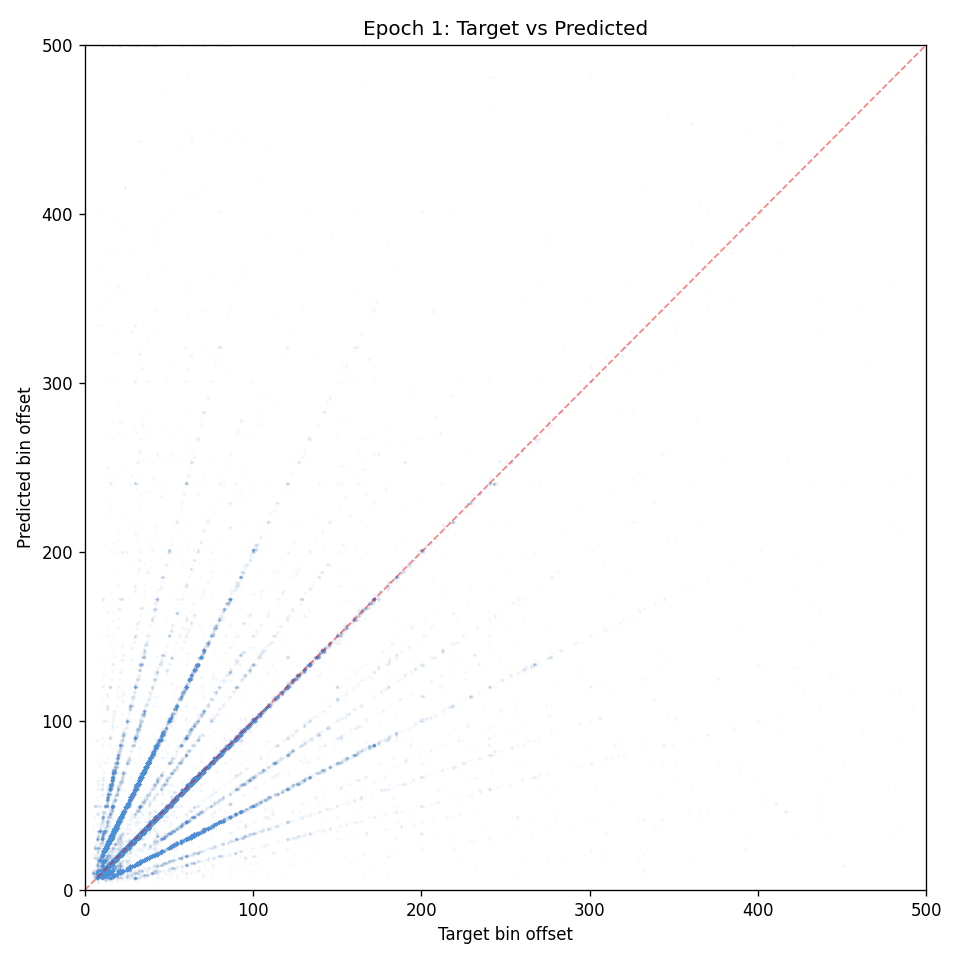

## Lesson

- **Warm-start + freeze are proven infrastructure** - should be used going forward. Audio at full quality from step 1, 2x training speed, clean gradient isolation.
- **The loss function is now the bottleneck.** Architecture (exp 19: gap-based) and training dynamics (exp 20: stable proposals) are solved. Context overrides more and with better accuracy than ever, but hard CE doesn't reward "improvement over audio" - only "exact match." Next: relative quality loss that rewards getting closer to the target than #1, not just finding the exact answer.
