# Experiment 21 - Relative Quality Selection Loss

> **[Full Architecture Specification](ARCHITECTURE.md)** — self-contained reproduction guide with all model, loss, training, and dataset details.


## Hypothesis

Exp [20](../experiment_20/README.md) proved warm-start + freeze are solid infrastructure (69.5% HIT from step 1, 2x speed), and that the gap-based context architecture (exp [19](../experiment_19/README.md)) is correct. But context's overrides are net-harmful (delta -1.18pp) despite best-ever override F1 (22%). The bottleneck is the loss function.

**The problem with hard CE on selection:** Hard cross-entropy rewards only exact correctness - "pick the candidate closest to the true target." This creates three failure modes:

1. **No reward for improvement.** If audio's #1 is 15 frames off and context picks a candidate 3 frames off, hard CE gives the same loss as if context had picked #1. No signal that the override was valuable.
2. **No extra punishment for regression.** If audio's #1 is 1 frame off and context picks something 50 frames off, hard CE gives the same loss as any other wrong answer. No signal that the override was catastrophic.
3. **Missed opportunities are invisible.** When context keeps #1 (no override) but #1 was very wrong and a much better candidate existed, hard CE gives moderate loss. Context learns "keeping #1 is safe" because it avoids the worst-case of picking the wrong override.

The result: "always pick #1" is a stable local minimum under hard CE, since #1 is correct ~70% of the time.

### Changes from exp [20](../experiment_20/README.md)

**1. SelectionLoss (replaces hard CE for K-way selection)**

A relative quality loss that operates in the same trapezoid ratio space as OnsetLoss:

**Step 1 - Quality scoring:** For each of K=20 candidates, compute quality = closeness to true target using the trapezoid (1.0 within 3%, linear ramp to 0 at 20%, frame floor ±1).

**Step 2 - Relative soft targets:** Build a probability distribution over K candidates:
- Candidates at or above audio's #1 quality: weight = their quality score
- Candidates below #1 quality: weight = 0 (suppressed)
- Normalize to sum to 1

This means: "pick the best available, and any candidate as good as or better than #1 gets some credit." If #1 is already the best, soft target peaks at #1 (reward keeping). If k=5 is closer to target than #1, soft target peaks at k=5 (reward overriding).

**Step 3 - Soft CE:** Standard cross-entropy against the soft target distribution. Context is trained to match the quality-weighted distribution, not a hard one-hot.

**Step 4 - Asymmetric miss penalty:** After computing per-sample loss, scale up by `miss_penalty` (2.0x) when:
- Context chose to keep #1 (no override)
- #1 was bad (quality < 0.5)
- A significantly better candidate existed (best quality > #1 quality + 0.1)

This explicitly punishes conservatism when overriding would have helped.

**Step 5 - Skip impossible samples:** If no candidate has any quality (all zero weight), the sample is excluded from the loss. No impossible training signal.

**2. Same infrastructure as exp [20](../experiment_20/README.md)**
- Warm-start from exp [14](../experiment_14/README.md) best checkpoint
- Freeze all audio components
- Only train 2.5M context params

### Architecture

Identical to exp [20](../experiment_20/README.md) (gap-based context with own encoders).

| Component | Params | Training |
|-----------|--------|----------|
| AudioEncoder | 8.0M | **Frozen** (from exp [14](../experiment_14/README.md)) |
| EventEncoder | 0.5M | **Frozen** (from exp [14](../experiment_14/README.md)) |
| AudioPath | 5.0M | **Frozen** (from exp [14](../experiment_14/README.md)) |
| cond_mlp | ~8K | **Frozen** (from exp [14](../experiment_14/README.md)) |
| Context gap encoder | 0.9M | Training |
| Context snippet encoder | 0.2M | Training |
| Context selection head | 1.2M | Training |
| Context scoring | 0.025M | Training |
| **Total trainable** | **2.5M** | |

### Loss comparison

| Aspect | Exp [20](../experiment_20/README.md) (hard CE) | Exp 21 (SelectionLoss) |
|--------|-------------------|------------------------|
| Target | One-hot at closest candidate | Soft distribution peaked at best, suppressing below-baseline |
| "Better than #1" | Same loss as any correct pick | High weight in soft target (rewarded) |
| "Worse than #1" | Same loss as any wrong pick | Zero weight (suppressed) |
| "Kept #1 when wrong" | Moderate loss | 2x loss (miss_penalty) |
| No good candidate | Trains on least-wrong | Skipped (no signal) |

### Expected outcomes

1. **Audio HIT = 69.5%** - frozen, identical to exp [20](../experiment_20/README.md).
2. **Context delta > 0** - the relative loss directly rewards improvement over #1. Even small positive delta would be a breakthrough.
3. **Override accuracy > 50%** - context should learn to override only when it has a better candidate, not randomly.
4. **Fewer false_topK** - suppressing below-baseline candidates should reduce bad overrides.
5. **More true_topK** - miss_penalty should push context to override when #1 is wrong and a better option exists.
6. **Override F1 increasing over epochs** - unlike previous experiments where F1 declined or plateaued.

### Risk

- The soft target distribution may be too flat when multiple candidates are near-equal quality, giving weak gradient signal.
- miss_penalty=2.0 may be too aggressive, causing context to override too often (high false_topK). Or too mild to break the "keep #1" habit.
- Asymmetric scaling based on argmax (what context "chose") creates a non-differentiable dependency - the scale factor is a step function of the logits. This could cause instability if context is near the decision boundary.
- The quality threshold for "missed opportunity" (baseline < 0.5, best > baseline + 0.1) may not match the actual distribution of override opportunities well.

### Command

```bash
python detection_train.py \
  --name experiment_21 \
  --warm-start runs/detect_experiment_14/checkpoints/best.pt \
  --freeze-audio \
  --miss-penalty 2.0 \
  --epochs 50
```

## Result

**Best override quality ever, but delta still negative.** Killed after E2.

| Metric | Exp [20](../experiment_20/README.md) E1 | Exp 21 E1 | Exp 21 E2 |
|--------|-----------|-----------|-----------|
| Audio HIT | 69.5% | 69.5% | 69.5% |
| Final HIT | 68.3% | 68.7% | 68.5% |
| Delta | -1.18pp | -0.77pp | -0.95pp |
| Override rate | 11.1% | 27.6% | **36.5%** |
| Override accuracy | 41.6% | 58.0% | **61.4%** |
| Override F1 | 22.1% | 40.7% | **45.7%** |
| Override precision | - | 37.3% | 38.4% |
| Override recall | - | 44.8% | **56.3%** |
| True top1 | - | 52.7% | 46.1% |
| False top1 | - | 19.7% | **17.4%** |
| True topK | 4.6% | 16.0% | **22.4%** |
| False topK | 5.8% | 16.8% | 23.3% |
| Inaccurate topK | 1.7% | 10.1% | 12.5% |

**What worked:**
- Relative quality loss transformed context behavior. Override F1 doubled (22% → 46%), override accuracy above coin flip for the first time (61.4%).
- Context got progressively bolder (11% → 28% → 37% override rate) with improving accuracy. The loss is clearly giving useful gradient signal.
- false_top1 dropped from ~30% (exp [19](../experiment_19/README.md)-[20](../experiment_20/README.md)) to 17.4% - context is catching more of audio's mistakes.
- Selection analysis charts looked much healthier than any previous experiment.

**What didn't work:**
- Delta still negative (-0.77pp to -0.95pp). Context overrides more each epoch but doesn't distinguish "audio is wrong" from "audio is right" well enough - false_topK (23.3%) slightly exceeds true_topK (22.4%).
- The loss design has a conservatism bias: when #1 is correct (70% of the time), all other candidates are suppressed to zero weight. This makes "keep #1" the dominant gradient signal.
- miss_penalty threshold (baseline_quality < 0.5) is too generous - only fires on obvious failures, misses the ambiguous middle where most override opportunity exists.
- Context sees audio's scores and ranks in candidate embeddings, so it can learn "k=0 is usually right" instead of independently judging quality.

**The real insight:** Context shouldn't be playing "should I override audio?" (a meta-decision biased toward conservatism). It should be playing "which of these 20 positions is best?" (an independent judgment). Strip audio scores, shuffle candidates, and let context pick purely from rhythm + audio snippets.

## Graphs

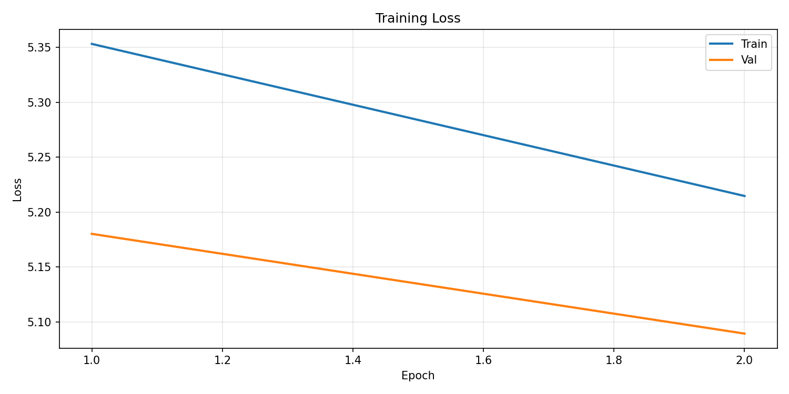
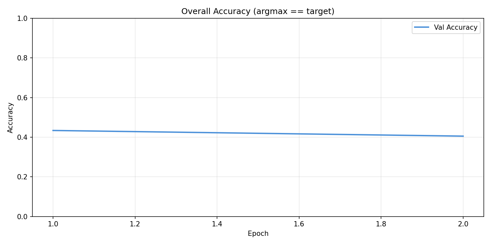
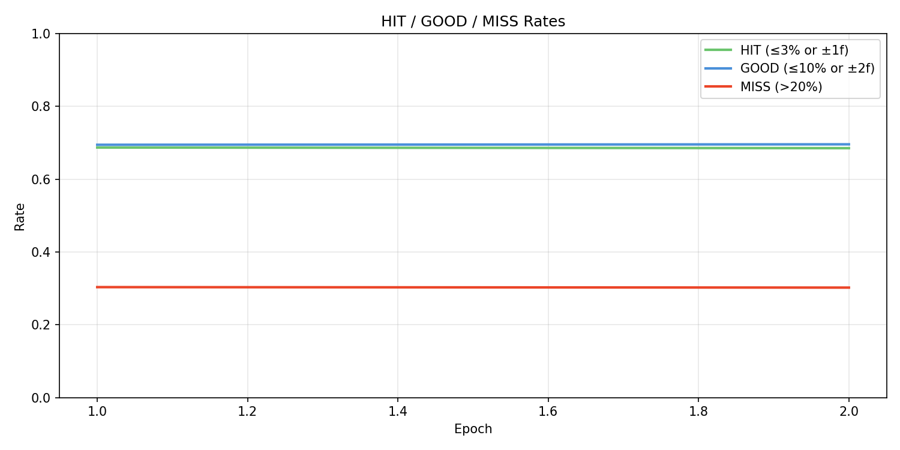
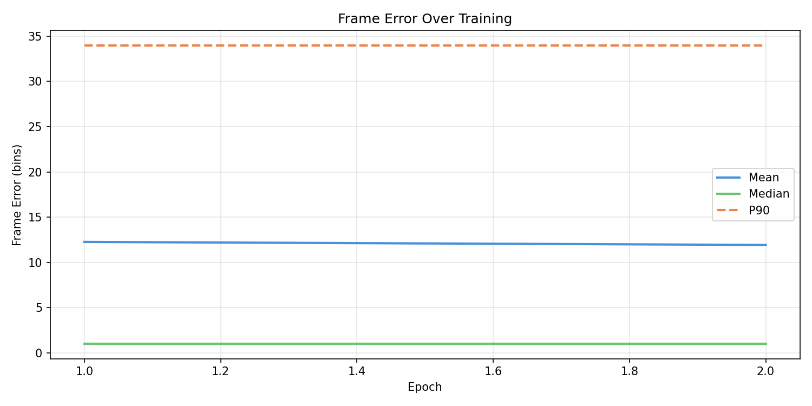
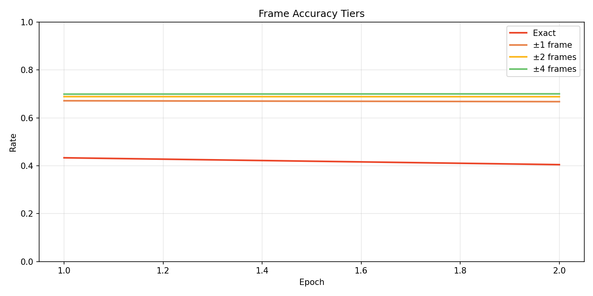
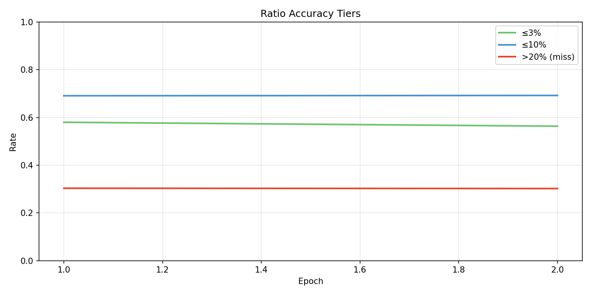
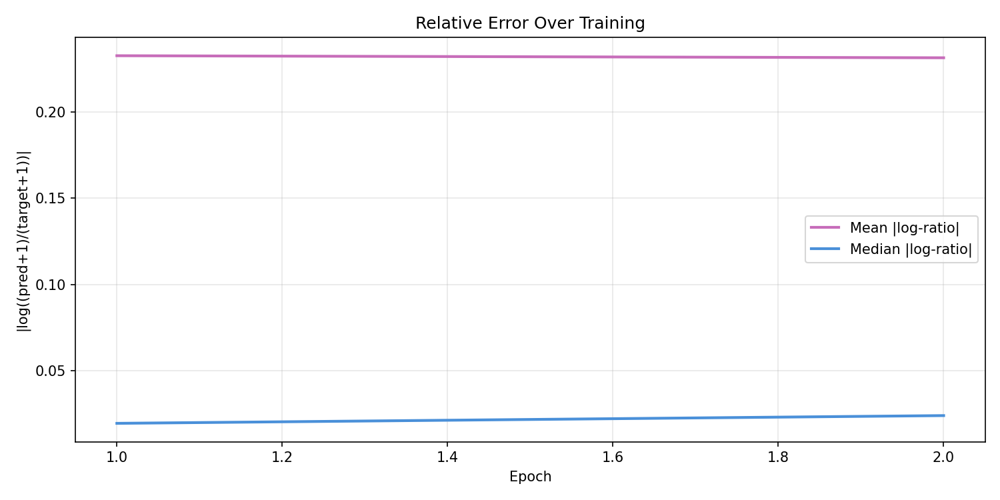
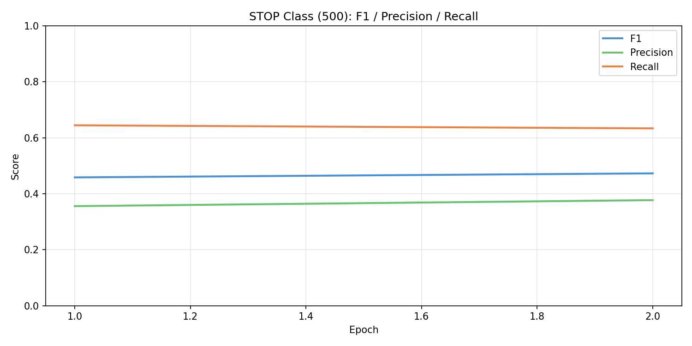
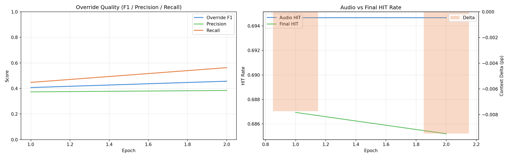
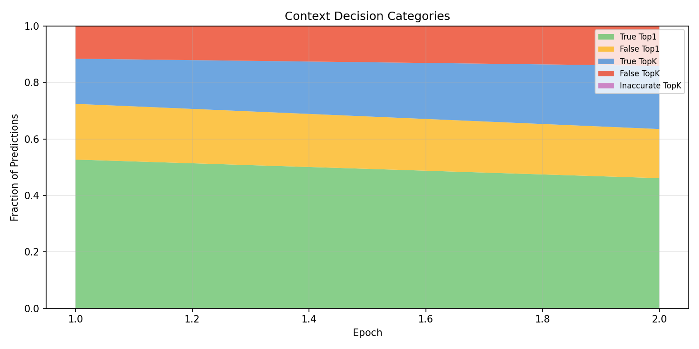
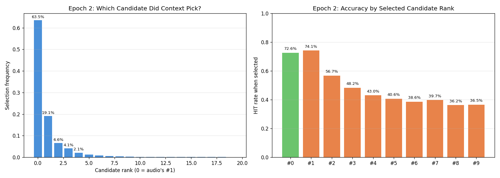
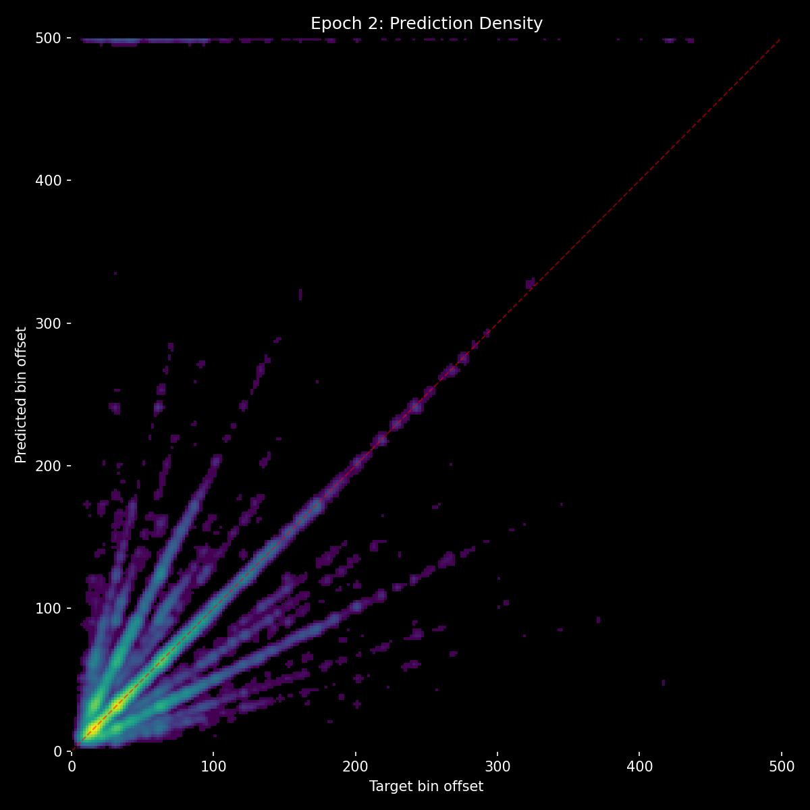
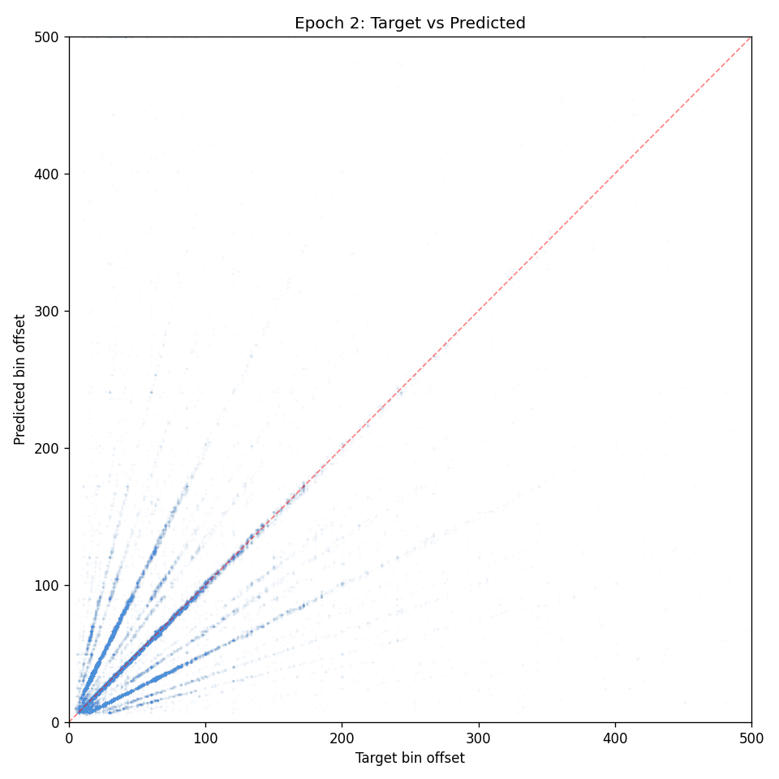

## Lesson

- **Relative quality loss works** - soft targets weighted by closeness produce much healthier override behavior than hard CE. Override F1 doubled, accuracy crossed 50% for the first time.
- **But the framing is wrong.** Any loss that references "audio's baseline" creates conservatism. The optimal loss doesn't compare to audio at all - it just asks "which candidate is closest to the target?"
- **Context should be blind to audio's preferences.** Shuffle candidates, remove score/rank features, make it a pure "pick the best position" task. Override happens implicitly when context's pick differs from audio's #1.
- **Next: simplified selection loss** - shuffle K candidates, soft CE weighted by trapezoid quality of each candidate, skip when no candidate is a HIT. No baseline comparison, no miss penalty, no asymmetric scaling.
