# Experiment 22 - Blind Selection (Shuffled Candidates, No Audio Scores)

> **[Full Architecture Specification](ARCHITECTURE.md)** — self-contained reproduction guide with all model, loss, training, and dataset details.

## Hypothesis

Exp 21 proved that relative quality loss produces healthy override behavior (F1=46%, accuracy=61%, both records). But delta remained negative (-0.95pp) because context overrides too broadly - it can't distinguish "audio is wrong" from "audio is right."

The root cause: **context is playing the wrong game.** It sees audio's scores and ranks in the candidate embeddings, knows k=0 is audio's top pick, and learns a meta-strategy of "should I override?" This is inherently conservative - overriding a 70%-correct signal requires high confidence.

**The fix: make context blind to audio's preferences.** Instead of "here are audio's top 20 ranked by confidence, should you rerank?", the task becomes "here are 20 candidate positions in random order - which one best continues the rhythm?"

### Changes from exp 21

**1. Remove audio score/rank features from candidate embeddings**

Previously each candidate got: `gap_emb + snippet_feat + score_proj(score, rank)`.
Now: `gap_emb + snippet_feat` only. `score_proj` layer removed entirely, `candidate_combine` reduced from `d_ctx*3 → d_ctx*2` input.

Context has zero information about audio's preferences. It judges candidates purely by:
- Gap pattern: "does this proposed next-gap fit the rhythm?"
- Audio snippet: "does this position have a drum transient / match past event audio?"

**2. Shuffle candidates during training**

Each batch, the K=20 candidates are randomly permuted per sample. Context can't learn positional bias (e.g., "k=0 is usually right"). At inference, candidates are unshuffled - the model's pick is mapped back to the original audio ranking.

**3. Simplified SelectionLoss**

The entire loss is now ~20 lines:
1. Compute quality of each candidate (trapezoid closeness to target, same as OnsetLoss)
2. If no candidate is a HIT (quality > 0), skip the sample
3. Normalize quality scores to soft probability distribution
4. Soft CE against that distribution

No baseline comparison, no miss penalty, no asymmetric scaling. The loss simply says "pick whichever candidate is closest to the truth, with partial credit for near-misses."

**4. Same infrastructure as exp 20-21**
- Warm-start from exp 14 best checkpoint
- Freeze all audio components
- Only train 2.5M context params (slightly fewer now without score_proj)

### Architecture

| Component | Params | Training |
|-----------|--------|----------|
| AudioEncoder | 8.0M | **Frozen** (from exp 14) |
| EventEncoder | 0.5M | **Frozen** (from exp 14) |
| AudioPath | 5.0M | **Frozen** (from exp 14) |
| cond_mlp | ~8K | **Frozen** (from exp 14) |
| Context gap encoder | 0.9M | Training |
| Context snippet encoder | 0.2M | Training |
| Context selection head | 1.2M | Training |
| Context scoring | 0.025M | Training |
| **Total trainable** | **~2.3M** | (slightly less without score_proj) |

### What context sees vs. doesn't see

| Signal | Exp 21 | Exp 22 |
|--------|--------|--------|
| Gap pattern (rhythm) | Yes | Yes |
| Mel snippets at candidates | Yes | Yes |
| Audio's confidence scores | Yes | **No** |
| Audio's rank ordering | Yes | **No** |
| Candidate position (k=0,1,...) | Fixed order | **Shuffled** |

### Expected outcomes

1. **Audio HIT = 69.5%** - frozen, identical to exp 20-21.
2. **Higher true_topK / lower false_topK ratio** - without audio score bias, context must independently judge quality. It should be more selective, overriding only when its own features indicate a better candidate.
3. **Override accuracy > 61%** - blind selection forces genuine understanding rather than meta-heuristics.
4. **Context delta ≥ 0** - if context can independently identify good positions from rhythm + audio features, overrides should be net-positive.
5. **Possibly lower override rate initially** - without score information, context has less to go on and may be more conservative at first. But overrides that do happen should be higher quality.

### Risk

- Without audio scores, context loses a useful signal. Audio's confidence IS informative - low-confidence predictions are more likely wrong. Removing this forces context to rediscover this from snippets alone.
- Shuffling means context can't exploit any correlation between rank position and quality. If audio's top-3 are usually good and #15-20 are usually bad, context can't use this shortcut.
- The simplified loss has no mechanism to push context toward overriding. If "pick k=0" (now random after shuffle) is no longer a good default, context may converge to always picking whichever candidate has the best snippet - which might be correct but not improve over audio.
- Loading exp 19-21 checkpoints for warm-start will need to drop score_proj and reinitialize candidate_combine (different input dim).

## Result

**Context overrides too aggressively without audio confidence signal.** Killed after E15.

| Metric | E1 | E5 | E10 | E14 (best) | E15 |
|--------|----|----|-----|------------|-----|
| Audio HIT | 69.5% | 69.5% | 69.5% | 69.5% | 69.5% |
| Final HIT | 58.9% | 62.9% | 63.8% | **64.8%** | 63.5% |
| Delta | -10.6pp | -6.6pp | -5.7pp | **-4.6pp** | -5.9pp |
| Override rate | 65.1% | 54.7% | 53.5% | 52.5% | 56.2% |
| Override accuracy | 47.8% | 49.5% | 51.1% | **52.3%** | 51.0% |
| Override F1 | 48.5% | 48.5% | 48.9% | 49.6% | **49.8%** |
| false_top1 | 7.2% | 9.5% | 10.0% | 9.2% | **9.0%** |
| true_topK | 31.1% | 27.1% | 27.3% | 27.4% | 28.6% |
| false_topK | 41.7% | 33.7% | 33.0% | 31.4% | 34.6% |
| inaccurate_topK | 17.2% | 14.3% | 14.1% | 12.8% | 14.3% |

**What worked:**
- Shuffling eliminated positional bias - context can't learn "k=0 is usually right."
- When context overrides, it rarely picks garbage - inaccurate_topK stayed low (12-14%). The override selections are mostly reasonable positions.
- false_top1 dropped to 9% - context catches ~70% of audio's mistakes (vs ~20% false_top1 in exp 21). It overrides aggressively when audio is wrong.
- Delta slowly improved over 15 epochs (-10.6pp → -4.6pp at E14), showing learning signal exists.
- Override accuracy crossed 50% by E10 - context is slightly better than coin flip.

**What didn't work:**
- Delta still deeply negative (-4.6pp at best vs exp 21's -0.77pp). Context overrides >50% of predictions - way too many.
- Without audio confidence, context has no signal about WHEN to override. It overrides uniformly whether audio was 99% sure or 30% sure. This wastes correct #1 picks.
- Override accuracy plateaued around 51% - barely above coin flip despite 15 epochs. Shuffled candidates without scores is genuinely hard.
- false_topK (31-35%) consistently exceeds true_topK (27-29%). Bad overrides outnumber good ones.

**Key insight:** Audio confidence IS an informative signal. When audio is very confident, its #1 is almost always correct - overriding is wasteful. When audio is uncertain, overriding is valuable. Removing this signal entirely forces context to override blindly. The right approach: give confidence as a per-candidate scalar (shuffled), not rank ordering.

## Graphs

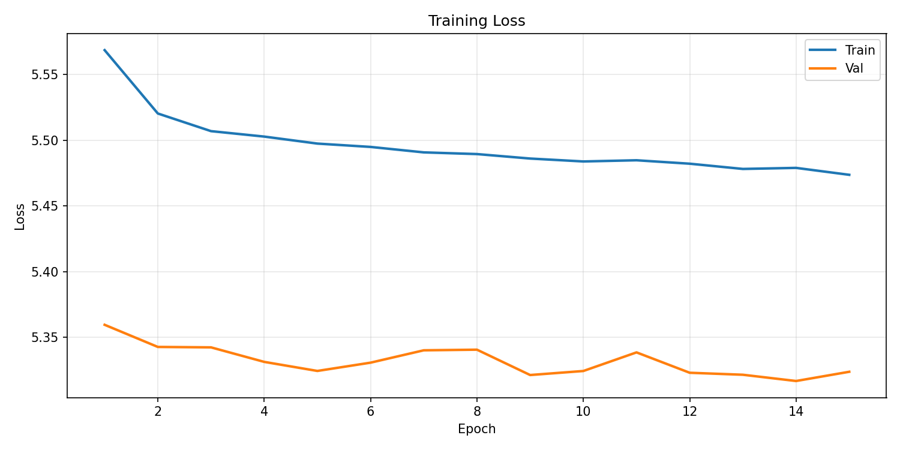
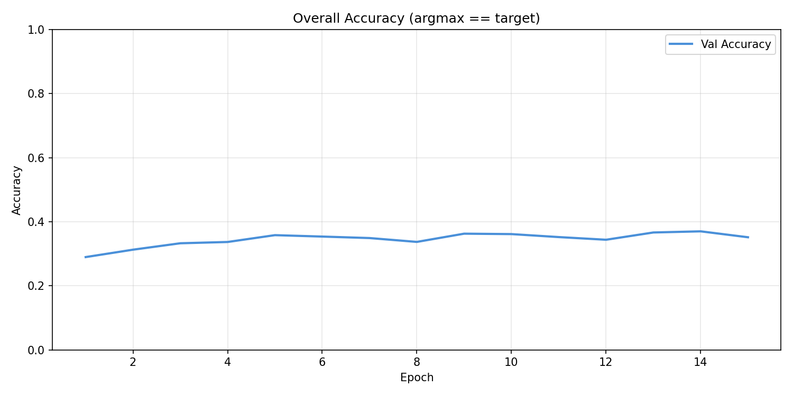
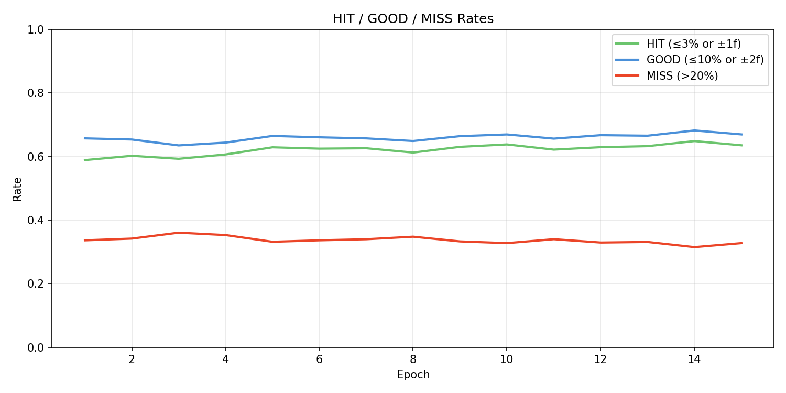
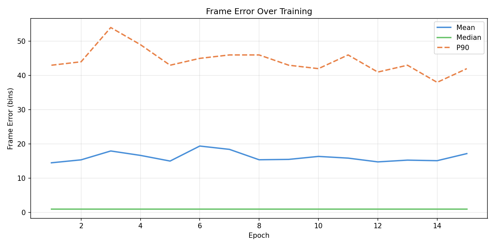
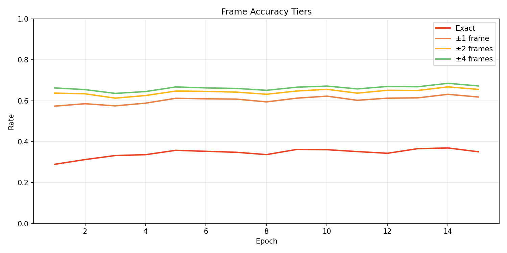
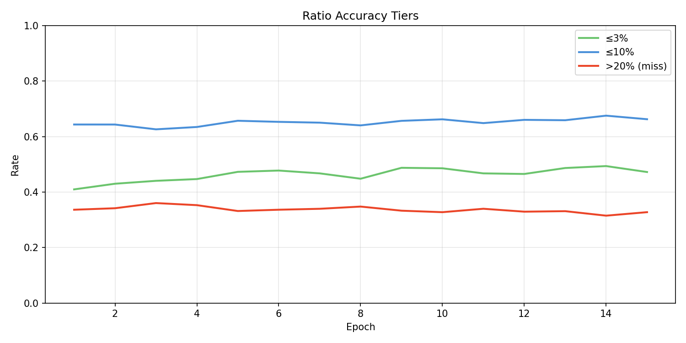
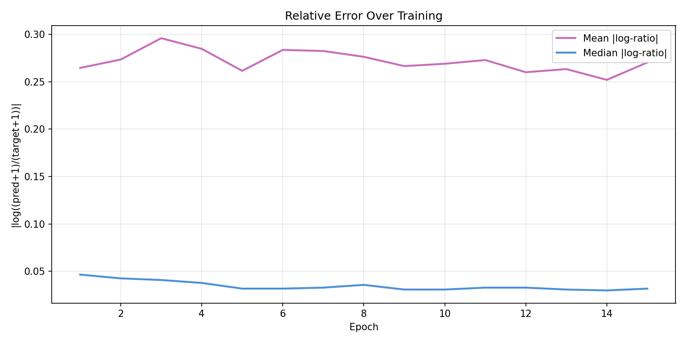
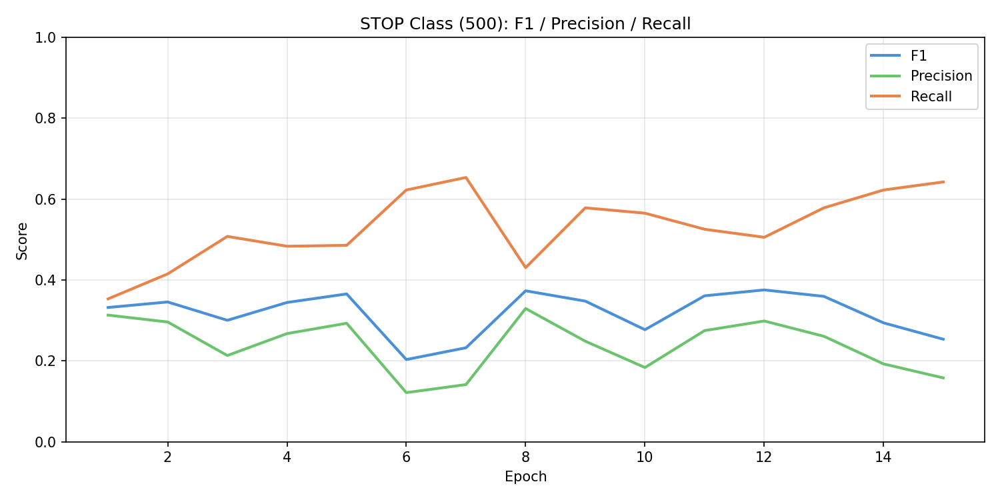
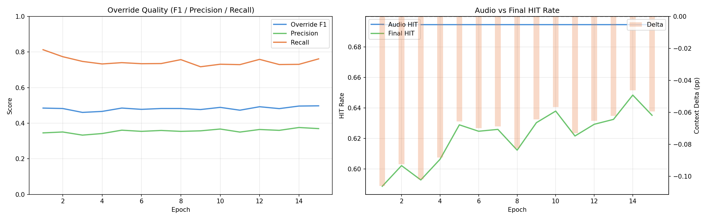
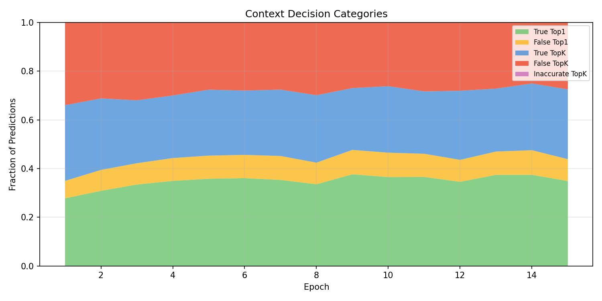
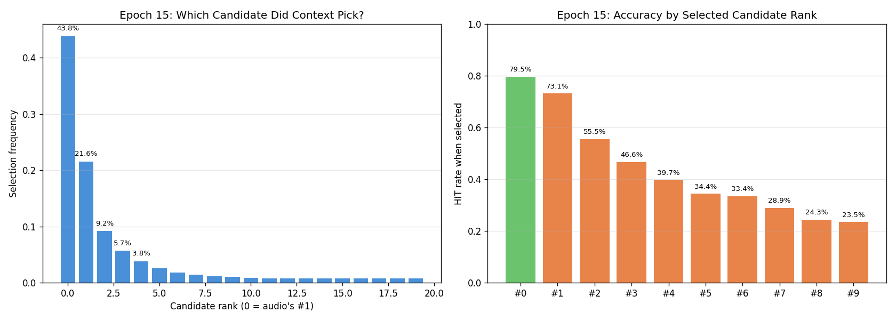
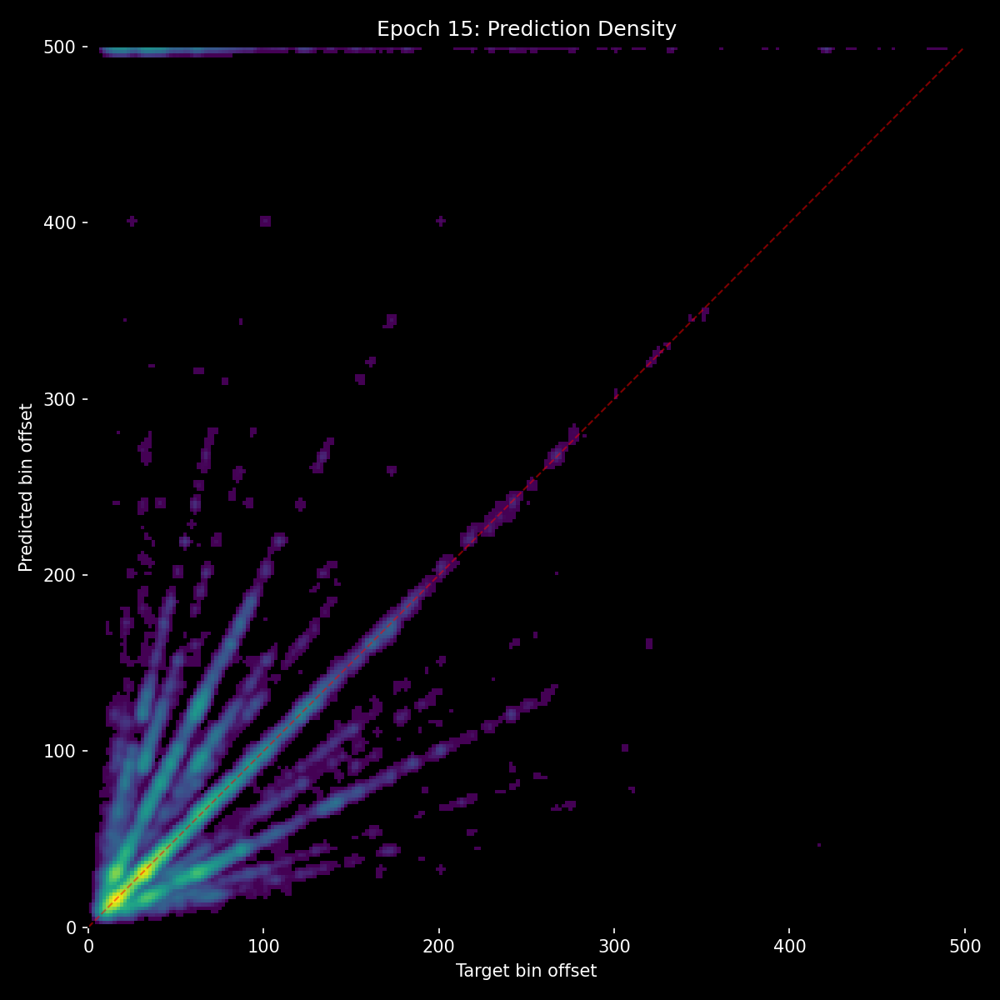
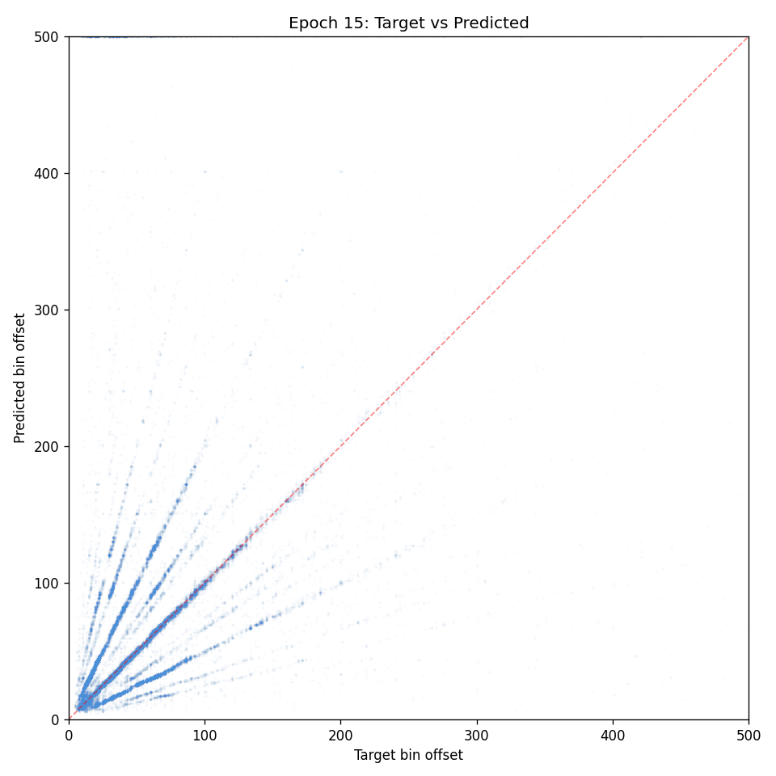

## Lesson

- **Audio confidence is informative, not just bias.** Stripping all score info forced context to override 50%+ of predictions uniformly. Context needs to know "how sure was audio?" to decide when overriding is worthwhile.
- **Shuffling works** - eliminates positional bias, should be kept. The problem was removing scores, not shuffling order.
- **Context makes reasonable picks** - low inaccurate_topK (12-14%) shows it understands which positions fit the rhythm. The issue is override frequency, not override quality.
- **Next: shuffled candidates WITH confidence scores.** Keep the shuffle (no rank ordering), but attach audio's softmax probability to each candidate as a feature. Context sees "here are 20 positions, each with a confidence level" in random order. It can learn "low confidence = worth investigating, high confidence = trust audio."
