# Experiment 23 - Shuffled Candidates with Confidence Scores

> **[Full Architecture Specification](ARCHITECTURE.md)** — self-contained reproduction guide with all model, loss, training, and dataset details.

## Hypothesis

Exp 22 proved that shuffling eliminates positional bias and that context makes reasonable picks (low inaccurate_topK). But without audio confidence, context overrides 50%+ of predictions - it can't tell when audio is confident (and likely correct) vs uncertain (and worth overriding). Delta bottomed out at -4.6pp.

Exp 21 showed that giving context full audio info (scores + rank ordering) leads to conservatism bias - context learns "k=0 is usually right" rather than independently judging quality. Delta -0.95pp with only 28-37% override rate.

**The middle ground: shuffled candidates with confidence scores.**

Each candidate gets its softmax probability from audio as a scalar feature. But candidates are shuffled randomly - context can't learn positional shortcuts. It sees:

> "Here are 20 candidate positions in random order. Each has a gap embedding, a mel snippet, and a confidence value. Pick the best one."

This gives context the "when to override" signal (low confidence = worth investigating) without the "which one to pick by default" bias (no rank ordering).

### Changes from exp 22

**1. Restore score feature as softmax probability**

Each candidate gets `score_proj(softmax_prob)` - a single scalar (the audio model's probability for that bin) projected to d_ctx. This replaces exp 21's `score_proj(score, rank)` which gave both raw logit AND rank position.

Key difference from exp 21: only confidence magnitude, no rank ordering. Context knows "this candidate has 40% probability" but not "this was audio's #1 pick."

**2. Keep shuffle (from exp 22)**

Candidates randomly permuted per sample during training. Context cannot exploit position.

**3. Keep simplified SelectionLoss (from exp 22)**

Soft CE on quality-weighted candidates, skip when no HIT. No baseline comparison.

**4. Fix decision_categories chart bug**

`false_topK` was defined as "overrode & top1 was correct" without checking if final pick was wrong - causing overlap with `true_topK` and sum > 1.0. Fixed to "overrode & final wrong & top1 was correct." Five categories now mutually exclusive, sum to 1.0.

### Architecture

Identical to exp 22 but with `score_proj` restored:

| Component | Params | Training |
|-----------|--------|----------|
| AudioEncoder | 8.0M | **Frozen** (from exp 14) |
| EventEncoder | 0.5M | **Frozen** (from exp 14) |
| AudioPath | 5.0M | **Frozen** (from exp 14) |
| cond_mlp | ~8K | **Frozen** (from exp 14) |
| Context gap encoder | 0.9M | Training |
| Context snippet encoder | 0.2M | Training |
| Context selection head | 1.2M | Training |
| Context scoring + score_proj | ~0.05M | Training |
| **Total trainable** | **~2.5M** | |

### What context sees per candidate

| Signal | Exp 21 | Exp 22 | Exp 23 |
|--------|--------|--------|--------|
| Gap embedding | Yes | Yes | Yes |
| Mel snippet | Yes | Yes | Yes |
| Audio softmax prob | Yes (+ rank) | **No** | **Yes** |
| Rank position | Yes | No | **No** |
| Candidate order | Fixed (#1 first) | Shuffled | **Shuffled** |

### Expected outcomes

1. **Audio HIT = 69.5%** - frozen.
2. **Override rate 20-40%** - between exp 21's conservative 28-37% and exp 22's wild 50-56%. Confidence signal should let context be selective.
3. **Override accuracy > 55%** - with both rhythm features AND confidence, context should make better override decisions than either alone.
4. **Delta closer to 0 than either exp 21 or 22** - the sweet spot between "too conservative" and "too aggressive."
5. **Decision categories chart fixed** - five mutually exclusive categories summing to 1.0.

### Risk

- Softmax probability alone may not be enough - the absolute probability matters less than relative (is this the top pick or #15?). But relative info is exactly what we're avoiding to prevent positional bias.
- Context might learn to threshold on confidence ("override below 0.3, keep above 0.3") which is a simple heuristic, not deep understanding. This could plateau quickly.
- The score_proj(1 → d_ctx) projection may overweight the scalar confidence vs the richer gap/snippet features.

## Result

**Best override quality ever, but reranking paradigm fundamentally limited.** Killed after E4.

| Metric | E1 | E2 | E3 (best) | E4 |
|--------|----|----|-----------|-----|
| Audio HIT | 69.5% | 69.5% | 69.5% | 69.5% |
| Final HIT | 66.4% | 64.9% | 66.3% | 65.3% |
| Delta | -3.0pp | -4.6pp | **-3.2pp** | -4.2pp |
| Override rate | 33.3% | 44.0% | 53.9% | 47.7% |
| Override accuracy | 56.3% | 52.9% | **63.7%** | 55.1% |
| Override F1 | 52.8% | 57.0% | **67.0%** | 60.2% |
| true_top1 | 47.7% | 41.5% | 32.0% | 39.0% |
| false_top1 | 19.0% | 14.4% | **14.2%** | 13.3% |
| true_topK | 18.7% | 23.3% | **34.3%** | 26.3% |
| false_topK | 6.8% | 9.7% | **8.6%** | 9.1% |
| inaccurate_topK | 7.8% | 11.1% | 11.0% | 12.4% |

**What worked:**
- Confidence + shuffle is the best combination tested. E3 achieved 63.7% override accuracy and 67.0% F1 - both all-time records. true_topK:false_topK ratio of 4:1 at E3.
- Confidence signal modulates override rate as hoped - 33% at E1 (selective) vs exp 22's 65% (blind). Context learned "low confidence = worth investigating."
- false_top1 steadily decreased (19% → 13.3%) - context catches more audio mistakes over epochs.
- Decision categories chart now renders correctly (bug fixed: categories are mutually exclusive, sum to 1.0).

**What didn't work:**
- Delta still -3 to -4.6pp despite best-ever override quality. Even at E3's remarkable 4:1 good:bad ratio, the 54% override rate means too many correct #1s get flipped.
- Override rate oscillates (33-54%) rather than converging. Context hasn't found a stable operating point.
- The reranking interface is inherently limited: it's an all-or-nothing decision (keep #1 or replace entirely). Context can't make soft adjustments.

**The fundamental problem with reranking (exp 15-23 retrospective):**

9 experiments across 4 loss functions (hard CE, relative quality, simplified soft, confidence-aware), 3 information levels (full scores, blind, confidence only), and 4 architectures (shared encoder, stop-gradient, gap-based, shuffled). Every single one produced negative delta. The best moments (exp 21 E1: -0.77pp, exp 23 E3: -3.2pp with 64% accuracy) all still negative.

The issue isn't the context features (gap representation works), the loss function (soft targets work), or the training dynamics (warm-start+freeze work). It's the **interface**: a discrete override decision on top of an already-good 70% model can only help at the margins, and any mistakes are catastrophic (replacing a correct answer with a wrong one).

## Graphs

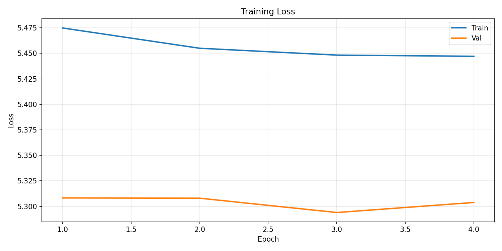
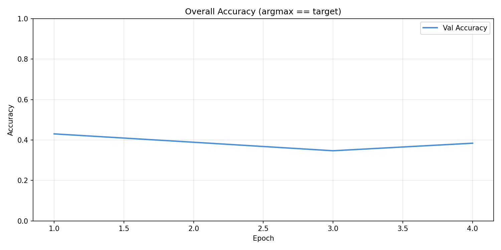
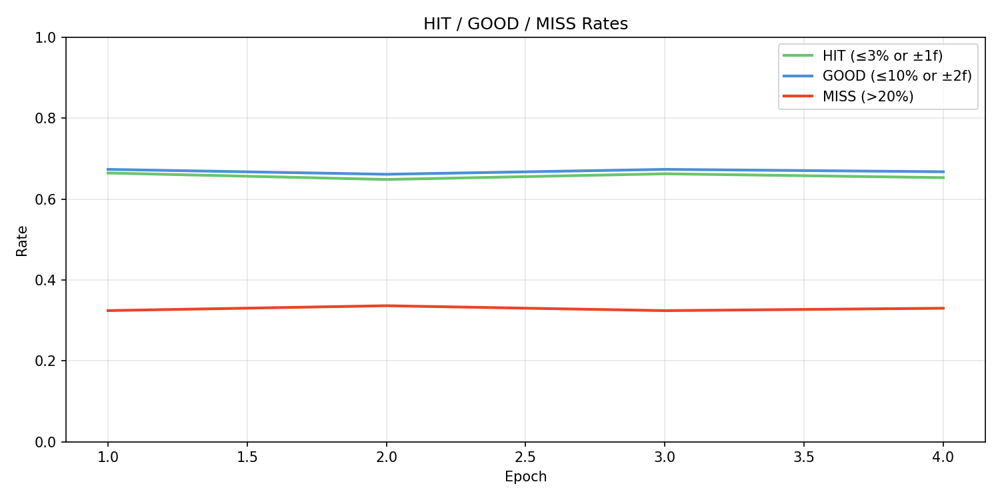
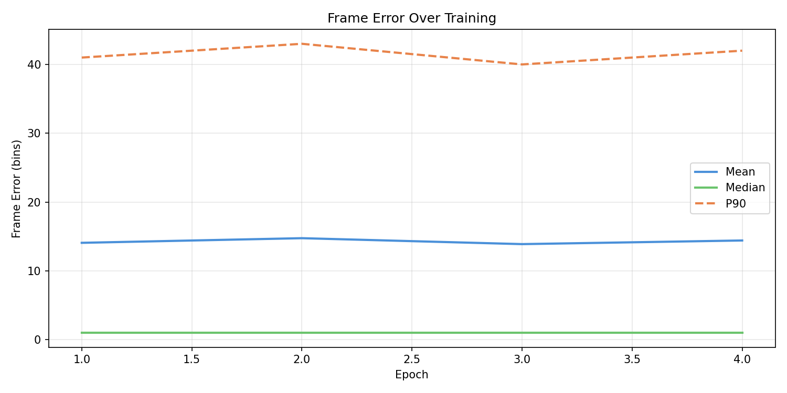
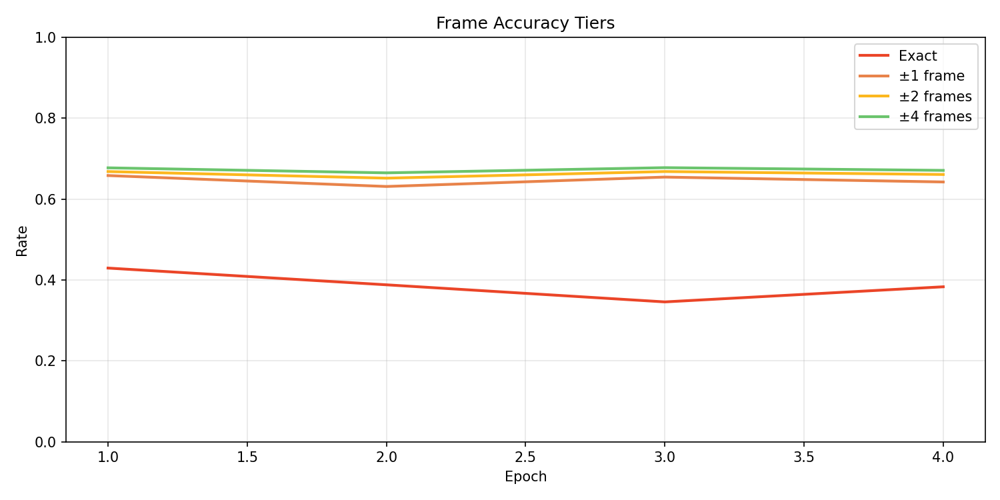
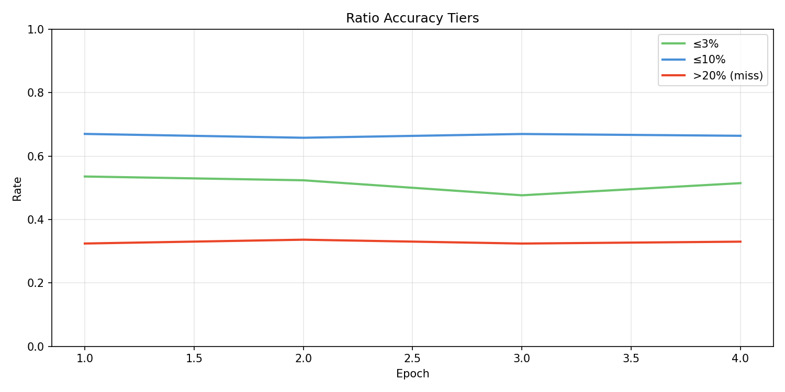
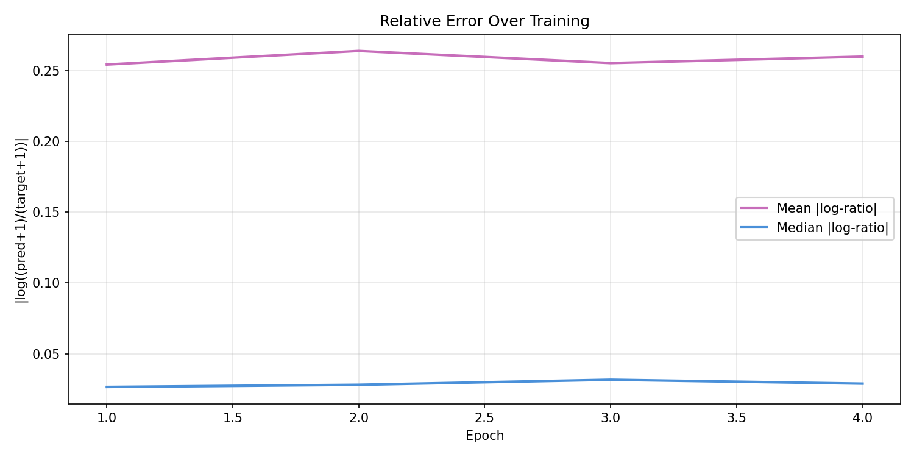
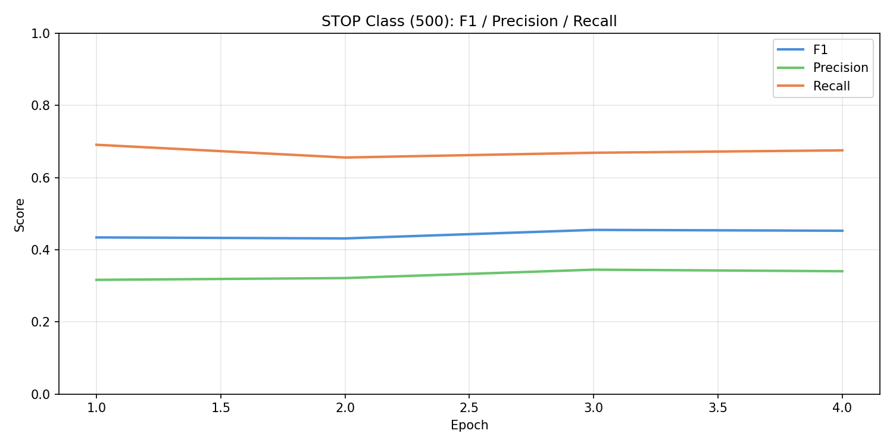
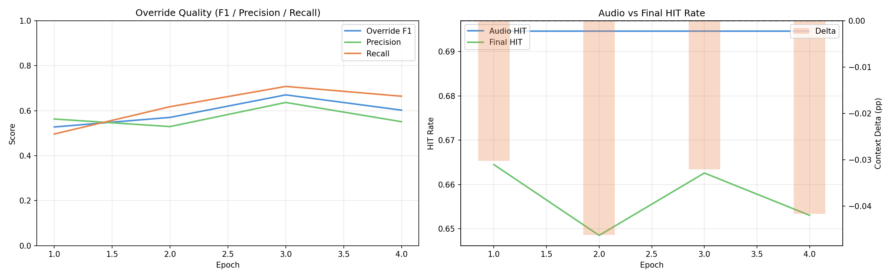
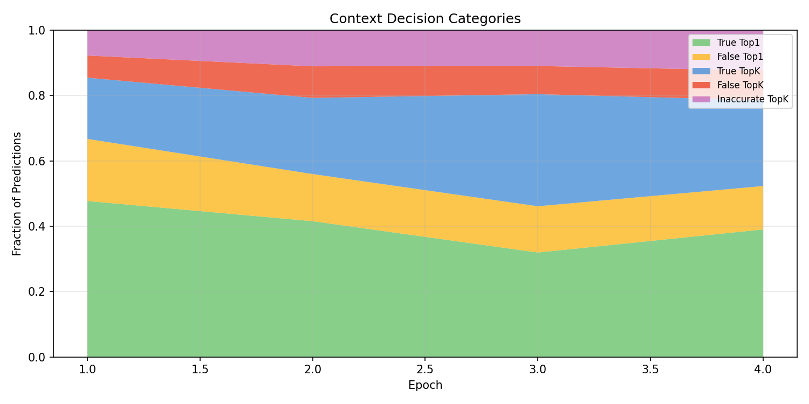
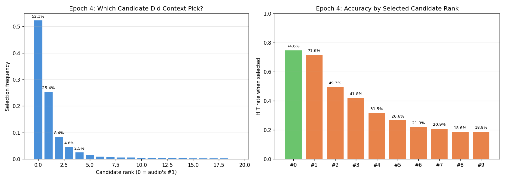
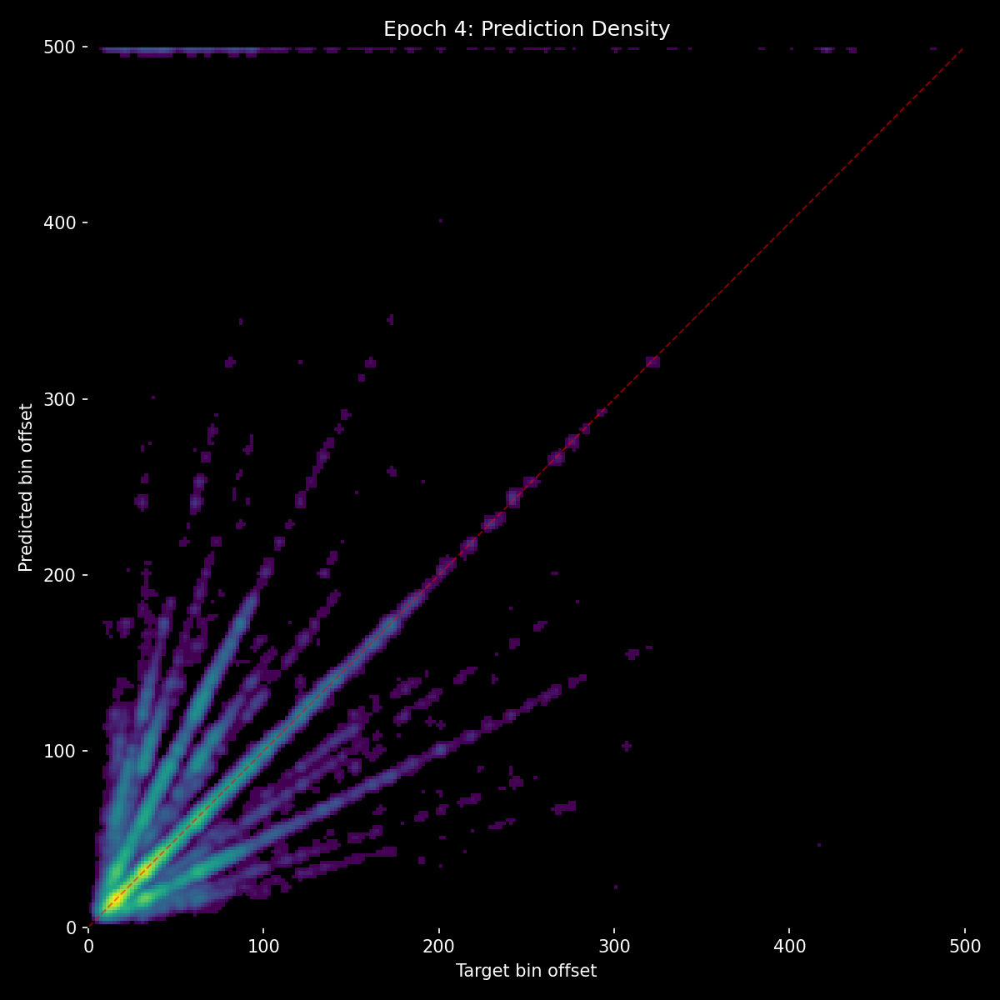
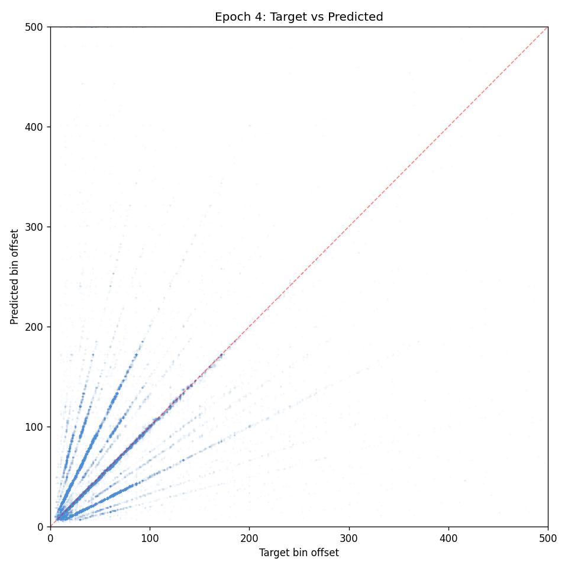

## Lesson

- **Confidence + shuffle is the optimal reranking setup** - if reranking is ever revisited, this is the recipe. But the paradigm itself is limited.
- **9 experiments prove reranking can't break even** - the discrete override interface is fundamentally at odds with a 70%-correct base model. Even perfect override quality can't overcome the base rate penalty of replacing correct answers.
- **Context features are proven** - gap representation, mel snippets, own encoders all produce useful signal. The problem is how that signal reaches the final output.
- **Next: additive logits** - context produces its own 501-way distribution, added to audio's logits before softmax. Soft influence instead of hard override. Context can nudge probability mass between nearby bins without catastrophic replacements. Re-uses the proven gap architecture with a new output head.
