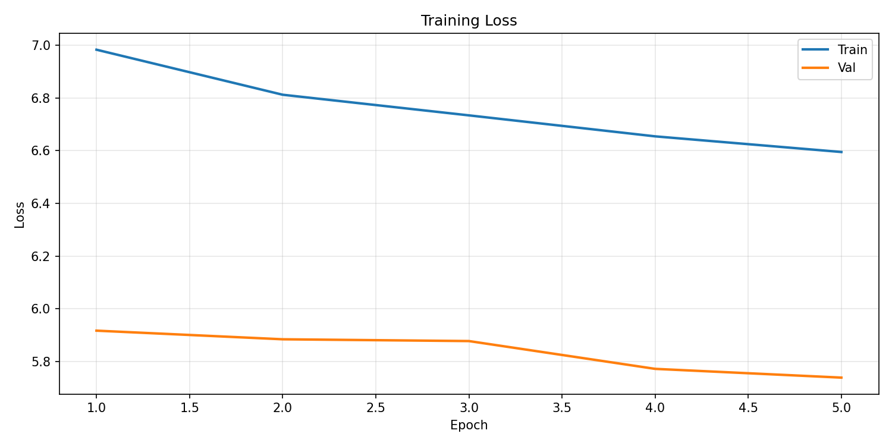
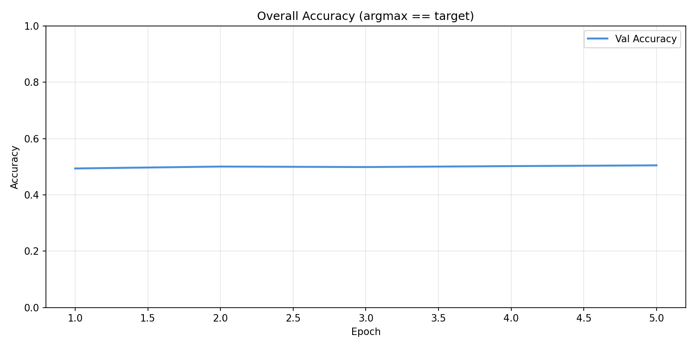
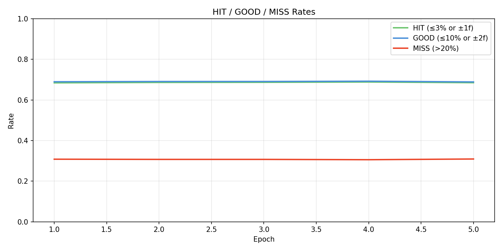
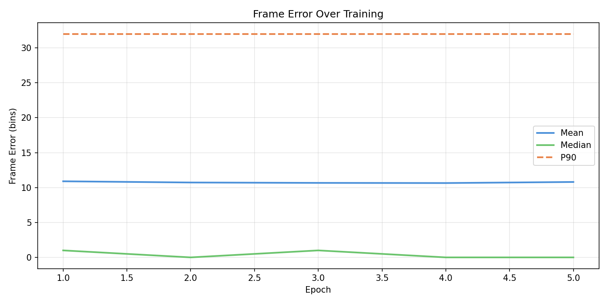
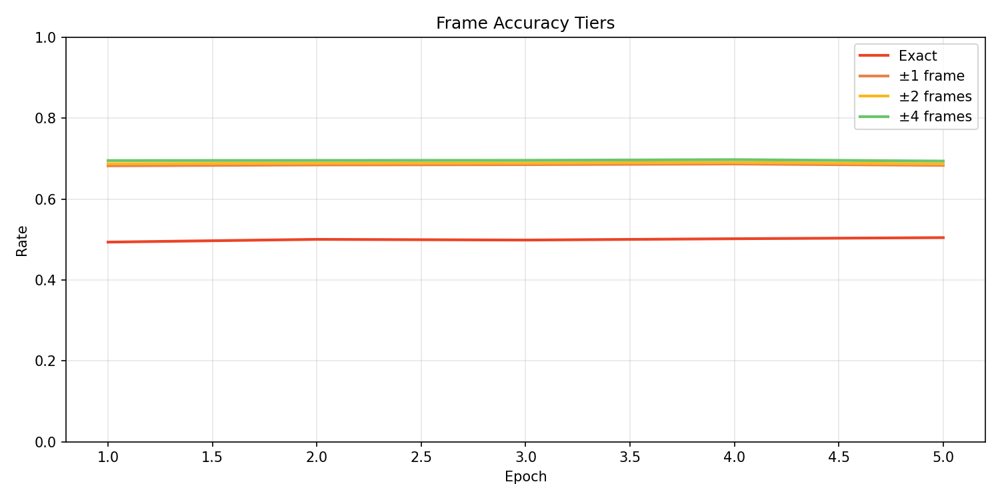
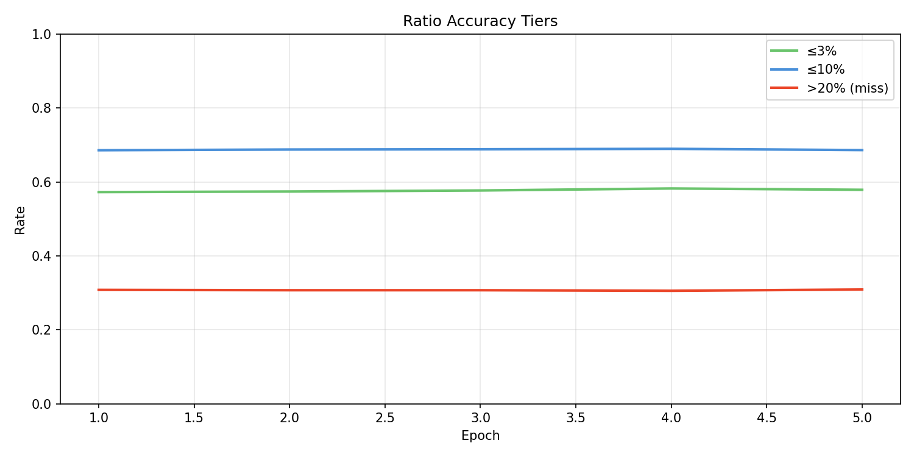
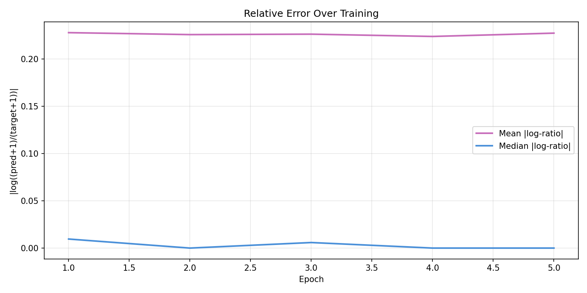
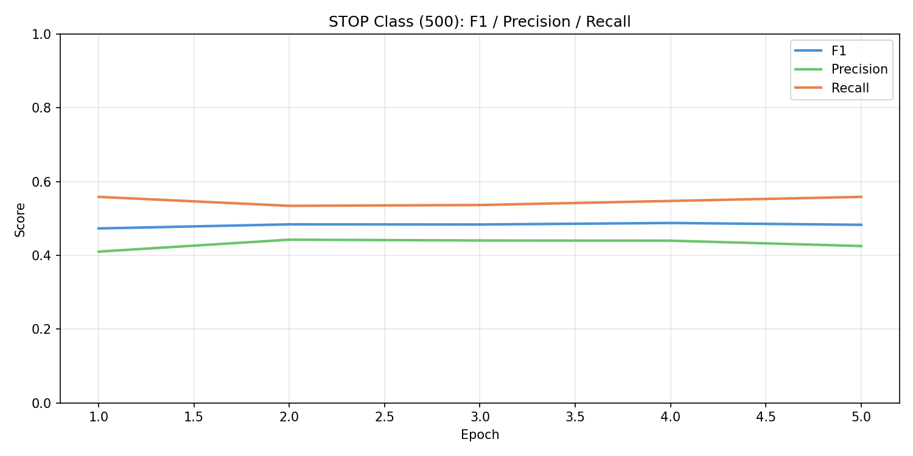
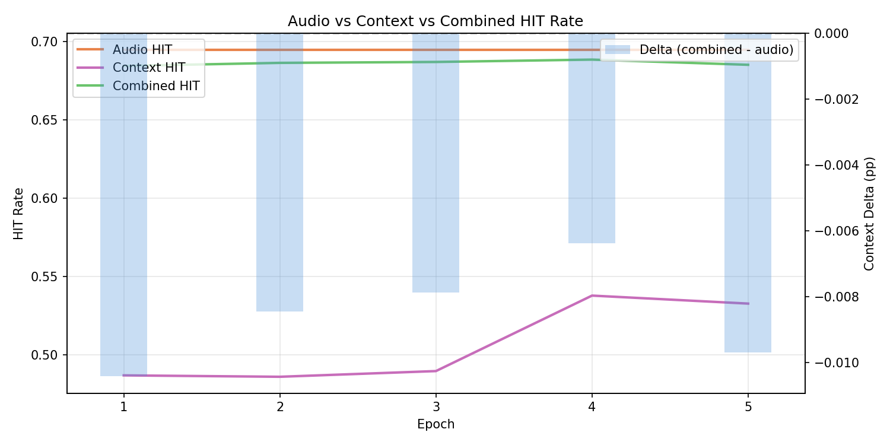
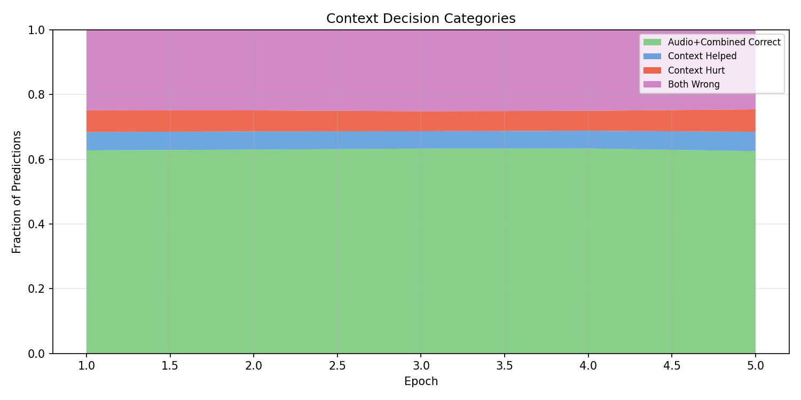

# Experiment 24 - Additive Context Logits

## Hypothesis

9 experiments of top-K reranking (exp 15-23) all produced negative delta. The best result — exp 23 E3 with 64% override accuracy and 4:1 good:bad ratio — still had -3.2pp delta. The discrete override interface is fundamentally at odds with improving on a 70%-correct base model.

**The paradigm shift: additive logits instead of reranking.**

Context produces its own 501-way logit distribution, added to audio's logits before softmax. Instead of a hard "keep or replace" decision, context applies soft influence — nudging probability mass between nearby bins. A small positive value at bin 47 and negative at bin 52 shifts audio's distribution slightly without catastrophic replacement.

This is actually how the LegacyOnsetDetector (exp 11-16) worked, but with shared encoders and no gap representation. Now we combine the additive approach with the proven gap-based architecture from exp 19-23.

### Changes from exp 23

**1. New ContextPath — additive output instead of K-way selection**

The gap encoder is preserved (gap_emb + snippet_encoder + self-attention + FiLM). But instead of cross-attending to K candidates and dot-product scoring, a cursor token is appended after the gap encoder, gets one more self-attention pass to attend to the rhythm representation, then projects directly to 501 logits via an output head.

No top-K extraction, no candidate building, no selection. Context independently predicts "where should the next note go?" in the same 501-way space as audio.

**2. Three-way measurement**

Instead of override stats, we now measure:
- **Audio top-K**: accuracy of audio_logits alone
- **Context top-K**: accuracy of context_logits alone
- **Combined top-K**: accuracy of (audio + context) logits

And four decision categories:
- **audio_only_correct**: audio right, combined right (context didn't hurt)
- **context_helped**: audio wrong, combined right (context fixed it)
- **context_hurt**: audio right, combined wrong (context broke it)
- **both_wrong**: audio wrong, combined wrong

**3. Loss: OnsetLoss on both paths**

Same trapezoid soft-target loss on audio_logits and context_logits independently. Combined logits are not directly trained — they emerge from the sum. This means:
- Audio loss trains shared encoders + audio path (as before)
- Context loss trains context path only (cond detached)
- If context learns to output small values, combined ≈ audio (safe default)
- If context learns useful patterns, it shifts the combined distribution

**4. Same infrastructure**
- Warm-start from exp 14 (audio components)
- Freeze audio components
- Only train context path

### Architecture

| Component | Params | Training |
|-----------|--------|----------|
| AudioEncoder | 8.0M | **Frozen** (from exp 14) |
| EventEncoder | 0.5M | **Frozen** (from exp 14) |
| AudioPath | 5.0M | **Frozen** (from exp 14) |
| cond_mlp | ~8K | **Frozen** (from exp 14) |
| Context gap encoder | 0.9M | Training |
| Context snippet encoder | 0.2M | Training |
| Context cursor + output head | ~0.13M | Training |
| **Total trainable** | **~1.2M** | (smaller than reranker's 2.5M) |

### Context path flow

1. Compute gaps from event offsets (same as exp 19-23)
2. Extract ~50ms mel snippets at each event position (same)
3. Gap encoder: gap_emb + snippet_feat → 2 self-attention layers + FiLM → rhythm representation
4. Append cursor token → one more self-attention pass (cursor attends to rhythm)
5. Output head: cursor → Linear(d_ctx, d_ctx) → GELU → Linear(d_ctx, 501)

### Expected outcomes

1. **Audio HIT = 69.5%** — frozen.
2. **Context HIT > 0** — context should learn some timing from rhythm patterns alone, even if low (maybe 10-30%).
3. **Combined HIT ≥ 69.5%** — if context learns ANY useful signal, additive combination should improve or at least not hurt. Even random context with small magnitude is safe (near-zero logits = no influence).
4. **context_hurt near 0%** — additive with small context magnitudes means low risk of catastrophic damage.
5. **context_helped > 0%** — if gap patterns are informative (proven in exp 19-23), context should fix some audio mistakes.

### Risk

- Context might learn to output large magnitude logits that override audio entirely — same problem as reranking but in logit space. May need to scale context logits by a learned or fixed factor.
- With only ~1.2M params and no direct audio features (just gap + snippets), context may not have enough capacity to produce useful 501-way distributions.
- The cursor token approach (one self-attention pass) may not give enough interaction between rhythm and the output. May need more layers.
- Warm-starting audio means context starts from random — the combined output will be worse than audio-only for early training. Need patience.

## Result

**Best delta ever (-0.64pp at E4), but context logit magnitude divergence at E5.** Killed after E5.

| Metric | E1 | E2 | E3 | E4 (best) | E5 |
|--------|----|----|-----|-----------|-----|
| Audio HIT | 69.5% | 69.5% | 69.5% | 69.5% | 69.5% |
| Context HIT | 48.7% | 48.6% | 49.0% | 53.8% | 53.3% |
| Combined HIT | 68.4% | 68.6% | 68.7% | **68.8%** | 68.5% |
| Delta | -1.04pp | -0.85pp | -0.79pp | **-0.64pp** | -0.97pp |
| context_helped | 5.68% | 5.64% | 5.39% | 5.52% | 5.97% |
| context_hurt | 6.72% | 6.49% | 6.18% | **6.15%** | 6.94% |
| audio_only_correct | 62.7% | 63.0% | 63.3% | 63.3% | 62.5% |
| both_wrong | 24.9% | 24.9% | 25.1% | 25.0% | 24.6% |
| Val loss | 5.917 | 5.884 | 5.877 | 5.772 | 5.739 |

**What worked:**
- Additive paradigm is fundamentally safer than reranking — delta -0.64pp at best vs reranking's best of -0.77pp (exp 21 E1), and less volatile.
- Context learned real signal: 48.7% → 53.8% standalone HIT from gaps + snippets alone. The cursor architecture produces meaningful 501-way distributions.
- Val loss consistently dropped — context was genuinely learning better timing predictions.
- context_hurt tracked downward E1-E4 (6.72% → 6.15%), confirming context learned where NOT to push.

**What didn't work:**
- E5 regression: context logit magnitudes grew, hurt spiked to 6.94%, delta back to -0.97pp. The predicted risk materialized — unchecked logit magnitude growth.
- context_helped never exceeded ~6%. Even with 53.8% standalone HIT, context couldn't reliably fix audio's mistakes because it doesn't see the audio signal.
- Combined HIT never reached audio-only HIT. The fundamental issue: context operating blindly (only gaps + snippets) will always hurt as much as it helps because it can't condition its influence on what audio already knows.

**The core insight from 10 experiments (15-24):**

Every approach — reranking (exp 15-23) and additive logits (exp 24) — treats context as a separate system that either overrides or nudges audio. But context without audio access is fundamentally limited: it can learn rhythm patterns (~53% HIT) but can't know when audio is already correct (70% of the time). This means context's influence is essentially random with respect to audio's correctness, guaranteeing net-negative delta.

## Graphs

## Lesson

- **Additive logits are safer than reranking** — soft influence self-regulates early (small magnitudes = safe default), but magnitude growth eventually causes the same problems.
- **Context in isolation caps at ~53% HIT** — gap patterns + snippets without full audio are not sufficient to reliably predict onset positions. Useful signal exists but not enough to improve on a 70% audio model.
- **Separate paths cannot break even** — 10 experiments across two paradigms (reranking and additive) prove that any architecture where context operates without seeing audio's full representation will have context_hurt ≈ context_helped. The information asymmetry is the bottleneck, not the output interface.
- **The path forward is unification** — a single model where audio and context features (gaps, rhythm) are jointly attended to, not separate paths combined post-hoc. The model needs to see both "what does the audio say?" and "what does the rhythm pattern say?" simultaneously when making each prediction.
