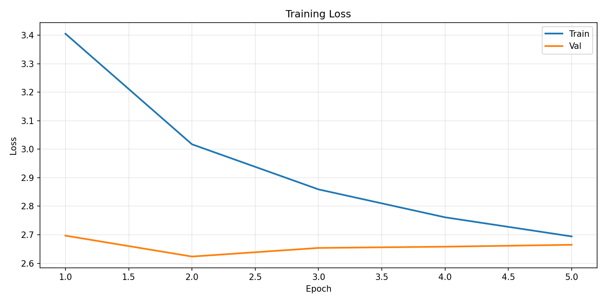
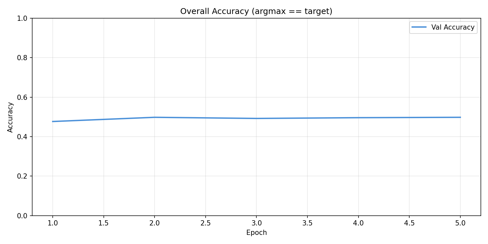
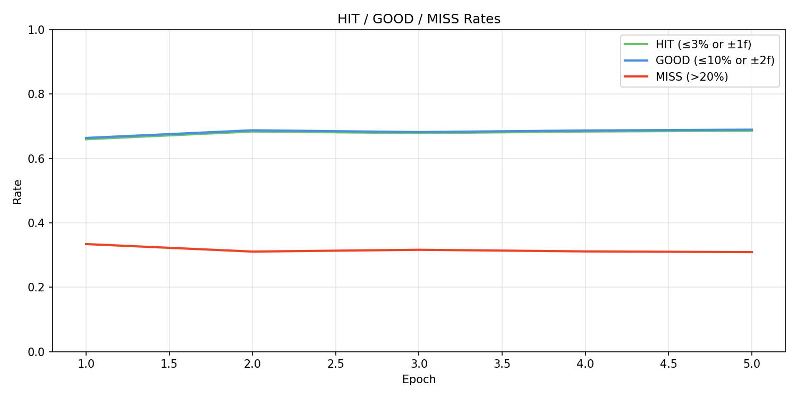
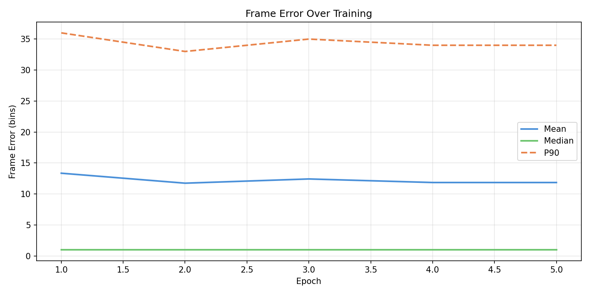
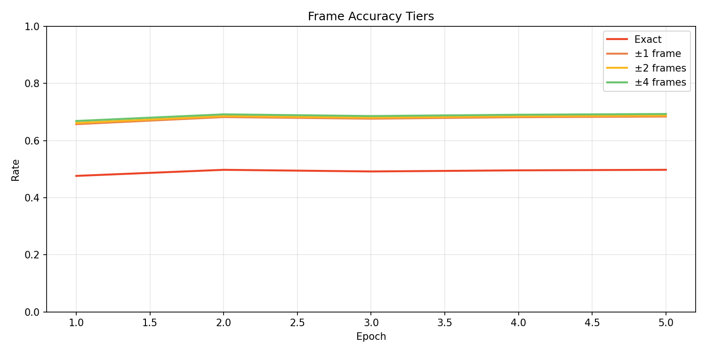
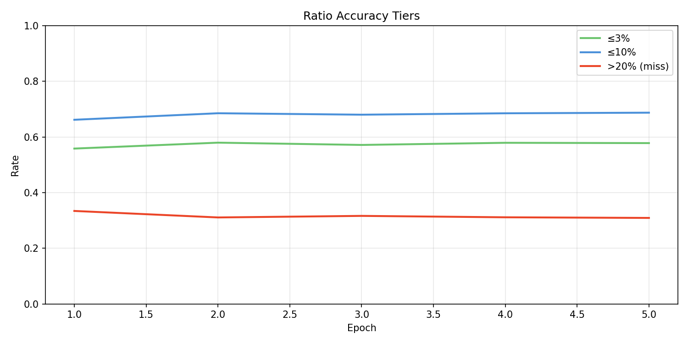
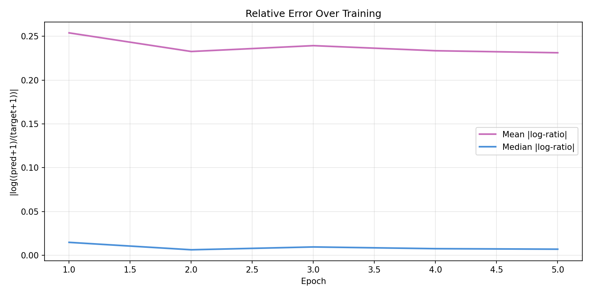
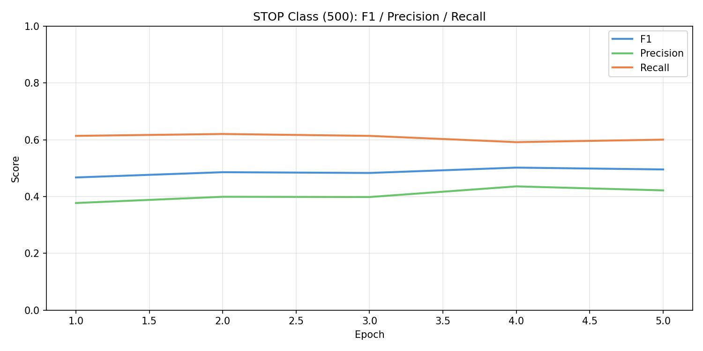
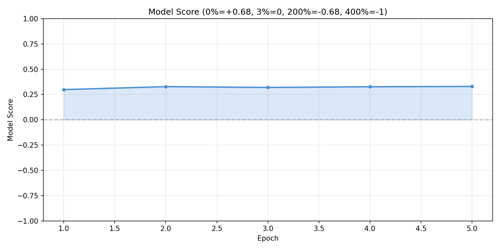

# Experiment 25 - Unified Audio + Gap Fusion

> **[Full Architecture Specification](ARCHITECTURE.md)** — self-contained reproduction guide with all model, loss, training, and dataset details.


## Hypothesis

10 experiments ([15](../experiment_15/README.md)-[24](../experiment_24/README.md)) proved that separate audio and context paths cannot break even. Context without audio access caps at ~53% HIT (exp [24](../experiment_24/README.md)) - it can learn rhythm patterns but can't know when audio is already correct (70%). Whether reranking (discrete override) or additive (soft logit nudging), context's influence is random w.r.t. audio correctness, guaranteeing helped ~ hurt.

**The paradigm shift: unification.** No separate paths. Audio and gap features fused via self-attention in a single model.

The gap representation is proven useful (53% HIT standalone in exp [24](../experiment_24/README.md), inter-onset intervals informative across exp [19](../experiment_19/README.md)-[24](../experiment_24/README.md)). The audio encoder is proven (69.5% HIT). The problem was never the features - it was the interface. Now we make them attend to each other directly.

### Changes from exp [24](../experiment_24/README.md)

**1. GapEncoder replaces EventEncoder**

The old EventEncoder used sinusoidal encoding of absolute bin offsets - weak and ignored by the model (no_events benchmark ~ full accuracy at exp [14](../experiment_14/README.md)). The new GapEncoder computes inter-onset intervals, extracts ~50ms mel snippets at event positions, and processes through self-attention. Same proven representation from exp [19](../experiment_19/README.md)-[24](../experiment_24/README.md), but at d_model=384 (full dimension, no bottleneck).

**2. Fusion via self-attention, not cross-attention or addition**

Audio tokens (250) and gap tokens (C) are concatenated and fed through a shared fusion transformer. Every layer, audio attends to gaps and gaps attend to audio - bidirectional, deep interaction. The cursor at position 125 (center of audio window) naturally absorbs both modalities.

This is fundamentally different from:
- Exp [14](../experiment_14/README.md)'s cross-attention (audio attends to events, but events don't attend to audio)
- Exp [24](../experiment_24/README.md)'s addition (two independent predictions summed)

**3. Train from scratch**

No warm-start. The old AudioEncoder was trained for a different architecture (cross-attention to weak event tokens). Its learned attention patterns could interfere with the new fusion dynamics. Clean slate lets the model learn representations optimized for joint audio+gap reasoning from the start.

**4. Lighter augmentation**

Reduced augmentation to encourage context reliance. Previous experiments showed the model could achieve ~50% from audio alone - if augmentation is too aggressive, the model may learn to ignore gap features (since they're noisier under heavy augmentation). Better to overfit to context first and add augmentation back if needed.

**5. Single output, single loss**

No audio_logits, no context_logits, no combining. One forward pass → one set of 501 logits → one OnsetLoss. The model internally decides how to weight audio vs rhythm for each prediction.

### Architecture

```
mel (B, 80, 1000) → AudioEncoder (4 layers) → 250 audio tokens (d=384)
events (B, C)      → GapEncoder (2 layers)   → C gap tokens (d=384)
                              ↓
                   Concatenate → [250 + C] tokens
                              ↓
                   FusionTransformer (4 self-attention layers, FiLM)
                              ↓
                   Cursor at position 125 → output head → 501 logits
```

| Component | Params | Notes |
|-----------|--------|-------|
| AudioEncoder (conv + 4 transformer layers) | ~8.0M | Trains from scratch |
| GapEncoder (snippet enc + 2 transformer layers) | ~3.5M | New, proven gap repr |
| FusionTransformer (4 self-attention layers) | ~7.5M | New, deep fusion |
| Output head (norm + proj + smoothing) | ~0.2M | Same as before |
| cond_mlp | ~8K | Trains from scratch |
| **Total** | **~19M** | All trainable |

### Expected outcomes

1. **Early epochs: < 50% HIT** - training from scratch, no warm-start. The model needs time to learn mel features AND gap patterns simultaneously.
2. **Mid training: audio-level performance (65-70% HIT)** - once the audio encoder converges, should match exp [14](../experiment_14/README.md)'s audio-only baseline since the same information is available.
3. **Late training: > 70% HIT** - if fusion works, the model should exceed audio-only by leveraging gap patterns to resolve ambiguous audio. This is the first experiment that could plausibly beat 69.5%.
4. **no_events benchmark < full accuracy** - the model should actually USE gap information, unlike exp [14](../experiment_14/README.md) where events were ignored.
5. **Slower convergence** - training from scratch without warm-start means more epochs needed.

### Risk
- The fusion transformer sees 250 + C tokens (~378 total). Self-attention is O(n^2), so ~2.3x more compute per layer than the 250-token AudioEncoder. 4 fusion layers add significant training cost.
- Gap tokens may be drowned out by the 250 audio tokens in self-attention (7:1 ratio). The model might learn to ignore the ~128 gap tokens just like it ignored event tokens in exp [14](../experiment_14/README.md).
- Without warm-start, the model has no head start. If it takes 20+ epochs to reach exp [14](../experiment_14/README.md) parity, iteration speed drops significantly.
- Lighter augmentation may cause overfitting on training set - watch train/val loss divergence.

## Result

**Matched [exp 14](../experiment_14/README.md) but did not exceed it. Overfitting by E5, context contribution shrinking.** Killed after E5.

| Metric | E1 | E2 | E3 | E4 | E5 (best) |
|--------|-----|-----|-----|-----|-----------|
| HIT | 66.0% | 68.4% | 67.9% | 68.4% | **68.6%** |
| GOOD | 66.4% | 68.8% | 68.2% | 68.7% | **68.9%** |
| Miss | 33.4% | 31.1% | 31.6% | 31.1% | **30.9%** |
| Score | 0.298 | 0.328 | 0.320 | 0.327 | **0.330** |
| Accuracy | 47.7% | 49.8% | 49.2% | 49.6% | **49.8%** |
| Frame err mean | 13.4 | 11.7 | 12.4 | 11.9 | 11.9 |
| Stop F1 | 0.467 | 0.486 | 0.483 | **0.502** | 0.495 |
| Train loss | 3.405 | 3.017 | 2.859 | 2.761 | 2.694 |
| Val loss | 2.697 | **2.623** | 2.654 | 2.658 | 2.665 |
| no_events acc | 40.9% | 44.7% | 46.1% | 46.1% | 47.5% |
| Context delta | 6.8% | 5.1% | 3.1% | 3.5% | **2.3%** |

**What worked:**
- Unified fusion matched exp [14](../experiment_14/README.md)'s best-epoch range (~68.6% HIT) despite training from scratch. The architecture is capable of learning audio features through the fusion pathway.
- Training from scratch converged fast - reached exp [14](../experiment_14/README.md) E1-level performance by E1 (66.0% HIT vs exp [14](../experiment_14/README.md)'s [66.8% [?]](../experiment_14/README.md)), matching exp [14](../experiment_14/README.md) E3 by E3. No penalty for skipping warm-start.
- Benchmarks confirm audio understanding: no_audio accuracy stayed near 0%, static_audio ~25%, meaning the model genuinely uses audio signal through the fusion layers.

**What didn't work:**
- **Context contribution shrank over training** - the gap between full accuracy and no_events accuracy dropped from 6.8% (E1) to 2.3% (E5). The model learned to rely almost entirely on audio, with gap tokens contributing less each epoch.
- **Overfitting from E2 onward** - val loss bottomed at E2 (2.623) then rose steadily to 2.665 by E5, while train loss kept falling (3.02 → 2.69). The lighter augmentation (intended to encourage context reliance) instead accelerated overfitting.
- **Never exceeded exp [14](../experiment_14/README.md)'s best** - exp [14](../experiment_14/README.md) peaked at 68.9% HIT / 0.337 score at E8. Exp 25 at E5 (68.6% / 0.330) was still below, and the overfitting trend means further training would not close the gap.
- **Gap tokens drowned out** - the predicted risk materialized. With 250 audio tokens vs ~128 gap tokens (7:1 ratio), self-attention learned to route through audio features. Gap tokens became noise the model learned to ignore, same as exp [14](../experiment_14/README.md)'s event tokens but through a different mechanism.

**The core finding:**

Unification alone is not sufficient. Even with bidirectional attention between audio and gap tokens, the model converges to an audio-dominant solution because audio features are more immediately informative (directly predict nearby onsets) while gap features require multi-hop reasoning. The cursor bottleneck compounds this: extracting a single token at position 125 means nearby audio energy directly predicts close targets, but distant targets require information to propagate through multiple attention layers. Entropy analysis confirms this - prediction confidence correlates with target proximity to bin 0, not prediction correctness.

## Graphs











## Lesson

- **Unification doesn't guarantee fusion** - putting audio and gap tokens in the same self-attention doesn't mean the model learns to use both. When one modality (audio) is more directly informative, gradient descent finds the path of least resistance and the weaker modality atrophies.
- **The cursor bottleneck is real** - single-position extraction at token 125 creates an information funnel where nearby audio dominates. Distant targets require multi-hop attention propagation that 4 fusion layers can't reliably learn. Future architectures should explore multi-position pooling, learnable cursor queries, or framewise detection.
- **Lighter augmentation backfired** - reducing augmentation to encourage context reliance instead caused faster overfitting without improving context contribution. The model overfits to audio patterns rather than learning to lean on gaps.
- **Context contribution as a diagnostic** - tracking the accuracy gap between full model and no_events benchmark over training is a direct measure of whether context features are being used. A shrinking gap is an early termination signal.
- **11 experiments ([15](../experiment_15/README.md)-25) confirm: context integration is the hard problem** - whether separate paths ([exp 15](../experiment_15/README.md)-[24](../experiment_24/README.md)) or unified (exp 25), the model consistently finds ways to ignore or underweight context. The next approach needs to structurally force context dependence, not just make it available.
