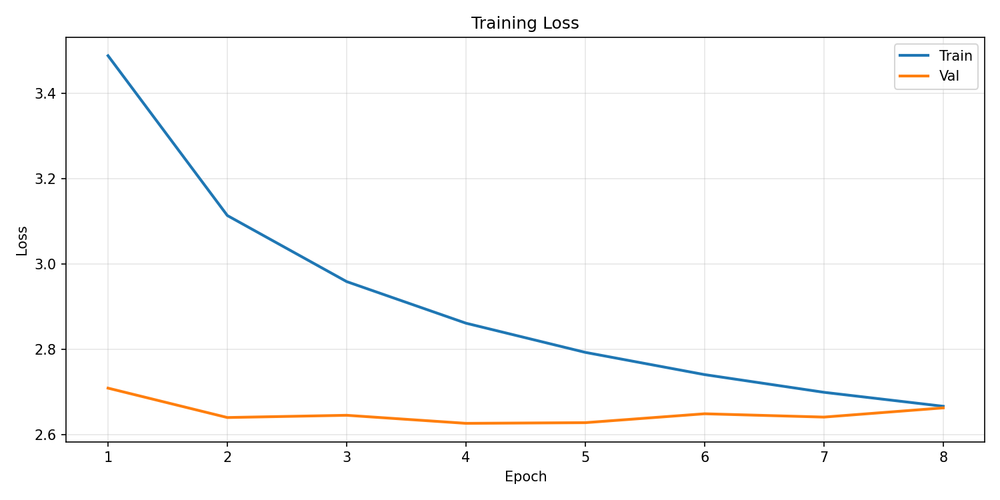
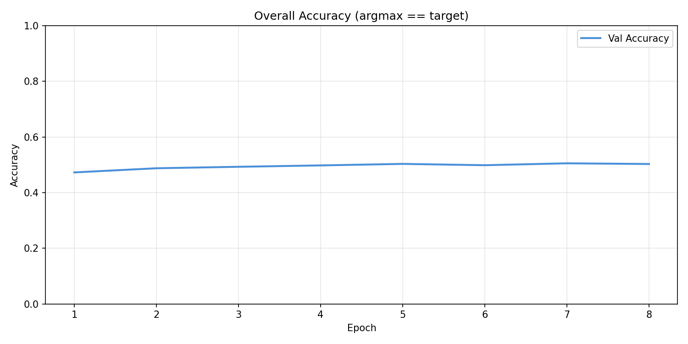
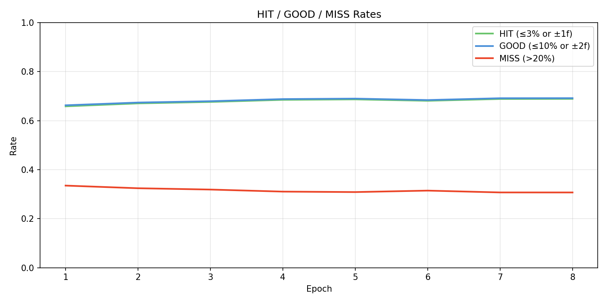
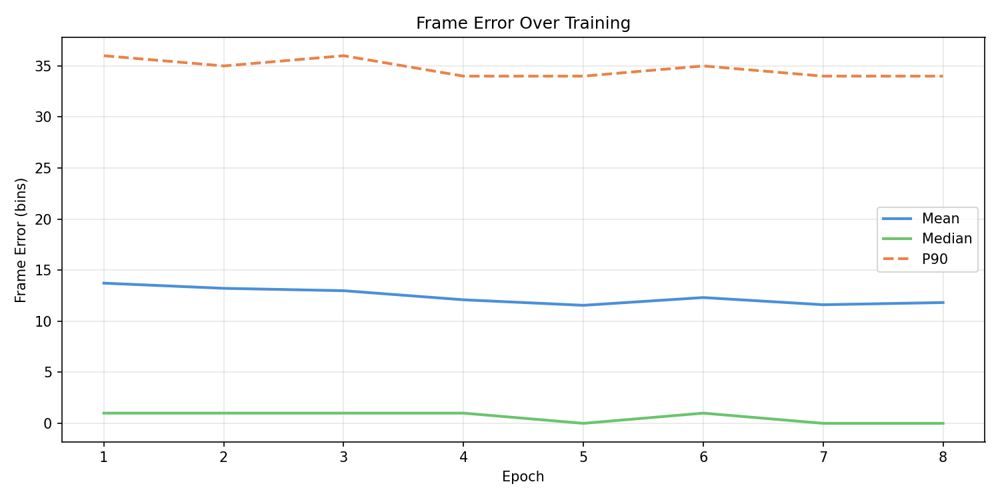
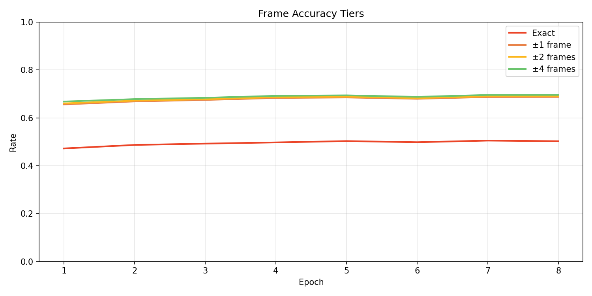
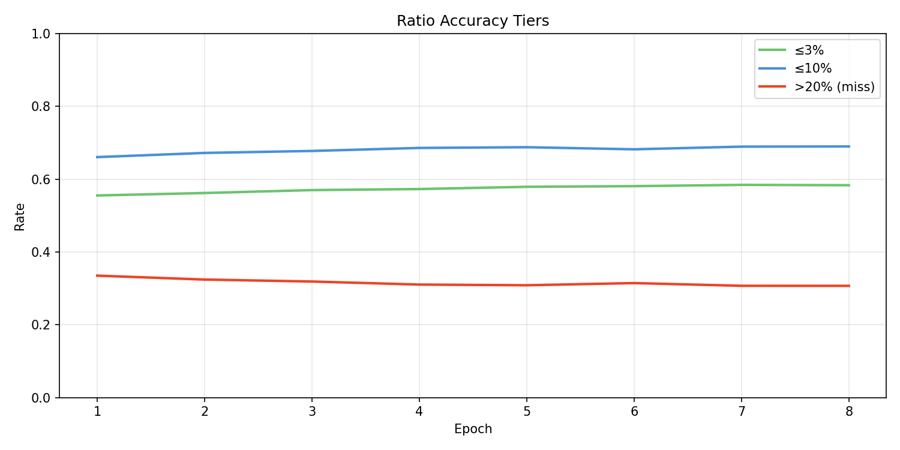
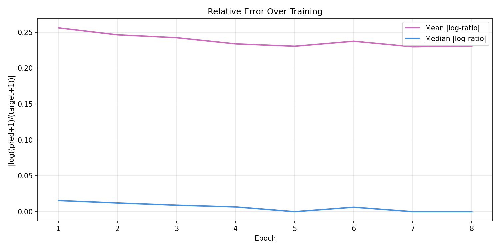
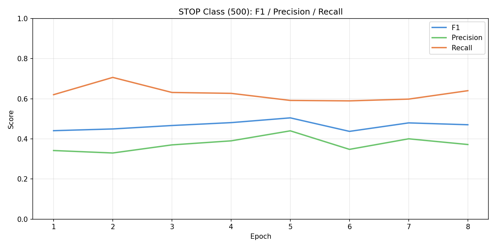
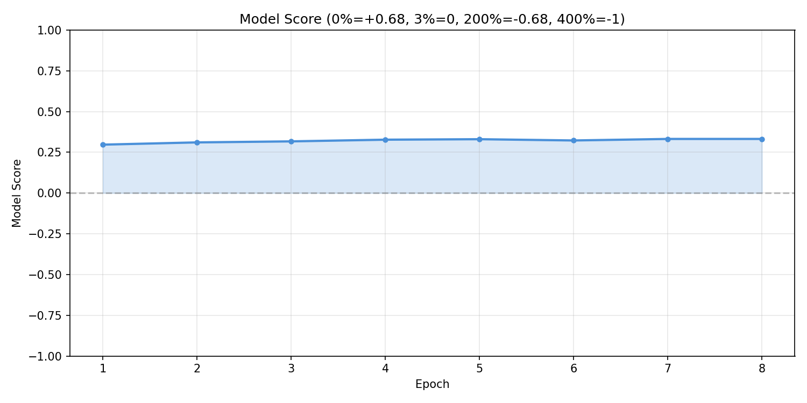

# Experiment 26 - Heavy Audio Augmentation

> **[Full Architecture Specification](ARCHITECTURE.md)** — self-contained reproduction guide with all model, loss, training, and dataset details.

## Hypothesis

Exp [25](../experiment_25/README.md) showed the unified fusion architecture matches exp [14](../experiment_14/README.md) (~68.6% HIT) but overfits from E2 onward (val loss 2.623 → 2.665 while train loss kept falling). Context contribution shrank from 6.8% to 2.3% over 5 epochs. The model memorized audio→onset mappings without learning to leverage gap tokens.

**Audio augmentation as regularizer.** Exp [25](../experiment_25/README.md) had light audio augmentation (inherited from exp [14](../experiment_14/README.md)) and deliberately reduced context augmentation. The model overfit to audio patterns. Heavier audio augmentation serves two purposes:
1. **Directly fights overfitting** - more variation in audio input makes memorization harder
2. **May indirectly encourage context reliance** - if audio signal is noisier/varied during training, gap tokens become a more stable anchor the model can lean on

### Changes from exp [25](../experiment_25/README.md)

**Architecture: identical.** Same unified fusion model (~19M params). This experiment isolates the effect of augmentation.

**Audio augmentation changes:**

| Augmentation | Exp [25](../experiment_25/README.md) | Exp 26 | Notes |
|---|---|---|---|
| Gain jitter | ±2dB @ 30% | ±3dB @ 50% | Wider range, more frequent |
| Noise injection | σ=0.1-0.3 @ 15% | σ=0.1-0.4 @ 30% | Stronger noise, 2x frequency |
| Freq jitter | *none* | ±1-5 bins @ 30% | **New** - roll mel bands up/down, zero-fill edges |
| SpecAugment freq mask | 1-8 bands, 1 mask @ 20% | 1-15 bands, 1-2 masks @ 40% | Wider masks, allow multiple |
| SpecAugment time mask | 1-30 frames, 1 mask @ 20% | 1-50 frames, 1-2 masks @ 40% | Wider masks, allow multiple |
| Temporal corruption | *none* | 10-frame chunk shuffle @ 2% | **New** - destroys local time structure, forces context reliance |
| Fade in/out | 10% each | 10% each | Unchanged |

**Context augmentation: unchanged** from exp [25](../experiment_25/README.md) (event jitter, deletion, insertion, dropout, truncation, cond jitter).

**Training: same hyperparams** - lr=3e-4, batch=64, subsample=4, train from scratch.

### Expected outcomes

1. **Slower convergence** - heavier augmentation means harder training signal, expect 2-3 more epochs to reach exp [25](../experiment_25/README.md) E2 levels.
2. **Less overfitting** - val loss should not diverge from train loss as quickly. The train/val gap should stay tighter.
3. **Context contribution maintained or improved** - if audio is noisier, the accuracy gap between full model and no_events benchmark should stay above 2.3% (exp [25](../experiment_25/README.md)'s final value) and ideally grow.
4. **Higher ceiling** - if overfitting was the bottleneck, we should eventually exceed exp [25](../experiment_25/README.md)'s 68.6% HIT / 0.330 score.

### Risk

- Too much augmentation could slow convergence so much that we can't tell if it's working within reasonable epoch count.
- Audio augmentation might be so heavy it degrades audio signal quality, lowering the ceiling rather than raising it.
- Context contribution may still shrink - the model might just overfit more slowly to the same audio-dominant solution.

## Result

**Augmentation reduced overfitting but did not raise the ceiling or improve context usage.** Killed after E8.

| Metric | E1 | E2 | E3 | E4 | E5 | E6 | E7 (best) | E8 |
|--------|-----|-----|-----|-----|-----|-----|-----------|-----|
| HIT | 65.8% | 67.0% | 67.6% | 68.5% | 68.7% | 68.1% | **68.8%** | 68.9% |
| GOOD | 66.3% | 67.4% | 67.9% | 68.8% | 68.9% | 68.4% | **69.2%** | 69.2% |
| Miss | 33.5% | 32.4% | 31.9% | 31.0% | 30.9% | 31.5% | **30.7%** | 30.7% |
| Score | 0.297 | 0.311 | 0.317 | 0.327 | 0.330 | 0.323 | **0.332** | 0.332 |
| Accuracy | 47.3% | 48.8% | 49.3% | 49.8% | 50.3% | 49.9% | **50.5%** | 50.3% |
| Frame err | 13.7 | 13.2 | 13.0 | 12.1 | 11.6 | 12.3 | **11.6** | 11.8 |
| Stop F1 | 0.441 | 0.449 | 0.467 | 0.481 | **0.505** | 0.437 | 0.480 | 0.470 |
| Train loss | 3.488 | 3.113 | 2.959 | 2.861 | 2.793 | 2.741 | 2.699 | 2.667 |
| Val loss | 2.709 | 2.640 | 2.645 | **2.627** | 2.628 | 2.649 | 2.641 | 2.663 |
| no_events acc | 40.0% | 46.2% | 46.9% | 47.3% | 48.9% | 47.6% | 48.5% | 48.6% |
| Context delta | 7.3% | 2.6% | 2.4% | 2.5% | 1.4% | 2.3% | 2.0% | 1.7% |

**What worked:**
- **Overfitting delayed by ~3 epochs.** Val loss plateaued around 2.63-2.66 for E4-E8 instead of climbing steadily from E2 like exp [25](../experiment_25/README.md). The augmentation successfully made training harder (train loss 2.67 at E8 vs exp 25's 2.69 at E5).
- **Slightly higher ceiling on some metrics.** Accuracy broke 50% for the first time (50.5% at E7 vs exp [25](../experiment_25/README.md)'s 49.8%). Frame error matched [exp 14's best (11.6) [?]](../experiment_14/README.md).
- **Slower, steadier convergence.** Metrics improved monotonically through E5 instead of peaking at E2 like exp [25](../experiment_25/README.md). More useful training epochs before diminishing returns.

**What didn't work:**
- **Same HIT ceiling.** Best HIT 68.8% (E7) — essentially identical to exp [25](../experiment_25/README.md) (68.6%) and exp [14](../experiment_14/README.md) (68.9%). The augmentation bought more training time but the model converged to the same place.
- **Context contribution still collapsed.** Delta shrank from 7.3% (E1) to 1.4-2.5% (E4+), same pattern as exp [25](../experiment_25/README.md). Noisier audio did not push the model toward gap tokens — it just learned to be robust to audio noise while still ignoring context.
- **Val loss eventually crept up.** E8 val loss (2.663) rising from E4 best (2.627). The overfitting is slower but the same fundamental dynamic plays out.

**Comparison with exp [25](../experiment_25/README.md) (same architecture, lighter augmentation):**

| | Exp [25](../experiment_25/README.md) (light aug) | Exp 26 (heavy aug) |
|---|---|---|
| Best HIT | 68.6% (E5) | 68.8% (E7) |
| Best score | 0.330 (E5) | 0.332 (E7) |
| Val loss best | 2.623 (E2) | 2.627 (E4) |
| Overfitting onset | E2 | E5 |
| Final context delta | 2.3% | 1.7% |
| Useful training epochs | ~3 | ~6 |

Augmentation doubled the useful training window but did not change the outcome.

## Graphs

## Lesson

- **Audio augmentation is effective regularization** — it delayed overfitting by ~3 epochs and allowed the model to train longer productively. Worth keeping for future experiments.
- **Augmentation does not change the ceiling** — the model converges to the same ~69% HIT regardless of augmentation strength. The bottleneck is not overfitting; it's what the model can learn from the available signal.
- **Context usage is orthogonal to audio augmentation** — noisier audio does not force context reliance. The model adapts to noise within the audio pathway rather than routing through gap tokens. Context collapse is an architectural problem, not a regularization problem.
- **The ~69% HIT ceiling is robust** — three experiments ([14](../experiment_14/README.md), [25](../experiment_25/README.md), 26) with different architectures and augmentation levels all converge to the same range. This may represent a fundamental limit of the current approach (cursor extraction, dataset size, or task formulation) rather than a tuning issue.
