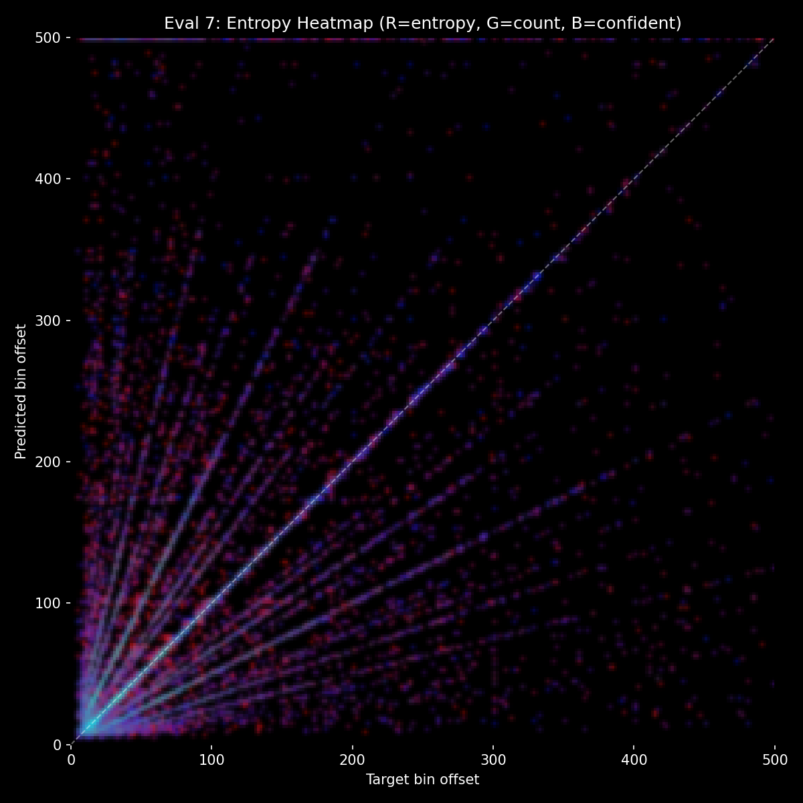
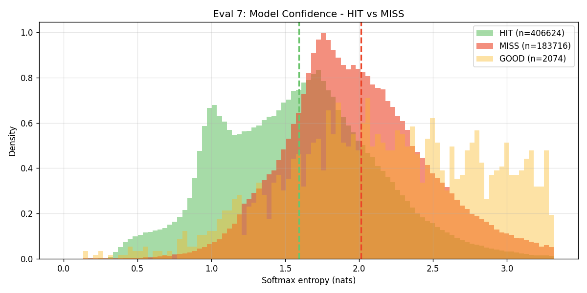

# Experiment 28 - Focal Loss

## Hypothesis

Exp 27 achieved 69.8% HIT with 96% top-10 accuracy — the model narrows to the correct answer almost every time but picks wrong on the hard cases. Exp 27-B confirmed that context contains the answer for ~95% of misses, but the model doesn't use it (context delta ~1.5%).

**The problem: easy samples dominate training.** ~70% of predictions are confident and correct from audio alone. These easy samples generate strong gradients that reinforce the audio pathway. The ~30% hard samples (where context would disambiguate) are drowned out. The model never faces enough pressure to learn context usage because it can reduce loss sufficiently through audio alone.

**Focal loss** directly addresses this by downweighting easy (high-confidence) samples and upweighting hard (low-confidence) ones. With gamma=2.0, a sample the model is 90% confident on gets its loss multiplied by 0.01, while a 50/50 sample keeps 0.25 of its loss. This redirects gradient signal toward the ambiguous cases — exactly the pattern disambiguation (75 vs 150) samples where context should matter.

See [THE_CONTEXT_ISSUE.md](../../THE_CONTEXT_ISSUE.md) for full background on why context utilization is the key bottleneck.

### Changes from exp 27

**Architecture: identical.** Same unified fusion model (~19M params), same heavy audio augmentation.

**Loss change: focal_gamma 0 → 2.0.** Everything else unchanged.

**Training: same as exp 27** — full dataset (subsample=1), batch=48, evals-per-epoch=4, train from scratch.

### Expected outcomes

1. **Slower early convergence** — focal loss downweights the easy 70%, so the model learns them slower. Initial HIT rate may lag behind exp 27.
2. **Better hard-case performance** — the ambiguous samples get proportionally more gradient. Should see improvement on medium/long gap predictions where context matters.
3. **Higher context delta** — if the hard cases are where context helps, focusing on them should increase context contribution. Watch for context delta staying above 2-3% instead of collapsing to 1.5%.
4. **Higher ceiling** — if the ~70% plateau was from gradient starvation on hard cases, focal loss should push past it.

### Risk

- gamma=2.0 might be too aggressive, making training unstable by focusing too much on outliers/noise.
- The hard cases might be hard for reasons other than context (e.g., genuinely ambiguous audio) — focal loss would amplify noise.
- Focal loss might improve accuracy on hard cases but reduce confidence on easy cases, leading to worse calibration.

### Launch

```bash
python detection_train.py taiko_v2 --run-name detect_experiment_28 --epochs 50 --batch-size 48 --subsample 1 --evals-per-epoch 4 --focal-gamma 2.0
```

## Result

**Better calibration but lower HIT ceiling and zero context improvement.** Killed after eval 9 (~3.25 epochs).

| eval | epoch | HIT | Miss | Score | Acc | Frame err | Stop F1 | Val loss | Ctx Δ |
|------|-------|-----|------|-------|-----|-----------|---------|----------|-------|
| 1 | 1.25 | 64.8% | 34.7% | 0.286 | 47.8% | 13.4 | 0.495 | 1.806 | 1.0% |
| 2 | 1.50 | 66.4% | 33.2% | 0.302 | 49.1% | 13.9 | 0.483 | 1.725 | -0.2% |
| 3 | 1.75 | 66.9% | 32.8% | 0.308 | 49.4% | 12.9 | 0.503 | 1.691 | 0.6% |
| 4 | 1.00 | 67.6% | 32.0% | 0.317 | 49.9% | 12.4 | 0.511 | 1.655 | 0.1% |
| 5 | 2.25 | **68.6%** | **31.0%** | **0.329** | **50.7%** | 11.9 | 0.525 | 1.623 | 0.2% |
| 6 | 2.50 | 68.0% | 31.7% | 0.321 | 50.4% | 12.7 | 0.494 | 1.632 | 0.8% |
| 7 | 2.75 | 68.6% | 31.0% | 0.329 | **50.8%** | **11.8** | **0.552** | 1.610 | -0.3% |
| 8 | 2.00 | 67.8% | 31.8% | 0.320 | 50.5% | 12.3 | 0.522 | 1.633 | 0.6% |
| 9 | 3.25 | 68.5% | 31.1% | 0.328 | 50.7% | 11.7 | 0.531 | **1.613** | -0.7% |

**What worked:**
- **Much better calibration.** Entropy HIT vs MISS distributions are cleanly separated — HITs cluster at 0.8-1.5 nats, MISSes at 1.8+ nats. Exp 27 had massive overlap between the two. The model knows when it's uncertain.
- **Better Stop F1** — 0.552 (eval 7), best ever across all experiments. Focal loss helped the model focus on the harder STOP classification.
- **Structured confidence in entropy heatmap.** Blue (confident) predictions cluster tightly on the correct diagonal and harmonic rays. The model confidently picks specific rhythmic candidates rather than spreading probability diffusely.

**What didn't work:**
- **Lower HIT ceiling** — plateaued at ~68.6% (evals 5-9), ~1.2pp below exp 27's 69.8%. The slower learning on easy cases never fully caught up.
- **Context delta zero or negative** — oscillated -0.7% to 1.0% across all evals. Worse than exp 27's already-low 1.5%. Focal loss focused on hard cases but the model still solved them through audio, not context.
- **No overfitting advantage** — val loss still slowly dropping at eval 9, but HIT rate plateaued regardless. More training time wouldn't help.

**Comparison with exp 27:**

| | Exp 27 | Exp 28 (focal) |
|---|---|---|
| Best HIT | **69.8%** | 68.6% |
| Best Stop F1 | 0.535 | **0.552** |
| Best frame err | 11.5 | **11.7** |
| Context delta | 1.5% | ~0% |
| HIT/MISS entropy separation | Poor (high overlap) | **Good (clean separation)** |

## Graphs

Progression graphs broken (evals-per-epoch=4 with old epoch-based x-axis). Per-eval graphs in `runs/detect_experiment_28/evals/`.

Best eval entropy analysis (eval 7):




## Lesson

- **Focal loss improves calibration, not accuracy.** The model becomes better at knowing when it's right vs wrong, but doesn't actually get more answers right. The entropy distributions are much cleaner — useful for downstream applications (beam search, confidence thresholding) but not for raw HIT rate.
- **Redirecting gradient to hard cases doesn't force context usage.** The hard cases (pattern disambiguation) are solvable by either audio or context. Focal loss makes the model work harder on them, but it still finds audio-based solutions. The gradient signal doesn't inherently prefer context over audio — it just says "try harder."
- **Focal loss is worth keeping as an option** for future experiments where we've already solved context utilization — the calibration benefit would compound with any method that exploits confidence (beam search, context gating with confidence threshold).
- **The context problem requires structural forcing, not loss reweighting.** Neither augmentation (exp 26), data volume (exp 27), nor loss focusing (exp 28) makes the model use context. The next step must structurally require context to carry signal — auxiliary context loss.
