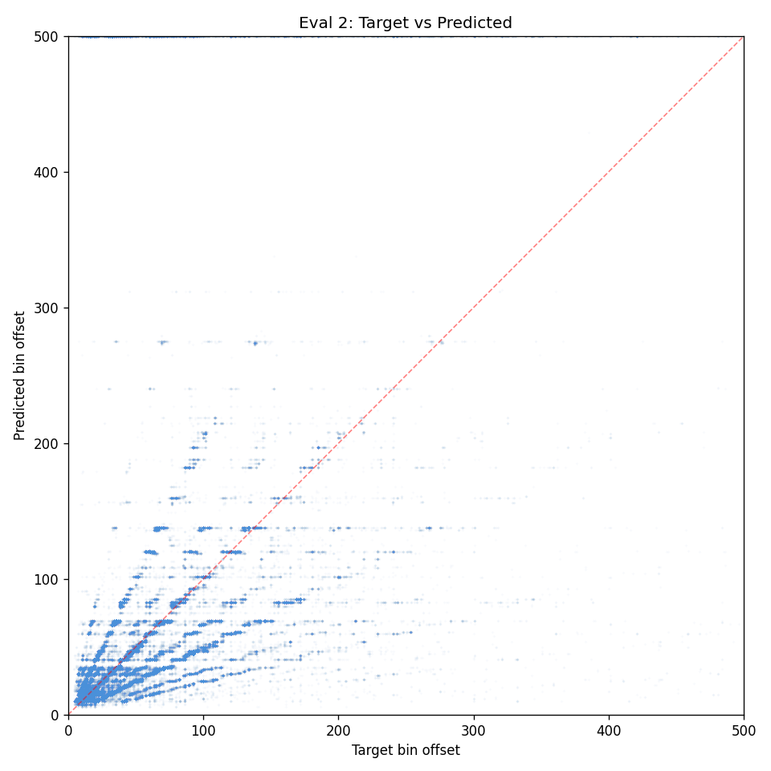
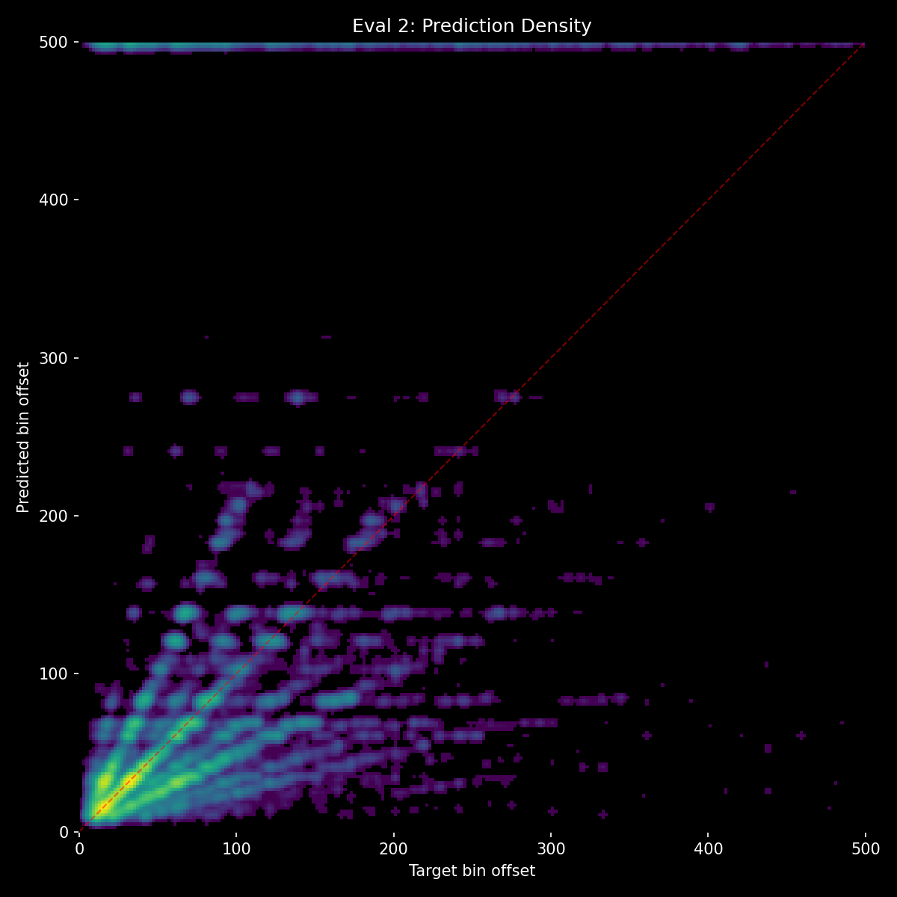
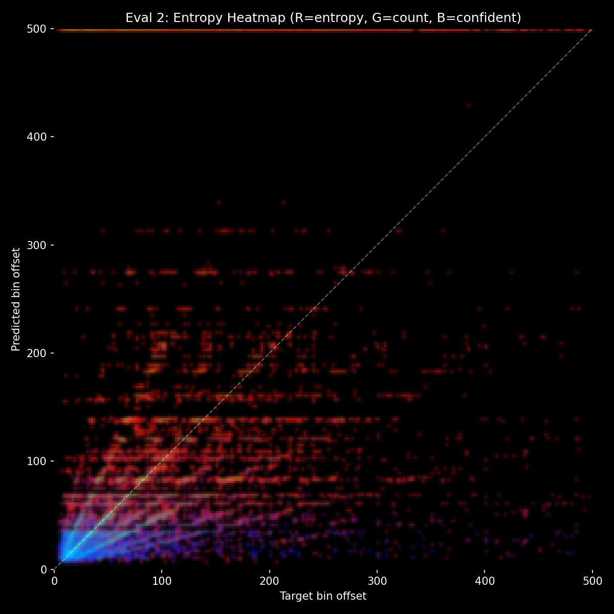

# Experiment 31 - Dual-Stream Architecture with Late Cross-Attention Fusion

> **[Full Architecture Specification](ARCHITECTURE.md)** — self-contained reproduction guide with all model, loss, training, and dataset details.


## Hypothesis

16 experiments ([14](../experiment_14/README.md)-[30](../experiment_30/README.md)) tried every training trick to make the unified fusion model use context: augmentation, data volume, focal loss, auxiliary heads, audio masking. None worked — context delta always collapses to ~0-1.5%. The conclusion: **the problem is architectural.**

The current unified fusion model concatenates 250 audio tokens + 128 gap tokens and runs self-attention over all 378. Audio tokens outnumber gap tokens 2:1 and carry stronger signal, so self-attention learns to route through audio and ignore context. No training trick can overcome this structural advantage.

**Dual-stream architecture** gives each modality its own dedicated processing before they interact:

1. **Audio stream**: AudioEncoder (4 self-attention layers) → 250 tokens. Processes audio independently.
2. **Context stream**: GapEncoder (4 self-attention layers, up from 2) → 128 tokens. Processes gap patterns independently.
3. **Late cross-attention fusion**: 2 bidirectional cross-attention layers where audio attends to gap AND gap attends to audio.

Key differences from unified fusion (exp [25](../experiment_25/README.md)-[30](../experiment_30/README.md)):
- **No shared self-attention** — gap tokens never compete with audio tokens for attention bandwidth
- **Context has its own depth** — 4 dedicated layers (was 2 encoder + shared with audio in 4 fusion layers)
- **Cross-attention forces interaction** — audio MUST attend to gap tokens in the fusion layers (they're the only key/value source). In unified self-attention, audio could attend to other audio tokens and ignore gaps entirely.
- **Bidirectional** — gap tokens also attend to audio, so context knows what audio is saying (addresses the exp [15](../experiment_15/README.md)-[24](../experiment_24/README.md) finding that context needs audio access)

See [THE_CONTEXT_ISSUE.md](../../THE_CONTEXT_ISSUE.md) for full background.

### Architecture

```
mel (B, 80, 1000) → AudioEncoder (4 layers) → 250 audio tokens (d=384)
events (B, C)      → GapEncoder (4 layers)   → C gap tokens (d=384)
                              ↓
           CrossAttentionFusion (2 layers):
             - audio cross-attends to gap (audio queries, gap K/V)
             - gap cross-attends to audio (gap queries, audio K/V)
             - FiLM conditioning on both
                              ↓
           Cursor at position 125 from audio stream → output head → 501 logits
```

| Component | Params | Notes |
|-----------|--------|-------|
| AudioEncoder (conv + 4 transformer layers) | ~8.0M | Same as exp [25](../experiment_25/README.md)-[30](../experiment_30/README.md) |
| GapEncoder (snippet enc + 4 transformer layers) | ~5.0M | Deeper (was 2 layers, ~3.5M) |
| CrossAttentionFusion (2 bidirectional layers) | ~5.0M | Replaces 4-layer concat self-attention (~7.5M) |
| Output head (norm + proj + smoothing) | ~0.2M | Same as before |
| cond_mlp | ~8K | Same |
| **Total** | **~23.3M** | Larger than exp [25](../experiment_25/README.md)-[30](../experiment_30/README.md) (~19M) due to deeper GapEncoder + dual FFN in cross-attn |

### Changes from exp 27

**Architecture**: Unified concat self-attention → dual-stream with late cross-attention. GapEncoder 2→4 layers. No concat fusion layers.
**Training**: Same as exp [27](../experiment_27/README.md) — full dataset (subsample=1), batch=48, evals-per-epoch=4, heavy audio augmentation, train from scratch.

### Expected outcomes

1. **Context delta should stay higher** — gap tokens have dedicated processing and can't be drowned out in early self-attention. Cross-attention forces audio to look at gap features.
2. **Slightly lower HIT initially** — the model has to learn cross-modal attention from scratch, and audio can't freely self-attend through gap tokens. May take more training to converge.
3. **no_events benchmark should drop** — if the model truly learns to use context, removing events should hurt significantly more than the ~0-1.5% delta we've seen.
4. **Slightly more params** (~23.3M vs ~19M) — extra capacity from deeper GapEncoder and dual FFN in cross-attention.

### Risk

- Cross-attention alone may not provide enough interaction — 2 layers of cross-attention vs 4 layers of full self-attention means fewer opportunities for information exchange.
- The cursor at position 125 only reads from the audio stream. If the critical context information doesn't flow from gap→audio in the cross-attention, it won't reach the output.
- Deeper GapEncoder (4 layers) on ~128 tokens might overfit the gap representation.


## Result

**Unprecedented context dependence (18.8% delta) but cross-attention bottleneck limits prediction diversity.** Killed after eval 2 (~1.5 epochs).

| eval | epoch | HIT | Miss | Score | Acc | Val loss | no_events | Unique (metronome) | Ctx Δ |
|------|-------|-----|------|-------|-----|----------|-----------|-------------------|-------|
| 1 | 1.25 | 44.9% | 47.8% | 0.097 | 24.7% | 3.421 | 10.1% | 53 | **14.5%** |
| 2 | 1.50 | 50.8% | 40.8% | 0.166 | 28.7% | 3.222 | 9.8% | 82 | **18.8%** |

**What worked:**
- **Context delta 14.5% → 18.8%** — the highest ever across all experiments, and INCREASING not collapsing. The model genuinely depends on gap tokens.
- **no_events accuracy at ~10%** — audio alone is nearly useless, confirming the architecture forces context dependence.
- **Learned the gap vocabulary** — the model quickly identified ~20 common gap values (visible as horizontal bands in the heatmap) and began placing them more accurately.

**What didn't work:**
- **Prediction diversity bottleneck** — only 82 unique predictions (metronome benchmark) vs exp [27](../experiment_27/README.md)'s ~350. The model snaps to a small codebook of common gap values rather than predicting the full continuous range.
- **HIT far behind** — 50.8% at eval 2 vs exp [27](../experiment_27/README.md)'s 67.5%. The cross-attention bottleneck limits fine-grained information flow.
- **Horizontal bands in heatmap** — predictions cluster at fixed gap values regardless of target, getting more accurate but not more diverse over training.
- **Cross-attention is too narrow** — 2 layers of cross-attention can only communicate coarse information ("which common gap") not fine-grained details ("exactly how many bins"). The unified model's 4 layers of full self-attention allowed richer information exchange.

## Graphs





## Lesson

- **Dual-stream architecture successfully forces context dependence** — the 18.8% context delta proves that separating streams prevents audio from drowning out context. This is the architectural solution to the context issue.
- **2 cross-attention layers is insufficient** — fine-grained onset prediction requires richer information exchange between streams. The model can communicate "which gap bucket" but not "exactly which bin."
- **Next: increase cross-attention layers to 4** — double the fusion capacity while keeping the dual-stream separation that forces context dependence.
