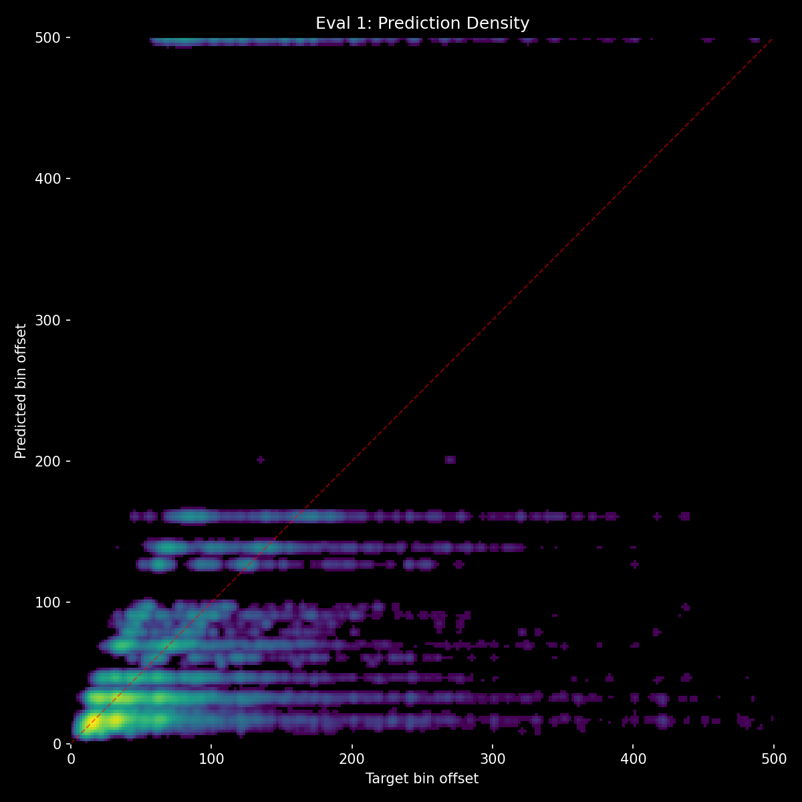
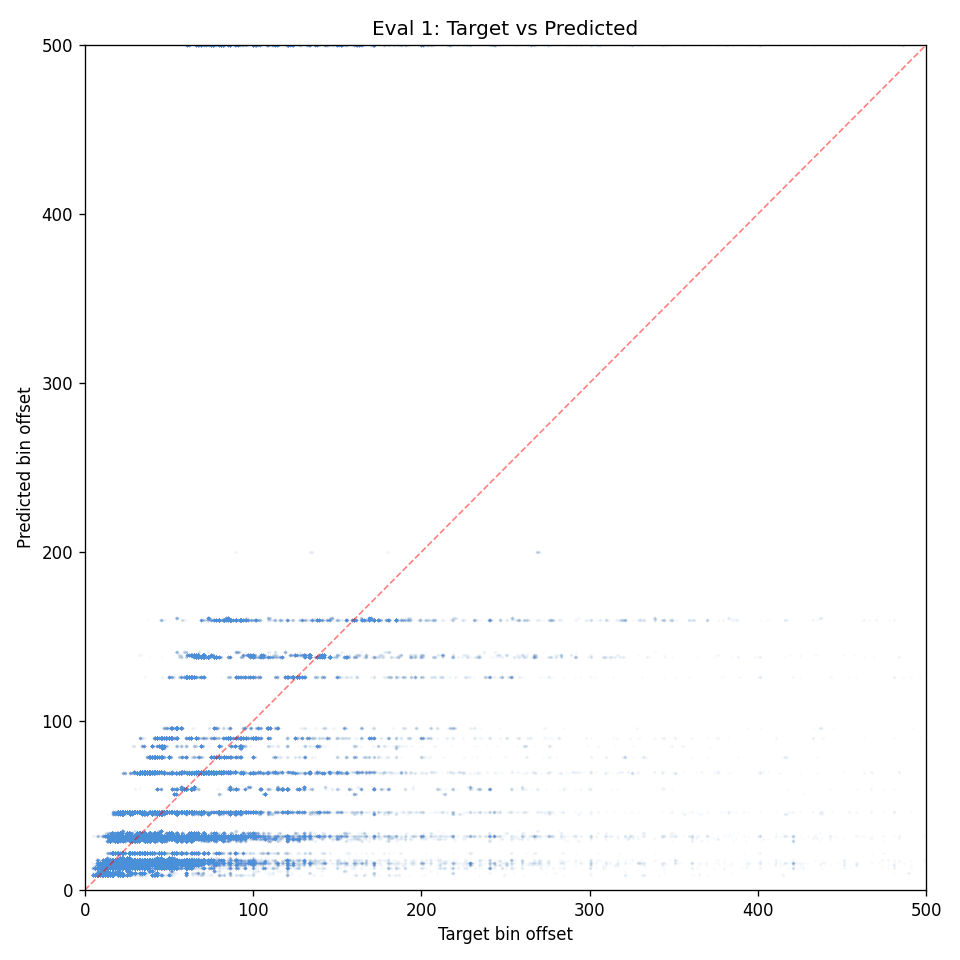

# Experiment 31-B - Dual-Stream with 4 Cross-Attention Layers

> **[Full Architecture Specification](ARCHITECTURE.md)** — self-contained reproduction guide with all model, loss, training, and dataset details.


## Hypothesis

Exp 31 proved that dual-stream architecture forces context dependence (18.8% context delta — highest ever). But 2 cross-attention layers bottleneck information flow, limiting the model to ~80 unique predictions (vs ~350 for the unified model). The model learns "which common gap value" but not "exactly which bin."

**Double the cross-attention layers (2→4)** to allow richer information exchange between audio and context streams while maintaining the stream separation that forces context dependence.

### Changes from exp 31

**cross_attn_layers: 2 → 4.** Everything else identical.

This adds ~5M params (total ~28M), making the model larger than exp 27 (~19M). If it works, we can optimize later.


## Result

**Worse than exp 31 — 4 cross-attention layers too deep, severe banding, NaN instability.** Killed after eval 1. Restarted with audio skip connection fix (see below).

| eval | epoch | HIT | Miss | Score | Acc | Val loss | Unique | no_events | Ctx Δ |
|------|-------|-----|------|-------|-----|----------|--------|-----------|-------|
| 1 | 1.25 | 18.6% | 60.1% | -0.127 | 6.9% | 4.144 | 37 | 4.9% | 2.0% |

Compared to exp 31 eval 1 (44.9% HIT, 53 unique) — dramatically worse. More cross-attention layers made things worse, not better.

**NaN instability:** Training hit NaN at batch ~3360 and again at ~12752. Root cause: GapEncoder produces activations at ±20 (vs audio's ±7). Through 4 cross-attention residual layers, rare inputs push values beyond float32 range. Fixed with activation clamping (±1e4) and NaN batch skipping.

**Banding problem persists and worsens:** Only 37 unique predictions — the model snaps to ~12 common gap values. The horizontal bands in the heatmap are even more severe than exp 31.




**Root cause of banding:** Cross-attention injects coarse gap-level information into audio tokens, overwhelming the fine-grained temporal features. The cursor at position 125 reads "the pattern says ~30" instead of "audio says exactly 31." Gap activations (±20) dominate audio activations (±7) through the residual path.

**Fix applied: audio skip connection.** Save the pre-cross-attention audio cursor feature and add it back after fusion:
```
cursor = post_fusion_audio[125] + pre_fusion_audio[125]
```
This guarantees the output head always sees fine-grained audio features regardless of what cross-attention learned, while still receiving context information from the fusion layers. Restarted with 2 cross-attention layers (back to exp 31 config) + skip connection.

## Lesson

- **More cross-attention layers doesn't help** — 4 layers is too deep for the dual-stream architecture. Slower convergence, worse predictions, NaN instability. The bottleneck was not fusion depth.
- **The banding problem is from cross-attention overwriting audio features** — gap activations are 3-4x larger than audio, dominating the residual path. The cursor loses fine-grained temporal information.
- **Audio skip connection is needed** — preserving pre-fusion audio features via skip connection ensures the output head always has access to precise onset timing from audio, with context as additive information on top.
