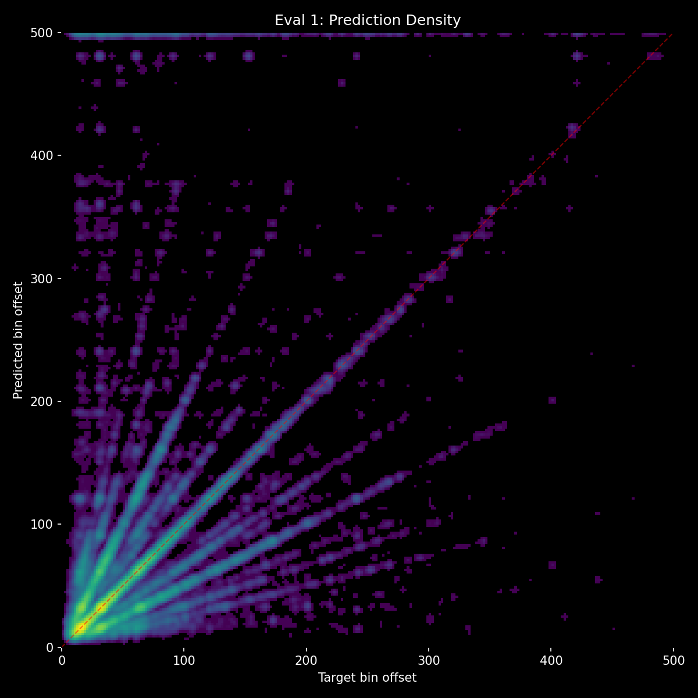

# Experiment 32 - Dual-Stream with Audio Skip Connection

## Hypothesis

Exp 31 proved dual-stream forces context dependence (18.8% delta — highest ever) but predictions collapse to ~80 unique values (banding). Exp 31-B confirmed more cross-attention layers makes it worse (37 unique). Root cause: cross-attention injects coarse gap-level activations (±20) that overwhelm fine-grained audio features (±7) through the residual path. The cursor at position 125 loses precise temporal information.

**Audio skip connection** preserves fine-grained audio features by adding the pre-cross-attention cursor feature back after fusion:
```
cursor = post_fusion_audio[125] + pre_fusion_audio[125]
```

The output head always sees:
- **Fine-grained audio** (pre-fusion) — precise onset timing, continuous bin resolution
- **Context-informed audio** (post-fusion) — pattern awareness from cross-attention with gap tokens

This should eliminate banding while maintaining the context dependence that dual-stream provides.

### Architecture

Same as exp 31 (2 cross-attention layers) + skip connection on cursor token.

```
mel → AudioEncoder (4 layers) → 250 audio tokens
                                    ├──── save cursor[125] (pre-fusion)
events → GapEncoder (4 layers) → C gap tokens     │
                ↓                                  │
     CrossAttentionFusion (2 layers)               │
                ↓                                  │
     cursor = audio[125] + saved_cursor ◄──────────┘
                ↓
     output head → 501 logits
```

| Component | Params | Notes |
|-----------|--------|-------|
| AudioEncoder | ~8.0M | Same |
| GapEncoder (4 layers) | ~5.0M | Same as exp 31 |
| CrossAttentionFusion (2 layers) | ~5.0M | Back to 2 layers (not 4) |
| Output head | ~0.2M | Same |
| **Total** | **~23.3M** | Same as exp 31 |

### Changes from exp 31

**Architecture**: + audio skip connection on cursor token. Back to 2 cross-attention layers.
**Training**: Same as exp 27/31 — full dataset, batch=48, evals-per-epoch=4.

### Expected outcomes

1. **Prediction diversity restored** — skip connection guarantees fine-grained audio features reach the output head. Should see 300+ unique predictions like the unified model.
2. **Context delta stays high** — the dual-stream separation still prevents audio from drowning out gap tokens in self-attention. Cross-attention still forces interaction.
3. **HIT should converge faster** — audio pathway has a direct gradient path through the skip connection, bootstrapping fast like the unified model.
4. **Best of both worlds** — unified model's prediction diversity + dual-stream's context dependence.

### Risk

- The skip connection might let the model bypass cross-attention entirely — if the pre-fusion cursor is sufficient, the model may learn to ignore the post-fusion contribution, reverting to audio-only behavior.
- Context delta might collapse again because the skip connection gives the model an audio shortcut.


## Result

**Banding fixed but context killed — skip connection becomes audio shortcut.** Killed after eval 1.

| eval | epoch | HIT | Miss | Score | Acc | Val loss | Unique | no_events | Ctx Δ |
|------|-------|-----|------|-------|-----|----------|--------|-----------|-------|
| 1 | 1.25 | 64.1% | 34.4% | 0.279 | 43.5% | 2.835 | **363** | 45.3% | **-1.8%** |

**What worked:**
- **Banding completely eliminated** — 363 unique predictions, matching the unified model. The skip connection restores fine-grained audio resolution.
- **Much faster convergence** — 64.1% HIT at eval 1 vs exp 31's 44.9%. The direct audio gradient path bootstraps fast.

**What didn't work:**
- **Context delta is negative (-1.8%)** — the model performs WORSE with context than without. The skip connection gives audio a direct shortcut to the output head, bypassing cross-attention entirely.
- **Predicted risk materialized** — the model learned to route through the skip connection (pre-fusion audio) and ignore the cross-attention contribution (post-fusion audio).



**The tradeoff:**
- Exp 31 (no skip): 18.8% context delta but banding (53 unique)
- Exp 32 (with skip): -1.8% context delta but no banding (363 unique)

The skip connection and context usage are in direct tension. The model needs fine-grained audio (from skip) AND context awareness (from cross-attention) but a simple additive skip lets it choose one or the other.

## Lesson

- **Skip connection solves banding but kills context** — a direct audio path to the output head is always preferred by gradient descent over the indirect cross-attention path. Same audio-dominance problem as unified fusion, just through a different mechanism.
- **The solution must weave context into audio processing, not bolt it on** — interleaved self-attention + cross-attention layers, where audio consolidates its own features between each context injection. No skip needed because audio self-attention preserves fine-grained features naturally.
