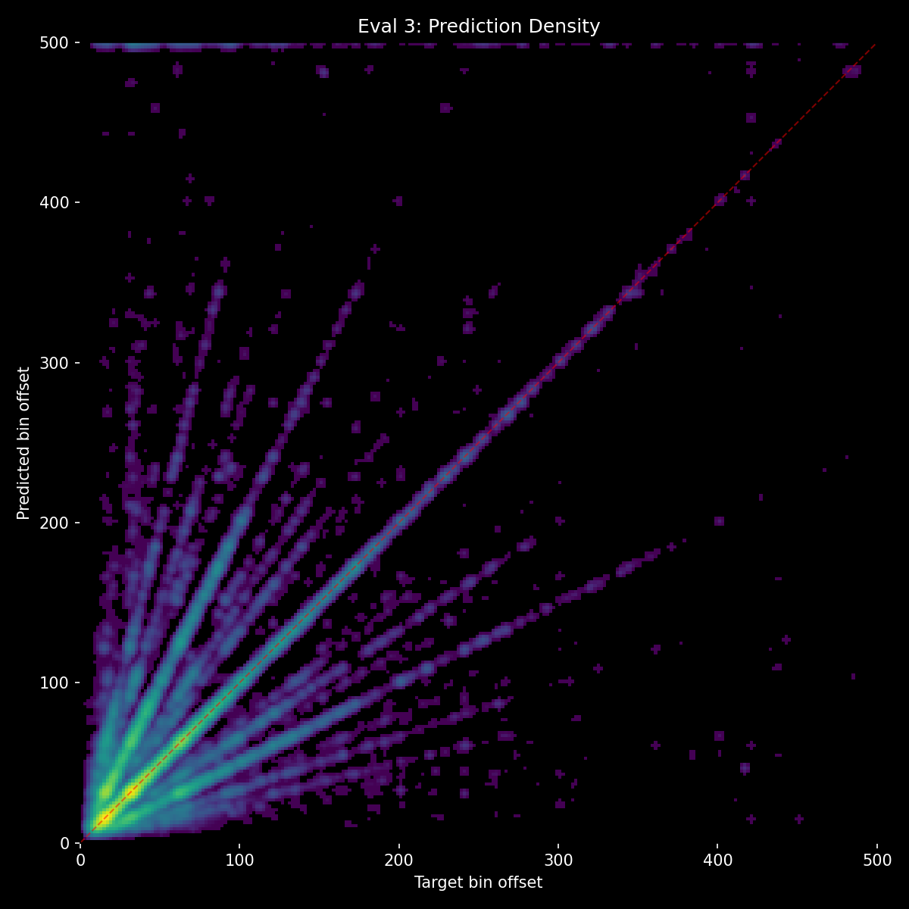
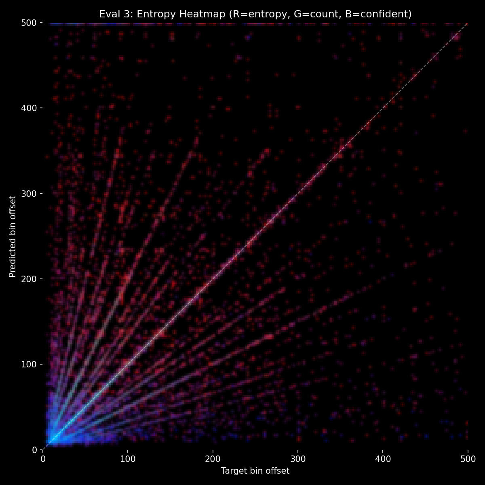

# Experiment 35-B - Full-Band Mel Ramps (Nuclear)

## Hypothesis

Exp 35 showed edge-band ramps provide 5.0% context delta but the conv filters them out. The ramps need to be inescapable.

**Nuclear approach**: halve all audio energy, then add ramps to ALL 80 mel bands:
```
mel = mel * 0.5 + ramp * 10.0  (broadcast across all bands)
```

The ramp signal is uniform across all frequency bands. The conv stem cannot learn to separate ramps from audio — they're mixed at every frequency. The model must process both signals simultaneously.

### Changes from exp 35

- Ramps added to ALL 80 mel bands (was: only bands 0-2, 77-79)
- Audio scaled by 0.5 before ramp addition (was: no scaling)
- No per-band intensity fading (was: 100%/50%/25% fade)

### Risk

- Halving audio may degrade onset detection quality too much — the model loses 3dB of audio signal.
- The uniform ramp across all bands destroys frequency-specific information at event positions.
- May be too aggressive — could try 0.75 scaling or lower ramp amplitude if results are poor.


## Result

**Best sustained context delta (~3.5-5%) but still decaying. High entropy across all predictions.** Killed after eval 4.

| eval | epoch | HIT | Miss | Score | Acc | Unique | Val loss | no_events | Ctx Δ |
|------|-------|-----|------|-------|-----|--------|----------|-----------|-------|
| 1 | 1.25 | 67.0% | 32.2% | 0.310 | 48.5% | 445 | 2.677 | 36.9% | **11.6%** |
| 2 | 1.50 | **69.1%** | **30.3%** | **0.334** | 50.2% | 452 | 2.601 | 43.0% | **7.2%** |
| 3 | 1.75 | 69.5% | 30.0% | 0.338 | **50.5%** | 444 | **2.589** | 45.2% | **5.4%** |
| 4 | 2.25 | 67.9% | 31.6% | 0.321 | 50.1% | 461 | 2.594 | 46.6% | **3.5%** |

**What worked:**
- **Highest sustained context delta** — settled at 3.5-5% through evals 2-4, compared to ~1.5% for exp 27 at the same stage. The full-band ramps provide ~2-3pp more context contribution than any prior approach except cross-attention (exp 31).
- **Fast convergence** — 69.5% HIT at eval 3, matching exp 27's best trajectory. The 0.5x audio scaling didn't hurt audio quality.
- **No banding** — 445-461 unique predictions throughout. Full-band ramps don't interfere with prediction diversity.
- **Model correctly decomposes ramps from audio** — the uniform cross-band signal is separable from natural spectral variation, allowing the model to attend to both independently.

**What didn't work:**
- **Context delta still decaying** — 11.6% → 3.5% over 4 evals. Slower than prior experiments but the same downward trend. The model is gradually learning to solve predictions through audio alone.
- **High entropy across all predictions** — the entropy heatmap shows most predictions have high uncertainty, even correct ones. The 0.5x audio scaling reduces signal strength, and the linear ramps may be too gradual for the model to extract sharp beat positions.




**Comparison across mel-embedding approaches:**

| | Exp 35 (edge bands) | Exp 35-B (full band) |
|---|---|---|
| Ctx Δ at eval 1 | 5.0% | **11.6%** |
| Ctx Δ at eval 3-4 | — | **3.5-5.4%** |
| HIT at best | 65.7% (eval 1) | **69.5%** (eval 3) |
| Ramp separable? | Yes (conv filters bands) | Yes (cross-band uniformity) |

## Lesson

- **Full-band mel ramps provide the best sustained context delta outside of cross-attention** — 3.5% at eval 4 vs ~1.5% for all prior unified architectures. The approach works.
- **Linear ramps are too gradual** — the model sees a smooth slope but can't easily pinpoint exact beat positions. Exponential decay (sharp spike at event, fast falloff) would make beat positions much clearer.
- **Fixed 0.5x audio scaling reduces confidence** — the model sees weaker audio, leading to high entropy. Variable amplitude (0.25-0.75 jitter) would make the model robust to different ramp-to-audio ratios.
- **The mel-embedding approach is worth iterating on** — it's the first data-level change that meaningfully affects context usage without architectural complexity.
