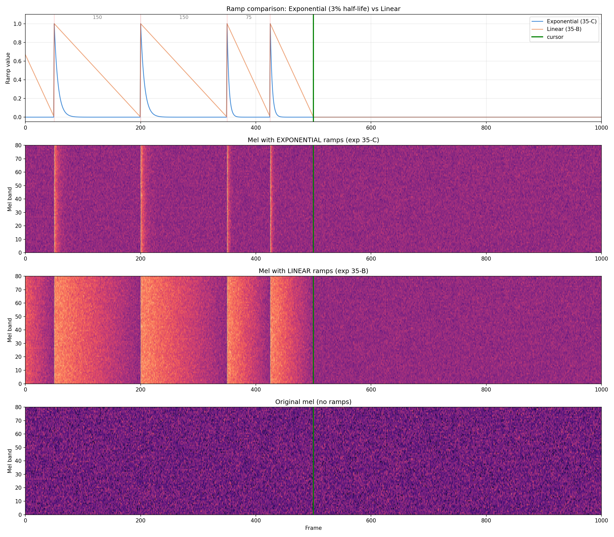
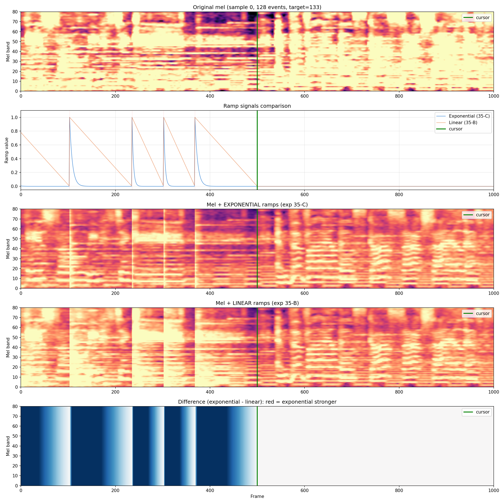
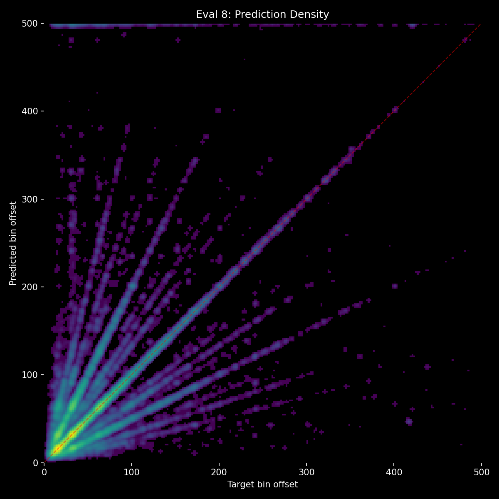
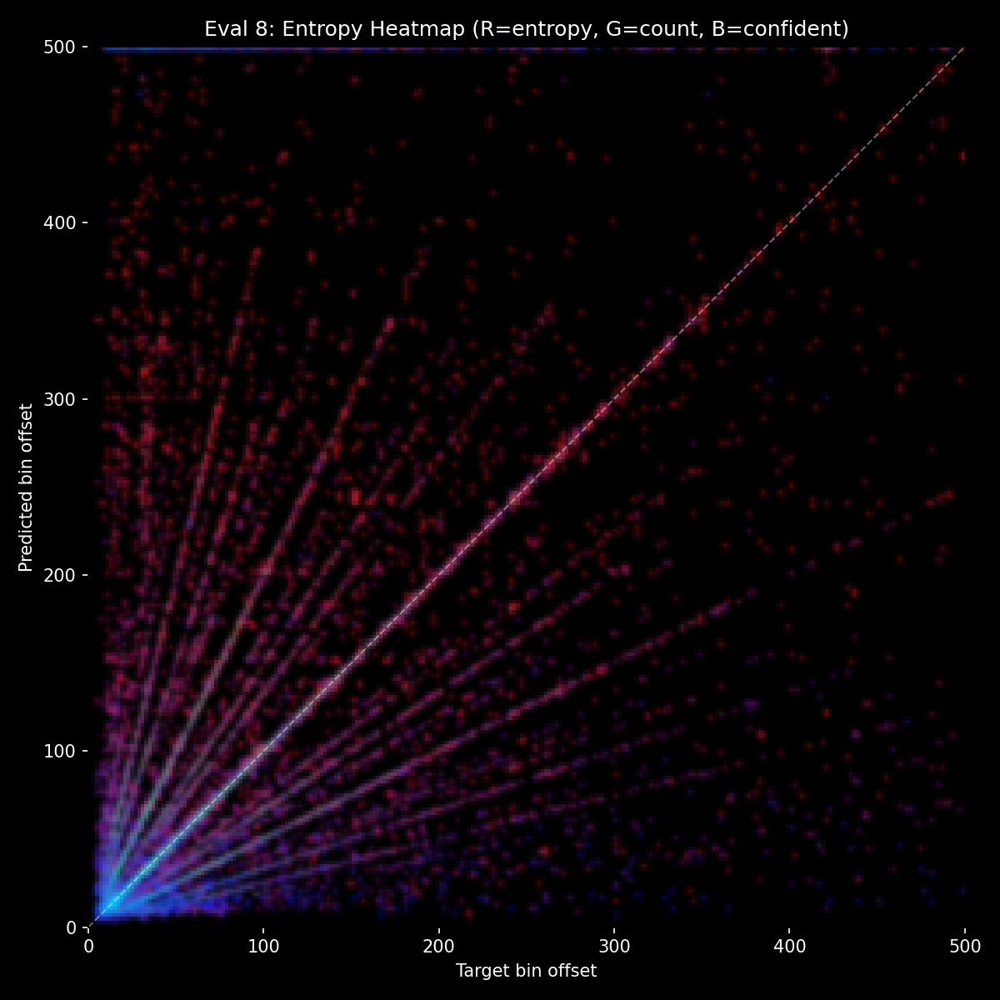
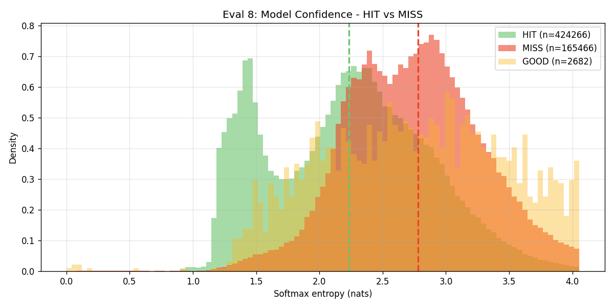
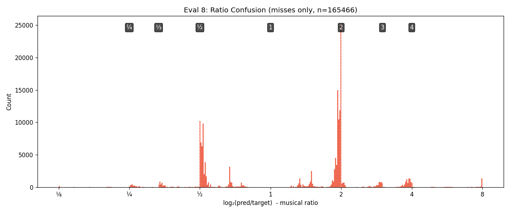

# Experiment 35-C - Exponential Decay Ramps + Amplitude Jitter

> **[Full Architecture Specification](ARCHITECTURE.md)** — self-contained reproduction guide with all model, loss, training, and dataset details.

## Hypothesis

Exp [35-B](../experiment_35b/README.md) showed full-band mel ramps provide the best sustained context delta (3.5-5%) but two issues remain:
1. **Linear ramps are ambiguous** — the model sees a gradual slope but can't pinpoint exact beat positions. This contributes to high entropy across all predictions.
2. **Fixed 0.5x audio scaling reduces confidence** — weakened audio signal means the model is uncertain even when correct.

**Exponential decay ramps** make beat positions sharp and unambiguous. At each event, the signal spikes to 1.0 and decays exponentially with a half-life of 3% of the gap. By the time the next event arrives, the signal is near zero. The model sees clear "beat markers" — a spike pattern whose frequency IS the rhythm.

**Amplitude jitter** (0.25-0.75x per sample during training) prevents the model from learning a fixed ramp-to-audio ratio. It must be robust to varying audio strengths, encouraging confidence calibration.

### Changes from exp [35-B](../experiment_35b/README.md)

- **Ramp shape**: linear (1→0 over gap) → exponential decay (spike + fast falloff, half-life = 3% of gap)
- **Audio scaling**: fixed 0.5 → random 0.25-0.75 per sample during training (0.5 at eval)

### Expected outcomes

1. **Lower entropy** — sharper beat markers give the model more confident features to attend to.
2. **Context delta maintained or improved** — exponential decay makes event positions more distinct, potentially more useful.
3. **Better calibration** — amplitude jitter trains robustness, reducing overconfidence/underconfidence.

### Risk

- New exponential may be way too weak for the model to detect, or become easy to ignore.

### Visualizations

## Result

**BREAKTHROUGH — 71.6% HIT (new all-time high) with sustained 4.5-5.7% context delta.** First experiment to simultaneously break 70% HIT AND maintain meaningful context usage. Killed after eval 8.

| eval | epoch | HIT | Miss | Score | Acc | Unique | Val loss | no_events | Ctx Δ |
|------|-------|-----|------|-------|-----|--------|----------|-----------|-------|
| 1 | 1.25 | 66.2% | 33.1% | 0.301 | 47.7% | 441 | 2.692 | 38.0% | 9.8% |
| 2 | 1.50 | 68.0% | 31.4% | 0.323 | 49.5% | 436 | 2.617 | 43.9% | 5.6% |
| 3 | 1.75 | 69.7% | 29.7% | 0.340 | 51.0% | 467 | 2.569 | 46.2% | 4.8% |
| 4 | 1.00 | 69.8% | 29.7% | 0.340 | 51.1% | 449 | 2.569 | 46.0% | 5.2% |
| 5 | 2.25 | 71.2% | 28.4% | 0.357 | 52.5% | 447 | 2.532 | 46.7% | 5.7% |
| 6 | 2.50 | 71.1% | 28.5% | 0.355 | 52.4% | 439 | 2.529 | 46.8% | 5.6% |
| 7 | 2.75 | 71.3% | 28.2% | 0.356 | 52.3% | 434 | 2.528 | 47.2% | 5.1% |
| **8** | **2.00** | **71.6%** | **27.9%** | **0.361** | **52.7%** | 436 | **2.533** | 48.1% | **4.5%** |

**Comparison with prior bests:**

| | Exp [14](../experiment_14/README.md) (E8) | Exp [27](../experiment_27/README.md) (eval 8) | **Exp 35-C (eval 8)** |
|---|---|---|---|
| HIT | 68.9% | 69.8% | **71.6%** |
| Miss | 30.3% | 29.8% | **27.9%** |
| Score | 0.337 | 0.343 | **0.361** |
| Val loss | ~2.65 | 2.560 | **2.533** |
| Context Δ | ~0% | 1.5% | **4.5%** |

**What worked:**
- **Exponential decay ramps are the key innovation.** Sharp spikes at beat positions survive conv downsampling and give the model clear temporal landmarks.
- **Amplitude jitter prevents audio-ratio overfitting.** Random 0.25-0.75x scaling forces robust feature extraction.
- **Context delta stabilized at 4.5-5.7%** — first experiment where delta HELD instead of collapsing.
- **Val loss still dropping at eval 8 (2.533)** — no plateau yet.

**What still needs work:**
- **2.0x error band still prominent** — pattern disambiguation improved but not solved.
- **High entropy across predictions** — model is unsure even when right.
- **AR fragility** — the model trusts ramps blindly. Wrong ramps (from AR errors) cascade.

## Graphs

## Lesson

- **Embedding context directly in the audio signal works.** After 20+ experiments trying separate context pathways, the solution was to put context where the model already looks — in the mel spectrogram.
- **Exponential decay > linear ramps.** [Linear ramps](../experiment_35b/README.md) collapsed to 3.5% delta. Exponential stabilized at ~5%.
- **The model uses context but can't fully disambiguate.** The 2.0x error band persists. Focal loss (gamma=3) should help by focusing on these hard cases where context is most useful.
