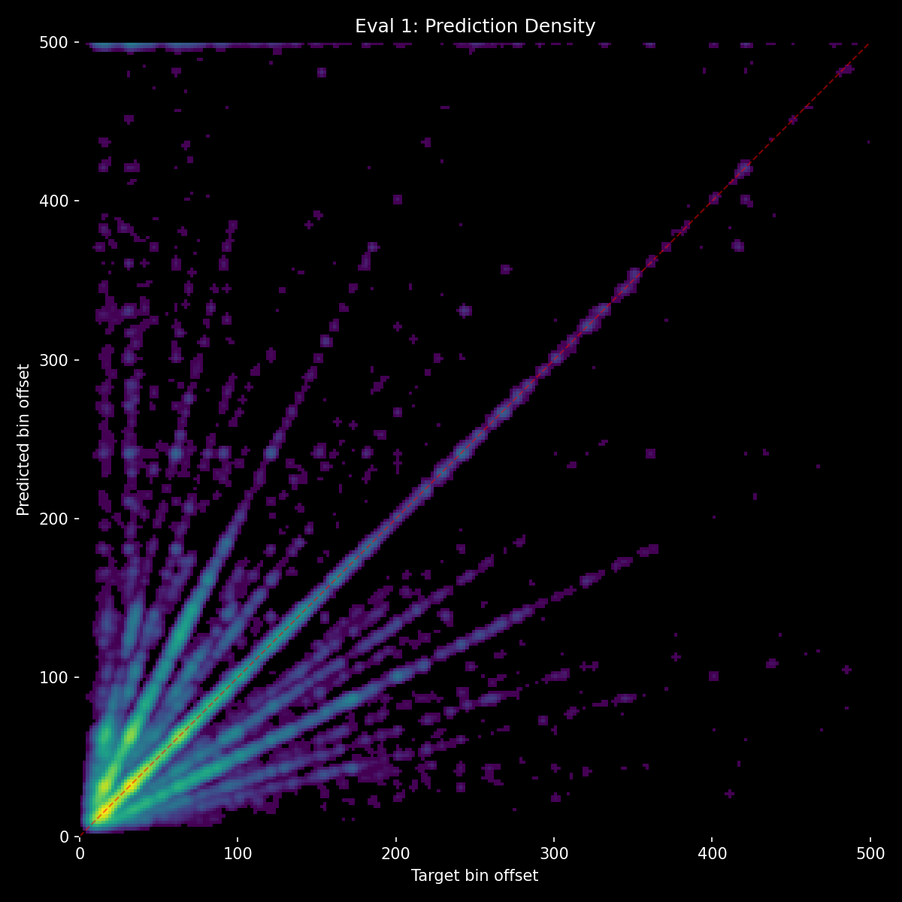
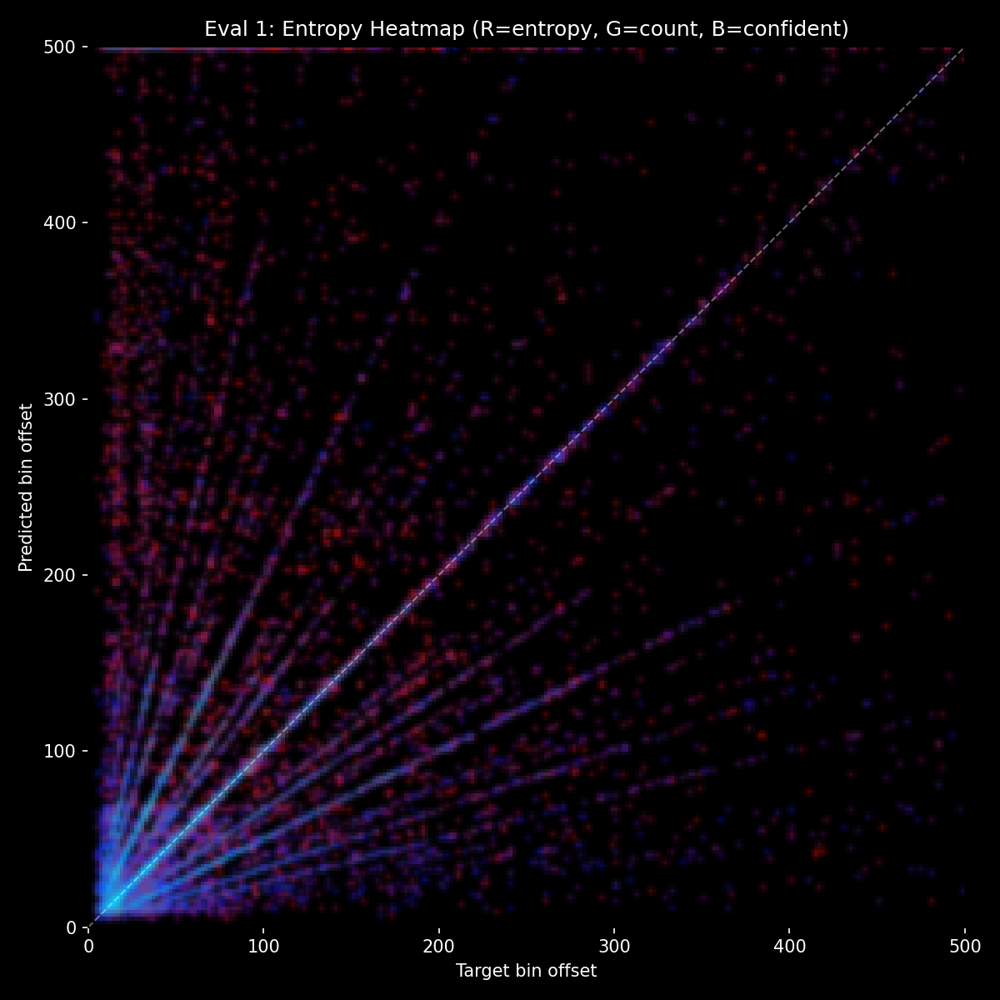
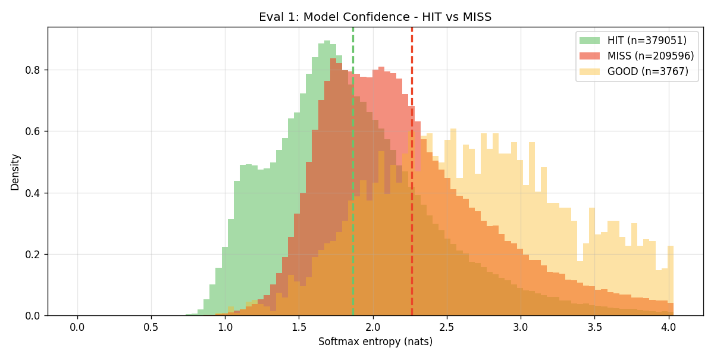
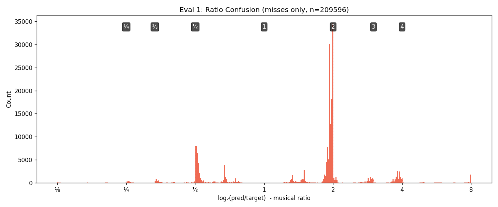

# Experiment 35-D - Exponential Ramps + Focal Loss (gamma=3)

> **[Full Architecture Specification](ARCHITECTURE.md)** — self-contained reproduction guide with all model, loss, training, and dataset details.


## Hypothesis

Exp 35-C achieved 71.6% HIT with 4.5% sustained context delta — the first breakthrough past 70%. But two issues remain:
1. **2.0x error band** — the model still frequently predicts double the correct value. These are the pattern disambiguation cases where context should help.
2. **High entropy** — predictions are uncertain even when correct.

**Focal loss (gamma=3.0)** should directly target both issues:
- Downweights the easy ~70% of predictions (confident, correct from audio alone), focusing gradient on the hard 30% where the 2.0x confusion happens
- Exp 28 (gamma=2.0) proved focal loss improves entropy calibration (cleaner HIT/MISS separation)
- Gamma=3.0 is more aggressive than exp 28's 2.0 — stronger focus on hard cases
- Combined with mel ramps, the hard cases now have context signal available. Exp 28 failed to improve HIT because context wasn't available; now it is.

### Changes from exp 35-C

**focal_gamma: 0 → 3.0.** Everything else identical (exponential ramps, amplitude jitter 0.25-0.75).

### Expected outcomes

1. **Better HIT on hard cases** — focal loss focuses on the 2.0x confusion cases, and context (via ramps) provides the disambiguation signal.
2. **Lower entropy** — proven from exp 28 that focal loss improves calibration.
3. **Possibly slower convergence** — focal loss makes easy samples contribute less gradient.
4. **Context delta possibly higher** — if hard cases are where context matters most, focusing on them should increase context contribution.

### Launch

```bash
python detection_train.py taiko_v2 --run-name detect_experiment_35d --epochs 50 --batch-size 48 --subsample 1 --evals-per-epoch 4 --focal-gamma 3.0 --workers 3
```

## Result

**Focal loss increased confidence globally but did not improve HIT.** Killed after eval 1.

| eval | epoch | HIT | Miss | Score | Acc | Unique | Val loss | no_events | Ctx Δ |
|------|-------|-----|------|-------|-----|--------|----------|-----------|-------|
| 1 | 1.25 | 64.0% | 35.4% | 0.276 | 46.2% | 458 | 1.586 | 39.1% | 7.1% |

**Comparison at eval 1 (same training stage):**

| | Exp 35-C (eval 1) | Exp 35-D (eval 1) | Delta |
|---|---|---|---|
| HIT | 66.2% | 64.0% | **-2.2pp** |
| Miss | 33.1% | 35.4% | +2.3pp |
| Score | 0.301 | 0.276 | -0.025 |
| Val loss | 2.692 | 1.586 | — (not comparable, focal rescales loss) |
| Context Δ | 9.8% | 7.1% | -2.7pp |

**What happened:**
- **Focal loss compressed loss magnitude** — val_loss 1.586 vs 2.692, but this is not comparable since gamma=3 downweights confident samples by `(1-p)^3`.
- **Entropy decreased globally** — the model became more confident on ALL predictions, not just the hard disambiguation cases. Easy samples got sharper, hard samples stayed hard.
- **HIT dropped 2.2pp** — focal loss gamma=3 is too aggressive. It suppresses gradients from the ~70% of easy, correct predictions that the model still needs to learn from at this early stage.
- **Context delta lower** — 7.1% vs 9.8%. Focal loss reduced context contribution, the opposite of the hypothesis. The hard cases where context should help didn't get enough gradient signal to learn context usage.
- **Prediction diversity preserved** — 458 unique preds (vs 441), so focal loss didn't cause mode collapse.

## Graphs






## Lesson

- **Focal loss (gamma=3) is too aggressive at early training.** It downweights the easy 70% before the model has fully converged on them. The model needs a stable audio baseline before focal loss can meaningfully redirect gradient to hard cases.
- **Decreased entropy ≠ better predictions.** The model became more confident but less accurate — a calibration failure. The confidence increase was uniform, not targeted at hard cases.
- **Focal loss doesn't selectively focus on 2.0x confusion.** It focuses on ALL low-confidence predictions, including many that are hard for reasons other than pattern disambiguation (e.g., boundary cases, rare patterns).
- **The 2.0x error band is not a loss problem — it's a structural problem.** The autoregressive single-prediction formulation forces the model to choose one answer, and it rationally chooses the conservative one. No loss reweighting can fix a structural asymmetry where overshooting is catastrophic and undershooting is safe.
