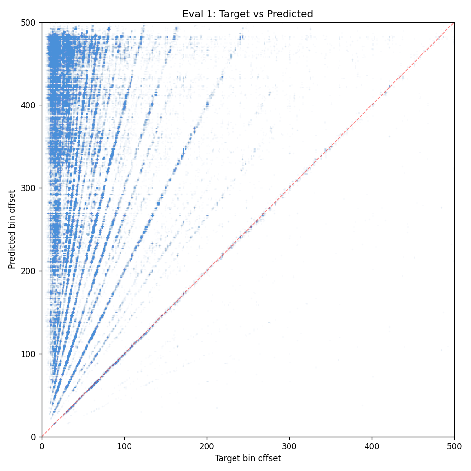
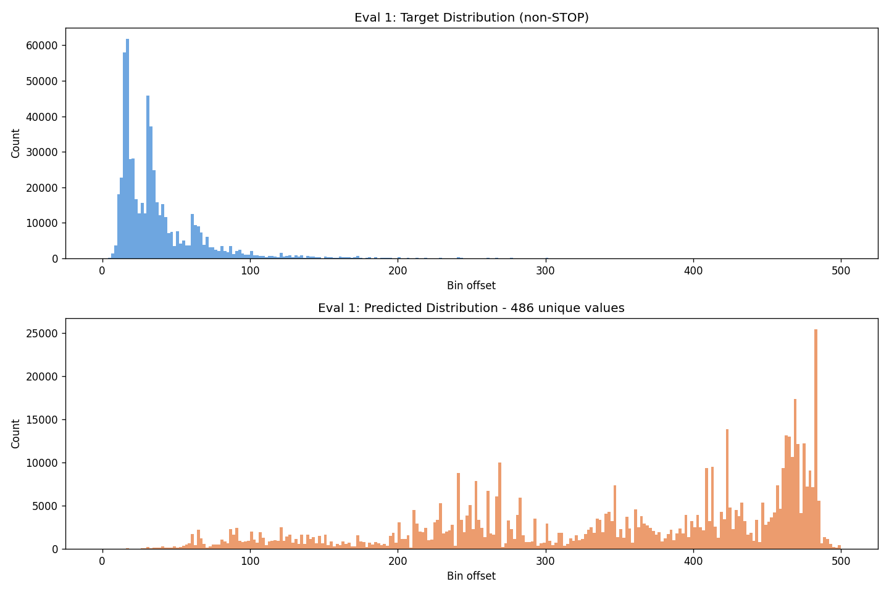

# Experiment 37 - Per-Bin Sigmoid Multi-Target

> **[Full Architecture Specification](ARCHITECTURE.md)** — self-contained reproduction guide with all model, loss, training, and dataset details.


## Hypothesis

Experiments 36 and 36-B proved that softmax is fundamentally wrong for multi-target: bins compete for probability mass, preventing the model from predicting multiple onsets simultaneously. Per-onset recall loss improved precision but couldn't overcome the softmax bottleneck.

**Per-bin sigmoid** replaces the softmax with 501 independent binary classifiers. Each bin independently predicts P(onset here) with no competition between bins. The model can say "YES at bin 35 AND YES at bin 70" simultaneously.

The loss uses the same log-ratio trapezoid soft labels from OnsetLoss, but as per-bin BCE targets instead of a probability distribution:
- Bins near a real onset get target ≈ 1.0 (within good_pct)
- Bins in the ramp zone get interpolated targets (between good_pct and fail_pct)
- Bins far from any onset get target = 0.0
- Positive bins are upweighted (pos_weight=5.0) since onsets are sparse (~3-5 per 500 bins)

### Architecture

Identical model (OnsetDetector with mel ramps). The output head still produces (B, 501) logits — the interpretation changes from softmax to sigmoid. No architectural changes.

### Changes from exp 36-B

- **Loss**: `SigmoidMultiTargetLoss` replaces `MultiTargetOnsetLoss`. Per-bin BCE instead of softmax CE.
- **Probabilities**: `sigmoid(logits)` instead of `softmax(logits)` — each bin is independent.
- **pos_weight=5.0**: upweights positive bins to handle class imbalance (few onsets per window).
- **focal_gamma=2.0**: focal loss modulation on the per-bin BCE. Downweights easy negatives (~495 bins per sample that are confidently 0), focuses on hard cases (onset bins the model is uncertain about). This is the original RetinaNet use case — sparse detection with massive class imbalance.
- Everything else identical (exponential ramps, amplitude jitter, multi-target dataset).

### Expected outcomes

1. **Higher event recall** — bins don't compete, so the model can fire multiple peaks without suppressing others.
2. **Maintained precision** — the log-ratio trapezoid targets still guide predictions to be near real onsets.
3. **Nearest-target HIT maintained** — the highest-confidence bin should still predict the nearest onset accurately.
4. **Threshold sensitivity may differ** — sigmoid outputs are absolute (not relative like softmax). The 0.05 threshold may need adjustment.

### Risk

- Sigmoid outputs can activate many bins simultaneously → potential hallucination explosion if pos_weight is too high.
- No normalization means the model can predict 0 or 100 onsets per window with no penalty for being "too many." The empty_weight partially addresses this for empty windows.
- The log-ratio trapezoid targets create smooth target distributions — many bins get partial positive labels, which could make the sigmoid overly active.

### Launch

```bash
python detection_train.py taiko_v2 --run-name detect_experiment_37 --model-type unified --multi-target --sigmoid-loss --focal-gamma 0.0 --epochs 50 --batch-size 48 --subsample 1 --evals-per-epoch 4 --pos-weight 5.0 --workers 3
```

## Result

**Massive overprediction — model fires 468 of 500 bins per window.** Killed early.

First attempt with focal_gamma=2.0 predicted nothing (3.2% HIT). Restarted with focal_gamma=0.0:

| Metric | Value |
|--------|-------|
| Nearest HIT | 1.4% |
| Event recall | 99.9% |
| Pred precision | 3.5% |
| Hallucination | 96.5% |
| F1 | 0.067 |
| Preds/window | 468.5 |
| Real/window | 16.2 |

The model activates almost every bin. The pred distribution shows massive spike at bins 400-500 (end of window) where few real onsets exist. The scatter shows near-universal overprediction.

**Root cause**: pos_weight=5.0 combined with soft trapezoid targets that give partial positive labels to ~20-30 bins per onset. With 16 onsets, ~300 bins have nonzero targets. The model learns "activate everything" to minimize the positive-weighted loss.




## Lesson

- **Focal + sigmoid was too aggressive** — focal γ=2 made the model predict nothing (all easy negatives, no gradient). Without focal, pos_weight=5 makes it predict everything.
- **Soft trapezoid targets are problematic for sigmoid** — they create too many partial positives. Sigmoid needs sharper targets (hard positive at exact onset bin, 0 everywhere else) or much lower pos_weight.
- **Next: pos_weight=1.0** (no upweighting) to find the natural balance point.
