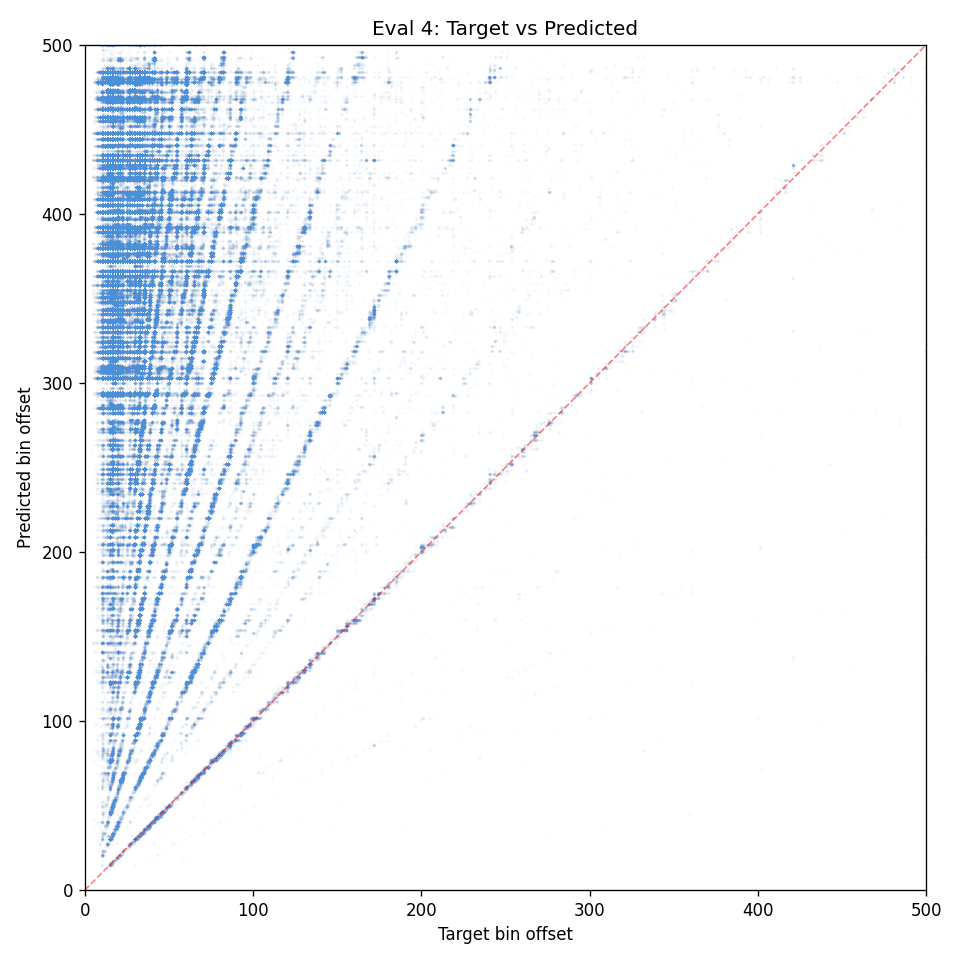
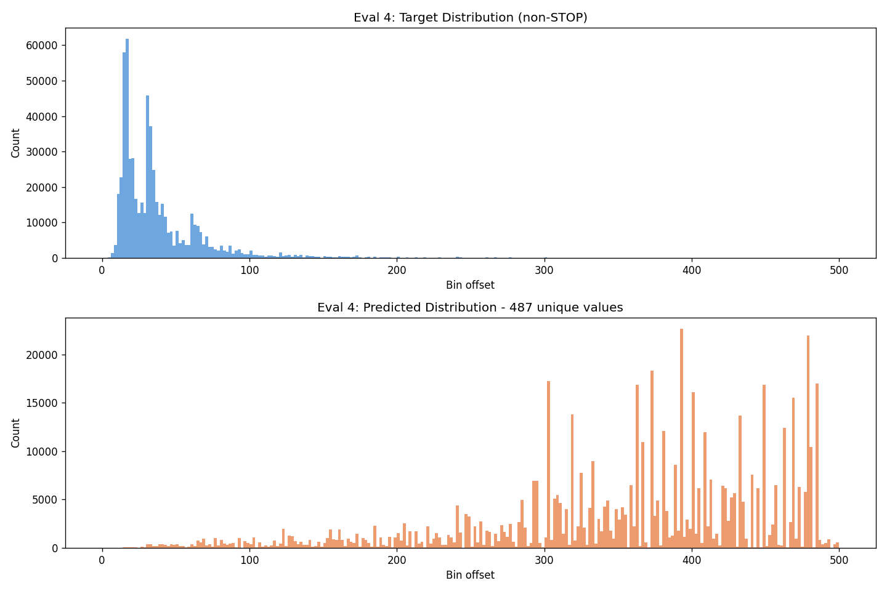

# Experiment 37-B - Sigmoid Multi-Target (pos_weight=1.0)

## Hypothesis

Exp 37 with pos_weight=5.0 caused massive overprediction (468 preds/window). The model activated everything to minimize positive-weighted loss. With focal γ=2 it predicted nothing.

**pos_weight=1.0** removes the explicit upweighting. The natural class imbalance (~16 positives in 500 bins) means the model will be biased toward predicting "no onset" at most bins — which is correct. The soft trapezoid targets still provide gradient at onset positions; the model just won't be pushed to activate aggressively.

### Changes from exp 37

- **pos_weight: 5.0 → 1.0**
- **focal_gamma: 0.0** (no focal)
- Everything else identical

### Launch

```bash
python detection_train.py taiko_v2 --run-name detect_experiment_37b --model-type unified --multi-target --sigmoid-loss --focal-gamma 0.0 --pos-weight 1.0 --epochs 50 --batch-size 48 --subsample 1 --evals-per-epoch 4 --workers 3
```

## Result

**Same overprediction as exp 37 — pos_weight isn't the issue, soft targets are.** Killed after eval 4.

| eval | epoch | HIT | Miss | eRecall | pPrec | F1 | Preds/win | Hall |
|------|-------|-----|------|---------|-------|----|-----------|------|
| 1 | 1.25 | 1.1% | 98.9% | 99.7% | 3.5% | 0.068 | 460 | 96.5% |
| 2 | 1.50 | 1.3% | 98.6% | 99.8% | 3.5% | 0.068 | 462 | 96.5% |
| 3 | 1.75 | 1.5% | 98.4% | 99.7% | 3.5% | 0.068 | 457 | 96.4% |
| 4 | 1.00 | 1.7% | 98.3% | 99.7% | 3.5% | 0.068 | 458 | 96.5% |

No improvement across 4 evals. The model activates ~460 of 500 bins regardless of pos_weight.

**Root cause: soft trapezoid targets + sigmoid BCE is fundamentally broken.** With ~16 onsets per window, each creating ~20-30 bins of partial positive labels, ~300 of 500 bins have nonzero targets. The sigmoid minimizes loss by predicting moderate activation everywhere (matching the partial positives) rather than learning sharp peaks.




## Lesson

- **pos_weight is not the problem** — same behavior at 5.0 and 1.0. The soft targets themselves cause over-activation.
- **BCE with soft targets doesn't incentivize sparsity** — the model can satisfy the loss by predicting ~0.3 everywhere, which after thresholding at 0.05 activates nearly everything.
- **Need a loss that optimizes set overlap, not per-bin error** — dice loss directly measures how well the predicted onset set matches the real onset set. Predicting everything gives low dice (huge denominator).
