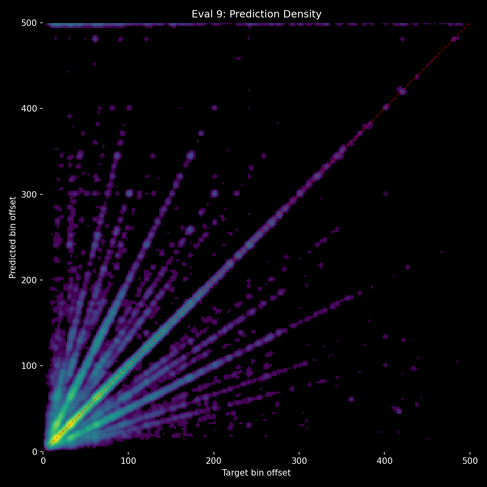
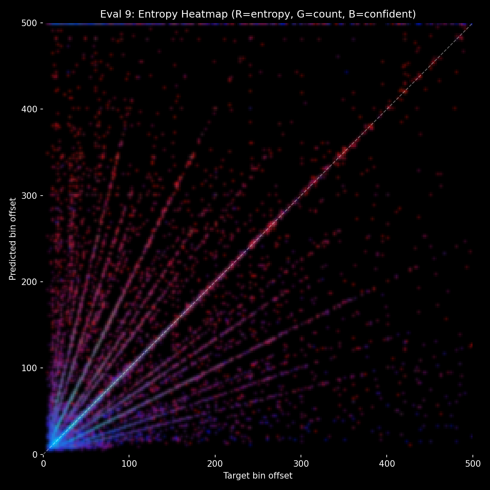
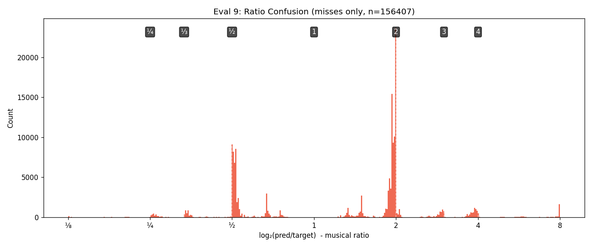

# Experiment 42 - Event Embedding Detector

> **[Full Architecture Specification](ARCHITECTURE.md)** — self-contained reproduction guide with all model, loss, training, and dataset details.


## Hypothesis

40+ experiments of context fusion have established:
- Separate gap tokens get drowned in self-attention (exp [25](../experiment_25/README.md)-[30](../experiment_30/README.md), delta collapses to ~1.5%)
- Cross-attention creates magnitude imbalance and banding (exp [31](../experiment_31/README.md)-[33](../experiment_33/README.md))
- FiLM can't encode sequences (exp [34](../experiment_34/README.md), 64-dim bottleneck)
- Mel ramps work (exp [35-C](../experiment_35c/README.md), 5% delta, 71.6% HIT) but are synthetic signals the model processes differently from audio
- Context helps confidence (r=-0.213, exp [41](../experiment_41/README.md)) — more context = lower entropy
- Skip-1 errors are structural (~11%, exp [41-B](../experiment_41b/README.md)) — model picks sharper transient at further onset

**Event embedding detector** takes the core insight from mel ramps (context in the audio pathway) but implements it properly: instead of synthetic ramps in the mel spectrogram, add **learned embeddings directly to audio tokens** at event positions.

After the conv stem produces 250 audio tokens, each token corresponding to a past event position gets an enriched embedding:
- **Event presence** — learned vector marking "there's a mapped onset here"
- **Gap before** — sinusoidal encoding of the gap from the previous event
- **Gap after** — sinusoidal encoding of the gap to the next event (except the most recent event, where this would reveal the target)

These three are projected through an MLP and added to the audio token. The self-attention then processes 250 tokens — some are pure audio, some are audio + event context. No separate tokens, no cross-attention, no synthetic mel signals.

### Why this should work

- **Same pathway as audio** — event info enriches existing tokens, processed by the same attention layers
- **Not drowned** — no competing token set. Event embeddings modify existing tokens, not compete with them
- **Sequential** — events are at their actual temporal positions (unlike FiLM's single vector)
- **Learned** — the model discovers what "event here" means in its own representation space
- **Gap encoding** — directly tells the model "the rhythm has been 75, 75, 150" through gap_before/gap_after
- **Not bypassable** — embeddings are added to token features, no skip connection to route around

### Architecture

```
mel (80, 1000) → Conv stem → 250 tokens (d_model=384)
                                    ↓
              Add event embeddings at past event token positions:
                event_proj(presence + gap_before_emb + gap_after_emb)
                                    ↓
              Self-attention (8 layers, FiLM conditioning)
                                    ↓
              Cursor at token 125 → output head → 501 logits
```

16.1M params. No GapEncoder, no mel ramps, no separate context tokens.

### Launch

```bash
python detection_train.py taiko_v2 --run-name detect_experiment_42 --model-type event_embed --epochs 50 --batch-size 48 --subsample 1 --evals-per-epoch 4 --workers 3
```

## Result

**New all-time high (73.2% HIT) with deepest context dependency ever. But entropy profile unchanged — improvements come from easy cases, not hard cases.** Killed after eval 9.

| eval | epoch | HIT | Miss | Score | Val loss | Frame err | no_events | Ctx Δ |
|------|-------|-----|------|-------|----------|-----------|-----------|-------|
| 1 | 1.25 | 69.3% | 30.2% | 0.336 | 2.641 | 12.0 | 47.1% | 2.0% |
| 2 | 1.50 | 71.8% | 27.8% | 0.363 | 2.534 | 11.7 | 49.1% | 3.5% |
| 3 | 1.75 | 71.8% | 27.9% | 0.361 | 2.526 | 11.6 | 49.8% | 2.9% |
| 4 | 1.00 | 72.3% | 27.4% | 0.368 | 2.511 | 10.9 | 49.5% | 3.4% |
| 5 | 2.25 | 72.0% | 27.6% | 0.363 | 2.523 | 11.8 | 48.5% | 4.3% |
| 6 | 2.50 | 71.6% | 28.0% | 0.359 | 2.527 | 11.7 | 48.4% | 5.0% |
| 7 | 2.75 | 72.7% | 27.0% | 0.371 | 2.504 | 11.1 | 50.1% | 3.7% |
| 8 | 2.00 | 72.9% | 26.8% | 0.374 | 2.497 | 10.9 | 50.9% | 2.9% |
| **9** | **3.25** | **73.2%** | **26.4%** | **0.379** | **2.481** | **11.0** | 50.5% | **3.8%** |

**Comparison with prior bests:**

| | Exp [14](../experiment_14/README.md) | Exp [27](../experiment_27/README.md) | Exp [35-C](../experiment_35c/README.md) | **Exp 42** |
|---|---|---|---|---|
| HIT | 68.9% | 69.8% | 71.6% | **73.2%** |
| Miss | 30.3% | 29.8% | 27.9% | **26.4%** |
| Score | 0.337 | 0.343 | 0.361 | **0.379** |
| Val loss | ~2.65 | 2.560 | 2.533 | **2.481** |
| Context mechanism | Cross-attn (ignored) | Gap tokens (ignored) | Mel ramps (5% Δ) | **Event embeds (3.8% Δ)** |
| Metronome benchmark | 50.5% | 50.5% | 44.1% | **25.4%** |

**What worked:**
- **Event embeddings provide deepest context dependency ever.** Metronome benchmark at 25.4% (vs 50.5% when context is ignored). The model genuinely relies on correct event information.
- **Context delta showed unique trajectory** — rose from 2.0% to 5.0% over evals 1-6 (never seen before — usually collapses), then settled at 3-4%. The model built context pathways during training.
- **no_audio at 39.3%** — event embeddings alone provide substantial signal, vs 0.4% in exp [27](../experiment_27/README.md).
- **Still improving at kill** — val loss 2.481 still dropping, HIT trending up.

**What didn't work:**
- **Entropy profile identical to [35-C](../experiment_35c/README.md).** Mean entropy 2.390 vs 2.391 — no change. The model gets more answers right at the same confidence level.
- **Skip-1 rate unchanged at ~11%.** Event embeddings didn't help with the overprediction skip problem. Gap encoding (gap_before, gap_after) isn't being used for pattern disambiguation.
- **Improvements come from easy cases only:** Skip-0 HIT [93.7%](../experiment_41/README.md) → 94.5%, underpred HIT [46.5%](../experiment_41/README.md) → 47.6%. The hard cases (skip-1, distant predictions) are unchanged.
- **The 2.0x ratio error band persists.** Same distribution of errors, just fewer of them overall.

**Benchmark analysis (eval 8):**

| Benchmark | Exp [27](../experiment_27/README.md) | Exp [35-C](../experiment_35c/README.md) | **Exp 42** |
|---|---|---|---|
| no_events | 50.0% | 48.1% | 50.9% |
| random_events | 50.5% | 41.1% | **39.6%** |
| metronome | 50.5% | 44.1% | **25.4%** |
| time_shifted | 50.5% | 42.1% | **36.9%** |
| no_audio | 0.4% | 7.9% | **39.3%** |

Wrong context severely hurts (metronome -25pp from no_events). The model is context-dependent but also context-fragile — a concern for AR inference where errors cascade.

## Graphs





## Lesson

- **Event embeddings are the best context mechanism so far** — deepest dependency (metronome 25.4%), highest HIT (73.2%), learned embeddings in the model's own representation space.
- **Context helps the easy cases, not the hard cases.** Skip-0 accuracy improves, but skip-1 rate and entropy profile are unchanged. The model uses context for density/timing calibration but not for pattern disambiguation.
- **The entropy-distance problem is in the LOSS FUNCTION, not the architecture.** Proportional soft targets (good_pct=3%) create wider target distributions for distant predictions, training the model to be less confident there. The model faithfully reproduces what the loss asks for.
- **AR fragility is a real concern.** Metronome at 25.4% means wrong context is catastrophic. Event augmentation (jitter, dropout) needed before production use.
- **Next: sharpen the loss.** Increase hard_alpha or reduce soft target width to train more confident predictions at all distances.
