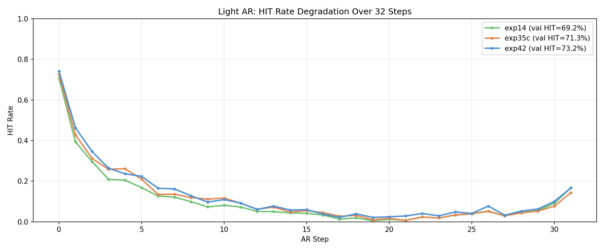
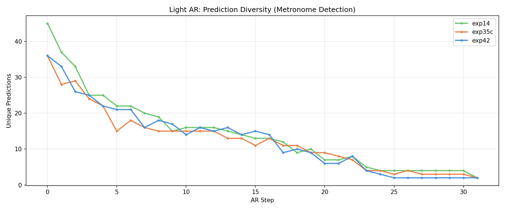
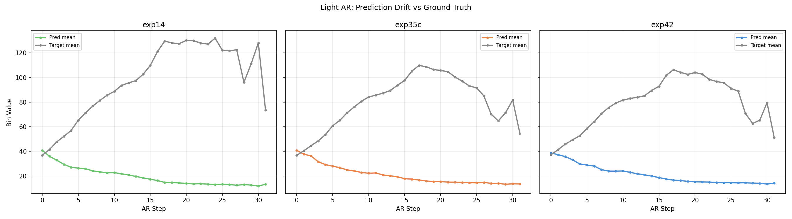

# Experiment 43-B - AR Resilience Comparison (Diagnostic)

> **[Full Architecture Specification](ARCHITECTURE.md)** — self-contained reproduction guide with all model, loss, training, and dataset details.

## Hypothesis

Exp [42-AR](../experiment_42ar/README.md) human evaluation showed context-dependent models ([42](../experiment_42/README.md), [35-C](../experiment_35c/README.md)) don't outperform context-free ([14](../experiment_14/README.md)) in real AR generation despite higher per-sample HIT. The AR cascade degradation (75% → 5% over 8 steps in light AR) may explain this.

**Compare AR resilience across models:**
- **Exp [14](../experiment_14/README.md)** (68.9% HIT, no context) — expected most resilient, no context to corrupt
- **Exp [35-C](../experiment_35c/README.md)** (71.6% HIT, mel ramps) — medium context dependency
- **Exp [42](../experiment_42/README.md)** (73.2% HIT, event embeddings) — deepest context dependency, expected least resilient

### Metrics tracked
- Light AR: per-step HIT rate curve (cascade degradation)
- Light AR: unique predictions per step (metronome detection)
- Light AR: pred mean/std/range over steps (drift detection)
- Full AR: event HIT/MISS, pred HIT/hallucination, density ratio
- Ablation: metronome and no_events benchmarks for reference

## Result

**Surprise: exp [42](../experiment_42/README.md) (deepest context) is the MOST AR-resilient, not the least.** 1000 samples, 32 steps each.

### Light AR HIT curve (cascade degradation)

| Step | exp14 | exp35c | exp42 |
|------|-------|--------|-------|
| 0 | 70.7% | 72.6% | **74.2%** |
| 1 | 39.4% | 42.8% | **46.3%** |
| 3 | 20.9% | 25.9% | **26.4%** |
| 5 | 16.8% | 21.0% | **22.4%** |
| 8 | 9.9% | 11.9% | **12.8%** |
| 15 | 4.2% | 5.5% | **6.0%** |

**Exp [42](../experiment_42/README.md) beats exp [14](../experiment_14/README.md) at every single step.** Context dependency doesn't hurt AR resilience — it helps.

### AR set matching

| Metric | exp14 | exp35c | exp42 |
|--------|-------|--------|-------|
| Val HIT (single) | 69.2% | 71.3% | **73.2%** |
| AR event HIT | 32.0% | 31.1% | **33.9%** |
| AR event MISS | 6.0% | 6.3% | **5.5%** |
| AR hallucination | 52.1% | 51.8% | **51.5%** |
| Density ratio | 1.35x | 1.28x | **1.26x** |

Exp [42](../experiment_42/README.md) has the best set matching too — highest event HIT (33.9%), lowest miss (5.5%), lowest hallucination (51.5%), and closest density ratio to target (1.26x vs 1.35x for [exp14](../experiment_14/README.md)).

### Metronome collapse (unique predictions)

| Step | exp14 | exp35c | exp42 |
|------|-------|--------|-------|
| 0 | 45 | 36 | 36 |
| 5 | 22 | 15 | 21 |
| 10 | 16 | 15 | 14 |

All three models collapse to ~15 unique values by step 10. The metronome behavior is universal — not specific to context-dependent models.

## Lesson

- **Context dependency HELPS AR resilience, not hurts.** Exp [42](../experiment_42/README.md) degrades slower at every step than exp [14](../experiment_14/README.md). Having event embedding context — even corrupted from AR errors — provides a stabilizing signal that pure audio lacks.
- **The [human evaluation](../experiment_42ar/README.md) preference for exp [14](../experiment_14/README.md) is NOT about AR resilience.** The per-step accuracy data shows exp [42](../experiment_42/README.md) is strictly better. The preference must be about output style/consistency ([exp 14](../experiment_14/README.md) is more conservative, less adventurous with patterns, which humans may perceive as "safer").
- **Metronome collapse is universal.** All models converge to ~15 unique predictions by step 10. This is a fundamental property of the autoregressive architecture, not a context issue.
- **The ~52% hallucination rate is consistent across models.** All three predict ~2x too many onsets. The density ratio confirms this: 1.26-1.35x overproduction.
- **Exp [35-C](../experiment_35c/README.md) sits in the middle on everything** — medium context dependency, medium resilience, medium collapse rate. Confirms the context-resilience correlation is monotonic.
