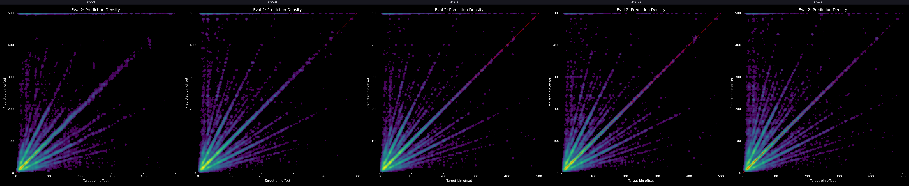
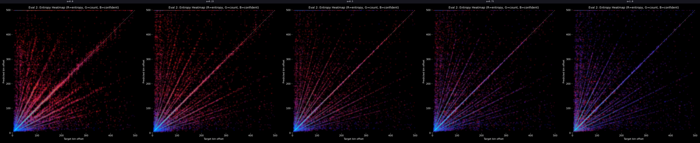
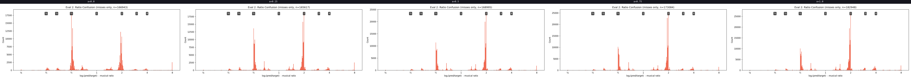
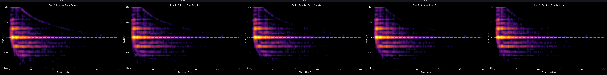
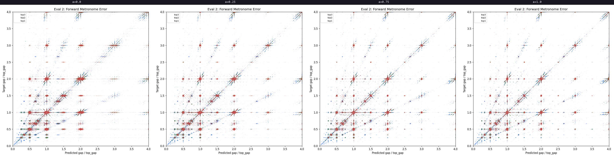
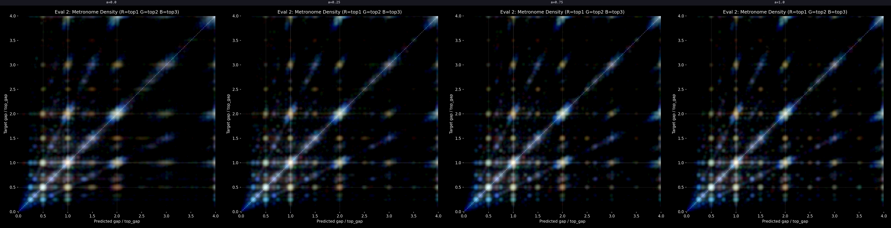

# Experiment 46 - Hard/Soft Loss Ratio Sweep

> **[Full Architecture Specification](ARCHITECTURE.md)** — self-contained reproduction guide with all model, loss, training, and dataset details.


## Hypothesis

Exp 44 uses hard_alpha=0.5 (50% hard CE + 50% soft targets). Exp 42-B tested hard_alpha=1.0 but only ran 2 evals before being killed — not enough to draw conclusions. The exact-match vs ±1-frame gap is ~19pp, meaning soft targets provide significant gradient signal for near-miss predictions.

**Question:** What is the optimal hard/soft ratio? Soft targets help learning (gradient for near-misses) but may also contribute to metronome behavior by making continuation predictions "close enough." Hard CE forces precision but may be too harsh early in training.

### Sub-experiments

All identical to exp 44 (EventEmbeddingDetector, gentle augmentation, subsample 1) with two changes adopted from exp 45:
- ±2% density jitter @10% (better AR density adherence)
- Gap ratio features enabled (default on from now)

Only variable is hard_alpha:

| Exp | hard_alpha | Soft weight | Hard weight | Description |
|---|---|---|---|---|
| **46-A** | 0.0 | 100% | 0% | Pure soft targets |
| **46-B** | 0.25 | 75% | 25% | Mostly soft |
| **46-C** | 0.75 | 25% | 75% | Mostly hard |
| **46-D** | 1.0 | 0% | 100% | Pure hard CE |

Exp 44 (hard_alpha=0.5) serves as the baseline — no need to rerun.

All use frame_tolerance=2 (±10ms) and good_pct=0.03 (3%) for the soft target distribution.

### Launch

```bash
python detection_train.py taiko_v2 --run-name detect_experiment_46a --model-type event_embed --hard-alpha 0.0 --epochs 50 --batch-size 48 --subsample 1 --evals-per-epoch 4 --workers 3
python detection_train.py taiko_v2 --run-name detect_experiment_46b --model-type event_embed --hard-alpha 0.25 --epochs 50 --batch-size 48 --subsample 1 --evals-per-epoch 4 --workers 3
python detection_train.py taiko_v2 --run-name detect_experiment_46c --model-type event_embed --hard-alpha 0.75 --epochs 50 --batch-size 48 --subsample 1 --evals-per-epoch 4 --workers 3
python detection_train.py taiko_v2 --run-name detect_experiment_46d --model-type event_embed --hard-alpha 1.0 --epochs 50 --batch-size 48 --subsample 1 --evals-per-epoch 4 --workers 3
```

### Predictions

- **46-A (pure soft):** Higher HIT than exp 44 (soft targets directly optimize tolerance), but lower exact accuracy and possibly worse metronome behavior (more forgiving = easier to continue patterns).
- **46-B (0.25):** Slightly better HIT than exp 44, slight exact accuracy drop. Sweet spot candidate.
- **46-C (0.75):** Slightly lower HIT, better exact accuracy. Could help with metronome if sharper gradients force more decisive predictions at break points.
- **46-D (pure hard):** Similar to exp 42-B — lower HIT, higher precision. May recover if given enough training time (42-B only had 2 evals).

### Key metrics to watch

- Exact match vs HIT gap — does hard CE close the 19pp gap?
- Metronome benchmark — does sharper loss help break patterns?
- pred_continues_target_breaks — the 11.8% metronome failure rate from exp 44
- AR step1+ — does precision help or hurt cascade?

## Result

Each sub-experiment ran for 2 evals. Exp 44 (α=0.5) eval 2 used as same-stage baseline.

### Per-sample metrics at eval 2

| α | HIT | Exact | ±1f | AR s0 | AR s1 |
|---|---|---|---|---|---|
| 0.00 | 68.2% | 40.1% | 66.3% | 70.6% | 25.6% |
| **0.25** | **71.1%** | 49.1% | **70.4%** | 72.0% | **40.2%** |
| 0.50 | 70.9% | **52.0%** | 70.7% | **73.3%** | 40.3% |
| 0.75 | 70.2% | 50.9% | 70.0% | 69.4% | 38.5% |
| 1.00 | 68.6% | 50.8% | 68.5% | 67.7% | 39.6% |

### Benchmark deltas (accuracy drop from corruption, lower = more resilient)

| α | Met Δ | Adv Met Δ | No Evt Δ | Time Shift Δ | Rand Evt Δ | no_audio stop |
|---|---|---|---|---|---|---|
| 0.00 | +4.0pp | +3.4pp | +5.8pp | +10.8pp | +23.6pp | 66.1% |
| 0.25 | +4.5pp | +4.0pp | +5.9pp | +8.1pp | +16.5pp | 29.6% |
| 0.50 | +14.5pp | +6.5pp | +7.6pp | +9.3pp | +12.8pp | 16.5% |
| **0.75** | **+5.3pp** | **+2.7pp** | **+5.3pp** | **+4.7pp** | **+10.7pp** | 6.6% |
| 1.00 | +9.5pp | +4.7pp | +7.8pp | +7.9pp | +15.4pp | 10.5% |

### Visual comparison

Side-by-side graphs at eval 2 (α=0.0 | 0.25 | 0.5 | 0.75 | 1.0, left to right):








**Pred vs target heatmap:** Diagonal gets tighter with higher α but the same fundamental ray-band error structure persists across all settings. Hard alpha controls precision, not the error pattern.

**Entropy heatmap:** Entropy decreases monotonically with α. Pure soft (α=0.0) has high uncertainty everywhere; pure hard (α=1.0) is very confident. Whether low entropy is beneficial or harmful for AR is unclear.

**Metronome scatter/heatmap:** Effectively identical structure across all α values. The (1,1) continuation cluster dominates regardless. Lower α produces blurrier patches but the same metronome behavior.

**Prediction distribution:** Higher α causes the model to consistently over-predict more than it under-predicts. This directional bias is specifically bad for AR — over-predictions push the cursor too far forward and are unrecoverable, while under-predictions are self-correcting (the model gets another chance).

### Decision

Continuing with α=0.5 (exp 44 baseline). Neither direction offers a clear win:
- α=0.25 has best HIT and good resilience but blurrier/less precise
- α=0.75 has best corruption resilience but over-predicts and slightly lower HIT
- Neither changes the fundamental error structure (ray bands, metronome lock-in)

## Lesson

- **Hard alpha is a precision knob, not a behavior knob.** It controls sharpness of predictions but doesn't change what the model gets wrong. The same ray-band errors, same metronome structure, same musical-ratio confusions appear at every setting.
- **The extremes are clearly bad.** α=0.0 (pure soft) loses 12pp exact accuracy; α=1.0 (pure hard) loses ~2pp HIT. Both extremes underperform the middle range.
- **Higher α → over-prediction bias.** With pure hard CE, the model learns to overshoot. In AR this is worse than undershooting because over-predictions are unrecoverable (cursor can't go back), while under-predictions self-correct.
- **α=0.50 has the worst metronome delta** (+14.5pp) — worse than both 0.25 and 0.75. The current default is actually the most vulnerable to metronome corruption. This is worth revisiting if metronome resilience becomes the priority.
- **The under/over prediction asymmetry is not a loss-resolvable issue.** It's a fundamental consequence of the autoregressive cursor mechanism, not something hard_alpha can fix.
