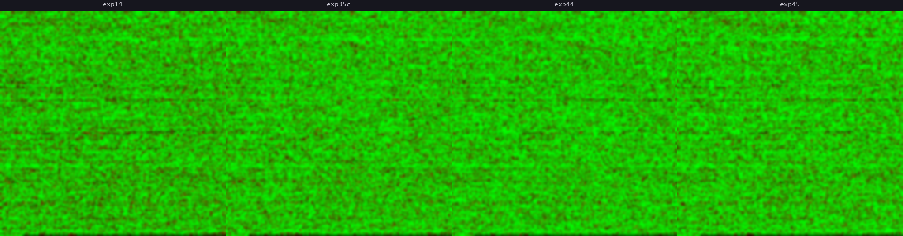
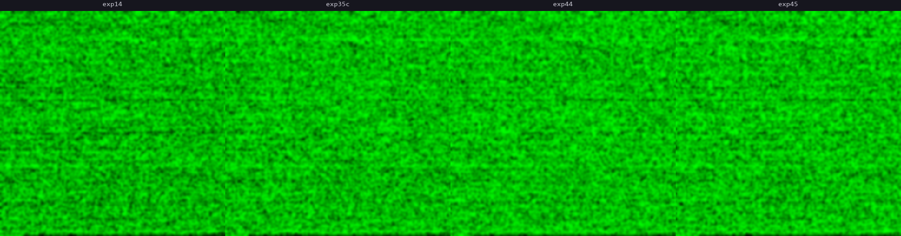
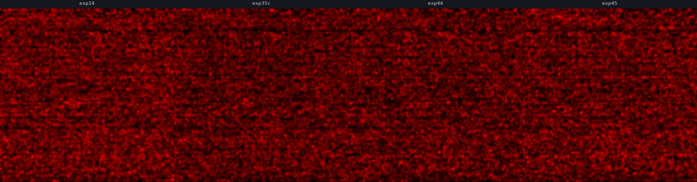

# Experiment 48 - Cross-Model Failure Analysis

## Hypothesis

All our models (exp 14, 35-C, 44, 45) achieve 68-74% HIT despite very different architectures (no context, mel ramps, event embeddings, gap ratios). If they all fail on the **same** validation samples, those failures are structural — inherent to the data, audio, or task — and no architecture change will fix them. If they fail on **different** samples, each architecture has unique blind spots that could be addressed.

### Method

Run each model on the full validation set (subsample 1). For each sample, record:
- Per-sample score [-1, +1]
- Predicted bin
- Whether it was a HIT/MISS

Then analyze:
1. **Success heatmaps** — 512x512 image per model, same sample ordering, visual comparison
2. **Overlap rates** — what % of failures are shared across all models vs model-specific?
3. **Agreement table** — for each pair of models, how often do they agree on HIT/MISS?
4. **Failure mode comparison** — when models fail on the same sample, do they predict the same wrong bin or different ones?
5. **Model-specific failures** — samples where one model fails but all others succeed. What characterizes these?

### Models

| Label | Experiment | HIT | Architecture |
|---|---|---|---|
| exp14 | Exp 14 | 68.9% | No context, audio-only |
| exp35c | Exp 35-C | 71.6% | Mel-embedded exponential ramps |
| exp44 | Exp 44 | 73.6% | Event embeddings, gentle augmentation |
| exp45 | Exp 45 | 71.9% | Event embeddings + gap ratios + tight density |

### Predictions

- **Most failures will be shared.** The same audio sections (ambiguous transients, polyrhythmic sections, quiet passages) will trip up every model.
- **Context models (44, 45) will have fewer unique failures** than no-context (14), since context resolves some ambiguity.
- **When models fail on the same sample, they'll predict similar wrong bins** — the "sharper transient at wrong position" pattern from exp 39-E.

### Scripts

- `analyze_val_heatmap.py` — runs a model on val set, produces 512x512 heatmap + raw scores .npy
- `analyze_cross_model.py` — loads multiple .npy score files, produces overlap/agreement/failure analysis

### Launch

```bash
python analyze_val_heatmap.py --checkpoint runs/detect_experiment_14/checkpoints/best.pt --label exp14
python analyze_val_heatmap.py --checkpoint runs/detect_experiment_35c/checkpoints/eval_008.pt --label exp35c
python analyze_val_heatmap.py --checkpoint runs/detect_experiment_44/checkpoints/eval_019.pt --label exp44
python analyze_val_heatmap.py --checkpoint runs/detect_experiment_45/checkpoints/best.pt --label exp45
python analyze_cross_model.py
```

## Result

### Per-model HIT rates (subsample 8 validation)

| Model | HIT | GOOD | MISS |
|---|---|---|---|
| exp14 | 69.1% | 0.5% | 30.4% |
| exp35c | 71.6% | 0.3% | 28.1% |
| exp44 | 73.5% | 0.4% | 26.1% |
| exp45 | 72.2% | 0.5% | 27.3% |

### Pairwise agreement (both HIT or both MISS on same sample)

|  | exp14 | exp35c | exp44 | exp45 |
|---|---|---|---|---|
| exp14 | — | 82.5% | 80.9% | 82.7% |
| exp35c | | — | 83.2% | 84.6% |
| exp44 | | | — | 84.7% |
| exp45 | | | | — |

Models agree 80-85% of the time — high but not total. ~15-20% of samples have model-specific outcomes.

### Failure overlap

- **All models HIT: 55.4%** (41,026 samples) — easy, every architecture gets these
- **All models MISS: 14.2%** (10,525 samples) — structurally unsolvable by any model we've built
- **Any model MISS: 44.0%** (32,582 samples)
- **Shared failure rate: 32.3%** — one-third of all failures are universal

### Model-specific unique failures

| Model | Unique failures | % of all |
|---|---|---|
| exp14 | 3,488 | 4.71% |
| exp35c | 2,102 | 2.84% |
| exp44 | 1,986 | 2.68% |
| exp45 | 1,647 | 2.22% |

exp14 (no context) has the most unique failures — context resolves ~2.5pp of failures that audio alone can't. But even the best context model (exp45) still has 2.2% unique failures.

### Shared failure analysis (10,525 samples where ALL models fail)

**They predict the same wrong bin:**
- 80-84% agreement on the wrong prediction (within 5% tolerance)
- exp44 vs exp45: 83.8% same wrong bin — nearly identical errors

**They fail in the same direction:**
- All models: 60% overshoot, 40% undershoot, mean error +8-10 bins
- Consistent across every architecture

**They fail at the same musical ratio:**
- **Median ratio: 1.89x** — across ALL four models, identical
- **42% of shared failures: 2x ratio** (predicting double the correct gap)
- **25% of shared failures: 0.5x ratio** (predicting half the correct gap)
- The octave/metric confusion is universal and architecture-independent

### Score correlation (Pearson r)

|  | exp14 | exp35c | exp44 | exp45 |
|---|---|---|---|---|
| exp14 | 1.000 | 0.596 | 0.556 | 0.603 |
| exp35c | | 1.000 | 0.592 | 0.638 |
| exp44 | | | 1.000 | 0.627 |
| exp45 | | | | 1.000 |

Moderate correlation (0.55-0.64). Models agree on easy/hard but have meaningful independence on medium-difficulty samples. Context models (exp44/45) correlate more with each other than with exp14.

### Visual comparisons





Animated GIFs cycling through models (2s per frame):
- [Full range](compare_full_animated.gif)
- [Good core](compare_good_animated.gif)
- [Bad core](compare_bad_animated.gif)

### Failure case video

[failures_exp44.mp4](failures_exp44.mp4) — 25 worst shared failures rendered with Griffin-Lim audio reconstruction, scrolling mel spectrogram, past events, and predicted (red) vs target (green) positions.

**Key observation from watching the video:** These are NOT difficult cases. The audio is clear, the patterns are ordinary, a human would identify the correct onset instantly. The model hears the rhythmic structure but picks the wrong level in the metric hierarchy — predicting the next measure instead of the next beat (2x), or the next sub-beat instead of the beat (0.5x).

## Lesson

- **14.2% of samples are structurally unsolvable** by any model we've built. These aren't edge cases — they're normal songs with clear patterns.
- **The 2x/0.5x error is the dominant universal failure mode.** Median error ratio 1.89x, consistent across every architecture. The model can't distinguish beat from sub-beat.
- **Context doesn't fix the metric hierarchy problem.** Even with deep context (exp44, 73.5% HIT), the model makes the same 2x error on the same samples as no-context (exp14, 69.1%). Context resolves ~2.5pp of unique failures but can't touch the shared 14%.
- **The model needs meter awareness.** A human resolves beat/sub-beat ambiguity by understanding musical meter ("this is 4/4 at 120 BPM"). The model has density conditioning but not metric structure. The 2.5s audio window + 2.5s of in-window events can't capture a full musical phrase (8s at 120 BPM).
- **This motivates the virtual token architecture.** With virtual tokens for out-of-window context, the model could see 25+ seconds of rhythm history and potentially infer the metric structure. The current 128-event context (25s of history) exists but is discarded because events can only be placed on in-window audio tokens.
