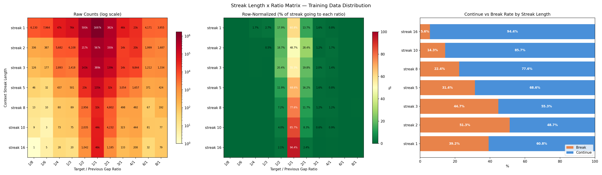

# Experiment 51 - Streak-Ratio Loss Weighting

> **[Full Architecture Specification](ARCHITECTURE.md)** — self-contained reproduction guide with all model, loss, training, and dataset details.


## Hypothesis

The model metronomically continues patterns because the training data overwhelmingly rewards continuation. From the streak-ratio matrix analysis:

### Training data distribution



**Continuation dominates at every streak length:**

| Streak | Continue (1/1) | Break (any other) | Continue rate |
|---|---|---|---|
| 1 | 1,697,473 | 1,095,901 | 60.8% |
| 2 | 566,605 | 596,697 | 48.7% |
| 3 | 388,832 | 314,523 | 55.3% |
| 5 | 134,904 | 61,688 | 68.6% |
| 8 | 31,918 | 9,199 | 77.6% |
| 10 | 43,895 | 7,352 | 85.7% |
| 16 | 45,859 | 2,733 | 94.4% |

**The key cells the model almost never sees:**
- Streak 8 + ratio 2/1 (double-time break): 0.10% of data (~5K samples in 5M)
- Streak 8 + ratio 1/2 (half-time break): 0.06%
- Streak 16 + any break: 0.02-0.04%

**The cells that dominate:**
- Streak 1 + ratio 1/1: 34% of all data
- Streak 2 + ratio 1/1: 11.3%

The model is right to continue because continuation IS correct most of the time. But breaking at the right moment is what makes good charts — and the model barely sees those moments.

### Approach

**Per-sample loss weighting based on streak-ratio cell frequency.** Instead of changing the sampler (which changes what the model sees), we change how much the model cares about each error.

For each training sample:
1. Compute the context streak length and target/gap ratio
2. Look up the cell count in the precomputed matrix
3. Weight the loss: `weight = min(cap, (max_count / cell_count) ^ power)`

With power=0.3 and cap=50:

| Cell | Count | Weight |
|---|---|---|
| streak 1, ratio 1/1 | 1,697,473 | 1.0x |
| streak 2, ratio 1/2 | ~217K | ~3x |
| streak 5, ratio 2/1 | ~32K | ~6x |
| streak 8, ratio 2/1 | ~5K | ~18x |
| streak 16, ratio 2/1 | ~1K | ~40x |
| edge cases (<100) | capped | 50x |

Getting a streak-16 break wrong costs 40x more than getting a streak-1 continuation wrong.

### Key principles
- Model still sees the **natural distribution** — it knows continuation is common
- But the **gradient from rare breaks is amplified** to match their importance
- Works alongside existing balanced sampler (they stack)
- Cap at 50x prevents tiny edge bins from exploding gradients

### Predictions
- **Per-sample metrics will likely be worse.** The model is penalized more for rare-cell errors, diverting capacity from the common cells that drive HIT rate.
- **AR generation might be much better.** The model should break patterns more willingly, reducing metronome behavior.
- **Metronome benchmark should improve significantly.** The model learns to distrust long streaks.

### Architecture
Same as exp [45](../experiment_45/README.md) (EventEmbeddingDetector, gap ratios, tight density jitter). Only change is the per-sample loss multiplier.

### Launch

```bash
python detection_train.py taiko_v2 --run-name detect_experiment_51 --model-type event_embed --streak-loss --streak-power 0.3 --streak-cap 50 --epochs 50 --batch-size 48 --subsample 1 --evals-per-epoch 4 --workers 3
```

## Result

**Stopped at eval 9. Per-sample metrics significantly worse. AR not better enough to justify the cost.**

### Progression

| Metric | Eval 1 | Eval 4 | Eval 9 | Exp [45](../experiment_45/README.md) eval 8 | Exp [44](../experiment_44/README.md) ATH |
|---|---|---|---|---|---|
| HIT | 60.5% | 65.2% | 67.5% | [71.9%](../experiment_45/README.md) | [**73.6%**](../experiment_44/README.md) |
| MISS | 38.8% | 34.3% | 32.0% | [27.5%](../experiment_45/README.md) | [**25.9%**](../experiment_44/README.md) |
| Exact | 43.5% | 47.8% | 49.6% | — | 54.7% |
| Ctx delta | 2.7pp | 4.2pp | 4.5pp | 7.6pp | 5.6pp |
| AR step0 | 65.1% | 66.9% | 63.3% | 73.5% | 76.7% |
| AR step1 | 38.2% | 39.2% | 37.8% | 43.0% | 48.2% |
| Metronome | 46.4% | 43.0% | 47.2% | 44.8% | 42.9% |
| Adv metronome | 44.3% | 45.6% | 48.6% | 49.7% | 50.1% |
| Time shifted | 42.2% | 41.4% | 44.6% | — | 47.3% |

HIT at 67.5% — 6.1pp below exp [44](../experiment_44/README.md) ATH and 4.4pp below exp [45](../experiment_45/README.md) at the same eval. The streak-ratio loss weighting successfully diverted model capacity from common continuations to rare breaks, but the cost to overall accuracy was too high. AR metrics didn't improve enough to compensate — step0 at 63.3% is lower than every previous experiment.

Metronome resilience at 47.2% is good but not dramatically better than [exp 50](../experiment_50/README.md) (46.9% at eval 12) which achieved it without sacrificing HIT.

## Lesson

- **Streak-ratio loss weighting hurts accuracy more than it helps AR.** A 6pp HIT loss is too much — the model spent too much capacity on rare cells (0.02-0.10% of data) that don't contribute to overall quality.
- **The cap and power weren't enough to prevent over-correction.** Even with power=0.3 and cap=50, the rare-cell boost dominated the loss landscape too much for the common cases that drive HIT.
- **Metronome resilience is better achieved through anti-entropy (exp [50](../experiment_50/README.md)) or virtual tokens (exp [49](../experiment_49/README.md)).** Both got similar metronome scores without sacrificing HIT.
- **Exp [45](../experiment_45/README.md) remains the best overall model.** Best balance of HIT, resilience, and AR quality across all experiments.
- **The streak-ratio data itself is valuable.** The matrix revealed the training distribution imbalance clearly. Future approaches might use it more subtly — e.g., curriculum learning where streak-break examples are gradually introduced, or targeted augmentation that creates synthetic break samples.
