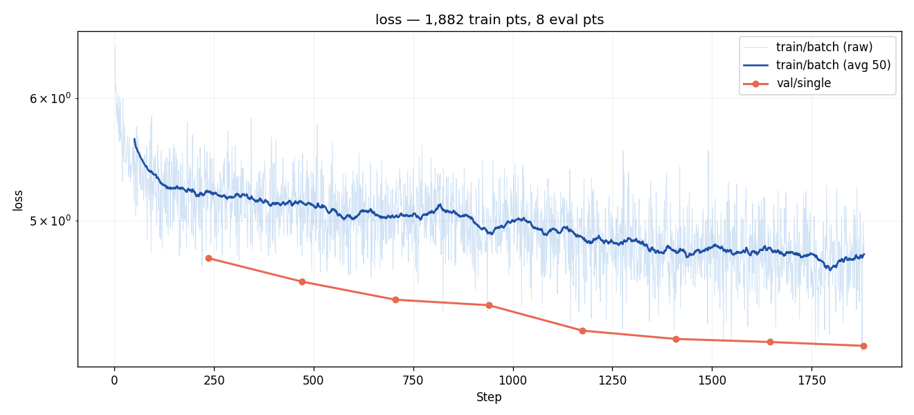
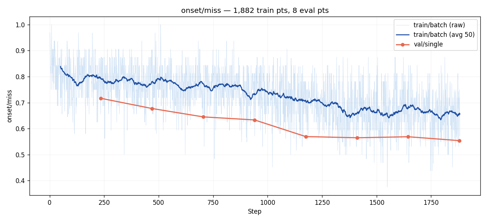
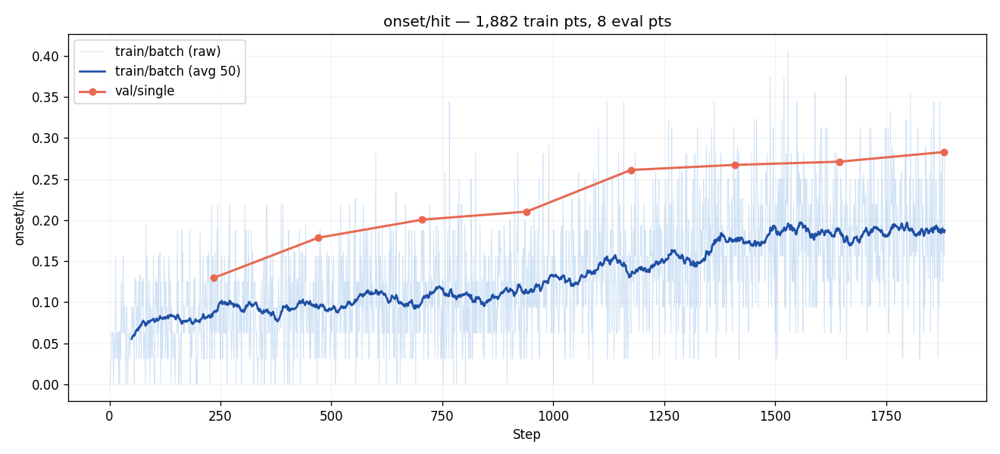
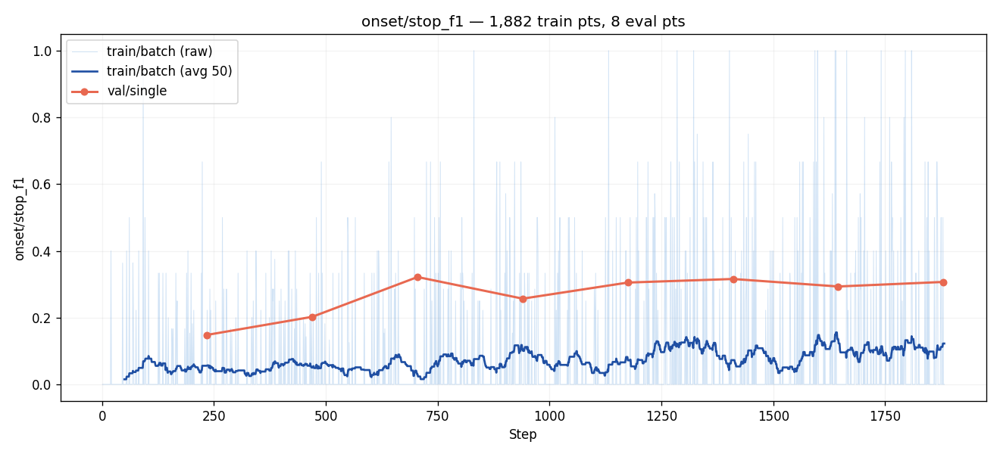
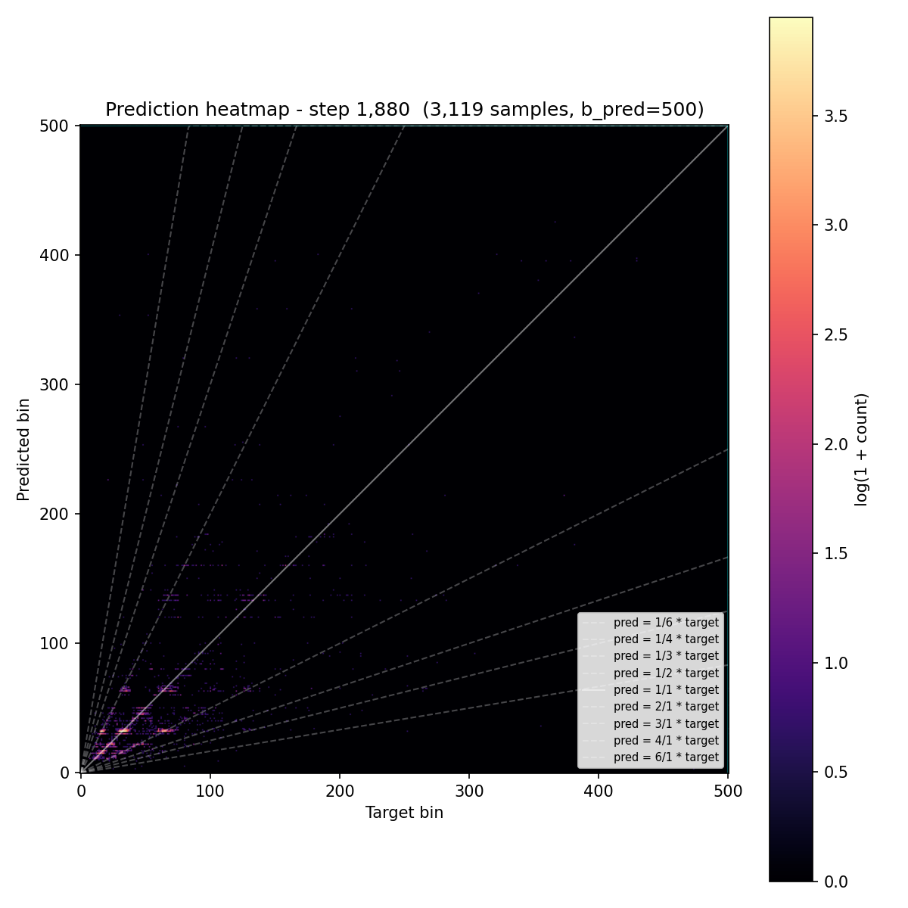
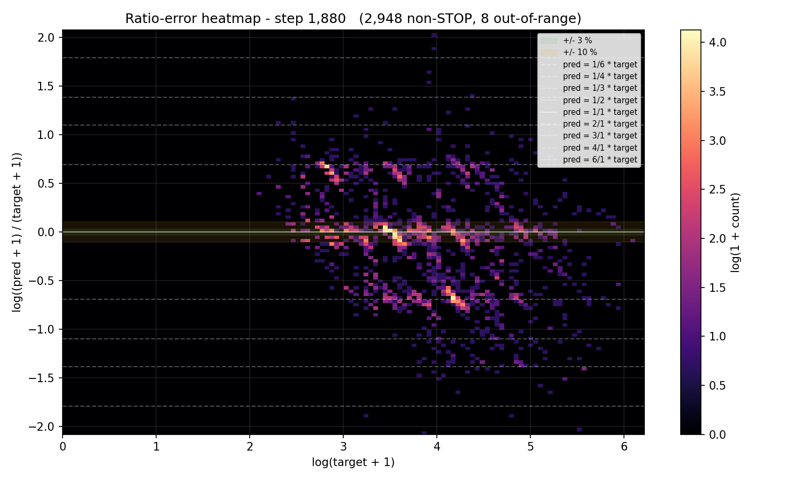
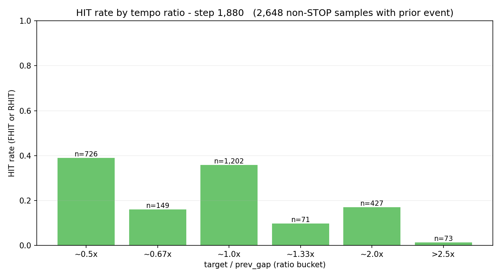
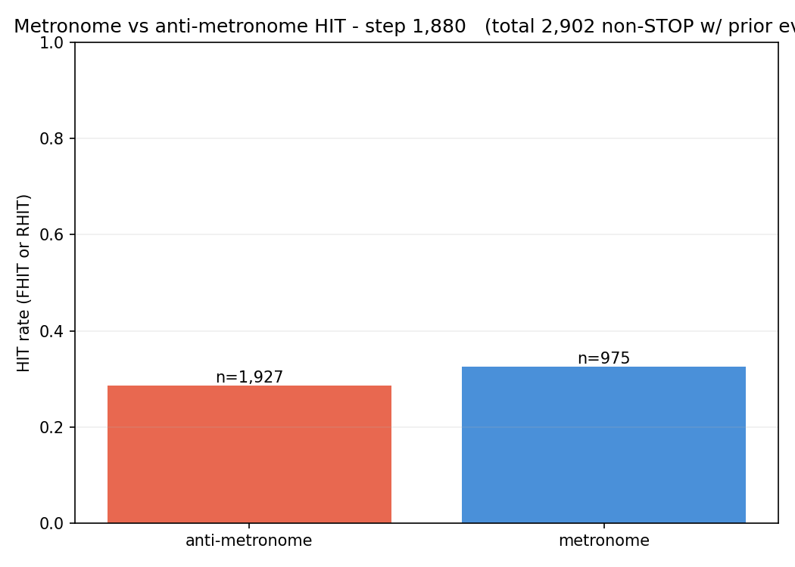
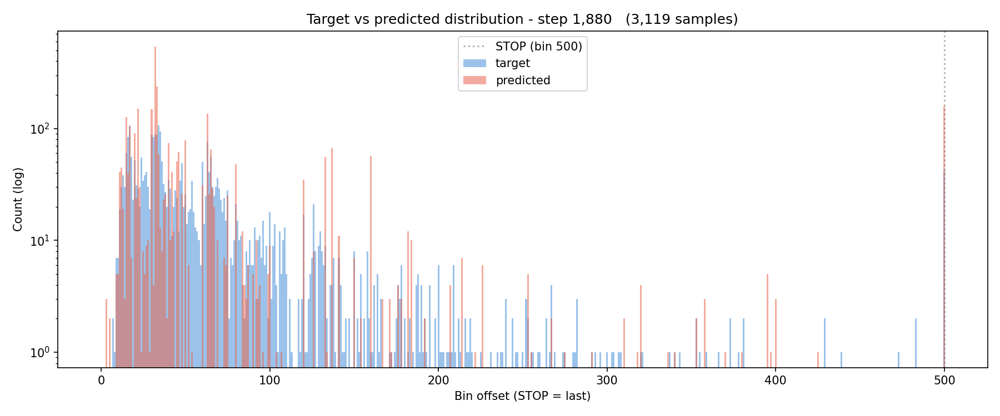
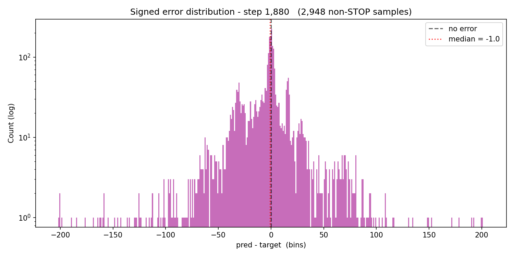

# Experiment 001 — exp 45 port, subsample-16 smoke test

## Status

`Complete`

> *Amendment (post-run): between writing the pre-run doc and running,
> the metric key `onset/bad` was renamed to `onset/miss` for consistency
> with `fmiss` / `rmiss`. Every "bad" reference in the pre-run sections
> below refers to what is now called `miss`. The watched trainer metric
> was re-pointed accordingly; semantics unchanged.*

## Context

First experiment against the taiko2 framework. Ports the architecture
and training recipe from taiko1's exp 45 (event-embedding detector +
trapezoid-soft-target loss + 13-aug set + class-balanced sampling)
and runs it on 1/16th of the `taiko2_v1` training set. The goal is
**not** to reproduce exp 45's HIT numbers — the goal is to **prove
the plumbing works end-to-end** before committing GPU-hours to a full
50-epoch run.

## Citations

- Baseline architecture & recipe: [taiko1 exp 45](../../../taiko/experiments/experiment_45/)
- Taiko1 exp 44 (prior ATH that exp 45 forked from): [taiko1 exp 44](../../../taiko/experiments/experiment_44/)
- Taiko2 infra it exercises: this run is the first end-to-end user of
  `training/loop.py`, `training/augmentations.py`,
  `training/metrics_onset.py`, `training/artifacts.py`,
  `persistence/checkpoint.py` — all under `osu/taiko2/`.

---

## Hypothesis

### Claim

If we train exp 45's ported architecture + loss + augmentation set on
a subsample-16 slice of `taiko2_v1` for 2 epochs, we'll see
`val/single/onset/bad` drop below **1.0** and `val/single/onset/good`
rise above **0.05** by the final eval — proving gradients flow,
metrics compute, checkpoints write, and the model is learning
something non-trivial despite the data cut.

### Mechanism

Subsample-16 on ~388 k overlap-filtered train samples leaves ~24 k.
At batch 32 that's ~760 steps/epoch; two epochs ≈ 1520 steps.
Trapezoid-soft-target loss plus ±2-frame floor means even a
marginally-informed model lands *some* predictions inside the
frame-tolerance window. The 50/50 hard/soft mix keeps optimization
well-behaved from step 1. The only way this run doesn't drop below
100 % miss is if something is wired wrong.

### Predicted numbers

| Metric | Current | Predicted | Notes |
|---|---:|---:|---|
| val/single/onset/bad | — | ≤ 0.95 by eval 8 | must drop from 1.0 |
| val/single/onset/good | — | ≥ 0.05 by eval 8 | nice-to-have |
| val/single/loss | — | ≤ 4.0 by eval 8 | trapezoid CE baseline |
| (all metrics) no NaN / Inf | — | true | pipeline integrity |

## Success criteria

- **Must have:** `val/single/onset/bad < 1.0` at any point during training.
- **Must have:** loss goes down monotonically (allowing small eval-to-eval wobble) and never NaNs.
- **Must have:** all four eval artifacts write to `runs/{run}/eval_{step}/` on every eval.
- **Must have:** `metrics.jsonl` contains lines for `step`, `eval`, and `train_end` events.
- **Nice-to-have:** `val/single/onset/good >= 0.05` at final eval.
- **Nice-to-have:** `val/single/onset/hit >= 0.02`.
- **Fails if:** any of the must-haves miss, or training crashes.

Passing the must-haves means the pipeline is correct; the nice-to-haves
are about whether 1/16 of the data is enough signal for exp 45 to
learn meaningfully in 2 epochs — an honest question, not a framework
bug.

## Changes from baseline

Baseline: [taiko1 exp 45](../../../taiko/experiments/experiment_45/).

Differences, all intentional for a **smoke run** (not for
reproduction):

- `data.subsample: 16` (taiko1 exp 45 used 1 = full dataset).
- `trainer.epochs: 2` (taiko1: 50).
- `trainer.batch_size: 32` (taiko1: 48 — smaller so a 12 GB card handles d_model=384 comfortably even under AMP-off).
- `trainer.evals_per_epoch: 4` (same as taiko1).
- `data.min_cursor_bin: 0` (taiko1: 6000 — turned off so even short charts contribute; with subsample-16 we want every sample we can get for the smoke).
- Dataset: `taiko2_v1` (10 048 charts, audio sr=22 000 / hop=110 → 5.000 ms/frame, 200 bins/s — the taiko2 defaults; matches exp 45's bin rate to within rounding).
- Audio and event augs match exp 45 exactly: `build_exp45_post_augs()` from `training/augmentations.py`.

Everything else (architecture: d_model=384 / 8 layers / gap_ratios;
loss: hard_alpha=0.5 / good_pct=0.03 / fail_pct=0.20 / stop_weight=1.5;
class-balanced sampling with `power=0.5`; AdamW 3e-4 / wd 0.01 /
CosineAnnealingLR / grad_clip 1.0) is identical to taiko1 exp 45.

## Run config

- Run name: `exp_001_exp45_smoke`.
- Config snapshots: [`config/`](./config/).
- Dataset: `taiko2_v1`, splits `train` / `val` (90 / 10, seed 42, song-grouped).
- Command:
  ```bash
  osu/taiko2/.venv/Scripts/python.exe -m osu.taiko2.cli.train \
      --run-name exp_001_exp45_smoke \
      --config-dir osu/taiko2/experiments/001-exp45-smoke/config \
      --dataset taiko2_v1
  ```

─────────────────────────────────────────────────────────────────────
<!-- Everything below written after the run. Do not pre-populate. -->
─────────────────────────────────────────────────────────────────────

## Results summary

### Final vs baseline

No prior taiko2 baseline — this run is the first. Columns compare
eval 1 (step 235) to final (eval 8, step 1880) to show how much was
learned in 8 evals across the subsample-16 cut.

| Metric | Eval 1 (step 235) | Final (step 1880) | Δ | Direction |
|---|---:|---:|---:|:---:|
| val/single/onset/miss            | 0.7166  | 0.5538 | −16.3 pp | ↓ good |
| val/single/onset/good            | 0.2834  | 0.4462 | +16.3 pp | ↑ good |
| val/single/onset/hit             | 0.1297  | 0.2827 | +15.3 pp | ↑ good |
| val/single/onset/exact           | 0.0263  | 0.0734 | +4.7 pp  | ↑ good |
| val/single/loss                  | 4.7278  | 4.1491 | −0.5787  | ↓ good |
| val/single/onset/stop_f1         | 0.1483  | 0.3069 | +15.9 pp | ↑ good |
| val/single/onset/frame_err_mean  | 23.5    | 21.5   | −2.0 bins | ↓ good |

Final eval: step **1880**, wall time **≈5 min** from first train step,
epochs **2**, total samples visited ≈ 60 k.

### Per-eval progression

Source: `runs/exp_001_exp45_smoke/metrics.jsonl`. All values namespaced
under `val/single/` unless noted; STOP-class and I-variant columns
omitted here for width but present in `metrics.json`.

| Eval | Step | loss | miss | hit | good | exact | fhit | rhit | stop_f1 | frame_err_mean | pred_stop_rate | train_loss_win | wall (s) |
|---:|---:|---:|---:|---:|---:|---:|---:|---:|---:|---:|---:|---:|---:|
| 1 |  235 | 4.7278 | 0.7166 | 0.1297 | 0.2834 | 0.0263 | 0.1261 | 0.0504 | 0.1483 | 23.5 | 0.1040 | 5.3426 |  37 |
| 2 |  470 | 4.5655 | 0.6773 | 0.1784 | 0.3227 | 0.0400 | 0.1778 | 0.0803 | 0.2025 | 21.1 | 0.0786 | 5.1515 |  74 |
| 3 |  705 | 4.4440 | 0.6451 | 0.2005 | 0.3549 | 0.0484 | 0.1973 | 0.1072 | 0.3217 | 23.3 | 0.0253 | 5.0490 | 112 |
| 4 |  940 | 4.4075 | 0.6334 | 0.2103 | 0.3666 | 0.0507 | 0.2080 | 0.1066 | 0.2569 | 22.2 | 0.0481 | 5.0221 | 150 |
| 5 | 1175 | 4.2439 | 0.5694 | 0.2610 | 0.4306 | 0.0578 | 0.2587 | 0.1219 | 0.3051 | 22.2 | 0.0351 | 4.9399 | 188 |
| 6 | 1410 | 4.1916 | 0.5648 | 0.2671 | 0.4352 | 0.0640 | 0.2632 | 0.1397 | 0.3158 | 22.0 | 0.0383 | 4.8150 | 225 |
| 7 | 1645 | 4.1728 | 0.5687 | 0.2710 | 0.4313 | 0.0663 | 0.2639 | 0.1271 | 0.2933 | 21.3 | 0.0487 | 4.7832 | 263 |
| 8 | 1880 | 4.1491 | 0.5538 | 0.2827 | 0.4462 | 0.0734 | 0.2759 | 0.1355 | 0.3069 | 21.5 | 0.0419 | 4.7278 | 301 |

`train_loss_win` = mean `train/batch/loss` across all steps between the
previous eval and this one.

Machine-readable copy: [`metrics.json`](./metrics.json).

## Visualizations


*Training loss over steps, log-y. Train loss (~4.7 avg by eval 8)
sits above val loss (4.15) because val is un-augmented — not an
overfit signal. Smooth monotonic decay, no plateau yet.*


*Watched val metric `onset/miss` across evals — dropped 0.72 → 0.55.
Monotonic.*


*`onset/hit` rose 0.13 → 0.28 across the 8 evals. Still rising — the
run was not at plateau when it ended.*


*STOP-class F1 — recall stays high (~0.7), precision sits low (~0.19),
so the model over-predicts STOP by roughly 4×. A follow-up sweep on
`stop_weight` would tighten this.*


*Prediction heatmap at eval 8 with rhythmic ratio guides overlaid.
Main diagonal dominant. At short targets (≲100 bins) the secondary
mass sits above the diagonal — model over-predicts gap length there.
No strong secondary ratio band at this eval.*


*Ratio-error heatmap. Central ridge sits inside the ±10 % R-GOOD band.
Secondary ridges at y ≈ ±log 2 (= ±0.69) visible — the classic
doubling / halving error mode. Faint ridges at ±log 3 too.*


*HIT rate bucketed by `target / prev_gap`. Clean zigzag: simple integer
ratios (0.5×, 1.0×, 2.0×) score 0.17–0.39; awkward ones (0.67×, 1.33×,
>2.5×) score 0.01–0.16. Model has learned tempo continuation and
octave jumps, not triplets / polyrhythms.*


*Metronome vs anti-metronome HIT — 0.33 vs 0.29. Only a 4 pp gap,
so the model is **not** trivially copying the previous gap. This was
the headline failure mode feared for trapezoid-soft-target loss;
that fear is not realized.*


*Target and predicted bin-offset histograms. Predicted mass clustered
at low bin offsets (short gaps); STOP over-predicted visibly (last
bin, far right).*


*Signed `(pred − target)` histogram on non-STOP pairs. Slight positive
bias (median +1, model over-predicts by a hair); long right tail.*

## Vs prediction

- `val/single/onset/miss` (was `bad`): predicted ≤ 0.95 → actual **0.5538** → **beat**
- `val/single/onset/good`: predicted ≥ 0.05 → actual **0.4462** → **beat**
- `val/single/loss`: predicted ≤ 4.0 → actual **4.1491** → **miss (by 0.15)**
- No NaN/Inf; `metrics.jsonl` has `step`, `eval`, `train_end`; all four
  pre-existing artifacts + the four new ones wrote on every eval →
  **match**.

**Summary.** All must-haves passed. Pipeline is correct, the model
learns, the framework is sound. Loss prediction was slightly off — 4.15
vs predicted ≤ 4.0 — because subsample-16 tightened the data budget
more than the pre-run arithmetic anticipated; the model is clearly
still descending, so a full-data run resolves it automatically. Hit
and good smashed their nice-to-haves (0.28 vs 0.02, 0.45 vs 0.05).

## Takeaways

- **Framework works end-to-end.** Augmented train loader, trapezoid
  loss, class-balanced sampler, AdamW + cosine, atomic checkpoints,
  per-eval JSON + curves + artifacts all produced expected files every
  eval. No NaNs, no crashes.
- **Train-loss > val-loss is the aug cost, not overfit.** Because
  augmentations only apply to train, the usual overfit diagnosis
  (val > train) inverts. Future experiments should not use the raw
  gap as a stopping signal — use the validation metric directly.
- **STOP is over-predicted by ~4×.** F1 0.31 from recall 0.74 +
  precision 0.19. A `stop_weight` sweep in a follow-up is cheap and
  would likely push composite HIT up.
- **Model is not trivially metronomic.** The metronome / anti-
  metronome gap is only 4 pp at eval 8. The trapezoid + class-
  balanced sampler combination does not collapse to "copy prev gap".
- **Dominant remaining error is polyrhythms.** The ratio-hit zigzag
  and the ±log 2 / ±log 3 ridges on the ratio-error heatmap both point
  at the same thing: simple integer ratios work, triplets / sextuplets
  don't yet. Easy to watch across longer runs.
- **Unexpected: frame-error p90 (55 bins) barely moved across 8 evals
  while p50 dropped 5 → 3.** The middle of the error distribution
  tightens quickly; the tail does not. Long-tailed errors are a
  separate phenomenon from typical-case quality and may need
  dedicated handling.

## Followup questions

- Does HIT continue rising monotonically through 50 epochs on full
  data, or does it plateau well short of taiko1 exp 45's 71.9 %? —
  **#002** (full recreation, answer directly).
- Would `stop_weight` ∈ {0.5, 1.0, 1.5, 2.0} shift the precision /
  recall tradeoff enough to raise composite HIT by more than noise? —
  small sweep experiment after #002 establishes the baseline.
- Why does p90 frame error stay flat while median tightens? Long-tail
  errors might need a dedicated loss term or a per-bucket curriculum. —
  analysis pass on #002 outputs, then a targeted experiment if the
  phenomenon persists.
- Can the model learn triplets if we oversample charts with many
  `~0.67x` / `~1.33x` ratios? — data-mix experiment gated on #002
  showing the same zigzag on full data.
