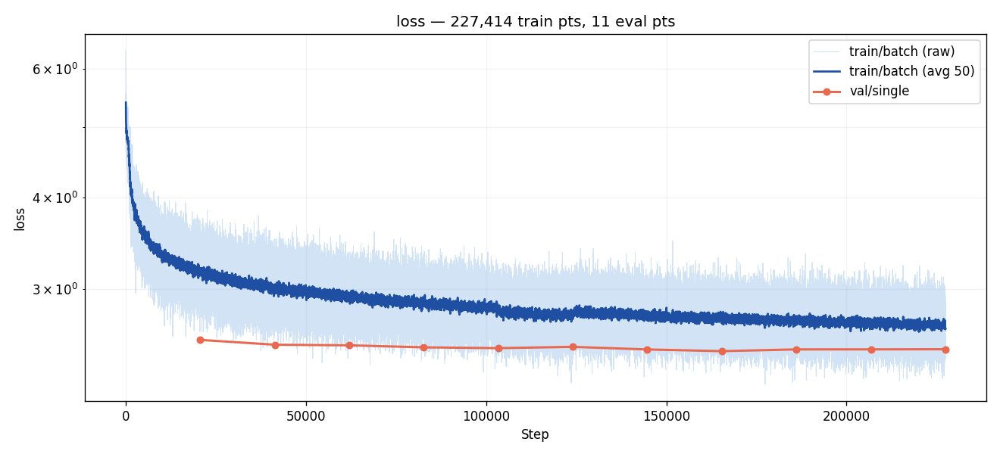

# Experiment 002 — exp 45 full recreation, full dataset

## Status

`Planned`

## Context

With the pipeline validated in [#001](../001-exp45-smoke/) (miss 0.72
→ 0.55 and hit 0.13 → 0.28 in 2 epochs on 1/16 of the data, no NaNs,
all artifacts wrote cleanly), the next step is a **full recreation**
of the baseline: taiko1's exp 45 recipe — same architecture, same
loss, same augmentation set, same class-balanced sampling — retrained
from scratch in the taiko2 framework on the entire `taiko2_v1`
training set for 50 epochs. The point is to establish a taiko2-native
reference number later experiments fork from, and to confirm the port
reproduces taiko1 exp 45's headline metrics (HIT ≈ 71.9 % @ eval 8,
MISS ≈ 27.5 % @ eval 8, per the taiko1 result table).

## Citations

- Baseline recipe: [taiko1 exp 45](../../../taiko/experiments/experiment_45/) —
  full 50-epoch run, batch 48, subsample 1. HIT 71.9 % / MISS 27.5 %
  at eval 8.
- Supersedes (for "was it wired right"): [#001](../001-exp45-smoke/) —
  subsample-16 smoke test. Demonstrated the framework works; this run
  demonstrates it reproduces the numbers.
- Related taiko1 precedent: [taiko1 exp 44](../../../taiko/experiments/experiment_44/) —
  the all-time-high baseline exp 45 forked from. HIT 72.5 % @ eval 8
  / 73.6 % @ eval 19 ATH.

---

## Hypothesis

### Claim

If we run taiko1 exp 45's recipe on the full `taiko2_v1` training set
for 50 epochs at batch 64, the ported model will land **within 1.5 pp
of HIT** and **within 1.5 pp of MISS** of taiko1 exp 45 at eval 8
(HIT 71.9 % / MISS 27.5 %), because the architecture, loss math,
augmentation set, sampler weighting and optimizer schedule were
ported tensor-for-tensor from the taiko1 code and #001 showed all of
these components produce sane gradients and artifacts.

### Mechanism

`taiko2_v1` is the same source material taiko1 used, filtered and
packaged with the same rules. Model weights are fresh, but the
training signal each sample carries is equivalent: same audio window,
same 128 past events, same trapezoid target, same density
conditioning, same 13 augmentations. Batch 64 vs 48 (1.33×) pushes
steps/epoch down by the same factor; the cosine schedule reacts to
total step count, so the effective LR schedule stretches
proportionally. Nothing downstream of the loss differs. If the port
is correct, final numbers should match within normal run-to-run
noise (≈ 1 pp from seed alone).

### Predicted numbers

Targets are taiko1 exp 45's numbers @ eval 8 (its reported final),
with symmetric tolerance bands:

| Metric | Baseline (taiko1 exp 45 @ eval 8) | Predicted (this run @ eval 8) | Notes |
|---|---:|---:|---|
| val/single/onset/hit   | 71.9 %  | 70.4–73.4 %     | primary match criterion |
| val/single/onset/miss  | 27.5 %  | 26.0–29.0 %     | watched metric |
| val/single/onset/good  | (not reported separately) | ≥ 0.60 | trapezoid R-GOOD baseline |
| val/single/loss        | (not reported) | 2.6–3.2 | trapezoid CE in the stable regime |
| val/single/onset/exact | (not reported) | ≥ 0.25  | headroom over #001's 0.07 |
| pred_stop_rate         | (not reported) | ≤ 0.05  | #001 finished at 0.042 |

Nothing to expect from the ratio-hit / metronome artifacts yet —
those were added after taiko1 exp 45 ran, so there is no prior
reference. Both are observational for this run.

## Success criteria

- **Must have:** final `val/single/onset/hit` within ±1.5 pp of taiko1
  exp 45 @ eval 8 (70.4–73.4 %).
- **Must have:** final `val/single/onset/miss` within ±1.5 pp of
  taiko1 exp 45 @ eval 8 (26.0–29.0 %).
- **Must have:** training runs to completion (50 epochs, no NaN / Inf,
  no OOM, checkpoint lands at `best.pt` + `latest.pt` + every
  `eval_{step}/checkpoint.pt`).
- **Must have:** all eight per-eval artifacts (heatmap, distributions,
  ratio_error, error_hist, ratio_hit, metronome, and the STOP / frame-
  error derived curves) + all 21 curves write every eval.
- **Nice-to-have:** final HIT beats taiko1 exp 45 (+0 pp is fine; the
  point is the port, not improvements).
- **Nice-to-have:** polyrhythm ratio buckets (~0.67×, ~1.33×) show
  visible improvement over #001 — the full data should help them.
- **Fails if:** final HIT below 68 % → port is wrong somewhere; bail
  and diagnose before running more experiments on top of this baseline.
- **Fails if:** training crashes on any eval boundary → infra bug,
  must be fixed before trusting any result.

## Changes from baseline

Baseline: [#001](../001-exp45-smoke/) for the smoke run,
[taiko1 exp 45](../../../taiko/experiments/experiment_45/) for the
numerical reference.

Differences from #001 (smoke-test → full reference):

- `config/data.json — subsample: 16 → 1` (full dataset).
- `config/data.json — batch_size: 32 → 64`.
- `config/data.json — min_cursor_bin: 0 → 6000` (taiko1 default; not
  needed at subsample-16, but standard at full data because early-
  song samples are mostly silent).
- `config/data.json — allowed_overlap_forward: <default 500> → 0`
  and `allowed_overlap_back: <default 500> → 0`. The taiko1 sampler
  had no overlap-filtering logic at all — every event cursor was a
  training sample. Setting both to 0 reproduces that behavior. Sample
  count rises by roughly an order of magnitude vs the overlap-filtered
  regime #001 used, which is intentional for a full recreation.
- `config/trainer.json — batch_size: 32 → 64`.
- `config/trainer.json — epochs: 2 → 50`.
- `config/adapter.json`, `config/model.json`, `config/loss.json`
  unchanged from #001.

Differences from taiko1 exp 45 (the numerical reference):

- `trainer.batch_size: 48 → 64`. Larger batch to shorten wall time on
  the target GPU; same optimizer / schedule otherwise so the
  effective schedule stretches with step count. Known risk: very
  different batch sizes shift AdamW's effective LR subtly, but
  1.33× is small enough that it should not exceed seed noise.
- Framework: taiko2 (`training/loop.py`, `training/losses.py`,
  `training/augmentations.py`, `training/metrics_onset.py`) replacing
  taiko1's `detection_train.py` + `datasets/detection.py`. Every unit
  has a taiko2 test; #001 proves end-to-end pipeline-correctness but
  not numerical equivalence — which is what this run establishes.

## Run config

- Run name: `exp_002_exp45_full`.
- Config snapshots: [`config/`](./config/).
- Dataset: `taiko2_v1`, splits `train` / `val` (90 / 10, seed 42,
  song-grouped).
- Command:
  ```bash
  osu/taiko2/.venv/Scripts/python.exe -m osu.taiko2.cli.train \
      --run-name exp_002_exp45_full \
      --config-dir osu/taiko2/experiments/002-exp45-full/config \
      --dataset taiko2_v1 \
      --device cuda
  ```

─────────────────────────────────────────────────────────────────────
<!-- Everything below written after the run. Do not pre-populate. -->
─────────────────────────────────────────────────────────────────────

## Results summary

### Final vs baseline

| Metric | Baseline (taiko1 exp 45 @ eval 8) | This run (final) | Δ | Direction |
|---|---:|---:|---:|:---:|
| val/single/onset/hit   | 71.9 % | — | — | — |
| val/single/onset/miss  | 27.5 % | — | — | — |
| val/single/onset/good  | —      | — | — | — |
| val/single/loss        | —      | — | — | — |

Final eval: step `—`, wall time `—`, epochs `—`.

### Per-eval progression

{Generated from `runs/exp_002_exp45_full/metrics.jsonl` after the
run.}

| Eval | Step | loss | miss | hit | good | exact | fhit | rhit | stop_f1 | frame_err_mean | pred_stop_rate | wall (s) |
|---:|---:|---:|---:|---:|---:|---:|---:|---:|---:|---:|---:|---:|
|   |  |  |  |  |  |  |  |  |  |  |  |  |

Machine-readable copy: [`metrics.json`](./metrics.json).

## Visualizations


*Training loss over steps (log-y).*


*`onset/miss` across evals.*

{Add custom graphs post-run — see #001 for the eight per-eval and
twenty-one curve PNGs the trainer produces automatically.}

## Vs prediction

- `val/single/onset/hit`: predicted 70.4–73.4 % → actual `—` → **—**
- `val/single/onset/miss`: predicted 26.0–29.0 % → actual `—` → **—**
- `val/single/onset/good`: predicted ≥ 0.60 → actual `—` → **—**
- `val/single/loss`: predicted 2.6–3.2 → actual `—` → **—**
- `val/single/onset/exact`: predicted ≥ 0.25 → actual `—` → **—**
- `pred_stop_rate`: predicted ≤ 0.05 → actual `—` → **—**

## Takeaways

- {One concrete sentence.}

## Followup questions

- {Question.} — {suggested next experiment}
