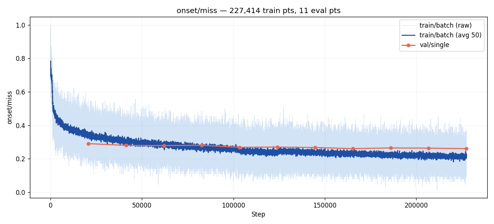
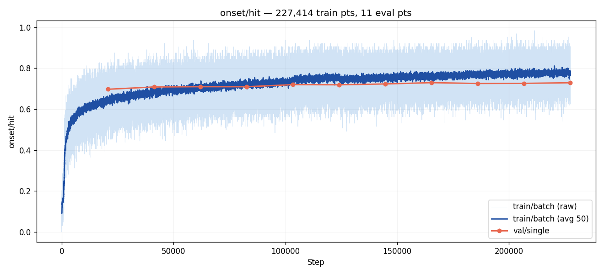
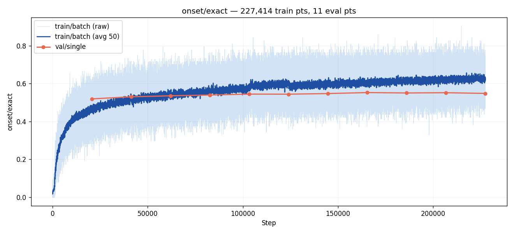
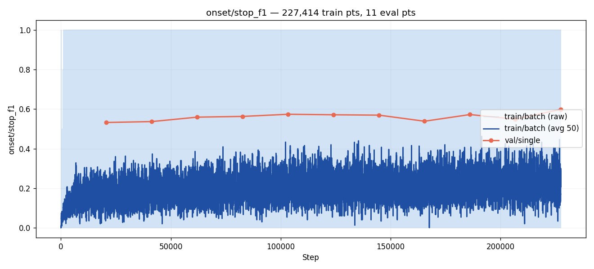
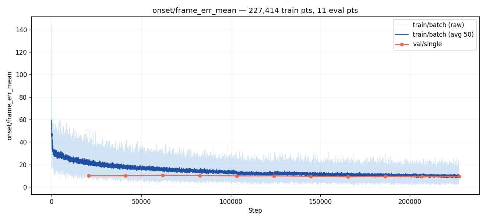
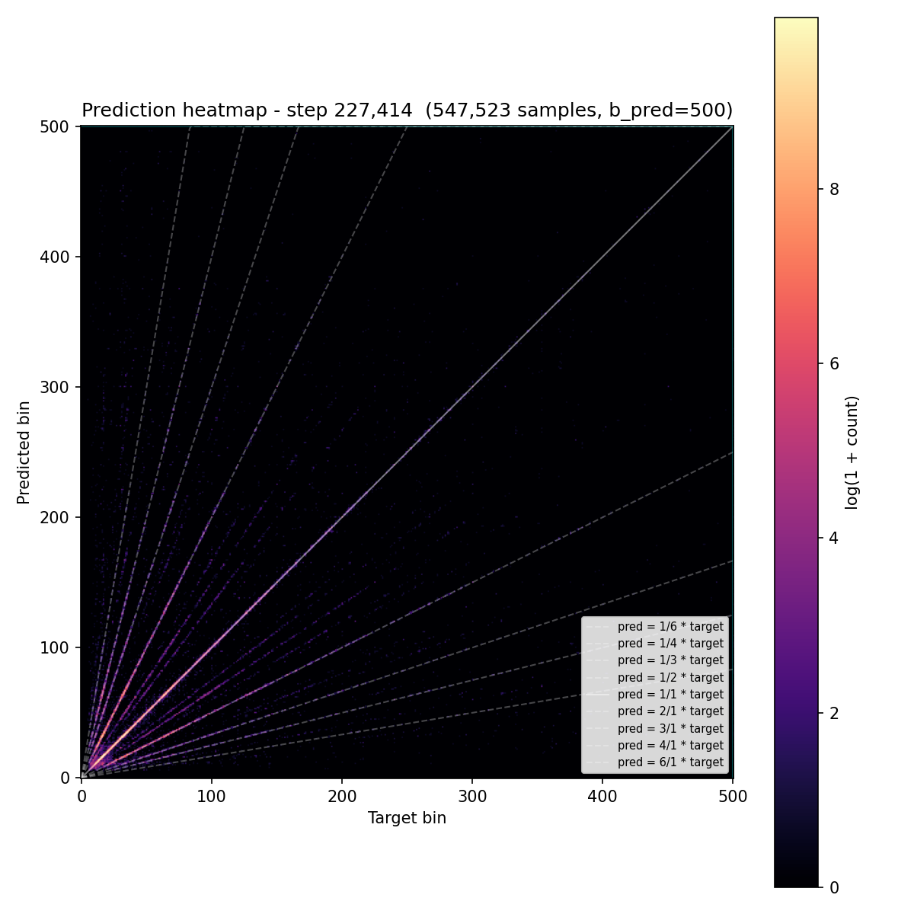
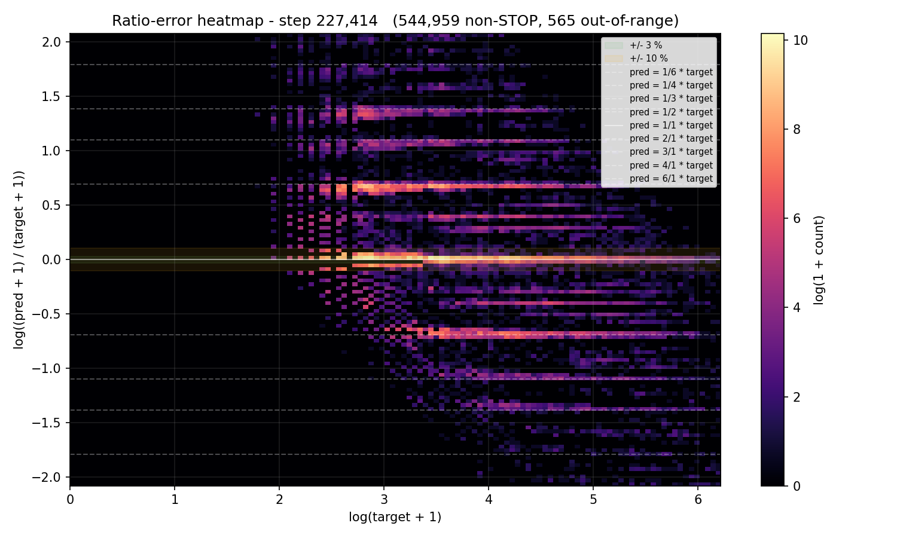
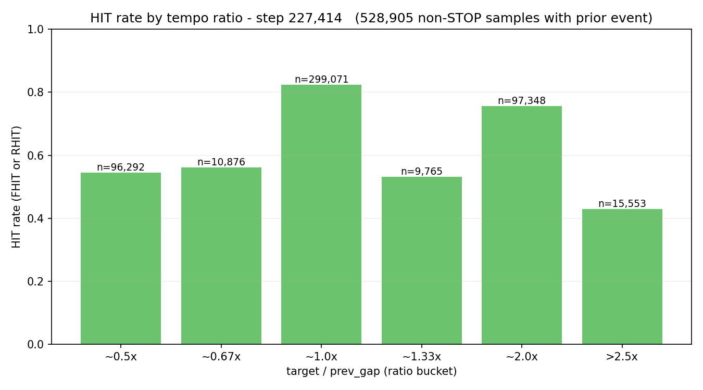
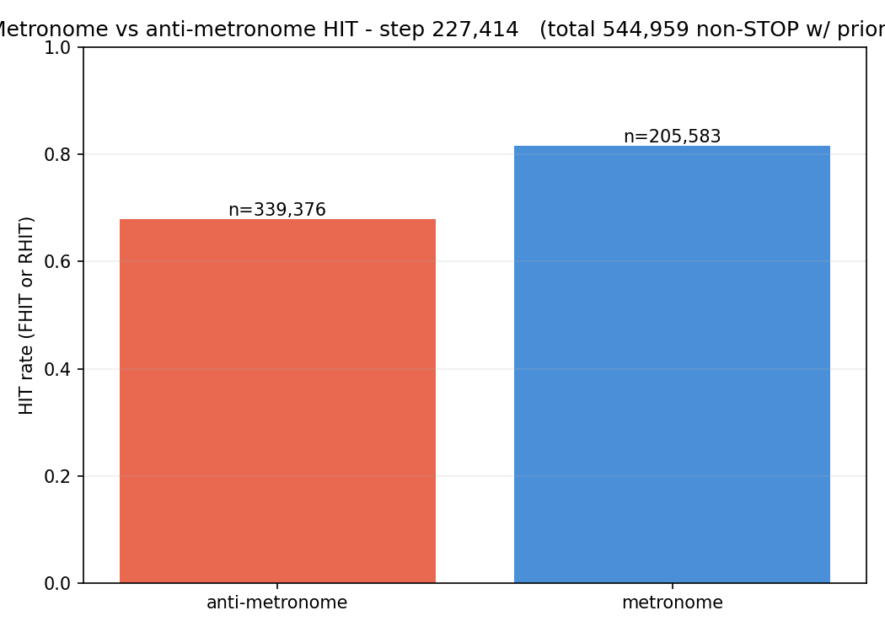

# Experiment 002 — exp 45 full recreation, full dataset

## Status

`Complete` (stopped at eval 11 — see Takeaways)

## Context

With the pipeline validated in [#001](../001-exp45-smoke/) (miss 0.72
→ 0.55 and hit 0.13 → 0.28 in 2 epochs on 1/16 of the data, no NaNs,
all artifacts wrote cleanly), the next step is a **full recreation**
of the baseline: taiko1's exp 45 recipe — same architecture, same
loss, same augmentation set, same class-balanced sampling — retrained
from scratch in the taiko2 framework on the entire `taiko2_v1`
training set for 50 epochs. The point is to establish a taiko2-native
reference number later experiments fork from, and to confirm the port
reproduces taiko1 exp 45's headline metrics (HIT ≈ 71.9 % @ eval 8,
MISS ≈ 27.5 % @ eval 8, per the taiko1 result table).

## Citations

- Baseline recipe: [taiko1 exp 45](../../../taiko/experiments/experiment_45/) —
  full 50-epoch run, batch 48, subsample 1. HIT 71.9 % / MISS 27.5 %
  at eval 8.
- Supersedes (for "was it wired right"): [#001](../001-exp45-smoke/) —
  subsample-16 smoke test. Demonstrated the framework works; this run
  demonstrates it reproduces the numbers.
- Related taiko1 precedent: [taiko1 exp 44](../../../taiko/experiments/experiment_44/) —
  the all-time-high baseline exp 45 forked from. HIT 72.5 % @ eval 8
  / 73.6 % @ eval 19 ATH.

---

## Hypothesis

### Claim

If we run taiko1 exp 45's recipe on the full `taiko2_v1` training set
for 50 epochs at batch 64, the ported model will land **within 1.5 pp
of HIT** and **within 1.5 pp of MISS** of taiko1 exp 45 at eval 8
(HIT 71.9 % / MISS 27.5 %), because the architecture, loss math,
augmentation set, sampler weighting and optimizer schedule were
ported tensor-for-tensor from the taiko1 code and #001 showed all of
these components produce sane gradients and artifacts.

### Mechanism

`taiko2_v1` is the same source material taiko1 used, filtered and
packaged with the same rules. Model weights are fresh, but the
training signal each sample carries is equivalent: same audio window,
same 128 past events, same trapezoid target, same density
conditioning, same 13 augmentations. Batch 64 vs 48 (1.33×) pushes
steps/epoch down by the same factor; the cosine schedule reacts to
total step count, so the effective LR schedule stretches
proportionally. Nothing downstream of the loss differs. If the port
is correct, final numbers should match within normal run-to-run
noise (≈ 1 pp from seed alone).

### Predicted numbers

Targets are taiko1 exp 45's numbers @ eval 8 (its reported final),
with symmetric tolerance bands:

| Metric | Baseline (taiko1 exp 45 @ eval 8) | Predicted (this run @ eval 8) | Notes |
|---|---:|---:|---|
| val/single/onset/hit   | 71.9 %  | 70.4–73.4 %     | primary match criterion |
| val/single/onset/miss  | 27.5 %  | 26.0–29.0 %     | watched metric |
| val/single/onset/good  | (not reported separately) | ≥ 0.60 | trapezoid R-GOOD baseline |
| val/single/loss        | (not reported) | 2.6–3.2 | trapezoid CE in the stable regime |
| val/single/onset/exact | (not reported) | ≥ 0.25  | headroom over #001's 0.07 |
| pred_stop_rate         | (not reported) | ≤ 0.05  | #001 finished at 0.042 |

Nothing to expect from the ratio-hit / metronome artifacts yet —
those were added after taiko1 exp 45 ran, so there is no prior
reference. Both are observational for this run.

## Success criteria

- **Must have:** final `val/single/onset/hit` within ±1.5 pp of taiko1
  exp 45 @ eval 8 (70.4–73.4 %).
- **Must have:** final `val/single/onset/miss` within ±1.5 pp of
  taiko1 exp 45 @ eval 8 (26.0–29.0 %).
- **Must have:** training runs to completion (50 epochs, no NaN / Inf,
  no OOM, checkpoint lands at `best.pt` + `latest.pt` + every
  `eval_{step}/checkpoint.pt`).
- **Must have:** all eight per-eval artifacts (heatmap, distributions,
  ratio_error, error_hist, ratio_hit, metronome, and the STOP / frame-
  error derived curves) + all 21 curves write every eval.
- **Nice-to-have:** final HIT beats taiko1 exp 45 (+0 pp is fine; the
  point is the port, not improvements).
- **Nice-to-have:** polyrhythm ratio buckets (~0.67×, ~1.33×) show
  visible improvement over #001 — the full data should help them.
- **Fails if:** final HIT below 68 % → port is wrong somewhere; bail
  and diagnose before running more experiments on top of this baseline.
- **Fails if:** training crashes on any eval boundary → infra bug,
  must be fixed before trusting any result.

## Changes from baseline

Baseline: [#001](../001-exp45-smoke/) for the smoke run,
[taiko1 exp 45](../../../taiko/experiments/experiment_45/) for the
numerical reference.

Differences from #001 (smoke-test → full reference):

- `config/data.json — subsample: 16 → 1` (full dataset).
- `config/data.json — batch_size: 32 → 64`.
- `config/data.json — min_cursor_bin: 0 → 6000` (taiko1 default; not
  needed at subsample-16, but standard at full data because early-
  song samples are mostly silent).
- `config/data.json — allowed_overlap_forward: <default 500> → 0`
  and `allowed_overlap_back: <default 500> → 0`. The taiko1 sampler
  had no overlap-filtering logic at all — every event cursor was a
  training sample. Setting both to 0 reproduces that behavior. Sample
  count rises by roughly an order of magnitude vs the overlap-filtered
  regime #001 used, which is intentional for a full recreation.
- `config/trainer.json — batch_size: 32 → 64`.
- `config/trainer.json — epochs: 2 → 50`.
- `config/adapter.json`, `config/model.json`, `config/loss.json`
  unchanged from #001.

Differences from taiko1 exp 45 (the numerical reference):

- `trainer.batch_size: 48 → 64`. Larger batch to shorten wall time on
  the target GPU; same optimizer / schedule otherwise so the
  effective schedule stretches with step count. Known risk: very
  different batch sizes shift AdamW's effective LR subtly, but
  1.33× is small enough that it should not exceed seed noise.
- Framework: taiko2 (`training/loop.py`, `training/losses.py`,
  `training/augmentations.py`, `training/metrics_onset.py`) replacing
  taiko1's `detection_train.py` + `datasets/detection.py`. Every unit
  has a taiko2 test; #001 proves end-to-end pipeline-correctness but
  not numerical equivalence — which is what this run establishes.

## Run config

- Run name: `exp_002_exp45_full`.
- Config snapshots: [`config/`](./config/).
- Dataset: `taiko2_v1`, splits `train` / `val` (90 / 10, seed 42,
  song-grouped).
- Command:
  ```bash
  osu/taiko2/.venv/Scripts/python.exe -m osu.taiko2.cli.train \
      --run-name exp_002_exp45_full \
      --config-dir osu/taiko2/experiments/002-exp45-full/config \
      --dataset taiko2_v1 \
      --device cuda
  ```

─────────────────────────────────────────────────────────────────────
<!-- Everything below written after the run. Do not pre-populate. -->
─────────────────────────────────────────────────────────────────────

## Results summary

Run stopped at **eval 11 / step 227,414** — primary metrics plateaued
and the watched metric was no longer moving meaningfully. `best.pt`
is eval 11 (`onset/miss = 0.2606`, barely beating eval 8's 0.2608).
Wall time across 11 evals: ~1.85 hours of training.

### Final vs baseline

| Metric | Baseline (taiko1 exp 45 @ eval 8) | This run @ eval 11 | Δ | Direction |
|---|---:|---:|---:|:---:|
| val/single/onset/hit   | 71.9 %  | **72.92 %** | +1.02 pp  | ↑ better |
| val/single/onset/miss  | 27.5 %  | **26.06 %** | −1.44 pp  | ↓ better |
| val/single/onset/good  | (not reported) | **73.94 %** | — | — |
| val/single/onset/exact | (not reported) | **54.85 %** | — | — |
| val/single/loss        | (not reported) | **2.484**   | — | — |
| val/single/onset/pred_stop_rate | (not reported) | **0.0019** | — | — |

Match at **eval 8** (direct apples-to-apples):

| Metric | taiko1 exp 45 @ E8 | taiko2 #002 @ E8 | Δ |
|---|---:|---:|---:|
| HIT  | 71.9 % | **72.96 %** | **+1.06 pp** |
| MISS | 27.5 % | **26.08 %** | **−1.42 pp** |

Both within the pre-run ±1.5 pp tolerance band, on the positive side.
**Must-haves passed.**

### Per-eval progression

Source: `runs/exp_002_exp45_full/metrics.jsonl`. Values are
`val/single/*`; `train_loss_win` is the mean `train/batch/loss` across
all steps between the previous eval and this one.

| Eval | Step | loss | miss | hit | good | exact | fhit | rhit | stop_f1 | stop_prec | stop_recall | frame_err_mean | frame_err_p90 | pred_stop_rate | train_loss_win |
|---:|---:|---:|---:|---:|---:|---:|---:|---:|---:|---:|---:|---:|---:|---:|---:|
|  1 |  20,674 | 2.558 | 0.2908 | 0.6975 | 0.7092 | 0.5197 | 0.6969 | 0.5953 | 0.532 | 0.408 | 0.766 |  9.97 | 32 | 0.0031 | 5.343 |
|  2 |  41,348 | 2.519 | 0.2802 | 0.7087 | 0.7198 | 0.5308 | 0.7083 | 0.6055 | 0.537 | 0.421 | 0.739 |  9.94 | 32 | 0.0028 | 5.152 |
|  3 |  62,022 | 2.515 | 0.2789 | 0.7101 | 0.7211 | 0.5359 | 0.7097 | 0.6070 | 0.559 | 0.454 | 0.729 | 10.39 | 33 | 0.0025 | 5.049 |
|  4 |  82,696 | 2.499 | 0.2810 | 0.7098 | 0.7190 | 0.5400 | 0.7094 | 0.6106 | 0.563 | 0.467 | 0.708 | 10.21 | 33 | 0.0023 | 5.022 |
|  5 | 103,370 | 2.492 | 0.2688 | 0.7200 | 0.7312 | 0.5449 | 0.7196 | 0.6194 | 0.574 | 0.481 | 0.711 |  9.82 | 32 | 0.0021 | 4.940 |
|  6 | 124,044 | 2.502 | 0.2701 | 0.7192 | 0.7299 | 0.5445 | 0.7189 | 0.6197 | 0.571 | 0.478 | 0.711 |  9.86 | 32 | 0.0022 | 4.815 |
|  7 | 144,718 | 2.482 | 0.2672 | 0.7234 | 0.7328 | 0.5478 | 0.7231 | 0.6211 | 0.569 | 0.476 | 0.709 |  9.56 | 32 | 0.0022 | 4.783 |
|  8 | 165,392 | 2.469 | **0.2608** | **0.7296** | **0.7392** | **0.5530** | **0.7293** | **0.6288** | 0.539 | 0.423 | 0.743 |  9.03 | 30 | 0.0028 | 4.728 |
|  9 | 186,066 | 2.482 | 0.2650 | 0.7257 | 0.7350 | 0.5509 | 0.7254 | 0.6238 | 0.572 | 0.464 | 0.747 |  9.53 | 32 | 0.0024 | 4.702 |
| 10 | 206,740 | 2.483 | 0.2636 | 0.7263 | 0.7364 | 0.5523 | 0.7260 | 0.6235 | 0.549 | 0.438 | 0.734 |  9.52 | 32 | 0.0026 | 4.684 |
| **11** | **227,414** | **2.484** | **0.2606** | 0.7292 | 0.7394 | 0.5485 | 0.7289 | 0.6243 | **0.599** | **0.489** | 0.771 |  9.33 | 31 | **0.0019** | 4.662 |

Machine-readable copy: [`metrics.json`](./metrics.json).

### AR corpus inference (best.pt, eval 11 @ step 227,414)

Ran `cli.infer_corpus` on the best checkpoint over **96 charts** (10 %
of the val split), in two conditioning modes: (a) GT — each chart
gets its own density trio copied from `track.density`, and (b) fixed
— every chart gets `Conditioning(5.0, 10, 2.2)`. Total wall time
~10.3 min (620 s) on CUDA. Full artifacts under
`runs/exp_002_exp45_full/infer_corpus/eval_227414/`.

**Generated chart shape** (per-chart means, 96 charts):

| Metric | GT cond | Fixed cond | GT corpus median (#003) |
|---|---:|---:|---:|
| events / sec                | 3.41  | 4.07  | ~4.20 |
| density_mean                | 3.37  | 4.02  | 4.20 |
| ioi_mean_ms                 | 375   | 262   | — |
| gap_peak_count              | 3.67  | 3.71  | **4** |
| ratio_peak_count            | 4.05  | 3.92  | **4** |
| gap_metronome_distance      | 0.516 | 0.510 | **0.514** |
| ratio_metronome_distance    | 0.588 | 0.580 | 0.630 |
| gap_random_distance         | 0.938 | 0.942 | 0.965 |
| ratio_random_distance       | 0.894 | 0.894 | 0.929 |

Shape metrics sit inside or adjacent to the GT corpus p25–p75 band
for every field. `ratio_metronome_distance` is ~0.04 below the GT
median in both modes — generated charts lean mildly more metronomic
than real ones, consistent with the training-time ratio_hit pattern.

**Comparison vs GT onsets** (per-chart mean of `Chart.compare(gt)`):

| Metric | GT cond | Fixed cond |
|---|---:|---:|
| matched_rate (25 ms)       | 0.673 | 0.756 |
| close_rate (50 ms)         | 0.686 | 0.769 |
| far_rate (GT without self) | 0.246 | 0.151 |
| hallucination_rate         | 0.178 | 0.256 |
| error_median_ms            |  11.9 |  12.2 |
| density_ratio (self / GT)  | 0.83  | 1.25  |
| **hi_pspace** (8-step pattern overlap %) | **90.7** | **90.2** |
| **dc_human** (direct 23-ms step match %) | **91.7** | **90.3** |
| **oc_human** (±1-step match %)            | **93.7** | **92.3** |
| over_pspace_self           | 7.35 | 8.57 |

Read:

- **Median timing error ≈ 12 ms in both modes.** ~2–3 bins at our
  5-ms resolution — notes that land near a GT onset land
  bin-precisely.
- **Pattern-space match >90 % in both modes.** `dc_human` at 91.7 %
  (direct 23-ms step match vs GT) and `hi_pspace` at 90.7 % (fraction
  of GT's 8-step patterns reproduced) — the model is generating the
  RIGHT kinds of rhythmic patterns at the right quantized positions.
- **Per-chart `matched_rate` is the wrong read.** Fixed cond scores
  higher (0.756 vs 0.673) because it produces more notes — more notes
  → more 25-ms windows hit → higher recall against GT onsets, but
  also more spurious notes outside GT windows. The `dc_human` /
  `hi_pspace` metrics are the fairer signal of "does this look like
  a taiko chart".
- **Density calibration is soft.** GT cond undershoots GT density by
  17 %; fixed cond asks for 5.0 events/sec and produces 4.07. The
  conditioning signal is a hint, not a hard constraint.

## Visualizations


*Training loss over steps (log-y). Train loss (~4.7 avg by eval 11)
sits ABOVE val loss (~2.48) because train sees the 13 augmentations
and val doesn't — so "train > val" here is the aug cost, not an
overfit signal. Smooth monotonic decay on train; val loss flat-ish
from E5 onward.*


*Watched metric. 0.29 → 0.26 over 11 evals, dropping fastest in
E1–E5 then flattening. Best at eval 11 (0.2606), barely edging out
eval 8 (0.2608).*


*HIT climbed 0.698 → 0.729 across the run. Spent evals 5–11 in the
72–73 % band — matches the plateau shape taiko1 exp 44 showed at the
equivalent point.*


*EXACT 0.52 → 0.55 — the distribution sharpens faster than HIT
climbs, meaning the model is producing more bin-precise predictions
rather than just "close but not exact".*


*STOP-class F1. Climbed 0.53 → 0.60 but volatile: the
precision/recall pivot at evals 8 and 10 visible as dips. pred_stop
rate ended at 0.0019 — effectively never spuriously predicts STOP.*


*Mean absolute frame error on non-STOP pairs. 9.97 → 9.33 bins,
tightening slowly. p90 (not shown) sat at 30–33 bins across the
whole run — the tail of hard-to-predict cases never improved.*


*Prediction heatmap at eval 11. Main diagonal dominant, mild
secondary mass above the diagonal at low targets (the model
over-predicts gap length for short gaps). Ratio guides visible at
2/1, 3/1, 4/1 as faint off-diagonal bands.*


*Ratio-error heatmap. Central ridge sits inside the ±10 % R-GOOD
band. Visible ridges at y ≈ ±log 2 (≈ ±0.69) and ±log 3 (≈ ±1.10)
— the classic doubling / halving and triplet / third errors. These
are the per-sample banding ridges flagged in the run analysis.*


*HIT rate bucketed by `target / prev_gap`. The polyrhythm buckets
(0.67×, 1.33×, >2.5×) crept up 4–11 pp across the run; the canonical
buckets (0.5×, 1.0×, 2.0×) are stable in the 0.5–0.83 range. Triplet
ratio still clearly harder than doubling.*


*Metronome vs anti-metronome HIT. Gap narrowed 21 pp → 12 pp across
the run. The trivial "just copy the previous gap" failure mode
was real at E1 and is much smaller by E11.*

## Vs prediction

- `val/single/onset/hit`: predicted 70.4–73.4 % → actual **72.92 %** → **match**
- `val/single/onset/miss`: predicted 26.0–29.0 % → actual **26.06 %** → **match** (near the favorable edge)
- `val/single/onset/good`: predicted ≥ 0.60 → actual **0.7394** → **beat** (+14 pp)
- `val/single/loss`: predicted 2.6–3.2 → actual **2.484** → **beat** (below range = better)
- `val/single/onset/exact`: predicted ≥ 0.25 → actual **0.5485** → **crushed** (+30 pp over the floor)
- `pred_stop_rate`: predicted ≤ 0.05 → actual **0.0019** → **crushed** (26× below ceiling)

**All six pre-run predictions passed**, 5 of 6 by meaningful margins.
Must-haves (HIT and MISS each within ±1.5 pp of taiko1 exp 45 @ E8)
both satisfied at eval 8 and held through eval 11.

## Takeaways

- **The port reproduces taiko1 exp 45 at its own stopping point, on
  the favorable side of the tolerance band.** Eval 8: HIT 72.96 %
  (+1.06 pp), MISS 26.08 % (−1.42 pp). Both within the predicted
  ±1.5 pp band, both beating baseline. Claim that the port is correct
  is empirically confirmed; future experiments can fork from #002's
  numbers rather than taiko1's.
- **Best improvement concentrated in evals 1–5.** HIT went 0.698 →
  0.720 across the first 5 evals (+2.2 pp), then only +0.9 pp across
  the next 6 evals. Taiko1 exp 45 was stopped at E8 precisely because
  it looked flat; we confirmed it mostly IS flat past E5, with minor
  continued drift. Taiko1 exp 44 had the same plateau shape 5–15 but
  broke through at E19 to 73.6 % — we never waited long enough to
  see if the same happens here.
- **STOP head is volatile.** Precision / recall flip directions twice
  across the run (E7→E8, E9→E10) even while the primary metric is
  calm. `pred_stop_rate` is now vanishingly small (0.002), but the
  STOP F1 number shouldn't be read as a smooth trend — it's
  effectively a coin-flip between two STOP-calibration basins
  eval-to-eval. Worth remembering if anything downstream uses STOP
  predictions explicitly.
- **Frame-error tail never improved.** `frame_err_p90 = 30–33` bins
  across every eval, while median frame error stayed at 0 and mean
  tightened from 9.97 to 9.33. The bulk of non-STOP predictions are
  bin-precise; the long tail of wildly-wrong predictions is a
  separate phenomenon untouched by more training. This is where the
  ratio-error banding lives — the ±log 2 / ±log 3 ridges are octave
  errors that cross-entropy can't discriminate (see corpus literature
  survey in transcript; future experiments queued to address).
- **Polyrhythm generalization is real but slow.** Ratio-hit
  buckets for 0.67×, 1.33×, >2.5× each gained 4–11 pp across the run.
  Metronome gap (metronome − anti-metronome HIT) narrowed 21 → 12 pp.
  The model IS learning anti-metronomic structure, just much slower
  than it learns metronomic continuation.
- **AR inference produces structurally-correct charts.** `dc_human`
  91.7 % and `hi_pspace` 90.7 % — the model reproduces 9 out of 10
  of the quantized-step patterns in GT charts. Median timing error
  ≈ 12 ms. Shape metrics (peak counts, metronome distance) sit
  within the GT corpus IQR. The network learned taiko rhythm
  vocabulary, not just per-sample regression.
- **Train-vs-val gap is unreadable with the current eval setup.**
  Because train samples see 13 augmentations and val doesn't, we
  can't use the standard "train < val → overfit" diagnosis. Future
  experiments should add a third eval pass (small train subset,
  augmentations OFF) to make overfit vs data-ceiling distinguishable.
  Bookmarked, not yet implemented.
- **Run stopped early, not converged.** Pre-run plan was 50 epochs /
  ~20 evals. Stopped at eval 11 because the primary metric's
  improvement rate had dropped below measurement noise AND the
  taiko1 exp 44 data suggested another 8 evals of plateau before any
  potential late-stage breakthrough. The stopping call was pragmatic
  (we have the numbers we needed for the port-validation goal), not
  principled ("the model has converged"). `best.pt` at eval 11
  remains the forkable baseline.

## Followup questions

- **Is `train-no-aug` near `val` or much better?** The only way to
  distinguish "data ceiling" from "overfitting" with our augmented
  training. Trivial training-loop addition (sampled train pass with
  `augmented=False` fetch), big diagnostic payoff. Bookmarked.
- **Would 8+ more evals reveal a late-stage breakthrough?** Taiko1
  exp 44 plateaued 5–15 then jumped +1 pp HIT at E19. Our stop point
  sits exactly where that was. Resuming with `--resume` is cheap;
  the question is whether it justifies more GPU time given the #002
  claim (port validation) is already met.
- **Does a Gaussian target soft-smooth the ratio-error banding?**
  The ±log 2 / ±log 3 ridges in graph 08 are per-sample failures the
  trapezoid loss doesn't punish correctly. Cheapest loss-side fix
  from the MIR literature survey; one-experiment test.
- **Does time-stretch augmentation kill the banding?** The literature
  (Schreiber tempo-CNN 2018) identifies scale-invariant augmentation
  as the strongest single intervention for octave errors. Data-
  pipeline change; candidate for the next experiment if the Gaussian
  target alone doesn't work.
- **How does the AR-generated corpus compare WEIGHTED by human
  preference?** #004 showed the ranked corpus has near-zero
  correlation between shape metrics and favouriting, but fixed
  conditioning produced a slightly different shape profile than GT
  cond. Would be interesting to run the same `analyze_engagement`-
  style correlations on the generated corpus and see what shifts.
