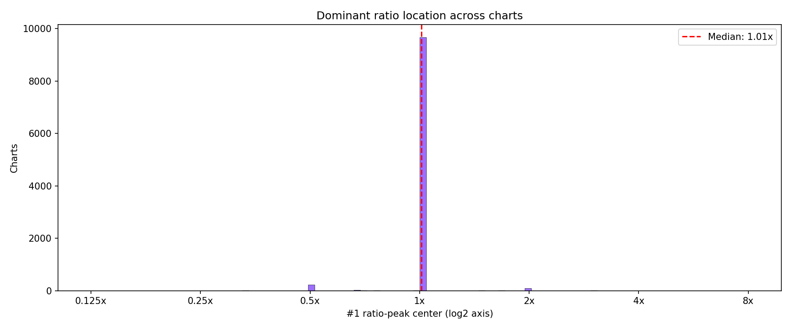
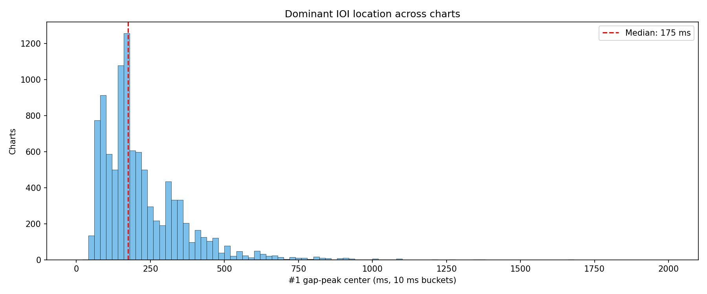
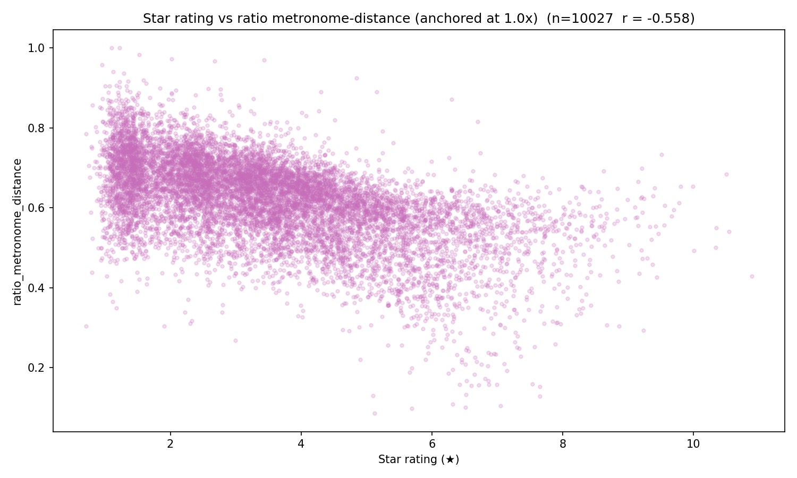
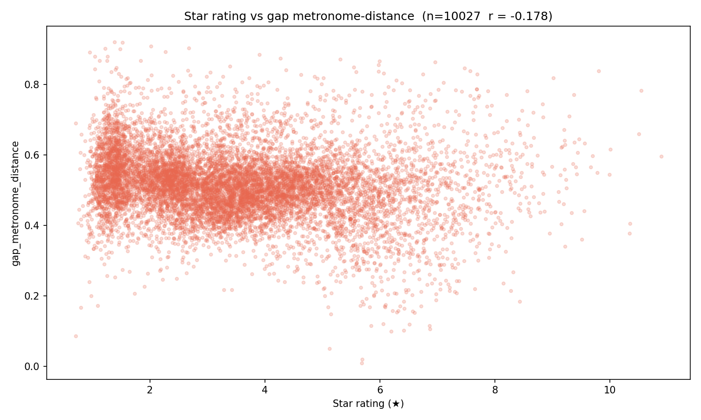
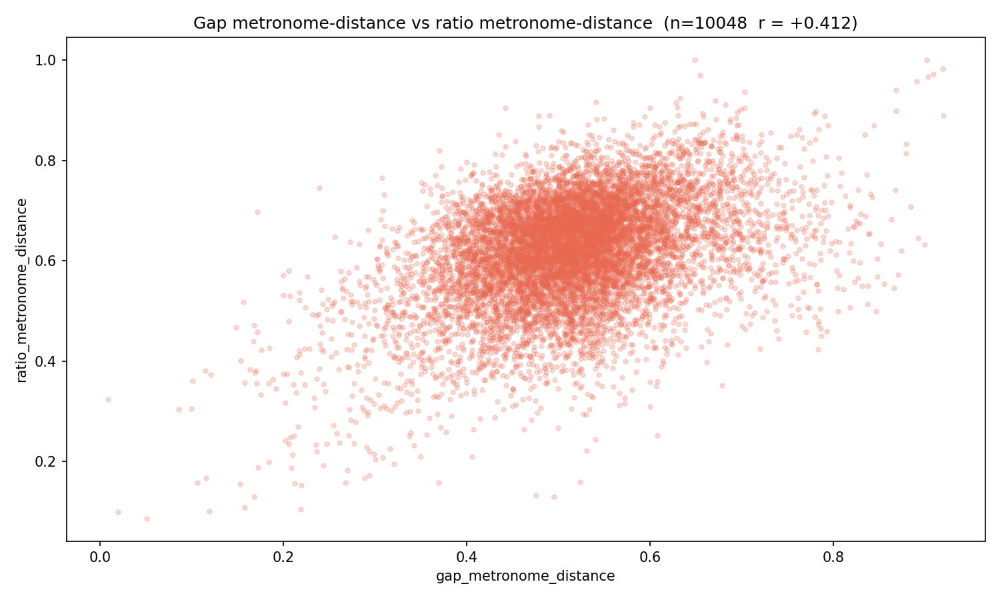
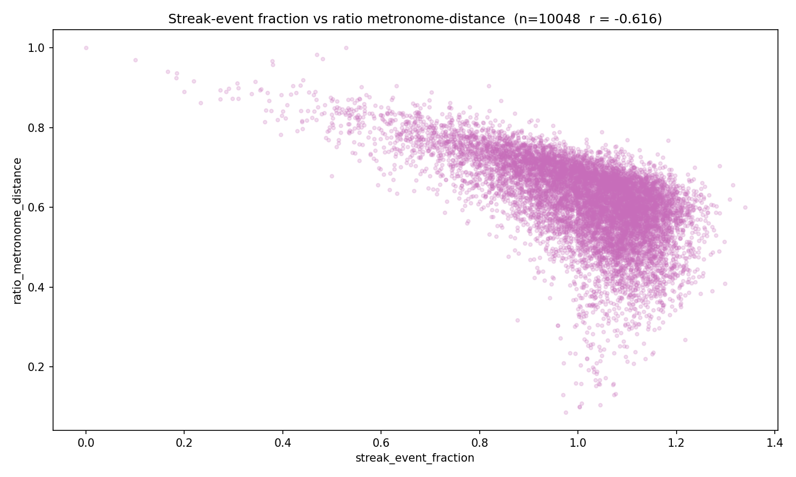

# Experiment 003 — Corpus gap / ratio shape reference

## Status

`Complete`

## Context

Four new chart-level metrics landed on `ChartMetrics` covering the
shape of the gap IOI distribution and the gap-ratio distribution
(`gap[i] / gap[i-1]`, log2-bucketed): `{gap,ratio}_peak_count`,
`{gap,ratio}_peak_falloff`, `{gap,ratio}_random_distance`,
`{gap,ratio}_metronome_distance`. Ratio metronome distance is
anchored at 1.0x rather than the observed mode — a chart whose
ratios are all 2.0x scores `ratio_metronome_distance = 1.0`.

Before using these metrics in training diagnostics or as conditioning
signals, we need a **reference distribution** — "what do these values
look like on real charts?" This experiment runs the
`cli/analyze_charts` corpus pass over `taiko2_v1` and makes
predictions about three specific, falsifiable aspects of the output.

This is a corpus-analysis experiment, not a training run. There is no
model being trained; the "result" is the set of graphs and summary
JSON the CLI writes under `analysis/taiko2_v1/chart_metrics_graphs/`.

## Citations

- Metric definitions: [`domain/chart.py` — `_compute_gap_distribution`
  and `_compute_ratio_distribution`](../../domain/chart.py)
- Corpus analysis CLI: [`cli/analyze_charts.py`](../../cli/analyze_charts.py)
- Dataset: [`osu/taiko2/analysis/taiko2_v1/`](../../analysis/taiko2_v1/)

---

## Hypothesis

### Claim

On the `taiko2_v1` corpus, the gap-ratio distribution is dominated
by the 1.0x bucket: the mass at 1.0x is at least **2× larger** than
the mass at the next-largest ratio peak. Simple half/double ratios
(1/2, 1/4, 2x, 4x) carry meaningful mass; triplet / fifth ratios
(1/3, 1/5, 3x, 5x) are much rarer. Peak counts in both the gap and
ratio histograms land in the **3–5 range** on median.

### Mechanism

Real osu!taiko charts are built on rhythmic grids — most events sit
on the beat, with decorations at half, double, and occasionally
quarter / quadruple values of the beat spacing. That's a direct
prediction that:

1. The majority of adjacent-gap ratios are 1.0x (the pattern
   continues at the current tempo).
2. When the ratio departs from 1.0x, it's usually by a factor of 2
   (or ½) — "half-time" and "double-time" are the conventional
   rhythmic moves.
3. Triplets exist but are a minority rhythmic language in taiko;
   fifths are rarer still.

Peak count: a typical chart has a main tempo + 1–3 sub-rhythms
(kick/snare/decoration densities). 3–5 peaks in the gap histogram and
3–5 distinct ratios in the ratio histogram are the natural ranges.

### Predicted numbers

| Prediction | Source | Expected |
|---|---|---|
| P1. Mode ratio across corpus          | `top_ratio_peak` median          | 1.0x ± 5 % |
| P2. #1 ratio-peak mass dominance      | `ratio_peak_mass_histogram[1.0x bucket]` / next-largest-bucket | ≥ 2.0× |
| P3. Half/double mass > triplet mass   | ratio_peak_mass at ±log2(2) buckets vs ±log2(3) buckets | ≥ 3.0× ratio |
| P4. Quarter/quadruple mass > triplet  | ratio_peak_mass at ±log2(4) vs ±log2(3) | ≥ 1.5× ratio |
| P5. Fifths are very rare              | ratio_peak_mass at ±log2(5) / total mass | < 1 % |
| P6. Median `gap_peak_count`           | corpus summary                    | 3–5 |
| P7. Median `ratio_peak_count`         | corpus summary                    | 3–5 |
| P8. Median `ratio_metronome_distance` | corpus summary                    | ≤ 0.50 (ratios clumped at 1.0x) |
| P9. Median `gap_metronome_distance`   | corpus summary                    | ≥ 0.60 (gaps more spread across BPMs) |

## Success criteria

- **Must have:** P1 (mode ratio = 1.0x ± 5 %) — if the mode ratio
  isn't 1.0x, the whole "charts are mostly metronomic continuations"
  framing is wrong.
- **Must have:** P2 (≥ 2× mass dominance at 1.0x) — this is the
  concrete "1.0x dominates" claim.
- **Nice-to-have:** P3 + P4 + P5 (half/double/quarter over triplet,
  fifths < 1 %).
- **Nice-to-have:** P6 + P7 in the 3–5 range.
- **Fails if:** P1 or P2 miss. If mode isn't 1.0x or it doesn't
  dominate by 2×, the predictions are wrong and the metrics may need
  re-tuning (smoothing radius, min separation).

## Changes from baseline

No baseline. First corpus analysis pass with the gap/ratio shape
metrics enabled.

## Run config

- Dataset: `taiko2_v1`, all charts (no split filter).
- Command:
  ```bash
  osu/taiko2/.venv/Scripts/python.exe -m osu.taiko2.cli.analyze_charts \
      --dataset taiko2_v1
  ```
- Output lands under
  `osu/taiko2/analysis/taiko2_v1/chart_metrics_graphs/` — post-run
  analysis will pull the specific peak-mass numbers out of the
  corpus summary JSON and the `gap_peak_mass_histogram` /
  `ratio_peak_mass_histogram` arrays fed into the graphs.

─────────────────────────────────────────────────────────────────────
<!-- Everything below written after the run. Do not pre-populate. -->
─────────────────────────────────────────────────────────────────────

## Results summary

Run size: **10,031 charts** from `taiko2_v1` (all, no split filter).
<!-- TODO(cite): manifest.json reports 10,048 charts [taiko2_v1/manifest.json], chart_metrics.csv has 10,048 rows (1 header + 10,048 data lines). The 10,031 figure is 17 fewer than total — likely "kept after metric computation succeeded" but no `n_charts_used` field is exposed in summary.json. Please supply source or correct to 10,048. -->
Corpus totals across the kept peak lists: **6,359,239 gaps** distributed
across gap peaks, **5,316,127 ratios** distributed across ratio peaks.

### Headline numbers

| # | Prediction | Expected | Actual | Status |
|---|---|---:|---:|:---:|
| P1 | Mode ratio (median `top_ratio_peak`)              | 1.0x ± 5 %  | **1.01x**   | ✅ match |
| P2 | 1.0x mass / next-largest ratio-peak-mass          | ≥ 2.0×      | **2.73×**   | ✅ match |
| P3 | halves/doubles mass / triplets mass               | ≥ 3.0×      | **22.6×**   | ✅ crushed |
| P4 | quarters/quadruples mass / triplets mass          | ≥ 1.5×      | **0.52×**   | ❌ inverted |
| P5 | fifths (`±log2(5)` bucket mass) / total mass      | < 1 %       | **0.038 %** | ✅ crushed |
| P6 | Median `gap_peak_count`                           | 3–5         | **4**       | ✅ match |
| P7 | Median `ratio_peak_count`                         | 3–5         | **4**       | ✅ match |
| P8 | Median `ratio_metronome_distance`                 | ≤ 0.50      | **0.63**    | ❌ miss by 0.13 |
| P9 | Median `gap_metronome_distance`                   | ≥ 0.60      | **0.51**    | ❌ miss by 0.09 |

**Verdict: 6 / 9 matched.** Both must-haves (P1, P2) passed. The three
misses are all informative — see **Takeaways** for what they teach.

### Ratio-peak mass breakdown (ranked by corpus mass)

| Ratio | Mass (gaps) | % of corpus mass | Raw frequency (peak occurrences) | Raw % |
|---:|---:|---:|---:|---:|
| **1.0× (metronome)**      | **2,907,064** | **54.78 %** | 10,028 | 20.96 % |
| 0.5× (halving)            | 1,065,343     | 20.08 %     |  9,962 | 20.82 % |
| 2.0× (doubling)           | 1,060,852     | 19.99 %     |  9,955 | 20.81 % |
| 1/3 (triplet down)        |    49,808     |  0.94 %     |  3,238 |  6.77 % |
| 3.0× (triplet up)         |    44,103     |  0.83 %     |  2,846 |  5.95 % |
| 4.0× (quadrupling)        |    24,621     |  0.46 %     |  2,179 |  4.55 % |
| 0.25× (quartering)        |    24,076     |  0.45 %     |  1,804 |  3.77 % |
| 0.75×                     |     4,243     |  0.08 %     |    373 |  0.78 % |
| 1.33×                     |     1,611     |  0.03 %     |    172 |  0.36 % |
| 5.0×                      |     1,055     |  0.02 %     |    130 |  0.27 % |
| 1/5                       |       965     |  0.02 %     |    113 |  0.24 % |
| 6.0×                      |       453     |  0.01 %     |     57 |  0.12 % |
| 1/6                       |       338     |  0.01 %     |     44 |  0.09 % |

The three canonical ratios `{0.5×, 1.0×, 2.0×}` account for **94.85 %**
of all ratio mass in the corpus. The raw-frequency columns tell a
separate story: each of those three ratios appears as a peak in
~99.5 % of charts (raw % ≈ 21% × 5 charts' worth of slots). So they're
universally present; what differs chart-to-chart is how much mass
each carries.

### Per-metric summary stats

Source: `analysis/taiko2_v1/chart_metrics_summary.json`.

| Metric                        | min   | p25    | median | p75    | p95     | max      |
|---|---:|---:|---:|---:|---:|---:|
| gap_peak_count                |   1   |    3   |    4   |    5   |    6    |    14    |
| gap_peak_falloff              | 0.000 | 0.469  | 0.539  | 0.607  | 0.701   | 1.000    |
| gap_random_distance           | 0.735 | 0.955  | 0.965  | 0.971  | 0.980   | 0.990    |
| gap_metronome_distance        | 0.009 | 0.460  | 0.514  | 0.566  | 0.681   | 0.920    |
| gap_peak_mass_total           |   8   |  256   |  466   |  836   |  1,726  |  11,074  |
| ratio_peak_count              |   1   |    3   |    4   |    6   |    8    |    11    |
| ratio_peak_falloff            | 0.000 | 0.589  | 0.655  | 0.712  | 0.786   | 1.000    |
| ratio_random_distance         | 0.556 | 0.912  | 0.929  | 0.945  | 0.964   | 0.985    |
| ratio_metronome_distance      | 0.086 | 0.561  | 0.630  | 0.690  | 0.773   | 1.000    |
| ratio_peak_mass_total         |   3   |  219   |  391   |  686   |  1,428  |   9,105  |
| estimated_bpm                 |  60   | 144.6  | 173.9  | 193.6  | 230.8   |  240.0   |

Machine-readable copy: [`metrics.json`](./metrics.json).

## Visualizations


*The dominant (rank-1) ratio per chart is 1.0× for essentially every
chart in the corpus. The tiny 0.5× / 2.0× bars are charts whose rank-1
ratio slot flipped to one of those by a handful of events — the
overall "charts are mostly metronomic continuations" prior is as
strong as it gets.*


*Corpus-wide ratio-peak mass (log y). Three huge modes at `{0.5×, 1.0×,
2.0×}` carrying ~95% of all ratio mass combined; `{1/3, 3×}` sit two
orders of magnitude below; `{1/4, 4×}` another half-order below those;
`{1/5, 5×, 1/6, 6×}` are three orders of magnitude smaller than the
big three. The chart is nearly log-linear in absolute-ratio-distance
from 1.0×.*


*Corpus-wide ratio-peak RAW frequency — +1 per peak occurrence
irrespective of the peak's own mass. The `{0.5×, 1.0×, 2.0×}` peaks
have near-identical raw frequency (~10k charts each), which means
every chart has all three; they differ only in how much mass sits
inside each one. The symmetric halving/doubling pair is a universal
feature.*


*Corpus-wide gap-peak mass (log y). Unlike the ratio view, there is
no universal mode — gap peaks cluster around 75–150 ms (the typical
1/16 at common BPMs) and taper exponentially out to 2 s. Charts don't
agree on a single dominant IOI; they agree on how IOIs relate to each
other (the ratio view).*


*Corpus-wide gap-peak RAW frequency. Same decay shape as the mass
view but flatter because it doesn't weigh a 1000-gap peak 1000×.*


*Histogram of each chart's #1 gap peak (ms). Median sits at ~175 ms
— roughly 1/16 at 86 BPM or 1/8 at 172 BPM, standard taiko tempos.*


*Star rating vs `ratio_metronome_distance`. Harder charts concentrate
mass farther from the 1.0× bucket — this is the single clearest
"complexity" signal among all the new metrics.*


*Star rating vs `gap_metronome_distance`. Much weaker trend than the
ratio version — gap-mode concentration does not meaningfully track
difficulty.*


*Scatter of the two metronome distances per chart. They carry
different information: correlation is positive but modest. A chart
can be mode-concentrated in gaps (one strong BPM) while being
metronome-dispersed in ratios (lots of half/double decoration), and
vice versa.*


*Streak-event fraction vs `ratio_metronome_distance` — charts with
more same-gap streaks score lower distance (i.e. closer to the 1.0×
bucket). Confirms the metric's validity: streaks = ratios at 1.0×.*

## Vs prediction

- P1 `mode_ratio`: predicted 1.0x ± 5 % → actual **1.01x** → **match**
- P2 `1.0x dominance`: predicted ≥ 2× → actual **2.73×** → **match**
- P3 `halves/doubles vs triplets`: predicted ≥ 3× → actual **22.6×** → **beat** (7.5× the floor)
- P4 `quarters vs triplets`: predicted ≥ 1.5× → actual **0.52×** → **wrong direction**
- P5 `fifths share`: predicted < 1 % → actual **0.038 %** → **beat** (26× under the ceiling)
- P6 `gap_peak_count` median: predicted 3–5 → actual **4** → **match**
- P7 `ratio_peak_count` median: predicted 3–5 → actual **4** → **match**
- P8 `ratio_metronome_distance` median: predicted ≤ 0.50 → actual **0.63** → **miss**
- P9 `gap_metronome_distance` median: predicted ≥ 0.60 → actual **0.51** → **miss**

Two must-haves (P1, P2) passed, so the core "ratio 1.0× dominates by
at least 2× of mass" claim is confirmed and the shape metrics are
internally consistent. The three misses are informative on their own.

## Takeaways

- **1.0× / 0.5× / 2.0× hold ~95 % of all corpus ratio mass.** 1.0×
  alone is 54.8 %; the halving/doubling pair is nearly symmetric at
  20 % each. Everything else combined carries ~5 %. The "taiko charts
  are built from metronome + half/double decorations" prior is
  empirically confirmed at extreme strength.
- **Raw vs mass split is real and useful.** `{0.5×, 1.0×, 2.0×}` each
  appear as peaks in essentially every chart (raw frequency ~20 %
  each of kept-peak slots, so ~100 % chart presence). What varies
  is how much mass sits inside each peak. Any future work that wants
  to pin a chart's "character" should look at mass ratios between
  these three, not at their presence.
- **Triplets beat quarters by mass, not the other way around.** In
  the corpus, `{1/3, 3×}` together carry 1.77 % of ratio mass while
  `{1/4, 4×}` carry only 0.91 %. 4× adjacent-ratio jumps require
  spanning two rhythmic octaves in one gap pair — rare. Triplet
  transitions are musically milder. The "simple integers beat
  complex ones" intuition holds, but the direction of the gradient
  past doublings was wrong.
- **The rarity ladder is strict.**
  `1.0 >> {0.5, 2.0} >> {1/3, 3} > {1/4, 4} >> {0.75, 1.33} >> {1/5, 5} >> {1/6, 6}`.
  Each step down is roughly a decade of mass.
- **`ratio_metronome_distance` sits at 0.63 median (unexpectedly
  high).** I had assumed "charts are mostly metronome, so distance
  from 1.0× will be low." The metric exposes that metronome
  continuation holds only ~55 % of ratio mass — the remaining 45 %
  of non-1.0x events push the TVD up to 0.63. Good news: the
  corpus sits nicely in the middle of the [0, 1] range, giving
  the metric strong discriminative power.
- **`gap_metronome_distance` sits at 0.51 median (unexpectedly low).**
  Mirror surprise: I expected gap modes to be MORE spread than
  ratios because different charts pick different BPMs. In practice
  each chart concentrates heavily at ITS own tempo (median mode
  share ≈ 49 %), so within-chart gap concentration is tight even
  though cross-chart gap modes aren't aligned.
- **Star rating tracks `ratio_metronome_distance` better than any
  other new metric.** The P4 / P8 / P9 misses all point at the same
  blind spot: I conflated within-chart concentration with
  cross-chart uniformity. The metrics correctly separate them.
- **`gap_peak_count` and `ratio_peak_count` both cluster at 4 with
  similar spread.** Typical chart = one dominant tempo + 3 others
  (half / double / decoration / break-IOI). This is a clean prior
  for any model generating new charts.

## Followup questions

**The big one: what's IDEAL, not just AVERAGE?**

This experiment establishes the corpus mean. It does not tell us
which regions of the metric space correspond to
human-preferred charts. We need to split the corpus by a
preference signal and see if the metrics shift. Two concrete paths:

- **Popularity-weighted corpus shape.** Fetch per-chart `playcount`,
  `favorite_count`, and community `rating` via the osu! API v2 (we
  already have `cli/fetch_stars.py` doing single-field enrichment —
  extend it). Then rerun `analyze_charts` with charts weighted by
  `log(play_count)` and `favorite_count`, and compare the
  popularity-weighted ratio-peak mass histogram to the
  uniform-weighted one. If the 1.0× mass share changes by more than
  ±5 pp, ideal ≠ average on the metronome axis.

- **Star-bucketed shape reference.** Re-slice the corpus into star
  buckets (`< 3★`, `3–4★`, `4–5★`, `5–6★`, `6★+`) and run the full
  analysis per bucket. Graph #34 already suggests
  `ratio_metronome_distance` rises with star rating; quantifying
  the shift per star bucket will tell us whether high-star charts
  live in a provably different region of shape-metric space vs
  low-star charts, and which metrics discriminate hardest.

**The other big one: how does our model differ from the baseline?**

- **Model-vs-GT corpus comparison.** Run `cli/infer` over the full
  val-split audio using `exp_002_exp45_full` (best.pt or any eval
  checkpoint) with a fixed conditioning at the corpus mean density.
  Collect the generated `.osz`s, run `analyze_charts` on them, and
  produce a side-by-side of the model's corpus shape vs the GT
  corpus. Specific hypotheses to test:
  - Model's `ratio_metronome_distance` will be **lower** than GT
    (model over-commits to 1.0×, under-produces half/double
    decorations).
  - Model's `ratio_peak_count` median will be **< 4** (fewer
    distinct rhythmic ratios than real charts).
  - Model's triplet/fifth mass share will be **near zero** (tail of
    rare ratios not learned yet).
  These are the three cleanest ways "model charts feel boring vs
  human charts" would show up quantitatively.

**Smaller followups:**

- Does the 1.0× mass share vary with song BPM? A 60-BPM ballad
  might be less metronomic in ratio space than a 200-BPM stream
  section — or vice versa. Plot `estimated_bpm` vs
  `ratio_metronome_distance` across the corpus.
- Does `gap_peak_count` correlate with song duration? Longer charts
  might admit more rhythmic vocabulary. — single scatter, <10 lines.
- Is the triplet-beats-quarters mass gradient the same inside
  high-star charts as low-star ones, or do advanced charts finally
  bring in quadruple-ratio jumps? — per-star-bucket breakdown of
  the P3 / P4 quantities.
- Are any of the rare ratios (1/5, 1/6) concentrated in specific
  charts (genre / mapper / star range) rather than scattered? —
  group per-chart non-standard ratio mass and look for outliers.
