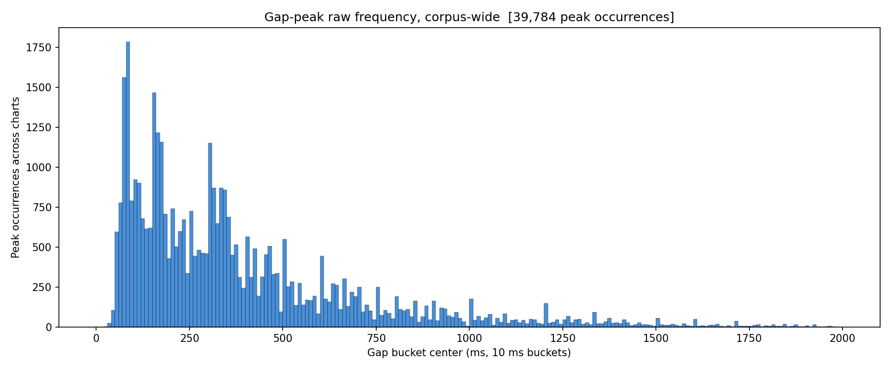
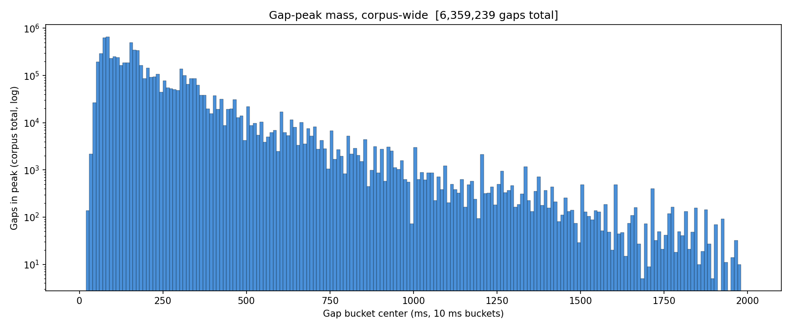
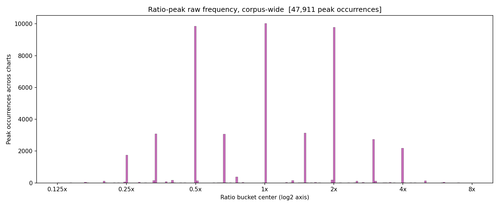
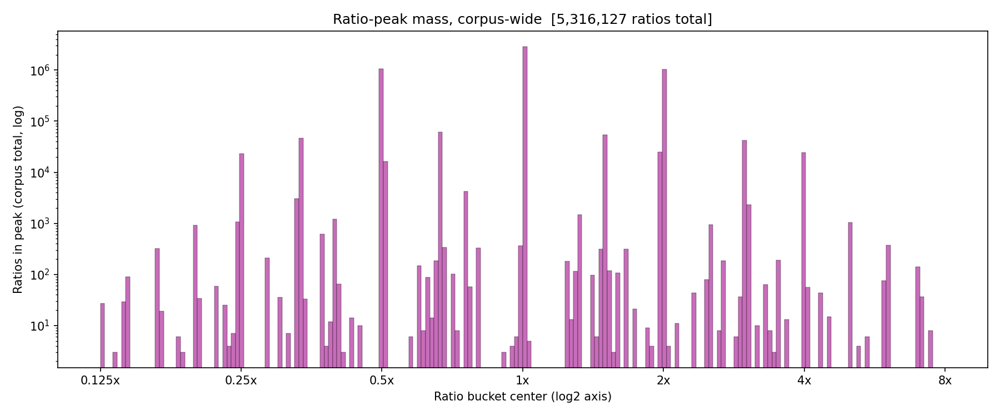

# Experiment 003 — Corpus gap / ratio shape reference

## Status

`Planned`

## Context

Four new chart-level metrics landed on `ChartMetrics` covering the
shape of the gap IOI distribution and the gap-ratio distribution
(`gap[i] / gap[i-1]`, log2-bucketed): `{gap,ratio}_peak_count`,
`{gap,ratio}_peak_falloff`, `{gap,ratio}_random_distance`,
`{gap,ratio}_metronome_distance`. Ratio metronome distance is
anchored at 1.0x rather than the observed mode — a chart whose
ratios are all 2.0x scores `ratio_metronome_distance = 1.0`.

Before using these metrics in training diagnostics or as conditioning
signals, we need a **reference distribution** — "what do these values
look like on real charts?" This experiment runs the
`cli/analyze_charts` corpus pass over `taiko2_v1` and makes
predictions about three specific, falsifiable aspects of the output.

This is a corpus-analysis experiment, not a training run. There is no
model being trained; the "result" is the set of graphs and summary
JSON the CLI writes under `analysis/taiko2_v1/chart_metrics_graphs/`.

## Citations

- Metric definitions: [`domain/chart.py` — `_compute_gap_distribution`
  and `_compute_ratio_distribution`](../../domain/chart.py)
- Corpus analysis CLI: [`cli/analyze_charts.py`](../../cli/analyze_charts.py)
- Dataset: [`osu/taiko2/analysis/taiko2_v1/`](../../analysis/taiko2_v1/)

---

## Hypothesis

### Claim

On the `taiko2_v1` corpus, the gap-ratio distribution is dominated
by the 1.0x bucket: the mass at 1.0x is at least **2× larger** than
the mass at the next-largest ratio peak. Simple half/double ratios
(1/2, 1/4, 2x, 4x) carry meaningful mass; triplet / fifth ratios
(1/3, 1/5, 3x, 5x) are much rarer. Peak counts in both the gap and
ratio histograms land in the **3–5 range** on median.

### Mechanism

Real osu!taiko charts are built on rhythmic grids — most events sit
on the beat, with decorations at half, double, and occasionally
quarter / quadruple values of the beat spacing. That's a direct
prediction that:

1. The majority of adjacent-gap ratios are 1.0x (the pattern
   continues at the current tempo).
2. When the ratio departs from 1.0x, it's usually by a factor of 2
   (or ½) — "half-time" and "double-time" are the conventional
   rhythmic moves.
3. Triplets exist but are a minority rhythmic language in taiko;
   fifths are rarer still.

Peak count: a typical chart has a main tempo + 1–3 sub-rhythms
(kick/snare/decoration densities). 3–5 peaks in the gap histogram and
3–5 distinct ratios in the ratio histogram are the natural ranges.

### Predicted numbers

| Prediction | Source | Expected |
|---|---|---|
| P1. Mode ratio across corpus          | `top_ratio_peak` median          | 1.0x ± 5 % |
| P2. #1 ratio-peak mass dominance      | `ratio_peak_mass_histogram[1.0x bucket]` / next-largest-bucket | ≥ 2.0× |
| P3. Half/double mass > triplet mass   | ratio_peak_mass at ±log2(2) buckets vs ±log2(3) buckets | ≥ 3.0× ratio |
| P4. Quarter/quadruple mass > triplet  | ratio_peak_mass at ±log2(4) vs ±log2(3) | ≥ 1.5× ratio |
| P5. Fifths are very rare              | ratio_peak_mass at ±log2(5) / total mass | < 1 % |
| P6. Median `gap_peak_count`           | corpus summary                    | 3–5 |
| P7. Median `ratio_peak_count`         | corpus summary                    | 3–5 |
| P8. Median `ratio_metronome_distance` | corpus summary                    | ≤ 0.50 (ratios clumped at 1.0x) |
| P9. Median `gap_metronome_distance`   | corpus summary                    | ≥ 0.60 (gaps more spread across BPMs) |

## Success criteria

- **Must have:** P1 (mode ratio = 1.0x ± 5 %) — if the mode ratio
  isn't 1.0x, the whole "charts are mostly metronomic continuations"
  framing is wrong.
- **Must have:** P2 (≥ 2× mass dominance at 1.0x) — this is the
  concrete "1.0x dominates" claim.
- **Nice-to-have:** P3 + P4 + P5 (half/double/quarter over triplet,
  fifths < 1 %).
- **Nice-to-have:** P6 + P7 in the 3–5 range.
- **Fails if:** P1 or P2 miss. If mode isn't 1.0x or it doesn't
  dominate by 2×, the predictions are wrong and the metrics may need
  re-tuning (smoothing radius, min separation).

## Changes from baseline

No baseline. First corpus analysis pass with the gap/ratio shape
metrics enabled.

## Run config

- Dataset: `taiko2_v1`, all charts (no split filter).
- Command:
  ```bash
  osu/taiko2/.venv/Scripts/python.exe -m osu.taiko2.cli.analyze_charts \
      --dataset taiko2_v1
  ```
- Output lands under
  `osu/taiko2/analysis/taiko2_v1/chart_metrics_graphs/` — post-run
  analysis will pull the specific peak-mass numbers out of the
  corpus summary JSON and the `gap_peak_mass_histogram` /
  `ratio_peak_mass_histogram` arrays fed into the graphs.

─────────────────────────────────────────────────────────────────────
<!-- Everything below written after the run. Do not pre-populate. -->
─────────────────────────────────────────────────────────────────────

## Results summary

### Headline numbers

| Prediction | Expected | Actual | Status |
|---|---:|---:|:---:|
| P1. Mode ratio (median `top_ratio_peak`)              | 1.0x ± 5 %  | — | — |
| P2. 1.0x mass / next-largest ratio-peak-mass          | ≥ 2.0×      | — | — |
| P3. halves/doubles mass / triplets mass               | ≥ 3.0×      | — | — |
| P4. quarters/quadruples mass / triplets mass          | ≥ 1.5×      | — | — |
| P5. fifths (`±log2(5)` bucket mass) / total mass      | < 1 %       | — | — |
| P6. Median `gap_peak_count`                           | 3–5         | — | — |
| P7. Median `ratio_peak_count`                         | 3–5         | — | — |
| P8. Median `ratio_metronome_distance`                 | ≤ 0.50      | — | — |
| P9. Median `gap_metronome_distance`                   | ≥ 0.60      | — | — |

### Per-metric summary stats

Generated from
`analysis/taiko2_v1/chart_metrics_summary.json` after the run.

| Metric | min | p25 | median | p75 | p95 | max |
|---|---:|---:|---:|---:|---:|---:|
| gap_peak_count              | | | | | | |
| gap_peak_falloff            | | | | | | |
| gap_random_distance         | | | | | | |
| gap_metronome_distance      | | | | | | |
| gap_peak_mass_total         | | | | | | |
| ratio_peak_count            | | | | | | |
| ratio_peak_falloff          | | | | | | |
| ratio_random_distance       | | | | | | |
| ratio_metronome_distance    | | | | | | |
| ratio_peak_mass_total       | | | | | | |

## Visualizations

Pull the following from
`analysis/taiko2_v1/chart_metrics_graphs/` into `graphs/` after the
run:


*Corpus-wide gap-peak raw frequency (one +1 per peak occurrence).*


*Corpus-wide gap-peak mass (weight = each peak's own count).*


*Corpus-wide ratio-peak raw frequency, log2 axis.*


*Corpus-wide ratio-peak mass — the graph P1 / P2 / P3 / P4 / P5 are
read directly off.*

Plus the eight shape-metric distribution histograms (13–20) and the
14 correlation scatters (27–42).

## Vs prediction

- P1 `mode_ratio`: predicted 1.0x ± 5 % → actual `—` → **—**
- P2 `1.0x dominance`: predicted ≥ 2× → actual `—` → **—**
- P3 `halves/doubles vs triplets`: predicted ≥ 3× → actual `—` → **—**
- P4 `quarters vs triplets`: predicted ≥ 1.5× → actual `—` → **—**
- P5 `fifths share`: predicted < 1 % → actual `—` → **—**
- P6 `gap_peak_count` median: predicted 3–5 → actual `—` → **—**
- P7 `ratio_peak_count` median: predicted 3–5 → actual `—` → **—**
- P8 `ratio_metronome_distance` median: predicted ≤ 0.50 → actual `—` → **—**
- P9 `gap_metronome_distance` median: predicted ≥ 0.60 → actual `—` → **—**

## Takeaways

- {One concrete bullet per confirmed / refuted prediction.}

## Followup questions

- {Question.} — {suggested next analysis or experiment}
