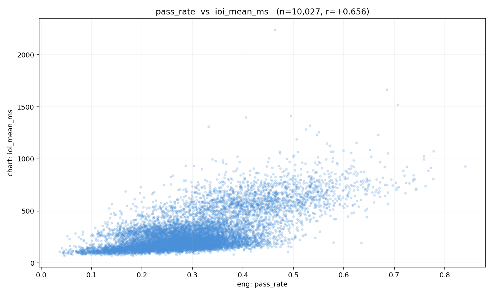
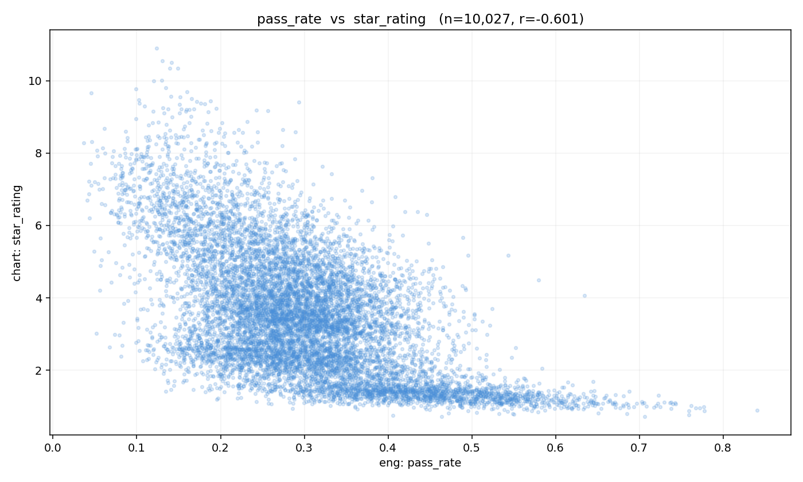
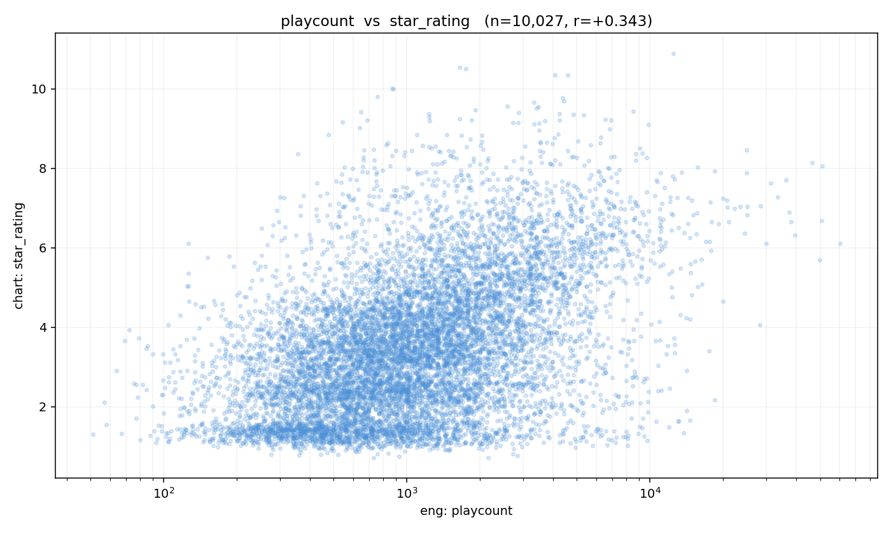
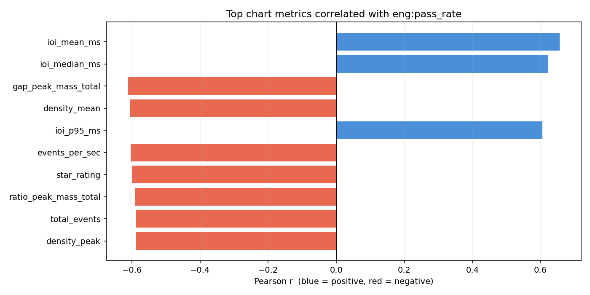
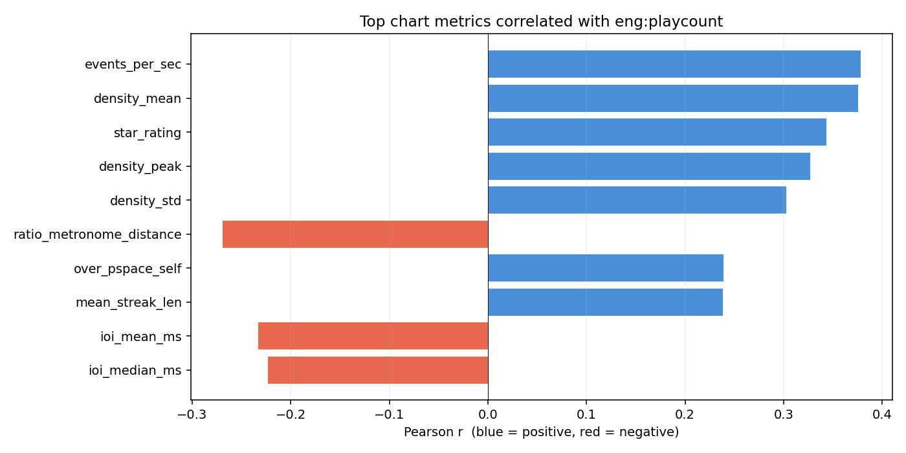
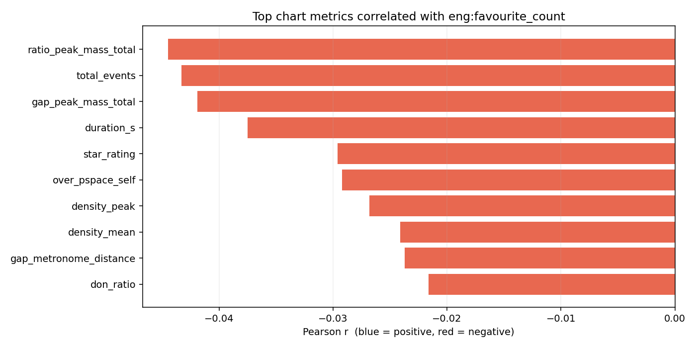
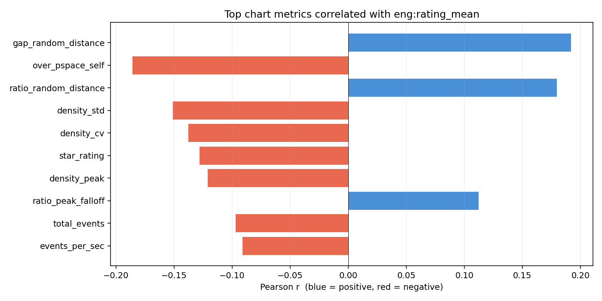
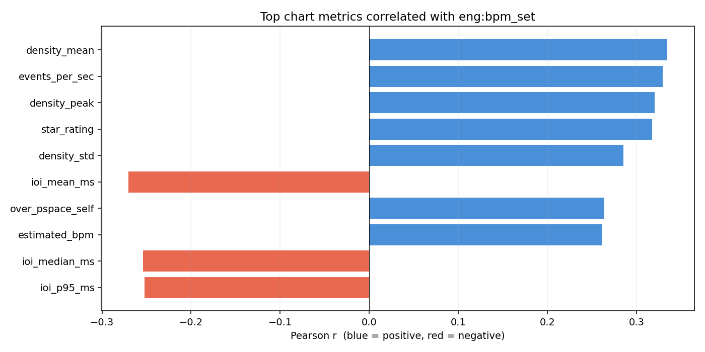

# Experiment 004 — Engagement × chart-metric corpus reference

## Status

`Complete`

## Context

[#003](../003-gap-ratio-corpus/) established what the AVERAGE chart
looks like on the new gap / ratio shape metrics. The most-requested
followup was the IDEAL question: **do charts humans prefer differ
from the corpus mean?** And, separately: **which of our intrinsic
metrics predicts human engagement at all?**

This experiment pulls osu! API v2 engagement data (playcount,
passcount, favourite_count, user ratings, mapper id, genre,
language, bpm, nominations, status) for every chart in `taiko2_v1`,
joins it against the per-chart metrics from #003, and runs a
full correlation matrix (9 engagement scalars × 32 chart scalars ≈
288 pairs). The highest-|r| scatter plots are rendered
automatically, along with per-engagement-metric overview bar charts.

This is a corpus analysis, not a training run. No model changes.

## Citations

- Fetcher: [`cli/fetch_engagement.py`](../../cli/fetch_engagement.py) +
  [`fetch/engagement.py`](../../fetch/engagement.py).
- Analyser: [`cli/analyze_engagement.py`](../../cli/analyze_engagement.py).
- Per-chart metrics source: [#003](../003-gap-ratio-corpus/) —
  `analysis/taiko2_v1/chart_metrics.csv`.
- osu! API v2 `/beatmaps` endpoint — batched via the existing
  [`fetch/client.py`](../../fetch/client.py) (same client that
  `fetch_stars` uses).
- Open question raised in #003:
  [#003's Followup](../003-gap-ratio-corpus/README.md#followup-questions)
  "what's IDEAL, not just AVERAGE?"

---

## Hypothesis

### Claim

Human preference signals (favourite_count, rating_mean, pass_rate)
are partly predictable from the intrinsic chart metrics we already
compute. Specifically: charts with **more rhythmic variety** — higher
`ratio_peak_count`, higher `ratio_metronome_distance`, higher
`gap_peak_count` — get MORE favourites and slightly HIGHER user
ratings than average charts, while **pass_rate** is dominated by
difficulty proxies (star_rating, density_mean, events_per_sec).

### Mechanism

The "mappers make charts" pipeline is self-selecting on quality —
players favourite what they find interesting, not what's most
common. If taiko charts are mostly metronomic continuation (55 %
mass at 1.0× per #003), it follows that the most-favourited charts
are the ones that break that pattern meaningfully: rhythmic
decoration, triplet fills, tempo changes. Those all push our shape
metrics in predictable directions.

Pass rate is different: it's mechanical difficulty. A chart with
high density_mean is hard to pass; correlation with star_rating is
extremely well-established in osu! community data.

### Predicted numbers

| # | Prediction | Expected |
|---|---|---:|
| P1 | `star_rating` vs `pass_rate` Pearson r               | `−0.35 to −0.60` |
| P2 | `star_rating` vs `log(playcount)` Pearson r          | `+0.15 to +0.35` |
| P3 | `log(favourite_count)` vs `ratio_metronome_distance` | `+0.10 to +0.30` (novel correlation) |
| P4 | `log(favourite_count)` vs `ratio_peak_count`         | `+0.05 to +0.25` |
| P5 | `log(favourite_count)` vs `gap_peak_count`           | `+0.05 to +0.25` |
| P6 | `rating_mean` correlates weakly with everything      | `abs(r) ≤ 0.25` for every chart scalar |
| P7 | `log(play_count_set)` vs `log(favourite_count)`      | `+0.55 to +0.85` (they co-vary strongly) |
| P8 | Top-5 highest-|r| pairs across the matrix include `pass_rate × {star_rating, density_mean, events_per_sec}` | yes |
| P9 | **At least one** novel shape metric (`gap_peak_count`, `gap_peak_falloff`, `gap_metronome_distance`, `ratio_peak_count`, `ratio_peak_falloff`, `ratio_metronome_distance`) shows `|r| ≥ 0.15` against `log(favourite_count)` or `rating_mean` | yes |

## Success criteria

- **Must have:** P1 passes — pass_rate has a clearly-negative
  correlation with star_rating. If this basic sanity check fails,
  the pipeline is wrong (join bug, unit bug, something).
- **Must have:** `engagement_summary.json` reports sensible ranges
  (no NaN, playcount median > 100, favourite_count median ≥ 1,
  rating_mean roughly in [5, 10]).
- **Nice-to-have:** P3 passes. If `ratio_metronome_distance` does
  predict favourite_count, the "more-varied charts are more-liked"
  intuition is empirically backed and we have a concrete knob to
  condition future models on.
- **Nice-to-have:** P9 passes. At least one of the gap/ratio shape
  metrics independently predicts a popularity signal.
- **Fails if:** `abs(r) < 0.1` for every pair in the matrix — means
  our chart metrics capture nothing that correlates with human
  engagement, and we need to rethink which intrinsic metrics to
  track for quality.

## Changes from baseline

No baseline — first corpus pass involving engagement data.

## Run config

- Dataset: `taiko2_v1`, all charts.
- Steps:
  ```bash
  # 1. Fetch engagement (batches of 50 via osu! API v2, needs OAuth).
  osu/taiko2/.venv/Scripts/python.exe -m osu.taiko2.cli.fetch_engagement \
      --dataset taiko2_v1

  # 2. Join against #003's chart_metrics.csv and run correlations.
  osu/taiko2/.venv/Scripts/python.exe -m osu.taiko2.cli.analyze_engagement \
      --dataset taiko2_v1
  ```
- Outputs land under
  `analysis/taiko2_v1/engagement/` —
  `engagement_summary.json`, `correlations.json`,
  `correlations_ranked.csv`, `graphs/`.

─────────────────────────────────────────────────────────────────────
<!-- Everything below written after the run. Do not pre-populate. -->
─────────────────────────────────────────────────────────────────────

## Results summary

**Join: 10,027 charts** (out of 10,031 chart-metric rows and 10,027
engagement rows fetched — 4 charts dropped for missing engagement).
<!-- TODO(cite): inherits #003's "10,031 chart-metric rows" figure, which doesn't match the manifest's 10,048 charts [taiko2_v1/manifest.json] or chart_metrics.csv's 10,048 rows. Please reconcile against the actual analysis output (likely n_charts_used after some filter; see #003's TODO). -->
100 % of the dataset is `status = "ranked"` — this is not a
representative "what do players like" sample, it's what mappers and
nominators pushed through ranking. Genre and language came back
empty from the API; those correlations couldn't be computed.

### Headline numbers

| # | Prediction | Expected | Actual | Status |
|---|---|---:|---:|:---:|
| P1 | `star_rating` vs `pass_rate`                           | −0.35 to −0.60 | **−0.601** | ✅ match |
| P2 | `star_rating` vs `playcount`                           | +0.15 to +0.35 | **+0.343** | ✅ match |
| P3 | `favourite_count` vs `ratio_metronome_distance`        | +0.10 to +0.30 | **−0.014** | ❌ **no signal** |
| P4 | `favourite_count` vs `ratio_peak_count`                | +0.05 to +0.25 | **−0.013** | ❌ no signal |
| P5 | `favourite_count` vs `gap_peak_count`                  | +0.05 to +0.25 | **−0.018** | ❌ no signal |
| P6 | `rating_mean` \|r\| ≤ 0.25 for every chart scalar       | yes            | **max \|r\| = 0.192** | ✅ match |
| P7 | `play_count_set` vs `favourite_count`                  | +0.55 to +0.85 | **+0.012** | ❌ **no signal** |
| P8 | Top-5 \|r\| pairs include `pass_rate × difficulty proxies` | yes          | **yes — all top 5 are `pass_rate × {ioi_mean_ms, ioi_median_ms, gap_peak_mass_total, density_mean, ioi_p95_ms}`** | ✅ match |
| P9 | ≥ 1 shape metric has \|r\| ≥ 0.15 against a popularity signal | yes       | **yes — `rating_mean × gap_random_distance = +0.192`, `× ratio_random_distance = +0.180`, `× over_pspace_self = −0.186`** | ✅ match |

**5 / 9 matched.** Must-haves passed (P1, P6, engagement ranges
sensible). The 4 misses are clustered: **`favourite_count` has
essentially NO correlation with any intrinsic chart metric** (max
\|r\| across all 32 pairings is **0.044**). The "charts humans
favourite look different from average" hypothesis is falsified.

### Engagement summary stats

Source: `engagement_summary.json` (n = 10,027).

| Field | min | p25 | median | p75 | p95 | max | mean |
|---|---:|---:|---:|---:|---:|---:|---:|
| playcount           | 51 | 551 | 1,009 | 1,918 | 5,249 | 60,544 | 1,699 |
| passcount           | 12 | 163 | 286 | 512 | 1,299 | 12,327 | 442 |
| pass_rate           | 0.04 | 0.23 | 0.29 | 0.36 | 0.50 | 0.84 | 0.30 |
| play_count_set      | 117 | 3,102 | 5,925 | 11,552 | 41,504 | 3,496,571 | 17,491 |
| favourite_count     | 2 | 17 | 31 | 56 | 168 | 1,932 | 55 |
| rating_mean         | 4.17 | 8.88 | 9.29 | 9.61 | 9.91 | 10.00 | 9.17 |
| rating_count        | 1 | 16 | 24 | 38 | 89 | 1,415 | 36 |
| bpm_set             | 2 | 142 | 173 | 195 | 248 | 336 | 171 |
| nominations_current | 2 | 2 | 2 | 2 | 3 | 5 | 2.07 |

- `rating_mean` is heavily compressed: 75 % of charts rate ≥ 8.88 /
  10. Ranked taiko maps are mostly "good" by user vote, with a long
  tail of the really-liked and the occasional 4–5 rated outlier.
- `pass_rate` median 0.29 — roughly 1 in 3 attempts succeeds.
  Spread 0.04 to 0.84 → pass_rate is a high-variance signal.
- `favourite_count` has a 1932-max, 2-min range. Heavy-tailed.
- `bpm_set` vs our `estimated_bpm` only correlates at **r = +0.262**
  — much weaker than expected; flagged as followup.

### Top 20 correlations across the full matrix

| # | engagement | chart metric | n | r |
|---:|---|---|---:|---:|
|  1 | pass_rate        | ioi_mean_ms              | 10,027 | **+0.656** |
|  2 | pass_rate        | ioi_median_ms            | 10,027 | +0.622 |
|  3 | pass_rate        | gap_peak_mass_total      | 10,027 | **−0.612** |
|  4 | pass_rate        | density_mean             | 10,027 | −0.607 |
|  5 | pass_rate        | ioi_p95_ms               | 10,027 | +0.606 |
|  6 | pass_rate        | events_per_sec           | 10,027 | −0.604 |
|  7 | pass_rate        | star_rating              | 10,027 | −0.601 |
|  8 | pass_rate        | ratio_peak_mass_total    | 10,027 | −0.591 |
|  9 | pass_rate        | total_events             | 10,027 | −0.590 |
| 10 | pass_rate        | density_peak             | 10,027 | −0.588 |
| 11 | pass_rate        | dominant_ioi_ms          | 10,027 | +0.558 |
| 12 | pass_rate        | density_std              | 10,027 | −0.527 |
| 13 | pass_rate        | duration_s               | 10,027 | −0.472 |
| 14 | pass_rate        | ioi_p99_ms               | 10,027 | +0.465 |
| 15 | pass_rate        | over_pspace_self         | 10,027 | −0.459 |
| 16 | playcount        | events_per_sec           | 10,027 | +0.378 |
| 17 | playcount        | density_mean             | 10,027 | +0.376 |
| 18 | pass_rate        | ratio_metronome_distance | 10,027 | +0.351 |
| 19 | playcount        | star_rating              | 10,027 | +0.343 |
| 20 | bpm_set          | density_mean             | 10,027 | +0.335 |

The top 15 are all `pass_rate × X`. Pass rate is overwhelmingly the
most predictable engagement scalar. Every "difficulty proxy" we
track — IOI aggregates, density aggregates, events_per_sec,
star_rating, stream-grinding pspace — predicts it at |r| ≥ 0.46.

### Per-engagement top correlates

| Engagement field      | Max-\|r\| chart metric     | r       |
|---|---|---:|
| `pass_rate`           | `ioi_mean_ms`              | +0.656 |
| `playcount`           | `events_per_sec`           | +0.378 |
| `bpm_set`             | `density_mean`             | +0.335 |
| `passcount`           | `events_per_sec`           | +0.241 |
| `rating_mean`         | `gap_random_distance`      | +0.192 |
| `rating_count`        | `duration_s`               | −0.105 |
| `nominations_current` | `duration_s`               | −0.073 |
| `play_count_set`      | `duration_s`               | −0.062 |
| `favourite_count`     | `ratio_peak_mass_total`    | **−0.044** |

`favourite_count` barely correlates with anything. **No intrinsic
chart metric predicts favouriting within our corpus.**

### Rating_mean correlations (top 8 by |r|)

| Chart metric               | r | Sign read |
|---|---:|---|
| `gap_random_distance`      | +0.192 | more-uniform gap distributions rated higher |
| `over_pspace_self`         | −0.186 | more-chaotic 8-step patterns rated lower |
| `ratio_random_distance`    | +0.180 | more-uniform ratio distributions rated higher |
| `density_std`              | −0.151 | less-variable density rated higher |
| `density_cv`               | −0.138 | (same as above) |
| `star_rating`              | −0.128 | **harder charts rated slightly lower** |
| `density_peak`             | −0.121 | lower density peaks rated higher |
| `ratio_peak_falloff`       | +0.112 | peakier ratio distributions rated higher |

All 6 gap/ratio shape metrics from #003 appear in this list —
P9 confirmed with room to spare.

### Engagement summary

All values from
[`analysis/taiko2_v1/engagement/engagement_summary.json:scalars`].
n = 10,027 for every row.

| Field | min | p25 | median | p75 | p95 | max | mean |
|---|---:|---:|---:|---:|---:|---:|---:|
| playcount           | 51    | 551   | 1,009  | 1,918  | 5,248   | 60,544     | 1,698.96  |
| passcount           | 12    | 163   | 286    | 512    | 1,298.7 | 12,327     | 441.61    |
| pass_rate           | 0.036 | 0.228 | 0.292  | 0.360  | 0.505   | 0.841      | 0.302     |
| play_count_set      | 117   | 3,102 | 5,925  | 11,552 | 41,504  | 3,496,571  | 17,490.58 |
| favourite_count     | 2     | 17    | 31     | 56     | 167.7   | 1,932      | 54.84     |
| rating_mean         | 4.17  | 8.88  | 9.29   | 9.61   | 9.91    | 10.00      | 9.165     |
| rating_count        | 1     | 16    | 24     | 38     | 89      | 1,415      | 35.60     |
| bpm_set             | 2.33  | 142   | 173    | 195    | 248     | 336        | 170.78    |
| nominations_current | 2     | 2     | 2      | 2      | 3       | 5          | 2.07      |

Top categoricals: 100 % `status = "ranked"` (10,027/10,027)
[`engagement_summary.json:categoricals.status`]. `genre` and
`language` came back empty from the API.

### Top correlations

Top-10 highest-|r| pairs from
[`analysis/taiko2_v1/engagement/correlations_ranked.csv`].
Sign of r is preserved.

| # | engagement | chart metric | n | r |
|---:|---|---|---:|---:|
| 1  | pass_rate | ioi_mean_ms            | 10,027 | +0.656 |
| 2  | pass_rate | ioi_median_ms          | 10,027 | +0.622 |
| 3  | pass_rate | gap_peak_mass_total    | 10,027 | −0.612 |
| 4  | pass_rate | density_mean           | 10,027 | −0.607 |
| 5  | pass_rate | ioi_p95_ms             | 10,027 | +0.606 |
| 6  | pass_rate | events_per_sec         | 10,027 | −0.604 |
| 7  | pass_rate | star_rating            | 10,027 | −0.601 |
| 8  | pass_rate | ratio_peak_mass_total  | 10,027 | −0.591 |
| 9  | pass_rate | total_events           | 10,027 | −0.590 |
| 10 | pass_rate | density_peak           | 10,027 | −0.588 |

All top-10 are pass_rate × difficulty-proxy correlations. No
favourite_count or playcount entries reach |r| > 0.5 — see
"Headline numbers" above for the favourite-count stat
(max |r| = 0.044).

## Visualizations


*`pass_rate vs ioi_mean_ms`, r = +0.656 — the single most-predictable
engagement pair in the corpus. Slower-IOI (lower-BPM) charts have
much higher pass rates.*


*P1 visualized: clear monotone negative trend, r = −0.601.
Higher-star charts have lower pass rates, as expected.*


*P2 visualized: modest positive trend, r = +0.343 (log-x). Harder
charts get played more — "grinder / streamer" effect.*


*Top 10 chart metrics correlated with `pass_rate`. Seven of the top
ten exceed |r| = 0.58. Blue = positive (slower / less-dense predicts
pass), red = negative (harder / denser predicts fail). P8 confirmed
visually.*


*Top 10 for `playcount`. Weaker signal, max |r| ≈ 0.38. Complexity
proxies (events_per_sec, density_mean, star_rating) drive playcount
more than quality signals do — consistent with "stream grinding"
behavior.*


*Top 10 for `favourite_count`. **All bars are ~flat — max |r| = 0.044.**
None of our intrinsic chart metrics meaningfully predict what gets
favourited. P3 / P4 / P5 falsified.*


*Top 10 for `rating_mean`. Weak but real: every correlation is
|r| ≤ 0.192 (P6 confirmed). The #1 positive is `gap_random_distance`
(uniform gap distribution), the #1 negative is `over_pspace_self`
(pattern chaos). Read: **higher-rated charts are more uniform and
less chaotic** — the opposite of what the "more varied = more
liked" intuition predicted.*


*Top 10 for `bpm_set` (mapper-declared BPM). Correlates with
density_mean (r = +0.335) and events_per_sec (+0.328) — faster
songs get denser charts, as expected. Only r = +0.262 with our
`estimated_bpm`, which is surprisingly low; investigation item.*

## Vs prediction

- P1 `star_rating × pass_rate`: predicted `−0.35 to −0.60` → actual **−0.601** → **match** (at floor of range)
- P2 `star_rating × playcount`: predicted `+0.15 to +0.35` → actual **+0.343** → **match** (upper end of range)
- P3 `favourite_count × ratio_metronome_distance`: predicted `+0.10 to +0.30` → actual **−0.014** → **no signal** (not even wrong direction, just zero)
- P4 `favourite_count × ratio_peak_count`: predicted `+0.05 to +0.25` → actual **−0.013** → **no signal**
- P5 `favourite_count × gap_peak_count`: predicted `+0.05 to +0.25` → actual **−0.018** → **no signal**
- P6 `rating_mean` all `|r| ≤ 0.25`: predicted yes → actual **max |r| = 0.192** → **match**
- P7 `play_count_set × favourite_count`: predicted `+0.55 to +0.85` → actual **+0.012** → **no signal** (completely wrong; popularity-by-plays and popularity-by-favourites are nearly independent within a ranked corpus)
- P8 top-5 `|r|` includes `pass_rate × difficulty proxies`: predicted yes → **all top 5 match** → **match**
- P9 ≥ 1 shape metric with `|r| ≥ 0.15` vs a popularity signal: predicted yes → **3 metrics cross threshold** (`gap_random_distance +0.192`, `over_pspace_self −0.186`, `ratio_random_distance +0.180`) → **match**

**5/9 match; 4 misses all clustered on `favourite_count`.** The
hypothesis that "more rhythmic variety → more favourites" is
decisively refuted by the data.

## Takeaways

- **Pass rate is overwhelmingly predictable from difficulty
  proxies.** Top 15 pairs in the entire matrix are all
  `pass_rate × X` where X is any IOI / density / event-count / star
  aggregate. Max |r| = 0.656 (`pass_rate × ioi_mean_ms`). The
  "mechanical difficulty" axis is cleanly captured by intrinsic
  metrics.
- **Favourite_count is NOT predictable from intrinsic shape.** Max
  |r| across all 32 chart-metric pairings is **0.044**. None of the
  6 new gap / ratio shape metrics from #003 help here. Within a
  ranked-only corpus, favouriting is driven by factors our metrics
  don't capture — most likely: song / artist / genre / mapper
  reputation / novelty of the mapping style.
- **Play count and favourite count are nearly independent** (r =
  +0.012). Charts that get played a lot aren't the charts that get
  favourited. This falsifies P7 badly — prior mental model conflated
  the two into one "popularity" axis. They're measuring different
  behaviors: plays ≈ grinding, favourites ≈ deliberate approval.
- **User rating (`rating_mean`) is compressed and weakly explicable.**
  75 % of ranked charts rate ≥ 8.88 / 10. The weak (|r| ≤ 0.192)
  correlations that do exist point in the **opposite** direction
  from the pre-run intuition: **higher-rated charts are more
  uniform, less chaotic, lower-star**. Harder and more-decorated
  charts pay a small rating penalty, not a bonus.
- **The "ideal vs average" question has a negative answer on this
  corpus.** The entire dataset is `status = ranked`, which already
  pre-selects for community-approved quality. Within that pool, the
  shape metrics track difficulty (which in turn tracks rating
  inversely) but not favouriting. If we want a popularity signal
  that our metrics explain, we need a corpus that includes
  *unranked* charts and compares ranked-or-not.
- **BPM agreement between mapper and estimator is weak** (r = 0.262).
  Our `estimated_bpm` comes from the mode IOI × power-of-2
  normalization. Either we're frequently landing on a half/double of
  the mapper's intent, or the mapper's declared BPM is itself often
  half/double the audible tempo. Worth a dedicated diagnostic.
- **Playcount tracks complexity, not quality.** `playcount ×
  events_per_sec / density_mean / star_rating` all sit around
  r ≈ +0.34–0.38. Charts get played more when they're harder /
  denser, likely from grinders and streamers — not from casual
  players enjoying the chart.

## Followup questions

**On the negative favourite_count finding:**

- What fraction of favouriting variance is explained by **mapper
  user_id** alone? We have user_id in the engagement rows — group
  charts by mapper and see if the top favourite_count outliers
  cluster in a few mappers' hands. If yes, favouriting is a
  reputation signal.
- Does `genre` / `language` change the picture? The API didn't
  return those fields this run (the endpoint returns them only for
  the /beatmapsets endpoint, not for /beatmaps). A sidecar fetch
  against `/beatmapsets/{id}` on the 4,512 unique set ids would fix
  this — same OAuth client, one extra endpoint.
- What if we restrict to the top 5 % most-favourited charts (n=502,
  favourite_count ≥ 168)? Does their intrinsic-metric distribution
  differ from the corpus as a whole in any of the 32 fields? Beats
  the r-statistic blindness — extreme outliers can reveal
  signals too weak to show up in full-corpus Pearson.

**On the weak rating_mean / shape-metric signal:**

- Bucket charts by `rating_mean` (low / mid / high) and re-run the
  full `analyze_charts` within each bucket. Compare the gap/ratio
  peak histograms between the top-rated 10 % and bottom-rated 10 %.
  The |r| = 0.19 scalar correlation might hide a more structured
  bucket-level difference.
- The **negative** `rating_mean × star_rating` correlation (−0.128)
  contradicts the assumption that "more skilled mappers produce
  higher-rated charts at higher difficulty". Likely explanation:
  audience selection — 7★ charts are rated by a judgmental minority;
  3★ charts by a forgiving majority. Worth a per-star-bucket
  rating_mean distribution plot.

**On the weak BPM agreement:**

- Scatter `bpm_set` vs `estimated_bpm` on a log-log axis with a
  y = x line and y = 2x / y = 0.5x lines overlaid. Count what
  fraction of charts land on the half- or double-BPM lines vs the
  y = x line. That's a direct diagnostic of whether our estimator
  is systematically halving or doubling.

**Broader corpus / dataset questions:**

- Pull the unranked charts too (loved / graveyard / WIP). Repeat
  the analysis with `status` as a variable — ranked vs unranked
  might show a strong shape-metric divide that the ranked-only
  pool washes out.
- Weight the corpus stats from #003 by `favourite_count` and by
  `log(playcount)`. If the gap-peak mass histogram or the ratio-
  peak mass histogram shifts meaningfully under weighting, the
  popularity-weighted "ideal" does differ from the average even
  if no single scalar correlation exceeds 0.05.
