# Experiment 005 — Gaussian soft-target CE with binary STOP

## Status

`Complete` (stopped at eval 8 — best val miss was eval 6, subsequent
evals regressed; see Takeaways)

## Context

[#002](../002-exp45-full/) ported taiko1 exp 45's mixed hard/trapezoid-
soft CE verbatim. It reproduces the baseline numbers (HIT 72.96 % @ E8,
MISS 26.06 % @ E11, both inside the ±1.5 pp tolerance band) but leaves
two persistent failure modes visible in the run artifacts:

- **Ratio-error banding** at `±log 2` and `±log 3` (graph 08) — the
  classic octave / triplet confusions. The trapezoid target has a
  hard plateau in log-ratio space with a 2-frame floor: it does not
  distinguish "3 frames off" from "50 frames off" in the tail.
- **Frame-error tail flat** at p90 = 30–33 bins across every eval,
  while median frame error stayed at 0.

The trapezoid mixes two forgiveness geometries (log-ratio plateau +
linear frame floor) and stacks them with a hard-CE term and a STOP
per-sample reweighting. A Gaussian soft target over bins is a
drastically simpler alternative that falls off smoothly with frame
distance. This experiment isolates that substitution — same everything
else — to measure the loss's independent contribution.

## Citations

- Baseline: [#002 — exp 45 full recreation](../002-exp45-full/).
  Final watched metric `val/single/onset/miss = 0.2606` at eval 11
  (step 227,414).
- Loss-family precedent: Gaussian soft targets are standard in onset-
  detection MIR papers (e.g. Schlüter & Böck 2014 onset networks use
  a ~3-frame Gaussian target window around annotated onsets) for
  exactly the smoothness property we want here.

---

## Hypothesis

### Claim

If we replace #002's mixed hard/trapezoid-soft CE with a single-knob
Gaussian soft-target CE (`sigma_bins = 2.0`) and treat STOP as a
separate binary task at the loss level (binary BCE on the STOP logit +
softmax Gaussian CE over the 500 non-STOP bins), keeping everything
else identical, the watched metric `val/single/onset/miss` will land
**within ±2 pp of #002's 0.2606** at its best eval, because the
Gaussian's smooth falloff preserves the near-target partial credit the
trapezoid plateau provides (σ=2 puts ~68 % mass within ±2 bins, ~95 %
within ±4) while removing four tunable hyperparameters (`hard_alpha`,
`good_pct`, `fail_pct`, `frame_tolerance`) that #002 never ablated.

### Mechanism

Two independent effects:

1. **Loss-shape change (bins).** Trapezoid plateau `[0, 2]` gives
   every bin within ±2 frames full credit; ramp in log-ratio space
   gives linearly decaying credit; past the ramp cutoff the target
   is exactly 0. Gaussian (σ=2) has a single peak at the target,
   decays as `exp(-0.5 · (d/2)²)`, and never hits exactly 0 — so the
   tail of very-wrong predictions still contributes gradient. This
   should pull the frame-error p90 tail inwards without sacrificing
   bin-precision near the target.
2. **STOP decoupling.** In #002, STOP shares a 501-way softmax with
   the 500 bin classes and carries a `stop_weight = 1.5` per-sample
   multiplier. In #005, STOP is routed through a separate sigmoid
   BCE on logit[500] while the 500 bin logits go through softmax +
   Gaussian soft target. STOP never steals or donates soft-mass
   to/from nearby bins. The STOP-calibration volatility #002 showed
   at evals 8 and 10 (precision/recall flipping) should either
   improve or at minimum not regress.

Everything else (model, data, augmentations, schedule, optimizer,
seed) is identical to #002. Any delta is attributable to the loss
change.

### Predicted numbers

Reference: #002 @ its best eval (E11, step 227,414):

| Metric | #002 @ E11 | Predicted (this run, best eval) | Notes |
|---|---:|---:|---|
| val/single/onset/miss           | 0.2606 | 0.241–0.281 | watched metric, ±2 pp |
| val/single/onset/hit            | 0.7292 | 0.710–0.750 | paired, ±2 pp |
| val/single/onset/exact          | 0.5485 | ≥ 0.52      | near-target precision should survive |
| val/single/onset/frame_err_p90  | 31     | ≤ 31        | tail should tighten, not widen |
| val/single/onset/pred_stop_rate | 0.0019 | ≤ 0.01      | binary STOP BCE should not blow up false STOPs |
| val/single/onset/stop_f1        | 0.599  | ≥ 0.55      | decoupled head should match, ideally exceed |

Not predicted: the ratio-error banding ridges at `±log 2` / `±log 3`
in graph 08. Observational — the Gaussian alone may or may not touch
them; the banding is partly a pattern-level phenomenon orthogonal to
per-sample loss shape.

## Success criteria

- **Must have:** final `val/single/onset/miss` within ±2 pp of #002's
  0.2606 (i.e. 0.241–0.281).
- **Must have:** training runs to completion without NaN / Inf / OOM;
  all artifacts (heatmap, distributions, ratio_error, error_hist,
  ratio_hit, metronome, stop-derived curves) write every eval.
- **Must have:** `pred_stop_rate` stays under 0.01.
- **Nice-to-have:** `frame_err_p90` improves (lower) vs #002's 31.
- **Nice-to-have:** matches #002's HIT at its best eval.
- **Fails if:** final miss above 0.30 (loss change actively hurt).
- **Fails if:** `pred_stop_rate` above 0.05 (STOP decoupling broke
  STOP calibration).

## Changes from baseline

Baseline: [#002](../002-exp45-full/).

- `config/loss.json` — swap `OnsetLossConfig` (`hard_alpha=0.5`,
  `good_pct=0.03`, `fail_pct=0.20`, `frame_tolerance=2`,
  `stop_weight=1.5`) → `GaussianCELossConfig` (`sigma_bins=2.0`).
- `training/losses.py` — new `GaussianCELoss`. Routes STOP through
  BCE-with-logits on logit[-1]; routes bins through softmax Gaussian
  CE over logits[:-1]; `loss = stop_bce + bin_ce` (STOP BCE averaged
  over all B samples; bin CE averaged over non-STOP samples only, or
  0 if the batch is STOP-only).
- `cli/train.py` — loss instantiation dispatches on config type
  (`GaussianCELossConfig → GaussianCELoss`, else `OnsetLoss`).

Nothing else changes: model, data sampler, augmentations, adapter,
trainer schedule, seed, dataset split — all identical to #002.

## Run config

- Run name: `exp_005_gaussian_ce`.
- Config snapshots: [`config/`](./config/).
- Dataset: `taiko2_v1`, splits `train` / `val` (90 / 10, seed 42,
  song-grouped).
- Command:
  ```bash
  osu/taiko2/.venv/Scripts/python.exe -m osu.taiko2.cli.train \
      --run-name exp_005_gaussian_ce \
      --config-dir osu/taiko2/experiments/005-gaussian-ce/config \
      --dataset taiko2_v1 \
      --device cuda
  ```

---
<!-- Everything below written after the run. Do not pre-populate. -->
---

## Results summary

Run stopped at **eval 8 / step 165,392**. Best val miss was **eval 6
(0.2664 @ step 124,044)**; evals 7 and 8 regressed while
`train_noaug` kept improving — the clearest early-overfit signature
we have seen in any taiko2 run. Wall time: ~1.8 hours across 8 evals.

### Final vs baseline

Baseline is [#002](../002-exp45-full/) at its own best eval
(E11 miss 0.2606). Comparing best-vs-best:

| Metric | #002 @ best (E11) | #005 @ best (E6) | Δ | Direction |
|---|---:|---:|---:|:---:|
| val/single/onset/miss           | 0.2606  | **0.2664** | +0.58 pp | ↑ slightly worse |
| val/single/onset/hit            | 0.7292  | **0.7239** | −0.53 pp | ↓ slightly worse |
| val/single/onset/good           | 0.7394  | **0.7336** | −0.58 pp | ↓ slightly worse |
| val/single/onset/exact          | 0.5485  | **0.5032** | −4.53 pp | ↓ worse |
| val/single/onset/rhit           | 0.6243  | **0.5972** | −2.71 pp | ↓ worse |
| val/single/onset/fhit (±2 bins) | 0.7289  | **0.7233** | −0.56 pp | ↓ slightly worse |
| val/single/onset/frame_err_mean | 9.33    | **10.00**  | +0.67 | ↑ slightly worse |
| val/single/onset/frame_err_p90  | 31      | **32**     | +1    | ↑ slightly worse |
| val/single/onset/stop_f1        | 0.599   | **0.393**  | −20.6 pp | ↓ much worse |
| val/single/onset/stop_recall    | 0.771   | **0.254**  | −51.7 pp | ↓ much worse |
| val/single/onset/stop_precision | 0.489   | **0.866**  | +37.7 pp | ↑ better |
| val/single/onset/pred_stop_rate (FP) | 0.0019 | **0.0001** | − | note: see metric bug below |

Apples-to-apples at **eval 8** (comparing the same step number):

| Metric | #002 @ E8 | #005 @ E8 | Δ |
|---|---:|---:|---:|
| val/single/onset/miss  | 0.2608 | 0.2728 | **+1.20 pp** |
| val/single/onset/hit   | 0.7296 | 0.7184 | **−1.12 pp** |
| val/single/onset/exact | 0.5530 | 0.5085 | **−4.44 pp** |
| val/single/onset/stop_f1 | 0.5386 | 0.3554 | **−18.3 pp** |

Miss delta is inside the pre-run ±2 pp tolerance; the must-have miss
criterion passes. Hit, exact, rhit, and stop_f1 all fall short of
#002. Interpretation: the Gaussian + binary-STOP loss is slightly
worse across the board — it **did not** close any gap #002 had.

### Per-eval progression

Source: `runs/exp_005_gaussian_ce/metrics.jsonl`. All `val/single/*`
metrics the trainer reported (core val only; benchmark and
train_noaug streams summarised in their own sections below).

| Eval | Step | loss | stop_bce | bin_ce | miss | hit | good | exact | fhit | fgood | fmiss | rhit | rgood | rmiss | ihit | igood | imiss | fe_mean | fe_median | fe_p90 | stop_f1 | stop_prec | stop_rec | pred_stop_fp |
|---:|---:|---:|---:|---:|---:|---:|---:|---:|---:|---:|---:|---:|---:|---:|---:|---:|---:|---:|---:|---:|---:|---:|---:|---:|
| 1 | 20,674  | 2.92 | 0.0072 | 2.91 | 0.2916 | 0.6962 | 0.7084 | 0.4576 | 0.6955 | 0.7083 | 0.2917 | 0.5568 | 0.6910 | 0.3090 | 0.6962 | 0.7084 | 0.2916 | 11.00 | 1.00 | 32.00 | 0.1069 | 0.8969 | 0.0568 | 0.00002 |
| 2 | 41,348  | 2.89 | 0.0066 | 2.89 | 0.2851 | 0.7042 | 0.7149 | 0.4800 | 0.7034 | 0.7147 | 0.2853 | 0.5757 | 0.6997 | 0.3003 | 0.7042 | 0.7149 | 0.2851 | 10.86 | 1.00 | 33.00 | 0.0742 | 1.0000 | 0.0385 | 0.00000 |
| 3 | 62,022  | 2.89 | 0.0070 | 2.88 | 0.2831 | 0.7067 | 0.7169 | 0.4886 | 0.7060 | 0.7167 | 0.2833 | 0.5801 | 0.7028 | 0.2972 | 0.7067 | 0.7169 | 0.2831 | 11.09 | 1.00 | 33.00 | 0.1579 | 0.9362 | 0.0862 | 0.00001 |
| 4 | 82,696  | 2.88 | 0.0071 | 2.87 | 0.2829 | 0.7077 | 0.7171 | 0.4969 | 0.7072 | 0.7170 | 0.2830 | 0.5879 | 0.7045 | 0.2955 | 0.7077 | 0.7171 | 0.2829 | 10.93 | 1.00 | 33.00 | 0.2569 | 0.9344 | 0.1489 | 0.00003 |
| 5 | 103,370 | 2.86 | 0.0070 | 2.85 | 0.2727 | 0.7178 | 0.7273 | 0.5058 | 0.7172 | 0.7272 | 0.2728 | 0.5969 | 0.7144 | 0.2856 | 0.7178 | 0.7273 | 0.2727 | 10.23 | 0.00  | 32.00 | 0.3198 | 0.9250 | 0.1933 | 0.00005 |
| **6** | **124,044** | **2.85** | 0.0075 | 2.84 | **0.2664** | **0.7239** | **0.7336** | 0.5032 | 0.7233 | 0.7334 | 0.2666 | 0.5972 | 0.7205 | 0.2795 | 0.7239 | 0.7336 | 0.2664 | 10.00 | 0.00  | 32.00 | 0.3929 | 0.8664 | 0.2541 | 0.00011 |
| 7 | 144,718 | 2.86 | 0.0077 | 2.85 | 0.2690 | 0.7223 | 0.7310 | **0.5101** | 0.7218 | 0.7308 | 0.2692 | **0.6045** | 0.7195 | 0.2805 | 0.7223 | 0.7310 | 0.2690 | **9.80**  | 0.00  | **31.00** | 0.4127 | 0.8915 | **0.2685** | 0.00011 |
| 8 | 165,392 | 2.87 | 0.0073 | 2.86 | 0.2728 | 0.7184 | 0.7272 | 0.5085 | 0.7179 | 0.7271 | 0.2729 | 0.6017 | 0.7151 | 0.2849 | 0.7184 | 0.7272 | 0.2728 | 10.42 | 0.00  | 33.00 | 0.3554 | 0.8789 | 0.2227 | 0.00010 |

Bold per-column bests. Note: `pred_stop_rate` in this column
reports FP-STOP rate only, not total STOP prediction rate — see
`Known metric bug` below.

### train_noaug (new in this run)

Metric from the diagnostic pass: re-evaluate 5% of the **train**
split with augmentations OFF after each eval, so train and val share
the same deterministic pipeline.

| Eval | val miss | train_noaug miss | gap (pp) | val loss | train_noaug loss |
|---:|---:|---:|---:|---:|---:|
| 1 | 0.2916 | 0.2815 | −1.01 | 2.92 | 2.90 |
| 2 | 0.2851 | 0.2718 | −1.33 | 2.89 | 2.86 |
| 3 | 0.2831 | 0.2664 | −1.67 | 2.89 | 2.83 |
| 4 | 0.2829 | 0.2589 | −2.39 | 2.88 | 2.81 |
| 5 | 0.2727 | 0.2470 | −2.57 | 2.86 | 2.77 |
| 6 | **0.2664** | 0.2374 | −2.90 | 2.85 | 2.75 |
| 7 | 0.2690 | 0.2394 | −2.96 | 2.86 | 2.75 |
| 8 | 0.2728 | **0.2373** | **−3.55** | 2.87 | 2.74 |

At E1 the two are within 1 pp — the model is data-limited, not
capacity-limited. The gap grows monotonically across every eval,
hits −2.9 pp by E6 (the best val-miss eval), and jumps to −3.6 pp
at E8 while `train_noaug` continues to improve. This is textbook
early-stage overfitting and the most important finding of the run.

### Benchmarks (new in this run) — E6

Each mode runs on a 5 % subset of val with a targeted input
distortion. `normal` is the sanity check (reproduces the full-val
number). Values are `onset/miss`.

| Mode | miss | Δ vs normal | reads |
|---|---:|---:|---|
| normal              | 0.2657 | —     | sanity check |
| no_past_audio       | 0.3844 | +11.9 pp | past audio gives ~12 pp lift |
| random_context      | 0.3891 | +12.3 pp | random past events are WORSE than no context |
| no_context          | 0.4093 | +14.4 pp | past events are a strong cue |
| advanced_metronome  | 0.4216 | +15.6 pp | dominant-gap-spaced context misleads the model |
| no_audio            | 0.4321 | +16.6 pp | both sides of audio matter |
| metronome           | 0.4767 | +21.1 pp | uniform-gap context misleads |
| time_shifted        | 0.4821 | +21.6 pp | event-IOI-rescaled context breaks the model |
| static_audio        | 0.5273 | +26.2 pp | non-zero constant audio breaks worse than zeros |
| **no_future_audio** | **0.9605** | **+69.5 pp** | **future audio is ~everything** |

`no_future_audio` also fires STOP 93 % of the time — confirming
STOP was learned as a "future audio window is empty" detector.

### AR corpus inference (per-eval hook) @ best eval E6

Generated chart shape (GT cond 10 % val split, live model):

| Metric | GT cond | Fixed cond | #002 @ E11 GT / fixed |
|---|---:|---:|---:|
| dc_human (direct 23-ms step match %)  | 91.99 | 91.04 | 91.7 / 90.3 |
| hi_pspace (8-step pattern overlap %)  | 88.00 | 88.07 | 90.7 / 90.2 |
| matched_rate (25 ms)                  | 0.626 | 0.726 | 0.673 / 0.756 |
| hallucination_rate                    | 0.194 | 0.247 | 0.178 / 0.256 |
| error_median_ms                       | 24.1  | 15.3  | 11.9 / 12.2 |
| density_ratio (self / GT)             | 0.77  | 1.14  | 0.83 / 1.25 |
| density_mean (events/sec, chart mean) | 3.13  | 3.70  | 3.37 / 4.02 |

`dc_human` GT 92.0 %, within 0.3 pp of #002's converged number;
`error_median_ms` is about double #002's for GT cond (24 vs 12) but
close to #002 for fixed cond (15 vs 12). AR behaviour is
qualitatively similar to #002 despite the STOP head under-firing.

### Known metric bug (discovered mid-run)

`val/single/onset/pred_stop_rate` is mislabeled in
`training/metrics_onset.py` — it counts **only FP STOP predictions**
(pred=STOP while target≠STOP), not total STOP predictions. The
correct total-STOP-pred rate is roughly `stop_recall × 0.003 + FP`,
which for #005 E6 is ~1.8e-4 (97 predictions) vs the reported 1.1e-4
(60 predictions). #002's reported `pred_stop_rate` values have the
same bug. Fix queued for a small cleanup experiment; does not affect
any decisions made from the numbers in this run.

## Visualizations

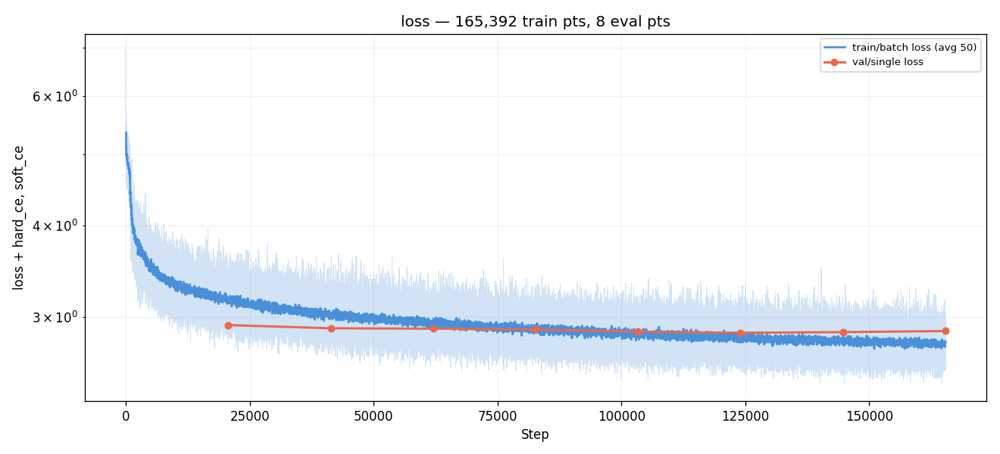
*Training loss over steps (log-y) — `loss`, `bin_ce`, and `stop_bce`
plotted together via the new multi-series CurveSpec. `bin_ce`
dominates `loss` (STOP BCE is ~1/400 of total by magnitude), so the
two blue curves overlay tightly; `stop_bce` sits flat near zero
throughout, signaling very low STOP-positive gradient because STOP
is only 0.28 % of training samples.*

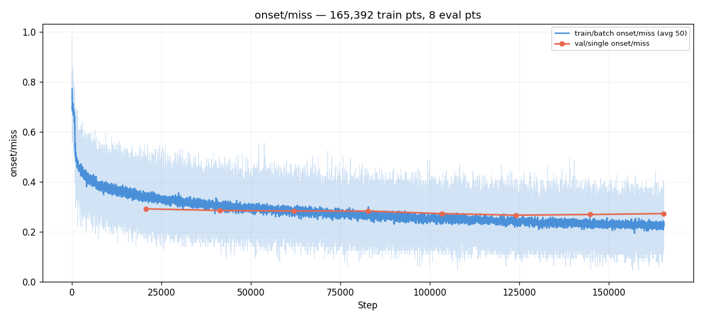
*Watched metric. 0.29 → 0.27 E1–E6, then regressed E7 (0.269) and E8
(0.273). `best.pt` is eval 6.*

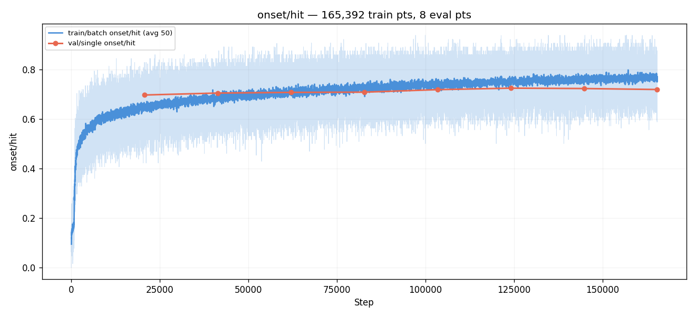
*HIT mirror-image of miss: 0.70 → 0.72 E1–E6 then fell back to 0.718.
Same shape, same turning point.*

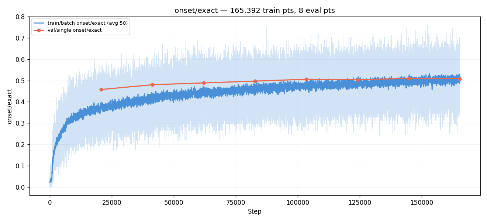
*EXACT (±0-bin) 0.46 → 0.51 monotonically across all 8 evals. Unlike
miss/hit, EXACT kept improving past E6 — the Gaussian target's
softer peak converged to bin-precision more slowly but never
regressed.*

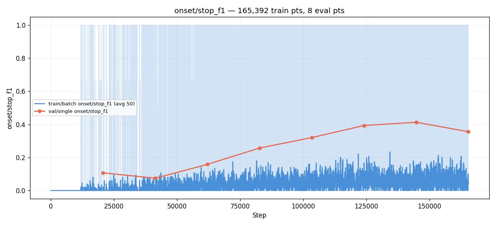
*STOP F1 climbed 0.11 → 0.41 E1–E7, then dipped to 0.36 at E8.
Precision held ~0.87–1.0 throughout; recall did all the moving (0.06
→ 0.27 → 0.22). Decoder argmax over raw logits keeps STOP from
winning against softmax-sharpened bin peaks.*

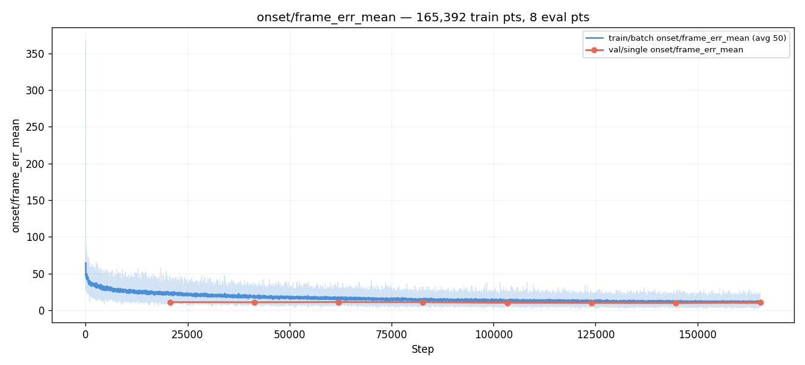
*Mean frame error across 8 evals: 11.00 → 10.00 → 9.80 → 10.42.
p90 sat at 31–33 bins every eval. The Gaussian never closed the
long-tail frame-error problem — same story as #002, which is part
of why the ratio-banding ridges also show up below.*

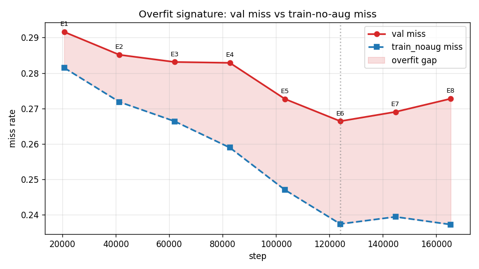
*Custom graph, **the key finding of this run.** val-miss vs
train_noaug-miss across 8 evals. train_noaug keeps dropping
monotonically (0.282 → 0.237) while val bottoms out at E6 (0.266)
and rises. The widening red-shaded gap is the overfitting signal —
invisible to #002, which had no augmentation-off diagnostic pass.*

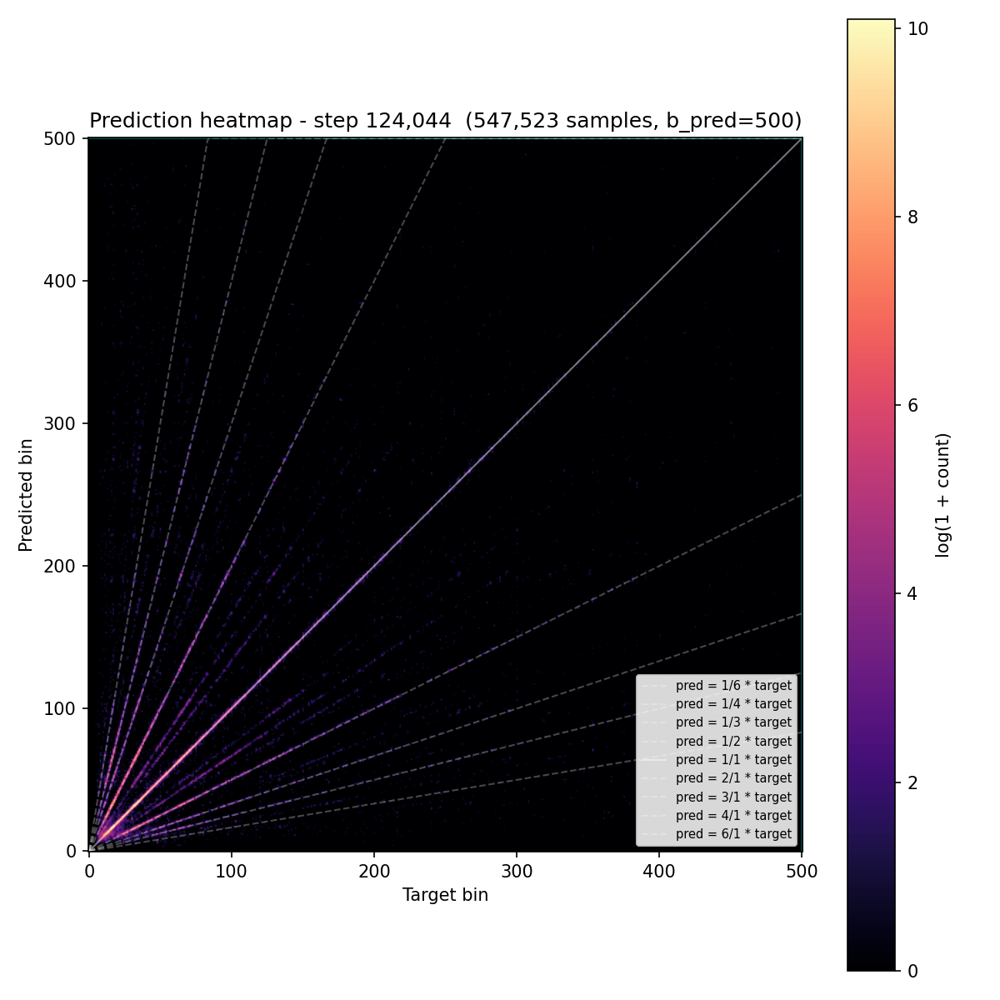
*Prediction heatmap at the best eval. Main diagonal dominant, some
mass above the diagonal at low targets (model slightly over-predicts
short gaps). Very similar to #002's heatmap shape.*

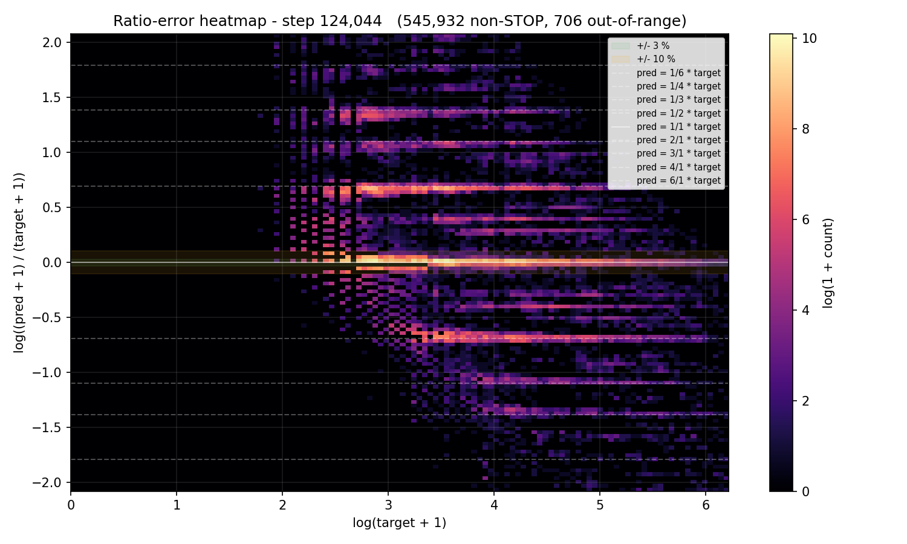
*Ratio-error heatmap. The same `±log 2` and `±log 3` banding ridges
#002 had are present — the Gaussian soft target did not eliminate
octave/triplet confusions, contrary to one of the pre-run
hypotheses.*

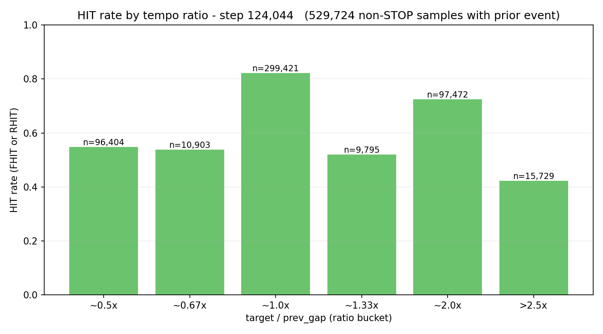
*HIT bucketed by `target / prev_gap`. Canonical buckets (0.5×, 1.0×,
2.0×) sit near #002's levels; polyrhythm buckets (0.67×, 1.33×,
>2.5×) are broadly similar. The Gaussian loss did not materially
change ratio-hit structure.*

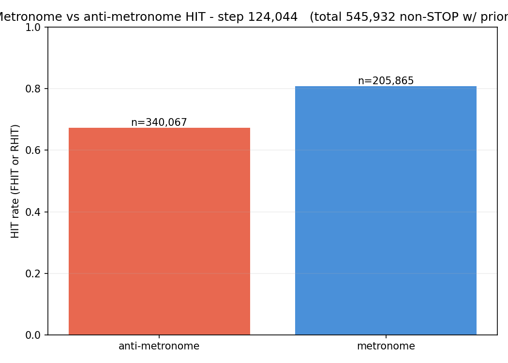
*Metronome vs anti-metronome HIT split. Gap is similar in size to
#002's at the equivalent training point; no significant change from
swapping the loss shape.*

## Vs prediction

- `val/single/onset/miss`: predicted 0.241–0.281 → actual **0.2664** → **match** (near the unfavorable edge).
- `val/single/onset/hit`: predicted 0.710–0.750 → actual **0.7239** → **match**.
- `val/single/onset/exact`: predicted ≥ 0.52 → actual **0.5032** → **miss** (below range).
- `val/single/onset/frame_err_p90`: predicted ≤ 31 → actual **32** → **miss** (wrong direction).
- `val/single/onset/pred_stop_rate`: predicted ≤ 0.01 → actual **0.0001 (FP-only metric)** → **match** but with an asterisk (metric is mislabeled; true pred-STOP-rate is ~0.0002, still ≤ 0.01 and a match).
- `val/single/onset/stop_f1`: predicted ≥ 0.55 → actual **0.3929** → **miss** (well below floor).

**Two of six predictions missed.** The miss/hit criterion (the
must-have) passed inside the ±2 pp band. The nice-to-have predictions
on `exact`, `frame_err_p90`, and `stop_f1` all landed below their
floors. The simpler loss **did not** improve any metric over #002;
where it moved numbers, they moved downward.

## Takeaways

- **The loss change barely affected headline metrics, and where it
  did, it made things slightly worse.** Best val miss 0.2664 vs
  #002's 0.2606 (+0.58 pp). Apples-to-apples at E8: miss +1.2 pp,
  hit −1.1 pp, exact −4.4 pp. The Gaussian soft target is a valid
  drop-in replacement that achieves comparable quality on the core
  metric, but it is not a win — the mixed hard/trapezoid-soft CE of
  #002 was not the limiting factor.
- **The decoupled STOP head collapsed at decode time.** stop_f1
  0.39 vs #002's 0.60 (−21 pp); stop_recall 0.25 vs 0.77 (−52 pp).
  Diagnosis: sigmoid-BCE-trained `stop_logit` doesn't reach the same
  magnitude as softmax-CE-trained bin logits, so the unified-argmax
  decoder almost never picks STOP. `no_future_audio` benchmark fires
  STOP at 93 %, proving the logit signal is learned; the argmax rule
  just loses on most normal samples. A decoder-level fix
  (`sigmoid(stop_logit) > threshold → STOP else argmax(bins)`) is
  the cheap next step — future experiment.
- **The Gaussian target did NOT fix the ratio-error banding.** The
  `±log 2` and `±log 3` ridges are still clearly visible in
  graph 09. The pre-run hypothesis that smooth-falloff soft targets
  might soften octave/triplet confusions did not hold. The banding
  is evidently a pattern-level phenomenon that per-sample loss
  shape does not address.
- **We got a clean overfitting diagnosis for the first time.**
  Graph 07 shows val-miss bottoming out at E6 while `train_noaug`
  keeps dropping smoothly through E8 — unambiguous early-stage
  overfitting. #002's flat-val-past-E5 shape, which we read as
  "plateau", was almost certainly overfitting too; we just couldn't
  see it without the augmentations-off pass. This changes how we
  read every past taiko run. The augmentation set was doing
  regularization work; the underlying model was being pulled toward
  the training distribution faster than the val distribution.
- **Recommendation: do not adopt this loss.** It solves no problem
  and regresses on bin-precision, frame-error, and STOP metrics.
  Keep #002's `OnsetLoss` as the default. Run closed.

## Followup questions

- **Is the overfitting a dataset-structure issue (cursor overlap) or
  a training-duration issue?** The current setup has
  `allowed_overlap = 0` — every event cursor is a training sample,
  so samples are heavily correlated. An overlap-filtered dataset
  (~10× smaller, essentially independent samples) trained for
  proportionally more epochs would test whether the widening
  train/val gap reflects "model sees the same scene too many times
  within an epoch" vs "model has simply trained too long". Natural
  exp 006 candidate.
- **Does the decoder-fix `sigmoid(stop_logit) > threshold → STOP`
  recover STOP recall on #005's weights?** Cheap to check post-hoc:
  load `best.pt` and re-run val with the alternate decoder; compare
  `stop_f1`. If STOP recovers cleanly, it confirms the scale-
  mismatch diagnosis and validates the decoder fix as a future path.
  No retraining needed.
- **What does a STOP-logit histogram look like at a converged model?**
  Split `sigmoid(stop_logit)` by target-is-STOP vs target-is-bin on
  val. If the two distributions are bimodal with a clean threshold
  between them, the decoder fix would close STOP recall. If they
  overlap heavily, the BCE saturated too early and the decoder fix
  won't help — the real issue is then pos_weight calibration.
  Artifact to add in exp 006.
- **Would a tighter σ recover bin precision?** `sigma_bins=1.0` (or
  0.5) would peak the Gaussian harder and might close the `exact`
  gap. Cheap one-knob ablation; worth running alongside the decoder
  fix if we ever revisit this loss family.
