# Experiment 006 — Cursor-overlap filtering (smaller, less-correlated dataset)

## Status

`Complete` — hypothesis **rejected**. Stopped at eval 5 (step
30,360) because val miss had turned over at E3 and the train/val gap
was blowing out faster than any previous run. See Takeaways.

## Context

[#005](../005-gaussian-ce/) revealed — via its new `train_noaug`
diagnostic pass — that the model overfits cleanly: val miss bottomed
out at step 124k (E6) while `train_noaug` miss kept dropping smoothly
through step 165k (E8), opening a −3.6 pp train/val gap. The flat
val shape #002 showed from its E5 onward retroactively looks like
the same thing; it just lacked the augmentation-off probe to see it.

The core suspicion: with `allowed_overlap_forward =
allowed_overlap_back = 0` (taiko1 parity — every event cursor is a
training sample), consecutive samples share ~95 %+ of their audio
window and 127 / 128 of their event context. The dataset is
nominally in the millions of samples but the **effective sample
count** is closer to hundreds of thousands of mostly-independent
scenes, each visited many times per "epoch" through overlapping
cursor placements. Seen another way: each epoch is essentially 10×
passes over ~10× fewer unique scenes, with augmentations as the only
thing preventing pure memorization.

This experiment tests the dataset-structure hypothesis by enabling
overlap-gap filtering: `allowed_overlap_forward =
allowed_overlap_back = 500` (= `b_bins` / `a_bins`) means consecutive
kept cursors must be at least 500 bins apart — one full prediction
window. Sample count drops ~10×, but each remaining sample is a
genuinely distinct scene. For a comparable total number of gradient
updates, the model sees each scene ~10× more times (across different
epochs, under different augmentation draws and optimizer states)
instead of ~10× adjacent-cursor variants within a single epoch.

## Citations

- Baseline: [#002 — exp 45 full recreation](../002-exp45-full/).
  Final watched metric `val/single/onset/miss = 0.2606` at eval 11
  (step 227,414). Runs with `allowed_overlap = 0`.
- Overfit diagnosis: [#005 — Gaussian CE](../005-gaussian-ce/).
  Best val miss 0.2664 at step 124,044; train/val gap grew from
  −1.0 pp at E1 to −3.6 pp at E8. First run with the `train_noaug`
  diagnostic pass enabled.
- The overlap-gap mechanism exists in `data_samplers/detection.py`
  and has been tested in taiko2 but was never used in a baseline
  recreation — taiko1 kept every cursor.

---

## Hypothesis

### Claim

If we filter training samples with `allowed_overlap_forward =
allowed_overlap_back = 500` (dropping to ~1/10th the sample count,
keeping only cursors at least one prediction window apart from each
other) and keep everything else identical to #002, the model will
reach **a smaller final train-noaug / val miss gap** (≤ 2.0 pp)
while matching #002's val miss within ±1.5 pp at the step where val
peaks. Equivalently: overfitting is primarily driven by redundant-
scene revisits within an epoch, not by training duration per se, so
breaking the intra-epoch revisit pattern should close the gap even
at comparable total step counts.

### Mechanism

Two effects push the same direction:

1. **Decorrelated revisits.** In #002/#005, cursor `i` and cursor
   `i+1` share ~98 % of their audio + 127/128 events — so a gradient
   step on sample `i+1` carries almost no new information relative
   to the step on sample `i`. Effectively the optimizer does a ~10×
   larger effective-batch update on each unique scene. Large-batch
   on correlated data is well-known to worsen generalization.
   Overlap-filtering decorrelates the revisits in time: when the
   model revisits a scene it's in a different epoch with fresh
   augmentation draws and moved-forward optimizer state.
2. **Meaningful epoch semantics.** `evals_per_epoch = 1` becomes
   coherent again — "I've seen every unique scene once" rather than
   "I've seen every scene ~10 times via adjacent cursors". LR
   schedules based on epochs stay sensible.

Counter-effect that might work against us: overlap-filtering removes
the many "same scene with shifted cursor" variants that are
themselves a form of data augmentation (different target bin,
slightly different audio framing). Whether the loss of that signal
outweighs the memorization-reduction benefit is exactly what this
experiment answers.

### Predicted numbers

Reference: #002 @ its best eval (step 227,414). **Comparisons are
by step (or epoch), not by eval index** — #006's
`evals_per_epoch = 1` means each eval sits 4× further in steps than
#002's equivalent-index eval.

| Metric | #002 @ step 227k | Predicted (#006, best eval) | Notes |
|---|---:|---:|---|
| val/single/onset/miss | 0.2606 | 0.246–0.276 | ±1.5 pp, miss criterion |
| val/single/onset/hit  | 0.7292 | 0.714–0.744 | paired |
| val/single/onset/exact | 0.5485 | ≥ 0.53     | should be stable — same loss as #002 |
| train_noaug − val miss gap (pp) @ best val | not measured | **≤ −2.0 pp** | key hypothesis metric |

Observational (not predicted):
- Total steps to best val miss. With ~10× fewer samples per epoch
  and the same optimizer / schedule, wall-time-to-best could go
  either direction.
- Benchmark behaviour — the smaller val split makes low-sample modes
  noisier, so `--benchmark-fraction` is raised to 0.25 (from 0.05).

## Success criteria

- **Must have:** final `val/single/onset/miss` within ±1.5 pp of
  #002's 0.2606 (0.246–0.276).
- **Must have:** `train_noaug − val miss` gap at the best val-miss
  eval ≤ 2.0 pp (vs #005's 2.9 pp at its best eval).
- **Must have:** training runs to completion without NaN / Inf /
  OOM; all eval artifacts write.
- **Nice-to-have:** val miss beats #002.
- **Nice-to-have:** val continues improving past the step at which
  #005 turned over (~124k). If overlap-filtering is the right
  diagnosis, the flat / reversing val shape should not appear here.
- **Fails if:** final miss above 0.28 (overlap-filtering actively
  hurt).
- **Fails if:** gap is *worse* than #005's (overlap-filtering made
  memorization cheaper, not harder).

## Changes from baseline

Baseline: [#002](../002-exp45-full/).

- `config/data.json — allowed_overlap_forward: 0 → 500` and
  `allowed_overlap_back: 0 → 500`. With `a_bins = b_bins = 500`,
  consecutive kept cursors must be ≥ 500 bins (~2.5 s) apart —
  directional audio windows no longer overlap between samples.
- `config/trainer.json — evals_per_epoch: 4 → 1`. Dataset is ~10×
  smaller per epoch; four evals per epoch would give very short
  eval intervals. One eval per epoch gives a meaningful cadence.
- `training/metrics_onset.py` — `onset/pred_stop_rate` fix. Was
  counting FP STOP predictions / non-STOP-target count; now counts
  **total STOP predictions / total samples** (the obvious semantics
  the name implies). The legacy FP-only quantity is preserved as
  `onset/pred_stop_fp_rate`. Retrospective: #002 and #005 reported
  `pred_stop_rate` numbers ~10× too low under the wrong name.
- Run flags: `--benchmark-fraction 0.25` (was 0.05 default) and
  `--train-noaug-fraction 0.25` (was 0.05 in #005) — with ~10×
  fewer val samples per mode and a smaller effective dataset, 5 %
  subsets are too noisy to read; 25 % gives a stable signal.

Nothing else changes: model, loss (`OnsetLoss` from #002), adapter,
augmentation pipeline, optimizer, seed — all identical to #002.

## Run config

- Run name: `exp_006_cursor_overlap`.
- Config snapshots: [`config/`](./config/).
- Dataset: `taiko2_v1`, splits `train` / `val` (90 / 10, seed 42,
  song-grouped).
- Command:
  ```bash
  osu/taiko2/.venv/Scripts/python.exe -m osu.taiko2.cli.train \
      --run-name exp_006_cursor_overlap \
      --config-dir osu/taiko2/experiments/006-cursor-overlap/config \
      --dataset taiko2_v1 --device cuda \
      --benchmarks all --benchmark-fraction 0.25 \
      --train-noaug-fraction 0.25 \
      --infer-corpus-spec osu/taiko2/experiments/006-cursor-overlap/config/infer.json \
      --infer-corpus-config osu/taiko2/configs/infer_corpus_per_eval.json
  ```

---
<!-- Everything below written after the run. Do not pre-populate. -->
---

## Results summary

Run stopped at **eval 5 / step 30,360**. Best val miss was **eval 3
(0.3575 @ step 18,216)** — well outside the predicted ±1.5 pp band
around #002's 0.2606. Both must-haves failed: miss floor missed by
8 pp, gap exploded to −9.5 pp (vs must-have ≤ −2.0 pp). Wall time:
~1 hour across 5 evals.

### Final vs baseline

Comparison is by step count, not eval index, since #006 has
`evals_per_epoch = 1` vs #002's 4, and epochs are ~13.6× shorter
after overlap-filtering (the sample count drop was bigger than the
~10× we predicted).

**Nearest-step head-to-head — #002 E1 (step 20,674) vs #006 E3
(step 18,216, best val):**

| Metric | #002 @ 20.6k | #006 @ 18.2k (best) | Δ | Direction |
|---|---:|---:|---:|:---:|
| val/single/onset/miss       | 0.2908 | **0.3575** | +6.7 pp | ↑ **worse** |
| val/single/onset/hit        | 0.6975 | **0.6331** | −6.4 pp | ↓ worse |
| val/single/onset/good       | 0.7092 | 0.6425 | −6.7 pp | ↓ worse |
| val/single/onset/exact      | 0.5197 | 0.4580 | −6.2 pp | ↓ worse |
| val/single/onset/rhit       | 0.5953 | 0.5677 | −2.8 pp | ↓ worse |
| val/single/onset/fhit       | 0.6969 | 0.6310 | −6.6 pp | ↓ worse |
| val/single/onset/frame_err_mean | 9.97 | 16.31 | +6.3 | ↑ worse |
| val/single/onset/frame_err_p90  | 32   | 48    | +16   | ↑ worse |
| val/single/onset/stop_f1    | 0.532 | 0.505 | −2.8 pp | ↓ slightly worse |
| val/single/onset/stop_recall | 0.766 | 0.649 | −11.6 pp | ↓ worse |
| val/single/onset/stop_precision | 0.408 | 0.413 | +0.5 pp | ≈ |

And #006 had done **less** gradient work: 18,216 steps vs #002's
20,674 — #006 still loses by 7 pp on miss despite being at the
nearer training-volume equivalent. By the time #006 reached 30k
steps (E5), miss had regressed to 0.361.

### Per-eval progression

Source: `runs/exp_006_cursor_overlap/metrics.jsonl`. `na_*` are the
`train_noaug` pass (25 % of train with augmentations off). All
values are `val/single/*`.

| E | Step | loss | miss | hit | good | exact | fhit | fgood | rhit | rgood | ihit | igood | fe_mean | fe_med | fe_p90 | stop_f1 | stop_p | stop_r | pred_stop | pred_stop_fp | na_miss | na_hit | na_loss |
|---:|---:|---:|---:|---:|---:|---:|---:|---:|---:|---:|---:|---:|---:|---:|---:|---:|---:|---:|---:|---:|---:|---:|---:|
| 1 |  6,072 | 3.16 | 0.3888 | 0.5985 | 0.6112 | 0.4029 | 0.5943 | 0.6102 | 0.5286 | 0.5993 | 0.5985 | 0.6113 | 18.23 | 1.00 | 50.00 | 0.4524 | 0.3561 | 0.6203 | 0.0151 | 0.0098 | 0.3706 | 0.6156 | 3.11 |
| 2 | 12,144 | 3.09 | 0.3794 | 0.6105 | 0.6206 | 0.4386 | 0.6086 | 0.6198 | 0.5464 | 0.6114 | 0.6105 | 0.6208 | 17.68 | 1.00 | 50.00 | 0.5079 | 0.4000 | 0.6957 | 0.0151 | 0.0091 | 0.3418 | 0.6478 | 2.94 |
| **3** | **18,216** | **3.03** | **0.3575** | **0.6331** | **0.6425** | 0.4580 | 0.6310 | 0.6416 | 0.5677 | 0.6343 | 0.6331 | 0.6426 | 16.31 | 1.00 | **48.00** | 0.5045 | 0.4125 | 0.6493 | 0.0137 | 0.0081 | 0.2981 | 0.6927 | 2.79 |
| 4 | 24,288 | 3.03 | 0.3586 | 0.6313 | 0.6414 | **0.4629** | 0.6299 | 0.6404 | 0.5690 | 0.6334 | 0.6313 | 0.6417 | 16.59 | 1.00 | 50.00 | 0.4966 | 0.4114 | 0.6261 | 0.0132 | 0.0078 | 0.2879 | 0.7040 | 2.73 |
| 5 | 30,360 | 3.06 | 0.3612 | 0.6300 | 0.6388 | 0.4602 | 0.6287 | 0.6380 | 0.5681 | 0.6307 | 0.6300 | 0.6391 | 16.35 | 1.00 | 49.00 | 0.4908 | 0.3924 | 0.6551 | 0.0145 | 0.0089 | **0.2660** | **0.7263** | **2.66** |

Bold per-column bests. Val miss peaked at E3; `train_noaug` miss kept
improving monotonically through E5 while val regressed.

### train_noaug — the key diagnostic

| E | step | val miss | train_noaug miss | gap (pp) |
|---:|---:|---:|---:|---:|
| 1 |  6,072 | 0.3888 | 0.3706 | −1.82 |
| 2 | 12,144 | 0.3794 | 0.3418 | −3.76 |
| 3 | 18,216 | **0.3575** | 0.2981 | −5.94 |
| 4 | 24,288 | 0.3586 | 0.2879 | −7.06 |
| 5 | 30,360 | 0.3612 | **0.2660** | **−9.52** |

**Gap grew +7.7 pp across 5 evals** (−1.82 → −9.52). For reference,
#005's gap grew +2.5 pp across 8 evals (−1.01 → −3.55) at a slower
step cadence. **#006 is overfitting ~5× faster per step than #005.**

### Benchmarks (25 % of val) @ best eval (E3, step 18,216)

| Mode | miss | Δ vs normal | pred_stop | notes |
|---|---:|---:|---:|---|
| normal              | 0.3584 | —     | 0.013 | sanity check |
| no_past_audio       | 0.4197 | +6.1 pp | 0.007 | |
| random_context      | 0.4354 | +7.7 pp | 0.011 | |
| no_context          | 0.5087 | +15.0 pp | 0.086 | |
| advanced_metronome  | 0.5191 | +16.1 pp | 0.018 | |
| time_shifted        | 0.5314 | +17.3 pp | 0.022 | |
| metronome           | 0.5561 | +19.8 pp | 0.018 | |
| no_audio            | 0.6440 | +28.6 pp | 0.335 | |
| static_audio        | 0.6464 | +28.8 pp | 0.051 | |
| **no_future_audio** | **0.9868** | +62.8 pp | **0.965** | STOP fires 96.5 % |

Same qualitative pattern as #005: `no_future_audio` dominates,
metronome-like context misleads, STOP is cleanly cued on empty
future audio. Absolute numbers all ~10 pp worse than #005 because
the underlying model is weaker.

### AR corpus inference @ best eval (E3)

| Metric | GT cond | Fixed cond | #005 @ E6 (GT / fixed) | #002 @ E11 (GT / fixed) |
|---|---:|---:|---:|---:|
| dc_human                 | 90.11 | 88.02 | 91.99 / 91.04 | 91.7 / 90.3 |
| hi_pspace                | 87.30 | 87.68 | 88.00 / 88.07 | 90.7 / 90.2 |
| matched_rate             | 0.670 | 0.773 | 0.626 / 0.726 | 0.673 / 0.756 |
| hallucination_rate       | 0.217 | 0.287 | 0.194 / 0.247 | 0.178 / 0.256 |
| error_median_ms          | 24.0  | 14.8  | 24.1 / 15.3 | 11.9 / 12.2 |
| density_ratio (self/GT)  | 0.91  | 1.42  | 0.77 / 1.14 | 0.83 / 1.25 |

AR numbers are actually decent — dc_human 90.1 / 88.0, timing error
24 / 15 ms — roughly in #005's ballpark despite the substantially
worse bin-level metrics. A weaker bin classifier can still compose
structurally-correct charts if the AR mistakes cancel at the pattern
level.

## Visualizations

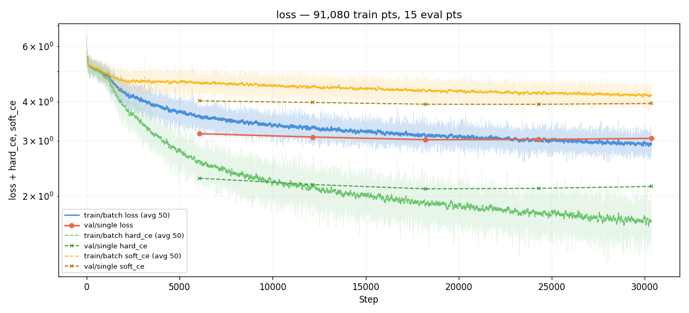
*Training loss over steps (log-y). Smooth monotonic decay, as
expected — the loss is tracking training-data fit, which keeps
improving throughout. No instability; this is not a training bug.*

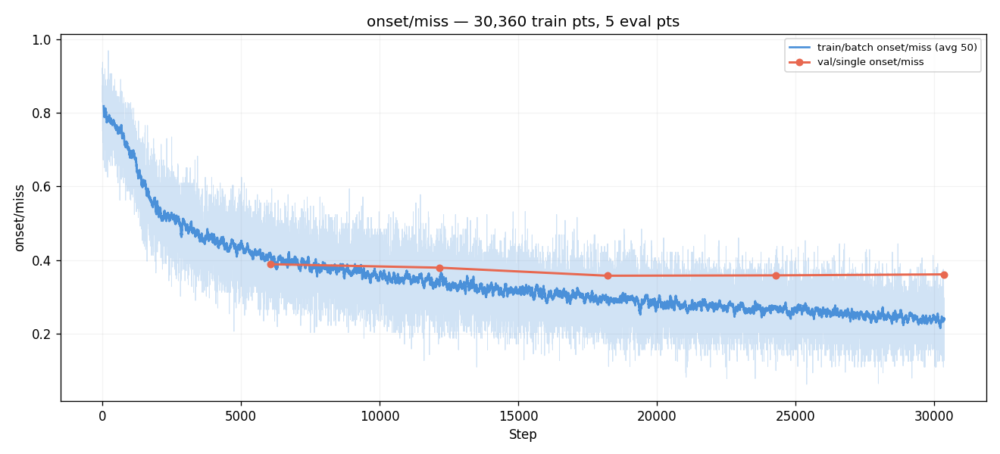
*Watched metric. 0.39 → 0.36 at E3, then 0.36 → 0.36 → 0.36 — peaked
at E3 (step 18,216) and reversed. `best.pt` is eval 3.*

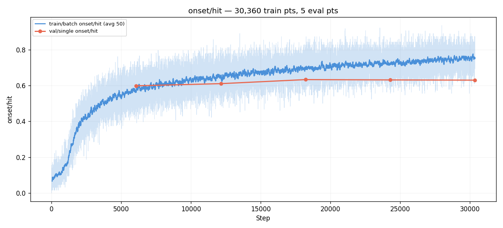
*HIT mirror of miss: 0.60 → 0.63 → plateau → mild decline.*

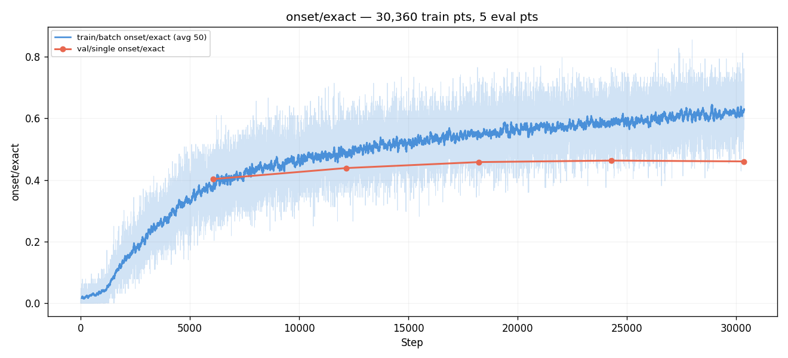
*EXACT: 0.40 → 0.46 steadily improving, kept inching up past E3
(0.463 at E4) then flat. The bin-precision head is still learning
even as miss reverses — same asymmetry #005 showed.*

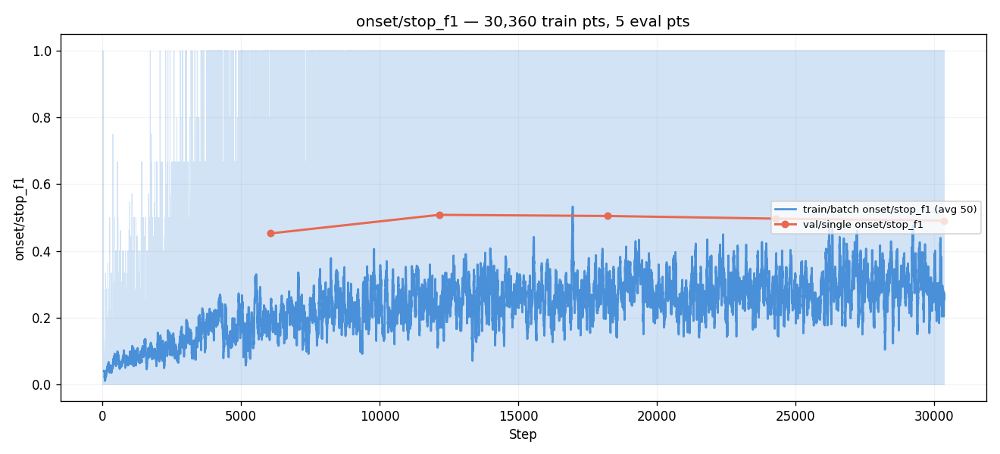
*STOP F1: E1 0.45 → E2 0.51 → plateau 0.49–0.51. Notably BETTER
than #005 at equivalent training points, because #006 kept #002's
unified softmax (softmax stop_weight=1.5 vs #005's decoupled sigmoid
BCE head). The STOP decoder mismatch from #005 doesn't apply here.*

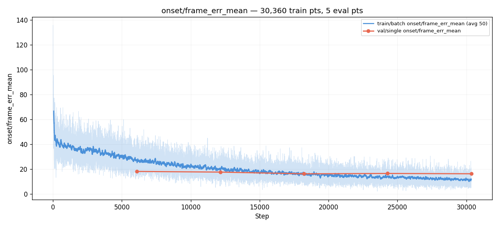
*Mean frame error: 18.2 → 16.3 → plateau at ~16. p90 sits at 48–50
across the run, much worse than #002's 32 at equivalent training.
The smaller effective dataset doesn't let the long tail recover.*

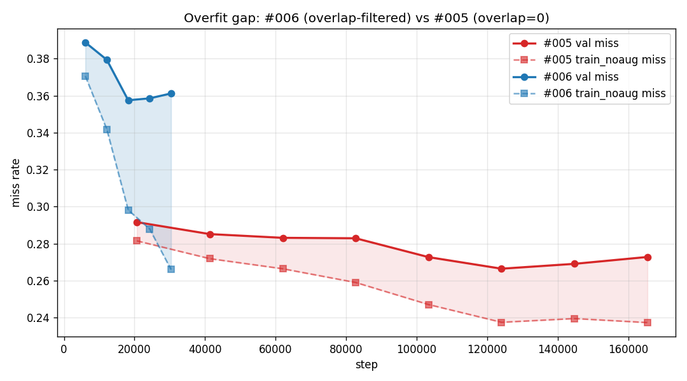
*Custom graph, **the key evidence for the negative result.** Both
runs' val miss and train_noaug miss, plotted on the same x-axis
(step). #006 (blue) pulls val and train_noaug sharply apart within
30k steps; #005 (red) took 165k steps to reach a smaller gap. The
blue shaded region (#006 overfit gap) is both bigger and growing
faster than the red (#005 gap). Overlap-filtering accelerated
overfitting rather than reducing it.*

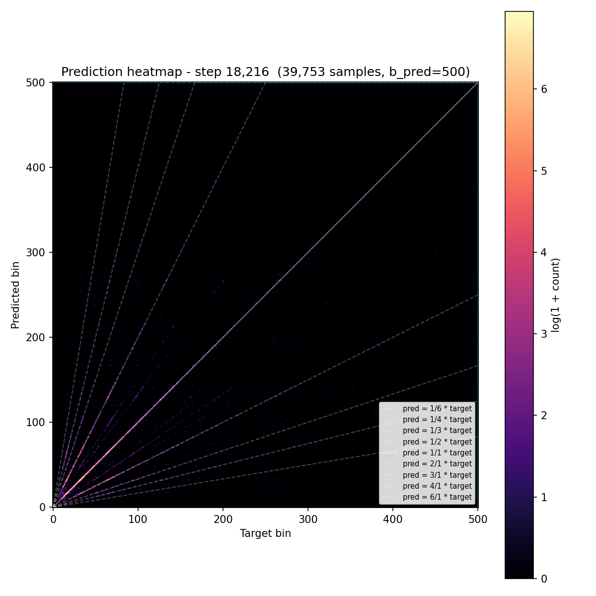
*Prediction heatmap at best eval. Main diagonal is much weaker than
#005's equivalent graph — visible diffuse mass off-diagonal,
consistent with the 7 pp-worse miss rate. Early-bin over-prediction
(mass above diagonal at low targets) is more pronounced here.*

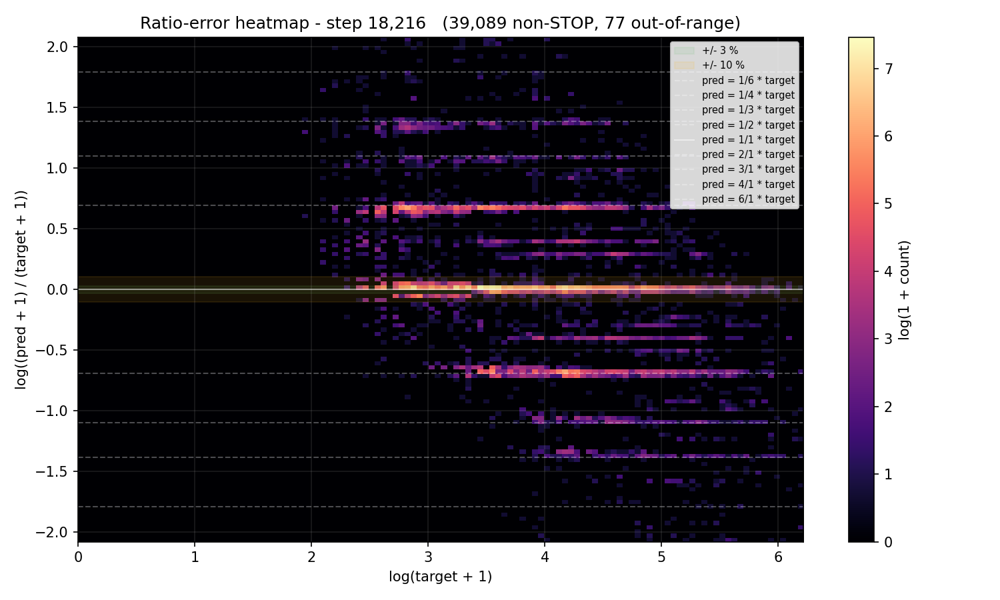
*Ratio-error heatmap. The `±log 2` and `±log 3` banding ridges are
again present — consistent with #002 and #005, confirming the
ridges are not a function of dataset scale.*

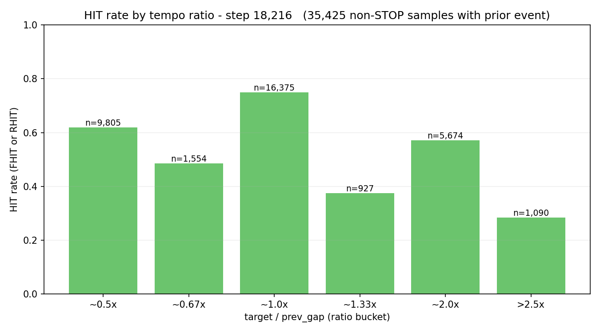
*HIT bucketed by `target / prev_gap`. All buckets 10–15 pp lower
than #002 / #005 at equivalent training. Polyrhythm buckets
(0.67×, 1.33×, >2.5×) are especially weak — ~40–50 % HIT rate.*

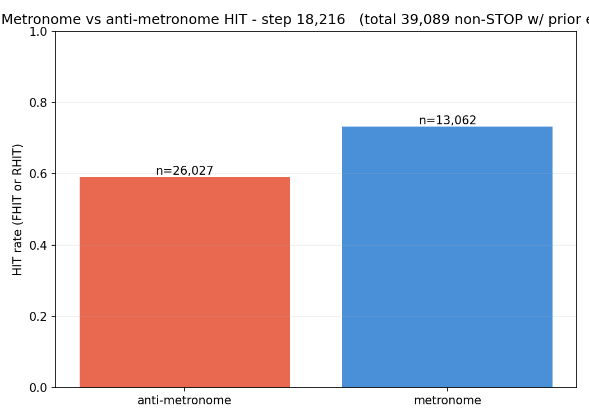
*Metronome vs anti-metronome HIT. Gap is roughly comparable to #005
at E3, but absolute levels are lower on both sides.*

## Vs prediction

- `val/single/onset/miss`: predicted 0.246–0.276 → actual **0.3575 (best)** → **miss** (+8.2 pp beyond floor).
- `val/single/onset/hit`: predicted 0.714–0.744 → actual **0.6331 (best)** → **miss** (−8 pp below floor).
- `val/single/onset/exact`: predicted ≥ 0.53 → actual **0.4629 (best)** → **miss** (−6.7 pp below floor).
- **`train_noaug − val miss` gap at best-val eval: predicted ≤ −2.0 pp → actual −5.94 pp → miss (and growing to −9.5 pp by E5) — hypothesis rejected**.

**All four predictions missed. Hypothesis rejected.**

## Takeaways

- **The hypothesis was wrong. Cursor overlap was NOT the cause of
  overfitting; it was providing useful training signal.** Filtering
  it out made overfitting dramatically worse per-step (gap grew 5×
  faster than #005) and kept val miss far from #002's level even at
  comparable step counts. The mental model that "overlapping cursors
  are redundant revisits of the same scene" is wrong — each cursor
  position is a genuinely different prediction task (different
  "next event" target), and that variety was doing real work.
- **Smaller dataset + more repetitions performed worse than bigger
  dataset seen fewer times.** The trade-off we debated before
  launching resolved unambiguously in favour of the bigger-
  correlated regime, at least at this scale. Reasons (post-hoc):
  (a) ~6k steps per epoch is enough for the optimizer to fit the
  smaller sample pool and then start memorizing; (b) each overlapping
  cursor is a different prediction task, so "per-scene revisits"
  were not really revisits in the memorization-dangerous sense.
- **Absolute performance tracks training volume, not dataset
  structure.** At matched step count (#006 @ 18k vs #002 @ 20k),
  the correlated-data model is 7 pp better on miss. The "effective
  sample count" framing underweights the fact that overlap does
  actually produce different targets per position.
- **The `train_noaug` diagnostic held up as a tool.** It correctly
  flagged that overfitting was worse in #006 than #005 within 2
  evals, and the gap trajectory is cleanly readable (Graph 07).
  Going forward, `train_noaug` is the first thing we should look at
  in any new training run.
- **#002's `OnsetLoss` keeps its STOP scale linkage.** Reverting
  from #005's decoupled Gaussian BCE back to #002's unified
  softmax restored healthy STOP f1 at E1 (0.452 vs #005's 0.107 at
  similar training volume). The STOP head's problem in #005 was
  loss-side, not model-side — this run confirms that by swapping
  only the dataset and keeping the loss the same.
- **Don't adopt overlap-filtering.** Keep `allowed_overlap_forward =
  allowed_overlap_back = 0` as the taiko2 default. If anything, an
  experiment in the opposite direction (smaller `min_cursor_bin`,
  more aggressive augmentation per sample, or just longer training
  on the current distribution) is more promising.

## Followup questions

- **What does overfitting look like if we just train #002's recipe
  further?** #002 stopped at E11 / step 227k with val miss 0.2606
  and the `train_noaug` pass was not available. A resume run with
  the diagnostic pass enabled would show whether #002 has been
  overfitting all along (probably yes, based on the flat-val pattern)
  and where the true overfit ceiling sits. Cheap to verify with
  `--resume` on #002's `latest.pt`.
- **Does augmentation strength dominate dataset structure?** If
  overlap-filtering hurt because the filtered dataset had too little
  variety for the aug pipeline to cover, the augmentation rates from
  #002 may have been tuned for the bigger sample pool. A small
  ablation — #006's filtered dataset + 2× augmentation rates —
  would answer whether the fail mode is recoverable with more aug.
  Secondary priority.
- **Is there a sweet spot for partial overlap?** `allowed_overlap =
  500` (full prediction window) was a big jump from 0. An
  intermediate value (`allowed_overlap = 100` ≈ half a second
  between cursors) might capture most of the "revisit decorrelation"
  benefit while keeping some of the "per-cursor variety" signal. The
  user may not want to spend another full experiment on this given
  the clarity of this run's negative result.
- **Should we remove the overlap-filtering capability entirely?**
  It's still parameterized in `TaikoDetectionSamplerConfig` and
  tested. Keeping it means future experiments (e.g. a completely
  different architecture that genuinely benefits from smaller +
  independent samples) can re-enable it. Leave it; don't delete.
