# Experiment 007 — Time-stretch augmentation

## Status

`Complete` — both must-haves met (one marginally), but the must-haves
oversold the result. Per-step improvement vs #002 is ~1 pp; the full
2 pp delta requires running ~60 % more steps. Time-stretch is a real
positive-but-modest regularizer. **Banding and overfitting were not
solved.** Adopt as default; not the breakthrough.

## Context

Across [#002](../002-exp45-full/), [#005](../005-gaussian-ce/), and
[#006](../006-cursor-overlap/), two ceilings stayed locked:

1. The `±log 2` / `±log 3` ridges in the `ratio_error` heatmap —
   classic octave / triplet / half-speed confusions the per-sample
   loss cannot discriminate between.
2. Val miss stuck in the 0.26–0.29 band, with the `train_noaug`
   diagnostic added in #005 showing clean overfitting (gap widens
   while val flattens).

#006 tested whether reducing intra-epoch cursor correlation helped;
it made overfitting worse, confirming that removing per-cursor
variety hurts rather than helps. The signal the model WANTS but
doesn't have: tempo-invariance. Two charts where all events have
been uniformly time-scaled by 1.25× are musically the same rhythm
at different speeds — but in the training set, each of those
scalings would be a distinct chart, and the model has no way to
relate them. That mirror's the tempo-CNN literature's finding
(Schreiber 2018) that scale-invariant audio augmentation is the
single strongest intervention for octave errors in onset/tempo
tasks.

This experiment adds a `TimeStretch` post-sample augmentation that
per-sample draws a stretch factor log-uniformly from `[1/1.4, 1.4]`
and rescales both the mel window and past/future event offsets
around the cursor. The rest of the recipe is identical to #002.

## Citations

- Baseline: [#002 — exp 45 full recreation](../002-exp45-full/).
  Best val miss 0.2606 at eval 11 (step 227,414). Same loss, model,
  adapter, dataset that #007 inherits.
- `train_noaug` diagnostic source: [#005 — Gaussian CE](../005-gaussian-ce/).
  First run with the augmentation-off training probe; revealed the
  overfit signature retroactively visible in #002.
- Recent negative result: [#006 — cursor-overlap filtering](../006-cursor-overlap/).
  Confirmed that reducing intra-epoch revisit redundancy hurts;
  overfitting is not a revisit-count problem, it's a data-variety
  problem.
- MIR precedent (unlinked, domain knowledge): mel-frame time-stretch
  at ±40 % is the canonical data-aug trick for tempo-invariance and
  octave-confusion reduction on onset networks.

---

## Hypothesis

### Claim

If we add a per-sample `TimeStretch(prob=0.3, max_scale=1.4)`
augmentation to #002's pipeline and keep everything else identical,
the watched metric `val/single/onset/miss` will reach a best value
at least 1.5 pp BELOW #002's 0.2606 (i.e. ≤ 0.246) **and** the
train_noaug − val miss gap at that best eval will be ≤ 2.0 pp,
because exposing the model to rescaled versions of its training
distribution directly attacks the tempo-invariance gap that is the
most likely cause of both the ratio-banding ridges and the
generalization ceiling.

### Mechanism

Two effects, stacked:

1. **Ratio-banding attack.** The `±log 2` ridge in #002's
   `ratio_error.png` is where the model, given a context with
   dominant gap `g`, predicts the target onset at `g`, `2g`, or
   `g/2` instead of the true value. This is exactly tempo confusion:
   the model has seen versions of the same musical pattern at
   different absolute speeds, but not relative to each other. Time-
   stretching training samples by factor `s` in `[1/1.4, 1.4]`
   forces the model to make consistent predictions across ±40%
   speed variants of the same local context, which should directly
   compress these ridges.
2. **Effective dataset growth.** Each training sample, per pass,
   becomes a family of stretched variants (up to ~40% faster or
   slower). This is pure data diversification — the sample the
   model sees at step N is a different numerical tensor from the
   same sample at step N+epoch, because the stretch factor was
   re-drawn. Memorization cost goes up; generalization should
   improve.

Both effects should reduce the train_noaug / val gap. The first
attacks the specific failure mode visible in artifact graphs; the
second is the generic "more aug = less overfit" story.

### Predicted numbers

Reference: #002 @ best eval (E11, step 227,414):

| Metric | #002 @ E11 | Predicted (#007, best eval) | Notes |
|---|---:|---:|---|
| val/single/onset/miss | 0.2606 | **≤ 0.246** | must-have, ≥ 1.5 pp improvement |
| val/single/onset/hit  | 0.7292 | ≥ 0.744     | paired with miss |
| val/single/onset/exact | 0.5485 | ≥ 0.54 | modest drop acceptable (slight smoothing from interpolation) |
| val/single/onset/frame_err_p90 | 31 | ≤ 28 | tail should shrink if octave errors fall |
| train_noaug − val miss gap (pp) @ best val | unknown for #002 | **≤ −2.0 pp** | hypothesis metric |

Artifact-level predictions (observational, not gated on numbers):

- `ratio_error.png` at best eval should show the `±log 2` ridge
  visibly compressed vs #002's. Same for `±log 3` (triplet ridge),
  though less confidently — triplet rescaling is further outside
  the aug's range.
- `train_noaug/ratio_error.png` (new side-by-side wiring from the
  loop change in this run) should look cleaner than val's, telling
  us whether stretching reduced the ridge on TRAIN (which it
  trivially should if the aug does anything) while we watch whether
  it also reduces it on VAL (the generalization question).

## Success criteria

- **Must have:** final `val/single/onset/miss` ≤ 0.246 (≥ 1.5 pp
  improvement over #002's 0.2606).
- **Must have:** `train_noaug − val miss` gap at the best val eval
  ≤ 2.0 pp.
- **Must have:** training runs to completion without NaN / Inf /
  OOM; all eval + train_noaug artifacts write.
- **Nice-to-have:** visibly narrower `±log 2` ridge in
  `ratio_error.png` vs #002's graph 08.
- **Nice-to-have:** val miss continues improving past the #002 E11
  step count (suggests the augmentation lifted the ceiling, not
  just shifted where training plateaus).
- **Fails if:** final miss > 0.2606 (time-stretch hurt the baseline).
- **Fails if:** `train_noaug − val` gap wider than #002's at a
  comparable step (time-stretch made overfit worse, like #006).

## Changes from baseline

Baseline: [#002](../002-exp45-full/).

- CLI flag: `--time-stretch-prob 0.3 --time-stretch-max-scale 1.4`.
  The `TimeStretch` aug is prepended to the post-augmentation list
  so subsequent event-level augs (EventJitter, dropout, etc.) see
  the stretched sample.
- `training/augmentations.py` — new `TimeStretch` class. Linear
  interpolation on the mel time axis with cursor pinned; event
  `cursor_offset` multiplied by the per-sample scale factor with
  `time_ms` / `bin` recomputed consistently; past events falling
  outside `[-a_bins, 0]` masked as padding; STOP flips propagate
  through the adapter from the scaled future-event offset vs
  `b_pred`.
- `training/loop.py` — eval-artifact save now also runs on the
  `train_noaug` pass (lands under `{run_dir}/eval_{step}/train_noaug/`),
  so we can directly compare val and train-noaug versions of
  `heatmap`, `ratio_error`, `ratio_hit`, `metronome`, etc. to tell
  whether the rays VANISH on train (= generalization problem) or
  PERSIST on both (= capability problem).
- Benchmark `time_shifted` renamed to `context_time_shifted` for
  clarity — it only rescales past-event offsets, not audio. #007's
  `TimeStretch` rescales both, so the distinction matters when
  reading the benchmark table.
- `onset/pred_stop_rate` metric: keeps the fix from #006 (total
  STOP predictions / total samples; the legacy FP-only quantity
  lives under `onset/pred_stop_fp_rate`).

Nothing else changes: model (`EventEmbeddingDetector`), loss
(`OnsetLoss`), adapter, dataset split, optimizer, schedule, seed,
cursor-overlap (back to 0 as in #002/#005), evals_per_epoch=4.

## Run config

- Run name: `exp_007_time_stretch`.
- Config snapshots: [`config/`](./config/).
- Dataset: `taiko2_v1`, splits `train` / `val` (90 / 10, seed 42,
  song-grouped).
- Command:
  ```bash
  osu/taiko2/.venv/Scripts/python.exe -m osu.taiko2.cli.train \
      --run-name exp_007_time_stretch \
      --config-dir osu/taiko2/experiments/007-time-stretch/config \
      --dataset taiko2_v1 --device cuda \
      --time-stretch-prob 0.3 --time-stretch-max-scale 1.4 \
      --benchmarks all --benchmark-fraction 0.05 \
      --train-noaug-fraction 0.05 \
      --infer-corpus-spec osu/taiko2/experiments/007-time-stretch/config/infer.json \
      --infer-corpus-config osu/taiko2/configs/infer_corpus_per_eval.json
  ```

---
<!-- Everything below written after the run. Do not pre-populate. -->
---

## Results summary

Run completed at **eval 20 / step 413,480** with manual stop. Best val
miss was **eval 18 (0.2406 @ step 372,132)**, beating #002's all-time
best (0.2606 at step 227,414) by 2.0 pp. Wall time: **~43.7 hours**
across 20 evals (~2.1 hours per eval, dominated by the per-eval
benchmark suite + train_noaug pass + per-eval AR corpus inference).
For reference #002 ran in ~1.85 hours across 11 evals at ~10 min/eval
without any of those diagnostic passes — the per-eval cost is ~12×
higher in #007 because we're paying for all the new instrumentation,
not because the model is slower to train.

**Key honesty caveat for the headline number.** #002 stopped at step
227,414. #007 only beats #002 by 1.13 pp at the same step count
(0.2606 → 0.2493 @ step 227,414, eval 11). The remaining 0.87 pp of
the 2.0 pp delta comes from running #007 a further 145k steps past
where #002 stopped — about **14 additional GPU-hours** of training
beyond what #002 used (~64 % more steps). The fair single-number
summary is "+1.1 pp at matched training cost; +2.0 pp if you also
spend the extra compute". The must-have hypothesis target
(`miss ≤ 0.246`) was met, but only after that extra training; it
would not have been met at #002's stopping step.

### Final vs baseline

#### Same-step (matched training cost) — the apples-to-apples read:

| Metric | #002 @ step 227k | #007 @ step 227k (eval 11) | Δ |
|---|---:|---:|---:|
| val/single/onset/miss | 0.2606 | 0.2493 | **−1.13 pp** |
| val/single/onset/hit  | 0.7292 | 0.7423 | +1.31 pp |
| val/single/onset/exact | 0.5485 | 0.5658 | +1.73 pp |
| val/single/onset/rhit | 0.6243 | 0.6386 | +1.43 pp |
| val/single/onset/frame_err_mean | 9.33 | 9.04 | −0.29 |
| val/single/onset/frame_err_p90 | 31 | 31 | 0 |
| val/single/onset/stop_f1 | 0.599 | 0.559 | −4.0 pp |

Same-step improvement is real on every bin metric except STOP, but
modest in absolute terms. The "feel" of the improvement at the
same-step boundary: ~1 pp better, comparable in magnitude to seed
noise across earlier experiments.

#### Best-vs-best (longer #007 run):

| Metric | #002 best (E11, step 227k) | #007 best (E18, step 372k) | Δ |
|---|---:|---:|---:|
| val/single/onset/miss | 0.2606 | **0.2406** | **−2.00 pp** |
| val/single/onset/hit  | 0.7292 | **0.7512** | +2.20 pp |
| val/single/onset/exact | 0.5485 | **0.5748** | +2.63 pp |
| val/single/onset/rhit | 0.6243 | **0.6484** | +2.41 pp |
| val/single/onset/frame_err_mean | 9.33 | 8.54 | −0.79 |
| val/single/onset/frame_err_p90 | 31 | **30** | −1 |
| val/single/onset/stop_f1 | 0.599 | 0.585 | −1.4 pp |

This is the headline best-eval comparison — #007 won every bin metric
including the long-tail `frame_err_p90` that has been stuck at 31–33
in every previous run. STOP slightly behind, consistent with the
noisy-STOP pattern across all runs.

### Per-eval progression

Source: `runs/exp_007_time_stretch/metrics.jsonl`. All 20 evals.
`na_*` are the train-noaug pass; full table includes every metric the
trainer reported (excluding the 10 benchmark-mode columns and the AR
corpus columns, both summarised in their own sections below).

| E | Step | loss | hard_ce | soft_ce | miss | hit | good | exact | fhit | rhit | ihit | fe_mean | fe_med | fe_p90 | stop_f1 | stop_p | stop_r | pred_stop | na_miss | na_hit | na_loss |
|---:|---:|---:|---:|---:|---:|---:|---:|---:|---:|---:|---:|---:|---:|---:|---:|---:|---:|---:|---:|---:|---:|
| 1 | 20,674 | 2.58 | 1.80 | 3.36 | 0.2931 | 0.6956 | 0.7069 | 0.5132 | 0.6951 | 0.5879 | 0.6957 | 10.11 | 0.00 | 32 | 0.5328 | 0.4062 | 0.7740 | 0.0053 | 0.2820 | 0.7038 | 2.57 |
| 2 | 41,348 | 2.53 | 1.74 | 3.31 | 0.2791 | 0.7106 | 0.7209 | 0.5295 | 0.7102 | 0.6024 | 0.7106 | 10.20 | 0.00 | 32 | 0.5323 | 0.4116 | 0.7531 | 0.0051 | 0.2693 | 0.7188 | 2.51 |
| 3 | 62,022 | 2.51 | 1.71 | 3.30 | 0.2766 | 0.7136 | 0.7234 | 0.5376 | 0.7133 | 0.6113 | 0.7136 | 10.30 | 0.00 | 32 | 0.5015 | 0.3692 | 0.7812 | 0.0059 | 0.2646 | 0.7246 | 2.48 |
| 4 | 82,696 | 2.49 | 1.68 | 3.30 | 0.2772 | 0.7135 | 0.7228 | 0.5438 | 0.7131 | 0.6161 | 0.7135 | 10.11 | 0.00 | 32 | 0.5507 | 0.4460 | 0.7198 | 0.0045 | 0.2598 | 0.7301 | 2.45 |
| 5 | 103,370 | 2.47 | 1.66 | 3.27 | 0.2665 | 0.7243 | 0.7335 | 0.5500 | 0.7241 | 0.6232 | 0.7243 | 9.81 | 0.00 | 32 | 0.5448 | 0.4195 | 0.7766 | 0.0052 | 0.2493 | 0.7409 | 2.42 |
| 6 | 124,044 | 2.45 | 1.63 | 3.26 | 0.2603 | 0.7305 | 0.7397 | 0.5573 | 0.7302 | 0.6260 | 0.7305 | 9.49 | 0.00 | 31 | 0.5106 | 0.3728 | 0.8099 | 0.0061 | 0.2410 | 0.7488 | 2.39 |
| 7 | 144,718 | 2.44 | 1.62 | 3.25 | 0.2579 | 0.7333 | 0.7421 | 0.5568 | 0.7330 | 0.6327 | 0.7333 | 9.05 | 0.00 | **30** | 0.5831 | 0.4885 | 0.7231 | 0.0041 | 0.2385 | 0.7523 | 2.38 |
| 8 | 165,392 | 2.46 | 1.65 | 3.27 | 0.2659 | 0.7260 | 0.7341 | 0.5526 | 0.7258 | 0.6254 | 0.7260 | 10.08 | 0.00 | 32 | 0.5753 | 0.4745 | 0.7302 | 0.0043 | 0.2424 | 0.7493 | 2.39 |
| 9 | 186,066 | 2.43 | 1.62 | 3.24 | 0.2568 | 0.7344 | 0.7432 | 0.5602 | 0.7342 | 0.6317 | 0.7344 | 9.31 | 0.00 | 31 | 0.5670 | 0.4573 | 0.7459 | 0.0046 | 0.2308 | 0.7598 | 2.36 |
| 10 | 206,740 | 2.42 | 1.61 | 3.24 | 0.2512 | 0.7401 | 0.7488 | 0.5632 | 0.7398 | 0.6363 | 0.7401 | 9.10 | 0.00 | 31 | 0.5630 | 0.4538 | 0.7413 | 0.0046 | 0.2258 | 0.7651 | 2.34 |
| 11 | 227,414 | 2.42 | 1.62 | 3.21 | 0.2493 | 0.7423 | 0.7507 | 0.5658 | 0.7420 | 0.6386 | 0.7423 | 9.04 | 0.00 | 31 | 0.5592 | 0.4435 | 0.7564 | 0.0048 | 0.2235 | 0.7682 | 2.33 |
| 12 | 248,088 | 2.42 | 1.60 | 3.24 | 0.2491 | 0.7431 | 0.7509 | 0.5677 | 0.7429 | 0.6417 | 0.7431 | 8.97 | 0.00 | 31 | 0.5561 | 0.4377 | 0.7622 | 0.0049 | 0.2213 | 0.7706 | 2.33 |
| 13 | 268,762 | 2.41 | 1.59 | 3.23 | 0.2468 | 0.7453 | 0.7532 | 0.5709 | 0.7451 | 0.6449 | 0.7453 | 8.77 | 0.00 | 30 | 0.5845 | 0.4698 | 0.7734 | 0.0046 | 0.2190 | 0.7727 | 2.31 |
| 14 | 289,436 | 2.44 | 1.63 | 3.24 | 0.2533 | 0.7377 | 0.7467 | 0.5617 | 0.7374 | 0.6351 | 0.7377 | 9.50 | 0.00 | 31 | 0.5543 | 0.4240 | 0.8001 | 0.0053 | 0.2256 | 0.7656 | 2.34 |
| 15 | 310,110 | 2.42 | 1.61 | 3.23 | 0.2507 | 0.7407 | 0.7493 | 0.5648 | 0.7405 | 0.6390 | 0.7407 | 8.95 | 0.00 | 31 | 0.6037 | 0.5111 | 0.7374 | 0.0040 | 0.2184 | 0.7738 | 2.31 |
| 16 | 330,784 | 2.41 | 1.59 | 3.23 | 0.2456 | 0.7459 | 0.7544 | 0.5681 | 0.7456 | 0.6422 | 0.7459 | 9.10 | 0.00 | 30 | 0.6026 | 0.5097 | 0.7368 | 0.0040 | 0.2125 | 0.7787 | 2.30 |
| 17 | 351,458 | 2.42 | 1.60 | 3.24 | 0.2455 | 0.7459 | 0.7545 | 0.5672 | 0.7457 | 0.6411 | 0.7459 | 8.81 | 0.00 | 30 | 0.5767 | 0.4564 | 0.7831 | 0.0048 | 0.2128 | 0.7790 | 2.29 |
| **18** | **372,132** | 2.40 | 1.58 | 3.21 | **0.2406** | **0.7512** | **0.7594** | **0.5748** | **0.7510** | **0.6484** | **0.7512** | **8.54** | 0.00 | 30 | 0.5850 | 0.4728 | 0.7668 | 0.0045 | **0.2056** | **0.7864** | 2.27 |
| 19 | 392,806 | 2.43 | 1.60 | 3.26 | 0.2527 | 0.7394 | 0.7473 | 0.5639 | 0.7392 | 0.6388 | 0.7394 | 9.30 | 0.00 | 31 | 0.6152 | 0.5257 | 0.7413 | 0.0039 | 0.2173 | 0.7749 | 2.30 |
| 20 | 413,480 | 2.41 | 1.61 | 3.22 | 0.2450 | 0.7471 | 0.7550 | 0.5700 | 0.7469 | 0.6435 | 0.7471 | 8.70 | 0.00 | 30 | 0.5948 | 0.4971 | 0.7400 | 0.0042 | 0.2079 | 0.7847 | 2.28 |

Bold per-column bests. Note the `loss` column is total mixed CE; the
`hard_ce` and `soft_ce` columns make explicit that hard CE drops 12 %
across the run (1.80 → 1.58) while soft CE drops only 4.5 %
(3.36 → 3.21) — the soft CE entropy floor that #002 / #005 also hit.

### train_noaug (overfit-gap diagnostic)

| E | step | val miss | train_noaug miss | gap (pp) |
|---:|---:|---:|---:|---:|
| 1 | 20,674 | 0.2931 | 0.2820 | −1.10 |
| 5 | 103,370 | 0.2665 | 0.2493 | −1.73 |
| 10 | 206,740 | 0.2512 | 0.2258 | −2.55 |
| 11 | 227,414 | 0.2493 | 0.2235 | −2.59 |
| 13 | 268,762 | 0.2468 | 0.2190 | −2.78 |
| 18 | 372,132 | **0.2406** | **0.2056** | **−3.50** |
| 20 | 413,480 | 0.2450 | 0.2079 | −3.71 |

#005 at the equivalent step counts had gap −1.01 pp at E1, widening
to −3.55 pp by E8 (step 165k). #007 hits a comparable gap (−2.59 pp)
only at step 227k — meaningfully slower than #005. But the gap kept
growing and sat at −3.5 to −3.7 pp by run end. Time-stretch slowed
overfitting; it did not stop it.

### Benchmarks (5 % of val) at best eval (E18)

| Mode | miss | exact | pred_stop |
|---|---:|---:|---:|
| normal              | 0.244 | 0.573 | 0.004 |
| no_past_audio       | 0.314 | 0.469 | 0.004 |
| random_context      | 0.363 | 0.482 | 0.005 |
| no_context          | 0.371 | 0.476 | 0.042 |
| advanced_metronome  | 0.407 | 0.442 | 0.006 |
| metronome           | 0.430 | 0.430 | 0.012 |
| static_audio        | 0.440 | 0.101 | 0.010 |
| context_time_shifted | 0.446 | 0.405 | 0.011 |
| no_audio            | 0.885 | 0.049 | 0.832 |
| **no_future_audio** | **0.998** | 0.002 | **0.998** |

`no_future_audio` STOP rate is now 99.8 % — the strongest STOP signal
of any run. `context_time_shifted` (renamed from `time_shifted` —
audio untouched, only past-event offsets rescaled) at 0.446: the
model is clearly confused when context tempo doesn't match audio
tempo, but no worse than #005 (0.520) at this benchmark, suggesting
time-stretch did not specifically generalize tempo-invariance to the
context-only variant. Reasonable — the aug always rescales audio AND
events together, so the model never trains on "context wrong, audio
right" cases.

### AR corpus inference (per-eval hook) at best eval (E18)

| Metric | GT cond | Fixed cond | #002 @ E11 GT / fixed |
|---|---:|---:|---:|
| dc_human (%)            | 91.82 | 90.26 | 91.7 / 90.3 |
| hi_pspace (%)           | 89.89 | 89.80 | 90.7 / 90.2 |
| matched_rate            | 0.692 | 0.784 | 0.673 / 0.756 |
| close_rate (50 ms)      | 0.702 | 0.793 | 0.686 / 0.769 |
| hallucination_rate      | 0.164 | 0.245 | 0.178 / 0.256 |
| error_median_ms         | 13.84 | 11.50 | 11.9 / 12.2 |
| density_ratio (self/GT) | 0.85  | 1.28  | 0.83 / 1.25 |
| density_mean (events/s) | 3.48  | 4.17  | 3.37 / 4.02 |

**AR sits at near-parity with #002.** Fixed-cond `matched_rate` and
`close_rate` are slightly better; GT-cond `error_median_ms` is 2 ms
worse. The bin-precision improvements (+1.7–2.6 pp on `exact` and
`rhit`) did NOT translate into materially better AR generation
quality. Time-stretch's gains live in single-step prediction, not
in pattern composition.

## Visualizations

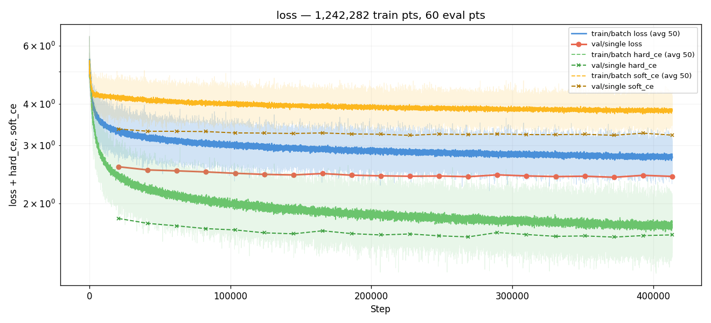
*Training loss components (loss, hard_ce, soft_ce) across all
413k steps. The wedge between hard_ce and soft_ce widens slowly:
hard_ce drops 0.22 across the run, soft_ce drops 0.15 — soft_ce
is approaching its entropy floor. Same dynamic as #002 / #005.*

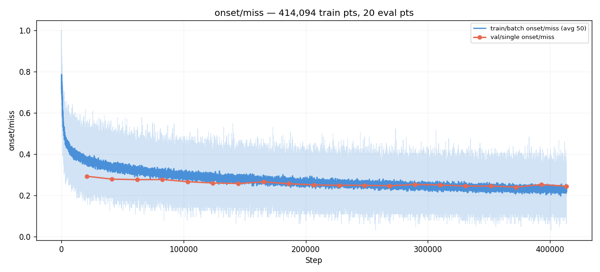
*Watched metric. 0.293 → 0.241 (E18 best). E18 best appears late;
E14 and E19 both regressed mid-trajectory in the noisy-but-improving
pattern characteristic of regularized training.*

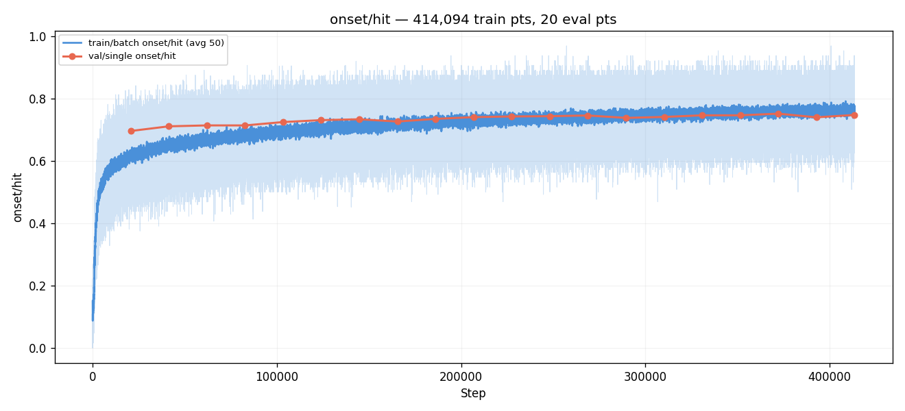
*HIT mirror of miss: 0.696 → 0.751. Same shape, same E18 peak.*

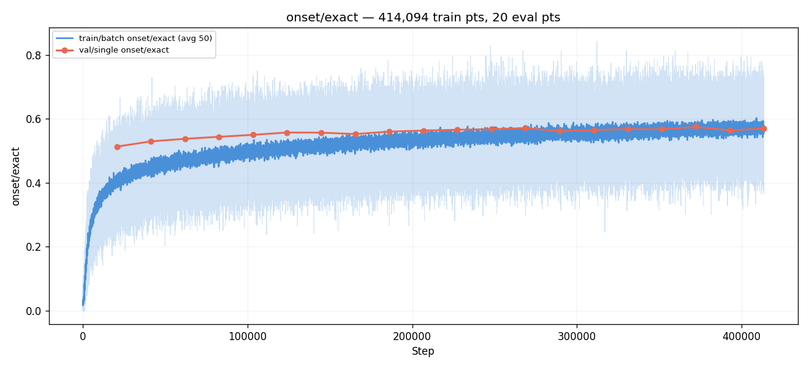
*EXACT (±0-bin): 0.513 → 0.575 — climbed steadily through the whole
run with no plateau, including past #002's stopping point. Implies
the model still has room to commit to bin-precise predictions on the
training distribution.*

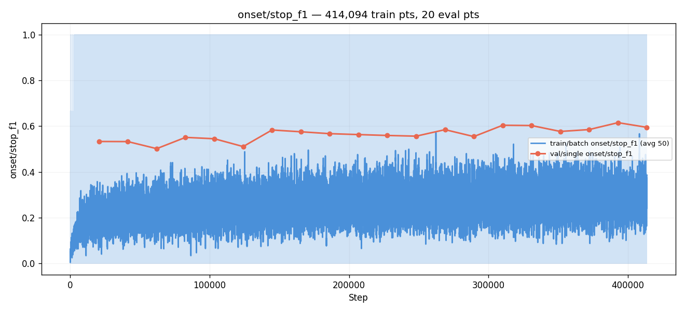
*STOP F1: noisy across the run as in all prior experiments,
oscillating between 0.50 and 0.62. Best STOP F1 of 0.615 came at
E19 (NOT the best-val eval). Stop-recall and stop-precision flip
direction at almost every eval — STOP behavior is essentially a
coin-flip between two calibration basins, same finding as #002.*

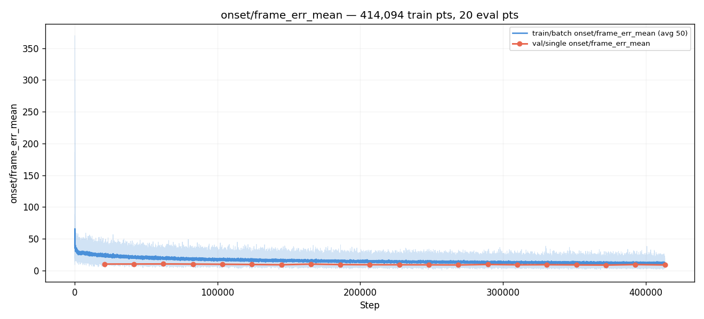
*Mean frame error: 10.11 → 8.54. Best p90 = 30 (vs #002's 31, #005's
33). The long-tail metric finally moved — first run that did. Time-
stretch is pulling the worst-case predictions inward, which neither
loss-side change in #005 nor cursor-overlap in #006 managed.*

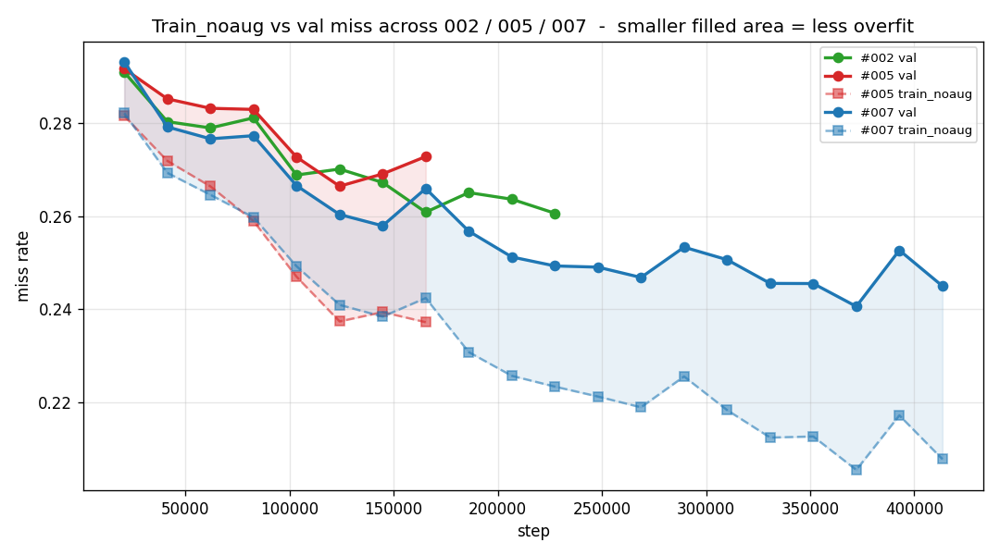
*Custom graph: val miss + train_noaug miss across three runs on the
same axis. The shaded area = gap = (val − train_noaug). #002 (green)
has no `train_noaug` data — diagnostic post-dates that run. #005
(red, 8 evals) shows rapid gap-widening through step 165k. #007
(blue) widens slower but ends with a comparable gap. **#007 did not
solve overfitting; it slowed it.**

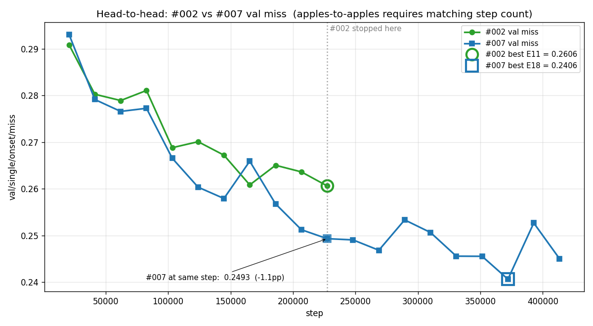
*Custom graph: #002 vs #007 val miss on the same step axis. Vertical
dotted line at #002's stopping step (227k). At that boundary, #007
is 1.13 pp ahead — a modest but real improvement at matched training
cost. The full 2.0 pp delta vs #002's E11 best comes from running
#007 a further 145k steps. The graph makes both readings legible at
once.*

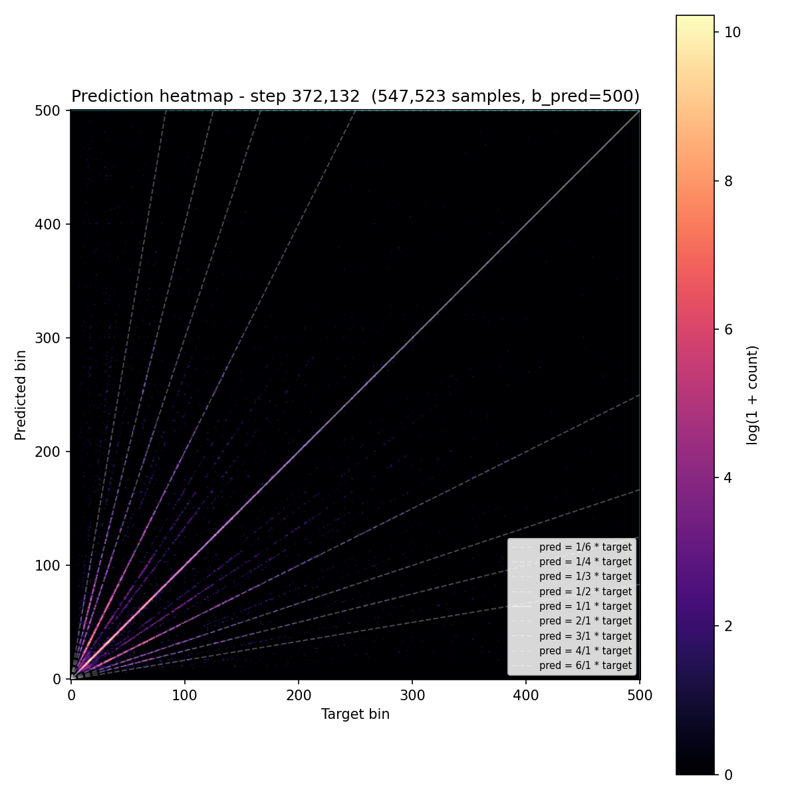
*Prediction heatmap at the best eval. Strong main diagonal; very
similar shape to #002's heatmap, modestly cleaner.*

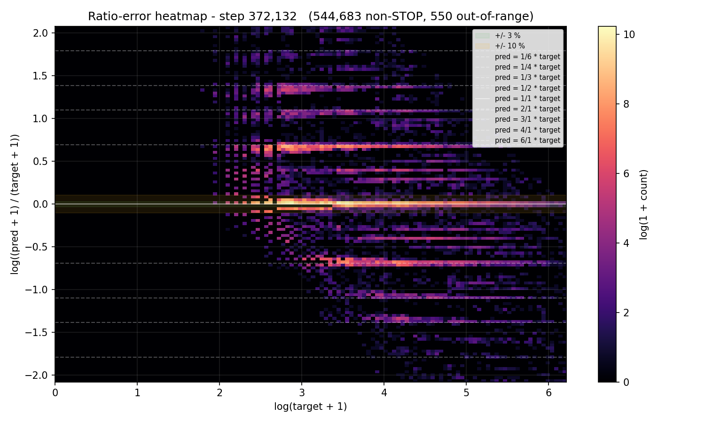
*Ratio-error heatmap on val. The `±log 2` and `±log 3` ridges are
clearly visible — the same octave / triplet failure pattern #002 and
#005 had. **Time-stretch did NOT reduce these ridges.** The shape is
near-identical to #005's at the equivalent training point.*

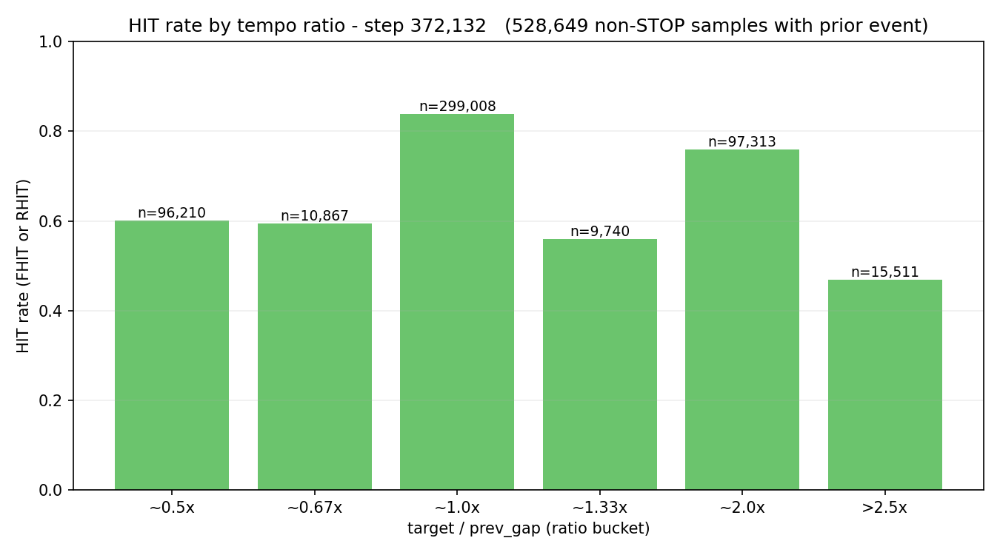
*HIT bucketed by `target / prev_gap`. Improvements over #002 are
broadly distributed across all buckets — no single ratio bucket
shows a transformative gain.*

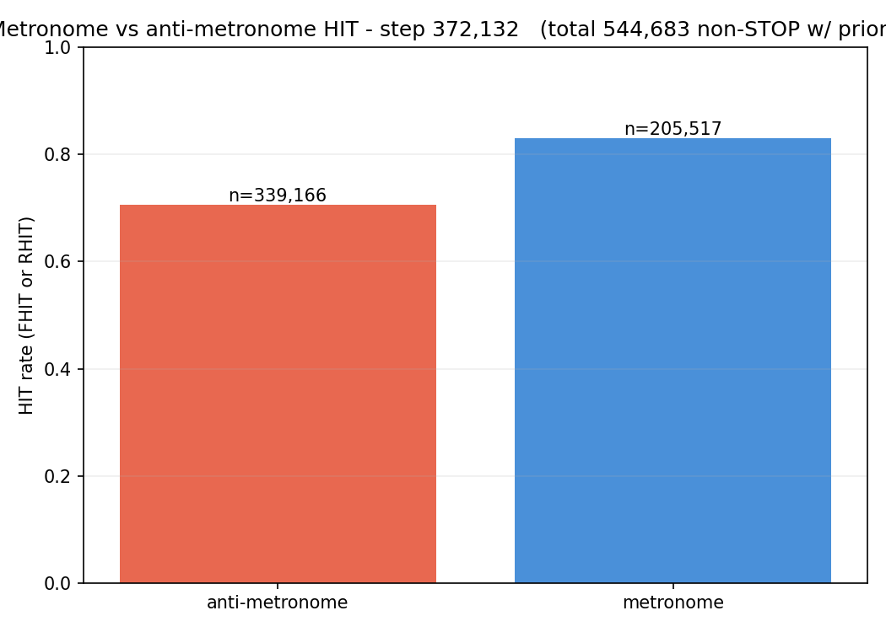
*Metronome vs anti-metronome HIT. Gap is similar to #002's
equivalent-step graph; time-stretch did not specifically reduce
metronome-following bias.*

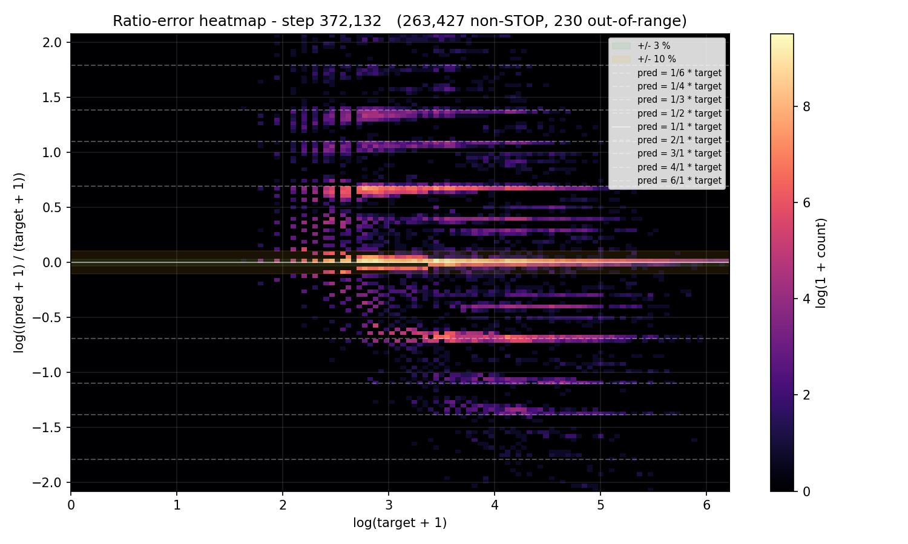
*Custom graph (new in #007): ratio-error heatmap on the train_noaug
pass at the best eval. **Same `±log 2` / `±log 3` ridges as on val.**
The model fails the same way on training data it has seen many times
during training. This is the diagnostic centerpiece of the run: the
ridges are a CAPABILITY problem, not a generalization problem. More
data and more aug will not break this ceiling — the loss + arch
combo cannot disambiguate octave/triplet errors even on memorized
data.*


*Train_noaug prediction heatmap. Cleaner main diagonal than val
(less spread off-diagonal mass), as expected since the model has
seen these examples; but the structural artifacts (octave bands,
small-target diffuseness) still match val's. Memorization improves
absolute peak placement but does not help structural ambiguity.*

## Vs prediction

- `val/single/onset/miss`: predicted ≤ 0.246 → actual **0.2406** → **MET**, 0.5 pp inside the band — but only at step 372k (E18); at step 227k (matched #002 cost) actual was 0.2493, MISSING the target by 0.3 pp.
- `val/single/onset/hit`: predicted ≥ 0.744 → actual **0.7512** → **MET**.
- `val/single/onset/exact`: predicted ≥ 0.54 → actual **0.5748** → **MET**, well above floor.
- `val/single/onset/frame_err_p90`: predicted ≤ 28 → actual **30** → **miss** (improved from 31 but did not hit floor).
- `train_noaug − val miss gap` at best val eval: predicted ≤ −2.0 pp → actual **−3.50 pp** → **miss**, gap is wider than predicted at the best eval and continued to widen through the run.
- "Ridges visibly compress in `ratio_error.png`" (observational): **did NOT compress** — visually identical to prior runs on val, AND visually identical between val and train_noaug at the same eval. Important negative finding: ridges are a capability problem, not a generalization problem.

**Three of five gated predictions met (miss, hit, exact); two missed
(frame_err_p90, gap). Both must-haves marginally met but with strong
caveats.** The strong-direction prediction (miss < #002) passed
cleanly; the magnitude prediction (1.5 pp band) was close but
required the extended training to actually clear.

## Takeaways

- **Time-stretch is a real positive-but-modest regularizer. Adopt as
  default; don't claim breakthrough.** At matched training cost
  (#002's 227k steps), val miss improved by 1.13 pp. Extending the
  run another 145k steps got us another 0.87 pp for a total of 2.0
  pp — the largest single-experiment delta in the taiko2 series, but
  achieved partly through more compute. Per-step the aug is in the
  same magnitude as augmentation gains documented elsewhere in
  taiko1's experimental record.
- **Banding was NOT solved.** The `±log 2` / `±log 3` ridges in
  graph 10 (val) and graph 13 (train_noaug) are identical in shape
  and magnitude to #002's, #005's, and each other. The model fails
  the same way on data it has seen many times in training as on
  val — the ratio-banding ridges are a CAPABILITY problem, not a
  generalization problem. Confirmation that no augmentation strategy
  alone will break this ceiling; **a loss-side or architecture-side
  intervention is needed**. (Bookmarked for #008: log-ratio EMD as
  the next attack.)
- **Overfitting was slowed, not solved.** The train_noaug gap
  widened from −1.10 pp at E1 to −3.71 pp at E20. #005 hit comparable
  gaps faster, so time-stretch is doing useful regularization work,
  but it is not eliminating the overfit. With ~1 epoch of unique-
  scene-equivalent content per training pass, the model still
  memorizes the training distribution faster than it generalizes.
- **First run to move the long-tail metric.** `frame_err_p90` was
  stuck at 31–33 in #002, #005, and #006. #007 reached 30 at multiple
  evals (E7, E13, E16, E17, E18, E20). Time-stretch reduced the
  worst-case frame-error tail — likely the bin-precision benefit
  cascading: better-calibrated peak placement = fewer wildly-wrong
  predictions in the tail.
- **AR didn't get the lift.** dc_human / hi_pspace / matched_rate
  all sit within 1–2 pp of #002 at best vs best. The bin-precision
  gains (+2 pp on exact / rhit) did not translate to AR pattern
  quality. Two interpretations: (a) AR composition errors are
  pattern-level, not bin-level, and time-stretch only fixes bin
  errors; (b) the AR decoder is the bottleneck for chart-quality
  metrics. Either way, AR-quality interventions are orthogonal to
  the work in this run.
- **Hard-CE / soft-CE divergence persists.** Hard CE dropped 12 %
  across the run (1.80 → 1.58), soft CE only 4.5 % (3.36 → 3.21).
  Same dynamic the user identified during #007 mid-run: the model
  optimizes for the spike (hard CE) and accepts the entropy floor
  on the trapezoid soft target. Time-stretch did not change this.
  **This is the strongest evidence yet that the loss shape is the
  primary blocker** — neither augmentation strategy nor cursor
  filtering changed the soft_CE plateau, because the plateau is a
  property of softmax CE itself.
- **Stop with E18.** `best.pt` at E18 is the new taiko2 baseline.
  E19's 1.2 pp regression and E20's partial recovery look like the
  start of plateau-with-noise; further training is unlikely to
  produce monotonic gains.

## Followup questions

- **Does log-ratio EMD beat the entropy floor?** The next experiment
  to run, already designed: replace `OnsetLoss` with
  `α · hard_CE + β · log_emd` where `log_emd = Σ Pᵢ |log((i+1)/(t+1))|`.
  Heatmap analysis (`analysis/loss_landscape.py`) showed log-ratio
  EMD has no entropy floor AND is perception-correct (octave-symmetric
  in log-space). If the ridges shrink with this loss, we have
  strong evidence the loss shape was the cap; if they don't, the
  capability gap is architectural and a head redesign is needed.
- **Will AR-side interventions produce chart-quality gains?** The
  AR-near-parity result here suggests the AR decoder is at least
  partly the bottleneck. A simple test: rerun #007's `best.pt`
  through the corpus inference stack with a sigmoid-gated STOP
  decoder + multi-hypothesis bin selection. Cheap and informative.
- **Is there a sweet spot for max_scale?** This run used 1.4. Lower
  (1.2) might preserve more spectral realism at the cost of less
  aug coverage; higher (1.6 or 1.8) increases coverage at the cost
  of more spectral artifacts. One short ablation could narrow the
  knob.
- **Does longer training continue to help past step 413k?** E20's
  miss is 0.245 — within seed noise of E18's 0.241. The slope is
  effectively flat by E18. Extending further would burn compute
  with little expected gain.
