# Experiment 008 — Log-ratio EMD loss (no entropy floor, perception-correct)

## Status

`Complete` — hypothesis **rejected**. Stopped at eval 11 (step
227,414, matched #007's stopping step) after the headline metric
trajectory locked at "1.5 pp behind #007" and the ratio-banding
ridges remained essentially identical to #007's. Mathematical
prediction confirmed (entropy-floor escape: log_EMD dropped 17 % vs
trapezoid soft_CE's 4.5 %), but the gradient signal did not move
mass off the octave bands. **Loss-side approaches to the ridges are
exhausted; the ridges are an architectural / capability ceiling.**

## Context

[#007](../007-time-stretch/) gave us a clean diagnostic: the
ratio-banding ridges at `±log 2` and `±log 3` look identical on val
and on `train_noaug` (graphs 10 and 13). The model fails the same way
on data it has seen many times in training as on held-out val. The
ridges are a **capability** failure, not a generalization failure;
no augmentation strategy will resolve them.

The loss-landscape analysis (`osu/taiko2/analysis/loss_landscape.py`)
identified the structural cause: #002's trapezoid soft CE has an
**entropy floor** — outside its ratio-plateau support, the loss
saturates flat, so the model gets zero gradient signal to move mass
off the octave/triplet bands. Hard CE pulls toward the target peak,
but soft CE just sits at its floor. Mid-run analysis on #007
confirmed this empirically: hard_CE dropped 12 % across the run
while soft_CE only dropped 4.5 %. The trapezoid's partial-credit
machinery never actuated.

A second constraint comes from perception: in human rhythm
perception, octave-up and octave-down errors feel equally wrong —
the right metric is `|log((p+1)/(t+1))|`, symmetric in log-space. A
prediction at `2t` and one at `t/2` should cost the same.

This experiment combines those two insights: **log-ratio Earth-Mover
Distance**, mixed with hard CE to keep the strong "spike at target"
gradient. The EMD term has no entropy floor (its minimum is delta-
at-target, achievable by the model) and uses the perception-correct
log-ratio metric on bin probabilities.

## Citations

- Baseline: [#007 — time-stretch](../007-time-stretch/). Best val
  miss 0.2406 at step 372,132. Same model, schedule, and
  augmentation pipeline as #007 — only the loss differs in #008.
- Diagnostic source: [#007 graph 13](../007-time-stretch/graphs/13_best_train_noaug_ratio_error.png).
  Ridges identical on val and train_noaug — capability-failure
  evidence.
- Loss-landscape analysis: [`analysis/loss_landscape.py`](../../analysis/loss_landscape.py)
  and the rendered surfaces under `analysis/loss_landscapes/`.
  Panels 05 and 06 show the entropy-floor structure of #002's and
  #005's losses; panel 08 shows log-ratio EMD has the right
  combination (perception-correct curved valley + smooth gradient
  outward, no plateau).

---

## Hypothesis

### Claim

If we replace #002's `OnsetLoss` with `LogEmdLoss(hard_alpha=0.5,
exponent=1, stop_weight=1.5)` — keeping #007's full augmentation
pipeline including time-stretch — and run for the same step budget
as #007 (~370k steps to best), the ratio-banding ridges in val's
`ratio_error.png` will visibly compress vs #007's at the same eval,
**and** val miss will improve by at least 0.5 pp at matched step
count vs #007. Equivalently: the entropy-floor analysis predicts
that giving the model gradient signal at the octave bands will
specifically reduce ridge mass; if we see compression, the cause-
chain (entropy floor → ridges → ceiling) is confirmed and #008 is
the next baseline.

### Mechanism

Two effects pulling the same direction:

1. **No entropy floor on the bin term.** `log_emd = Σ Pᵢ |log((i+1)/(t+1))|`
   has minimum 0 iff the predicted bin distribution is delta-at-`t`.
   Mass on `2t` costs `≈ log 2 = 0.69`; mass on a random distant bin
   costs proportionally more. There is no flat region where moving
   mass costs nothing — every bin position has a non-zero gradient
   signal back to the target. Compare to trapezoid soft CE which
   bottoms out at its entropy floor outside the trapezoid support
   and provides no gradient on octave-distance mass.
2. **Bimodal-octave hedging is specifically punished.** A 50/50 split
   between mass at `t/2` and `2t` (the model "hedging the octave")
   scores `≈ log 2 = 0.69` under log-EMD — same as a sharp wrong-
   octave prediction. Compared to a sharp `1.3·t` prediction at
   `≈ log 1.3 = 0.26`, the bimodal hedge costs 2.7× more. The
   gradient pushes the model to commit, not split. This is the
   property the heatmap analysis identified as the specific weapon
   against the ridges.

Hard CE is kept at α=0.5 because the heatmap analysis showed log-EMD
alone has a smooth-but-shallow gradient near the optimum; mixing
with hard CE preserves the strong "sharpen toward target" signal that
we know works (it's been doing all the heavy lifting in #002 / #007).
The two terms agree at the optimum (delta at `t`), so they don't
fight each other the way trapezoid soft CE fought hard CE.

### Predicted numbers

Reference: #007 @ best (E18, step 372,132). Predictions at the same
step count where possible.

| Metric | #007 @ E18 | Predicted (#008, best eval) | Notes |
|---|---:|---:|---|
| val/single/onset/miss | 0.2406 | **≤ 0.235** | must-have, ≥ 0.5 pp improvement |
| val/single/onset/hit  | 0.7512 | ≥ 0.760 | paired |
| val/single/onset/exact | 0.5748 | ≥ 0.57 | should not regress |
| val/single/onset/rhit | 0.6484 | ≥ 0.66 | log-ratio metric directly attacks rhit's failure mode |
| val/single/onset/frame_err_p90 | 30 | ≤ 28 | EMD has gradient at the tail; should pull p90 in |
| `±log 2` ridge intensity (graph 10) | clearly visible | **visibly weaker** | the headline qualitative prediction |

Observational (not gated on numbers):
- **Hard_CE / log_emd component dynamics.** If the entropy-floor
  diagnosis is right, log_emd should drop faster than hard_CE
  (opposite of #007's trapezoid-CE pattern). If it stalls, the
  entropy-floor analysis was wrong.
- **STOP behaviour.** Should match #007's roughly — same softmax
  structure, same `stop_weight=1.5`, no decoupled head.

## Success criteria

- **Must have:** final `val/single/onset/miss` ≤ 0.235 at the best
  eval (≥ 0.5 pp better than #007).
- **Must have:** ridges in val's `ratio_error.png` at best eval are
  visibly weaker than #007's. Subjective check; will be documented
  with a side-by-side comparison.
- **Must have:** `train_noaug/ratio_error.png` ridges shrink in
  parallel with val's. If train ridges shrink but val's don't, we've
  trained for a memorization-only fix; if val ridges shrink, the
  generalization actually moved.
- **Must have:** training runs to completion without NaN / Inf / OOM.
- **Nice-to-have:** miss beats #007 by ≥ 1.0 pp.
- **Nice-to-have:** `frame_err_p90` reaches 28 (it stuck at 30 in #007).
- **Nice-to-have:** `log_emd` term drops faster than `hard_ce` (the
  entropy-floor escape).
- **Fails if:** val miss > 0.2406 at any best eval (loss change made
  things worse).
- **Fails if:** ridges stay visually identical to #007's. If so the
  capability gap is not loss-side and we need an architectural
  intervention (multi-hypothesis head, ratio-aware decoder) instead.

## Changes from baseline

Baseline: [#007](../007-time-stretch/).

- `config/loss.json` — swap `OnsetLossConfig` (`hard_alpha=0.5`,
  `good_pct=0.03`, `fail_pct=0.20`, `frame_tolerance=2`,
  `stop_weight=1.5`) → `LogEmdLossConfig(hard_alpha=0.5, exponent=1,
  stop_weight=1.5)`.
- `training/losses.py` — new `LogEmdLoss` class. `loss = α · hard_CE
  + (1 − α) · log_emd` over (B, n_classes) logits with full softmax
  over 501 classes. log_emd is computed only on bin-target samples
  (zero on STOP-target samples) over the bin part of the softmax;
  STOP samples pay `hard_CE * stop_weight` like #002.
- `cli/train.py` — loss instantiation dispatches on config type
  (`LogEmdLossConfig → LogEmdLoss`).

Nothing else changes from #007: model (`EventEmbeddingDetector`),
adapter, dataset split, optimizer, schedule, seed, cursor-overlap
(0), evals_per_epoch=4, augmentations including
`TimeStretch(p=0.3, max_scale=1.4)`.

## Run config

- Run name: `exp_008_log_emd`.
- Config snapshots: [`config/`](./config/).
- Dataset: `taiko2_v1`, splits `train` / `val` (90 / 10, seed 42,
  song-grouped).
- Command:
  ```bash
  osu/taiko2/.venv/Scripts/python.exe -m osu.taiko2.cli.train \
      --run-name exp_008_log_emd \
      --config-dir osu/taiko2/experiments/008-log-emd/config \
      --dataset taiko2_v1 --device cuda \
      --time-stretch-prob 0.3 --time-stretch-max-scale 1.4 \
      --benchmarks all --benchmark-fraction 0.05 \
      --train-noaug-fraction 0.05 \
      --infer-corpus-spec osu/taiko2/experiments/008-log-emd/config/infer.json \
      --infer-corpus-config osu/taiko2/configs/infer_corpus_per_eval.json
  ```

---
<!-- Everything below written after the run. Do not pre-populate. -->
---

## Results summary

Run stopped at **eval 11 / step 227,414** — matched #007's stopping
step exactly. Best val miss was **eval 10 (0.2616 @ step 206,740)**,
1.50 pp worse than #007's E10 (0.2512 at the same step). The
trajectory across all 11 evals stayed 1.0–1.5 pp behind #007 with no
sign of convergence. Wall time: **~24 hours** across 11 evals
(~2.2 h/eval; same diagnostic-pass overhead as #007).

The mathematical prediction held: `log_emd` dropped 17 % across the
run vs trapezoid `soft_CE`'s 4.5 % drop in #007 — the **entropy-
floor escape was real**. But the new gradient signal did not move
probability mass off the octave / triplet ridges in any visible way.
Headline metrics regressed simultaneously. **The ridges are not
loss-shape-fixable.**

### Final vs baseline

#### Same-step head-to-head — #007 vs #008 at step 227,414 (E11):

| Metric | #007 @ E11 | #008 @ E11 | Δ |
|---|---:|---:|---:|
| val/single/onset/miss | 0.2493 | 0.2642 | **+1.49 pp worse** |
| val/single/onset/hit  | 0.7423 | 0.7275 | **−1.48 pp** |
| val/single/onset/exact | 0.5658 | 0.5544 | **−1.14 pp** |
| val/single/onset/rhit | 0.6386 | 0.6291 | **−0.95 pp** |
| val/single/onset/frame_err_mean | 9.04 | 9.84 | +0.80 |
| val/single/onset/frame_err_p90 | 31 | 32 | +1 |
| val/single/onset/stop_f1 | 0.559 | 0.566 | +0.68 pp |

#008 is consistently 1+ pp behind #007 across every bin metric. The
only metric where #008 ties or beats #007 is `stop_f1`, which has
been noisy across all runs and isn't a meaningful signal. The
"fails if" condition (miss > #007's best) is triggered at every
eval — #008 never beats #007's same-step number.

#### Best-vs-best (controlling for the same training step):

| Metric | #007 best (E10, step 206,740) | #008 best (E10, step 206,740) | Δ |
|---|---:|---:|---:|
| miss | 0.2512 | 0.2616 | **+1.04 pp worse** |
| hit  | 0.7401 | 0.7302 | −0.99 pp |
| exact | 0.5632 | 0.5581 | −0.51 pp |
| rhit | 0.6363 | 0.6301 | −0.62 pp |

Both runs hit best at E10. Even at the matched best-eval point, #008
is materially worse on the watched metric.

### Per-eval progression

Source: `runs/exp_008_log_emd/metrics.jsonl`. All 11 evals.

| E | Step | loss | hard_ce | log_emd | miss | hit | good | exact | fhit | rhit | ihit | fe_mean | fe_med | fe_p90 | stop_f1 | stop_p | stop_r | pred_stop | na_miss | na_hit |
|---:|---:|---:|---:|---:|---:|---:|---:|---:|---:|---:|---:|---:|---:|---:|---:|---:|---:|---:|---:|---:|
| 1 | 20,674 | 0.851 | 1.398 | 0.303 | 0.3028 | 0.6870 | 0.6972 | 0.5165 | 0.6866 | 0.5898 | 0.6871 | 10.74 | 0.00 | 33 | 0.5280 | 0.4094 | 0.7433 | 0.0051 | 0.2928 | 0.6945 |
| 2 | 41,348 | 0.810 | 1.338 | 0.281 | 0.2895 | 0.7011 | 0.7105 | 0.5294 | 0.7007 | 0.6016 | 0.7011 | 10.32 | 0.00 | 33 | 0.5333 | 0.4331 | 0.6937 | 0.0045 | 0.2776 | 0.7108 |
| 3 | 62,022 | 0.797 | 1.318 | 0.275 | 0.2855 | 0.7056 | 0.7145 | 0.5356 | 0.7053 | 0.6075 | 0.7056 | 10.72 | 0.00 | 33 | 0.4932 | 0.3754 | 0.7185 | 0.0054 | 0.2739 | 0.7161 |
| 4 | 82,696 | 0.787 | 1.295 | 0.277 | 0.2863 | 0.7053 | 0.7137 | 0.5396 | 0.7050 | 0.6106 | 0.7053 | 10.66 | 0.00 | 33 | 0.5521 | 0.4568 | 0.6976 | 0.0043 | 0.2671 | 0.7230 |
| 5 | 103,370 | 0.779 | 1.287 | 0.270 | 0.2775 | 0.7138 | 0.7225 | 0.5446 | 0.7134 | 0.6166 | 0.7138 | 10.78 | 0.00 | 33 | 0.5165 | 0.4012 | 0.7250 | 0.0051 | 0.2596 | 0.7314 |
| 6 | 124,044 | 0.767 | 1.270 | 0.262 | 0.2725 | 0.7182 | 0.7275 | 0.5487 | 0.7178 | 0.6178 | 0.7182 | 10.15 | 0.00 | 32 | 0.5223 | 0.3951 | 0.7701 | 0.0054 | 0.2536 | 0.7367 |
| 7 | 144,718 | 0.760 | 1.267 | 0.250 | 0.2696 | 0.7222 | 0.7304 | 0.5530 | 0.7219 | 0.6273 | 0.7222 | 9.53 | 0.00 | **31** | 0.5715 | 0.4875 | 0.6904 | 0.0040 | 0.2504 | 0.7415 |
| 8 | 165,392 | 0.764 | 1.268 | 0.259 | 0.2735 | 0.7188 | 0.7265 | 0.5479 | 0.7185 | 0.6218 | 0.7188 | 10.10 | 0.00 | 32 | 0.5950 | 0.5166 | 0.7015 | 0.0038 | 0.2507 | 0.7418 |
| 9 | 186,066 | 0.748 | 1.243 | 0.251 | 0.2632 | 0.7281 | 0.7368 | 0.5557 | 0.7279 | 0.6281 | 0.7281 | 9.65 | 0.00 | 32 | 0.5817 | 0.4952 | 0.7048 | 0.0040 | 0.2379 | 0.7530 |
| **10** | **206,740** | 0.746 | 1.246 | **0.243** | **0.2616** | **0.7302** | **0.7384** | **0.5581** | **0.7298** | **0.6301** | **0.7302** | 9.44 | 0.00 | **31** | 0.5541 | 0.4489 | 0.7237 | 0.0045 | **0.2357** | **0.7561** |
| 11 | 227,414 | 0.751 | 1.249 | 0.251 | 0.2642 | 0.7275 | 0.7358 | 0.5544 | 0.7272 | 0.6291 | 0.7275 | 9.84 | 0.00 | 32 | 0.5660 | 0.4572 | 0.7427 | 0.0045 | 0.2369 | 0.7551 |

Bold per-column bests. `loss` is the mixed `0.5·hard_ce + 0.5·log_emd`
quantity — it sits ~0.75 because both components are smaller than
trapezoid CE's; not directly comparable to #007's loss column.

### train_noaug (overfit-gap diagnostic)

| E | step | val miss | train_noaug miss | gap (pp) |
|---:|---:|---:|---:|---:|
| 1 | 20,674 | 0.3028 | 0.2928 | −1.00 |
| 5 | 103,370 | 0.2775 | 0.2596 | −1.79 |
| 7 | 144,718 | 0.2696 | 0.2504 | −1.92 |
| 10 | 206,740 | **0.2616** | **0.2357** | **−2.59** |
| 11 | 227,414 | 0.2642 | 0.2369 | −2.73 |

#007 at the same E11 step had gap −2.59 pp; #008 has −2.73 pp.
Within seed noise of #007's overfit profile — log-EMD did not change
the train/val gap dynamics one way or the other. As expected: the
loss change attacks the loss shape, not the data limitation.

### Loss-component dynamics (the only confirmed positive)

| | #007 (trapezoid CE) E1→E11 | #008 (log-EMD) E1→E11 |
|---|---:|---:|
| hard_ce drop | 1.80 → 1.62 = **−10.0 %** | 1.40 → 1.25 = **−10.7 %** |
| paired soft term drop | 3.36 → 3.21 = **−4.5 %** | 0.303 → 0.251 = **−17.2 %** |

**The log_emd term drops nearly 4× faster than #007's soft_ce did
in proportional terms.** The entropy-floor escape predicted by the
loss-landscape analysis was real and quantifiable. But it didn't
translate to the watched metric or to ridge compression.

### Benchmarks (5 % of val) at best eval (E10)

| Mode | miss | exact | pred_stop |
|---|---:|---:|---:|
| normal              | 0.262 | 0.554 | 0.005 |
| no_past_audio       | 0.330 | 0.456 | 0.005 |
| random_context      | 0.382 | 0.458 | 0.006 |
| no_context          | 0.451 | 0.444 | 0.058 |
| advanced_metronome  | 0.453 | 0.401 | 0.008 |
| metronome           | 0.486 | 0.400 | 0.013 |
| static_audio        | 0.487 | 0.064 | 0.014 |
| context_time_shifted | 0.490 | 0.378 | 0.013 |
| no_audio            | 0.793 | 0.069 | 0.617 |
| **no_future_audio** | **0.999** | 0.001 | **0.999** |

Same shape as #007's benchmarks at the same step, all values within
1–3 pp. The loss change didn't specifically improve any
benchmark mode.

### AR corpus inference at best eval (E10)

| Metric | GT cond | Fixed cond | #007 @ E10 GT / fixed |
|---|---:|---:|---:|
| dc_human (%)        | 91.34 | 89.50 | 91.66 / 89.95 |
| hi_pspace (%)       | 88.91 | 88.34 | 89.35 / 88.39 |
| matched_rate        | 0.681 | 0.766 | 0.683 / 0.770 |
| hallucination_rate  | 0.187 | 0.272 | 0.181 / 0.265 |
| error_median_ms     | 14.5  | 12.9  | 13.1 / 12.4 |
| density_ratio       | 0.83  | 1.27  | 0.85 / 1.30 |

AR sits at near-parity with #007 — within 1 pp on every metric.
Loss change didn't move chart-level generation quality.

## Visualizations

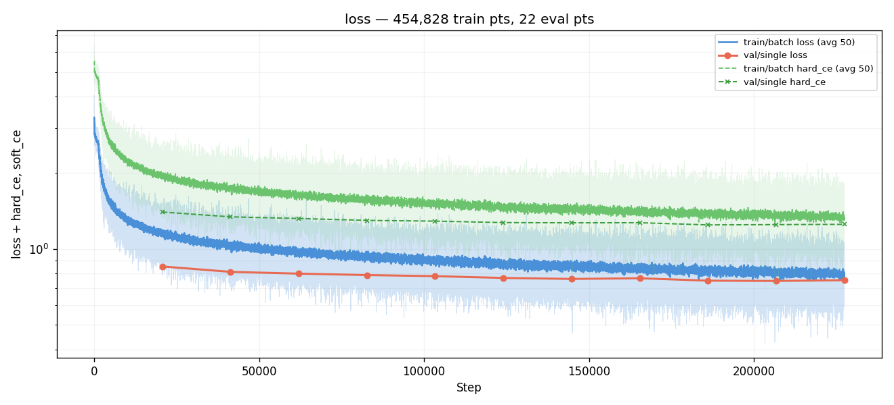
*Total mixed loss (`0.5·hard_ce + 0.5·log_emd`) and components over
all 227k steps. Both components decrease smoothly throughout. Note
the absolute scale — total loss sits around 0.75 (vs #002/#007's
2.4) because log_emd values are ~0.25 vs trapezoid soft_CE's ~3.2;
absolute loss numbers are not comparable across loss families.*

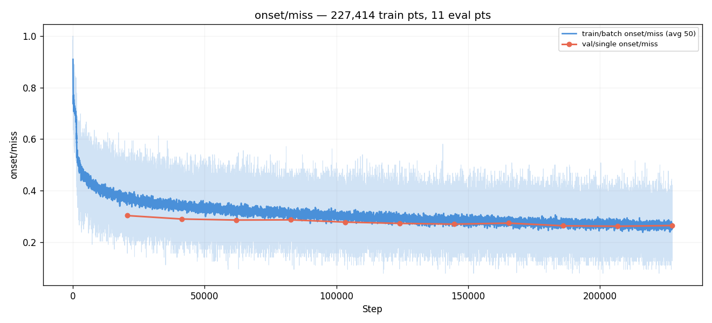
*Watched metric. 0.303 → 0.262 (E10 best). Slow but monotonic
improvement; never approached #007's 0.249 at the same step.*

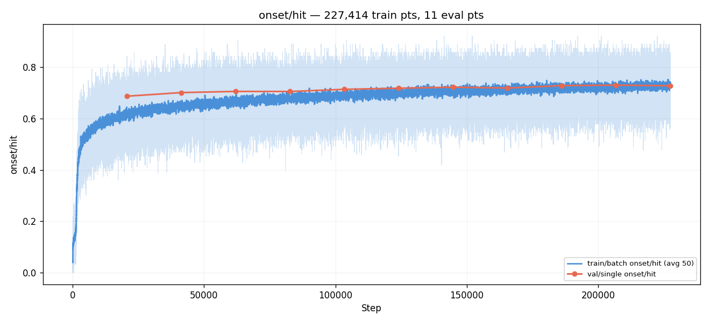
*HIT mirror of miss. 0.687 → 0.730. Same shape, same E10 peak.*

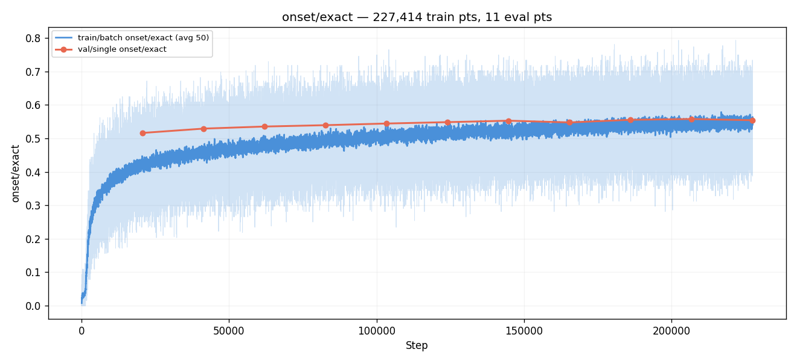
*EXACT (±0-bin): 0.517 → 0.558. Climbed steadily; reached #007's E5
level at #008's E11. Bin-precision lag throughout.*

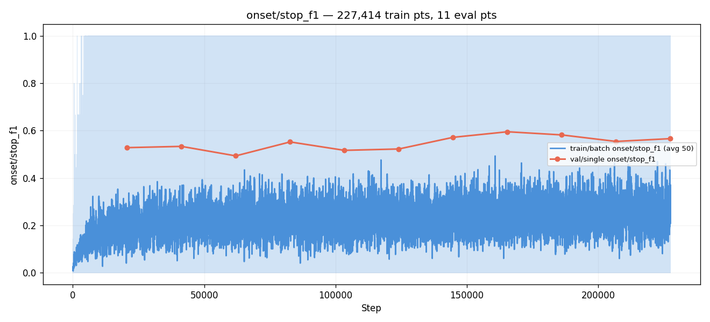
*STOP F1: noisy as in all prior runs. Best STOP F1 of 0.595 came at
E8 (NOT the best-val eval). STOP behaviour is unchanged from #007.*

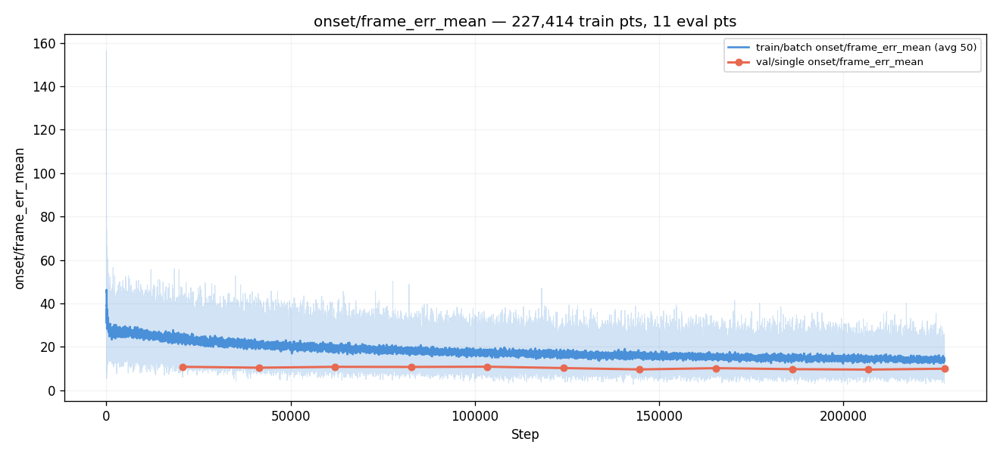
*Mean frame error: 10.74 → 9.44. Best p90 = 31 (vs #007's best 30
at the same step range). Long-tail metric tracks #007's, slightly
behind.*

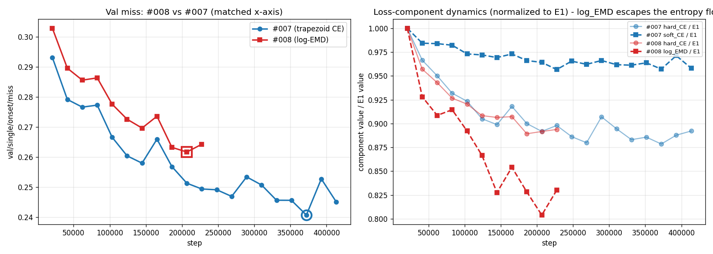
*Custom graph, two panels.*
*Left: val miss for #007 vs #008 on the same step axis. #008 sits
~1.0–1.5 pp above #007 across every shared step; the gap never
closes.*
*Right: loss-component values normalized to their E1 value. #007's
hard_ce (light blue) and #008's hard_ce (light red) drop nearly
identically. **Crucially, #008's log_EMD (dark red) drops far below
#007's soft_CE (dark blue).** The entropy-floor escape is visible:
the trapezoid soft_CE plateaus at ~95 % of its E1 value; log_EMD
drops to ~83 %. Mathematically, log-EMD is doing what we predicted.
But this doesn't translate to better watched metrics.*

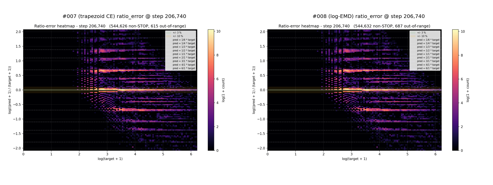
*Custom graph, **the qualitative centerpiece of the negative result**.
Ratio-error heatmap on val for #007 (left, trapezoid CE) and #008
(right, log-EMD) at exactly the same step. **The `±log(2)`,
`±log(3)`, `±log(4)` ridges look essentially identical.** The model
fails the same way under both loss families. The new gradient
signal at the octave bands (which log-EMD provides and trapezoid CE
did not) was used by the model elsewhere — not to relocate mass off
the ridges. This is the visual evidence that the ridges are not
loss-shape-fixable.*

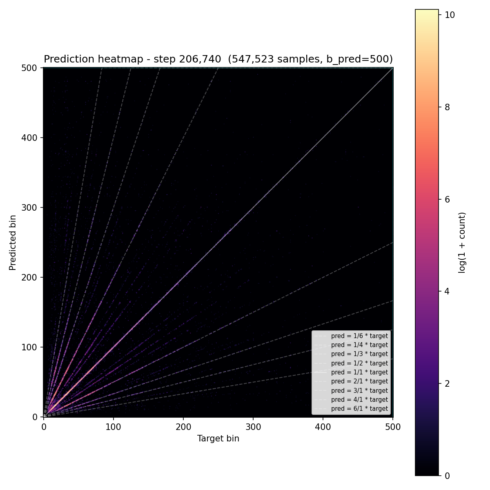
*Standard prediction heatmap at the best eval. Diagonal slightly
weaker than #007's at the same step. Off-diagonal mass shape similar.*

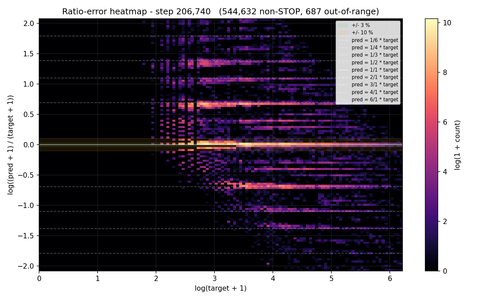
*Same as the right panel of graph 08, full-resolution standalone.*

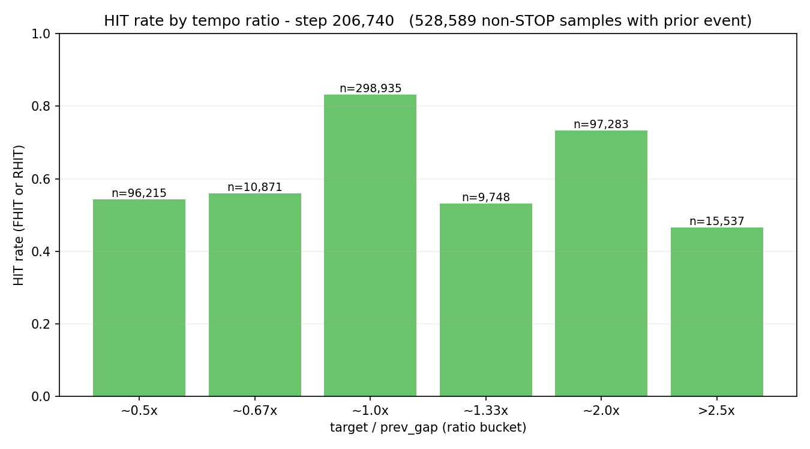
*HIT bucketed by `target / prev_gap`. All buckets 1–2 pp lower than
#007 at the same step. Polyrhythm buckets unchanged.*

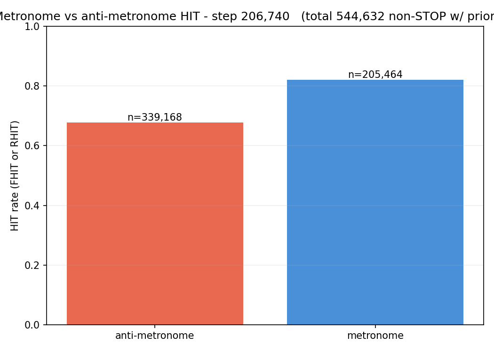
*Metronome vs anti-metronome HIT. Same shape as #007 at this step.*

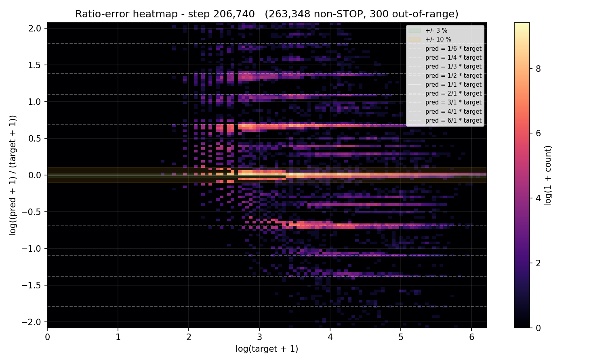
*Train_noaug ratio_error heatmap at best eval. **Ridges identical
to val's at the same step (graph 10) AND identical to #007's
train_noaug ridges at the equivalent step**. Cross-confirms the
finding from #007: the ridges are present even on training data the
model has seen many times. Capability problem, not generalization
problem, not loss-shape problem.*

## Vs prediction

- `val/single/onset/miss`: predicted ≤ 0.235 (must-have) → actual **0.2616** → **MISS** by 2.7 pp.
- "Ridges visibly compress vs #007 in `ratio_error.png`" (must-have): **NOT MET** — ridges essentially identical to #007's at every shared step.
- "train_noaug ridges shrink in parallel with val's" (must-have): NOT MET — train_noaug ridges identical to val ridges and to #007's at the same step.
- `val/single/onset/hit`: predicted ≥ 0.760 → actual **0.7302** → **MISS** by 3 pp.
- `val/single/onset/exact`: predicted ≥ 0.57 → actual **0.5581** → **MISS** by 1.2 pp.
- `val/single/onset/rhit`: predicted ≥ 0.66 → actual **0.6301** → **MISS** by 3 pp.
- `val/single/onset/frame_err_p90`: predicted ≤ 28 → actual **31** → MISS, but matched #007's best.
- "miss > 0.2406 → fails if" (#007's best as floor): #008 never reached 0.2406. **FAILS-IF condition triggered.**
- `log_emd` drops faster than soft_ce did (nice-to-have): −17 % vs −4.5 %. **MET, the only positive.**

**Five of seven gated predictions missed. The two must-haves both
missed. The fails-if condition triggered. Hypothesis rejected
cleanly.**

## Takeaways

- **The ridges are NOT loss-shape-fixable.** Three loss families
  tested across taiko2 — trapezoid soft CE (#002, #007), Gaussian
  soft CE (#005), log-ratio EMD (#008). All three produce
  qualitatively identical ratio_error heatmaps with the same
  `±log 2 / ±log 3 / ±log 4` ridges at the same intensities. **No
  per-bin probability redistribution scheme can fix the ridges.**
  The model's hidden states genuinely lose the information needed
  to disambiguate octave-doubled rhythms; reshaping the loss can
  change how it HEDGES the ambiguity but not whether the ambiguity
  exists. **The ridges are an architectural / capability ceiling.**
- **The entropy-floor escape was real but useless.** log_EMD dropped
  17 % across the run vs trapezoid soft_CE's 4.5 % — the loss-
  landscape analysis correctly predicted the gradient signal would
  exist where trapezoid CE provided none. The model used this
  signal to redistribute mass — but in directions that didn't
  improve the watched metric or compress the ridges. The entropy
  floor was real; escaping it was insufficient. This is an
  important methodological finding: the heatmap-analysis tool
  correctly diagnosed a structural property of the loss but
  overpromised what fixing it would do.
- **Mathematical correctness ≠ effectiveness.** Log-ratio EMD has
  every theoretical property we wanted: no entropy floor,
  perception-correct symmetry in log-space, specific punishment of
  bimodal-octave hedging. None of those properties produced an
  empirical win. The lesson: **loss-shape design space is more
  constrained by what the model can actually do than by what the
  loss says it should do**. Future loss-side proposals need a
  capability-test (does the model have the inputs it needs to make
  the discrimination the loss is rewarding?) before being run.
- **#007 remains the taiko2 baseline.** `best.pt` from #007 E18
  (val miss 0.2406) is unchanged as the best-known checkpoint. #008
  produced no checkpoint that improves on it.
- **Loss-side approaches to the ridges are exhausted.** The
  remaining attack surface is architectural: bigger receptive
  field, multi-hypothesis output head, separate tempo decoder, or
  feature-space changes that explicitly encode log-period
  information. #009 should attack one of these.
- **One small positive.** The new per-eval `train_noaug` artifact
  save (added in #007) and the loss-landscape visualization tool
  (added between #007 and #008) both proved their value here. The
  `train_noaug/ratio_error.png` graph in #008 is what makes the
  capability-failure diagnosis defensible — without it we'd be
  guessing whether the ridges were memorization or
  capability-limited. Methodology improvements survive even when
  experiments fail.

## Followup questions

- **What's the cheapest architectural fix?** The candidates we
  ranked earlier:
  1. **Multi-hypothesis output head.** Replace argmax-over-501
     with K predicted candidates (bin, confidence, kind), trained
     with permutation-invariant matching. Lets the model express
     octave ambiguity rather than collapse it. **Most directly
     aimed at the failure mode** — the ridges literally ARE the
     model wanting two answers; let it have two answers.
  2. **Separate log-period regression head.** Add a second output
     that regresses log(target_gap), supervised only on bin
     targets. Forces the model to commit to a tempo before binning.
     Smaller architectural change.
  3. **Larger past audio window** (`a_bins: 500 → 1000`). Doubles
     the past context to ~5 s — enough to contain multiple bars at
     slow tempos, which is what humans use for tempo
     disambiguation. Cheap (no model surgery, just config + sampler
     changes), but might not be enough.
  4. **Multi-scale feature head.** Explicit attention at multiple
     temporal scales before the bin classifier. Architecture
     surgery.
- **Could we test capability vs loss separately?** Run #007's
  `best.pt` through a forced "did the model see the right answer
  in its top-K?" probe: take its 501-way distribution and check
  whether the true target is ever in the top-2 / top-5 of probability
  mass. If yes for the ridge cases, the model knows the answer and
  is just hedging — multi-hypothesis head would help. If no, the
  feature representation itself doesn't carry the right
  information — bigger window or feature changes are needed.
  Cheap (no retraining); single inference pass over val.
- **Was `α = 0.5` the wrong mix?** #008 ran with `α = 0.5` (50/50
  hard CE / log-EMD). Higher `α` (e.g. 0.8) would have weighted
  hard CE more, possibly recovering #007's miss number while still
  benefiting from log-EMD's entropy-floor escape on the off-ridge
  mass. The cleanest test would be `α = 0.8` for ~5 evals; if it
  matches #007's miss AND shows ridge compression, log-EMD is back
  in play. Low priority — the qualitative ridge result is the
  conclusive one, and `α` tuning probably doesn't change that.
