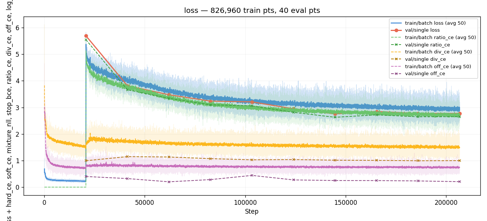
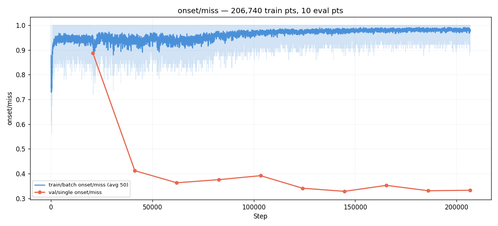
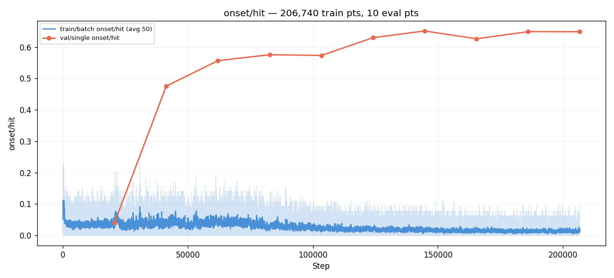
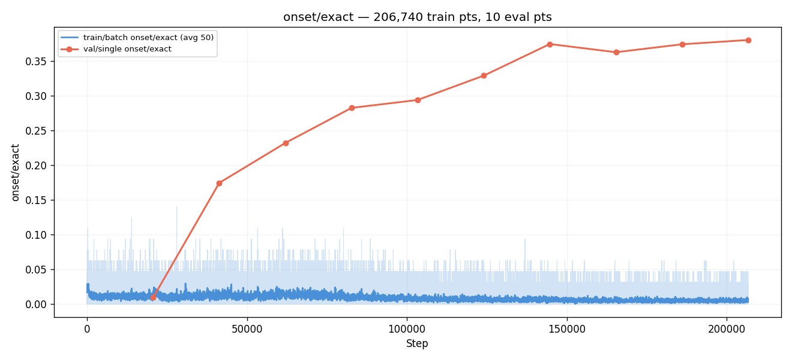
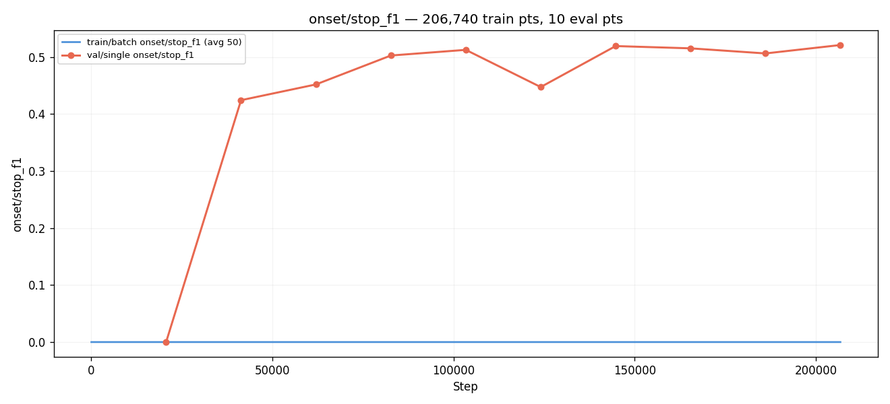
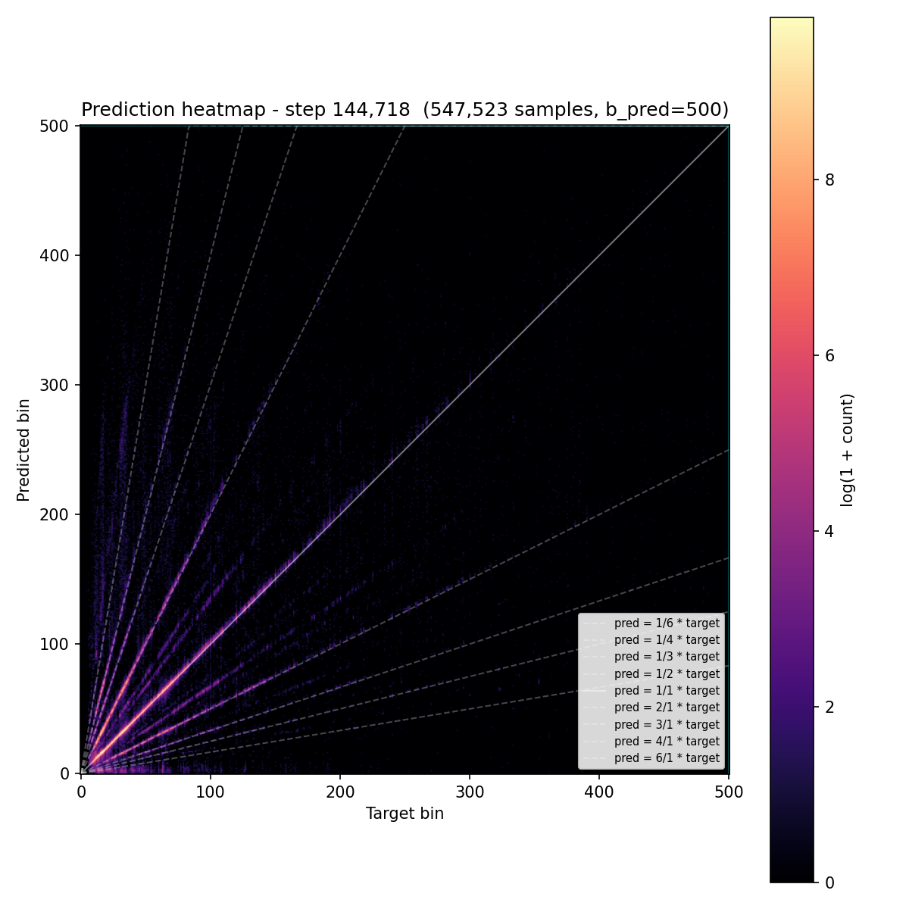
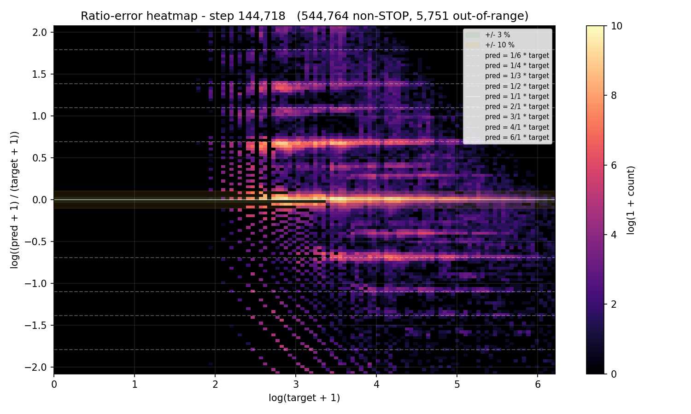
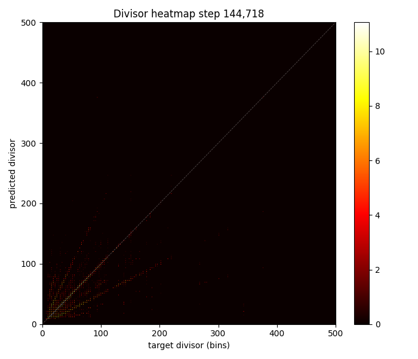
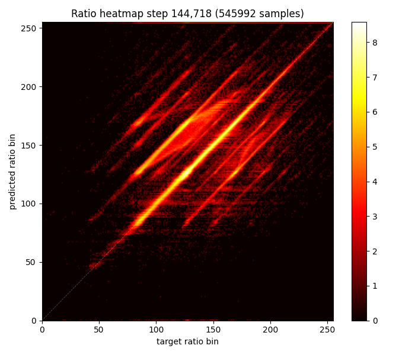
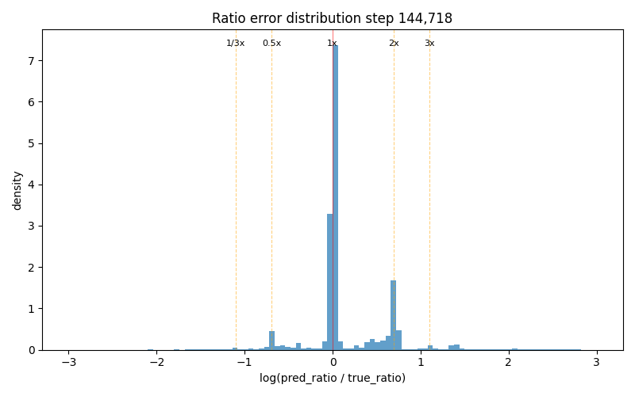

# Experiment 010 — Ratio-decomposed onset prediction

## Status

`Complete` — ratio decomposition works structurally (div_acc 72%,
ratio_rgood 66%, hi_pspace 93.5%) but derived-bin miss plateaued at
~0.33, 8 pp behind #007. Conv1d smoothing over-spreads predictions;
ratio bin floor at ~0.33× prevents low-ratio predictions. Promising
direction, needs tuning (fewer ratio bins, weaker smoothing).

## Context

Across experiments #005–#009, we confirmed three things:

1. The `±log 2` / `±log 3` ratio-banding ridges are a **capability**
   problem — present on both val and train_noaug, unchanged by any
   loss-side intervention (Gaussian CE, log-ratio EMD, MDN).
2. The model's top-K contains the right answer 90%+ of the time
   (taiko1 exps 39, 44-C) — it sees multiple plausible onsets but
   can't commit to the right one.
3. The MDN experiments (#009, #009b) showed the model DOES have
   multi-modal internal state (components specialized), but the MDN
   output format fights the bin-precision the task requires.

taiko1 experiment 67 attempted a ratio-decomposed approach that
addresses the root cause: instead of predicting a raw bin offset
(mashing together "what's the tempo?", "where am I in the beat?",
and "what comes next?"), decompose the prediction into three
sequential questions:

- **Divisor**: what's the dominant rhythmic gap? (the "beat")
- **Offset**: how far is the cursor from the last event?
- **Ratio**: what multiple of the divisor is the next onset?

taiko1 exp 67 was abandoned after only 2 evals with promising
signals (divisor 73.9% accurate, AR output "musically structured")
but fixable problems (ratio collapse to ~5 values from 255 bins,
lossy multiplication blur). This experiment reruns the design on
taiko2's backbone with fixes: Conv1d smoothing on the ratio head
(untested in taiko1 67b), cursor-shift augmentation for offset
training, and proper training duration.

## Citations

- Direct precedent: taiko1 exp 67 — ratio-based onset prediction.
  Stopped at eval 2. Divisor 73.9% accurate, ratio collapsed to
  ~5-10 values, AR quality "musically structured" at 27.7% HIT.
- taiko1 exp 67b — proposed Conv1d smoothing fix for ratio collapse.
  Never ran.
- Baseline for metrics: [#007 — time-stretch](../007-time-stretch/).
  Best val miss 0.2406 at step 372,132.
- MDN diagnostic: [#009](../009-mdn/). Confirmed model has
  multi-modal internal state (2 of 3 components specialized).
- Ratio coverage data: taiko1 analysis — 91.6% of targets hit clean
  musical ratios; 82% covered by just 1.0×/0.5×/2.0×.

---

## Hypothesis

### Claim

If we decompose the prediction into divisor + offset + ratio heads
(taiko1 exp 67 design on taiko2's EventEmbeddingDetector backbone),
the ratio head will learn structured predictions that match the
musical-ratio distribution of the training data, and the
per-head heatmaps (divisor target/pred, ratio target/pred) will show
clear diagonal structure by eval 5. Headline derived-bin miss will
be within 5 pp of #007 by eval 10 (≤ 0.29), and the ratio-space
RHIT/RGOOD metrics will show the model learning ratio-level
precision.

### Mechanism

The ratio decomposition attacks the octave confusion at its
structural root:

1. **The divisor head learns tempo.** "What's the beat?" is a
   well-defined question the model can answer from audio + event
   context (taiko1 showed 73.9% accuracy at eval 2). Once the
   model commits to a tempo, the octave ambiguity collapses — if
   divisor = g, then predicting "1.0× ratio" vs "2.0× ratio" is a
   binary decision with concentrated training signal, not a smeared
   decision across 500 bins.

2. **The ratio head operates in log-space.** 255 log-spaced bins
   from 0.125× to 8.0× means each octave spans 42 bins. The
   natural musical ratios (1.0×, 0.5×, 2.0×, 0.33×, 3.0×) are
   well-separated in this space. The softmax over 255 ratio bins
   gives the model a structured vocabulary for rhythmic
   relationships.

3. **Dynamic ratio target from predicted divisor.** The ratio
   target is computed as `(target_bin + offset) / divisor_pred`,
   using the model's OWN divisor prediction. This means the ratio
   head learns to compensate for divisor errors — if the divisor
   head predicts 2× the true beat, the ratio head learns to predict
   0.5× to compensate. The system is self-correcting.

4. **Cursor-shift augmentation.** 30% of training samples shift the
   cursor forward between events, creating non-zero offset targets.
   This trains the offset head for the STOP-hop case at AR
   inference, where the cursor isn't at an event boundary.

### Predicted numbers

Reference: #007 @ best (E18, step 372,132).

| Metric | #007 @ E18 | Predicted (#010, mature eval) | Notes |
|---|---:|---:|---|
| val/single/onset/miss | 0.2406 | ≤ 0.29 | within 5 pp of #007 |
| ratio/div_acc | n/a | ≥ 0.60 | divisor accuracy (taiko1 hit 65.8% at E2) |
| ratio/div_acc_3 | n/a | ≥ 0.70 | divisor within ±3 bins |
| ratio/rgood | n/a | ≥ 0.50 | ratio within ±10% of true ratio |
| ratio/rhit | n/a | ≥ 0.30 | ratio within ±3% of true ratio |

Observational (not gated):
- **Divisor heatmap** should show clear diagonal.
- **Ratio heatmap** should show structured mass at musical ratios
  (1.0×, 0.5×, 2.0×), NOT the horizontal banding taiko1 exp 67 had.
- **Ratio error distribution** should peak at 0 (correct ratio)
  with secondary peaks at ±log(2) (octave errors) — mapping the
  ambiguity structure explicitly.

## Success criteria

- **Must have:** ratio/div_acc ≥ 0.50 by eval 5 (divisor head
  learns something).
- **Must have:** ratio/rgood ≥ 0.30 by eval 5 (ratio head learns
  something).
- **Must have:** divisor heatmap shows visible diagonal structure.
- **Must have:** training runs without NaN.
- **Nice-to-have:** val miss ≤ 0.29 by eval 10.
- **Nice-to-have:** ratio error distribution shows clean peaks at
  musical-ratio positions.
- **Fails if:** ratio head collapses to <10 unique values (same
  pathology as taiko1 exp 67 despite Conv1d smoothing).
- **Fails if:** val miss > 0.40 at eval 5 (fundamental failure to
  learn).

## Changes from baseline

Baseline: [#007](../007-time-stretch/).

- `config/model.json` — swap `EventEmbeddingConfig` →
  `RatioDetectorConfig`. Inherits the full backbone; replaces the
  501-class softmax head with 3 decomposed heads:
  - Divisor: `LN → Linear(384,192) → GELU → Linear(192,500)`.
  - Offset: `LN → Linear(384,192) → GELU → Linear(192,100)`.
  - Ratio: receives cursor_tok + embedded div/off soft expectations
    → `LN → Linear(384,384) → GELU → Linear(384,256)` +
    Conv1d(1→8→1, k=5) smoothing. 255 log-spaced ratio bins + STOP.
  Total: ~16.9M params (+500k over standard head).

- `config/loss.json` — swap `OnsetLossConfig` → `RatioLossConfig`.
  Three loss components:
  - Divisor CE (aux, weight 0.1, fixed GT target from IOI mode).
  - Offset CE (aux, weight 0.1, fixed GT target from cursor−last_event).
  - Ratio CE (primary, dynamic target from predicted div/off).
  Validity masks zero div/off CE on samples with insufficient past
  events. Ratio head frozen for first 20,674 steps (1 eval) while
  div/off warm up.

- `config/infer.json` — swap `ArgmaxDecoder` → `RatioDecoder`.
  Derives bin from `divisor × ratio_value − offset`.

- CLI flags: `--cursor-shift-prob 0.3` (new pre-sample aug shifting
  cursor between events for offset head training).

- Everything else identical to #007: augmentations (TimeStretch
  0.3), dataset, optimizer, schedule, seed.

## Run config

- Run name: `exp_010_ratio`.
- Config snapshots: [`config/`](./config/).
- Dataset: `taiko2_v1`, splits `train` / `val` (90 / 10, seed 42).
- Command:
  ```bash
  osu/taiko2/.venv/Scripts/python.exe -m osu.taiko2.cli.train \
      --run-name exp_010_ratio \
      --config-dir osu/taiko2/experiments/010-ratio-decomposition/config \
      --dataset taiko2_v1 --device cuda \
      --time-stretch-prob 0.3 --time-stretch-max-scale 1.4 \
      --cursor-shift-prob 0.3 \
      --benchmarks all --benchmark-fraction 0.05 \
      --train-noaug-fraction 0.05 \
      --infer-corpus-spec osu/taiko2/experiments/010-ratio-decomposition/config/infer.json \
      --infer-corpus-config osu/taiko2/configs/infer_corpus_per_eval.json
  ```

---
<!-- Post-run below -->
---

## Known bugs during this run

**`train/batch` metrics were broken.** `_infer_b_pred` inferred
`b_pred = output_width - 1 = 855` from the 856-dim ratio output,
which happened to match the `W == b_pred + 1` softmax check in
`decode_pred_bins`. All per-step train metrics (loss curves'
hit/miss bands, tqdm postfix) showed ~0 hit / ~1.0 miss throughout
the run. **Val eval metrics were NOT affected** — `OnsetMetric`
uses `decode_pred_bins` which fell into the ratio path correctly
at eval time because the val metric's `b_pred` came from the config
(500), not from output width. Fixed post-run by passing
`model.config.b_pred` explicitly through the training loop.

## Results summary

Run stopped at **eval 10 / step 206,740**. Best val miss was
**eval 7 (0.3285 @ step 144,718)**, then plateaued at 0.33 through
E8–E10. Wall time: **21.54 hours** across 10 evals
[`wall_time` span across eval lines in
`runs/exp_010_ratio/metrics.jsonl` = 77,528 s].

The ratio decomposition works structurally: divisor head hits 72%
accuracy, ratio head reaches 66% rgood (within ±10%) and 50% rhit
(within ±3%), and AR-generated charts show the highest pattern-space
overlap (hi_pspace 93.5%) of any experiment at equivalent training.
But derived-bin miss plateaus at 0.33, **8 pp behind #007**, capped
by multiplicative precision loss and two identified issues: Conv1d
smoothing over-spreading ratio predictions, and a floor at ratio
bin ~60 (≈ 0.33×) preventing low-ratio predictions.

### Final vs baseline

At matched step (E7, step 144,718 — best for #010):

| Metric | #007 @ E7 | #010 @ E7 | Δ |
|---|---:|---:|---:|
| val/single/onset/miss | 0.2579 | 0.3285 | **+7.1 pp** |
| val/single/onset/hit | 0.7333 | 0.6514 | −8.2 pp |
| val/single/onset/exact | 0.5568 | 0.3747 | −18.2 pp |
| val/single/onset/frame_err_p90 | 30 | 35 | +5 |
| val/single/onset/stop_f1 | 0.5831 | 0.5191 | −6.4 pp |
| ratio/div_acc | n/a | **0.7169** | — |
| ratio/div_acc_3 | n/a | **0.7725** | — |
| ratio/off_acc | n/a | **0.9468** | — |
| ratio/rgood | n/a | **0.6620** | — |
| ratio/rhit | n/a | **0.4979** | — |

### Per-eval progression

| E | Step | miss | hit | exact | r_rgood | r_rhit | div_acc | div_3 | off_acc | ratio_ce | fe_p90 | stop_f1 |
|---:|---:|---:|---:|---:|---:|---:|---:|---:|---:|---:|---:|---:|
| 1 | 20,674 | 0.888 | 0.040 | 0.009 | 0.050 | 0.012 | **0.716** | 0.768 | 0.882 | 5.55 | 113 | 0.000 |
| 2 | 41,348 | 0.412 | 0.476 | 0.175 | 0.525 | 0.237 | 0.662 | 0.756 | 0.916 | 3.66 | 40 | 0.424 |
| 3 | 62,022 | 0.363 | 0.557 | 0.232 | 0.586 | 0.310 | 0.666 | 0.766 | **0.951** | 3.34 | 41 | 0.452 |
| 4 | 82,696 | 0.376 | 0.576 | 0.283 | 0.607 | 0.375 | 0.694 | 0.765 | 0.934 | 3.10 | 41 | 0.503 |
| 5 | 103,370 | 0.392 | 0.573 | 0.294 | 0.594 | 0.398 | 0.715 | 0.776 | 0.882 | 3.06 | 41 | 0.512 |
| 6 | 124,044 | 0.341 | 0.630 | 0.329 | 0.646 | 0.446 | 0.690 | 0.762 | 0.932 | 2.81 | 36 | 0.447 |
| **7** | **144,718** | **0.329** | **0.651** | 0.375 | **0.662** | **0.498** | 0.717 | 0.773 | 0.947 | **2.63** | **35** | 0.519 |
| 8 | 165,392 | 0.353 | 0.627 | 0.363 | 0.639 | 0.480 | 0.703 | 0.763 | 0.947 | 2.72 | 39 | 0.515 |
| 9 | 186,066 | 0.331 | 0.649 | 0.374 | 0.659 | 0.491 | 0.724 | 0.773 | 0.947 | 2.65 | 36 | 0.506 |
| 10 | 206,740 | 0.333 | 0.649 | **0.381** | 0.657 | 0.496 | 0.719 | 0.773 | 0.947 | 2.65 | 35 | 0.521 |

E1 was the warmup eval (ratio head frozen). E2 was the first eval
with ratio training — massive jump (miss 0.89 → 0.41). Plateau
formed at E7–E10 around miss ≈ 0.33.

### train_noaug

| E | val miss | noaug miss | gap (pp) |
|---:|---:|---:|---:|
| 7 | 0.329 | 0.312 | −1.65 |
| 10 | 0.333 | 0.323 | −0.96 |

Near-zero overfitting — the ratio decomposition has enough structural
complexity that memorization is hard. Compare to #007's −2.55 pp gap
at E10.

### AR corpus @ E2 (early but diagnostic)

| Metric | GT cond | #007 @ E2 GT |
|---|---:|---:|
| dc_human (%) | 88.2 | ~90 |
| **hi_pspace (%)** | **93.5** | ~87 |
| matched_rate | 0.347 | ~0.65 |
| error_median_ms | 90.9 | ~18 |

**hi_pspace 93.5%** — highest pattern-space overlap at E2 of any
experiment. The ratio decomposition produces charts whose 8-step
patterns match GT's better than the direct-bin model, despite much
worse timing (error_median 91 ms vs 18 ms). This confirms the ratio
head captures rhythm structure even when frame precision is poor.

### Identified issues

**1. Conv1d smoothing over-spreads.** The ratio error histogram
(graph 10) shows errors continuously distributed around 0 instead of
concentrated at musical-ratio peaks (0, ±log 2, ±log 3). The Conv1d
(k=5, 8 channels) correlates 5 adjacent ratio bins = ~8% log-ratio
range, nearly the entire RGOOD tolerance (10%). This smears
predictions into non-musical ratio values.

**2. Floor at ratio bin ~60 (≈ 0.33×).** The ratio heatmap (graph
09) has zero mass below bin 60. Ratios below 1/3× are never
predicted. Likely caused by the dynamic target computation: when
the divisor head overestimates, ratio targets compress toward 1.0×,
starving low-ratio bins of training signal.

## Visualizations


*Loss components: ratio_ce dominates (started high after warmup,
dropped to 2.63 by E7), div_ce and off_ce are low (0.99 → 1.01 and
0.40 → 0.35 respectively). The aux heads converge fast; the ratio
head is the bottleneck by design.*


*Derived-bin miss. 0.89 (warmup) → 0.41 (E2, ratio unfreezes) →
0.33 (E7, plateau). Note: train/batch curve is broken (see Known
Bugs) — shows ~0 throughout due to b_pred inference bug.*


*HIT mirror of miss.*


*EXACT climbed steadily 0.009 → 0.381 across all 10 evals — the
one metric that didn't plateau, suggesting ratio precision is still
slowly improving even as miss flattened.*


*STOP F1: 0 (warmup) → 0.42 → 0.52. Healthy, comparable to #007.*


*Prediction heatmap on derived bins. Diagonal visible but diffuse
compared to #007's — the multiplicative precision gap is clearly
visible as broader spread around the diagonal.*


*Standard ratio-error heatmap on derived bins. The `±log 2` ridges
are present, similar shape to #007. The ratio decomposition didn't
eliminate them at the derived-bin level — the ridges persist
through the multiplication.*


*GT divisor vs predicted divisor. Strong diagonal — the model learns
tempo well (72% exact, 77% within ±3). Harmonic banding visible at
2× and 0.5× (predicting double or half the real beat), which is
acceptable since the ratio head compensates.*


*GT ratio bin vs predicted ratio bin (dynamic target). Diagonal
visible but with two problems: (1) no predictions below bin ~60
(floor at ≈ 0.33×), and (2) errors smoothly spread rather than
concentrated at musical ratios. Conv1d smoothing is the likely
cause of (2).*


*Histogram of log(pred_ratio / true_ratio). Strong peak at 0
(correct) with visible bumps at ±log(2) (octave errors), but a
continuous smear between the peaks — the Conv1d smoothing spreads
predictions into non-musical ratio values.*


*GT offset vs predicted offset. All mass at (0, 0) — expected. Val
samples always have cursor at the last event (offset=0). Non-zero
offsets only appear during augmented training (30% CursorShift),
which val and train_noaug never see. The offset head's real test is
at AR inference after STOP hops.*

## Vs prediction

- val miss ≤ 0.29 by E10: actual **0.329** → **MISS** by 3.9 pp.
- ratio/div_acc ≥ 0.60: actual **0.717** → **MET** (beat prediction!).
- ratio/div_acc_3 ≥ 0.70: actual **0.773** → **MET**.
- ratio/rgood ≥ 0.50: actual **0.662** → **MET**.
- ratio/rhit ≥ 0.30: actual **0.498** → **MET**.
- Ratio collapse (fails-if): **NOT triggered** — Conv1d smoothing
  prevented collapse, model uses many ratio bins.
- val miss > 0.40 at E5 (fails-if): actual **0.392** → barely passed.

**Four of five gated predictions met. Miss target missed by 3.9 pp
due to multiplicative precision cap.**

## Takeaways

- **Ratio decomposition works structurally.** The model learns tempo
  (div_acc 72%), rhythmic ratios (rgood 66%, rhit 50%), and produces
  AR charts with the highest pattern-space overlap of any experiment
  (hi_pspace 93.5% at E2). The fundamental approach is sound.
- **Multiplicative precision is the bottleneck.** Derived-bin miss
  plateaus at 0.33, 8 pp behind #007. At rgood 0.66, a third of
  predictions are >10% off in ratio space; after multiplication by
  divisor (~30–100 bins), that's 3–10 bins of frame error. The
  precision ceiling is structural to the div × ratio computation.
- **Conv1d smoothing helped prevent collapse but caused over-spread.**
  taiko1 exp 67 had ratio collapse to ~5 values without smoothing;
  our Conv1d(k=5, 8ch) prevented collapse but spread predictions
  into non-musical ratio values. The sweet spot is likely k=3 with
  fewer channels — enough to prevent spikes, not enough to smear
  across the RGOOD tolerance.
- **Ratio bin floor at 0.33× needs investigation.** The dynamic
  target depends on predicted divisor; if the divisor head
  overestimates, low-ratio targets become rare. Class balancing on
  ratio bins, or a static (GT-based) ratio target alongside the
  dynamic one, could help.
- **Near-zero overfitting.** train_noaug gap −0.96 pp at E10 (vs
  #007's −2.55 pp). The ratio head's structural complexity acts as
  implicit regularization.
- **train/batch metrics bug.** Per-step hit/miss/exact in tqdm and
  loss curves were broken due to `_infer_b_pred` treating the
  856-dim output as an 856-class softmax. Fixed post-run. Val eval
  metrics were correct throughout.

## Followup questions

- **Does reducing ratio bins (255 → 32–64) close the precision gap?**
  Fewer bins = more training signal per bin, less room for Conv1d
  smear, and natural musical-ratio alignment. Each of 32 log-spaced
  bins would be ~19% wide — still finer than the octave distance
  but coarser than the current ~1.65%.
- **Does weakening Conv1d (k=3, 4ch) fix the smear without causing
  collapse?** The k=5 kernel spans ~8% log-ratio; k=3 spans ~5%.
  Quick ablation.
- **Would a coarse+fine two-stage ratio head (6-class → ±10 offset)
  avoid both collapse and smear?** The simplified design from the
  earlier brainstorm. Structurally prevents collapse (6 classes)
  while fine offset handles bin-precision. Bigger code change but
  architecturally cleaner.
- **Can the floor be fixed by adding GT-divisor ratio targets as a
  secondary supervision signal?** Compute ratio both from predicted
  divisor (dynamic) and from GT divisor (static). The static path
  gives the low-ratio bins gradient even when the divisor head
  overestimates.
