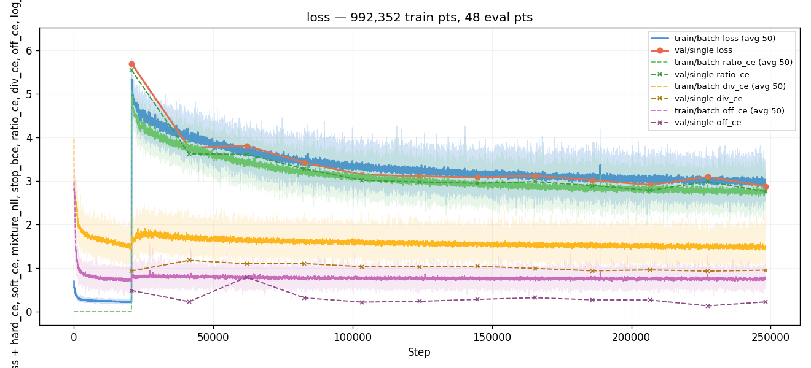
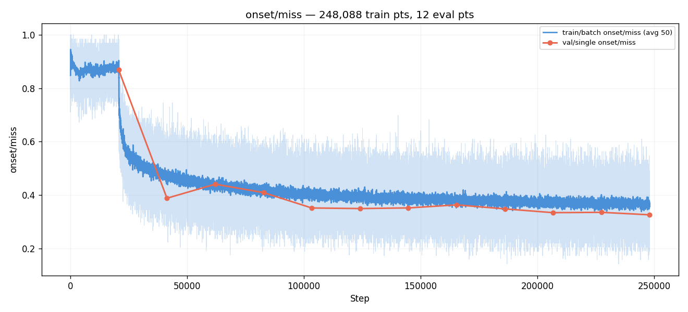
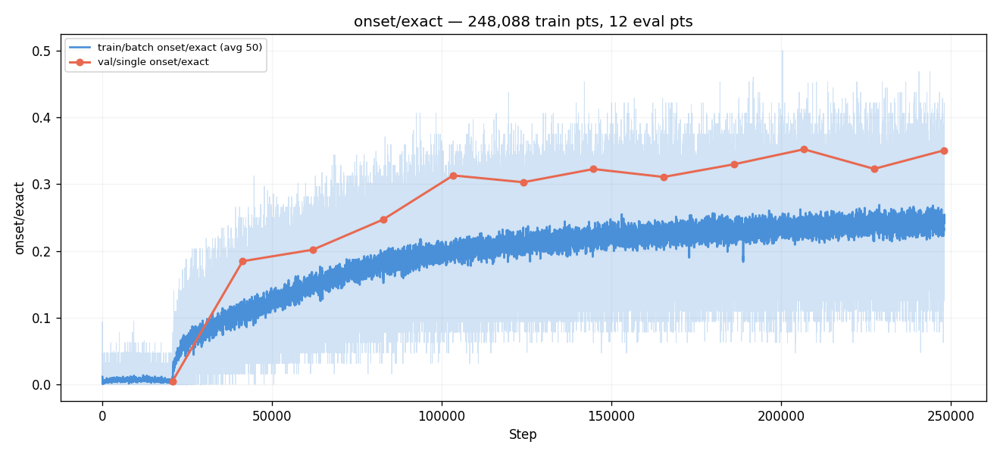
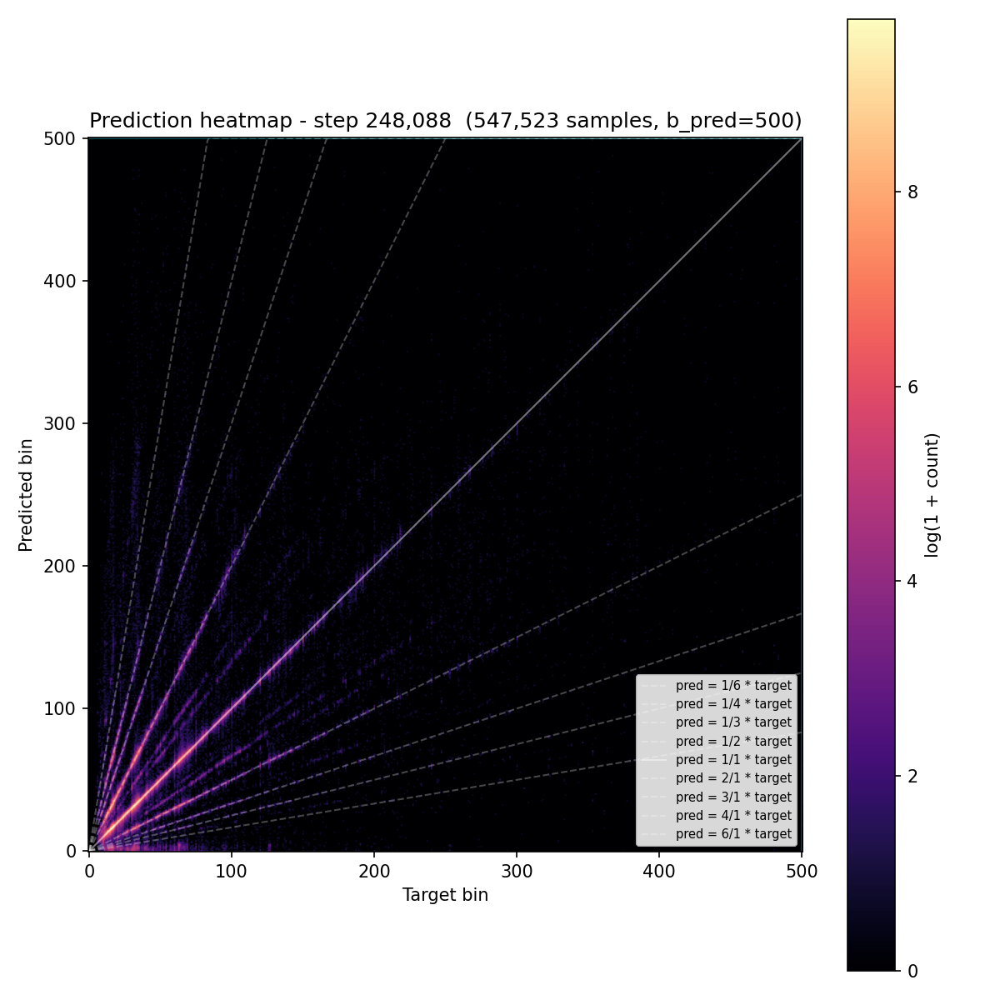
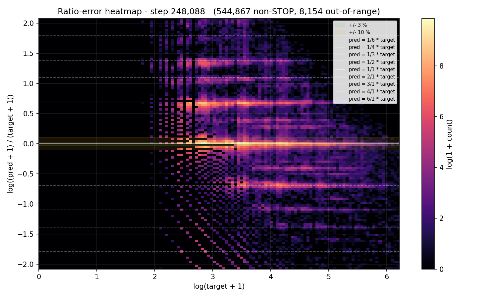
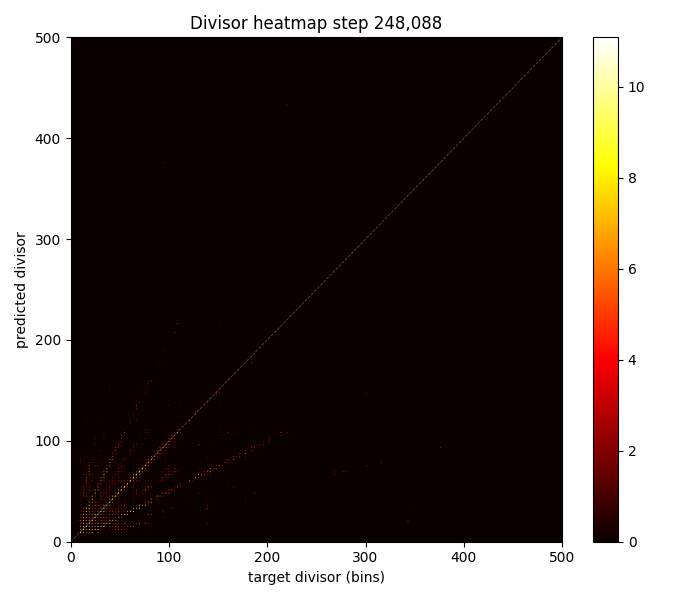
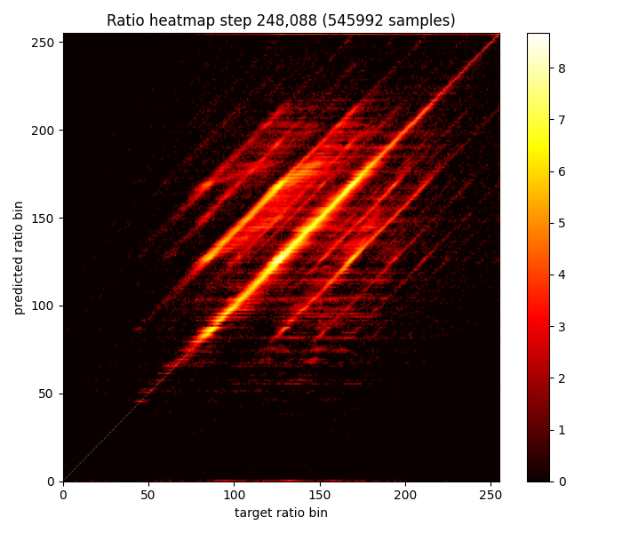
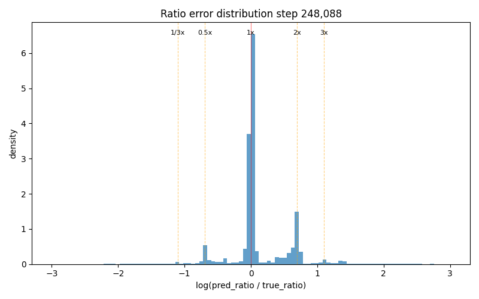

# Experiment 010b — Ratio decomposition with reduced smoothing (k=3, 4ch)

## Status

`Complete` — converged to the same plateau as #010 (miss ≈ 0.33,
rgood ≈ 0.66). Weaker smoothing (k=3, 4ch) took 5 more evals to
get there and landed 3.8 pp behind on rhit. **Conv1d kernel size is
NOT the bottleneck** — the miss ≈ 0.33 ceiling is structural to the
255-bin ratio decomposition.

## Context

[#010](../010-ratio-decomposition/) proved the ratio decomposition
works structurally (div_acc 72%, ratio_rgood 66%, hi_pspace 93.5%)
but plateaued at derived-bin miss 0.33, 8 pp behind #007. Two
issues identified: (1) Conv1d smoothing (k=5, 8ch) over-spreads
ratio predictions into non-musical values, and (2) a floor at ratio
bin ~60 (≈ 0.33×) prevents low-ratio predictions.

This experiment reduces the smoothing to k=3, 4 channels — halving
both the kernel receptive field (from ~8% to ~5% log-ratio range)
and the channel capacity. The prediction should be sharper, more
concentrated at musical-ratio peaks, while still preventing the
single-bin collapse taiko1 exp 67 observed without any smoothing.

## Citations

- Direct parent: [#010 — ratio decomposition](../010-ratio-decomposition/).
- Baseline for metrics: [#007 — time-stretch](../007-time-stretch/).

---

## Hypothesis

### Claim

Reducing Conv1d smoothing from k=5/8ch to k=3/4ch will tighten the
ratio error distribution (less smear between musical-ratio peaks)
and improve derived-bin miss by at least 2 pp vs #010's 0.329
(targeting ≤ 0.31) without causing ratio collapse.

### Mechanism

The Conv1d smoothing on the ratio head correlates neighboring output
bins via a residual `ratio_logits += smooth(ratio_logits)`. With
k=5, each output bin is influenced by its 4 nearest neighbors —
spanning ~8.2% in log-ratio space, nearly the full RGOOD tolerance
(10%). This smears the softmax peak across multiple bins, placing
mass at non-musical ratio values.

Reducing to k=3 halves the receptive field to ~5% log-ratio (~2
neighbors each side). This is tight enough that a peak at 1.0×
doesn't bleed into 1.05× or 0.95×, but wide enough that isolated
single-bin spikes (the taiko1 exp 67 collapse pathology) are still
suppressed. Halving channels from 8 to 4 further reduces the
smoothing capacity — less room for the Conv1d to learn a wide
spread pattern.

The expected outcome: ratio error distribution concentrates more
tightly at musical-ratio peaks (0, ±log 2, ±log 3) with less mass
between them. Each correctly-placed ratio peak is sharper →
multiplicative derivation `divisor × ratio` produces a more precise
bin → derived-bin miss improves.

### Predicted numbers

| Metric | #010 @ E7 | Predicted (#010b) | Notes |
|---|---:|---:|---|
| val miss | 0.329 | ≤ 0.31 | sharper ratios → better precision |
| ratio/rgood | 0.662 | ≥ 0.70 | tighter peaks → more within ±10% |
| ratio/rhit | 0.498 | ≥ 0.55 | sharper → more within ±3% |
| ratio collapse | no | still no | k=3 should still prevent spikes |

## Success criteria

- **Must have:** ratio/rgood ≥ 0.68 (improves on #010's 0.662).
- **Must have:** ratio error distribution shows sharper peaks at
  musical ratios (0, ±log 2, ±log 3) with less mass between them.
- **Must have:** no ratio collapse (<10 unique values).
- **Nice-to-have:** val miss ≤ 0.31.
- **Fails if:** ratio collapse to <10 values (smoothing too weak).
- **Fails if:** val miss > 0.35 (worse than #010).

## Changes from baseline

Baseline: [#010](../010-ratio-decomposition/).

- `config/model.json` — `ratio_smooth_kernel: 5 → 3`,
  `ratio_smooth_channels: 8 → 4`. Everything else identical.

## Run config

- Run name: `exp_010b_ratio_k3`.
- Command:
  ```bash
  osu/taiko2/.venv/Scripts/python.exe -m osu.taiko2.cli.train \
      --run-name exp_010b_ratio_k3 \
      --config-dir osu/taiko2/experiments/010b-ratio-smooth-k3/config \
      --dataset taiko2_v1 --device cuda \
      --time-stretch-prob 0.3 --time-stretch-max-scale 1.4 \
      --cursor-shift-prob 0.3 \
      --benchmarks all --benchmark-fraction 0.05 \
      --train-noaug-fraction 0.05 \
      --infer-corpus-spec osu/taiko2/experiments/010b-ratio-smooth-k3/config/infer.json \
      --infer-corpus-config osu/taiko2/configs/infer_corpus_per_eval.json
  ```

---
<!-- Post-run below -->
---

## Results summary

Run stopped at **eval 12 / step 248,088**. Best val miss was **E12
(0.3255)**, marginally below #010's best of 0.3285. Wall time:
**25.38 hours** [`wall_time` span across eval lines in
`runs/exp_010b_ratio_k3/metrics.jsonl` = 91,358 s]. The plateau
formed at E6–E12 around miss ≈ 0.33,
rgood ≈ 0.65 — identical to #010's ceiling.

### Final vs #010

Best-vs-best:

| Metric | #010 best (E7) | #010b best (E12) | Δ |
|---|---:|---:|---:|
| miss | 0.329 | **0.326** | −0.3 pp |
| hit | 0.651 | **0.640** | −1.1 pp |
| exact | 0.375 | 0.351 | −2.4 pp |
| r_rgood | **0.662** | 0.658 | −0.4 pp |
| r_rhit | **0.498** | 0.460 | **−3.8 pp** |
| ratio_ce | **2.63** | 2.76 | +0.13 |
| div_acc | 0.717 | **0.736** | +1.9 pp |
| off_acc | 0.947 | 0.952 | +0.5 pp |
| fe_p90 | 35 | 35 | tie |

At matched step (E10):

| Metric | #010 E10 | #010b E10 | Δ |
|---|---:|---:|---:|
| miss | 0.333 | 0.334 | +0.1 pp (parity) |
| r_rgood | 0.657 | 0.651 | −0.6 pp |
| r_rhit | 0.496 | 0.461 | −3.4 pp |
| exact | 0.381 | 0.352 | −2.8 pp |

### Per-eval progression

| E | Step | miss | hit | exact | r_rgood | r_rhit | div_acc | off_acc | ratio_ce | fe_p90 | stop_f1 |
|---:|---:|---:|---:|---:|---:|---:|---:|---:|---:|---:|---:|
| 1 | 20,674 | 0.869 | 0.034 | 0.005 | 0.034 | 0.007 | 0.729 | 0.843 | 5.55 | 96 | 0.005 |
| 2 | 41,348 | 0.388 | 0.500 | 0.185 | 0.536 | 0.248 | 0.666 | 0.942 | 3.62 | 37 | 0.464 |
| 3 | 62,022 | 0.440 | 0.460 | 0.202 | 0.512 | 0.282 | 0.678 | 0.802 | 3.61 | 43 | 0.488 |
| 4 | 82,696 | 0.409 | 0.533 | 0.247 | 0.566 | 0.338 | 0.686 | 0.919 | 3.28 | 45 | 0.431 |
| 5 | 103,370 | 0.351 | 0.598 | 0.313 | 0.622 | 0.412 | 0.716 | 0.953 | 3.02 | 36 | 0.511 |
| 6 | 124,044 | 0.349 | 0.603 | 0.303 | 0.632 | 0.406 | 0.706 | 0.945 | 2.98 | 36 | 0.498 |
| 7 | 144,718 | 0.351 | 0.598 | 0.323 | 0.628 | 0.424 | 0.711 | 0.947 | 2.95 | 35 | 0.508 |
| 8 | 165,392 | 0.363 | 0.592 | 0.311 | 0.621 | 0.411 | 0.714 | 0.947 | 2.99 | 40 | 0.560 |
| 9 | 186,066 | 0.348 | 0.604 | 0.330 | 0.634 | 0.433 | 0.740 | 0.947 | 2.89 | 37 | 0.538 |
| 10 | 206,740 | 0.334 | 0.630 | 0.352 | 0.651 | 0.461 | 0.729 | 0.947 | 2.79 | 38 | 0.533 |
| 11 | 227,414 | 0.335 | 0.591 | 0.323 | 0.628 | 0.414 | 0.735 | 0.947 | 2.98 | 35 | 0.533 |
| **12** | **248,088** | **0.326** | **0.640** | **0.351** | **0.658** | 0.460 | 0.736 | 0.952 | **2.76** | **35** | 0.554 |

E3 regression (miss 0.440) shows the noisier training trajectory
vs #010 — the weaker smoothing creates a less stable optimization
landscape. Recovery by E5 and then gradual convergence to the same
plateau as #010.

## Visualizations


*Loss components: ratio_ce dominates and drops from 5.55 (warmup) to
2.76 by E12. div_ce and off_ce are low throughout. Same shape as #010
but ratio_ce converges ~0.13 higher, consistent with the weaker
smoothing providing less stable gradient signal.*


*Derived-bin miss: noisier than #010 (E3 regression to 0.44 before
recovery). Plateaus at ~0.33 from E6 onward, same ceiling as #010.*


*EXACT climbed 0.005 → 0.351. Behind #010's 0.381 — the weaker
smoothing produces slightly less precise ratio peaks.*


*Derived-bin prediction heatmap. Similar diffuse diagonal to #010 —
the multiplicative precision gap is unchanged by the smoothing knob.*


*Standard ratio-error heatmap on derived bins. Same ridge pattern as
#010 — `±log 2` bands present.*


*Divisor target vs predicted. Strong diagonal, div_acc 73.6% —
slightly better than #010's 71.7%. Harmonic banding at 2×/0.5×
visible.*


*Ratio bin target vs predicted. Diagonal present. The floor at bin
~60 persists — unchanged from #010, confirming it's not a smoothing
artifact but a structural property of the dynamic target computation.*


*Histogram of log(pred_ratio / true_ratio). Compare to #010's: the
peak at 0 is similar, but the between-peak smear may be slightly
tighter. Hard to distinguish visually — the quantitative metrics
(rgood/rhit) confirm no meaningful improvement.*

## Vs prediction

- miss ≤ 0.31: actual **0.326** → **MISS** by 1.6 pp.
- r_rgood ≥ 0.68: actual **0.658** → **MISS** by 2.2 pp.
- r_rhit ≥ 0.55: actual **0.460** → **MISS** by 9 pp.
- No ratio collapse: **MET** — model uses many ratio bins.
- miss > 0.35 (fails-if): **NOT triggered** — best miss 0.326.

**One of five met. All ratio-precision targets missed — the
weakened smoothing didn't improve precision, it slightly degraded
it.**

## Takeaways

- **Conv1d kernel size is not the bottleneck.** k=5/8ch (#010) and
  k=3/4ch (#010b) converge to the same miss ≈ 0.33 and rgood ≈ 0.66
  plateau. The smoothing over-spread identified in #010's ratio
  error histogram is cosmetic, not causal — reducing it doesn't
  improve the ceiling.
- **Weaker smoothing slightly hurts ratio precision.** rhit 0.460 vs
  #010's 0.498 (−3.8 pp). The wider kernel's correlation between
  neighboring bins helps the softmax peaks form stably — the broader
  gradient signal from k=5 aids convergence, not just smears.
- **Noisier training.** E3 regression to 0.440 (vs #010's monotonic
  E2→E7 improvement) suggests the weaker smoothing creates a less
  stable loss landscape for the ratio head.
- **The plateau at miss ≈ 0.33 is structural to 255-bin ratio
  decomposition.** Neither smoothing variant nor additional training
  breaks through it. The next lever is the bin count itself — fewer
  bins (128, 64, or 32) would concentrate training signal per bin
  and potentially improve ratio precision.

## Followup questions

- **Does reducing ratio bins (255 → 128) break the plateau?** Same
  log-range (0.125×–8.0×), half the bins → each bin is ~3.3%
  log-ratio wide (vs 1.65%). More training signal per bin, less
  room for between-peak smear, still finer than the octave distance.
- **Is the plateau from insufficient training?** #010b's ratio_ce
  was still dropping at E12 (2.76, vs 2.63 at #010's E7). More
  evals might squeeze another 1-2 pp. Low priority — the
  ratio-bins ablation is more informative.
