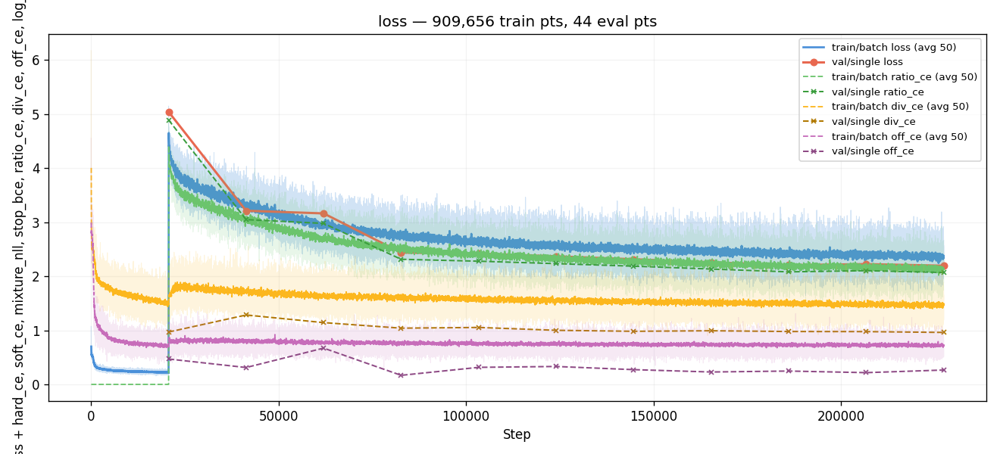
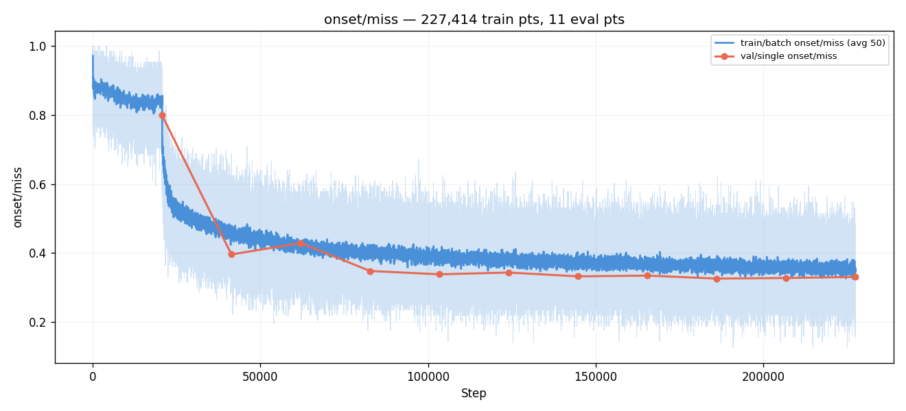
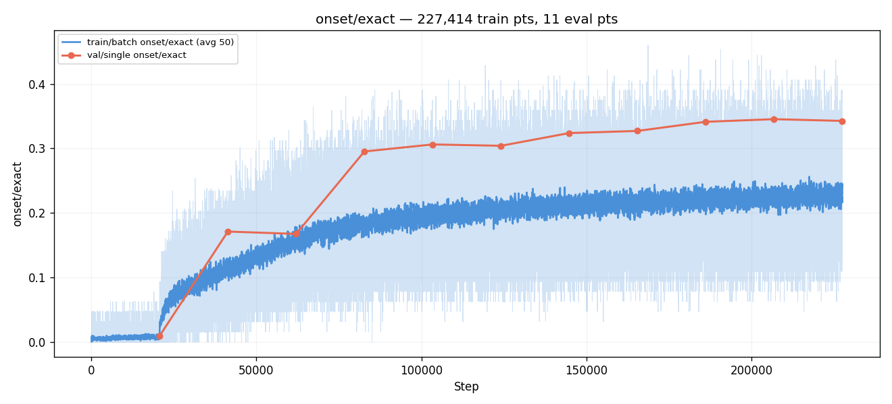
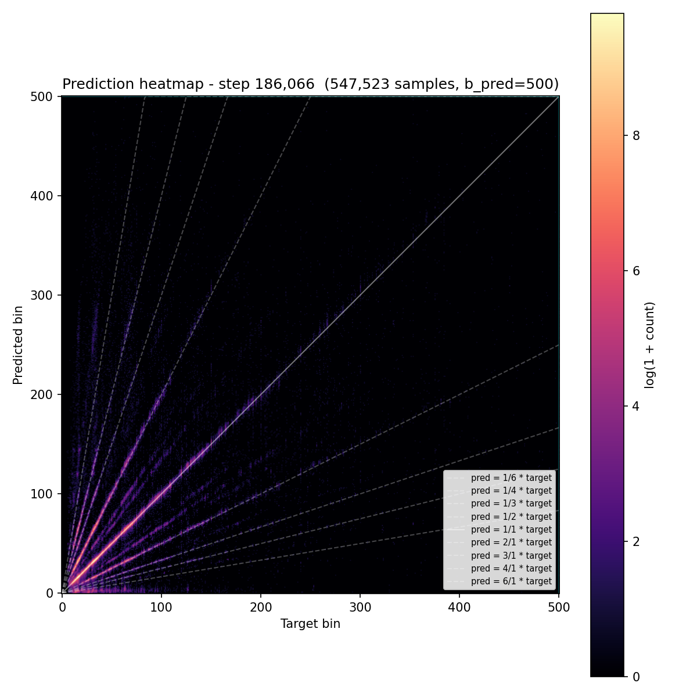
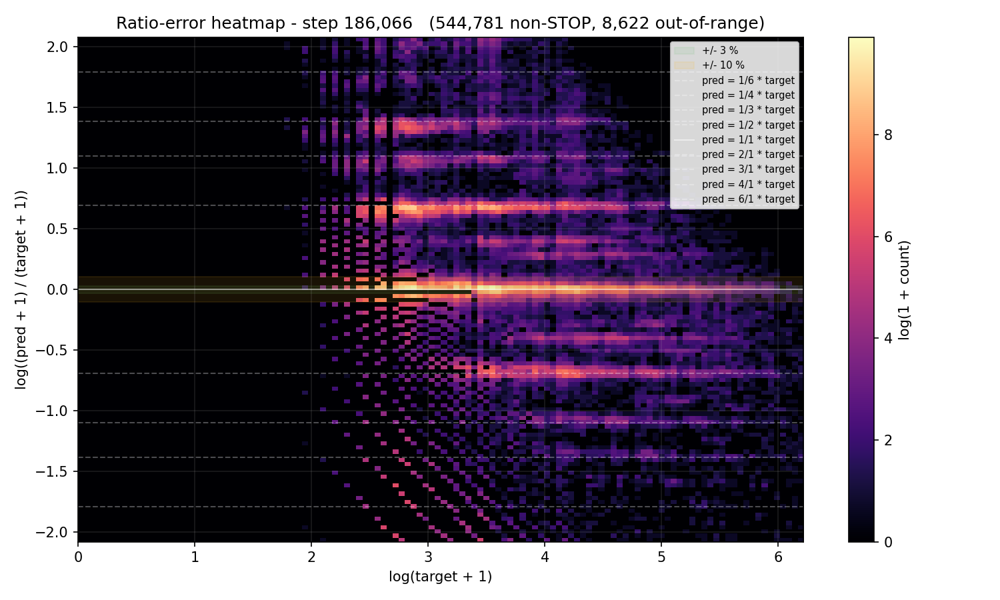
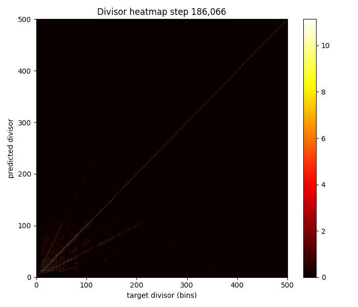
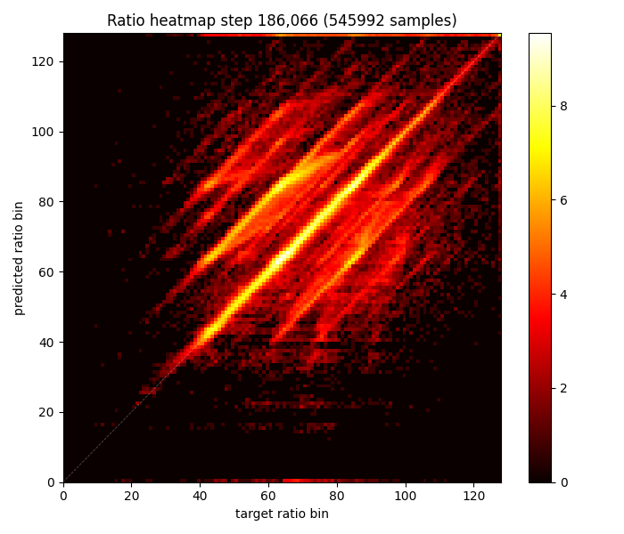
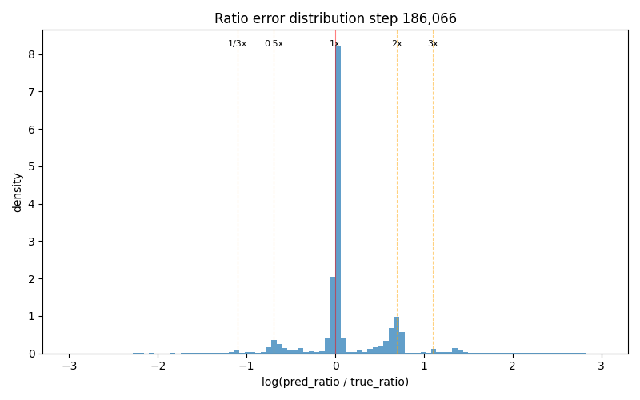

# Experiment 010c — Ratio decomposition with 128 bins (half resolution)

## Status

`Complete` — converged to the same plateau as #010 and #010b
(miss ≈ 0.33, rgood ≈ 0.66). E5 was 5.4 pp ahead of #010 at the
same step but the advantage didn't translate to a lower ceiling.
**Confirms the plateau is structural to the ratio decomposition,
not a function of bin count or smoothing.**

## Context

[#010](../010-ratio-decomposition/) and
[#010b](../010b-ratio-smooth-k3/) both plateaued at miss ≈ 0.33 and
rgood ≈ 0.66 with 255 ratio bins. Conv1d smoothing kernel size (k=5
vs k=3) didn't change the ceiling. The hypothesis: 255 bins is too
fine-grained — each bin is ~1.65% in log-ratio space, the model
spreads predictions across many near-identical bins instead of
committing to specific musical ratios. Halving to 128 bins doubles
the per-bin training signal and makes each bin ~3.3% wide — still
finer than the 10% RGOOD tolerance but coarser enough that the model
should commit more confidently.

## Citations

- Direct parent: [#010](../010-ratio-decomposition/) and
  [#010b](../010b-ratio-smooth-k3/) — both plateaued at same ceiling.
- Baseline for metrics: [#007 — time-stretch](../007-time-stretch/).

---

## Hypothesis

### Claim

Halving ratio bins from 255 to 128 (same 0.125×–8.0× range) will
improve ratio precision (rgood ≥ 0.70, rhit ≥ 0.55) and lower
derived-bin miss below 0.31, breaking the plateau #010/#010b hit.

### Mechanism

At 255 bins, each bin spans ~1.65% in log-ratio space — much finer
than the model's natural prediction precision. The model distributes
mass across 3–5 adjacent bins for each prediction, and the Conv1d
smoothing further correlates them. The result: the argmax bounces
between near-identical bins, adding noise to the ratio × divisor
multiplication.

At 128 bins, each bin spans ~3.3% — close to the RHIT tolerance
(3%) and well within RGOOD (10%). The model can commit to ONE bin
per musical ratio instead of spreading across several. The argmax
is more stable, the multiplication is less noisy, and the derived
bin is more precise.

Additionally, 128 bins means 2× more training samples per bin for
the same dataset. Rare ratios (0.25×, 3.0×, etc.) that barely got
gradient at 255 bins may now have enough signal to learn.

### Predicted numbers

| Metric | #010 best | Predicted (#010c) | Notes |
|---|---:|---:|---|
| miss | 0.329 | ≤ 0.31 | break the 0.33 plateau |
| r_rgood | 0.662 | ≥ 0.70 | sharper per-bin commits |
| r_rhit | 0.498 | ≥ 0.55 | more concentrated peaks |
| div_acc | 0.717 | ≥ 0.70 | should be unaffected |

## Success criteria

- **Must have:** r_rgood ≥ 0.68 (improves on #010's 0.662).
- **Must have:** derived-bin miss ≤ 0.32 (below #010's plateau).
- **Nice-to-have:** miss ≤ 0.30.
- **Nice-to-have:** ratio floor at bin ~30 (= former bin 60 at 255)
  is reduced — more low-ratio predictions appear.
- **Fails if:** miss > 0.35 (worse than #010).
- **Fails if:** rgood < 0.60 (coarser bins hurt instead of help).

## Changes from baseline

Baseline: [#010](../010-ratio-decomposition/).

- `config/model.json` — `ratio_bins: 255 → 128`. Same 0.125×–8.0×
  range, half the bins. Each bin now ~3.3% wide (21 bins per octave
  vs 42). Conv1d smoothing stays at k=5, 8ch (#010's default —
  #010b showed changing it doesn't help).
- `config/loss.json` — `ratio_bins: 255 → 128`. Ratio head output
  = 128 + 1 (STOP) = 129 classes.
- `config/infer.json` — decoder `ratio_bins: 255 → 128`.
- Output tensor width: 500 + 100 + 129 = **729** (was 856).
- Everything else identical: backbone, divisor/offset heads,
  augmentations, schedule, seed.

## Run config

- Run name: `exp_010c_ratio_128`.
- Command:
  ```bash
  osu/taiko2/.venv/Scripts/python.exe -m osu.taiko2.cli.train \
      --run-name exp_010c_ratio_128 \
      --config-dir osu/taiko2/experiments/010c-ratio-128bins/config \
      --dataset taiko2_v1 --device cuda \
      --time-stretch-prob 0.3 --time-stretch-max-scale 1.4 \
      --cursor-shift-prob 0.3 \
      --benchmarks all --benchmark-fraction 0.05 \
      --train-noaug-fraction 0.05 \
      --infer-corpus-spec osu/taiko2/experiments/010c-ratio-128bins/config/infer.json \
      --infer-corpus-config osu/taiko2/configs/infer_corpus_per_eval.json
  ```

---
<!-- Post-run below -->
---

## Results summary

Run stopped at **eval 11 / step 227,414**. Best val miss was
**E9 (0.3260 @ step 186,066)** — marginally below #010's 0.3285 but
within seed noise. Wall time: ~24.5 hours.

The 128-bin ratio space converged ~2× faster than #010's 255-bin
(at E5, miss was already at #010's eventual plateau), but the
ceiling is identical. The blur in the ratio error distribution is
present in BOTH bin counts, confirming the systematic
"non-musical-ratio prediction" pathology is structural, not a
bin-density artifact.

### Final vs prior runs

Best-vs-best across the ratio family:

| Metric | #010 (255 bins) | #010b (255 bins, k=3) | #010c (128 bins) |
|---|---:|---:|---:|
| best miss | 0.329 | 0.326 | **0.326** |
| best r_rgood | 0.662 | 0.658 | **0.665** |
| r_rhit at best | 0.498 | 0.460 | 0.350 (binning artifact) |
| ratio_ce at best | 2.63 | 2.76 | **2.08** |
| Best eval | E7 | E12 | E9 |
| Wall time | 21.5h | 25.4h | 24.5h |

All three converge to miss ≈ 0.33 and rgood ≈ 0.66.

At matched step (E5):

| Metric | #010 E5 | #010c E5 | Δ |
|---|---:|---:|---:|
| miss | 0.392 | **0.338** | −5.4 pp |
| hit | 0.573 | **0.626** | +5.2 pp |
| r_rgood | 0.594 | **0.650** | +5.6 pp |
| ratio_ce | 3.06 | **2.28** | −0.78 |

Convergence speed advantage was real but transient — the plateau
caught up to #010's by E10.

### Per-eval progression

| E | Step | miss | hit | exact | r_rgood | r_rhit | div_acc | off_acc | ratio_ce | fe_p90 | stop_f1 |
|---:|---:|---:|---:|---:|---:|---:|---:|---:|---:|---:|---:|
| 1 | 20,674 | 0.799 | 0.072 | 0.009 | 0.056 | 0.007 | 0.713 | 0.849 | 4.89 | 74 | 0.000 |
| 2 | 41,348 | 0.396 | 0.473 | 0.171 | 0.537 | 0.160 | 0.633 | 0.917 | 3.05 | 35 | 0.396 |
| 3 | 62,022 | 0.429 | 0.456 | 0.168 | 0.532 | 0.185 | 0.671 | 0.832 | 2.98 | 43 | 0.464 |
| 4 | 82,696 | 0.348 | 0.611 | 0.295 | 0.638 | 0.293 | 0.701 | 0.960 | 2.31 | 36 | 0.532 |
| 5 | 103,370 | 0.338 | 0.626 | 0.306 | 0.650 | 0.309 | 0.709 | 0.917 | 2.28 | 35 | 0.529 |
| 6 | 124,044 | 0.344 | 0.616 | 0.304 | 0.645 | 0.314 | 0.712 | 0.951 | 2.23 | 35 | 0.550 |
| 7 | 144,718 | 0.332 | 0.632 | 0.324 | 0.660 | 0.328 | 0.729 | 0.957 | 2.19 | 34 | 0.545 |
| 8 | 165,392 | 0.335 | 0.640 | 0.327 | 0.655 | 0.339 | 0.709 | 0.960 | 2.13 | 36 | 0.560 |
| **9** | **186,066** | **0.326** | **0.650** | 0.341 | **0.665** | 0.350 | 0.721 | 0.953 | 2.08 | 35 | 0.519 |
| 10 | 206,740 | 0.328 | 0.650 | **0.345** | 0.664 | 0.342 | 0.724 | 0.954 | 2.10 | 36 | 0.534 |
| 11 | 227,414 | 0.331 | 0.625 | 0.328 | 0.640 | 0.336 | 0.730 | 0.952 | 2.31 | 35 | 0.524 |

Note: r_rhit values are systematically lower than #010 not because
of worse precision but because each 128-bin is ~3.3% wide — already
exceeding the RHIT tolerance (±3%). A single-bin offset breaks
RHIT at 128 bins but stayed within RHIT at 255 bins. Direct rhit
comparison across bin counts isn't apples-to-apples.

## Visualizations


*Loss components: ratio_ce drops smoothly from 4.89 to 2.08 by E9.
Lower than #010's 2.63 because softmax over 129 classes has lower
entropy than over 256, but the convergence shape is faster — clear
gain from concentrated per-bin training signal.*


*Smooth descent E1→E5 (no E3 regression like #010b's), then
oscillation around 0.33 from E5 onward. The plateau is hit faster
than #010 but at the same level.*


*EXACT 0.009 → 0.345. Ends below #010's 0.381 — the coarser bins
mean fewer "exact-bin" matches even when the underlying prediction
is correct.*


*Derived-bin prediction heatmap. Same diffuse diagonal as
#010/#010b — multiplicative precision gap unchanged.*


*Standard ratio-error heatmap on derived bins. `±log 2` ridges
present, same shape as #010/#010b — bin count doesn't change ridge
structure on the derived bin output.*


*Divisor target vs predicted. Strong diagonal, div_acc 72.1%.
Slightly better than #010's 71.7% — concentrated training signal
on the 128-bin ratio head left more capacity for the divisor head.*


*Ratio bin target vs predicted. With 128 bins, the diagonal is more
visible per-bin. Floor at low ratios still present (samples below
~bin 30 are sparse) — confirms the floor is structural to the
dynamic target computation, not a bin-density artifact.*


*Histogram of log(pred_ratio / true_ratio). The peak at 0 is
sharper than #010's, but the **same continuous smear between
musical-ratio peaks is present** — confirming the systematic
"garbage values" failure noted on #010 is
structural, not bin-count-dependent. Both 255 and 128 bin runs
produce the same off-musical-ratio spread.*

## Vs prediction

- miss ≤ 0.31: actual **0.326** → **MISS** by 1.6 pp.
- r_rgood ≥ 0.68: actual **0.665** → **MISS** by 1.5 pp.
- r_rhit ≥ 0.55: actual **0.350** → **MISS** (but artifact: bins are 3.3% wide, RHIT tolerance is 3%).
- div_acc ≥ 0.70: actual **0.721** → **MET**.
- Ratio floor reduced: **NOT MET** — same floor pattern as #010.
- miss > 0.35 (fails-if): **NOT triggered** — best 0.326.

**One of five gated predictions met. The plateau is genuine.**

## Takeaways

- **Bin count doesn't break the plateau.** Three runs (255, 255 with
  weaker smoothing, 128) all land at miss ≈ 0.33 and rgood ≈ 0.66.
  The ceiling is structural to the ratio decomposition, not a
  function of any specific bin/smoothing config.
- **The blur is structural, not a smoothing artifact.** Both #010
  (255 bins) and #010c (128 bins) show the same continuous spread
  of ratio errors between musical-ratio peaks. The "non-musical
  ratio predictions" failure is a systematic property of how the
  ratio head learns under the dynamic-target loss, not a Conv1d
  smoothing side-effect.
- **128 bins converges faster.** E5 was 5.4 pp ahead of #010 at the
  same step. Concentrated training signal per bin → faster ratio
  head convergence. But the ceiling is the same.
- **rhit comparisons across bin counts are misleading.** At 128 bins,
  one-bin error already exceeds the ±3% RHIT tolerance. Use rgood
  and miss for cross-run comparison.

## Followup questions

- **What if the gradient stop between aux heads (divisor/offset)
  and ratio head is removed?** Currently div/off are stop-gradiented
  from the ratio loss (taiko1 exp 67 design). With shared gradients,
  the ratio head's pressure could shape divisor/offset predictions
  too — providing a richer training signal that might break the
  systematic blur. **Next experiment: 010d.**
- **Coarse + fine two-stage decomposition?** 6 ratio classes
  (same/double/half/triple/third/other) + ±10 fine offset. Bigger
  redesign, structurally avoids both blur and bin-density tradeoffs.
