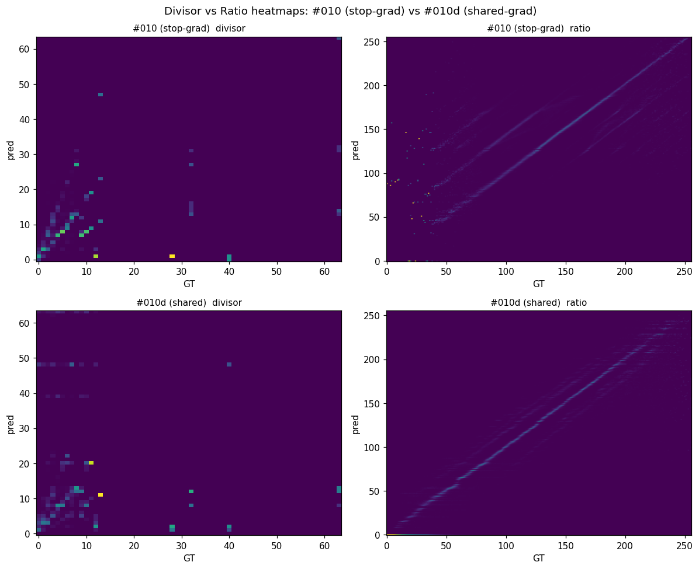
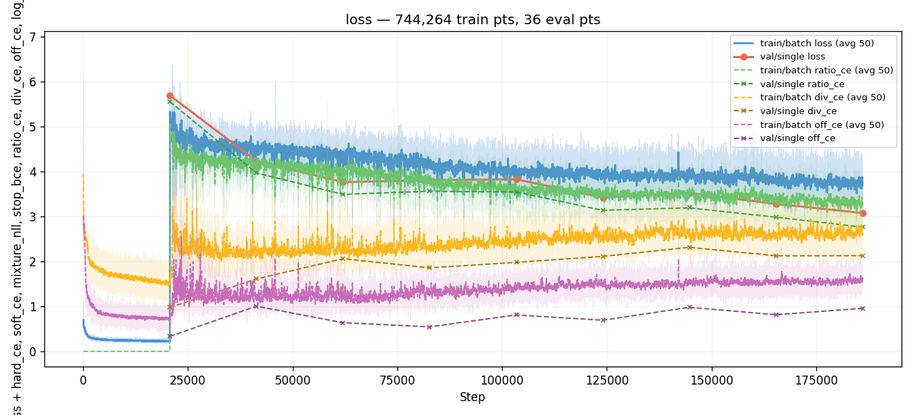
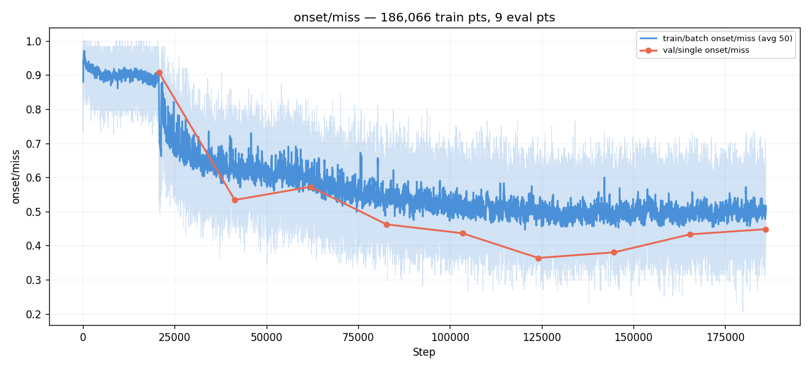
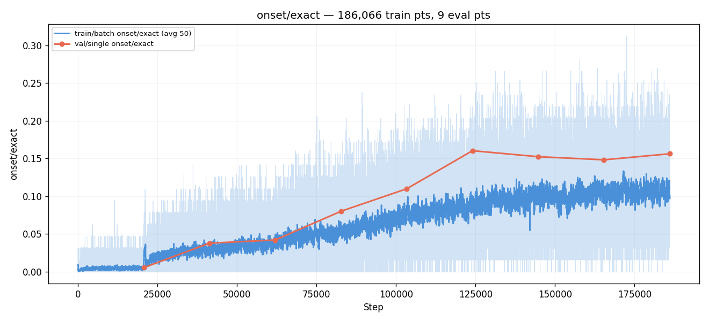
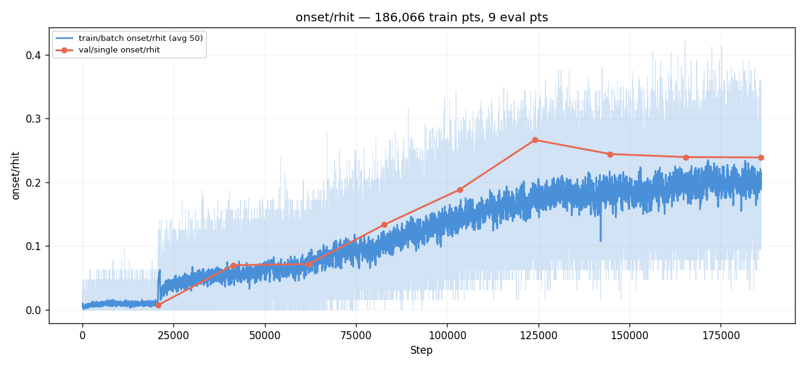
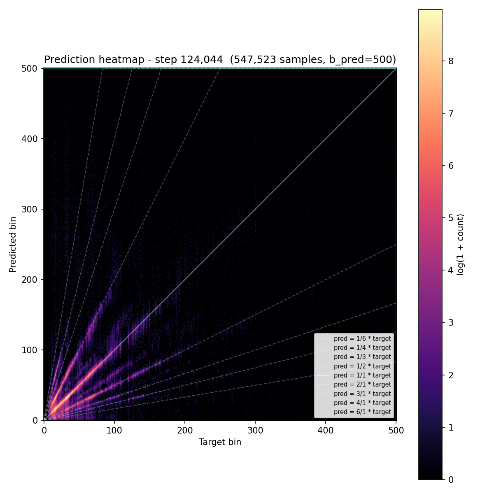
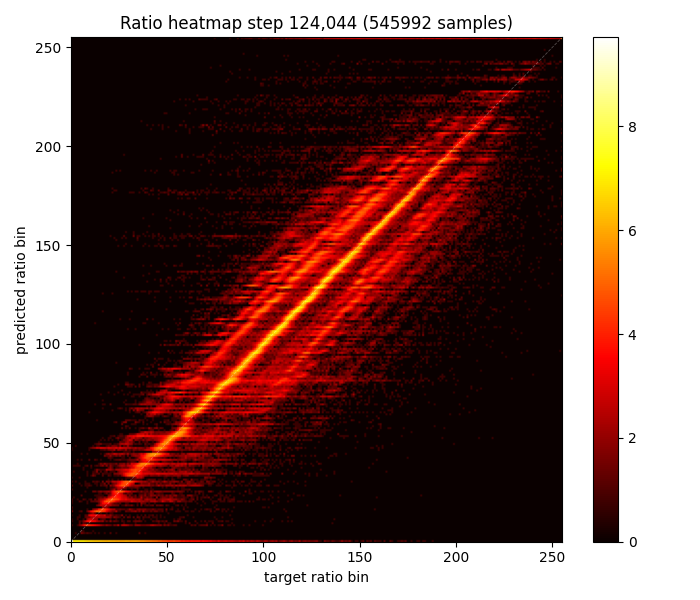
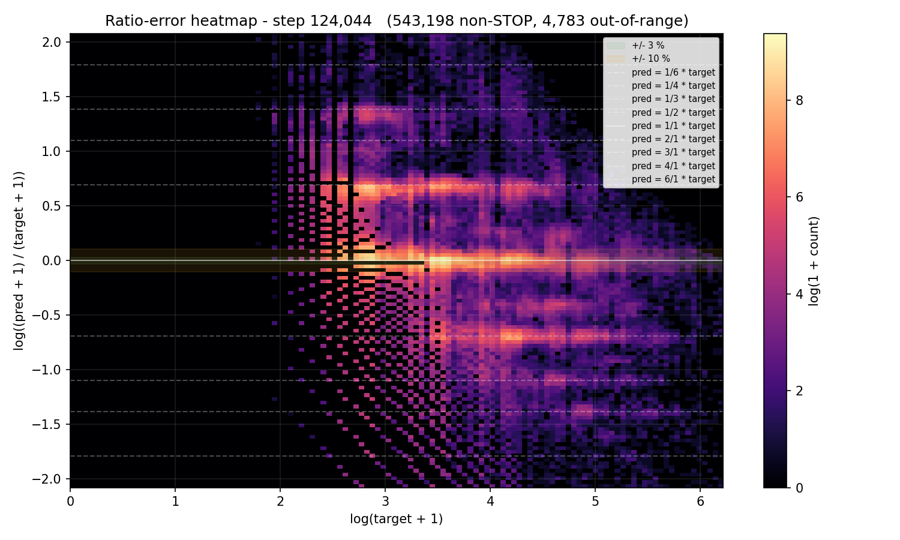
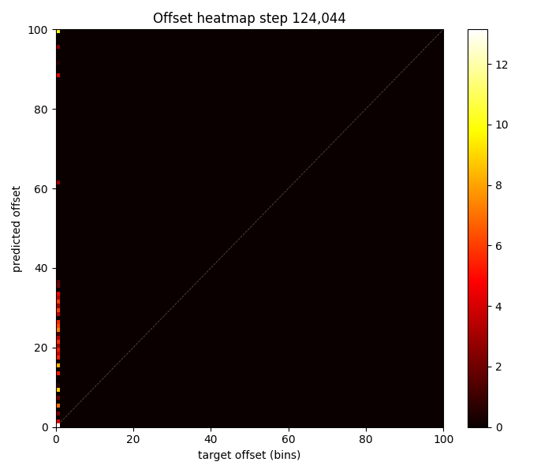

# Experiment 010d — Ratio decomposition with shared gradients

## Status

`Complete`

## Context

[#010](../010-ratio-decomposition/), [#010b](../010b-ratio-smooth-k3/),
and [#010c](../010c-ratio-128bins/) all converged to the same
plateau (miss ≈ 0.33, rgood ≈ 0.66). Bin count and Conv1d kernel
size don't change the ceiling. The ratio error histograms in all
three runs show the same systematic "non-musical-ratio prediction"
blur — predictions continuously distributed between musical-ratio
peaks instead of concentrated at them.

The remaining unexplored knob: the **stop-gradient** between the
auxiliary heads (divisor, offset) and the ratio head. taiko1 exp 67
and taiko2 #010 both detach the soft expectations `div_val` and
`off_val` before they enter the ratio head — so the ratio loss
gradient never flows back into the divisor/offset heads. The aux
heads only train via their own auxiliary CE losses.

This experiment removes that detach. The ratio loss can now shape
divisor and offset predictions too, providing a richer training
signal that might break the systematic blur — or destabilize
training, if the ratio loss's gradient pollutes the aux heads.

## Citations

- Direct parent: [#010](../010-ratio-decomposition/). Same
  configuration, only difference is `aux_stop_gradient: false`.
- Plateau context: [#010b](../010b-ratio-smooth-k3/),
  [#010c](../010c-ratio-128bins/) — both confirmed the 0.33
  ceiling is structural to the ratio decomposition.
- Original design: taiko1 exp 67 used stop-gradient by default
  ("Loss A: divisor_CE + offset_CE [stop gradient from Loss B]").
  This experiment tests the alternative.

---

## Hypothesis

### Claim

Removing the gradient stop between the divisor/offset heads and
the ratio head will let the ratio loss reshape the aux predictions
toward configurations the ratio head can predict cleanly. Result:
the systematic ratio error blur reduces, and derived-bin miss drops
below 0.31, breaking the plateau #010/#010b/#010c hit.

### Mechanism

In #010, gradient flow is one-directional:
```
ratio_loss → ratio head only
div_ce    → divisor head only
off_ce    → offset head only
```

The ratio head sees `div_val + off_val` as INPUTS but cannot
influence them. If the ratio head can't predict cleanly given a
particular `(div_val, off_val)` configuration, it has no way to
suggest a different one. The aux heads optimize their own losses
in isolation — they have no idea what would help the ratio head.

In #010d:
```
ratio_loss → ratio head AND (via soft expectation backprop) div+off heads
div_ce    → divisor head
off_ce    → offset head
```

The ratio head can now backprop "your divisor estimate is making
my prediction harder" through `div_val` into the divisor head.
The divisor head's training is the union of:
- div_ce gradient (match GT divisor)
- ratio_loss gradient (produce a divisor that helps the ratio head)

If these are aligned, the system finds a better joint optimum than
either head could find alone. If they conflict, the divisor head
might drift away from GT to give the ratio head an easier target —
which would show up as div_acc dropping while ratio metrics
improve. Either outcome is informative.

The systematic blur in #010 may stem from the ratio head being
forced to predict against div/off predictions it can't influence.
With shared gradients, the heads can co-optimize toward
configurations that produce cleaner ratio predictions.

### Predicted numbers

| Metric | #010 best | Predicted (#010d) | Notes |
|---|---:|---:|---|
| miss | 0.329 | ≤ 0.30 | break the plateau |
| r_rgood | 0.662 | ≥ 0.72 | tighter ratio peaks |
| r_rhit | 0.498 | ≥ 0.55 | sharper musical-ratio commits |
| ratio error blur | continuous | concentrated at musical ratios | the qualitative test |
| div_acc | 0.717 | ≥ 0.65 | may drop slightly as divisor co-adapts |
| off_acc | 0.947 | ≥ 0.92 | offset more stable, less noisy gradient |

## Success criteria

- **Must have:** miss ≤ 0.31 (break the 0.33 plateau).
- **Must have:** r_rgood ≥ 0.68 (improves on #010's 0.662).
- **Nice-to-have:** ratio error histogram visibly more concentrated
  at musical-ratio peaks (less blur between).
- **Nice-to-have:** miss ≤ 0.29.
- **Fails if:** miss > 0.35 (shared gradients destabilized training).
- **Fails if:** div_acc < 0.55 (divisor head drifted too far from GT).

## Changes from baseline

Baseline: [#010](../010-ratio-decomposition/).

- `config/model.json` — `aux_stop_gradient: false` (was true / not set).
  The model's `_apply_head` will skip `.detach()` on `div_val` and
  `off_val` before they enter the ratio head's input. Ratio loss
  gradients flow back through the soft expectations into the
  divisor/offset head MLPs.
- Everything else identical to #010: same backbone, same losses,
  same augmentations, same schedule, same ratio_bins=255, same
  Conv1d (k=5, 8ch).

## Run config

- Run name: `exp_010d_shared_grad`.
- Command:
  ```bash
  osu/taiko2/.venv/Scripts/python.exe -m osu.taiko2.cli.train \
      --run-name exp_010d_shared_grad \
      --config-dir osu/taiko2/experiments/010d-ratio-shared-grad/config \
      --dataset taiko2_v1 --device cuda \
      --time-stretch-prob 0.3 --time-stretch-max-scale 1.4 \
      --cursor-shift-prob 0.3 \
      --benchmarks all --benchmark-fraction 0.05 \
      --train-noaug-fraction 0.05 \
      --infer-corpus-spec osu/taiko2/experiments/010d-ratio-shared-grad/config/infer.json \
      --infer-corpus-config osu/taiko2/configs/infer_corpus_per_eval.json
  ```

---
<!-- Post-run below -->
---

## Results summary

Run stopped at **eval 9 / step 186,066**. Best val miss was
**eval 6 (0.3637 @ step 124,044)**, then drifted between 0.38 and
0.45 through E7–E9. Wall time: ~19 hours across 9 evals.

Shared gradients did not break the plateau. Best-by-miss eval
trailed #010's best by **3.5 pp** (0.364 vs 0.329). Every other
val metric also regressed: hit −12.5 pp, exact −21.4 pp, stop_f1
−9.9 pp, rgood −2.9 pp, rhit −5.4 pp, div_acc **−33.1 pp** (0.717 →
0.386), ratio_ce 2.63 → 3.14. The only metric that didn't move was
frame_err_p90 (35 in both).

The headline finding is **qualitative, not numeric**: the divisor
heatmap collapsed from a crisp diagonal (#010's musical-tempo
prediction) into the same diffuse fanning rays the pre-decomposition
direct-bin detector produced — the divisor head is no longer
predicting tempo, it's predicting noise. Meanwhile the ratio
heatmap turned into a near-perfect diagonal in raw bin space (with
small offsets), which is impossible for a real musical-ratio
predictor. Together these mean the decomposition collapsed: ratio
head is producing `bin / div_pred` to invert the divisor noise back
into a correct bin, instead of encoding a musical ratio. The
multiplication still recovers the right bin (which is why miss
didn't completely fall apart), but the structural prior the
decomposition was supposed to provide is gone.

Shared gradients let the ratio loss find the easiest joint optimum,
which turned out to be **"ignore the decomposition entirely."** This
also explains the rhit improvement on later evals: with the divisor
producing uniform noise, the ratio head's diagonal is correct on
the bin = div × ratio identity by construction — it's not finding
musical ratios, just inverting noise.

### Final vs baseline

Best-by-miss eval: #010 E7 (step 144,718) vs #010d E6 (step 124,044).

| Metric | #010 @ E7 | #010d @ E6 | Δ |
|---|---:|---:|---:|
| val/single/onset/miss | 0.3285 | 0.3637 | **+3.5 pp** |
| val/single/onset/hit | 0.6514 | 0.5260 | −12.5 pp |
| val/single/onset/exact | 0.3747 | 0.1603 | **−21.4 pp** |
| val/single/onset/frame_err_p90 | 35 | 35 | 0 |
| val/single/onset/stop_f1 | 0.5191 | 0.4204 | −9.9 pp |
| ratio/div_acc | 0.7169 | **0.3858** | **−33.1 pp** |
| ratio/div_acc_3 | 0.7725 | 0.5157 | −25.7 pp |
| ratio/off_acc | 0.9468 | 0.9337 | −1.3 pp |
| ratio/rgood | 0.6620 | 0.6332 | −2.9 pp |
| ratio/rhit | 0.4979 | 0.4436 | −5.4 pp |
| ratio_ce | 2.6286 | 3.1353 | +0.51 |

### Per-eval progression

| E | Step | miss | hit | exact | rgood | rhit | div_acc | div_3 | off_acc | ratio_ce | fe_p90 | stop_f1 |
|---:|---:|---:|---:|---:|---:|---:|---:|---:|---:|---:|---:|---:|
| 1 | 20,674  | 0.908 | 0.024 | 0.006 | 0.025 | 0.006 | **0.715** | 0.755 | 0.911 | 5.55 | 157 | 0.000 |
| 2 | 41,348  | 0.534 | 0.185 | 0.038 | 0.421 | 0.134 | 0.469 | 0.675 | 0.726 | 3.97 | 36 | 0.380 |
| 3 | 62,022  | 0.572 | 0.199 | 0.042 | 0.492 | 0.283 | 0.364 | 0.482 | 0.855 | 3.49 | 41 | 0.311 |
| 4 | 82,696  | 0.462 | 0.329 | 0.080 | 0.549 | 0.281 | 0.430 | 0.559 | 0.841 | 3.56 | 40 | 0.329 |
| 5 | 103,370 | 0.436 | 0.415 | 0.110 | 0.556 | 0.321 | 0.409 | 0.573 | 0.813 | 3.54 | 41 | 0.314 |
| **6** | **124,044** | **0.364** | **0.526** | **0.160** | **0.633** | 0.444 | 0.386 | 0.516 | **0.934** | 3.14 | **35** | **0.420** |
| 7 | 144,718 | 0.380 | 0.510 | 0.152 | 0.614 | 0.413 | 0.290 | 0.484 | 0.802 | 3.19 | 36 | 0.397 |
| 8 | 165,392 | 0.433 | 0.474 | 0.148 | 0.604 | 0.455 | 0.409 | 0.530 | 0.811 | 2.98 | 40 | 0.451 |
| 9 | 186,066 | 0.448 | 0.471 | 0.156 | 0.621 | **0.488** | 0.390 | 0.479 | 0.710 | **2.76** | 42 | 0.414 |

E1 was the warmup eval. E2 first saw ratio training. The miss-best
eval is E6, but ratio_ce and rhit kept improving through E9 — the
decomposition was still being optimized after miss plateaued, just
in the wrong direction (toward decomposition collapse).

### train_noaug

| E | val miss | noaug miss | gap (pp) |
|---:|---:|---:|---:|
| 6 | 0.364 | 0.367 | +0.34 |
| 9 | 0.448 | 0.441 | −0.65 |

Near-zero overfitting at best (E6) and at end (E9). The collapse
into bypass mode generalizes fine — the model isn't memorizing,
it's solving the wrong problem.

### Cheating signal

The custom 4-panel below stacks divisor and ratio heatmaps from
#010 (top row, stop-grad) and #010d (bottom row, shared-grad) at
each run's best-by-miss eval.


*Top-left: #010 divisor — sharp diagonal, harmonic banding at 2× /
0.5× (acceptable; 72% exact). Top-right: #010 ratio — diagonal
present but with floor at bin ~60 and visible musical-ratio
structure. Bottom-left: #010d divisor — diffuse fanning rays, no
clean diagonal, **identical pattern to the pre-decomposition direct
detector**. The divisor head has stopped predicting tempo. Bottom-
right: #010d ratio — near-perfect diagonal across the entire range,
which is structurally impossible for a musical-ratio target unless
the ratio head is computing `bin_target / div_pred` to invert the
divisor noise back into a correct bin.*

Read together, the bottom row says: the model found a degenerate
solution where divisor outputs uninformative noise and ratio
outputs the inverse-noise needed to recover the right bin after
multiplication. The product is approximately right (which is why
miss didn't collapse), but neither head is encoding what its name
says it should encode. The decomposition has effectively been
bypassed.

This is the failure mode taiko1 exp 67 originally introduced
stop-gradient to prevent. Removing it reproduced the failure.

## Visualizations


*Loss components. ratio_ce dropped 5.55 → 2.76 over the run (still
above #010's 2.63 final); div_ce and off_ce stayed low. The aux
heads converge fast on their own losses but the divisor head's CE
no longer reflects useful structure once shared gradients corrupt
its outputs.*


*Derived-bin miss across evals. 0.91 → 0.36 (E6 best) → drifts up
to 0.45. The plateau forms around miss ≈ 0.40 with high variance,
unlike #010's stable 0.33.*


*EXACT climbs to 0.16 (vs #010's 0.38) — far worse precision. The
collapsed decomposition can't produce sharp predictions; the
diagonal-in-bin-space ratio is too smooth.*


*rhit climbed monotonically 0.006 → 0.488 across the run, even past
the miss plateau. Misleading on its own — high rhit here means the
ratio head's diagonal matches the dynamic target identity (which is
trivially `bin / div_pred`), not that musical ratios are being
predicted.*


*Final-bin prediction heatmap. Diffuse diagonal — multiplication
reconstructs roughly-right bins despite component-level collapse.*


*GT divisor vs predicted divisor. Compare to #010's clean diagonal
— this is fanning rays with no structure. div_acc 0.39 confirms.*


*GT ratio bin vs predicted ratio bin. Near-perfect diagonal across
the full range — the cheating signature.*


*Histogram of log(pred_ratio / true_ratio). Strong central peak
because the ratio head matches the dynamic target by construction
when divisor is noise; the `±log 2` ridges are smaller than #010's
because the harmonic-confusion errors live in the divisor head now.*


*All mass at (0, 0) — expected; val never exposes non-zero offsets.
off_acc 0.93 ≈ #010's 0.95.*

## Vs prediction

- miss ≤ 0.31: actual **0.364** → **MISS** by 5.4 pp.
- rgood ≥ 0.68: actual **0.633** → **MISS** by 4.7 pp.
- rhit ≥ 0.55: actual 0.488 best (0.444 at E6) → **MISS**.
- ratio error blur "concentrated at musical ratios": **MISS**
  qualitatively — the blur moved from ratio head to divisor head
  rather than disappearing.
- div_acc ≥ 0.65 (must-have): actual **0.386** → **MISS** by 26.4 pp,
  also crosses the **fails-if div_acc < 0.55** threshold.
- off_acc ≥ 0.92: actual 0.934 at E6 → **MET** (only metric).

**One of six gated predictions met. Hypothesis falsified.** The
shared-gradient configuration triggered the exact failure
stop-gradient was originally added to prevent: the ratio loss
reshaped div/off toward configurations that minimize ratio loss
trivially, not toward configurations that match the GT divisor.

## Takeaways

- **Shared gradients break the decomposition.** The divisor and
  ratio heads found a degenerate joint optimum where divisor
  outputs noise and ratio inverts it. The product is approximately
  right but neither head encodes meaningful musical structure.
  This is the failure mode taiko1 exp 67 introduced stop-gradient
  to prevent.
- **div_acc is a load-bearing diagnostic.** When it drops from
  0.72 to 0.39, every other metric on the bin domain regresses,
  even when ratio metrics look superficially similar. div_acc is
  the canary for decomposition collapse.
- **rhit is misleading without div_acc context.** The ratio head's
  diagonal matches the dynamic target identity `bin / div_pred`
  trivially when the divisor produces uniform noise. High rhit
  here is not evidence of musical-ratio learning.
- **The dynamic ratio target invites this collapse.** Because
  `ratio_target = (bin + off) / div`, the ratio head can satisfy
  its target by producing exactly `bin_target / div_pred` —
  shared gradients let it discover this shortcut. A static
  GT-derived ratio target (e.g. derived from GT divisor + offset
  rather than predicted ones) might be immune. Worth filing.
- **Even 0.7 div_acc may not be enough.** With shared gradients
  it collapsed to 0.39 in the wrong direction. With stop-gradient
  (#010) it stabilized at 0.72 but the ratio head still produced
  systematic blur. The next question is whether *higher* div/off
  accuracy (0.85+) would let the ratio head produce sharper
  predictions, or whether the multiplicative precision floor is
  structural regardless.
- **#010 remains the ratio-decomposition baseline.** All four
  ratio runs (#010, #010b, #010c, #010d) are now mapped — bin
  count and Conv1d kernel don't matter, and shared gradients
  actively hurt.

## Followup questions

- **Does higher-accuracy div/off (frozen from a converged source)
  produce a cleaner ratio head?** With the aux heads frozen, the
  ratio head can't drag them off-target — and it has to work
  against high-quality div/off rather than against its own noise.
  This directly tests the user's two questions: (a) does better
  div/off improve ratio?, and (b) does freezing div/off improve
  ratio? Natural setup for #011.
- **Static (GT-based) ratio target.** Replace the dynamic
  `(bin + off_pred) / div_pred` with `(bin + off_gt) / div_gt`
  during training. Removes the inversion shortcut. Can be combined
  with frozen aux heads or run alone.
- **Does the multiplicative precision floor limit *any* ratio
  decomposition?** Even with perfect div_acc, `bin = div × ratio`
  amplifies ratio errors by ~div magnitude. At div ≈ 60 bins, a
  10% ratio error is 6 bins of frame error. This may be a
  structural ceiling regardless of head quality.
