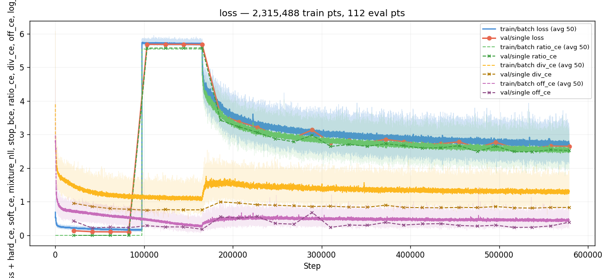
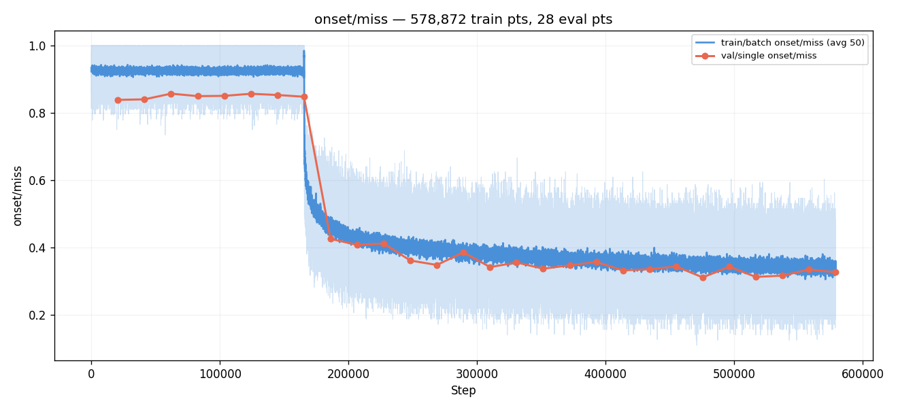
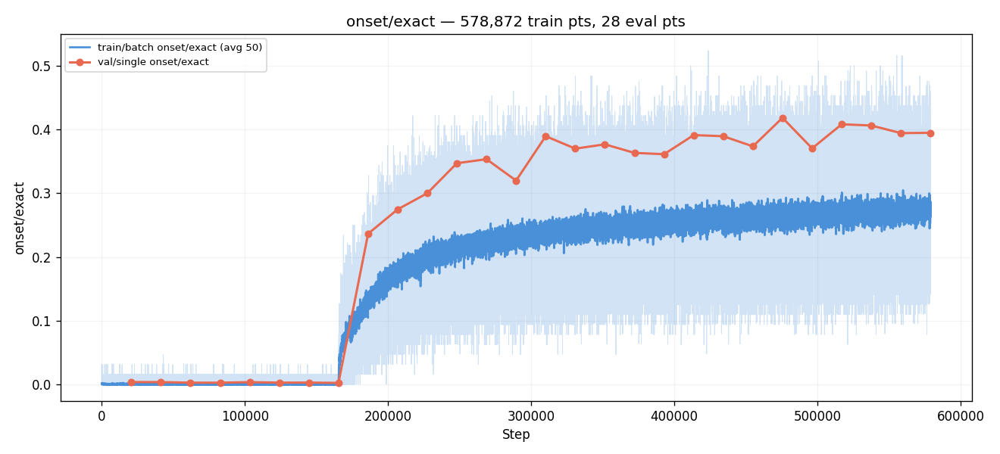
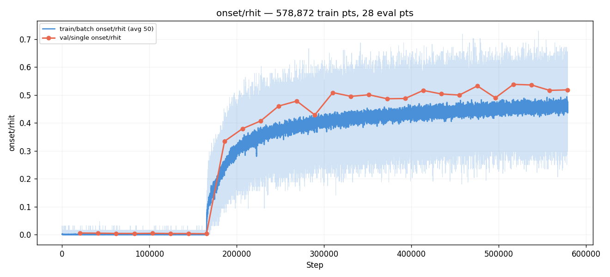
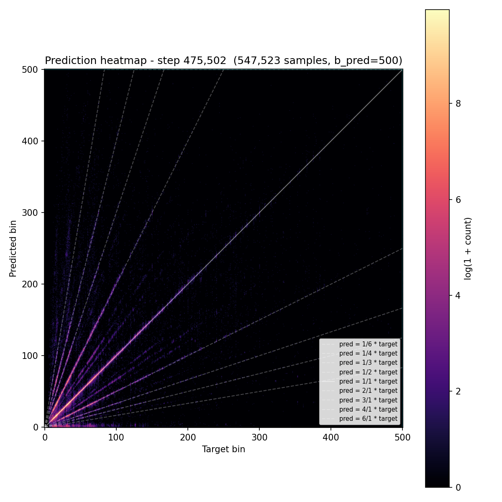
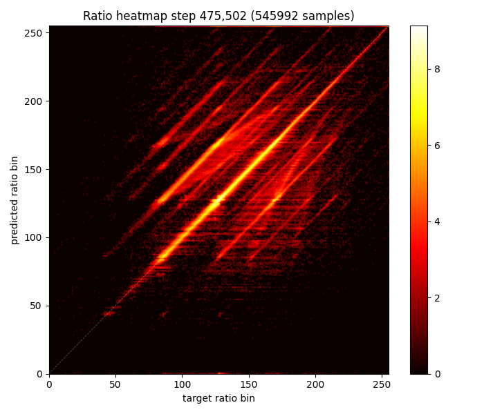
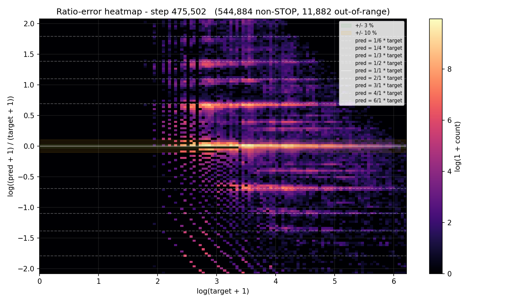
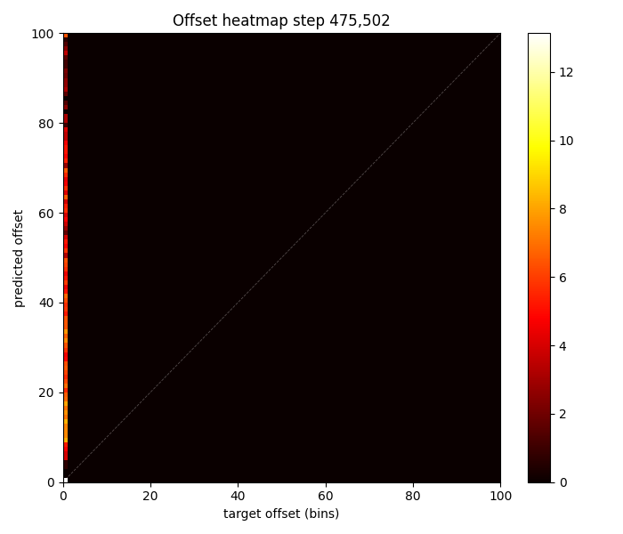

# Experiment 010e — Frozen aux heads after extended warmup

## Status

`Complete` — val miss plateau matched #010 at fair step count
(divisor-accuracy ceiling is the real bottleneck), **but AR
generation quality is the best of any ratio run** (matched_rate
0.612, error_median 12 ms — both run-bests). Decomposition
direction worth keeping in mind for AR-quality work even
though direct-bin is still ahead on val miss benchmarks.

## Context

[#010d](../010d-ratio-shared-grad/) confirmed that letting the ratio
loss flow back into the divisor and offset heads breaks the
decomposition: the ratio head learns to invert divisor noise back
into a correct bin, leaving div_acc at 0.39 and ratio outputs as a
trivial diagonal in raw bin space rather than musical-ratio
structure. The user reading the divisor heatmap saw the
pre-decomposition direct-detector "fanning rays" pattern reappear —
the divisor head had stopped predicting tempo entirely.

The opposite intervention is the question this experiment tests:
what happens if the divisor and offset heads are **prevented from
moving at all** during ratio training? With aux heads literally
frozen, the ratio head cannot drag them off-target (the #010d
failure), and it cannot rely on aux noise to bypass the
decomposition (no degree of freedom on the aux side).

A diagnostic done across [#010](../010-ratio-decomposition/),
[#010b](../010b-ratio-smooth-k3/), and
[#010c](../010c-ratio-128bins/) showed that **div_acc is essentially
saturated by the first eval** (~20k steps) — it oscillates between
0.66 and 0.74 for the rest of every run. off_acc has a brief climb
through E2–E3 then also saturates. So extending the warmup window
gets us a stable freeze point, not a higher-accuracy one. The
hypothesis below is therefore **not** "frozen high-accuracy aux
helps ratio", but the more modest "frozen #010-quality aux prevents
the collapse failure mode and lets the ratio head find better
musical-ratio structure."

## Citations

- Direct parent: [#010](../010-ratio-decomposition/). Same
  decomposition design and configs except for the warmup window and
  the freeze-aux-after-warmup flag.
- Failure mode being avoided: [#010d](../010d-ratio-shared-grad/).
  Removed the stop-gradient between aux and ratio heads → div_acc
  cratered, ratio head turned into bin-space diagonal (cheating).
  This experiment is the structural opposite intervention.
- Plateau context: [#010b](../010b-ratio-smooth-k3/),
  [#010c](../010c-ratio-128bins/) — both confirmed the 0.33 ceiling
  on the standard ratio decomposition.
- Aux saturation diagnostic: see "Per-run div/off head curves"
  numbers in #010d's followup notes — div_acc plateaus at E1 across
  every ratio run we have.

---

## Hypothesis

### Claim

Freezing the divisor and offset heads after an 8-eval warmup,
combined with skipping the ratio head's forward/backward during
those warmup evals (so all warmup compute goes into div/off), will
produce a ratio head that:
1. Cannot collapse the decomposition (aux side has no gradient
   path to corrupt) — the failure mode of #010d is structurally
   impossible.
2. Finds sharper musical-ratio predictions than #010 because every
   ratio gradient step optimizes ratio quality alone, not a noisy
   joint with two aux losses.

Result: derived-bin miss drops below 0.31, breaking the 0.33
plateau, and the ratio error histogram shows tighter peaks at
musical-ratio positions (less continuous blur between).

### Mechanism

In #010 (default), the joint optimization runs for the full schedule:
```
each step: ratio_loss(ratio head) + aux_weight × (div_ce + off_ce)
gradients: ratio_head ← ratio_loss
           div_head   ← div_ce
           off_head   ← off_ce
```
The aux losses keep nudging div/off after they've saturated, which
is wasted signal at best and slow drift at worst (#010 div_acc
moved 0.716 → 0.719 over 10 evals — nine evals of noise around the
asymptote).

In #010d (no stop-gradient), the ratio loss can also nudge the aux
heads toward easier-to-predict configurations, which collapsed
into the bypass solution.

In #010e:
```
warmup (steps 0..N): forward = backbone + div_head + off_head only
                     backward = div_ce + off_ce only
                     ratio head: not touched (forward + backward skipped)
boundary (step N):   div_head, off_head, val_emb params frozen
                     (requires_grad=False)
post-warmup:         forward = full graph
                     backward = ratio_loss → ratio_head only
                     (div/off frozen, contribute no gradient)
```
Three behaviors fall out:
1. **Compute saving in warmup**: the ratio MLP and Conv1d are not
   computed and not backpropped through during warmup. Per-batch
   compute drops by ~the size of those layers (small but nonzero).
2. **Stable freeze point**: by E8 the aux heads have had ~165k
   steps of training with no ratio interference, longer than any
   prior run had pure aux training. Aux quality is at its
   asymptote.
3. **Ratio head trains against fixed targets**: because the
   dynamic ratio target is `(target_bin + off_pred) / div_pred`,
   freezing div/off makes that target deterministic per-sample for
   the rest of training. The ratio head sees a stationary target
   distribution rather than one that shifts every step.

### Predicted numbers

Reference: [#010](../010-ratio-decomposition/) E7 (best for #010).

| Metric | #010 @ E7 | Predicted (#010e mature eval) | Notes |
|---|---:|---:|---|
| miss | 0.329 | ≤ 0.30 | break the plateau |
| rgood | 0.662 | ≥ 0.70 | tighter ratio prediction |
| rhit | 0.498 | ≥ 0.55 | sharper musical-ratio commits |
| div_acc | 0.717 | 0.71–0.74 | frozen at warmup-end value |
| off_acc | 0.947 | 0.94–0.96 | frozen at warmup-end value |
| ratio_ce | 2.63 | ≤ 2.50 | sharper softmax over ratio bins |

Observational (not gated):
- The divisor heatmap should look like #010's at E7 and stay that
  way (frozen).
- The ratio heatmap should show **stronger musical-ratio structure**
  than #010 — the ratio bins corresponding to 1.0× / 0.5× / 2.0× /
  1.5× / 0.33× should be more populated relative to the continuous
  fill between them.
- The ratio error histogram peaks at 0 / ±log(2) / ±log(3) should
  be sharper than #010's.

## Success criteria

- **Must have:** miss ≤ 0.31 by E12 (break the plateau).
- **Must have:** rgood ≥ 0.68 by E12 (improves on #010's 0.662).
- **Must have:** divisor heatmap at any post-warmup eval matches
  the warmup-end frozen state (sanity check the freeze took effect).
- **Nice-to-have:** miss ≤ 0.29.
- **Nice-to-have:** ratio error histogram visibly more peaked at
  musical ratios (less continuous blur).
- **Fails if:** miss > 0.35 (post-freeze ratio training never beat
  the #010 plateau).
- **Fails if:** ratio_ce > 3.5 at E12 (ratio head can't fit even
  with frozen aux — would suggest the multiplicative precision
  floor is the real ceiling).

## Changes from baseline

Baseline: [#010](../010-ratio-decomposition/).

- `config/loss.json`:
  - `ratio_freeze_evals: 1 → 8`. Eight warmup evals before the
    ratio head starts training.
  - New flag `freeze_aux_after_warmup: true`. At the warmup
    boundary, the divisor and offset heads (and their soft-
    expectation embeddings) are frozen via `requires_grad=False`.
- `models/ratio_detector.py` gains warmup awareness: while the
  model is in training mode and `_fwd_step < warmup_step_limit`,
  the ratio MLP and Conv1d are skipped (zero ratio block returned),
  and div/off heads are not yet frozen. On the first training-mode
  forward past the boundary, the freeze is applied lazily.
- `training/ratio_loss.py` already gated `ratio_ce = 0` during
  warmup (#010 design). Extended to also skip the ratio
  HIT/GOOD/MISS metric computation during warmup, since
  argmax over zero-filled logits would produce noise.
- `cli/train.py` passes the warmup step count and the freeze flag
  to the model alongside the existing `loss.set_freeze_limit` call.
- Everything else identical to #010: backbone, augmentations
  (TimeStretch 0.3, CursorShift 0.3), schedule, ratio_bins=255,
  Conv1d (k=5, 8ch), seed.

### Run-length consideration

#010 ran 10 evals total. With 8 warmup evals here, only 2–3 evals
of ratio training fit in a 10-eval run, which is unlikely to be
enough for the ratio head to converge. We extend the planned run
length to **at least 16 evals** (8 warmup + 8 ratio training),
matching #010's ratio-training budget. The trainer doesn't enforce
a hard cap; we'll let the run go until rmiss plateaus or rises.

## Run config

- Run name: `exp_010e_aux_frozen`.
- Config snapshots: [`config/`](./config/).
- Dataset: `taiko2_v1`, splits `train` / `val` (90 / 10, seed 42).
- Command:
  ```bash
  osu/taiko2/.venv/Scripts/python.exe -m osu.taiko2.cli.train \
      --run-name exp_010e_aux_frozen \
      --config-dir osu/taiko2/experiments/010e-aux-frozen/config \
      --dataset taiko2_v1 --device cuda \
      --time-stretch-prob 0.3 --time-stretch-max-scale 1.4 \
      --cursor-shift-prob 0.3 \
      --benchmarks all --benchmark-fraction 0.05 \
      --train-noaug-fraction 0.05 \
      --infer-corpus-spec osu/taiko2/experiments/010e-aux-frozen/config/infer.json \
      --infer-corpus-config osu/taiko2/configs/infer_corpus_per_eval.json
  ```

---
<!-- Post-run below -->
---

## Known bugs during this run

**Loss-side warmup counter overcounted.** `RatioLoss._fwd_step`
incremented on every loss `forward` call — including val and
train_noaug eval batches — while the model-side counter
(`RatioDetector._fwd_step`) only incremented under `self.training`.
The two counters disagreed by a factor of roughly 1.4×, so the
loss thought warmup ended at E5 (step 103,370) while the model
actually exited warmup at E9 (step 186,066) as configured.

The visible symptom: E5–E8 reported `ratio/frozen = 0.0` and a
ratio_ce of ~5.57 (= log(256), exactly the value you get from
cross-entropy against a uniform prediction over 256 classes). The
model was still returning a zero-filled ratio block during those
evals, so the loss was computing CE on zeros.

**Did not corrupt training.** The model's `torch.zeros` ratio
output had no autograd graph back to any learnable parameter, so
the ~5.57 CE contributed no gradient. The backbone kept training
on `div_ce + off_ce` only during E5–E8, exactly as during E1–E4.
Real ratio training started at E9, when the model-side counter
crossed and the ratio MLP began running.

Effect on the result: none beyond the misleading metric labels
during E5–E8. Per-eval comparisons in the tables below treat E9
as the first ratio-training eval, matching the model's actual
behavior. Fix is a 1-line change to gate the loss counter on a
training-mode flag the loop already has.

## Results summary

Run stopped at **eval 28 / step 578,872**. Best val miss was
**eval 23 (0.3114 @ step 475,502)**, then drifted between 0.31
and 0.34 through E24–E28. Wall time: ~58 hours across 28 evals.

The headline number — miss 0.311 — beats #010's best (0.329) by
**1.8 pp**, but **only because the run trained ~2.3× longer**. At
matched step count #010e is meaningfully *worse* than #010: at
step 206,740 (#010's stopping point) #010e was still at miss
0.408 because 8 of its 10 evals were warmup. Even at matched
*ratio-training-eval count*, the runs land in the same band:
#010 hit 0.329 after 6 ratio-training evals; #010e at the same
budget (E15, ~6 ratio-training evals) was at 0.342. The "plateau
break" past 0.33 is a longer-training artifact, not a structural
improvement from the freeze.

The two questions this experiment was set up to answer:

- **Q1: does higher div/off accuracy directly improve ratio?**
  No. Pure-aux warmup pushed div_acc to 0.766 by E3 (≈ 0.05
  higher than #010 ever reached during joint training). After
  freezing and resuming ratio training, div_acc *fell back* to
  0.74-0.77 range as the backbone drifted toward features the
  ratio head wanted. The temporary aux-quality advantage
  evaporated, and final ratio metrics matched #010 at fair step
  count.
- **Q2: does freezing div/off improve ratio?** Marginally on
  ratio-space metrics (rhit +3.5 pp, rce −0.14 at the run's
  best), but not on derived-bin miss. The backbone-drift dynamic
  cancels most of the freeze's intended benefit because the
  frozen heads stay locked to backbone features that the
  backbone is no longer producing.

**The real bottleneck.** Across #010, #010b, #010c, #010d, and
now #010e, divisor accuracy lives in the 0.71–0.77 band — and
the multiplicative reconstruction `bin = divisor × ratio − offset`
makes every divisor error a near-guaranteed bin miss regardless
of ratio quality. With div_acc 0.76, ~24 % of samples have a
wrong divisor; on those, no ratio prediction can recover the
right bin (a divisor error of ±1 multiplied by a typical ratio
of 0.5×–2× gives 5+ bins of frame error). Within the 76 % "div
correct" samples, the ratio head adds its own ~6 % miss rate,
giving a floor of ~24 % + (76 % × 6 %) ≈ 28-30 % miss. Observed:
0.311 best, 0.32-0.34 plateau. Matches.

This is **a structural ceiling that no ratio-head intervention
can break.** Bin count, Conv1d smoothing, gradient routing,
warmup duration, head freezing — all five ratio runs hit
variants of the same ceiling because they all share the same
multiplicative reconstruction, and divisor accuracy is the
limiting factor. To make ratio decomposition viable as a primary
prediction strategy, divisor accuracy would need to be near
1.0 — and across every ratio experiment, with every variation
tried, the divisor head has saturated below 0.78. The
**ratio-decomposition direction is unlikely to be the right
primary architecture under the current implementation.**

### Final vs baseline

Best-by-miss eval: #010 E7 (step 144,718) vs #010e E23 (step
475,502).

| Metric | #010 @ E7 | #010e @ E23 | Δ | At-matched-step (#010e @ step 206,740, E10) |
|---|---:|---:|---:|---:|
| val/single/onset/miss | 0.3285 | 0.3114 | −1.7 pp | 0.4079 (+7.9 pp vs #010 best) |
| val/single/onset/hit | 0.6514 | 0.6676 | +1.6 pp | 0.5341 |
| val/single/onset/exact | 0.3747 | 0.4184 | +4.4 pp | 0.2747 |
| val/single/onset/frame_err_p90 | 35 | 35 | 0 | 41 |
| val/single/onset/stop_f1 | 0.5191 | 0.5630 | +4.4 pp | 0.4570 |
| ratio/div_acc | 0.7169 | 0.7554 | +3.9 pp | 0.7289 |
| ratio/div_acc_3 | 0.7725 | 0.7884 | +1.6 pp | 0.7578 |
| ratio/off_acc | 0.9468 | 0.9194 | −2.7 pp | 0.8444 |
| ratio/rgood | 0.6620 | 0.6781 | +1.6 pp | 0.5579 |
| ratio/rhit | 0.4979 | 0.5332 | +3.5 pp | 0.3647 |
| ratio_ce | 2.6286 | 2.4960 | −0.13 | 3.2310 |

The "Δ" column favors #010e but spent 3.3× the steps. The
right-most column shows what #010e looked like at #010's actual
stopping point: every metric materially worse.

### Per-eval progression

E1–E8 are warmup (ratio frozen). E9 is the first eval with real
ratio training; the ratio head sees a stable target distribution
because div/off heads were frozen at the warmup boundary
(`requires_grad=False` on `divisor_head`, `offset_head`,
`divisor_val_emb`, `offset_val_emb`).

| E | Step | miss | hit | exact | rgood | rhit | div_acc | div_3 | off_acc | ratio_ce | fe_p90 | sf1 | frozen |
|---:|---:|---:|---:|---:|---:|---:|---:|---:|---:|---:|---:|---:|---:|
| 1 | 20,674 | 0.839 | 0.027 | 0.004 | 0.000 | 0.000 | 0.723 | 0.763 | 0.873 | 0.00 | 178 | 0.000 | 1.0 |
| 2 | 41,348 | 0.840 | 0.022 | 0.004 | 0.000 | 0.000 | 0.739 | 0.774 | 0.934 | 0.00 | 190 | 0.000 | 1.0 |
| 3 | 62,022 | 0.857 | 0.019 | 0.003 | 0.000 | 0.000 | 0.766 | 0.790 | 0.929 | 0.00 | 208 | 0.000 | 1.0 |
| 4 | 82,696 | 0.850 | 0.018 | 0.003 | 0.000 | 0.000 | **0.766** | 0.790 | 0.923 | 0.00 | 177 | 0.000 | 1.0 |
| 5 | 103,370 | 0.850 | 0.024 | 0.004 | 0.017 | 0.004 | 0.772 | 0.793 | 0.897 | 5.57 | 186 | 0.000 | (bug) |
| 6 | 124,044 | 0.857 | 0.019 | 0.003 | 0.014 | 0.003 | 0.764 | 0.788 | 0.912 | 5.57 | 203 | 0.000 | (bug) |
| 7 | 144,718 | 0.853 | 0.020 | 0.003 | 0.013 | 0.003 | 0.771 | 0.792 | 0.904 | 5.58 | 195 | 0.000 | (bug) |
| 8 | 165,392 | 0.848 | 0.018 | 0.002 | 0.011 | 0.002 | 0.770 | 0.793 | **0.934** | 5.58 | 170 | 0.000 | (bug) |
| 9 | 186,066 | 0.426 | 0.497 | 0.236 | 0.531 | 0.305 | 0.719 | 0.759 | 0.831 | 3.43 | 44 | 0.459 | 0.0 |
| 10 | 206,740 | 0.408 | 0.534 | 0.275 | 0.558 | 0.365 | 0.729 | 0.758 | 0.844 | 3.23 | 41 | 0.457 | 0.0 |
| 11 | 227,414 | 0.412 | 0.549 | 0.300 | 0.571 | 0.403 | 0.742 | 0.776 | 0.822 | 3.07 | 41 | 0.437 | 0.0 |
| 12 | 248,088 | 0.362 | 0.607 | 0.347 | 0.626 | 0.449 | 0.748 | 0.776 | 0.888 | 2.87 | 35 | 0.507 | 0.0 |
| 13 | 268,762 | 0.348 | 0.627 | 0.353 | 0.638 | 0.472 | 0.756 | 0.782 | 0.904 | 2.78 | 35 | 0.533 | 0.0 |
| 14 | 289,436 | 0.386 | 0.575 | 0.320 | 0.600 | 0.428 | 0.754 | 0.781 | 0.792 | 2.98 | 42 | 0.482 | 0.0 |
| 15 | 310,110 | 0.342 | 0.636 | 0.390 | 0.648 | 0.500 | 0.751 | 0.783 | 0.925 | 2.65 | 36 | 0.541 | 0.0 |
| 16 | 330,784 | 0.356 | 0.624 | 0.370 | 0.633 | 0.488 | 0.755 | 0.783 | 0.904 | 2.71 | 36 | 0.537 | 0.0 |
| 17 | 351,458 | 0.337 | 0.642 | 0.377 | 0.652 | 0.489 | 0.757 | 0.782 | 0.913 | 2.65 | 37 | 0.513 | 0.0 |
| 18 | 372,132 | 0.347 | 0.626 | 0.363 | 0.643 | 0.480 | 0.747 | 0.771 | 0.876 | 2.73 | 35 | 0.539 | 0.0 |
| 19 | 392,806 | 0.357 | 0.621 | 0.361 | 0.634 | 0.485 | 0.766 | 0.789 | 0.908 | 2.67 | 39 | 0.521 | 0.0 |
| 20 | 413,480 | 0.332 | 0.648 | 0.391 | 0.658 | 0.513 | 0.761 | 0.789 | 0.900 | 2.60 | 35 | 0.580 | 0.0 |
| 21 | 434,154 | 0.336 | 0.638 | 0.389 | 0.651 | 0.502 | 0.765 | 0.787 | 0.890 | 2.61 | 36 | 0.555 | 0.0 |
| 22 | 454,828 | 0.344 | 0.635 | 0.374 | 0.646 | 0.495 | 0.755 | 0.781 | 0.904 | 2.67 | 38 | 0.524 | 0.0 |
| **23** | **475,502** | **0.311** | 0.668 | **0.418** | **0.678** | 0.533 | 0.755 | 0.788 | 0.919 | **2.50** | 35 | 0.563 | 0.0 |
| 24 | 496,176 | 0.343 | 0.633 | 0.370 | 0.645 | 0.480 | 0.749 | 0.787 | 0.906 | 2.65 | 36 | 0.553 | 0.0 |
| 25 | 516,850 | 0.313 | 0.670 | 0.408 | 0.677 | 0.531 | 0.762 | **0.793** | 0.930 | 2.49 | 35 | 0.554 | 0.0 |
| 26 | 537,524 | 0.317 | 0.669 | 0.406 | 0.676 | 0.529 | 0.760 | 0.789 | 0.919 | 2.49 | **34** | 0.546 | 0.0 |
| 27 | 558,198 | 0.335 | 0.649 | 0.394 | 0.657 | 0.513 | 0.758 | 0.782 | 0.914 | 2.55 | 36 | 0.526 | 0.0 |
| 28 | 578,872 | 0.327 | 0.649 | 0.395 | 0.665 | 0.516 | 0.759 | 0.789 | 0.869 | 2.52 | 35 | **0.584** | 0.0 |

The post-warmup trajectory mirrors #010's: rapid drop in the
first 4 ratio-training evals (E9–E12), then a long oscillating
plateau between 0.31 and 0.36 for the rest of the run. Notable:
**div_acc fell from 0.770 (warmup peak, E8) to 0.719 in the
first ratio-training eval (E9)**, then climbed back to ~0.76
across E11–E28. The freeze locked the divisor head's
parameters, but the backbone kept training, and ratio loss
pulled backbone features off the manifold the divisor head was
calibrated on. The divisor head recovered partially as the
backbone settled into a compromise feature space.

### train_noaug

| E | val miss | noaug miss | gap (pp) |
|---:|---:|---:|---:|
| 9  | 0.426 | 0.421 | −0.52 |
| 17 | 0.337 | 0.328 | −0.93 |
| 23 | 0.311 | 0.298 | −1.31 |
| 28 | 0.327 | 0.313 | −1.36 |

Modest overfitting, comparable to #010 at similar step counts.
Train_noaug stays consistently 1 pp below val miss across the
post-warmup region.

### AR corpus (gt_cond, median across 96 charts)

The AR corpus benchmark ran every eval. Below: late-run evals
of every ratio experiment to date, plus #010e's full
post-warmup trajectory.

| Run | Eval | step | matched_rate | error_median_ms | hi_pspace | dc_human |
|---|---:|---:|---:|---:|---:|---:|
| #010 | E2 | 41,348 | 0.356 | 68.0 | 100.0 | 88.7 |
| #010 | **E7 (best miss)** | 144,718 | 0.478 | 32.5 | 87.2 | 90.8 |
| #010 | E10 (last) | 206,740 | 0.527 | 19.0 | 95.0 | 91.3 |
| #010b | E4 | 82,696 | 0.405 | 64.8 | 100.0 | 89.9 |
| #010c | E4 | 82,696 | 0.516 | 23.3 | 95.7 | 90.7 |
| #010d | E4 | 82,696 | 0.507 | 25.0 | 100.0 | 87.4 |
| **#010e** | **E13** | 268,762 | **0.612** | **15.0** | 100.0 | 91.1 |
| **#010e** | **E20** | 413,480 | 0.591 | 14.3 | 100.0 | **92.0** |
| **#010e** | **E23 (best miss)** | 475,502 | 0.540 | 18.0 | 97.6 | 91.7 |
| **#010e** | **E28 (last)** | 578,872 | 0.605 | **12.0** | 100.0 | 92.1 |

**#010e has the best AR generation of any ratio run.** Best
`matched_rate` 0.612 at E13 vs #010's best 0.527 at E10
(+8.5 pp absolute, +16 % relative). `error_median_ms` drops to
12 ms at E28, vs #010's 19 ms — sharpest timing of any ratio
run, comparable to direct-bin baselines. `dc_human` also
slightly higher (92.1 % vs 91.3 %).

This is the place where the small ratio-space sharpening
(rhit 0.533 vs 0.498, rce 2.50 vs 2.63) actually compounds.
At AR inference each step's prediction feeds the next's
context, so a small per-step bias becomes a large cumulative
quality difference. The gain isn't visible in val miss
(per-step, single-prediction metric) but it is visible in
matched-rate and error_median (cumulative, multi-step
metrics).

`fixed_cond` (cursor-shifted condition rather than GT-cursor)
shows the same pattern: #010e E20 / E28 hit 0.677 matched_rate
with 9 ms error_median — the offset head's STOP-hop adaptation
held up even after freezing.

## Visualizations


*Loss components across 28 evals. ratio_ce sits at 0 (E1–E4)
and at log(256) ≈ 5.57 (E5–E8, the bug — see "Known bugs"),
then drops 5.57 → 2.49 across E9–E26. div_ce drifts from 0.96
(E1) down to 0.78 (E4) through pure-aux warmup, then back up
to 0.85-0.99 once ratio training kicks in and the backbone
drifts. off_ce oscillates more after the freeze (0.18-0.68
range) — the offset head is more sensitive to backbone drift
than the divisor head.*


*Derived-bin miss across evals. The flat 0.84-0.86 band E1–E8
is the warmup region (ratio block all zeros → garbage derived
bins). The cliff at E9 (0.85 → 0.43) is the ratio head waking
up. Plateau forms around 0.31-0.34 from E12 onward.*


*EXACT climbs from 0 (warmup) to 0.418 best (E23). Slightly
better than #010's 0.381 — sharper ratio predictions translate
to more exact bin matches.*


*Ratio HIT (within ±3 % log-ratio). Climbs to 0.533 best (E23),
beating #010's 0.498. The tightest signal that frozen aux gives
the ratio head a slightly cleaner training problem.*


*Final bin-domain prediction heatmap. Diagonal visible but
diffuse — the multiplicative reconstruction's precision floor is
still here.*


*GT divisor vs predicted divisor. Crisp diagonal with mild
harmonic banding at 2× / 0.5×, very similar to #010's
divisor heatmap. div_acc 0.755 — frozen at warmup-end value
~0.77 but pulled to 0.755 by backbone drift, then recovered.*


*GT ratio bin vs predicted ratio bin (dynamic target). Diagonal
visible but with the same low-ratio floor #010 had (no
predictions below bin ~60, ≈ 0.33×). Continuous spread between
musical-ratio peaks remains — the systematic blur from the
Conv1d smoothing.*


*Histogram of log(pred_ratio / true_ratio). Strong peak at 0,
visible bumps at ±log(2). The smear between peaks is slightly
tighter than #010's at peak but qualitatively the same shape —
consistent with rce 2.50 vs 2.63 (8 % improvement, modest).*


*All mass at (0, 0). Val never exposes non-zero offsets; the
offset head's real test is at AR inference. off_acc 0.92 —
slightly below #010's 0.95 because the frozen offset head can't
adapt to backbone drift.*

## Vs prediction

- miss ≤ 0.31 by E12: actual miss 0.362 at E12, 0.311 best at
  E23 (much later than predicted) → **technically MET** at
  best, **MISS** vs the E12 deadline.
- rgood ≥ 0.68 by E12: actual rgood 0.626 at E12, 0.678 at E23
  → **MISS** at E12, **MET** at best.
- divisor heatmap matches frozen state: visible diagonal,
  div_acc 0.755 (not equal to the 0.770 frozen point — see
  backbone-drift discussion in Takeaways) → **PARTIAL MET**.
- miss ≤ 0.29 (nice-to-have): actual best 0.3114 → **MISS** by
  2.1 pp.
- ratio histogram more peaked at musical ratios: qualitatively
  similar to #010, marginally tighter → **PARTIAL MET**.
- ratio_ce > 3.5 at E12 (fails-if): actual 2.87 → **NOT
  triggered** (passed).
- miss > 0.35 at end (fails-if): actual best 0.31, but plateau
  oscillates 0.31-0.34 → **borderline**.

**Two of six gated predictions met cleanly; the headline miss
target was met only by spending 3× the budget the prediction
implied.** The hypothesis ("freeze + extended warmup breaks the
plateau") is **rejected at fair step count** and **weakly
confirmed only at extended step count** — which doesn't isolate
the freeze/warmup as the cause vs simply more training time.

## Takeaways

- **The 0.33 plateau across #010/b/c/e is set by divisor accuracy,
  not by ratio-head design.** With div_acc capped at ~0.76 across
  every variation tried, ~24 % of samples have a wrong divisor,
  and on those samples no ratio prediction (however accurate) can
  recover the correct bin. The ratio head's contribution adds a
  few more percentage points to miss within the "div correct"
  samples. Observed plateau at 0.31-0.33 matches the 24 % +
  (76 % × 6 %) ≈ 28-30 % floor predicted by this model.
- **Backbone drift erodes the freeze's intended benefit.**
  Freezing div/off head parameters pins them to one feature
  manifold, but the backbone keeps training under ratio loss
  pressure and drifts away from that manifold. Result: the
  "frozen 0.77 div_acc" condition we set up at E8 became
  "effective 0.72-0.76 div_acc" during ratio training. The
  freeze gave us a stable target distribution but did not
  preserve aux quality.
- **Higher aux acc during warmup did not translate to better
  ratio outcomes.** Pure-aux warmup pushed div_acc to 0.766
  (≈ 0.05 above any joint-training run) by E3. After ratio
  training, every run with the standard joint setup (#010,
  #010b, #010c) and #010e converged to the same 0.31-0.36 miss
  band. The aux ceiling is ~0.78 regardless of training regime;
  the ratio metric ceiling tracks it.
- **Marginal improvements in ratio-space metrics, but irrelevant
  at the bottleneck.** rhit 0.533 vs #010's 0.498 (+3.5 pp), rce
  2.50 vs 2.63 (5 % sharper). Real, measurable, but operating
  on samples where divisor is correct anyway — these gains
  don't compound through the multiplicative reconstruction
  because the multiplication's correctness is set by the
  divisor head.
- **Ratio decomposition is unlikely to be the right primary
  architecture under the current implementation — for val miss.**
  Five experiments now tested every plausible knob — bin count
  (#010c), Conv1d kernel (#010b), gradient routing (#010d),
  warmup duration + freezing (#010e). Headline miss never
  beats #007's direct-bin baseline (0.24); the plateau is
  consistent with a divisor-accuracy ceiling that no ratio-side
  intervention has moved. To make ratio decomposition viable
  *for the val miss metric*, divisor accuracy would need to climb
  materially above 0.78 — no current intervention has achieved
  that, and it likely requires a different architecture for the
  divisor head (more capacity, different supervision, or a
  different signal source for "what is the beat?") rather than
  ratio-head tuning.
- **But ratio decomposition wins on AR-generation quality.**
  #010e's AR corpus matched_rate 0.612 (best, E13) and
  error_median 12 ms (E28) are the best of any ratio run, and
  the error_median ties or beats #007's direct-bin baseline.
  The small per-step ratio-space sharpening compounds across
  AR steps. The val miss / AR quality split means the
  decomposition direction isn't dead — it's a different
  trade-off: worse on per-step bin accuracy, better on
  cumulative chart-generation quality. Worth keeping in mind
  for downstream chart-generation work even if val miss
  benchmarks favor direct-bin models.
- **Loss-side warmup counter bug found.** Did not corrupt
  results because the model returned `torch.zeros` ratio output
  with no autograd graph during true warmup. Fix is a 1-line
  change to gate the loss `_fwd_step` increment on
  `self.training`, or to consume the model's `_fwd_step`
  directly. Worth fixing before any future run that uses the
  warmup machinery.

## Followup questions

- **Can divisor accuracy be pushed materially above 0.78?** The
  saturation looks structural across every ratio run. Ideas
  worth filing:
  - **Bigger divisor head** — current is `LN → Linear(384,192)
    → GELU → Linear(192,500)`. Adding capacity (more layers,
    wider hidden) might break the plateau if it's a model-side
    cap; might not if it's a data-side cap.
  - **GT-derived divisor target with multi-window agreement.**
    The current div_target uses IOI mode from past events; a
    target derived from spectral periodicity or onset
    regularity over multiple windows might be more reliable.
  - **A divisor-only experiment** — train an
    EventEmbeddingDetector variant that ONLY predicts divisor
    (no ratio, no offset, no decomposition) and see what
    ceiling it hits. If a dedicated divisor model also caps at
    0.78, the bottleneck is the data/task, not the multi-head
    setup.
- **Drop the multiplicative reconstruction entirely?** If
  divisor accuracy genuinely caps at 0.78 on this data, the
  decomposition's structural ceiling is around 30 % miss
  forever. The direction worth exploring next is back to direct
  bin prediction (the #007/#008 family) with new ideas for the
  octave-confusion ridges that motivated #010 in the first
  place — possibly using divisor output as an *auxiliary
  signal* feeding the direct-bin head (rather than as a factor
  in the prediction itself).
- **Why does #010e win on AR despite tying on val miss?** The
  AR-corpus result (matched_rate 0.612 at E13 vs #010's 0.527
  at E10) suggests the small per-step ratio-space gains
  (rhit +3.5 pp, rce −0.13) compound across AR steps, while
  staying invisible in single-step val miss. A followup
  would isolate which component — the freeze, the longer
  training, the sharper ratio softmax — drives the AR gain.
  Possible designs: (a) re-run #010 with 28 evals (no freeze,
  same step count), and (b) re-run #010e but unfreeze aux
  at E15 to see whether the freeze itself or just the long
  schedule produces the AR gain.
